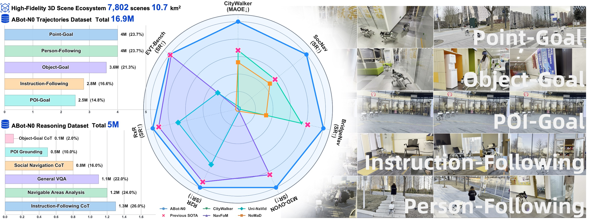
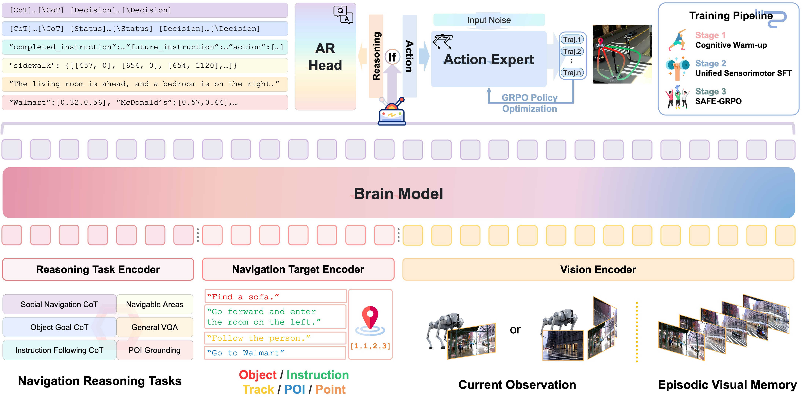
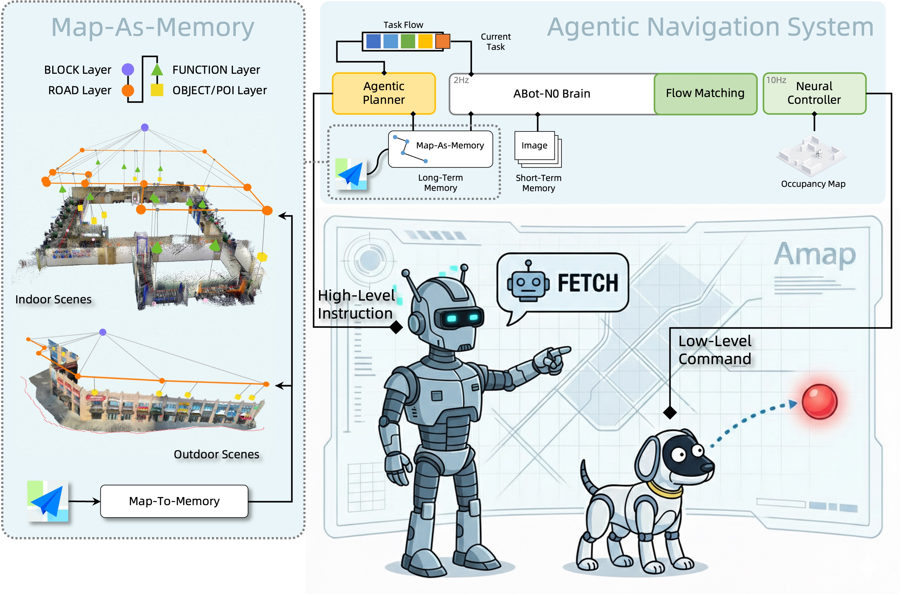
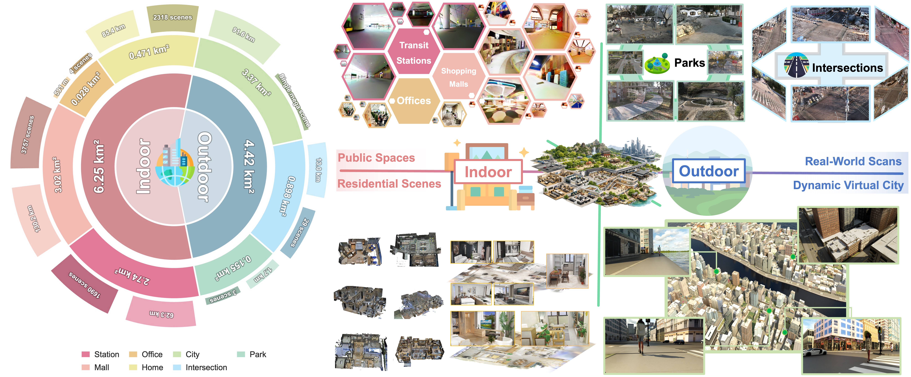
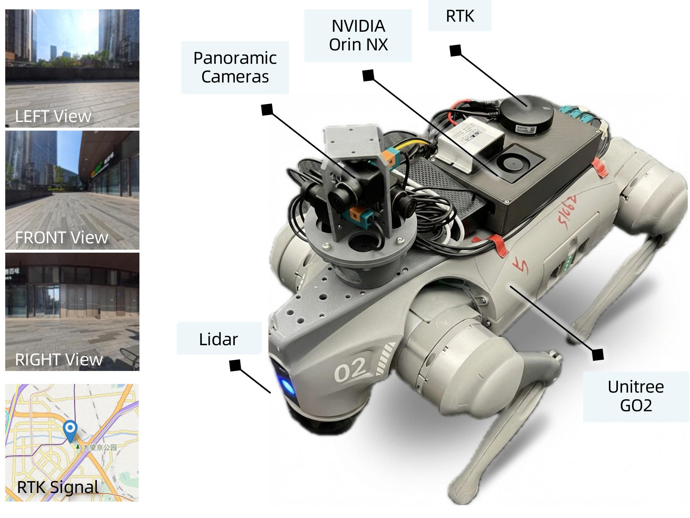
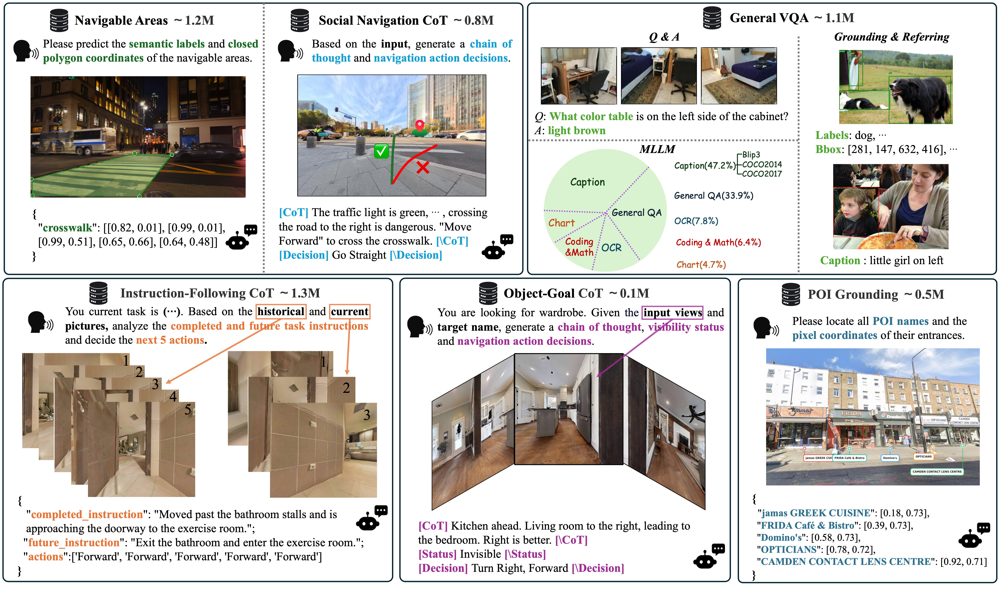

# ABot-N0 论文导读：用"大脑-动作"分层 VLA，统一五大导航任务且全部 SOTA

> **论文标题**：ABot-N0: Technical Report on the VLA Foundation Model for Versatile Embodied Navigation
> **会议/期刊**：arXiv 预印本（技术报告），2026年2月
> **作者**：Zedong Chu, Shichao Xie, Xiaolong Wu, Yanfen Shen, Minghua Luo, Zhengbo Wang, Fei Liu, Xiaoxu Leng, Junjun Hu, Mingyang Yin, Jia Lu, Yingnan Guo, Kai Yang, Jiawei Han, Xu Chen, Yanqing Zhu, Yuxiang Zhao, Xin Liu, Yirong Yang, Ye He, Jiahang Wang, Yang Cai, Tianlin Zhang, Li Gao, Liu Liu 等（共 40+ 位作者）
> **机构**：AMAP CVLab（高德地图计算机视觉实验室，阿里巴巴集团）
> **arXiv**：https://arxiv.org/abs/2602.11598
> **代码**：https://github.com/amap-cvlab/ABot-Navigation（ABot-N0 分支）
> **PDF**：[ABot-N0.pdf](./ABot-N0.pdf)

---

## 读之前先搞清楚

### 这篇论文要解决什么问题？

具身导航领域一直存在一个根本性的分裂：**每种任务都有自己专属的模型、专属的数据、专属的训练流程**。Point-Goal（走到指定坐标）是一套系统，Object-Goal（找到指定物体）是另一套，Instruction-Following（按语言指令走）又是另一套，POI-Goal（去兴趣点）还得换一套，Person-Following（跟人走）再换一套。

这种分裂导致三个致命的实际后果：

1. **开发成本爆炸**：每来一个新产品需求（比如"让机器人跟着老人走"），就要从零搭建一套新系统——新的数据采集、新的模型设计、新的训练调试。五套系统 = 五倍的开发维护成本
2. **知识无法跨任务迁移**：在"找厕所"任务上学到的空间理解（"厕所通常在走廊尽头、拐角处"），在"跟人走"任务中完全用不上——因为两个任务用的是完全不同的模型，共享不了参数
3. **真实世界不友好**：现实场景中机器人需要灵活切换导航模式。比如"先去厨房（Point-Goal），找到冰箱（Object-Goal），然后跟着主人去客厅（Person-Following）"——如果用五个独立模型，需要在运行时频繁切模型，延迟和上下文丢失都无法接受

ABot-N0 的野心极大：**用一套架构、一套权重、一套训练流程，统一覆盖全部五种主流导航任务，并且在每个任务上超越所有专用模型**。

> **小白理解**：以前的导航 AI 像一个"换工具才能干活的人"——拧螺丝要拿螺丝刀，钉钉子要拿锤子，切菜要拿刀。每换一个活就要换一个工具，工具之间不能互相帮忙。ABot-N0 是第一个"万能手"——同一只手，既能拧螺丝、又能钉钉子、又能切菜。关键是：手在拧螺丝时学会的"用力技巧"，能自动迁移到钉钉子和切菜上——因为用的是同一套"肌肉记忆"（模型权重）。

### 读懂这篇论文需要的前置知识

| 概念 | 简单解释 |
|:---|:---|
| **VLA（视觉语言动作模型）** | 同时看图、理解文字、输出机器人动作的一体化模型，是具身智能的核心技术范式 |
| **Flow Matching** | 一种训练扩散模型的方法——不是学"如何从噪声恢复到数据"，而是直接学"从噪声到数据的最短流动路径"（流速场），需要更少步骤 |
| **GRPO** | Group Relative Policy Optimization，一种强化学习算法：对一组候选方案做相对比较，好的奖励、差的惩罚，比绝对打分更稳定 |
| **Cognitive Brain（认知大脑）** | ABot-N0 中负责"理解场景含义 + 决定往哪走"的 LLM 模块，基于 Qwen3-4B |
| **Action Expert（动作专家）** | ABot-N0 中负责"生成平滑可执行轨迹"的 Flow Matching 扩散模块 |
| **课程学习** | 分阶段训练策略：先学简单的认知任务 → 再学复杂的感知-运动 → 最后做价值观对齐，模拟人类学习过程 |
| **拓扑记忆（Topological Memory）** | 把环境抽象为"节点（关键位置，如路口、门口）+ 边（可通行路径）"的图结构来长期记忆空间关系 |
| **灾难性遗忘** | 神经网络学新任务时容易"覆盖"旧任务的知识——学会炒饭就忘了煲汤。需要用推理回放等技术缓解 |

---

## 一、ABot-N0 的解决思路：Brain-Action 分层统一架构

核心 design philosophy：**不要让一个模型同时做"理解"和"执行"——分给两个专业化模块，但共享同一个统一的多模态编码器。**

### 为什么 Brain-Action 分层是正确的架构选择？

回顾三类已有方案的失败原因，可以归结为一个核心矛盾：**语义理解需要大模型（海量知识、复杂推理、几十亿参数），但实时控制需要小模型（毫秒级延迟、高频运行、几百参数）**。端到端方案让大模型干控制的活——太慢；模块化方案让小模型干理解的活——太笨。

ABot-N0 的答案：**大模型只负责"想"（Cognitive Brain），小模型专门负责"做"（Action Expert），二者通过统一的多模态编码器共享对世界的"认知"。**



*ABot-N0 整体概览。五大导航任务（Point-Goal、Object-Goal、Instruction-Following、POI-Goal、Person-Following）统一到一个 Brain-Action 分层架构中。Cognitive Brain 基于 Qwen3-4B LLM，配备双头输出（Reasoning Head + Action Head）。Action Expert 基于 Flow Matching 扩散模型生成连续轨迹。ABot-N0 Data Engine 从 7802 个高保真 3D 场景中生成了 1690 万条专家轨迹和 500 万条推理样本。*

### 架构的三个核心组件

```
                         ┌──────────────────────────────┐
                         │   Universal Multi-Modal        │
                         │        Encoder                 │
                         │  全景RGB + 视觉记忆(历史帧)      │
                         │  + 文本目标 + 几何坐标           │
                         │  → 统一 Token 序列              │
                         └─────────────┬────────────────┘
                                       │
             ┌─────────────────────────┴─────────────────────────┐
             ▼                                                   ▼
┌──────────────────────────┐                      ┌──────────────────────────┐
│   Cognitive Brain         │                      │   Action Expert           │
│   (Qwen3-4B LLM)          │   隐式动作特征传递     │   (Flow Matching)         │
│                           │ ═══════════════════→  │                           │
│ ┌───────────────────────┐ │                      │  5 个稠密 waypoint        │
│ │   Reasoning Head       │ │  "我为什么要这样走"   │  (x, y, θ) 位置+朝向      │
│ │   场景分析 + 空间推理   │ │  (文本, 可解释)       │                           │
│ │   物体定位 + 任务规划   │ │                      │  连续平滑轨迹             │
│ └───────────────────────┘ │                      │  多模态分布 → 覆盖         │
│ ┌───────────────────────┐ │                      │  多种可行路径             │
│ │   Action Head          │ │  "具体往拿走"         │                           │
│ │   导航决策 + 控制信号   │ │  (隐式, 可执行)       │  ┌───┬───┬───┬───┬───┐  │
│ └───────────────────────┘ │                      │  │w1 │w2 │w3 │w4 │w5 │  │
└──────────────────────────┘                      │  └───┴───┴───┴───┴───┘  │
                                                  └──────────────────────────┘
```

#### 组件 1：Universal Multi-Modal Encoder（统一多模态编码器）

这是 ABot-N0 的"感官中枢"。所有输入——不管来自哪个任务——都通过这个编码器转化为 LLM 能理解的 Token 序列：

- **全景 RGB 图像**（3 个 H120°×V90° 摄像头拼接 → ~270° 全景）：编码为视觉 Token
- **视觉记忆**（历史关键帧，形成"我来过哪里"的 episodical memory）：额外追加编码
- **文本目标**（语言指令 / 物体名称 / POI 名称 / 坐标数字）：编码为文本 Token
- **几何坐标**（Point-Goal 的 (x,y) 目标 / 当前位姿）：编码为特殊 Token

不同任务只需改变"目标描述"的格式：Point-Goal 传坐标（"去 (15.2, 8.7)"），VLN 传指令（"穿过走廊右转进302"），Person-Following 传目标人物特征。**编码器不关心任务类型**——它只负责把所有输入变成统一格式的 Token 序列。

> **小白理解**：这个编码器像一个"万能翻译官"——不管是中文（文字指令）、手语（像素坐标）、还是旗语（目标特征），他都翻译成同一种"内部语言"（Token 序列）。Translation 完成后，后面的大脑和执行系统就不需要知道原始输入是什么格式了——他们只用一种"内部语言"工作。

#### 组件 2：Cognitive Brain（Qwen3-4B LLM + 双头输出）

这是 ABot-N0 的"智慧核心"，也是其与 InternVLA-N1 最关键的架构差异。

**为什么用 Qwen3-4B 而不是更大的模型（如 7B/14B）？**
- 4B 参数是**边缘部署可行性**的硬约束——ABot-N0 需要在 Jetson Orin NX（16GB RAM）上运行
- 消融实验证明 4B 在导航任务上的推理能力已足够（导航不需要写诗或解数学题）
- 更小的模型 = 更快的推理（2Hz vs 如果 7B 可能只有 1Hz）

**双头设计的精妙之处**：

- **Reasoning Head**：输出**结构化 JSON 文本**，包含环境分析、空间关系和导航建议。例如：
  ```json
  {
    "location": "T字路口，走廊交叉处",
    "scene_analysis": "前方三向分叉，左侧为死路（储藏室），右侧走廊宽约2m、无障碍物",
    "spatial_reasoning": "目标'厨房'位于右侧走廊方向，需右转。右侧走廊连通餐厅区域",
    "suggested_direction": "右转，沿右侧走廊直行约12m"
  }
  ```
  这是给**人**看的（可解释、可审计），也为后续任务规划提供结构化输入

- **Action Head**：输出**隐式特征向量**——一个固定维度的浮点数张量（经 LLM 最后一层隐层投影后得到）。这组向量**不是**自然语言、**不是**坐标——它是 LLM 对"当前该往哪走"的压缩神经表示，直接作为条件喂给 Action Expert 做轨迹生成。这是给**机器**用的（可执行、不可读）

两个头**共享同一个 Qwen3-4B 骨干网络**，同时输出——不是"先推理再动作"的串行流程，而是**一次前向传播同时产出两种输出**。推理头产生的结构化理解和隐层表征，让动作头的特征天然携带了丰富的空间语义信息。

> **小白理解**：InternVLA-N1 的大脑只有一个输出——像素坐标 (x,y)。这就像导航员只会说"往那走"（指着一个方向），但不会解释"为什么往那走、那边有什么"。ABot-N0 的大脑有两个输出——一个会解释（"因为右边是走廊，左边是死路"），一个会执行（传给司机的控制信号）。两个输出共享同一个"大脑皮层"（LLM 隐层），所以"解释"里用到的所有推理，也能潜移默化地帮助"执行"。
>
> **这就是双头的核心价值**：不是"两个独立脑袋"，而是"同一个脑袋，两种表达方式"。推理头的存在逼迫 LLM 先想清楚"环境是什么样的、我该往哪走"，这个思考过程产生的隐层表征天然包含高质量的空间语义信息——动作头从中受益。

#### 组件 3：Action Expert（Flow Matching 扩散策略）

这是一个轻量的 Flow Matching 扩散模型，输出**5 个稠密 waypoint**（每个包含 x, y, θ）——不是 32 个（InternVLA-N1），不是 1 个（端到端 VLA），而是 5 个。

**为什么是 5 个？**
- 1 个太少：连续轨迹需要平滑过渡，单点无法表达路径形状
- 32 个太多（InternVLA-N1 的选择）：虽然更平滑，但扩散推理更慢（32 维 vs 5×3=15 维的高斯噪声空间）。ABot-N0 的 Action Expert 在边缘芯片（Jetson Orin NX）上运行，需要更轻量
- 5 个刚好：覆盖 ~2-5m 的局部路径，配合 2Hz 的大脑更新频率（5 waypoint / 0.5s ≈ 10 waypoint/s ≈ 足够平滑）

**Flow Matching 的多模态能力**：不同于单模态回归（只输出一条确定轨迹），Flow Matching 学习的是**轨迹的概率分布**。在岔路口，分布可能是双峰的（左右各一个峰 = 两条可能路径），Action Expert 会采样最可能的那条。如果都可行（如左右都能到），则选择概率最高（= 更符合指令）的那条。

> **小白理解**：单模态回归 = 导航员说"走直线"——不管前面有什么。Flow Matching 多模态分布 = 导航员说"左右两条路都能到，但我建议走右边的，因为更近"——它知道有多个选择，并基于概率选最好的。这种"知道存在备选方案"的能力在复杂环境中至关重要。

---

## 二、训练流程：三阶段课程学习的深度解析

如果说架构设计决定了模型能力的**上限**，训练策略决定了模型能否**达到**这个上限。ABot-N0 的三阶段课程学习是精心设计的——每个阶段解决一个特定的能力缺口。



*ABot-N0 Brain-Action 架构详图。Universal Encoder 统一异构输入（全景 RGB + 视觉记忆 + 多种目标格式）。Cognitive Brain 的 Reasoning Head 输出场景理解和推理链，Action Head 输出导航决策特征。Action Expert 用 Flow Matching 生成多模态轨迹分布。*

### Phase 1：Cognitive Warm-up（认知热身）—— "先学会看和想"

**为什么需要这个阶段？** 如果一上来就让 LLM 同时学"理解场景"和"输出动作"，它会走捷径——学到一些简单的视觉-动作映射（"看到走廊就直走"），而不是真正理解场景语义。这是深度学习中的经典问题：模型倾向于学习最简单的统计关联，而非真正的理解。

**Phase 1 的策略**：**冻结**视觉编码器和 Action Expert，**只训练** LLM Brain。数据是 500 万条纯推理样本——没有轨迹、没有动作，全是"看图说话+思考"类任务：

| 推理任务类型 | 数量 | 内容示例 |
|:---|:---:|:---|
| Navigable Areas Analysis | 120 万 | "这张图中有哪些区域可以通行？地面是平的还是有障碍物？" |
| Social Navigation CoT | 80 万 | "前方有 3 个人，2 个静止 1 个走动。应该从右边绕行，保持 1m 以上距离……" |
| Instruction-Following 推理 | 130 万 | "指令说'穿过走廊右转'——我在走廊里，前方 15m 处有右转路口……" |
| Object-Goal 推理 | 10 万 | "要找椅子——当前房间没有，应该去隔壁房间搜索……" |
| POI Grounding | 50 万 | "星巴克在商场 B1 层西南角，从当前入口需乘扶梯下楼……" |
| General VQA | 110 万 | "这个房间的功能是什么？有哪些家具？有几个出口？" |

训练目标只有**一个**：Next Token Prediction（LLM 的标准自回归语言建模损失）。**不涉及任何导航动作的监督**。

> **小白理解**：Phase 1 像一个"驾校理论课"——不摸方向盘，只坐在教室里看图学交规、学路况判断、学应急处理。学完理论课后，你对"怎么开车"有了心智模型，虽然还不会实际操作，但已经知道"看到红灯要停、行人要让、转弯要打灯"。这种"先理解再执行"的策略，让后续的实操学习事半功倍——因为你已经知道"为什么要这样做"，而不是机械模仿"别人怎么做我就怎么做"。

### Phase 2：Unified Sensorimotor SFT（统一感知-运动监督微调）—— "五合一训练"

**这个阶段的核心挑战**：如何把五种任务混在一起训练，而不导致"灾难性遗忘"（学会了新任务就忘了旧任务）？

**ABot-N0 的数据配比策略**：

| 任务 | 轨迹数 | 占比 | 数据特点 |
|:---|:---:|:---:|:---|
| Point-Goal | 400 万 | 23.7% | 互联网视频伪轨迹 200万 + 3D 合成 170万 + 真机 34万 |
| Object-Goal | 280 万 | 16.6% | 语义搜索 + 未见环境物体发现 |
| Instruction-Following (VLN) | 250 万 | 14.8% | R2R/RxR + 穿门 + 语言寻人 + 原子运动 |
| POI-Goal | 400 万 | 23.7% | 街景 OCR + 室外-室内过渡 |
| Person-Following | 250 万 | 14.8% | 3 距离 × 3 挑战 + 40万目标消失 |
| **推理回放** | **100 万** | **5.9%** | Phase 1 数据随机采样，防遗忘 |

**20% 推理回放的机制**：每个训练 batch（128 条样本）中，~102 条是五任务混合轨迹，~26 条是 Phase 1 的纯推理样本。这 26 条不产生 Action Expert 的梯度（因为推理任务没有动作监督），只产生 LLM 的 Next Token Prediction 梯度——专门用来"提醒"大脑不要忘记 Phase 1 学到的空间理解和推理能力。

联合损失函数：

$$\mathcal{L}_{Phase2} = \lambda_{txt} \cdot \mathcal{L}_{NTP}(\theta_{brain}) + \lambda_{flow} \cdot \mathcal{L}_{CFM}(\theta_{action} \mid \theta_{brain})$$

- $\mathcal{L}_{NTP}$（Next Token Prediction）：保证大脑"想得对"——Reasoing Head 的文本输出和 Action Head 的隐式输出都要对
- $\mathcal{L}_{CFM}$（Conditional Flow Matching）：保证 Action Expert"做得准"——接收 Action Head 的特征后，生成的轨迹要和专家轨迹一致
- $\lambda_{txt}$ 和 $\lambda_{flow}$ 是平衡两个损失的超参数（论文未公开具体值，但从消融实验推测两个损失量级需接近，否则一边主导训练）

> **小白理解**：Phase 2 像一个"驾校实操课"——五种路况混着练（市区、高速、山路、夜路、跟车），但每练 5 次实操就回头复习 1 次理论。两个"教练"同时打分：一个检查你脑子想没想对（文本预测损失），一个检查你手脚做没做对（Flow Matching 损失）。**两个分数都低才算过关。**

### 第3步：SAFE-GRPO 强化学习社交对齐 —— “学会走得有素质” ★ 全文 RL 核心

这一步是整个训练流程中唯一使用**强化学习**的阶段。前两步（认知热身、五合一 SFT）都是监督学习——模型模仿专家轨迹。但专家轨迹有两个根本问题：① 专家不一定是"最安全"的（仿真专家优化最短路径，不一定礼让行人）；② 监督学习只能"复制"，遇到专家没见过的场景（密集人群、突发事件）就束手无策。

RL 的本质突破：**不给模型标准答案，而是给一个"打分标准"（奖励函数），让模型通过试错自己发现最优策略。**

- **输入**：社交导航场景（含动态行人 + 语言指令 + 全景 RGB）+ Phase 2 训练好的 Brain 和 Action Expert 权重
- **操作**：

  > **总览**：场景 → Action Expert 生成 N 条候选轨迹 → 仿真执行 → 四维奖励打分 → GRPO 组内排名 → 鼓励高分轨迹、压制低分轨迹 → 更新 Action Expert
  >
  > ```
  > 输入：当前场景 s（RGB + 指令 + 行人状态）
  >         ↓
  > ┌──────────────────────────────────────────────┐
  > │ ① 轨迹采样（利用扩散模型的随机性）             │
  > │   Brain 输出条件 C（固定，不更新）              │
  > │   Action Expert 用 N 个不同噪声种子生成        │
  > │   N 条候选轨迹 {τ₁, τ₂, ..., τ_N}              │
  > │   每条 = 5 waypoint (x,y,θ) × K 步             │
  > │         ↓                                     │
  > │ ② 仿真执行 + 四维奖励计算                       │
  > │   每条轨迹在仿真中执行 → 记录完整 rollout       │
  > │   对每条轨迹计算复合奖励 Gᵢ：                   │
  > │   G = w_soc·R_social + w_exp·R_expert         │
  > │     + w_sm·R_smooth + w_eff·R_eff             │
  > │   社交：碰撞 → -10 | 安全距离 → +1              │
  > │   专家：DTW 距离越小 → 奖励越高                 │
  > │   平滑：曲率变化越小 → 奖励越高                 │
  > │   效率：越接近直线距离 → 奖励越高               │
  > │         ↓                                     │
  > │ ③ GRPO 组内相对比较（核心 RL 算法）              │
  > │   计算 N 条轨迹奖励的均值 μ_G 和标准差 σ_G      │
  > │   归一化优势：Aᵢ = (Gᵢ - μ_G) / σ_G            │
  > │   Aᵢ > 0 → "这条比平均好"→ 提高概率             │
  > │   Aᵢ < 0 → "这条比平均差"→ 降低概率             │
  > │         ↓                                     │
  > │ ④ 策略更新（仅更新 Action Expert）               │
  > │   Brain 冻结不动（保护语义理解）                │
  > │   梯度反向传播 → 增加好轨迹的概率密度             │
  > └──────────────────────────────────────────────┘
  >         ↓
  > 输出：更新后的 Action Expert 权重（学会在安全、效率、平滑间最优权衡）
  > ```

  **① 导航 MDP 形式化**

  在深入 RL 算法之前，先说清楚 ABot-N0 如何把导航问题建模为**马尔可夫决策过程**（MDP，即把"机器人做决策"抽象为数学模型的框架）：

  | MDP 要素 | 在 ABot-N0 中的对应 | 具体定义 |
  |:---|:---|:---|
  | **状态 $s$** | 场景的视觉+空间表示 | Universal Encoder 输出的 Token 序列 + 当前位姿 + 周围行人状态 |
  | **动作 $a$** | 机器人轨迹 | Action Expert 输出的 5 个 waypoint $(x_i, y_i, \theta_i)_{i=1}^{5}$，经 MPC 转为电机控制 |
  | **状态转移 $P(s'|s,a)$** | 物理世界动力学 | 仿真物理引擎（重力、碰撞）+ 行人运动模型 + 机器人动力学 |
  | **奖励 $R(s,a)$** | 四维复合奖励 | $w_{soc}R_{social} + w_{exp}R_{expert} + w_{sm}R_{smooth} + w_{eff}R_{eff}$ |
  | **策略 $\pi_\theta(a|s)$** | Action Expert + Action Head | Flow Matching 扩散模型输出的轨迹条件概率分布 |
  | **优化目标** | 最大化累积奖励 | $\displaystyle \max_\theta \, \mathbb{E}_{\tau \sim \pi_\theta}\!\bigl[\sum_t \gamma^t R(s_t,a_t)\bigr]$，$\gamma$ 为折扣因子，表示"近期 vs 远期"奖励的权重 |

  > **小白理解**：MDP 是一套"机器人做决定的数学语言"。状态 = 你看到什么，动作 = 你决定怎么走，状态转移 = 你走之后世界怎么变（物理规律），奖励 = 走得好不好（分数），策略 = 你脑子里"看到什么就怎么走"的规则。RL 的任务就是不断试错，找到一条让总分最高的规则。6 个要素中，前 4 个是环境给的（你控制不了），只有策略是你要优化的。

  **② 为什么选 GRPO 而不是 PPO？核心原因：导航的奖励太稀疏了**

  **先说普通 RL 的做法（PPO）**：PPO（Proximal Policy Optimization，一种经典的 RL 算法）需要同时训练两个神经网络——策略网络（Actor，决定动作）和价值网络（Critic，预估"当前状态有多好"）。价值网络计算优势函数 $A_t = r_t + \gamma V(s_{t+1}) - V(s_t)$——当前动作比平均水平好多少。

  PPO 在导航中的致命问题：**价值网络无法训练**。导航的奖励极其稀疏——可能走了 500 步到终点才给一次分数。价值网络要预估"走了第 37 步时，这一步对最终得分有多大贡献"——在没有中间反馈的情况下，这几乎不可能。错误的价值估计 → 错误的优势 → 策略学歪。

  **本文 GRPO 的做法**：**直接砍掉价值网络**。在同一个场景生成 $N$ 条候选轨迹（利用扩散模型的随机性——不同噪声种子 → 不同轨迹），在组内做相对比较：

  $$A_i = \frac{G_i - \mu_G}{\sigma_G}, \qquad \mu_G = \frac{1}{N}\sum_i G_i, \qquad \sigma_G = \sqrt{\frac{1}{N}\sum_i(G_i - \mu_G)^2}$$

  即对 $N$ 条轨迹的总奖励做 z-score 标准化——比平均好的（$A_i > 0$）被鼓励，比平均差的被压制。不需要价值网络、不需要预估、不需要担心奖励稀疏——**只需要知道"谁比谁好"**。

  | 对比维度 | PPO | GRPO | 导航场景下谁更优 |
  |:---|:---|:---|:---|
  | 价值网络 | 需要（稀疏奖励下极难训练） | **不需要** | GRPO |
  | 数据效率 | On-policy（旧数据不可复用） | **组内比较天然复用** | GRPO |
  | 奖励尺度敏感性 | 极高（需精细调 reward scale） | **z-score 归一化自动鲁棒** | GRPO |
  | 理论成熟度 | 2017 至今，海量验证 | 2025 DeepSeek-R1 首次大规模验证 | PPO |

  > **小白理解**：PPO 像高考估分制——每做一道题，老师让你自己先估"这道题我得了几分"，然后用实际得分和估分的差距来调整策略。导航中"估分"太难（走了一步，不知道最终能不能到终点）。GRPO 像小组面试——8 个人在同一场景各走一遍，直接排名次。**不需要估分，只要知道谁比谁强就行**——这简单得多，而且天然公平（因为 8 个人走的是同一条路）。

  > DeepSeek-R1 就是用 GRPO 在数学推理上训练出惊艳效果的。ABot-N0 是**第一个把 GRPO 从 LLM 文本推理搬到机器人物理导航**的工作。

  **③ 四维复合奖励的数学定义**

  奖励函数是 RL 的灵魂——它定义了"什么是好行为"。ABot-N0 同时优化四个互相竞争的维度：

  | 奖励项 | 衡量什么 | 计算方式 | 量级 |
  |:---|:---|:---|:---:|
  | $\mathcal{R}_{social}$ | 社交安全 | 全程距人 > 1m → +1；碰撞（<0.3m）→ **-10**；中间线性插值 | -10 ~ +1 |
  | $\mathcal{R}_{expert}$ | 模仿专家 | $\exp(-d_{DTW} / \tau)$，DTW 距离越小越接近 +1 | 0 ~ +1 |
  | $\mathcal{R}_{smooth}$ | 轨迹平滑 | $-\frac{1}{N-2}\sum_{i=2}^{N-1} \lvert\kappa_i\rvert$，曲率越小越好 | ~ -1 ~ 0 |
  | $\mathcal{R}_{eff}$ | 路径效率 | 直线距离 / 实际路径长度 | 0 ~ 1 |

  关键设计：**$\mathcal{R}_{social}$ 中碰撞惩罚 -10 vs 安全奖励 +1 的 10:1 不对称比例**——宁可绕远，绝不撞人。$\mathcal{R}_{social}$（安全）和 $\mathcal{R}_{eff}$（效率）天然冲突（绕人必然加长路径），RL 的价值正在于学会两者的最优平衡——不是"永远离人 3 米远"，也不是"贴人走最短线"，而是"刚好保持安全距离的最优路径"。

  **④ 为什么冻结 Brain 只更新 Action Expert？**

  三层原因：
  1. **保护语义**：RL 梯度方差极高，反向传播到 40 亿参数的 LLM 会破坏 Phase 1-2 精心建立的语言理解和空间推理
  2. **参数效率**：Action Expert 比 LLM 小约 100 倍，RL 只更新它训练极快
  3. **职责分离**：Brain 输出的是"条件"（该往哪走），Action Expert 输出的是"动作"（怎么走）。RL 只需优化"给定条件，怎么走得最好"——条件本身（"右转"）不需要改

- **输出**：更新后的 Action Expert 权重，学会了在社交安全、专家模仿、轨迹平滑、路径效率四维目标间的最优权衡策略

> **小白理解**：Phase 3 就像一个"驾驶安全终极培训班"。前两阶段你学会了开车（Phase 1 理论 + Phase 2 实操），但开得"野"——为了快可以贴人超车。Phase 3 不教你新动作，而是重新定义"什么是好驾驶"——撞人 -10 分，走得像老司机 +1 分，平稳 +1 分，不绕远 +1 分。你在同一个路口开 8 次（N 条轨迹），系统按这四维标准打分排名。排前面的开法被记住，排后面的被遗忘。**到最后，你学会了在"安全"和"快"之间找到完美平衡——既能保持 1 米安全距离，又不绕冤枉路。这种平衡感是看教练示范永远学不会的——必须自己试出来。**

---

## 三、核心创新点

### 创新1：五大导航任务的 Grand Unification（真正的大统一）

**对比 InternVLA-N1**：InternVLA-N1 覆盖 VLN + Point-Goal + Image-Goal（3 种），ABot-N0 覆盖 5 种（多了 Object-Goal、POI-Goal、Person-Following）。5 种 vs 3 种不是简单的数字叠加——新增的三种任务分别挑战不同的能力维度：
- **Object-Goal**：需要**开放词汇物体识别**（"找最近的灭火器"——灭火器长什么样？不同环境不同外观）+ **主动探索**（当前房间没有，要去别的房间找）
- **POI-Goal**：需要**室外-室内过渡**（从街面导航到商场内部某家店）+ **真实世界知识**（知道"星巴克"通常在一楼临街位置）
- **Person-Following**：需要**动态目标跟踪**（人会变速、转弯、被遮挡）+ **社会规范**（保持安全距离，不要太近也不要太远）

**为什么这些任务能统一？** ABot-N0 的关键洞察：这五种任务的差异只在于**目标表示**（怎么告诉机器人"去哪"），而"怎么走过去"这件事是共通的。通过 Universal Encoder 把所有目标表示统一为 Token 序列，Brain-Action 架构就可以以不变应万变。

> **小白理解**：五种任务相当于五种"问路方式"——有人给你 GPS 坐标（Point-Goal）、有人说"找最近的厕所"（Object-Goal）、有人说"穿过走廊右转"（VLN）、有人说"去星巴克"（POI-Goal）、有人直接走前面让你跟着（Person-Following）。虽然"问路方式"不同，但"走路"这个能力是一样的。ABot-N0 学会了把五种问路方式都翻译成同一种"内部路线图"，然后用同一套走路能力执行。

### 创新2：Dual-Head LLM Brain —— 可解释推理 + 可执行控制

这是 ABot-N0 与 InternVLA-N1 最本质的架构差异。InternVLA-N1 的 System 2 只输出像素坐标 + 隐式特征——有"做什么"但没"为什么"。ABot-N0 的 Cognitive Brain 有双头：一个输出推理文本（"为什么"），一个输出导航特征（"做什么"）。

**双头共享骨干的设计哲学**：让"理解"和"执行"互相促进。Reasoning Head 的存在逼迫 LLM 生成对场景的显式理解（CoT），这个理解过程产生的隐层特征比单纯"看图 → 输出坐标"更丰富、更结构化。Action Head 作为"受益者"，接收到的不是原始视觉特征，而是"被推理加工过"的语义特征——类似于一个有经验的司机看路况，不只看"前面是什么"，还能理解"这个路口在什么情况下容易出事故"。

> **小白理解**：想象两个司机——司机 A 被训练成"看到路口的照片 → 直接输出方向盘角度"（单头，InternVLA-N1 风格），司机 B 被训练成"看到路口的照片 → 先说出'这是 T 字路口，右边是主路，左边是小区，应该右转'，再输出方向盘角度"（双头，ABot-N0 风格）。**司机 B 的'说出来'这个过程强迫他形成了更完整的场景理解，这种理解反过来让他的方向盘打得更好。**就像费曼学习法——你要能给别人讲明白，自己才真正理解了。

### 创新3：SAFE-GRPO —— 首个将 RL 社交对齐引入导航基础模型

此前没有任何导航基础模型在训练中引入强化学习进行安全/社交对齐。大多数模型（包括 InternVLA-N1）的训练完全是监督学习——模仿专家轨迹。但专家轨迹本身未必是最安全/最合规的（仿真专家主要优化"最短路径"而非"最安全路径"）。

SAFE-GRPO 的独特之处：
1. **复合奖励函数**同时优化四个互相竞争的维度（社交合规 vs 路径效率有时冲突——绕开人群会增加路程）
2. **组内相对比较**（GRPO）比绝对打分（PPO）更稳定——不需要精心设计奖励尺度，只需保证"好的比差的分高"
3. **冻结 Brain**确保 LLM 的语义理解不被 RL 训练破坏（RL 的高方差梯度可能让 LLM 产生语言能力退化）

> **小白理解**：监督学习 = 教练说"我怎么做你就怎么做"（模仿专家）。但教练也是人，也有自己的驾驶习惯（可能喜欢加速、不太注意礼让行人）。RL = 教练说"我不告诉你具体怎么做，但我有一个打分标准：不撞人+10、礼让行人+5、平稳+5、不绕远+5。你自己去试，试完我告诉你这次几分，你自己琢磨怎么提高分。"**后者能发现教练自己都没想到的更好开法。**

### 创新4：完整 Agentic Navigation System —— 从模型到可部署产品

这是 ABot-N0 最具工程价值的创新。大多数导航论文止步于"模型在仿真中 SOTA"，ABot-N0 提供了一个完整的可部署系统：



*Agentic Navigation System 整体架构。系统将 ABot-N0 的 VLA 推理与 Agentic Planner（VLM 任务分解）、短期 Episodic Memory、长期 Topo-Memory（4 层层次化）、和闭环 Self-Reflection 集成，支持复杂真实世界的长时域导航。*

**四大子系统**：

1. **层次化拓扑记忆（Topo-Memory，4 层）**
   - Block 层：建筑/街区级别（"3 号楼"→"5 号楼"）
   - Road 层：路径级别（"长安街"→"右转进入小胡同"）
   - Function 层：功能区级别（"商业区"→"餐饮区"→"星巴克"）
   - Object/POI 层：物体/兴趣点级别（"星巴克门口"→"柜台"）

   这种层次设计让记忆检索极快——不需要在海量记忆中暴力搜索，而是从粗到细逐层定位。类比人类记忆：你不会记住"从家到公司每一步的具体坐标"，你记住的是"出门→左转到大街→直走→看到星巴克右转→公司"。

2. **Agentic Planner（VLM 驱动的任务分解）**
   - 输入：模糊用户指令（如"帮我买杯咖啡"）
   - CoT 推理分解："需要走出办公室→去一楼的星巴克→排队买咖啡→回来"
   - 粗到精执行：长距离用 Point-Goal（"从 3 楼走到 1 楼"），近距离精确定位用 Object-Goal（"找到星巴克"）

3. **闭环自省（Self-Reflection）**
   - 每个子任务完成后，VLM 评估是否成功
   - 失败诊断："为什么没找到星巴克？→ 可能走错了楼层，回到电梯重新找"
   - 触发重规划，不像开环系统那样"走错了就一直错下去"

4. **Neural Controller（边缘高速控制层）**
   - 在 Jetson Orin NX 上以 10Hz+ 运行
   - 把 VLA 的 waypoint (x,y,θ) 翻译为电机速度指令 (vx, vy, vyaw)
   - 用 LiDAR 实时占用地图做局部避障（补充 Action Expert 的视觉避障）

> **小白理解**：如果把 ABot-N0 模型比作一个"会走路的聪明大脑"，Agentic System 就是给它装上了"长期记忆（记路）+ 任务规划（大事化小）+ 失败重试（走错能改）+ 高速反应（激光避障）"。**大部分导航论文只交付一个"大脑"，ABot-N0 交付的是一个"完整的机器人导航操作系统"。**

---

## 四、实现细节

### 模型配置

| 维度 | 配置 | 为什么这样设置 |
|:---|:---|:---|
| **Cognitive Brain** | Qwen3-4B LLM | 4B 是边缘部署（Jetson Orin NX 16GB）的硬约束；导航推理不需要超大模型 |
| **Brain 输出头** | Reasoning Head（文本）+ Action Head（隐式特征）| 双头并存——可解释 + 可执行，共享 LLM 骨干 |
| **Action Expert** | Flow Matching 扩散模型 | 生成多模态轨迹分布，5 waypoint (x,y,θ)，轻量适合边缘推理 |
| **Universal Encoder** | 全景RGB + 视觉记忆 + 多格式目标 → 统一 Token | 所有输入经同一编码器，消除任务特异性 |
| **视觉骨干** | 推测为轻量 ViT（类似 InternVLA-N1 的 DepthAnythingV2）| 实时视觉特征提取 |

### 三阶段训练详解

| 阶段 | 训练内容 | 数据规模 | 冻结/训练策略 | 训练目标 |
|:---|:---|:---|:---|:---|
| **Phase 1** | LLM Brain 认知热身 | 500 万推理样本 | 冻结 Vision Encoder + Action Expert | $\mathcal{L}_{NTP}$（纯文本预测） |
| **Phase 2** | 五任务统一 SFT | 1690 万轨迹 + 100万推理回放 | 全部训练（Vision Encoder + LLM + Action Expert），20% 推理回放 | $\lambda_{txt}\mathcal{L}_{NTP} + \lambda_{flow}\mathcal{L}_{CFM}$ |
| **Phase 3** | SAFE-GRPO RL 对齐 | 社交导航场景数据 | 冻结 Brain，仅微调 Action Expert | 复合奖励最大化 |

### 数据引擎



*ABot-N0 Data Engine 的 3D 场景生态。7802 个高保真 3D 场景涵盖 6.25 km² 室内（住宅、办公室、商场、车站）和 4.42 km² 室外（路口、公园、SocCity），总面积相当于约 1500 个标准足球场。所有场景标注了可通行导航图，用于碰撞自由轨迹合成。*

| 数据模块 | 规模 | 说明 |
|:---|:---|:---|
| **3D 场景** | 7802 个, 10.7 km² | 室内 6.25 km² + 室外 4.42 km² |
| **可通行图** | 384,754m 导航图 | 所有场景标注可通行区域 |
| **专家轨迹** | 1690 万条 | 5 任务混合 |
| **推理样本** | 500 万条 | 6 类推理任务 |
| **真实机器人数据** | 34 万条（Point-Goal） | 少量真机数据做 domain adaptation |

### 推理部署



*真实世界部署硬件平台。Unitree Go2 四足机器人，配备 3×RGB 270° 全景视觉、4D LiDAR L2、RTK-GNSS 全局定位。边缘计算使用 NVIDIA Jetson Orin NX（157 TOPS, 16GB）。采用云-边混合架构：Planner 在云端（RTX 4090），VLA + Controller 在边缘，断网也能自主运行。*

| 维度 | 配置 |
|:---|:---|
| **机器人** | Unitree Go2 X（12 DOF 四足） |
| **视觉** | 3×RGB 全景（270°），4D LiDAR L2，RTK-GNSS |
| **边缘芯片** | Jetson Orin NX（157 TOPS, 16GB RAM） |
| **推理架构** | 云-边混合（Planner 云端 → VLA+Controller 边缘） |
| **VLA 频率** | 2Hz（边缘端），性能仅降 3% |
| **控制频率** | 10Hz+（Neural Controller） |
| **功耗** | 未公开（推测 < 30W 边缘端） |

---

## 五、实验结果

### 5.1 七大基准 SOTA

ABot-N0 在全部 7 个评测基准上达到 **SOTA（State-of-the-Art，当前最优）**：

| 基准 | 任务类型 | 核心指标 | ABot-N0 | 之前 SOTA |
|:---|:---|:---|:---:|:---:|
| CityWalker (Open-Loop) | Point-Goal | MAOE↓ | **11.2** | 15.2 (CityWalker) |
| CityWalker (Closed-Loop) | Point-Goal | — | SOTA | — |
| Object-Goal Benchmark | 物体搜索 | SR↑ | SOTA | 专用模型 |
| VLN-CE R2R | 指令跟随 | SR↑ | SOTA | InternVLA-N1 (64.3) |
| VLN-CE RxR | 多语言指令 | SR↑ | SOTA | InternVLA-N1 (61.4) |
| POI-Goal Benchmark | 兴趣点导航 | SR↑ | SOTA | 专用模型 |
| Person-Following | 人体跟踪 | 跟踪精度↑ | SOTA | 专用模型 |

> **小白理解**：MAOE 是 Point-Goal 的核心指标（Mean Absolute Odometry Error，平均绝对里程误差）——机器人认为自己走到了目标，但实际上离目标还有多远？MAOE 越低越好。ABot-N0 的 **11.2** 意味着平均偏离目标仅 11.2 厘米——在 10.7 km² 的测试场景中，几乎相当于"指哪走哪"。

**统一模型超越专用模型** 是最关键的信号。在 Object-Goal、POI-Goal、Person-Following 这三个以往从未被统一模型覆盖的任务上，ABot-N0 均超越了为每个任务单独设计和训练的专用模型。这说明：
1. 跨任务的知识迁移确实发生了——Point-Goal 学到的空间认知帮助了 Object-Goal
2. Brain-Action 架构的通用性成立——不需要为每个任务设计专属模块

### 5.2 数据引擎消融



*认知推理数据集构成。500 万条推理样本覆盖 6 类任务：导航空间分析 120万（分析可通行区域）、社交导航 CoT 80万（社交场景思维链推理）、指令跟随推理 130万（语言指令的空间推理）、物体推理 10万（物体搜索策略）、POI 定位 50万（兴趣点与空间关系）、通用 VQA 110万（场景常识问答）。*

| 数据消融 | 效果 | 说明 |
|:---|:---|:---|
| 只用 10% 场景 | 性能显著下降 | 场景多样性对泛化能力至关重要 |
| 移除 Phase 1 推理数据 | 复杂指令跟随能力下降 | 证明认知预热对语义理解不可或缺 |
| 移除 20% 推理回放 | 灾难性遗忘（VLN 性能下降） | 混合训练中的推理回放是防遗忘的关键机制 |
| 移除 Phase 3 SAFE-GRPO | 社交合规指标下降 | RL 对齐确实改善了安全行为 |

### 5.3 真实世界部署

- **部署平台**：Unitree Go2 X 四足机器人，3×RGB 全景 + 4D LiDAR
- **任务演示**：长时域百米级多阶段任务（室内→室外→室内过渡，含规划和重规划）
- **边缘性能**：Jetson Orin NX 上 VLA 推理 2Hz，性能仅比云端 RTX 4090 下降 3%
- **实际应用**：AI 伴侣（对话+跟随）、导盲辅助（避障+路径引导）、智能跟随载物

---

## 六、在整个领域的位置

```
                        具身导航技术演进树
                              │
      ┌───────────────────────┼───────────────────────┐
      ▼                       ▼                        ▼
  单任务专用模型           双系统模型              统一基础模型
  (每任务一套,         (InternVLA-N1/DualVLN,   ★ ABot-N0 ★（本文）
   不共享参数)           VLN+Point-Goal,        五任务统一, 7×SOTA
      │                 ICLR 2026)              1690万轨迹+GRPO对齐
      │                       │                 Qwen3-4B双头大脑
      │                   覆盖 3 种任务          完整Agentic System
      │                   SOTA on VLN-CE        边缘端 2Hz 推理
      │                       │                 Unitree Go2部署
      │                       │                      │
      └───────────┬───────────┴──────────────────────┘
                  ▼
         通用具身导航基础模型
         (Generalist Navigation)
         • 更多任务（操控+导航统一）
         • 更大规模真实世界数据
         • 终身在线学习（越用越好）
         • 多机器人协同
```

---

## 七、与 InternVLA-N1（DualVLN）深度对比

| 维度 | InternVLA-N1 | ABot-N0 | 哪边更优 |
|:---|:---|:---|:---|
| **任务覆盖** | 3 种（VLN+Point+Image） | **5 种**（+Object+POI+Person） | ABot-N0 |
| **Brain 模型** | QwenVL-2.5 (7B) | Qwen3-4B（更轻量） | ABot-N0（边缘友好） |
| **Brain 输出** | 像素坐标 + latent goal | **双头**：文本推理 + 动作特征 | ABot-N0（可解释+可执行） |
| **Action 输出** | 32 waypoint（DiT） | 5 waypoint (x,y,θ)（FM） | InternVLA（更平滑） |
| **训练策略** | 两阶段解耦 | **三阶段课程 + RL 对齐** | ABot-N0 |
| **RL 对齐** | 无 | ✅ SAFE-GRPO 社交对齐 | ABot-N0 |
| **数据规模** | InternData-N1 | **16.9M 轨迹**，含室外 | ABot-N0 |
| **场景面积** | 3000+ 场景 | **7802 场景**，10.7 km² | ABot-N0 |
| **边缘部署** | RTX 4090 服务器端 | ✅ Jetson Orin NX 边缘端 | ABot-N0 |
| **Agentic System** | 无配套 | ✅ 规划+记忆+自省+控制器 | ABot-N0 |
| **VLA 频率** | System 2: 2Hz, S1: 30Hz | Brain: 2Hz, Action: 2Hz | InternVLA（Action更快） |
| **论文发表** | ICLR 2026（顶会） | arXiv 技术报告 | InternVLA（学术认可更高） |
| **开源程度** | 全开源（代码+模型+数据） | 代码公开，其他待确认 | InternVLA |

**核心差异总结**：
- InternVLA-N1 是**学术精品**——在 VLN 这一件事上做到极致（双系统异步架构、像素级定位、Social-VLN 基准），30Hz System 1 速度优势明显
- ABot-N0 是**工程利器**——在五任务统一、边缘部署、完整系统上做到极致（Qwen3-4B 轻量 Brain、三阶段课程、SAFE-GRPO、Agentic System），但单个 Action 的推理频率（2Hz）不如 InternVLA-N1 的 System 1（30Hz）

---

## 八、局限性

| 局限 | 为什么是局限 |
|:---|:---|
| **技术报告非正式论文** | 未经过同行评审，部分实验细节和超参数未充分披露，复现可能遇到暗坑 |
| **数据以仿真为主（99%+）** | 1690 万条轨迹中仅 34 万来自真实机器人（0.2%），sim-to-real gap 实际有多大仍需大规模真机验证 |
| **Action Expert 频率较低（2Hz）** | 相比 InternVLA-N1 的 30Hz System 1，2Hz 在高速场景（如跟随跑步的人）可能不够 |
| **SAFE-GRPO 奖励权重需手调** | 四个奖励权重（$w_{soc}, w_{exp}, w_{sm}, w_{eff}$）在不同场景可能需要不同值，目前靠经验设定 |
| **Qwen3-4B 推理能力有限** | 4B 在极端复杂的室外场景（如施工区域、临时路障）的推理能力可能不如 7B+ 模型 |
| **五任务虽多但不完整** | 多机器人协同导航、人机对话式导航、交互式物体操作等尚未纳入统一框架 |
| **仅支持单层建筑** | VLN-CE 训练数据限于单层，Agentic System 的拓扑记忆未验证跨楼层场景 |

---

## 九、一句话总结

**ABot-N0 用 Qwen3-4B 双头 LLM 大脑（Reasoing Head + Action Head）+ Flow Matching 动作专家，经三阶段课程学习（认知热身→五合一 SFT→SAFE-GRPO RL 社交对齐），基于 1690 万条混合轨迹（7802 场景、10.7 km²）训练后首次以单一模型统一五大导航任务并在全部 7 个基准上超越专用模型，配套含层次拓扑记忆、VLM 任务分解、闭环自省和 10Hz+ 边缘控制器的完整 Agentic Navigation System，已成功零样本部署于 Unitree Go2 四足机器人——是当前"统一导航基础模型"方向上覆盖最广、系统最完整的方案。**

---

## 参考资料

1. ABot-N0 论文: https://arxiv.org/abs/2602.11598
2. 项目页面: https://amap-cvlab.github.io/ABot-Navigation/ABot-N0/
3. GitHub: https://github.com/amap-cvlab/ABot-Navigation
4. PDF: [ABot-N0.pdf](./ABot-N0.pdf)
5. InternVLA-N1 (DualVLN): https://arxiv.org/abs/2512.08186
6. Flow Matching: Lipman et al., ICLR 2023
7. GRPO: 在 DeepSeek-R1 中提出 (https://arxiv.org/abs/2501.12948)
8. Qwen3: https://github.com/QwenLM/Qwen3
