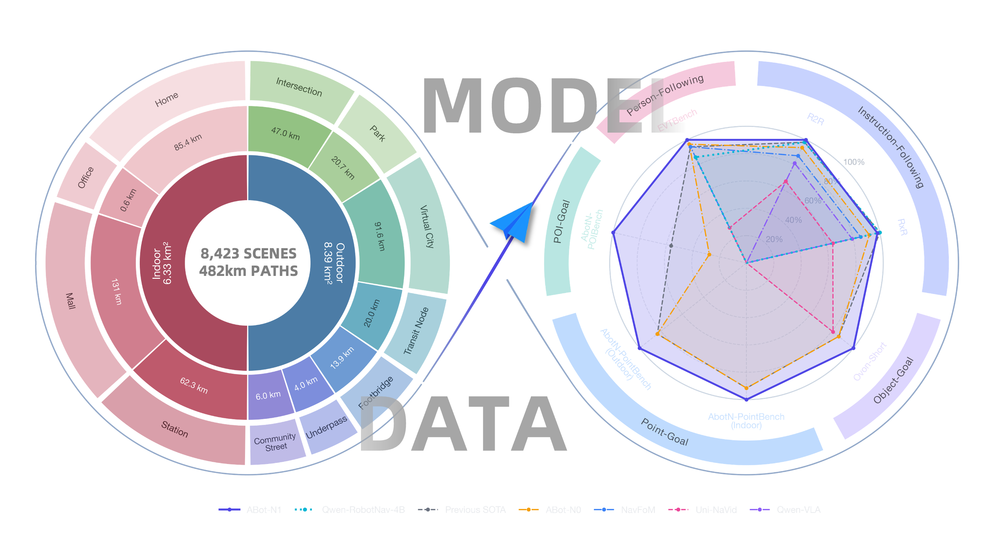
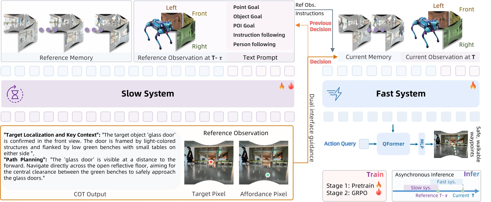
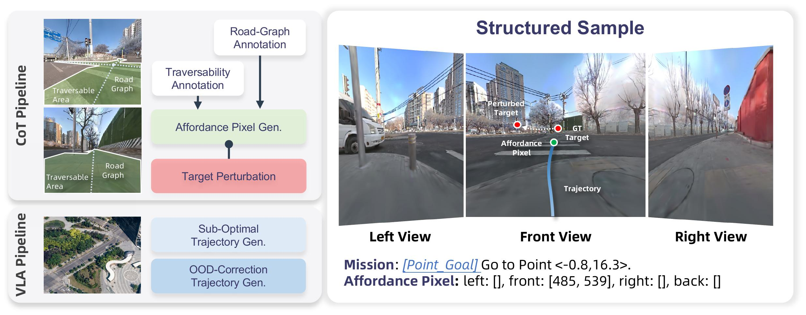
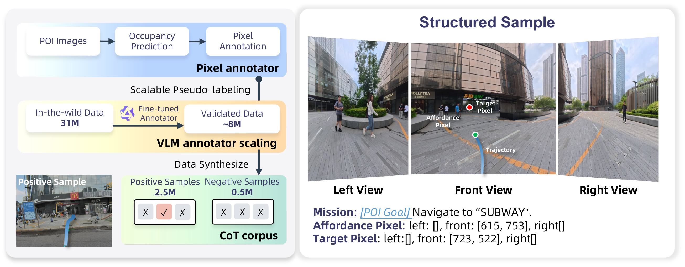
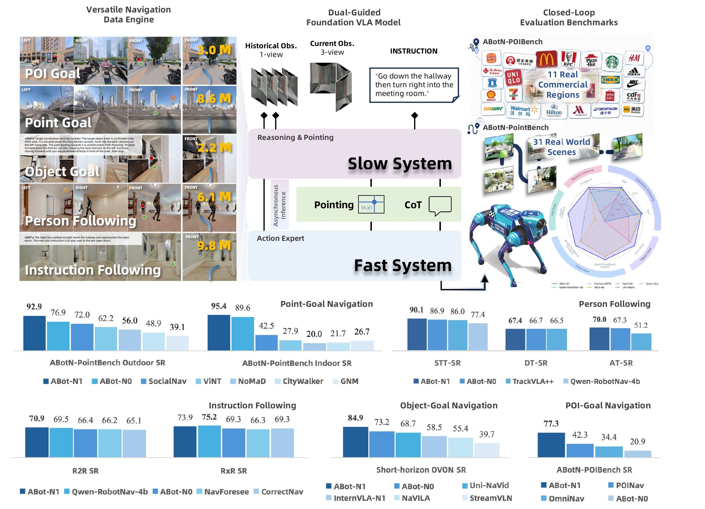
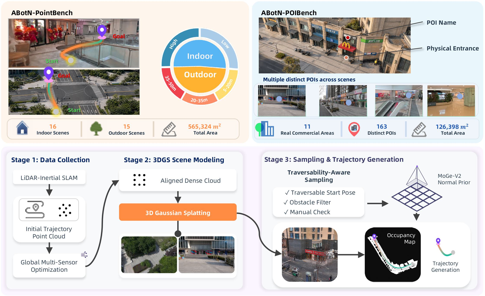

# ABot-N1 论文导读：用慢思考 + 快执行，让导航大模型既会解释又能实时控制

> **论文标题**：ABot-N1: Toward a General Visual Language Navigation Foundation Model
> **会议/期刊**：arXiv 预印本，2026年7月（技术报告）
> **作者**：Ruiyan Gong, Yingnan Guo, Junjun Hu, Jintao Kong, Xiaoxu Leng, Tianlun Li, Weize Li, Fei Liu, Zhicheng Liu, Jia Lu, Minghua Luo, Chenlin Ming, Yanfen Shen, Jiyue Tao, Zhengbo Wang, Mingyang Yin, Minqi Gu, Zihao Guan, Wei Guo, Guoqing Liu, Huachong Pang, Menglin Yang, Zeqian Ye, Xiaoxiao Geng, Zhining Gu, Honglin Han, Di Jing, Hongyu Pan, Mingchao Sun, Kuan Yang, Jianfang Zhang, Yanghong Chen, Ye He, Wei Mei, Jiahao Shi, Xiangpo Yang, Yanqing Zhu, Yang Cai, Jingjing Ma, Shihui Su, Zixiao Tang, Linbo Zheng, Zedong Chu, Xiaolong Wu, Wenbin Tang, Mu Xu
> **机构**：AMAP CVLab（高德地图计算机视觉实验室，阿里巴巴集团）
> **arXiv**：https://arxiv.org/abs/2607.10383
> **代码**：https://github.com/amap-cvlab/ABot-Navigation/tree/ABotN-Bench

---

## 读之前先搞清楚

### 这篇论文要解决什么问题？

ABot-N1 研究的是 **Visual Language Navigation（视觉语言导航）**：机器人既要看懂周围环境，又要理解人类给的目标或指令，最后还要输出可以执行的运动轨迹。这里的“视觉”是摄像头图像，“语言”是人类指令或任务描述，“导航”就是从当前位置走到目标位置。

在真实机器人导航里，已有方法常见有三类问题：

1. **坐标漂移**：模型直接预测世界坐标或连续动作，走着走着会偏。比如目标明明在门口，模型连续预测了十几步后，误差会从 20 厘米累积到 1 米以上。
2. **长尾语义弱**：模型遇到少见目标会懵。比如“去兰州拉面入口”不是普通的“找椅子”，它要理解店招、入口、街区、人行道、遮挡等复杂语义。
3. **黑盒不可解释**：端到端模型直接输出动作，人很难知道它为什么左转、为什么停下、为什么绕开某个区域。机器人一旦走错，很难调试。

ABot-N1 的核心目标是：**在五类导航任务上，用一个通用基础模型，同时做到泛化强、控制稳、能解释。** 五类任务包括 Point-Goal（去坐标点）、POI-Goal（去兴趣点入口）、Object-Goal（找物体）、Instruction-Following（按语言路线走）、Person-Following（跟随某个人）。

> **小白理解**：以前很多导航模型像一个“只会凭感觉开车的人”。你问他为什么左转，他说不出来；你让他去一个没见过的小店，他可能只会往大概方向走；走久了还会越偏越远。
>
> ABot-N1 把导航拆成两个人配合：一个慢慢想清楚“目标在哪里、该看哪里、为什么这么走”，另一个高速执行“下一小段具体怎么走”。**它不是让一个大模型又当导航员又当司机，而是让导航员和司机用同一套视觉语言信号协作。**

### 读懂这篇论文需要的前置知识

| 概念 | 简单解释 |
|:---|:---|
| **VLN（视觉语言导航）** | 机器人看图、听指令，然后自己走到目标 |
| **VLA（视觉语言动作模型）** | 输入图像和文字，直接输出机器人动作的模型 |
| **Point-Goal** | 给一个坐标点，让机器人走过去 |
| **POI-Goal** | 给一个兴趣点名称，让机器人找到真实入口 |
| **Pixel Goal** | 图像上的目标像素点，用来告诉机器人“朝画面里的哪里走” |
| **Affordance Pixel** | 图像上适合通行或接近的像素点，表示“哪里能走” |
| **CoT（Chain-of-Thought）** | 让模型把推理过程写出来，而不是只给答案 |
| **Slow-Fast Architecture** | 慢系统负责深度思考，快系统负责高频动作执行 |
| **GRPO** | 一种强化学习方法，用一组候选结果相对比较好坏 |
| **SPL** | 成功率和路径效率的综合指标，越高表示走得又准又省路 |

---

## 一、ABot-N1 的解决思路：把“想清楚”和“走得稳”拆开

ABot-N1 的关键设计是 **异步慢快双系统架构**。

- **慢系统（Slow System / Deliberative Reasoner）**：使用 Qwen-3.5-4B-VL 做视觉语言推理。它频率较低，但理解力强，负责输出 CoT 推理、Target Pixel（目标像素）和 Affordance Pixel（可通行像素）。
- **快系统（Fast System / Action Expert）**：使用 Qwen-3.5-2B 作为骨干，频率更高，接收慢系统留下来的文字推理和像素锚点，再结合实时图像输出连续 SE(2) waypoints（二维平面上的位置 x、y 和朝向 theta）。
- **异步推理（Asynchronous Inference）**：慢系统不用每一帧都跑。它可以慢慢推理，快系统在此期间继续追踪上一次缓存的像素目标，保证机器人不会因为“大脑思考中”而停住。



*ABot-N1 总览图展示了它覆盖的五类任务和整体定位。图中核心信号是：ABot-N1 不是只解决室内 VLN，而是把坐标导航、POI 导航、物体导航、语言指令导航和人员跟随都统一进一个视觉语言导航基础模型。*

### 为什么要拆成慢系统和快系统？

导航同时需要两种很矛盾的能力：

| 能力 | 需要什么模型 | 频率要求 | 例子 |
|:---|:---|:---|:---|
| **理解和推理** | 大视觉语言模型 | 可以慢一点 | “麦当劳入口在右前方，但中间有人群，要绕开” |
| **反应和控制** | 轻量动作模型 | 必须很快 | 每 0.1 秒调整一次方向，避开路边障碍 |

如果只用一个大模型端到端输出动作，会有两个问题：大模型太慢，控制频率跟不上；同时输出动作太黑盒，人看不懂为什么这么走。如果只用一个小模型控制，又会缺少复杂语义理解，遇到少见目标和长指令容易失败。

ABot-N1 的答案是：**大模型慢慢想，小模型快速做，中间用“文字推理 + 像素锚点”连接。**

> **小白理解**：开车时，导航 App 可以每隔几秒重新规划路线，但方向盘不能每隔几秒才动一次。路线规划慢一点没关系，方向盘控制必须连续。
>
> ABot-N1 也是这样：慢系统像导航 App，负责判断“目标在哪、为什么往那走”；快系统像方向盘控制器，负责让机器人连续、平滑、安全地移动。**慢系统给方向，快系统保手感。**

---

## 二、整体流程：从多视角图像到连续路点



*ABot-N1 架构图从左到右分为三段：左侧 Slow System 接收历史帧和任务提示，输出 CoT、Target Pixel 和 Affordance Pixel；中间 Dual Vision-Language Interface 把文字和像素锚点作为桥梁；右侧 Fast System 接收实时观测、文本线索和像素线索，通过 QFormer 与动作查询生成连续 waypoints。箭头表示慢系统的信息被缓存后持续指导快系统。*

### 第1步：慢系统做视觉语言推理（先判断“目标和可走区域在哪里”）

这一步在图中对应左侧 **Deliberative Reasoner**。它不是直接输出轮速或坐标，而是输出三类中间结果：

- **CoT 文本**：模型写出自己的推理过程，比如“目标店招在右侧，入口被行人部分遮挡，应该沿人行道右侧绕行”。
- **Target Pixel**：目标像素，表示“最终要朝画面里的哪个点接近”。
- **Affordance Pixel**：可通行像素，表示“当前更适合先往哪里走”。

- **输入**：历史多视角图像、当前任务提示、历史记忆。历史图像帮助模型知道“刚才看过什么”，任务提示告诉模型“要找什么或去哪”。
- **操作**：慢系统用 Qwen-3.5-4B-VL 对图像和任务做显式推理，并把抽象目标落到图像像素上。

  > **总览**：多视角观察 + 任务文本 → 视觉语言推理 → 输出文字解释和两个像素锚点
  >
  > ```
  > 输入：三视角/多视角图像 + 历史帧 + 任务描述
  >         ↓
  > ① 场景理解（识别道路、门口、店招、行人、障碍）
  >         ↓
  > ② 任务推理（判断目标在哪、下一步该靠近哪里）
  >         ↓
  > ③ 像素落点（输出 Target Pixel + Affordance Pixel）
  >         ↓
  > 输出：CoT 文本 + 目标像素 + 可通行像素
  > ```

  **① 场景理解**

  慢系统先把图像中的关键元素识别出来。比如在 POI-Goal 中，它要看懂店招、入口、路面、人行道、台阶；在 Person-Following 中，它要区分目标人物和干扰行人。

  **② 任务推理**

  识别不是终点。模型还要判断“这些东西和任务有什么关系”。比如看到“Luckin Coffee”店招后，真正要去的是入口，不是招牌本身；看到目标人物被短暂遮挡时，应该根据历史轨迹预测他可能从哪边出现。

  **③ 像素落点**

  ABot-N1 最重要的接口不是世界坐标，而是图像像素。Target Pixel 把“目标在哪里”钉在图像上，Affordance Pixel 把“先往哪里走更安全”钉在图像上。

- **输出**：可读的推理文本，以及两个可视化、可调试的像素锚点。

> **小白理解**：如果你让机器人“去麦当劳”，最糟糕的做法是直接输出“向前 3 米、右转 20 度”。因为它可能没搞清楚麦当劳入口、招牌、玻璃墙和人行道的区别。
>
> ABot-N1 先在照片上点两个点：一个点在“真正目标入口”附近，一个点在“现在应该先走过去的安全区域”。**像素点把抽象语言变成了画面里的具体位置，后面的控制器就不再只靠模糊语义猜动作。**

#### 深入理解：为什么 Pixel Goal 比直接坐标更适合做通用接口？

直接输出世界坐标看起来更“机器人”，但在跨任务导航里有三个麻烦：

```text
语言目标：“去兰州拉面”
      ↓
世界坐标？
  需要知道地图、定位、入口位置、尺度、坐标系
      ↓
一旦定位偏一点，坐标会漂移
```

Pixel Goal 的优势是它紧贴当前视觉观测：

```text
当前图像
  ├─ Target Pixel: 店铺入口在画面右侧 (u=820, v=410)
  └─ Affordance Pixel: 可通行区域在画面下方偏右 (u=650, v=690)
      ↓
快系统结合实时图像判断下一段怎么走
```

> **核心设计理由**：Pixel Goal 是一种“视觉空间里的锚”。它不要求所有任务都先变成同一种世界坐标，而是把不同任务统一成“图像上该关注哪里、该靠近哪里”。

### 具体数字例子：Pixel Goal 如何减少坐标漂移

**条件设定：** 机器人要去 8 米外的店铺入口。端到端坐标预测每 2 米误差增加 0.25 米；Pixel Goal 每次根据新图像重新锚定目标，残余误差约 0.10 米。

**Step 1：直接坐标预测的误差累积**

| 行走距离 | 单段新增误差 | 累积偏差 |
|:---:|:---:|:---:|
| 2m | 0.25m | 0.25m |
| 4m | 0.25m | 0.50m |
| 6m | 0.25m | 0.75m |
| 8m | 0.25m | 1.00m |

**Step 2：Pixel Goal 反复用图像校正**

每走 2 米重新看一次图像，目标入口在画面中被重新定位，误差不再线性累积：

$$0.10 + 0.10 + 0.10 + 0.10 \approx \mathbf{0.40m}$$

> **关键理解**：Pixel Goal 不是让模型记住一个死坐标，而是让模型持续盯住画面里的目标。**这就是 ABot-N1 缓解坐标漂移的核心思路。**

> ❓ **常见疑问：既然慢系统能输出目标像素，为什么不直接让它输出动作？**
>
> 因为动作控制需要高频更新，而慢系统是大视觉语言模型，推理慢、成本高。让它每一帧都输出动作，会让机器人反应迟钝。
>
> ```
> 慢系统：低频推理 → 目标像素 / 可走像素 / 文字解释
>          │
>          ▼
> 快系统：高频控制 → 连续 waypoints → 机器人执行
> ```
>
> 所以慢系统负责“想明白”，快系统负责“动得稳”。**两者分工后，语义理解和实时控制不会互相拖累。**

### 第2步：双视觉语言接口连接两个系统（把“想法”变成“控制条件”）

这一步在图中对应中间的 **Dual Vision-Language Interface**。所谓“双”指的是两种信号一起传递：

1. **语言信号**：CoT 推理文本，告诉快系统“为什么这样走”。
2. **视觉信号**：Target Pixel 和 Affordance Pixel，告诉快系统“画面里的哪里最重要”。

- **输入**：慢系统输出的 CoT、Target Pixel、Affordance Pixel。
- **操作**：把文字推理和像素锚点缓存下来，在快系统每次控制时作为条件输入。

  > **总览**：慢系统输出 → 缓存为可复用条件 → 快系统持续读取
  >
  > ```
  > 输入：CoT 文本 + Target Pixel + Affordance Pixel
  >         ↓
  > ① 语言桥接（保留目标语义和推理原因）
  >         ↓
  > ② 视觉桥接（保留图像空间中的目标点和可走点）
  >         ↓
  > ③ 缓存机制（慢系统没更新时继续使用上次结果）
  >         ↓
  > 输出：快系统每个控制周期可读取的条件信号
  > ```

  **① 语言桥接**

  CoT 文本会把高层原因传给快系统。比如“目标人穿红衣服，刚刚从右侧柱子后面经过”，这类信息能帮助快系统在遮挡和干扰中保持目标一致性。

  **② 视觉桥接**

  像素锚点把注意力集中到关键区域。快系统不用从整张图里重新猜“哪块最重要”，它知道慢系统已经点出了目标和可行区域。

  **③ 缓存机制**

  慢系统的结果会被缓存。即使慢系统下一次推理还没完成，快系统也能继续跟踪上一次的像素目标，保证控制不中断。

- **输出**：稳定的跨系统控制条件。

> **小白理解**：两个人协作时，只说“往那边走”不够清楚；只在地图上画个点，也不一定知道为什么去那里。ABot-N1 同时给两样东西：一段解释和两个画面点。
>
> 这就像导航员对司机说：“右前方那个蓝色门是入口，先沿着右侧空地过去，别直接穿过人群。”司机听懂原因，也看到了目标点，动作就更稳。**语言负责解释，像素负责落地。**

#### 深入理解：文字和像素分别解决什么问题？

```text
只用 CoT 文本：
  “目标在右前方店铺入口”
  优点：语义清楚
  缺点：右前方到底哪个像素？不够精确

只用 Pixel Goal：
  Target Pixel = (820, 410)
  优点：位置精确
  缺点：不知道这是入口、招牌还是临时目标

CoT + Pixel Goal：
  “入口在右前方” + (820, 410)
  语义和位置同时明确
```

> **核心设计理由**：语言让目标有含义，像素让目标有位置。两者结合后，快系统既不会只看点，也不会只听描述。

### 第3步：快系统生成连续 waypoints（把像素目标转成真实运动）

这一步在图中对应右侧 **Action Expert**。它接收实时观测、慢系统缓存的文字和像素信号，然后输出一串连续路点。

这里的 **SE(2) waypoint** 指二维平面中的一个小目标状态：$(x, y, \theta)$，其中 $x,y$ 是局部位置，$\theta$ 是机器人朝向。输出多个 waypoint，就能形成一条短期轨迹。

- **输入**：当前实时图像、CoT 文本、Target Pixel、Affordance Pixel、历史状态。
- **操作**：快系统用 Qwen-3.5-2B 编码多模态输入，通过 QFormer 让 learnable action query（可学习动作查询）关注关键隐藏状态，最后用 MLP 解码为连续 waypoints。

  > **总览**：实时观测 + 慢系统条件 → 多模态编码 → 动作查询提取控制特征 → MLP 输出路点
  >
  > ```
  > 输入：当前图像 + CoT + Target Pixel + Affordance Pixel
  >         ↓
  > ① 快系统编码（Qwen-3.5-2B 提取多模态隐藏状态）
  >         ↓
  > ② QFormer 交互（动作查询关注最相关的视觉/语言特征）
  >         ↓
  > ③ MLP 解码（预测连续 SE(2) waypoints）
  >         ↓
  > 输出：[(x1,y1,theta1), ..., (xK,yK,thetaK)]
  > ```

  **① 快系统编码**

  快系统不是从零推理整个任务，而是在慢系统给出的条件下做实时反应。它更关心“下一小段怎么走”，而不是“这个任务最终要去哪”。

  **② QFormer 交互**

  QFormer 可以理解为一个“信息筛选器”。动作查询会主动去多模态隐藏状态里取和控制最相关的信息，比如目标像素附近的视觉特征、可走区域的位置、文字里提到的障碍。

  **③ MLP 解码**

  MLP（多层感知机，一种简单的神经网络头）把动作查询提取到的特征变成数值路点。论文中快系统使用 smooth-L1 监督位置和朝向，并加入 arriving loss 判断是否到达。

- **输出**：一段短期连续轨迹，交给底层控制器执行。

> **小白理解**：慢系统已经告诉快系统“目标入口在那里，先走右侧空地”。快系统要做的不是重新思考人生，而是每个控制周期回答一个更具体的问题：下一步脚落在哪里、身体朝哪边。
>
> 如果路上突然出现行人，快系统可以立刻根据实时图像微调 waypoint；慢系统下次更新时再重新判断更高层目标。**这就是“慢规划 + 快反应”的价值。**

#### 深入理解：为什么 ABot-N1 可以用 smooth-L1 做轨迹监督？

很多导航任务存在多条可行路径。比如岔路口左右两边都能绕过去，如果直接用 smooth-L1 回归所有专家轨迹，模型可能学到两条路的平均值，结果输出一条撞墙的中间路线。这叫 **mode collapse（多模态目标被平均成坏答案）**。

ABot-N1 的解决方式是先让慢系统做离散决策：

```text
原始多模态情况：
  左绕也行 / 右绕也行 / 等人过去也行
        ↓ 慢系统 CoT + Pixel Goal
被压缩成一个主选择：
  “目标在右前方，先从右侧可通行区域绕行”
        ↓ 快系统回归
近似单峰轨迹：
  预测一串右绕 waypoints
```

当慢系统已经用 CoT 和 Pixel Goal 选定了大方向，快系统面对的就不再是“所有可能路线都要平均”，而是“沿这个视觉锚点附近生成平滑轨迹”。这时 smooth-L1 就稳定得多。

> **核心设计理由**：ABot-N1 不是强行让小控制器解决多模态决策，而是让慢系统先把“选哪条路”决定好，快系统只负责“怎么把这条路走顺”。

### 具体数字例子：慢系统如何把多模态路线变成单峰回归

**条件设定：** 前方有障碍，左右都能绕。专家数据中 50% 走左侧，50% 走右侧。

**Step 1：没有慢系统条件时，直接回归会平均**

| 可行路线 | 第一个 waypoint 横向偏移 |
|:---:|:---:|
| 左绕 | -1.0m |
| 右绕 | +1.0m |
| 直接 smooth-L1 平均 | 0.0m |

0.0m 正好指向障碍物中间，这是坏动作。

**Step 2：有 Pixel Goal 后，快系统只回归被选中的模式**

慢系统输出 Affordance Pixel = 右侧可通行区域，快系统看到右侧路线样本：

$$\frac{0.9 + 1.0 + 1.1}{3} = \mathbf{1.0m}$$

> **关键理解**：慢系统先选“右绕”，快系统再学“右绕该怎么走”。**这比直接把左右路线平均起来更符合真实控制。**

> ❓ **常见疑问：慢系统低频更新时，快系统会不会追着过期目标走？**
>
> 会有这个风险，所以 ABot-N1 在训练时加入了模拟异步滞后和噪声注入。也就是说，训练阶段故意让快系统见到“不完美的上游信号”，让它学会在慢系统延迟、像素点轻微偏移时仍然稳定控制。
>
> ```text
> 训练时故意扰动：
>   目标坐标偏一点
>   像素预测有噪声
>   慢系统结果延迟几帧
>        ↓
> 快系统学会容错
> ```
>
> **部署时真实异步误差就不再是完全陌生的情况。**

---

## 三、训练流程：先大规模预训练，再用 GRPO 对齐

ABot-N1 的训练不是只靠一个数据集，而是构建了一个大规模预训练数据引擎。


*训练数据图展示了 ABot-N1 的数据来源和任务配比：预训练数据覆盖 5 类导航任务、3000 万条轨迹、8423 个 3D 场景、14.7 km² 场景面积和 482 km 路径。图中的不同颜色/模块对应不同任务数据管线，最终共同服务慢系统 CoT/pixel 学习和快系统 waypoint 学习。*

### 第1步：五任务预训练数据构造（先让模型见过足够多的世界）

- **输入**：3D 场景、街景图像、导航图、任务目标、专家轨迹、像素标注。
- **操作**：为五类任务分别构造 CoT 数据和 VLA 轨迹数据。

  > **总览**：多源场景 → 任务特定数据管线 → CoT/pixel 标注 + waypoint 监督
  >
  > ```
  > 输入：8423 个 3D 场景 + 街景/室内数据 + 导航图
  >         ↓
  > ① Point-Goal 数据（坐标目标 + 扰动 + OOD 修正轨迹）
  >         ↓
  > ② POI-Goal 数据（街景 POI + 入口标注 + 正负样本）
  >         ↓
  > ③ Object-Goal 数据（物体语义 + A* 一致性过滤）
  >         ↓
  > ④ Instruction 数据（长指令拆分 + 里程碑帧对齐）
  >         ↓
  > ⑤ Person-Following 数据（人物轨迹 + 可见性 + 干扰）
  >         ↓
  > 输出：30M 预训练轨迹 + CoT/pixel/waypoint 监督
  > ```

  **Point-Goal 数据**

  Point-Goal 是基础能力：给坐标，让机器人走到指定位置。ABot-N1 数据管线包含目标扰动和 OOD-correction trajectories（分布外修正轨迹），让模型不只会走标准路线，也会从偏离状态修回来。

  

  *Point-Goal 图左侧展示 CoT 数据生成和 VLA 数据合成流程，右侧展示三视角观测、目标扰动和 affordance pixel 标注样例。箭头表示从几何目标到像素锚点再到轨迹监督的生成路径。*

  **POI-Goal 数据**

  POI-Goal 是城市导航最难的部分之一：目标不是抽象坐标，而是真实商业区域里的入口。项目页说明其从 3100 万街景对中筛选得到 800 万有效路径，并构造正负样本，让模型学会“目标存在”和“目标缺失”两种情况。

  

  *POI-Goal 图左侧是三阶段构造流程：单目深度生成几何种子、蒸馏 VLM 过滤街景路径、合成正负样本；右侧展示包含目标 POI、三视角图像和入口定位的结构化样本。*

  **Object-Goal / Instruction / Person-Following 数据**

  Object-Goal 强调物体语义和搜索，Instruction-Following 强调长语言指令与里程碑帧对齐，Person-Following 强调动态目标跟踪和干扰人物区分。三者共同补齐“找东西、听路线、跟人走”的能力。

- **输出**：慢系统学 CoT 和 pixel，快系统学连续 waypoints。

> **小白理解**：如果只训练“去坐标点”，机器人可能会成为一个会走直线的定位机器；如果只训练“按指令走”，它又可能不会精准避障。ABot-N1 把五类任务混在一个大训练锅里，让模型同时见过坐标、店铺、物体、长句子和动态行人。
>
> **这不是为了凑数据量，而是为了让模型学到导航的共同底层能力：看哪里、理解什么、怎么走。**

### 第2步：监督预训练（让两个系统先学会基本配合）

ABot-N1 从预训练 Qwen-3.5 检查点初始化两个系统：

- 慢系统使用 **cross-entropy loss（交叉熵损失）** 学习 CoT token 和 pixel 坐标。交叉熵可以理解为“模型说出的每个词/坐标类别和标准答案有多接近”。
- 快系统使用 **smooth-L1 loss** 监督位置和朝向。smooth-L1 对小误差像 L2 一样精细，对大误差像 L1 一样稳，不容易被少量离群样本带偏。
- 快系统还使用 **binary arriving loss** 判断是否到达目标，避免模型只会一直走、不知道该停。

> **小白理解**：预训练阶段像带答案的驾校训练。慢系统学“老师希望你怎么解释路况、该点哪个目标像素”，快系统学“老师给的轨迹每一步应该怎么走”。
>
> 关键是两个系统不是各练各的：慢系统输出的文本和像素会成为快系统的输入。**快系统从一开始就学会听慢系统的提示。**

### 第3步：GRPO 对齐（让模型学会更安全、更稳定的策略）

监督学习只能模仿专家，但专家轨迹不一定覆盖所有异常情况。ABot-N1 进一步使用 **GRPO-Based Alignment（基于 GRPO 的强化学习对齐）**。

如果你不理解“组内比较为什么能更新模型参数”，可以先读这篇补充文档：[强化学习与GRPO入门.md](./强化学习与GRPO入门.md)。

- **输入**：预训练后的模型、导航场景、任务目标、奖励函数。
- **操作**：对一组候选动作做相对比较，奖励更安全、更接近目标、更符合格式的输出。

  > **总览**：采样多组候选 → 按奖励打分 → 组内比较 → 更新策略
  >
  > ```
  > 输入：当前导航状态 + 任务目标
  >         ↓
  > ① 生成一组候选输出（不同 pixel / waypoint）
  >         ↓
  > ② 计算奖励（格式、目标、安全、是否缺失预测）
  >         ↓
  > ③ GRPO 组内相对比较（比平均好就增强，比平均差就削弱）
  >         ↓
  > ④ 策略更新（保持动作采样平衡，避免奖励黑客）
  >         ↓
  > 输出：更符合目标和安全约束的模型
  > ```

  **① 动作平衡采样**

  论文强调避免 biased preference sampling（有偏偏好采样），使用 action-balanced batch sampling。直觉上，如果训练样本里“停下/不预测”过多，模型可能学会偷懒：不动就不会撞，奖励反而高。

  **② 任务无关奖励 + 任务相关目标奖励**

  ABot-N1 的奖励由几类组成：

  | 奖励 | 依赖什么 | 作用 |
  |:---|:---|:---|
  | **Rformat** | 输出格式 | 保证输出 schema 正确 |
  | **Rsafety** | 场景几何和可通行规则 | 避免碰撞、越界、走不可通行区域 |
  | **Rtarget** | 具体任务定义 | Point-Goal 看距离，POI 看入口，Object 看目标物体 |
  | **missing penalty** | 是否缺失预测 | 防止模型通过“不输出目标”逃避惩罚 |

  **③ 防奖励黑客**

  奖励黑客指模型找到“拿高分但没真正完成任务”的漏洞。比如如果安全奖励太高，模型可能永远不动；如果目标奖励设计不完整，模型可能不预测目标以逃避错误。ABot-N1 用目标奖励、安全奖励和强 missing penalty 做平衡。

- **输出**：更稳的策略，尤其提升 Point-Goal 和复杂场景中的闭环表现。

> **小白理解**：监督学习像看教练示范，GRPO 像真正上路考试。考试不只看你有没有朝目标走，还看你有没有乱穿人群、有没有输出合法动作、有没有假装没看到目标。
>
> 如果机器人发现“不动最安全”，那就是钻空子。ABot-N1 的奖励设计会惩罚这种行为：不动虽然可能安全，但到不了目标，分数仍然低。**强化学习阶段是在教模型“别只会模仿，还要知道什么行为真的好”。**

### 具体数字例子：GRPO 如何比较一组候选动作

**条件设定：** 同一场景采样 4 条候选轨迹，综合奖励越高越好。

| 轨迹 | 到目标奖励 | 安全奖励 | 格式奖励 | 总分 |
|:---:|:---:|:---:|:---:|:---:|
| A：直接穿过人群 | 0.9 | -0.6 | 0.2 | 0.5 |
| B：右侧绕行 | 0.8 | 0.8 | 0.2 | 1.8 |
| C：原地不动 | 0.1 | 1.0 | 0.2 | 1.3 |
| D：输出缺失 | 0.0 | 0.5 | -1.0 | -0.5 |

组内平均分：

$$\mu = \frac{0.5 + 1.8 + 1.3 - 0.5}{4} = \mathbf{0.775}$$

B 和 C 高于平均，但 B 的目标完成更好；D 因缺失预测被强惩罚。

> **关键理解**：GRPO 不需要给每条轨迹一个绝对完美标签，而是在同组候选里比较谁更好。**这适合导航，因为真实世界里常常有多条可行路线，但它们安全性和效率不同。**

---

## 四、核心创新点

### 创新点 1：慢快异步双系统，把可解释推理和实时控制解耦

ABot-N1 不是单一黑盒策略。慢系统显式输出 CoT 和 Pixel Goal，快系统高频生成 waypoints。这让模型同时具备：

| 目标 | 单体端到端策略 | ABot-N1 |
|:---|:---|:---|
| **复杂语义理解** | ✅ 可能具备，但推理不可见 | ✅ 慢系统显式 CoT |
| **实时控制** | ❌ 大模型太慢 | ✅ 快系统高频执行 |
| **可解释性** | ❌ 只看到动作 | ✅ 能看推理文本和像素锚点 |
| **抗坐标漂移** | ❌ 连续预测容易累积误差 | ✅ 反复以图像像素重新锚定 |

> **小白理解**：这就像把“看地图想路线”和“踩油门打方向”分开。一个人低头看地图时，另一个人还能稳稳开车。**系统不会因为思考复杂问题就失去实时反应。**

### 创新点 2：Dual Vision-Language Signals，用文字 + 像素做通用接口

Pixel Goal 让 Point-Goal、POI-Goal、Object-Goal、Instruction-Following 和 Person-Following 都能落到同一种图像空间接口上。CoT 则保留语义解释，避免像素点变成无意义坐标。



*贡献概览图强调 ABot-N1 面向通用视觉语言导航基础模型：左侧是已有黑盒策略的问题，中间是慢快双系统与双视觉语言接口，右侧是五任务统一、Benchmark 发布和真实部署效果。图中箭头体现了从问题诊断到架构设计再到实验验证的逻辑链条。*

> **小白理解**：只有文字会太虚，只有像素会太冷。文字告诉模型“这个点为什么重要”，像素告诉模型“这个重要东西具体在哪里”。**ABot-N1 的接口设计真正把语言理解和视觉控制接上了。**

### 创新点 3：面向城市级导航发布 ABotN Benchmark

ABot-N1 不只做模型，还发布了新的 Point-Goal 和 POI-Goal Benchmark，重点补齐真实城市级导航评测的缺口。



*Benchmark 图上半部分展示 ABotN-PointBench 和 ABotN-POIBench 的统计信息、距离划分和场景覆盖；下半部分展示统一场景构建流程：LiDAR-inertial SLAM 采集、3DGS 建模、基于可通行网格的查询采样和 A* 参考轨迹生成。*

两个 benchmark 的意义：

| Benchmark | 解决什么缺口 | 评测重点 |
|:---|:---|:---|
| **ABotN-PointBench** | 旧 Point-Goal 场景单一、缺少闭环和社交规则 | 室内/室外闭环成功率、路径效率、可通行约束 |
| **ABotN-POIBench** | 旧 POI 评测只到街区级，不看真实入口 | 2 米内入口到达率、商业区域细粒度导航 |

> **小白理解**：很多导航评测像“走到这栋楼附近就算成功”。但真实机器人要把你带到店门口，差 10 米可能就是完全没到。ABotN-POIBench 把目标压到入口级别，要求机器人最后几米也走准。**这更接近真实产品需要。**

---

## 五、实验结果

ABot-N1 在五类导航任务、七个 benchmark 上评测，并在多个核心指标上达到新的 SOTA（State-of-the-Art，当前最好结果）。

### 1. ABotN-PointBench：室内外复杂点目标导航

| 方法 | Outdoor SR | Outdoor SPL | Indoor SR | Indoor SPL |
|:---|:---:|:---:|:---:|:---:|
| GNM | 39.1 | 36.7 | 26.7 | 26.6 |
| ViNT | 62.2 | 62.2 | 27.9 | 27.9 |
| SocialNav | 72.0 | 71.9 | 42.5 | 42.5 |
| ABot-N0 | 76.9 | 76.9 | 89.6 | 85.6 |
| **ABot-N1** | **92.9** | **91.4** | **95.4** | **93.7** |

> **小白理解**：SR 是成功率，SPL 同时看成功和路径是否绕远。ABot-N1 在室外 All SR 从 ABot-N0 的 76.9 提升到 92.9，在室内 All SR 从 89.6 提升到 95.4。
>
> 这说明 ABot-N1 不只是“能到”，还更稳定、更少走冤枉路。尤其室外复杂场景中，慢快系统对坐标漂移和障碍绕行的改善很明显。

### 2. Object-Goal：找指定物体

| 方法 | SR | SPL | DTG |
|:---|:---:|:---:|:---:|
| StreamVLN | 39.7 | 15.8 | 2.368 |
| NaVILA | 55.4 | 26.1 | 1.811 |
| InternVLA-N1 (S2 only) | 58.5 | 30.0 | 1.441 |
| Uni-NaVILA | 68.7 | 34.5 | 1.495 |
| ABot-N0 | 73.2 | 35.4 | 1.442 |
| **ABot-N1** | **84.9** | **51.8** | **0.822** |

> **小白理解**：DTG 是 Distance To Goal，离目标还剩多远，越低越好。ABot-N1 不只成功率更高，最后离目标也更近，从 ABot-N0 的 1.442 降到 0.822。
>
> 这对真实机器人很关键：找椅子不是走到房间中央就行，而是要真正靠近那把椅子。

### 3. VLN-CE：语言指令导航

| Benchmark | 方法 | NE | SR | SPL |
|:---|:---|:---:|:---:|:---:|
| R2R | ABot-N0 | 3.80 | 66.4 | 63.9 |
| R2R | **ABot-N1** | **3.32** | **70.9** | **67.5** |
| RxR | ABot-N0 | 3.83 | 69.3 | 60.0 |
| RxR | **ABot-N1** | **3.13** | **73.9** | **63.9** |

> **小白理解**：NE 是导航误差，越低越好；SR 和 SPL 越高越好。R2R 和 RxR 都是语言指令导航基准，要求模型理解“穿过走廊、在楼梯前右转”这种长句子。
>
> ABot-N1 在两套基准上都更准，说明 CoT + Pixel Goal 不只对坐标导航有用，对语言路线理解也有帮助。

### 4. POI-Goal：城市兴趣点入口导航

| 方法 | SR | SPL |
|:---|:---:|:---:|
| ViNT | 19.0 | 18.2 |
| OmniNav (vanilla) | 23.9 | 22.4 |
| OmniNav (BridgeNav training) | 34.4 | 31.5 |
| ABot-N0 | 20.9 | 17.7 |
| POINav | 42.3 | 40.3 |
| **ABot-N1** | **77.3** | **72.6** |

> **小白理解**：POI-Goal 是 ABot-N1 提升最夸张的任务。项目页强调 POI arrival 提升 35.0%，达到 77.3%。
>
> 这说明它在城市街景、店铺入口、遮挡和长尾目标上有明显优势。对真实产品来说，“找到店门口”比“走到附近街区”难得多，也有用得多。

### 5. Person-Following：动态人物跟随

| 方法 | STT SR | DT SR | AT SR |
|:---|:---:|:---:|:---:|
| IBVS | 42.9 | 10.6 | 15.2 |
| Uni-NaVid | 25.7 | 11.3 | 8.26 |
| TrackVLA++ | 86.0 | 66.5 | 51.2 |
| ABot-N0 | 86.9 | 66.7 | 67.3 |
| **ABot-N1** | **90.1** | **67.4** | **70.0** |

> **小白理解**：STT 是单目标跟随，DT 是有干扰行人的跟随，AT 是目标身份有歧义的跟随。ABot-N1 在三类设置中都领先。
>
> 人物跟随难在“目标会动、会被挡、周围可能有相似的人”。CoT 和历史视觉信号能帮助模型记住“我要跟的是谁”，而快系统负责连续追踪。

---

## 六、在整个领域的位置

```text
具身导航技术演进
│
├─ 传统模块化导航
│  ├─ SLAM 建图
│  ├─ 目标检测 / 语义地图
│  └─ A* / MPC 控制
│     优点：可解释、工程稳定
│     缺点：语义泛化弱，任务切换困难
│
├─ 端到端视觉导航
│  ├─ ViNT / NoMaD / GNM
│  └─ 直接从图像到轨迹
│     优点：控制简洁
│     缺点：语言理解和复杂语义弱
│
├─ 视觉语言导航模型
│  ├─ StreamVLN / NaVILA / Uni-NaVILA
│  ├─ InternVLA-N1
│  └─ Qwen-VLA / NavFoM
│     优点：能理解语言和场景
│     缺点：常见黑盒动作、坐标漂移、控制频率矛盾
│
└─ ABot 系列
   ├─ ABot-N0：Brain-Action 分层，统一五大导航任务
   └─ ABot-N1：慢快异步双系统 + CoT/Pixel 双接口 + 城市级 Benchmark
      重点：可解释、通用、实时闭环、入口级 POI 到达
```

ABot-N1 相比 ABot-N0 的核心升级可以概括为：

| 维度 | ABot-N0 | ABot-N1 |
|:---|:---|:---|
| **系统形态** | Brain-Action 分层架构 | 慢快异步双系统 |
| **中间接口** | 推理特征 + Action Expert | CoT 文本 + Target/Affordance Pixel |
| **控制方式** | Flow Matching 动作专家 | 快系统高频 waypoint 回归 |
| **数据规模** | 16.9M 轨迹，7802 场景，10.7 km² | 30M 轨迹，8423 场景，14.7 km²，482 km 路径 |
| **Benchmark** | 覆盖五任务 SOTA | 新增 ABotN-PointBench / ABotN-POIBench |
| **重点提升** | 五任务统一和真实部署 | 城市级泛化、入口级 POI、异步实时控制 |

> **小白理解**：ABot-N0 证明“一套模型可以统一很多导航任务”；ABot-N1 进一步回答“这套模型怎么在真实复杂城市里走得更准、更稳、更能解释”。
>
> 如果说 ABot-N0 是统一导航基础模型的第一版工程闭环，ABot-N1 更像是把这个系统推向真实城市导航和产品级控制的一次升级。

---

## 七、局限性

| 局限性 | 为什么是局限 | 可能改进方向 |
|:---|:---|:---|
| **慢系统仍然依赖大 VLM** | Qwen-3.5-4B-VL 虽比更大模型轻，但在边缘端仍有推理成本 | 量化、蒸馏、更稀疏的触发式慢推理 |
| **Pixel Goal 依赖视觉可见性** | 目标被完全遮挡或画面外时，像素锚点会变得不确定 | 结合长期拓扑记忆和主动探索 |
| **POI / Object 长尾仍可能失败** | 极少见招牌、强遮挡、小物体会挑战视觉语言识别 | 引入在线检索、地图先验、开放词表检测器 |
| **奖励设计仍需人工定义** | GRPO 的安全、目标、格式奖励需要工程调参 | 学习式奖励模型或人类偏好反馈 |
| **Benchmark 虽更真实，但仍有限** | 31 个 PointBench 场景和 11 个商业区域不能覆盖所有城市形态 | 扩展跨城市、跨天气、跨传感器评测 |
| **异步缓存可能带来滞后** | 目标快速变化时，快系统可能短时间追踪旧锚点 | 动态置信度估计，低置信时触发慢系统刷新 |

> **小白理解**：ABot-N1 很强，但不是“看一眼世界就永远不会错”。如果目标完全不在画面里、店招被挡住、或者行人突然改变方向，它仍然需要更强记忆、更快重规划和更稳的异常检测。
>
> 论文真正有价值的地方在于，它把这些问题变得可观察：你能看到 CoT，能看到 Pixel Goal，也能知道快系统追踪的是哪个视觉锚点。**可解释性让失败更容易被诊断。**

---

## 八、一句话总结

**ABot-N1 用 Qwen-3.5-4B-VL 慢系统显式输出 CoT 推理、Target Pixel 和 Affordance Pixel，再用 Qwen-3.5-2B 快系统异步高频生成连续 SE(2) waypoints，通过 30M 轨迹、8423 个 3D 场景和 GRPO 对齐训练，在五类导航任务和七个 benchmark 上取得 SOTA，尤其把 POI-Goal 成功率提升到 77.3%，是 ABot 系列从“统一导航模型”走向“城市级可解释实时导航系统”的关键升级。**

---

## 参考资料

1. ABot-N1 论文：https://arxiv.org/abs/2607.10383
2. ABot-N1 项目页面：https://amap-cvlab.github.io/ABot-Navigation/ABot-N1/
3. ABot Navigation GitHub：https://github.com/amap-cvlab/ABot-Navigation/tree/ABotN-Bench
4. HuggingFace Papers：https://huggingface.co/papers/2607.10383
5. 论文 PDF：https://arxiv.org/pdf/2607.10383
