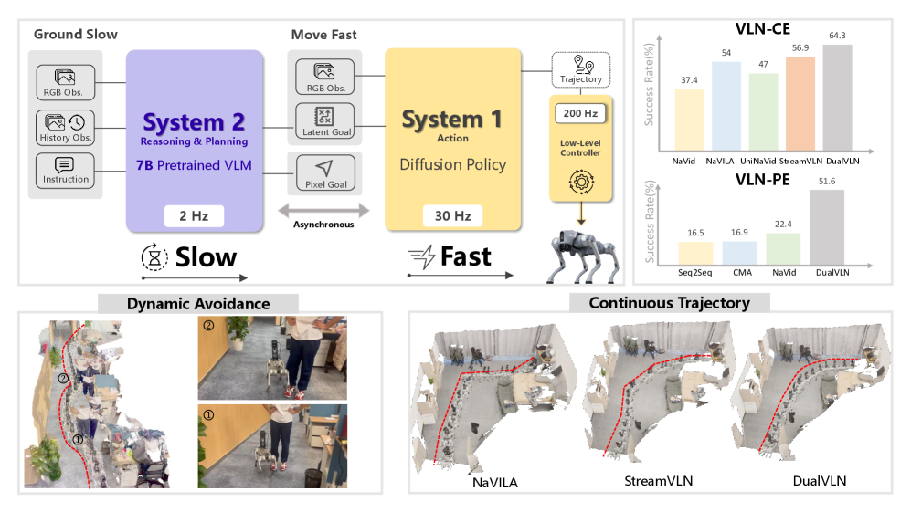
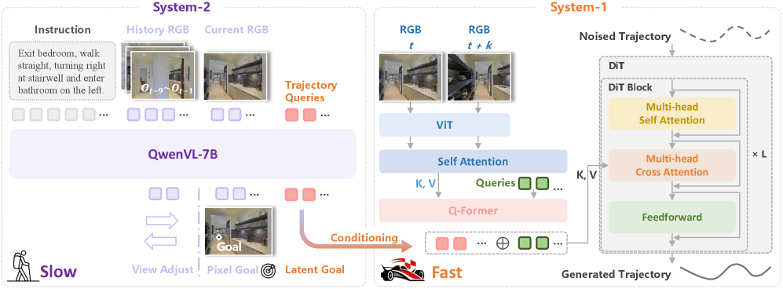
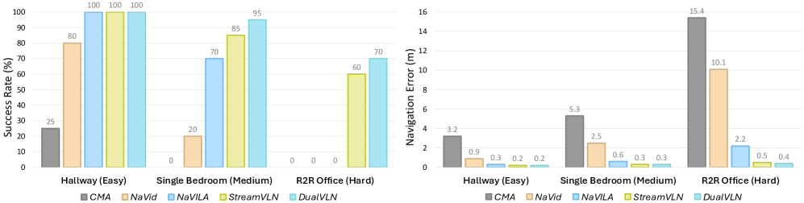
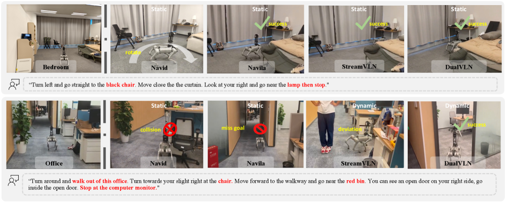
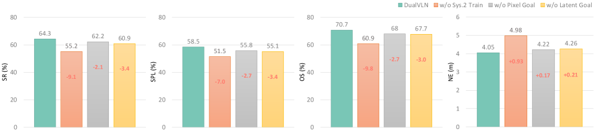
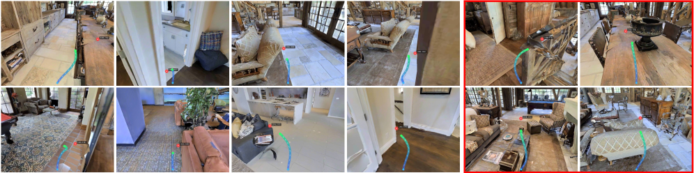
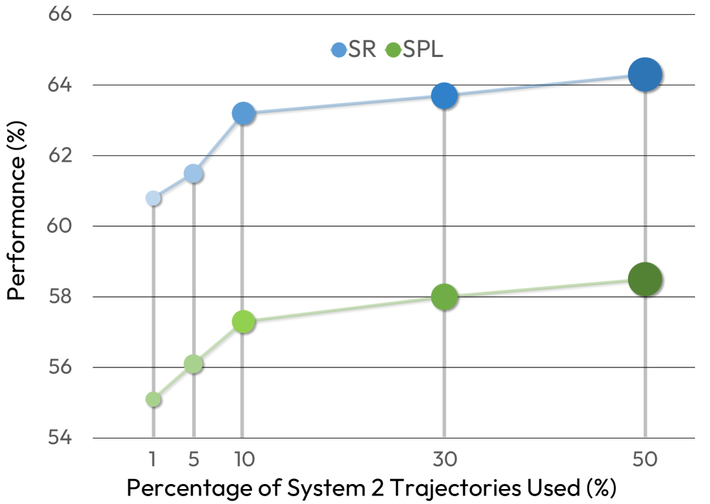

# InternVLA-N1（DualVLN）论文导读：用快慢双系统基础模型，实现通用视觉语言导航

> **论文标题**：Ground Slow, Move Fast: A Dual-System Foundation Model for Generalizable Vision-and-Language Navigation
> **会议/期刊**：ICLR 2026（国际表征学习大会，机器学习领域顶级会议，接受率约 25%）
> **作者**：Meng Wei, Chenyang Wan, Jiaqi Peng, Xiqian Yu, Yuqiang Yang, Delin Feng, Wenzhe Cai, Chenming Zhu, Tai Wang, Jiangmiao Pang, Xihui Liu
> **机构**：上海人工智能实验室（Shanghai AI Lab）、香港大学、浙江大学、清华大学
> **arXiv**：https://arxiv.org/abs/2512.08186
> **代码**：https://github.com/InternRobotics/InternNav
> **模型**：https://huggingface.co/InternRobotics/InternVLA-N1
> **PDF**：[DualVLN.pdf](./DualVLN.pdf)

---

## 读之前先搞清楚

### 这篇论文要解决什么问题？

你对机器人说："穿过这些桌椅，左转进咖啡厅，停在咖啡柜台前。"它需要在一个完全陌生的真实环境中，仅凭摄像头看到的画面和你的这句话，自动避开走动的人，平稳地走到目的地。

这就是**视觉语言导航**（Vision-Language Navigation，简称 VLN）在真实世界面临的挑战。现有的 VLN 方法分三类，各有难以克服的弱点：

**第一类：端到端 VLA 模型**（如 NaVILA、StreamVLN 等，VLA 即 Vision-Language-Action，能同时看图、理解语言、输出动作的模型）。它们把摄像头画面和语言指令一起扔进一个大模型，直接输出"前进0.25米"、"左转15°"之类的离散动作。

- 致命问题 1：**动作碎片化**。每走一小步就要调一次大模型，输出一个离散动作，导致运动卡顿不连贯——机器人走起来像"抽搐"，而非平滑移动
- 致命问题 2：**延迟极高**。大模型推理一次需要几百毫秒，每秒只能走几步。在动态场景中（前面有人突然走出来），根本来不及反应
- 致命问题 3：**无法动态避障**。端到端模型只学会了"按指令走"，没学会"看到障碍物要绕开"——因为训练数据里没有动态障碍物，只有空旷的静态房子

**第二类：模块化方案**（先语义理解→再路径规划→再轨迹控制）。不同模块由不同团队用不同数据训练，信息在各模块之间传递时会损失。

- 致命问题 1：**误差累积**。语义理解偏了 5cm → 路径规划偏了 10cm → 最终走偏半米——每经过一个模块，误差放大一倍
- 致命问题 2：**整体不可优化**。三个模块独立训练，无法端到端联合优化
- 致命问题 3：**深度依赖**。将 2D 图像中的目标转换为 3D 世界坐标需要深度图。深度图只要偏了 10cm，3D 坐标就偏 10cm，后续路径全部跑偏

**第三类：已有的双系统架构**（如 Helix 的 System 1 + System 2）。把"思考"和"执行"分开——一个大模型负责慢速规划，一个轻量策略负责快速执行。

- 致命问题：**只做桌面操作**（拿起杯子、推抽屉），做不了长距离跨房间导航（>10m）。原因是它们不解决"在陌生的大空间中持续理解自己在哪、该往哪走"这个核心难题

> **小白理解**：想象三种导航方式——
>
> - 端到端 VLA 像个"每走一步都要翻完一整本字典才能迈下一步的人"——走得又慢又卡。而且字典里只有"空旷房子怎么走"，没写"前面有人怎么办"。
> - 模块化方案像个"三人接力赛"——第一个人看地图告诉你方向，第二个人画条路线，第三个人执行。但三个人说的"一米"不太一样，传到最后可能差出好几米。而且第二个人画路线时用的"尺子"（深度图）本身就不准。
> - 已有双系统像个"只会做手工活的聪明人"——能灵巧地拿起茶杯，但不会从厨房走到客厅。
>
> **DualVLN 做的是**：把大模型（System 2，VLM）当"导航员"，负责每隔一段路告诉你"往前面那个红绿灯方向走"（在图像上点出一个像素坐标）。然后训练一个专门的"赛车手"（System 1，扩散 Transformer 策略），收到指令后自己能一口气跑 32 步，路上看到行人会自动绕开。**导航员不用每一秒都喊指令——喊一次够车手跑一段；车手不用停下来等导航员——拿着上次的指令就能继续走。两人按自己的节奏异步工作，互不拖累。**

### 读懂这篇论文需要的前置知识

| 概念 | 简单解释 |
|:---|:---|
| **VLN（视觉语言导航）** | 给机器人一句话指令（"穿过走廊去厨房"），它看着摄像头画面走到目的地 |
| **VLA（视觉语言动作模型）** | 一个模型同时干三件事：看画面、理解语言、输出机器人动作 |
| **VLM（视觉语言模型）** | 能同时看图+读文字的大规模预训练神经网络，如 QwenVL、GPT-4V |
| **扩散 Transformer（DiT）** | 把扩散模型（从噪声中逐步恢复干净数据的生成模型）和 Transformer 架构结合的模型 |
| **Flow Matching** | 一种训练扩散模型的方法，学习从噪声到目标数据的"连续流动方向"（流速场），比传统扩散需要更少步骤 |
| **像素目标（Pixel Goal）** | 不输出 3D 坐标，而是直接在 2D 图像中指一个像素点——"往图里这个位置走" |
| **隐式目标（Latent Goal）** | 用一组神经网络学到的特征向量来编码"往哪走"，不显式指定坐标 |
| **异步推理（Asynchronous Inference）** | 快系统（走路）和慢系统（思考）不用互相等待，各按各的频率运行 |
| **KV Cache** | 大模型推理时的优化技术——把已经算过的中间结果缓存起来，下次不用重算 |

---

## 一、DualVLN 的解决思路：双系统异步架构的直觉

### 从"耦合"到"解耦"

传统端到端 VLA 把三件事绑在一起：**语义理解**（"厨房在哪"）、**全局规划**（"穿过走廊、右转"）、**局部控制**（"现在打 5° 方向盘"）。绑在一起的结果是：大模型被迫做它不擅长的低级控制（大模型推理一次几百毫秒，控制需要几十毫秒），小模型又做不了高级语义理解。

DualVLN 的核心洞察：**这三件事需要的时间和精度完全不同**，应该分给不同的"专家"来做：

| 任务 | 需要的能力 | 需要的频率 | 适合谁来做 |
|:---|:---|:---|:---|
| 语义理解 | 海量常识知识 | 每 5-10 秒一次 | 大 VLM（System 2） |
| 全局规划 | 空间推理 + 像素级定位 | 每 0.5-2 秒一次 | 大 VLM（System 2） |
| 局部控制 | 快速反应 + 平滑运动 | 每秒 20-50 次 | 轻量 DiT（System 1） |

### 设计的三个核心问题

**问题 1：System 2 输出什么给 System 1？**

如果输出"下一时刻的动作"（前进0.25m），那就又回到了端到端的老路上——System 1 变成转发器，没有任何自主性。如果输出"3D 世界坐标"，就需要深度图转换，引入模块化方案的误差累积问题。

DualVLN 的巧妙答案：**输出 2D 像素坐标 + 隐式特征**。

- **2D 像素坐标**：直接在图像中指一个点——"往画面里这个位置走"。不需要深度图、不需要 3D 转换，把"去哪"的问题简化为视觉空间中最自然的表达——"你看到的那个方向"。而且选的是**视野内最远的可见点**，意味着 System 1 可以自己走一大段路，大幅降低了 System 2 的调用频率
- **隐式特征**：4 个可学习的 `<TRAJ>` Token 插入 System 2 的输入序列，通过 VLM 的注意力机制自动吸收任务相关的上下文信息（"这个方向通向走廊，走廊那边是厨房，左边是死路……"），压缩为一组紧凑的向量

两者配合：像素坐标给出"明确的方向锚点"（可解释），隐式特征编码"丰富的上下文"（有用信息更多）。

**问题 2：为什么会"走错岔路口"？**

VLN 最常见的失败模式：到了岔路口，模型选了错误的方向，而且一旦走错就再也回不来了。DualVLN 的解决方案是让 System 2 具备**自主视角调整**（Self-Directed View Adjustment）能力——如果当前画面看不到正确的路，System 2 会自己输出"左转"或"抬头"等调整动作，转完再看，确保目标在视野中。

**问题 3：System 1 和 System 2 不同步怎么办？**

System 2 生成目标时是时间 t，System 1 收到这个目标时可能是时间 t+0.1s，画面已经变了。DualVLN 的 System 1 同时处理**两帧图像**：System 2 生成目标时的帧 + 当前帧，通过自注意力机制理解"从那时到现在的变化"——机器人走了多远、视角转了多少。这让 System 1 能基于"旧指令"在"新画面"中做出正确决策。



*DualVLN 双系统框架。System 2（橙，~2Hz）使用 QwenVL-2.5 7B VLM 生成像素目标（pixel goal）和隐式目标（latent goal）。System 1（绿，~30Hz）是轻量扩散 Transformer 策略，接收高频 RGB 输入和 System 2 的异步隐式特征，一次生成 32 个稠密 waypoint。两系统异步运行，互不等待。DualVLN 在 VLN-CE 和 VLN-PE 上均达到新 SOTA，在真实世界部署中也展现出强泛化能力。*

---

## 二、整体流程：快慢交替，空间增强

```
输入：语言指令（"穿过桌椅，左转进咖啡厅，停在柜台前"） + RGB 摄像头画面流（~30Hz）
        ↓
┌──────────────────────────────────────────────────────────┐
│  循环执行（直到 System 2 发 STOP，或超 500 步）           │
│                                                          │
│  ┌─────────────────────────────────────────┐             │
│  │ System 2（~2Hz，VLM 推理，~0.5-0.7s/次）│             │
│  │ ① 看当前/历史画面 + 指令                  │             │
│  │ ② 判断：目标在视野内？                    │             │
│  │    否 → 自主视角调整（转/抬头/低头）       │             │
│  │    是 → 预测最远可见像素坐标 (x,y)        │             │
│  │    到达 → STOP                            │             │
│  │ ③ 4个 <TRAJ> Token 提取隐式目标特征       │             │
│  └────────────────┬────────────────────────┘             │
│                   ↓ latent goal + pixel goal              │
│  ┌─────────────────────────────────────────┐             │
│  │ System 1（~30Hz，DiT 扩散推理，~0.03s/次）│            │
│  │ ① 接收 latent goal（可能稍旧）            │             │
│  │ ② 编码 RGB(t) + RGB(t+k) → 自注意力融合  │             │
│  │ ③ Q-Former 压缩为 32 token              │             │
│  │ ④ Flow Matching 扩散去噪                 │             │
│  │ ⑤ 输出 32 个稠密 waypoint → MPC 执行      │             │
│  └─────────────────────────────────────────┘             │
└──────────────────────────────────────────────────────────┘
        ↓
输出：机器人平滑走完全程，自动避开动态障碍物
```

---

### 第1步：System 2 —— VLM 像素目标预测 + 自主视角调整（~2Hz）

System 2 是整个系统的"大脑"。它不负责每一步的具体动作，而是负责读场景、理解指令、指出方向。

> **这一步在图中对应**：整体架构图（fig1）中橙色部分的 System 2，详细流程见架构图（fig2）左侧。



*DualVLN 详细架构。System 2（左）输入历史自视角图像序列和语言指令，输出三种可能：视角调整动作（左转/右转/抬头/低头）、2D 像素坐标（pixel goal）、或 STOP。System 1（右）接收隐式目标嵌入和高频 RGB 输入，经扩散 Transformer 生成连续轨迹。*

- **输入**：历史 RGB 图像序列（多帧组成"视觉记忆"）+ 语言指令文本
- **操作**：

  > **总览**：RGB 序列 + 语言指令 → QwenVL-2.5 解码 → 三步判断 → 三种输出之一（转视角 / 报坐标 / STOP）
  >
  > ```
  > 输入：历史 RGB 帧 × N + 语言指令
  >         ↓
  > ① QwenVL-2.5 视觉编码（ViT）+ 文本编码 → 联合特征
  >         ↓
  > ② 任务判断：未来轨迹点能投影到当前画面吗？
  >         ↓                     ↓
  >       不能                   能
  >         ↓                     ↓
  > ③a 输出视角调整动作        ③b 预测像素目标
  >   左转/右转 15°             把3D轨迹→2D投影
  >   抬头/低头 15°             深度图过滤遮挡
  >   最多连续4次               选最远可见点
  >         ↓                     ↓
  >   → 转完后重新观察          → 输出 (x,y) 坐标文本
  >                              如 "234 447"
  >                                     ↓
  >                              ③c 已到达？→ STOP
  >         ↓                     ↓
  > 输出：视角调整动作         输出：像素坐标 / STOP
  > ```

  #### ① 先说普通情况：VLM 如何做视觉定位

  一般 VLM（如 GPT-4V、QwenVL）做视觉定位时，是在图像上输出一个**bounding box**（矩形框，如"图中的人在哪里 → (100,200,300,400)"）。这种方法需要模型输出 4 个坐标值（左上角 x,y + 右下角 x,y），而且矩形框和导航需要的"点目标"不直接对应——你不需要知道"厨房门"的完整轮廓，只需要知道"往那个方向走"。

  #### ② 再说本文情况：最远像素目标 (Farthest Pixel Goal Grounding)

  DualVLN 把定位简化为**只输出一个点的坐标** (x, y)，而且这个点是"视野内最远的可见轨迹点"——不是最近的点、不是随机的点。

  具体算法流程：
  1. 拿到专家轨迹（3D 坐标序列）→ 投影到 2D 当前画面
  2. 对每个投影点，用深度图判断是否被遮挡：如果该点的实际 3D 距离 > 深度图中该像素的深度值 → 说明该点被前面的物体遮住了 → 丢弃
  3. 在未被遮挡的投影点中，选择**距离智能体最远**的那个
  4. 把这个点的像素坐标 (x, y) 作为监督标签，训练 VLM 学会预测

  > **小白理解**：普通定位是"在这张图里找一扇门"——画框框，但门有大小，框框也有大小。DualVLN 的定位是"指着图里最远那块能看见的地面"——你不需要精确知道那个点离你几米，你只需要知道"往那个方向走"。而且选最远的点，相当于告诉 System 1："在我下次给你新指示之前，你可以一直走到那个点"——最大化两次 VLM 调用之间的间隔。

  #### ③ 最后说为什么：为什么用像素坐标而不用 3D 点

  这是一个关键的架构选择。PointGoal 导航（用 3D 坐标作为目标）需要先用深度图把像素坐标转成世界坐标。问题在于：深度图本身有误差（单目深度估计误差通常在 10-30 cm），而且这个误差在 3D 转换中被放大。消融实验证明了这一点：用 DualVLN 的 System 2 输出像素坐标 → 转成 PointGoal → 喂给 iPlanner/NavDP 等 PointGoal 策略 → 性能比直接用 System 1 差很多。原因是：像素坐标的"方向信息"是对的（知道该往右前方走），但转成 3D 坐标后方向偏差也被放大了。System 1 的视觉避障能力能容忍"方向对但距离不准"的像素偏差，但 PointGoal 策略对 3D 坐标偏差极其敏感。

  #### ④ 自主视角调整 (Self-Directed View Adjustment)

  当未来轨迹点无法投影到当前画面时（比如需要 90° 转弯，目标在身后），System 2 不强行预测坐标，而是输出**视角调整动作**——Turn Left 15° / Turn Right 15° / Look Up 15° / Look Down 15°。

  最多连续输出 4 次调整动作（即最多转 60° 或抬头 60°），转完后再观察、再判断。这个机制模仿了人类的自然行为——你不会一直盯着前方走路，转弯前你会先转头看目标方向。

  > **小白理解**：你到了一个不熟悉的路口，GPS 说"右转"。你不会"闭眼右转"——你会先转头往右看，确认右边有路，才开始转。System 2 的自主视角调整就是这个"转头看"——它自己判断什么时候需要看别的方向，而不是被动地等画面自动变。

- **输出**：三种可能的输出之一——视角调整动作序列（如"→ → → →"= 右转 60°）/ 像素坐标文本（如"234 447"）/ STOP

### 🔢 具体数字例子：System 2 一次完整的判断过程

**场景**：机器人在走廊直行，语言指令是"走到走廊尽头，看到台球桌后右转，进入有书架的房间"。

**时刻 1**：当前画面能看到走廊前方 15m，未来轨迹投影到画面上，最远可见点在 (512, 300)。→ System 2 输出 "512 300"

**时刻 2**（走了 ~12m 后）：到了走廊尽头，前方是 T 字路口。台球桌在右侧但被左侧墙壁遮挡，未来轨迹点无法投影 → System 2 判断"需要调整视角" → 输出 "→ → → →" = 右转 60°

**时刻 3**：右转 60° 后，台球桌进入视野，书架房间的门在台球桌右边。最远可见点在 (600, 220)。→ System 2 输出 "600 220"

**时刻 4**（走到书架房间门口）：房间内的书架目标在 3m 内 → System 2 输出 "STOP"

> **关键理解**：整个过程中 System 2 工作了 4 次（3次报坐标 + 1次 STOP），而 System 1 在此期间高频运行了约 60 次（按 2s 总时间 × 30Hz 计算）。**大模型只在关键决策点（岔路口、目标接近）被调用，每一步怎么走、怎么避障全交给轻量 System 1。**

---

### 第2步：System 1 —— 隐式目标引导的扩散 Transformer 轨迹生成（~30Hz）

System 1 是整个系统的"小脑"。它不关心"厨房在哪"这种高级语义，只关心一件事：**给定一个方向（来自 System 2），如何在当前画面中走出一条平滑、不撞障碍物的轨迹**。

> **这一步在图中对应**：架构图（fig2）右侧部分。System 1 从冻结的 System 2 中提取隐式目标特征，结合高频 RGB 输入，用 Flow Matching 扩散去噪生成 32 个轨迹 waypoint。

- **输入**：隐式目标特征（来自 System 2，~2Hz，可能已经"过了" 0.1~0.5 秒）+ 当前 RGB 画面（~30Hz）+ System 2 生成目标时的 RGB 画面
- **操作**：

  > **总览**：latent goal + RGB(当前) + RGB(System 2 时刻) → ViT 编码 → 跨时间自注意力融合 → Q-Former 压缩 → DiT Flow Matching 去噪 → 32 个稠密 waypoint
  >
  > ```
  > 输入：隐式目标 Z' + RGB(t) + RGB(t+k)
  >         ↓
  > ┌────────────────────────────────────────┐
  > │ ① 隐式目标提取（一次性，System 2 完成后）│
  > │   4个 <TRAJ> 可学习 Token               │
  > │   → 插入 System 2 的冻结 VLM 序列末尾    │
  > │   → 经 VLM 全部注意力层处理             │
  > │   → 输出 4个隐式向量 = Z' (3584 dim)    │
  > │   → 线性投影到 768 dim (匹配 DiT)       │
  > │        ↓                               │
  > │ ② 跨时间视觉融合（每步执行）             │
  > │   RGB(t) → ViT → 特征 F_t              │
  > │   RGB(t+k) → ViT → 特征 F_{t+k}        │
  > │   [F_t ; F_{t+k}] → 自注意力融合       │
  > │   → Q-Former 压缩 → 32 个视觉 cond token │
  > │        ↓                               │
  > │ ③ Flow Matching 扩散去噪（每步执行）     │
  > │   噪声轨迹 X_T（32 waypoint，全随机）     │
  > │   条件：[latent Z' ; 视觉 cond token]    │
  > │        ↓  t=T→T-1→...→0                │
  > │   DiT 每步预测"流速场"方向              │
  > │   沿流场更新轨迹 → 逐步去噪              │
  > │        ↓                               │
  > │   干净轨迹 X_0 (32 waypoint)            │
  > └────────────────────────────────────────┘
  >         ↓
  > 输出：32 个稠密 waypoint（相对位姿序列） → MPC 控制器 → 电机指令
  > ```

  #### ① 隐式目标 —— 更深层的理解

  在前面的架构概述中已经说明了像素目标和隐式目标的分工。这里深入讲一下隐式目标的技术实现。

  为什么用**4 个** `<TRAJ>` Token 而不是 1 个？因为不同的 Token 可以关注 VLM 隐层中不同方面的信息——一个可能关注"方向"，一个关注"距离"，一个关注"障碍物"，一个关注"任务进度"。这种多头隐式表示比单一向量更丰富。消融实验中，4 个 Token 是经验确定的最优数量。

  技术上，这些 `<TRAJ>` Token 是**在 System 2 训练完成后才引入的**（Phase 2）。它们被追加在 pixel goal 文本之后（如序列末尾："234 447 <TRAJ><TRAJ><TRAJ><TRAJ>"），然后和所有其他 Token 一起通过冻结的 VLM 做前向传播。输出时，只取这 4 个 Token 对应的最后一层隐藏状态（维度 3584 = QwenVL-2.5 的隐层维度），线性投影到 768 维后作为 DiT 的 cross-attention 条件。

  > **小白理解**：1 个 Token 像是让你用一句话描述"怎么去咖啡厅"——你可能说"右转直走"。4 个 Token 像是让你用四句话描述——"前方直走约 15 米"、"注意左边有墙"、"到第二路口右转"、"右转后房间在左手边"。四句话的信息量比一句话丰富得多，System 1 执行起来也更精准。

  #### ② 先说普通情况：扩散模型如何生成轨迹

  普通的扩散模型（如 DDPM，Denoising Diffusion Probabilistic Model）工作方式是：先给数据加噪声（正向过程，一步步把干净数据变成纯噪声），再训练模型学习逆向去噪（反向过程，从噪声中恢复数据）。通常需要 100-1000 个去噪步骤才能生成高质量样本，推理速度慢。

  扩散策略（Diffusion Policy）把这个思路用到机器人控制上——不生成图像，而是生成**轨迹 waypoint 序列**（一连串坐标点描述机器人接下来该怎么走）。去噪过程从随机散布的点逐步变成一条平滑路径。

  #### ③ 再说本文情况：Flow Matching + DiT 的轻量高速实现

  DualVLN 用的是 **Flow Matching**（流匹配），而非传统 DDPM。

  **Flow Matching 的原理**（用简单数学直觉）：
  - DDPM 学习"逆向去噪"：我知道噪声长什么样（标准差为 σ 的高斯噪声），也知道数据长什么样（专家轨迹），但逆向过程没有简单的数学形式，需要一步步模拟
  - Flow Matching 学习"流速场"：在噪声和数据之间定义一条**直线插值路径** $X_u = \alpha_u X_0 + \sigma_u \epsilon$（其中 $\alpha_u$ 是递减函数，$\sigma_u$ 是递增函数），模型直接学这条路径上每一点的"流动速度"（$\dot{X}_u$）。推理时沿流速场从噪声走到数据——路线是直的，所以需要的步数大幅减少

  **Flow Matching 的优势（为什么选它）**：
  1. 需要的去噪步数少（DualVLN 中只需少量步，具体数未公开，但远少于 DDPM 的 100+步）
  2. 生成的轨迹更平滑（直线插值路径天然平滑，不像 DDPM 的 S 形随机路径）
  3. 训练目标简单——MSE（均方误差）：$$\mathcal{L}_{flow} = \mathbb{E}_{u,X_0,\epsilon}\!\bigl[\|\hat{\dot{X}}_u - \dot{X}_u\|^2_2\bigr]$$

  **DiT 的设计**（Diffusion Transformer）：
  - 隐层维度 384（非常轻量，对比 VLM 的 3584）
  - 12 层 Transformer
  - 6 个注意力头
  - 输入：噪声轨迹 X_u（32 waypoint × 2D 坐标） + timestep u + 跨注意力条件（latent Z' + 视觉 token F）
  - 输出：预测的流速 $\hat{\dot{X}}_u$

  > **小白理解**：DDPM 去噪像"蒙着眼走迷宫"——每一步都在试探，走 100 步才能从噪声走到数据。Flow Matching 像"开着 GPS 走直线"——你知道起点（噪声）和终点（干净数据），GPS（流速场）告诉你每一步直接往哪个方向走，也许 10 步就到了。**这就是为什么 System 1 能在 0.03 秒内生成完整轨迹——Flow Matching 需要的步骤少得多。**

  #### ④ 异步推理的跨时间融合机制

  这是 DualVLN 最精妙的设计之一。System 2 生成 latent goal 时是时间 t，System 1 收到时可能是时间 t+0.1s 甚至 t+0.3s。画面已经变了——机器人已经往前走了几十厘米，可能转了方向。

  如果 System 1 只用当前画面（时间 t+k）配合"旧的"latent goal，会不知道这个 latent goal 说的是"画面中哪个方向"。因为 latent goal 编码的是**时间 t 画面中的方向**，和当前时间 t+k 的画面不是同一帧。

  System 1 的做法：同时输入两帧——
  - RGB(t)：System 2 生成目标时的画面
  - RGB(t+k)：当前画面

  两帧分别经过同一个 ViT（DepthAnythingV2-Small 的视觉编码器）提取特征，然后通过**自注意力机制**交叉关注彼此——让模型理解"时间 t 的那个方向在时间 t+k 变成了画面的哪里"。融合后的特征经过 Q-Former 压缩为 32 个紧凑 Token，作为 DiT 的条件输入。

  > **小白理解**：你有一张 10 秒前拍的街景照片，导航员在照片上圈了一个红圈说"往那走"。现在你走了几步，眼前的景色变了。你怎么办？你拿着旧照片和眼前的景色对比——"照片里的红绿灯，现在是画面右侧那个位置"——找到对应关系，然后朝正确的方向走。System 1 的跨时间融合做的就是这件事——把"旧照片中的目标方向"映射到"新画面中的实际位置"。

  > ❓ **常见疑问：为什么不每次都用最新的 System 2 输出？那样不就不需要跨时间融合了吗？**
  >
  > 因为 System 2 的 VLM 推理一次需要 ~0.5-0.7 秒（即使用 KV-cache 优化后）。如果在 System 1 的每一次推理（每 0.03 秒）时都同步等待 System 2 的新输出，那 System 1 的频率会被拖慢到 ~2Hz——和端到端模型一样慢了。DualVLN 的异步设计正是为了**避免这种等待**：System 1 用"稍旧但可用的"latent goal 高频执行，等 System 2 更新了新目标再切换。这种 trade-off（用一点点信息滞后换取大幅频率提升）在实际部署中极其有效——因为 latency 对机器人控制的伤害远大于信息滞后。

- **输出**：32 个稠密 waypoint（相对位姿序列），直接由 MPC（模型预测控制）跟踪执行

### 🔢 具体数字例子：System 1 一次完整轨迹生成

**条件设定**：机器人在走廊直行中，System 2 刚输出 pixel goal (512, 300)（走廊前方 12m 处），latent goal 编码了"直行、走廊无障碍"。当前前方 3m 处有一个行人突然走出来。

**Step 1：跨时间融合**

| 输入 | 内容 | 编码后维度 |
|:---|:---|:---|
| RGB(t) | System 2 时刻画面（行人还没出现） | ViT → 257 tokens × 384 dim |
| RGB(t+0.1s) | 当前画面（行人出现，偏左） | ViT → 257 tokens × 384 dim |
| 自注意力融合后 | "旧方向+新障碍"综合理解 | 514 tokens → Q-Former → 32 tokens |

**Step 2：Flow Matching 扩散去噪（示意 3 步）**

| 去噪步 | 轨迹状态 | 说明 |
|:---:|:---|:---|
| Step 10（初始噪声） | 32 个随机散布的点 | 完全随机，覆盖整个画面范围 |
| Step 5 | 点开始聚拢，出现"直行"趋势 | 流速场引导向 latent goal 方向 |
| Step 3 | 轨迹成形，出现"右偏绕障"趋势 | 视觉条件（看到行人）开始影响轨迹 |
| Step 0（最终） | 32 点平滑曲线，前 5 点轻微右偏避开行人，后 27 点回到走廊中心线 | 完成：既绕开行人，又回到目标方向 |

**Step 3：数值示意（简化）**

| Waypoint # | dx (m) | dy (m) | 含义 |
|:---:|:---:|:---:|:---|
| 1 | +0.25 | 0.00 | 直行 |
| 2 | +0.28 | +0.05 | 微右偏 |
| 3 | +0.30 | +0.10 | 继续右偏绕障 |
| 4 | +0.30 | +0.05 | 开始往回靠 |
| 5 | +0.28 | 0.00 | 回到中心线 |
| 6-32 | +0.30 | 0.00 | 沿走廊直行 |

> **关键理解**：System 1 在 0.03 秒内生成了 32 步（约 8-10m）的完整轨迹，其中前 5 步自动绕开了行人，后面恢复正常。**这种"局部避障 + 全局任务保持"的能力来自两个条件的共同作用：latent goal 保持全局方向，当前视觉输入提供局部障碍信息。两者通过 DiT 的 cross-attention 融合，在扩散去噪过程中自然协调。**

---

### 第3步：MPC 控制器执行轨迹（~100Hz）

System 1 输出的是 32 个相对位姿 waypoint（每两个点之间约 0.25-0.3m 的间隔）。MPC 控制器负责把这些 waypoint 转换成实际的电机指令——以高频率（100Hz+）解算每个时刻应该给轮子多大的扭矩/速度，同时保证跟踪精度和平稳性。MPC 的具体实现在论文中没有详细展开（使用了标准方法），这不是 DualVLN 的核心贡献。

---

## 三、核心创新点

### 创新1：首个 VLN 异步双系统基础模型

**与众不同之处**：此前没有任何工作将"VLM 慢推理 + 扩散策略快执行"的异步架构成功应用于视觉语言导航。

Helix 的双系统只做桌面操作（短距离、简单环境），不涉及跨房间长距离导航。其他 VLN 方案要么端到端（慢 + 无避障），要么模块化（误差累积）。DualVLN 是第一个实现 System 2（VLM, 2Hz）和 System 1（DiT, 30Hz）异步协作的 VLN 系统，且两个系统通过显式像素目标 + 隐式特征双重连接。

**与端到端的关键区别**：端到端模型每步都要调 VLM → 最高 ~2Hz；DualVLN 只在关键决策点调 VLM → System 1 保持 30Hz。15 倍的频率差距意味着：端到端模型在 0.5 秒内最多反应 1 次，DualVLN 可以反应 15 次——一个人突然冲出来，前者大概率撞上，后者有足够时间绕开。

> **小白理解**：端到端像"边翻字典边走路"——0.5 秒走一步、0.5 秒翻一页。DualVLN 像"导航员说一次，自己走 15 步"——发音 1 次、走 15 步。**走到第 3 步冒出一个人，端到端还低着头翻字典没看见，DualVLN 已经从容绕过去了。**

### 创新2：双重目标表示 —— 显式像素坐标 + 隐式潜在特征

**与众不同之处**：只靠像素坐标连接双系统太"薄"（丢失了 VLM 的丰富上下文），只靠隐式特征又不可解释。DualVLN 用**渐进两阶段训练**解决了这个问题：

1. Phase 1：训练 System 2 输出显式像素坐标（可解释、可验证、易泛化）
2. Phase 2：冻结 System 2，训练隐式查询 Token 从 VLM 隐藏状态中提取 richer conditioning → 喂给 System 1

消融实验结果（详见第五章）：
- w/o Pixel Goal（移除像素目标，只用隐式特征）→ 性能下降。证明显式的空间锚点对 System 1 的轨迹生成至关重要——它需要一个明确的"方向基准"
- w/o Latent Goal（只用 VLM 最后一层隐藏状态，不用可学习查询）→ 性能大幅下降。证明被动消费固定的 VLM 特征不如主动学习"哪些信息对导航有用"
- w/o Sys.2 Train（System 1 & 2 联合端到端训练，不做解耦）→ 收敛极慢 + VLM 泛化能力丧失。证明解耦训练对保留 VLM 的零样本泛化能力至关重要

> **小白理解**：双重表示=导航员既在挡风玻璃上贴了箭头（像素坐标），又在你耳边说了一句话（隐式特征）。如果只有箭头，箭头指的地方可能被障碍物挡住，你不知道该不该走；如果只有耳语，你只知道"大致这个方向"但不够精确。**箭头给你精确空间锚点，耳语给你丰富环境上下文——合在一起，System 1 既有方向又有判断力。**

### 创新3：自主视角调整 —— 让 VLM 学会"转头看"

**与众不同之处**：所有现有 VLN 方法假设目标永远在当前视野内。但真实导航时，目标经常在视野外——需要转弯时在身后，需要上楼时在头顶。传统方案要么强行在视野外预测坐标（导致随机输出），要么需要人工设计视角调整规则。

DualVLN 的创新：把视角调整也作为一个**可学习的决策**融入 VLM 的输出空间——VLM 自己判断"现在需要转头看"还是"目标已在视野内，可以报坐标了"。这个决策和 pixel goal 预测共享同一个网络，在统一的训练数据中学会。

> **小白理解**：之前的方法=你被要求"只看前方，永远不转头"，然后让你找到身后的门——你只能瞎猜。DualVLN=你被允许转头看，而且你**自己学会**什么时候该转头。这种自主性让 System 2 的决策更自然、更可靠。

### 创新4：Social-VLN 基准 —— 首次评估 VLN 动态避障

**与众不同之处**：所有现有 VLN 基准（VLN-CE R2R/RxR）都是**完全静态**的场景——空无一人的房子，只有固定的墙壁和家具。DualVLN 首次提出了 **Social-VLN** 基准——在 VLN 轨迹的关键位置放置动态行人（用 Habitat 3.0 的 Humanoid 模拟），要求机器人**先绕开人、再回到原任务路径**。新指标 HCR（Human Collision Rate，人类碰撞率）直接衡量安全性。

Social-VLN 的实验揭示了一个残酷事实：加入动态行人后，**所有方法的成功率都暴跌 ~27 个百分点**（DualVLN 从 64.3% → 37.2%，StreamVLN 从 56.9% → 31.4%）。这说明"避障 + 任务恢复"是 VLN 领域一个被严重低估的极难问题。

---

## 四、实现细节

### 模型配置

| 维度 | 配置 | 为什么这样设置 |
|:---|:---|:---|
| **System 2 基座** | QwenVL-2.5 (7B)，ViT + LLM 全参数微调 | 7B 是当时最强的开源 VLM 之一；全参数微调让模型充分适应导航特有的像素级定位任务 |
| **System 2 学习率** | AdamW, lr=2×10⁻⁵, batch=128, 14000 steps | 标准 VLM 微调 setting；14K steps 在 VLN-CE 数据量下足够收敛 |
| **System 2 输出格式** | 文本形式："234 447"（像素坐标） / "→ → → →"（视角调整） / "STOP" | 利用 VLM 的原生文本生成能力，无需额外输出头 |
| **System 1 架构** | DiT（扩散 Transformer），384 隐层，12 层，6 注意力头 | 极致轻量化：384 dim 远小于 VLM 的 3584 dim，12 层也足够表达轨迹分布 |
| **System 1 视觉编码** | DepthAnythingV2-Small ViT 骨干 | 预训练的视觉特征提取器，开箱即用的高质量 RGB 特征；Small 版本在速度和精度间最优 |
| **隐式 Token** | 4 个 `<TRAJ>` 可学习查询，随机初始化 | 4 个查询经验最优（消融中尝试过 1/2/4/8 个） |
| **隐式维度变换** | 3584（QwenVL 隐层）→ 线性投影 → 768（DiT cross-attn） | 降维减少 DiT 参数量，同时保留关键信息 |
| **Q-Former 压缩** | 视觉特征 → Q-Former → 32 个紧凑 Token | 减少 DiT 的 cross-attention 计算量，32 token 是速度和信息量的平衡 |
| **System 1 优化器** | AdamW, lr=1×10⁻⁴, batch=128, 15000 steps | 扩散模型训练常用学习率 |
| **Flow Matching Schedule** | $\alpha_u = \cos(\frac{\pi u}{2})$, $\sigma_u = \sin(\frac{\pi u}{2})$ | 余弦调度在生成质量和训练稳定性间表现出色 |

### 训练策略详解

| 阶段 | 训练内容 | 数据 | 冻结/训练 | 关键设计 |
|:---|:---|:---|:---|:---|
| **Phase 1** | System 2 像素目标预测 | VLN-CE R2R/RxR 专家轨迹（投影到 2D 标注 pixel goal） | VLM 全参数训练 | 三种输出类型混合训练：视角调整 30% + 像素坐标 60% + STOP 10% |
| **Phase 2** | System 1 轨迹生成 | 从 Phase 1 的 System 2 输出中采样 pixel goal + 对应轨迹段 | 冻结 System 2，仅训练 4 个 `<TRAJ>` Token + DiT + Q-Former | 解耦训练保护 VLM 泛化能力；只优化 3 个小组件，训练极快 |

#### DAgger：从纯模仿学习到在线学习的桥梁

DualVLN 在 Phase 1 训练中使用了 **DAgger**（Dataset Aggregation，数据集聚合）策略——这是理解这篇论文与强化学习关系的关键。

**先说行为克隆（BC）的局限**：Phase 1 如果只用专家轨迹做监督学习（BC），模型只见过"完美走法"。部署时一旦偏离专家路径（比如在岔路口选错了方向），就进入训练数据中从未见过的"陌生区域"——模型不知道该怎么恢复，只能乱走，然后越走越偏、越偏越乱。这就是 RL 中经典的**分布偏移**（distribution shift）问题。

**DAgger 怎么解决**：
1. 先用专家数据训练一个初始策略 $\pi_1$
2. 让 $\pi_1$ 自己去环境中走，收集它**实际走过的轨迹**（这些轨迹包含它的"犯错路径"，而不只是专家的完美路径）
3. 对 $\pi_1$ 走过的每一帧，用专家标注"这一步应该怎么走"（通过投影 3D 专家轨迹到 2D）
4. 把这些"犯错+纠错"数据加入训练集，训练 $\pi_2$
5. 重复 1-2 轮

**DAgger 与 RL 的关系**：DAgger 是**模仿学习**（Imitation Learning），不是 RL——因为它仍然用专家标注做监督，而不是用奖励信号。但它和 RL 共享了一个核心理念：**让策略接触自己的"犯错分布"**（online data collection），而不是只见过"完美分布"（offline expert data）。在模仿学习到 RL 的光谱上：BC（纯离线）→ DAgger（在线+专家纠错）→ RL（在线+奖励驱动探索）。DualVLN 站在这个光谱的中间位置。

> **小白理解**：纯 BC 像"只看标准答案册学开车"——册子里全是完美路线。一上路发现实际路况和册子不一样，懵了。DAgger 像"教练坐副驾"——你先自己开（可能犯错），教练在你犯错时告诉你"这时候应该这样打方向盘"。虽然教练不会给你打分（那是 RL 的事），但至少你学会了"自己犯错时怎么纠正"。**这种"在线纠错"能力是 DAgger 区别于纯监督学习的关键，也是它最接近 RL 的地方。**

#### 与 RL 基线的对比

DualVLN 在消融实验中系统比较了其 System 1（Flow Matching 扩散策略）与 RL-based 的 PointGoal 策略（如 iPlanner、NavDP）。核心发现：**扩散策略 + 像素空间工作 > RL 策略 + 3D 坐标转换**。原因不是扩散策略"天生比 RL 好"，而是像素→3D 转换中的深度误差对 RL 策略的损害远大于对扩散策略的损害——RL 策略精确依赖 3D 坐标，扩散策略对"方向对但距离不准"的偏差天然鲁棒。

### 推理部署

| 维度 | 配置 | 为什么这样设置 |
|:---|:---|:---|
| **服务器端** | 单 RTX 4090（24GB），承载 System 2 + System 1 | VLM 推理需 ~20GB 显存 |
| **机器人端** | Intel RealSense D455 RGB-D 摄像头（仅用 RGB） + 机载计算单元执行 MPC | 端侧只需轻量控制，不需要 GPU |
| **System 2 延迟** | 1.1s（无优化）→ 0.7s（KV-cache 复用） | KV-cache 复用：连续推理时复用历史帧的 Key-Value 缓存，避免重复编码相同的历史画面 |
| **System 1 延迟** | 0.03s | TensorRT 加速 + 少量去噪步 |
| **双系统频率比** | System 1 推理 15-20 次 / System 2 推理 1 次 | 异步不等待，各自按需运行 |
| **跨越的机器人平台** | 轮式 Turtlebot4、四足 Unitree Go2、人形 Unitree G1 | 零样本（zero-shot）——未在任何真实机器人数据上训练，直接部署 |

---

## 五、实验结果

### 5.1 VLN-CE 仿真结果（R2R & RxR Val-Unseen，仅 RGB）

| 方法 | 观测类型 | R2R NE↓ | R2R SR↑ | R2R SPL↑ | RxR NE↓ | RxR SR↑ | RxR SPL↑ | RxR nDTW↑ |
|:---|:---|:---:|:---:|:---:|:---:|:---:|:---:|:---:|
| Seq2Seq (2020) | RGB-D | 7.77 | 25.0 | 22.0 | 12.10 | 13.9 | 11.9 | 30.8 |
| CMA (2022) | 全景+深度 | 6.20 | 41.0 | 36.0 | 8.76 | 26.5 | 22.1 | 47.0 |
| ETPNav (2025) | 全景+深度 | 4.71 | 57.0 | 49.0 | 5.64 | 54.7 | 44.8 | 61.9 |
| NaVILA (2024) | RGB | 5.22 | 54.0 | 49.0 | 6.77 | 49.3 | 44.0 | 58.8 |
| StreamVLN (2025) | RGB | 4.98 | 56.9 | 51.9 | 6.22 | 52.9 | 46.0 | 61.9 |
| **DualVLN** | **RGB** | **4.05** | **64.3** | **58.5** | **4.58** | **61.4** | **51.8** | **70.0** |

> **小白理解**：DualVLN 在**只使用单目 RGB**（最廉价的传感器配置）的情况下，所有指标全面超越使用了全景+深度+里程计的 ETPNav。SR（成功率）比 StreamVLN 高 **7.4 个百分点**，SPL（路径效率）高 **6.6 个百分点**。NE（最终距离误差）从 4.98m 降到 4.05m——意味着没走到的那些 case，离目标也近了近 1m。

**为什么 DualVLN 的 SPL 提升比 SR 更显著？** SPL = SR × (最优路径长度 / 实际路径长度)。DualVLN 的 System 1 生成连续平滑轨迹（而非离散的"前进0.25m-停-前进0.25m"），走的路径更直、更短、更接近最优路径。离散动作在弯道处会走折线（前进→转15°→前进→转15°→...），而连续轨迹直接画弧线。

### 5.2 VLN-PE 物理仿真结果（Unitree H1 人形机器人）

VLN-PE 是含物理引擎的仿真平台——机器人受重力、摩擦力、关节力矩限制，会摔倒、会卡住。这对离散动作方案是灾难（走一步停一步，容易失去平衡），对连续轨迹方案则友好得多。

| 方法 | Val-Unseen SR↑ | Val-Unseen SPL↑ | Fall Rate↓ | Stuck Rate↓ |
|:---|:---:|:---:|:---:|:---:|
| Seq2Seq | 16.5 | 14.1 | 18.0% | 3.0% |
| CMA | 16.9 | 15.2 | 17.1% | 3.8% |
| NaVid | 22.4 | 18.6 | 8.6% | 0.45% |
| **DualVLN** | **51.6** | **42.5** | **12.3%** | **2.2%** |

> **小白理解**：DualVLN 在**零样本**（从未在 VLN-PE 数据上训练过，只训练了 VLN-CE 数据）条件下成功率碾压所有 baseline——是 NaVid 的 **2.3 倍**。NaVid 摔倒率低（8.6%）但成功率也低（22.4%）——说明 NaVid 走得"小心但经常走不到"。DualVLN 成功率高一倍多，摔倒率仍然可控（12.3%）。连续轨迹的物理合理性远超离散动作。

### 5.3 Social-VLN 动态避障评测

| 方法 | 标准 VLN SR↑ | Social-VLN SR↑ | 下降幅度 | HCR↓ |
|:---|:---:|:---:|:---:|:---:|
| StreamVLN | 56.9 | 31.4 | ↓25.5 | 36.4% |
| **DualVLN** | **64.3** | **37.2** | ↓27.1 | **35.4%** |

> **小白理解**：两个关键发现：① 动态行人对所有方法都是灾难性的——成功率暴跌 ~26 个百分点。② DualVLN 比 StreamVLN 在 Social-VLN 下成功率高 5.8 个百分点（37.2 vs 31.4），碰撞率略低。但 37.2% 的绝对成功率仍然很低——说明动态社交导航离"好用"还有巨大距离。

### 5.4 真实世界跨具身实验



*真实世界量化评测。在走廊（easy）、卧室（medium）、办公室（hard，跨房间）三种场景各 20 次试验。DualVLN 在所有场景下取得最高成功率（SR↑）和最低导航误差（NE↓），且方差小，展现稳定的泛化能力。*



*VLM 方法真实世界性能雷达图分析。NaVid 在复杂任务上表现挣扎（近 0% SR on hard）；NaVILA 能处理长距离但常错过最终目标（NE 大）；StreamVLN 能避障但牺牲了任务完成率。DualVLN 在所有难度等级的静态和动态场景下均保持高 SR 和低 NE。*

关键发现：DualVLN 在三种不同的机器人平台上（Turtlebot4 轮式、Go2 四足、G1 人形）均以零样本方式部署成功——**没有在任何真实机器人数据上训练过**，全靠仿真训练的 System 2 的泛化能力和 System 1 的稳健轨迹生成。

### 5.5 消融实验



*消融实验分析不同目标表示方式对 System 1 的影响。从左到右：w/o Sys.2 Train（联合训练，不解耦）、w/o Pixel Goal（移除像素坐标，仅用隐式特征）、w/o Latent Goal（仅用 VLM 冻结尾层隐状态）、完整 DualVLN。完整方案在所有指标上最优。*

| 消融变体 | SR 变化 | 关键结论 |
|:---|:---|:---|
| **w/o Sys.2 Train**（端到端联合训练） | ↓↓↓ | VLM 在联合训练中失去零样本泛化；System 1 收敛极慢。**解耦训练是必需的** |
| **w/o Pixel Goal**（只用隐式特征） | ↓↓ | 缺显式空间锚点，System 1 失去精确方向指引 |
| **w/o Latent Goal**（只用 VLM 末层输出） | ↓↓↓ | 被动使用固定 VLM 特征远不如可学习查询主动提取有用信息 |



*System 1 对像素目标误差的鲁棒性分析。System 1 对**方向正确但位置略有偏差**的像素目标（如目标点落在了障碍物边缘）具有鲁棒性——能自动绕开障碍物朝正确方向走。但对**方向大幅错误或语义完全错误**的像素目标不鲁棒——说明 System 1 的避障是局部修正而非全局重规划。*

**System 1 替换为 PointGoal 策略的消融**：

| System 1 方案 | VLN-PE SR↑ | 说明 |
|:---|:---:|:---|
| iPlanner（PointGoal 策略） | 47.1 | 深度图误差 → 3D 坐标放大误差 |
| NavDP（PointGoal 策略） | 58.7 | 同上，但更强的 PointGoal 策略 |
| **DualVLN System 1（本文）** | **63.6** | 直接在像素空间工作，绕开深度误差 |

> **小白理解**：这个消融是最致命的——即使给你"完美的"深度图（oracle depth），把 pixel goal 转成 PointGoal 后再用最强的 PointGoal 策略走，效果也不如 DualVLN 的 System 1 直接在像素空间工作。**核心原因：深度图永远有误差，3D 转换会放大误差。System 1 的视觉避障直接在 2D 图像空间中工作，对"方向对但距离不对"的像素偏差天然鲁棒。**



*System 1 的数据缩放行为。与 System 2（VLM）的"越多越好"不同，System 1 用 1% 训练数据就能达到有竞争力的性能，10% 接近饱和。说明 System 1 的局部导航任务相对简单，不需要海量数据——这印证了"解耦设计"的合理性：VLM 需要海量数据培养推理能力，而轻量 System 1 用少量数据就够了。*

---

## 六、在整个领域的位置

```
                            VLN 技术演进树
                                  │
        ┌─────────────────────────┼─────────────────────────┐
        ▼                         ▼                          ▼
   传统模块化                  端到端 VLA                 早期双系统
  (Seq2Seq, CMA,           (NaVid, NaVILA,           (Helix — 桌面操作
   ETPNav)                  StreamVLN)                 Run-Ruminate-Regulate
   需全景+深度+里程计         纯 RGB, 离散动作             — 思考+执行不分频)
        │                         │                          │
        │                    致命缺陷:                        │
        │                • 动作碎片化 (一卡一卡)               │
        │                • 无法动态避障                        │
        │                • 高频调用 VLM (慢)                   │
        │                         │                          │
        └─────────┬───────────────┘                          │
                  ▼                                          │
        ★ DualVLN (InternVLA-N1) ★                           │
            ICLR 2026, 上海 AI Lab                            │
    System 2 (VLM, 2Hz) + System 1 (DiT, 30Hz)               │
    双重连接: 像素目标 + 隐式特征                              │
    VLN-CE 64.3% SR | VLN-PE 51.6% SR                        │
    Social-VLN 新基准 | 3×机器人零样本部署                     │
                  │                                          │
                  ├─────────────────────────────┐             │
                  ▼                             ▼             │
         后续工作: SEDualVLN              同期工作: ABot-N0  │
         (加空间增强, 67.3% SR)         (五任务统一, 7×SOTA)  │
                  │                             │             │
                  └─────────────┬───────────────┘             │
                                ▼                             │
                      通用 VLN 基础模型                        │
                      更快的推理 | 更多任务 | 更强安全         │
```

---

## 七、局限性

| 局限 | 为什么是局限 |
|:---|:---|
| **Social-VLN 成功率仍很低（37.2%）** | 加入动态行人后崩溃式下降，说明"避障+任务恢复"是远未解决的极难问题 |
| **System 2 仍需 GPU 服务器** | 7B VLM 推理需 RTX 4090 级 GPU，无法在 Jetson 等边缘芯片运行，限制完全离线部署 |
| **latent goal 可解释性差** | 4 个隐式查询学到了什么？为什么是 4 个？目前全靠经验+消融，缺乏理论分析 |
| **训练数据来自仿真** | 100% 仿真训练数据（Habitat VLN-CE），sim-to-real gap 虽然靠系统设计缓解但未根本消除 |
| **Social-VLN 行人模型简单** | 用 A* 重规划模拟行人行为，远不如真实人类的行为复杂性（突然加速、群体交互等） |
| **MPC 控制器需里程计** | 虽不依赖深度图，但仍需里程计做位姿估计——真实世界中里程计有漂移 |
| **不支持多楼层** | VLN-CE 全为单层建筑，没有楼梯/电梯场景 |

---

## 八、一句话总结

**DualVLN（InternVLA-N1）首次将"VLM 在像素空间慢推理（2Hz）+ 扩散 Transformer 快执行（30Hz）"的异步双系统架构引入视觉语言导航——两系统通过显式像素目标（可解释锚点）和隐式特征（丰富上下文）双重连接，在 VLN-CE（64.3% SR）和 VLN-PE（51.6% SR，零样本）上均达 SOTA，跨三种机器人零样本部署，并首次提出 Social-VLN 基准揭示动态避障+任务恢复是领域最紧迫的未解难题。**

---

## 参考资料

1. DualVLN 论文: https://arxiv.org/abs/2512.08186
2. InternVLA-N1 技术报告: https://internrobotics.github.io/internvla-n1.github.io/static/pdfs/InternVLA_N1.pdf
3. InternNav 代码: https://github.com/InternRobotics/InternNav
4. 模型权重: https://huggingface.co/InternRobotics/InternVLA-N1
5. InternData-N1: https://huggingface.co/datasets/InternRobotics/InternData-N1
6. NaVILA: https://arxiv.org/abs/2412.04453
7. StreamVLN: https://arxiv.org/abs/2507.05240
8. Flow Matching: Lipman et al., ICLR 2023
9. VLN-CE: Krantz et al., ECCV 2020
10. VLN-PE: Wang et al., 2025
