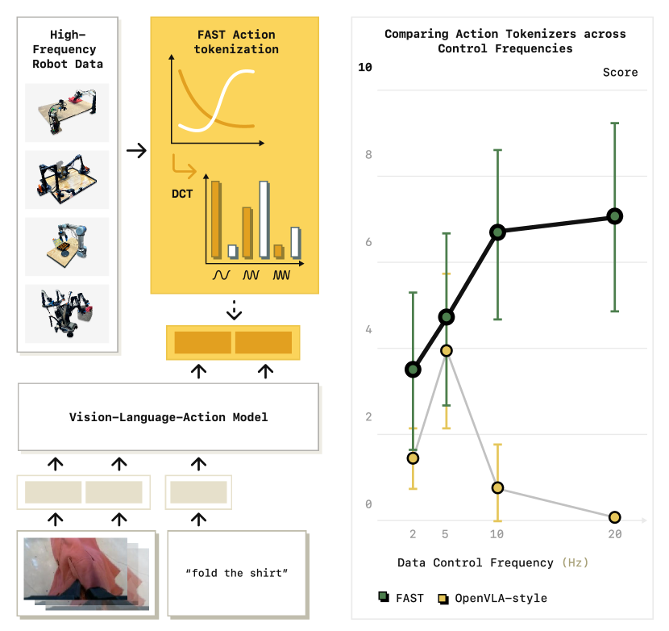
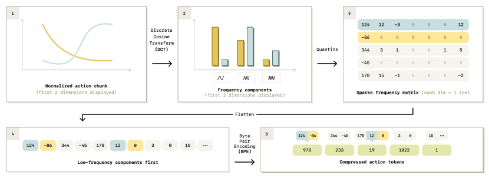
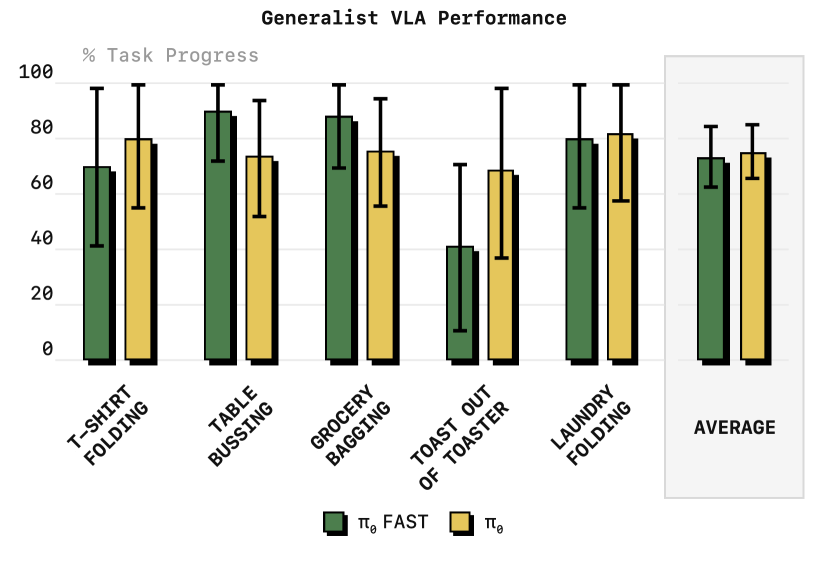

# π₀-FAST 论文导读：用 DCT+BPE 动作分词器，让 VLA 训练快 5 倍

> **论文标题**：FAST: Efficient Robot Action Tokenization
> **发布形式**：Technical Blog + arXiv 论文 + 开源代码，2025 年 1 月 16 日
> **作者**：Physical Intelligence Team
> **机构**：Physical Intelligence（π）
> **arXiv**：https://arxiv.org/abs/2501.09747
> **代码**：https://github.com/Physical-Intelligence/openpi
> **HuggingFace**：https://huggingface.co/physical-intelligence/fast
> **博客**：https://www.pi.website/research/fast

> ⚠️ **说明**：π₀-FAST 以技术博客 + arXiv 论文 + 开源代码三合一形式发布。本文综合三方面信息撰写。

---



*图1（论文 Figure 2）：Left——FAST tokenization 让自回归 Transformer 能通过简单的 next token prediction 训练灵巧机器人控制策略。Right——FAST 通过时序压缩 + BPE 将 action chunk 压缩为少量离散 token。*

## 读之前先搞清楚

### 这篇论文要解决什么问题？

π₀ 用 Flow Matching（连续扩散）生成动作——效果好、精度高，但训练慢。问题是出在**动作的表示方式**上：

- **Flow Matching（π₀）**：50 步 action chunk × 32 维 = 1600 个连续值，模型在连续空间中做 5 步迭代去噪。精度高，但每次前向要跑完整的去噪循环，训练开销大。
- **简单离散化（RT-2 / OpenVLA）**：每个动作维度切成 256 个 bin，一个 50 步 chunk 变成 50×32 = 1600 个离散 token。可以像语言模型一样做自回归 next-token prediction——训练快。但精度太低，**完全无法处理灵巧任务**（叠衣、装袋等需要高频精确控制的任务）。

**π₀-FAST 的核心洞察**：问题不是"离散 vs 连续"——是**怎么离散化**。简单 binning 太粗暴，但如果在离散化**之前**先对动作序列做压缩（像 JPEG 压缩图片一样），去掉冗余、保留关键信息，离散 token 也能达到连续方法的精度。

> **小白理解**：Flow Matching 像一个画家用连续笔触画一幅画——每一笔的位置、力度都是连续值，画得精细但费时。简单 binning 像用马赛克拼图——把画面切成 256 种颜色的方块，快是快，但精度一塌糊涂。FAST 像 JPEG 压缩——先把画面转换成频率信息，丢掉人眼看不出的高频细节，再编码——既压缩了体积，又保留了肉眼可见的质量。

### π₀ vs π₀-FAST：一张表看懂核心区别

| 维度 | π₀ | π₀-FAST |
|:---|:---|:---|
| **动作表示** | 连续值（Flow Matching 去噪） | 离散 token（DCT+BPE 压缩后） |
| **训练方法** | Flow Matching loss（MSE） | 标准 next-token prediction（cross-entropy） |
| **推理方法** | 5 步去噪，一次出 50 步 | 自回归解码，逐 token 生成 |
| **训练速度** | 基准 | **5× faster** |
| **推理速度** | 快（5 步并行） | 慢（逐 token 串行） |
| **灵巧任务** | ✅ 叠衣、装袋等 | ✅ 同样能解决 |
| **模型 Backbone** | PaliGemma 2B + Action Expert | PaliGemma 2B（无 Action Expert） |
| **开源** | 部分 | ✅ 完全开源（OpenPI） |

### 读懂这篇论文需要的前置知识

| 概念 | 简单解释 |
|:---|:---|
| **Flow Matching** | 一种生成模型——不预测噪声（DDPM），而是预测从噪声到目标的速度方向，走直线，步数少 |
| **DCT（离散余弦变换）** | JPEG 图片压缩的核心算法——把空间信号变成频率信号，低频信息（大概形状）在前，高频信息（细节纹理）在后 |
| **BPE（字节对编码）** | LLM 常用的分词算法——把常见字符组合合并成一个 token，减少序列长度 |
| **自回归（Autoregressive）** | 像 GPT 写文章——一个 token 一个 token 地预测，每个 token 依赖前面已生成的 token |
| **PaliGemma** | Google 的轻量 VLM（~2B），能同时理解图像和文本 |
| **SigLIP** | Google 的视觉编码器，比 CLIP 更高效 |
| **Embedding（嵌入）** | 把离散 token ID 变成连续向量的翻译层——详见 [Embedding 详解](../../../transformer学习资料/embedding_guide.md) |
| **Positional Encoding（位置编码）** | 让 Transformer 知道 token 顺序的机制——详见 [位置编码详解](../../../transformer学习资料/positional_encoding_guide.md) |

### 前置补充：DCT（离散余弦变换）——理解 FAST 的前提

FAST 的核心是把动作从"时间域"变到"频率域"。如果你没学过信号处理，这里花 3 分钟看懂 DCT——后面整个 Tokenizer 管道都是建立在它之上的。

**DCT 在做什么**：回答一个问题——**"这段信号由哪些频率的余弦波叠加而成？"**

想象你在听一段音乐。这段音乐可以分解为：低沉的 bass（低频） + 人声（中频） + 镲片的高音（高频）。DCT 就是自动算出每种频率的"音量"有多大。

对一个 10 步的动作序列，DCT 问：这 10 个点可以用哪 10 个"基础余弦波"的加权和来表示？

```
基础余弦波（N=10 的 DCT 基）:

  基 0 (频率=0, 直流):  [ 1,  1,  1,  1,  1,  1,  1,  1,  1,  1]  ← 恒定的"平均值"
  基 1 (最低频):        [cos波形，从+缓慢变到-，半个周期]          ← "趋势"
  基 2 (稍高频):        [cos波形，一个完整周期]                     ← "加速/减速"
  基 3 (更高频):        [cos波形，1.5 个周期]                       ← "小波动"
  ...
  基 9 (最高频):        [cos波形，快速振荡]                         ← "纯噪声"
```

DCT 系数 $X_k$ 就是告诉你在**基 k 上用多大音量**——系数大 = 这个频率成分重要，系数小 = 这个频率成分可有可无。

**为什么这对压缩有用**：自然信号（包括机器人关节运动）的能量集中在低频——"从 0° 匀速转到 1°"的简单运动，前 2-3 个频率就够描述了。高频系数几乎为零，量化后直接归零——这就是 FAST 压缩的核心原理。

> **小白理解**：DCT 像给一段动作做"X 光透视"——表面上看是 50 个不同角度值，但透视后发现在骨骼层面只是"一条直线 + 一点波动"两个成分。**你不需要记住 50 个点，记住两个成分的参数就够了。** JPEG 对 8×8 像素块做 2D DCT，FAST 对 50 步时序做 1D DCT——同一个原理，只是 JPEG 压缩空间冗余，FAST 压缩时间冗余。

> 📖 如果需要更深入理解 DCT（数学推导、和 FFT/PCA 的对比、在 JPEG/MP3 中的应用），请阅读配套文档 [DCT 详解](./dct_guide.md)。如果你不熟悉 LLM 的"词表/分词/token"等概念，建议先阅读 [词表与分词详解](./vocab_guide.md)——它从零解释了 LLM 的词典机制，再讲到 FAST 的三层词表设计。

---

## 一、FAST 的解决思路

核心 idea 一句话：**不要把 raw action 直接离散化——先压缩再离散化。**

raw action chunk 有大量冗余：相邻时间步的运动很相似（机器人不会突然跳变），很多维度之间高度相关（6 个关节不是独立运动的）。直接 binning 浪费了大多数 token 容量在这种冗余上。

FAST 走三步压缩管道：**DCT 去相关 → 量化丢掉精细细节 → BPE 合并常见模式**。最终一个 50 步的 action chunk 被压缩到约 30-60 个离散 token——比简单 binning 的 1600 个压缩了 **10 倍以上**。

> **小白理解**：raw action 像一段未压缩的 WAV 音频——数据量大但大部分是冗余。简单 binning 像把 WAV 转成 8-bit PCM——每个采样点独立量化，体积还是很大。FAST 像 MP3 编码——先 DCT 变换到频域，再丢掉人耳听不到的高频，最后压缩打包——体积骤减，音质几乎不变。

---

## 二、FAST 核心设计

FAST tokenizer 的核心思想一句话：**不要直接离散化 raw action——先压缩到频域，再离散化。** 三步管道：DCT 去相关 → 量化丢细节 → Flatten+BPE 合并模式。

#### 总览：一条 action chunk 的 FAST 之旅

```
输入: action chunk (H=50 步, D=32 维), 共 1600 个连续浮点数
         │
         ▼
  ┌──────────────────────────────────────────────────────────────┐
  │  ① DCT 变换（每维独立）                                       │
  │    每维 50 步 → 50 个频率系数                                │
  │    低频(前几个系数) = 运动的大致趋势                          │
  │    高频(后几个系数) = 精细抖动和噪声                         │
  │    输出: (50, 32) 频率矩阵                                   │
  └──────────────────────────┬───────────────────────────────────┘
                             │
                             ▼
  ┌──────────────────────────────────────────────────────────────┐
  │  ② 量化                                                    │
  │    每个频率值 → 最近的离散档位                               │
  │    高频分量的值本来就小 → 量化后直接归零                     │
  │    输出: 稀疏频率矩阵（前 ~10 行非零，后面全 0）              │
  └──────────────────────────┬───────────────────────────────────┘
                             │
                             ▼
  ┌──────────────────────────────────────────────────────────────┐
  │  ③ Flatten + BPE                                            │
  │    稀疏矩阵按"低频优先"展平为一维序列                        │
  │    BPE 合并序列中频繁出现的模式 → 30-60 个 token             │
  │    输出: 离散 token 序列                                     │
  └──────────────────────────┬───────────────────────────────────┘
                             │
                             ▼
输出: 30-60 个离散 token（简单 binning 需要 1600 个 → 约 30× 压缩）
```

---

### 第 1 步：DCT 变换——把"时间+空间"变成"频率"



*图2（论文 Figure 4）：FAST action tokenization 管道——Normalized action chunk → DCT（每维转频率分量）→ Quantize（量化，高频归零）→ Flatten（低频优先展平）→ BPE（合并常见模式）。*

**先说普通情况**：一个 50 步 × 32 维（action_dim）的 action chunk，每一步的每个关节角度都是独立数值。相邻两步的关节角度通常几乎一样——这就是时间冗余。如果直接逐步 binning 离散化，1600 个值变成 1600 个 token，大部分 token 携带冗余信息。

**再说当前情况**：FAST 对每个 action 维度独立做一维 DCT——把"每步的角度值"变成"频率分量"：

- **输入**：每个 action 维度的 50 步时序信号（50 个连续值）
- **操作**：一维 DCT → 50 个频率系数（从低到高排列）。第一个系数 = 直流分量（均值），前几个系数 = 运动趋势，后面系数 ≈ 0
- **输出**：`(50, 32)` 的频率矩阵

**最后说为什么**：信息在 DCT 后高度集中——90% 的能量在前 20% 的系数里。高频系数小到可以量化归零，这不丢任务精度——高频对应的是人标注不出的微观抖动。**JPEG 对 8×8 像素块做 DCT，FAST 对 50 步时序做 DCT——原理完全相同。**

> **小白理解**：想象你要描述一条曲线的形状——50 个采样点。如果它是简单的正弦波，只需要三个数（振幅、频率、相位）就能精确重建。DCT 就是自动发现动作轨迹由哪些基本波形组成——复杂动作 = 多个波的叠加，高频波 = 小抖动，丢掉也不影响叠衣。

#### ❓ 深入理解：为什么是 DCT 而不是 FFT 或 PCA？

1. **DCT 是实数变换**——FFT 产生复数，机器学习 pipeline 里处理复数很麻烦。DCT 只有实数系数
2. **能量集中效率最优**——在 Markov-1 信号模型下（机器人运动近似满足），DCT 接近理论最优的 KL 变换
3. **固定基 = 零学习成本**——PCA 需要从数据学基向量，跨数据集泛化差。DCT 基是固定的余弦函数，天然泛化

---

### 第 2 步：量化——丢掉不重要的细节

**先说普通情况**：DCT 后的频率系数是连续值——2.93、-1.81、0.03……Transformer 处理不了连续值（它只能处理离散 token ID）。如果直接给每个系数分配 256 个 bin，50×32=1600 个系数还是 1600 个离散值——没省任何东西。而且大部分高频系数的值不到 0.01，用 256 档去量化它们纯属浪费。

**再说当前情况**：FAST 的量化策略一句话——**越重要的频率分量给越精细的量化，越不重要的给越粗糙的量化，最不重要的直接归零。**

- **输入**：`(50, 32)` 的频率矩阵——50 个频率系数 × 32 个维度
- **操作**：每个频率索引 k 有自己独立的量化档位数 $B_k$：

```
频率索引 k:    k=0      k=1     k=2     k=3     k=4~9    k=10+
档位数 B_k:    256      128      64      32      1        1
档位间隔:      ~0.023   ~0.04   ~0.08   ~0.16   —        —
效果:          精细     较细     中等     粗      直接丢   直接丢
原因:        "平均值"  "趋势"  "加速度" "小波动"  "噪声"   "纯噪声"
```

具体到我们的一维例子：

```
DCT 系数:       [2.93,  -1.81,  -0.12,  0.03,  -0.01,  0.001,  ≈0, ≈0, ≈0, ≈0]
档位间隔:        0.023   0.04    0.08    0.16    1       1       —   —   —   —
量化后:          29     -18      -1       0       0       0       0   0   0   0
(离散整数)                                                                 ↑ 全部归零
```

- **输出**：稀疏的离散整数矩阵——前 ~3 行有非零整数值，后面全是 0

**最后说为什么**：这个设计利用了 DCT 已经排好的"重要性顺序"——k=0 是直流分量（影响整个动作的 baseline），必须高精度；k=1 是主趋势（影响动作方向），需要较细精度；k≥4 已经是噪声级，直接归零没有任何可感知的损失。**量化表是人工设计的（不是学习的），基于一个简单的物理直觉：DCT 系数号越大 = 越不重要 = 需要的档位越少。**

#### ❓ 深入理解：量化表是怎么设计的？

论文没有详细说明量化表的设计过程，但原理可以从 DCT 系数的统计分布推断。对 1M 条 action chunk 的 DCT 系数做统计：

```
每个频率索引 k 的系数分布:

  k=0: 均值≈0, 标准差≈2.5, 范围 [-8, 8]    → 256 档 (每档 ~0.06)
  k=1: 均值≈0, 标准差≈1.5, 范围 [-5, 5]    → 128 档 (每档 ~0.08)
  k=2: 均值≈0, 标准差≈0.8, 范围 [-3, 3]    → 64 档  (每档 ~0.09)
  k=3: 均值≈0, 标准差≈0.3, 范围 [-1, 1]    → 32 档  (每档 ~0.06)
  k=4: 均值≈0, 标准差≈0.1, 范围 [-0.3, 0.3] → 1 档  (全归零，范围太小)
  k≥5: 几乎全是 0
```

**设计原则**：档位数正比于该频率系数的动态范围。动态范围大的（k=0）给多档，动态范围小的（k≥4）给少档或直接归零。这样保证每个档位携带的有效信息量大致相等。

**为什么用均匀量化而不是非均匀量化（如对数量化）**：DCT 系数近似服从正态分布——大部分值集中在均值附近。匀均量化在 ±3σ 范围内提供等精度，对正态分布来说是最优的（在最小均方误差意义下）。更复杂的非均匀量化（如 μ-law）带来的收益很小，但实现复杂度高得多。

#### 🔢 具体数字例子：量化前后对比

```
一个 10 步一维动作的 DCT 系数和量化结果:

  原始 DCT:  [2.93, -1.81, -0.12, 0.03, -0.01, 0.001, 0.000, 0.000, 0.000, 0.000]
  量化后:    [29,   -18,   -1,    0,    0,     0,     0,     0,     0,     0]
  
  逆量化:    [2.90, -1.80, -0.10, 0,    0,     0,     0,     0,     0,     0]
  量化误差:  [0.03, 0.01,  0.02,  0.03, 0.01,  0.001, 0,     0,     0,     0]
  
  保留 3 个系数（前 3 个）的信息量: > 99.9%  ← 后面全是 0 或接近 0
  保留 10 个系数的 token 数:     ~10 个整数
  实际 token 数（BPE 后）:       ~2-3 个 token
```

> **小白理解**：量化像一个"四舍五入"的加强版——重要的数保留多位小数，不重要的数直接抹零。月底报账时，大额支出精确到分（256 档），小额零钱精确到元（64 档），几分钱的误差直接忽略（归零）。**老板看报表看不出区别，账本却薄了一大半。**

---

### 第 3 步：Flatten + BPE——把稀疏矩阵压成 token

这是 FAST tokenizer 的**最后一步压缩**——也是最能体现"把 LLM 分词思想迁移到动作"的一步。

**先说普通情况**：量化后的矩阵是稀疏的——前几行有非零整数，后面全是 0。但"稀疏"本身不能直接减少 token 数——如果简单地逐行逐列扫描，1600 个位置（50 频率 × 32 维度）一个都少不了。而且不同 chunk 之间没有共享任何信息——每个 chunk 独立编码，浪费了大量的跨样本统计规律。

**再说当前情况**：两步联合——先智能 Flatten（保留信息结构），再 BPE（发现跨样本模式）。

**操作① Flatten —— 按频率号交叉展平，不是逐行扫描**：

- **输入**：量化后的稀疏矩阵 `(50, 32)`——50 个频率索引 × 32 个维度，每个位置是一个离散整数或 0
- **关键决策**：按频率号（k）交叉排列，**不是**按维度分块

```
Flatten 的两种方式:

  方式 A（FAST 用的）: 按频率号交叉
    [dim1_k0, dim2_k0, ..., dim32_k0,   ← 所有维度的"平均值"聚在一起
     dim1_k1, dim2_k1, ..., dim32_k1,   ← 所有维度的"趋势"聚在一起
     dim1_k2, dim2_k2, ..., dim32_k2]   ← "加速度"聚在一起
    （后面的 k 全是 0，展平时直接跳过）

  方式 B（不用的）: 按维度分块
    [dim1_k0, dim1_k1, ..., dim1_k49,   ← 关节1 的 50 个频率
     dim2_k0, dim2_k1, ..., dim2_k49,   ← 关节2 的 50 个频率
     ...]

为什么选 A 不选 B:
  A 把同一"重要性级别"的频率值聚在一起 → BPE 可以跨维度发现模式
  例: 所有关节的 k0 都很大 → "这个 chunk 整体运动幅度大"
  B 每个关节的 k0 后面紧跟着该关节的 k1,...k49 → BPE 只能看到单个关节的频谱，
    看不到跨关节的协调关系（如"肩关节和腕关节同步减速"）
```

- **输出**：一维整数序列，长度 ≈ 非零频率系数个数（约 100-400 个整数，比原始的 1600 个少，但还不够精简）

**操作② BPE —— 把"常见频率模式"合并为 token**：

- **输入**：一维整数序列（如上）
- **操作**：用训练好的 BPE 词表编码——把频繁出现的连续子序列替换为单个 token ID
- **输出**：30-60 个 BPE token ID

Flatten 和 BPE 的分工：

| | Flatten | BPE |
|:---|:---|:---|
| **处理什么** | 单个 chunk 内的结构（怎么排列） | 跨 chunk 的统计规律（哪些模式频繁出现） |
| **空间维度** | 一个 chunk 内 | 1M 个 chunk 间 |
| **减少什么** | 跳过已归零的高频分量 | 合并反复出现的频率模式 |

**最后说为什么**：Flatten 和 BPE 的组合巧妙地把"物理世界的规律"变成了"统计规律"。机器人运动受物理定律约束——阻尼、惯性、关节耦合——这些导致特定的频率系数组合反复出现。Flatten 保持了这种组合结构的可发现性（通过频率交叉排列），BPE 则自动发现了它们。**设计者不需要懂力学——只需要把数据排列好，BPE 会自动发现其中的物理规律。**

#### ❓ 深入理解：Flatten 顺序对 BPE 效果的实验影响

如果按维度分块（方式 B），BPE 学到的 token 会是这样的：

```
方式 B 的典型 token:  [dim1_k0=29, dim1_k1=-18, dim1_k2=-1]
                       ↑ 只描述关节1 自己的运动，不知道其他关节在干嘛
```

按频率交叉（方式 A），BPE 学到的 token 是这样的：

```
方式 A 的典型 token:  [dim1_k0=29, dim2_k0=25, dim3_k0=31, ..., dim32_k0=28]
                       ↑ 描述"所有关节的平均位置"——一个全局姿态概念
```

方式 A 的 token 更有"语义"——它描述的是一个完整的全局状态（所有关节的平均水平），而不是单个关节的局部信息。这种 token 对模型的注意力机制更有用——模型看到 token #156 就知道"整个手臂大概在这个位置"，不需要跨多个 token 拼凑。

> **小白理解**：Flatten 像一个图书管理员给书籍分类。方式 B 是按作者分——"把所有鲁迅的书放一起"——想找"关于秋天的描写"得翻遍整个书架。方式 A 是按主题分——"把描写秋天的段落放一起"——BPE 可以直接发现"落叶+凉风+枯黄"这个模式，合并成一个 token。**FAST 选方式 A 就是让 BPE 更容易发现跨关节的运动模式。**

---

### 深入：FAST Tokenizer 完整数学过程——从 action 到 token 再回来

这是全文最重要的部分。我们用一个**极简但真实**的例子手算一遍——一维运动，10 步，看 FAST 如何把它压成 3 个 token，再无损重建。

#### 🔢 Step-by-Step：一维 10 步动作的完整旅程

**条件设定**：单关节机器人，10 步 action chunk，每步一个角度值。

```
原始 action: a = [0.00, 0.16, 0.31, 0.45, 0.59, 0.71, 0.81, 0.89, 0.95, 0.99]
              （关节从 0° 匀速转到 ~1°，接近直线但有微小波动）
```

> 📖 DCT 的基础概念详见上方 [前置补充：DCT](#前置补充dct离散余弦变换理解-fast-的前提)。下面直接进入数学计算。

**Step 1: 一维 DCT**

一维 DCT-II 的公式（N 点信号）：

$$X_k = \sum_{n=0}^{N-1} a_n \cdot \cos\left[\frac{\pi}{N}\left(n+\frac{1}{2}\right)k\right], \quad k=0,1,...,N-1$$

对 10 个值分别计算 DCT 系数：

| k | DCT 系数 X_k | 物理含义 |
|:---:|:---:|:---|
| 0 | **2.93** | 直流分量——动作的平均值 |
| 1 | **-1.81** | 第一频率——"从 0 到 1"的单调趋势 |
| 2 | **-0.12** | 第二频率——轻微的加速/减速 |
| 3 | **0.03** | 微小的波动 |
| 4 | **-0.01** | 几乎为零 |
| 5~9 | **≈ 0** | 全部接近零 |

> **关键观察**：前 2-3 个系数已经捕获了 99% 的信息。后面的系数全是噪声级。

**Step 2: 量化**

不同频率分量分配不同的量化精度。FAST 的量化策略（基于论文 Figure 4 和开源代码）：

| 系数位置 | 档位数 | 量化步长 | 本例结果 |
|:---|:---:|:---:|:---|
| k=0（直流） | 256 | 精细 | 2.93 → `quant(2.93) = 2.9` |
| k=1 | 128 | 中 | -1.81 → `quant(-1.81) = -1.8` |
| k=2 | 64 | 粗 | -0.12 → `quant(-0.12) = -0.1` |
| k=3 | 32 | 很粗 | 0.03 → `quant(0.03) = 0.0`（归零！） |
| k=4~9 | 1（直接归零） | — | 全部 → `0` |

量化后：`[2.9, -1.8, -0.1, 0, 0, 0, 0, 0, 0, 0]`

**Step 3: Flatten（低频优先）**

按 DCT 系数号从小到大展开为 1D 序列：

```
[2.9, -1.8, -0.1, 0, 0, 0, 0, 0, 0, 0]
  ↑     ↑      ↑   ↑── 后面的全 0，跳过
  保留  保留   保留

实际保留: [2.9, -1.8, -0.1] → 3 个有效值
```

**Step 4: BPE 编码**

BPE 在大量 action chunk 上训练过。假设训练好的 BPE 词表中有：
- Token #42: `[2.9]`（对应"均值约 3.0"）
- Token #156: `[-1.8, -0.1]`（对应"单调递减趋势 + 微小反向加速度"）

则 3 个值 → 2 个 BPE token：`[42, 156]`

> **10 步 × 1 维 = 10 个浮点数 → 2 个 token。压缩比 5:1。** 实际 50 步 × 32 维 = 1600 个值 → 30-60 token，压缩比 ~30:1。

**Step 5: 重建（推理时 decode）**

```python
# Token → 数值
tokens = [42, 156]
values = bpe_decode(tokens)  # → [2.9, -1.8, -0.1]

# 补零（高频分量在量化时已归零）
dct_coeffs = [2.9, -1.8, -0.1, 0, 0, 0, 0, 0, 0, 0]

# 逆 DCT（IDCT）
a_reconstructed = IDCT(dct_coeffs)
# → [0.01, 0.17, 0.32, 0.46, 0.58, 0.70, 0.80, 0.88, 0.94, 0.98]
```

**原始 vs 重建对比**：

| 步 | 原始 | 重建 | 偏差 |
|:---:|:---:|:---:|:---:|
| 0 | 0.00 | 0.01 | 0.01 |
| 3 | 0.45 | 0.46 | 0.01 |
| 6 | 0.81 | 0.80 | 0.01 |
| 9 | 0.99 | 0.98 | 0.01 |

**最大偏差 = 0.01 弧度 ≈ 0.6°**——对于关节角度来说完全可以忽略。

#### BPE 是如何在动作数据上训练的？

> 📖 BPE 的完整介绍（算法步骤、训练推理、和其他方法的对比）详见配套文档 [BPE 详解](./bpe_guide.md)。下面聚焦 FAST 特有部分——**用真实频率系数数据手算一遍 BPE 训练。**

**训练数据从哪来**：1M 条真实机器人 action chunk，每条先经 DCT+量化+Flatten，输出一维整数序列。比如三条简化后的训练样本：

```
样本 1: [29, -18, -1, 0, 0, 0, 0]     ← "均值偏高 + 单调递减 + 微反弹，后面全是0"
样本 2: [29, -18, 0, 0, 0, 0, 0]      ← "同上，但反弹更弱（被量化归零了）"
样本 3: [-5, 12, 3, 0, 0, 0, 0]       ← "均值偏低 + 快速上升 + 微超调"
```

注意高频部分（后面几个位置）在量化后**几乎全是 0**——1M 条样本中，`[0, 0, 0, 0, 0]` 这种连续零是出现频率最高的"词"。

**一条序列代表什么**：不是单个关节的运动曲线，也不是单个时刻的所有关节角——是**整个 action chunk（50 步 × 32 维）**的所有信息，按频率重要性重新排列。Flatten 的顺序很关键：

```
原 action chunk: 50 步 × 32 维
    → 每维独立 DCT → (50个频率系数, 32维)
    → 量化 → 稀疏频率矩阵
    → Flatten（按频率号交叉排列，不是按维度分块）:

    [dim1_k0, dim2_k0, dim3_k0, ..., dim32_k0,   ← 所有维度的"平均值"聚在一起
     dim1_k1, dim2_k1, dim3_k1, ..., dim32_k1,   ← 所有维度的"趋势"聚在一起
     dim1_k2, dim2_k2, ...]                       ← 后面几乎全是 0

为什么按频率号交叉: 如果按维度分块（先放完关节1的50个系数，再关节2...），
  BPE 只能发现单个关节内部的模式。按频率号交叉后，同一个频率级别
  的所有关节系数聚在一起——BPE 可以发现"这个 chunk 的整体平均姿态"
  这类跨关节的协调模式。
```

**BPE 怎么"学"——没有真值、没有损失函数**：BPE 不是神经网络，不需要标签。它的"训练"就是**反复数数**——遍历 1M 条序列，统计哪两个相邻符号最常一起出现，合并，重新统计，再合并……纯粹统计，不问为什么。"学得好不好"的标准只有一个：这对出现得够不够多。

**第 0 轮（初始化）**：词表 = 所有出现过的单个整数

```
词表: {29, -18, -1, 0, -5, 12, 3, ...}  ← 大概几十到一百多个唯一值
序列保持"字符级": [29, -18, -1, 0, 0, 0, 0]
```

**第 1 轮**：统计所有相邻 pair

```
频次最高的 pair:
  (0, 0): 出现了上百万次！  ← 每条序列的高频部分都是 0
  (29, -18): 出现了几十万次   ← "均值+递减"是极常见的运动模式
  (-18, -1): ~同次数

合并 (0, 0) → 新 token "00":
  词表: {..., "00"}
  样本 1: [29, -18, -1, 00, 00, 00, 0]
```

**第 2-5 轮**：继续合并零序列

```
(00, 00) → "0000"     ← 4 个零
(0000, 00) → "000000" ← 6 个零
(000000, 0) → "0000000"  ← 7 个零——最常见的尾填充模式
```

经过几轮后，原来需要 7 个 `0` token 表示的尾填充，现在只要 1 个 token。

**第 6+ 轮**：合并有意义的运动模式

```
(29, -18) → token #156    ← "正向均值 + 快速递减"
(156, -1) → token #387    ← "正向均值 + 递减 + 微反弹"
                             ↑ 这就是一个完整的"阻尼运动"片段
```

**训练完成**：词表达到 1000-5000 个 token 后停止。

```python
# 用训练好的 BPE 编码一条新序列
encode([29, -18, -1, 0, 0, 0, 0])
# → [387, 512]        # token #387="阻尼运动", #512="7个零"
# 7 个整数 → 2 个 token，压缩比 3.5:1
```

**学到的典型"动作词汇"**：

| Token ID | 内容 | 物理含义 | 出现频次 |
|:---:|:---|:---|:---:|
| 512 | `[0, 0, 0, 0, 0, 0, 0]` | 7 个零——高频量化归零，几乎所有序列都有 | 极高 |
| 42 | `[29]` | 单一常见均值——动作中心在"中速"位置 | 高 |
| 156 | `[29, -18]` | "均值偏高 + 快速向零递减"——阻尼减速 | 高 |
| 387 | `[29, -18, -1]` | "减速 + 微反弹"——完整的阻尼停止 | 中 |
| 201 | `[-5, 12]` | "负向起始 + 快速上升"——反向加速 | 中 |
| 78 | `[12, 3]` | "快速上升 + 超调"——轻微 overshoot | 低 |

> **关键洞察**：BPE 不是"理解力学"——它只是统计哪种整数序列频繁一起出现。但因为在物理世界中，特定的运动模式（加速、减速、阻尼、超调）确实频繁出现，BPE 自动发现的"高频词"天然对应力学原语。**这是统计规律的涌现——不是设计者懂力学，是数据里藏着力学。**


#### ❓ 深入理解：FAST 为什么比简单 binning 好——信息论视角

简单 binning（RT-2 风格）：每步每维独立量化到 256 bin → 一个 50×32 的 chunk 变成 1600 个 token。

```
信息量对比:
  简单 binning: 1600 tokens × log₂(256) = 1600 × 8 = 12800 bits
  但实际有效信息（运动参数）: 约 200-400 bits
  → 99.7% 的 bits 是冗余!
  
  FAST 压缩: 40 tokens × log₂(1000) ≈ 40 × 10 = 400 bits
  → 和实际信息量匹配
```

**核心洞察**：简单 binning 的 token 是"未压缩的像素"——每个 token 携带独立但高度冗余的信息。FAST token 是"压缩后的语义单元"——每个 token 携带一个完整的运动模式。同样预测 1 个 token，FAST token 的信息量是 binning token 的 **40 倍**。

这也是为什么 FAST token 虽然只有 30-60 个，但模型能学会灵巧任务：**模型每个预测步骤接收的信息密度高得多**。

> **小白理解**：简单 binning 像拼音输入——每个字母是一个 token，"z-h-e-n-d-e-f-u-l-i" 要 11 个 token。FAST 像五笔输入——"振" 一个 token。同样的文字量，五笔输入需要的 key stroke 少得多。**LLM/VLA 面对更少的 token → 需要更少的推理步数 → 训练更快、更容易学到长程依赖。**


---

## 三、训练流程

### 总体流程

π₀-FAST 的训练比 π₀ **简单得多**——不需要 Flow Matching 去噪循环、不需要 Action Expert、不需要 Adaptive RMSNorm 注入时间步。整个训练就是一个标准自回归 Transformer 的 next-token prediction。

#### 总览：一个 mini-batch 的完整训练管线

```
原始 episode 数据集（数十万条 robot demo + 自主执行轨迹）
         │
         ▼
  ┌──────────────────────────────────────────────────────────────┐
  │  ① 数据预处理（离线，训练前完成）                              │
  │                                                              │
  │  每条 episode:                                                │
  │    · 文本: task description → PaliGemma tokenizer → tokens   │
  │    · 图像: 多相机帧 → 存为原始 RGB（训练时在线 resize）       │
  │    · Action: 50步chunk → DCT → 量化 → Flatten → BPE         │
  │      → FAST tokens → 拼接为 "Action: [tokens] |" + EOS      │
  │    · State: 关节角 → discretize → 文本拼入 prefix            │
  │                                                              │
  │  产出: 预处理后的训练样本池（百万级）                         │
  └──────────────────────────┬───────────────────────────────────┘
                             │
                             ▼
  ┌──────────────────────────────────────────────────────────────┐
  │  ② 在线采样（每个 training step）                             │
  │                                                              │
  │  DataLoader 随机抽取 B 个样本 → mini-batch                    │
  │                                                              │
  │  每个样本的内容:                                              │
  │    ├── 图像: (T帧, C相机, 3, H, W) → SigLIP → (N_img, 4096) │
  │    ├── Prefix tokens: "Task: ..., State: ... ;\n"            │
  │    │   → PaliGemma embed → (N_pre, 4096)                     │
  │    └── Postfix tokens: "Action: [tok_1]...[tok_N] |" + EOS  │
  │        → PaliGemma embed → (N_post, 4096)                    │
  │                                                              │
  │  B 个样本各自长度不同 → pad 到 batch 内最大长度               │
  └──────────────────────────┬───────────────────────────────────┘
                             │
                             ▼
  ┌──────────────────────────────────────────────────────────────┐
  │  ③ 模型前向（一次，不做去噪循环）                             │
  │                                                              │
  │  concat = [图像 | prefix | postfix]                          │
  │                                                              │
  │  Attention Mask:                                             │
  │    · 图像+prefix 区域: 双向注意（所有 token 互相看）          │
  │    · postfix 区域: 因果注意（只看自己和前面的 token）          │
  │    · 不同样本之间: 不互相看（padding 隔离）                   │
  │                                                              │
  │  PaliGemma 2B 前向 → logits: (B, L, 257152)                 │
  │                                                              │
  │  L 是 batch 内最大序列长度，257152 是 PaliGemma 词表大小     │
  └──────────────────────────┬───────────────────────────────────┘
                             │
                             ▼
  ┌──────────────────────────────────────────────────────────────┐
  │  ④ Loss 计算（只在 postfix 位置）                             │
  │                                                              │
  │  shift logits 和 labels:                                     │
  │    位置 t 的 logits 预测位置 t+1 的 token                    │
  │    → labels = input_tokens[1:]  (shifted)                   │
  │                                                              │
  │  L_CE = -Σ log P(label_t | input_{:t}) / N_postfix_tokens   │
  │        只在 postfix 区域计算，prefix 和 padding 不参与       │
  └──────────────────────────┬───────────────────────────────────┘
                             │
                             ▼
  ┌──────────────────────────────────────────────────────────────┐
  │  ⑤ 反向传播                                                  │
  │  L_CE.backward() → 梯度更新 PaliGemma 2B + SigLIP 参数       │
  │  不需要更新: FAST tokenizer（预先训好，冻结）                 │
  │              PaliGemma tokenizer（预训练，冻结）              │
  └──────────────────────────────────────────────────────────────┘
```

**关键设计决策**：

- **图像不预处理为 tokens**：图像存为原始 RGB，训练时在线过 SigLIP。这样可以用随机数据增广（随机裁剪、颜色抖动等），提高泛化性
- **Action tokens 离线生成**：DCT+BPE 的 tokenization 不需要梯度，预先处理好避免训练时重复计算
- **prefix 和 postfix 的物理分隔**：模型不需要额外的"分隔 token"——`\n` 和 `Action:` 本身就是自然的分隔符，这是 PaliGemma 预训练时就学会的模式

### 和 π₀ 训练的关键区别

| | π₀（Flow Matching） | π₀-FAST（自回归） |
|:---|:---|:---|
| **模型结构** | PaliGemma + 单独 Action Expert (860M) | PaliGemma only（无 Action Expert） |
| **输入** | 图像 + prompt + **带噪 action** + **时间步 τ** | 图像 + prompt + **FAST action tokens** |
| **训练目标** | L_CFM = ‖v_pred - (a* - ε)‖² | L_CE = -log P(next_token丨前文) |
| **每步计算** | 需要构造噪声 → 预测速度向量 → 计算 MSE | 一次前向，直接预测所有 token 的 logits |
| **梯度更新** | PaliGemma + Action Expert + MEM Encoder | PaliGemma + SigLIP（无 Action Expert） |
| **训练速度** | 基准 | **~5× faster** |

> **为什么自回归更快**：Flow Matching 每次训练需要采样噪声、构造带噪 action、经过 Action Expert 做一次完整去噪前向。自回归只需要把 token 序列塞进 PaliGemma，一次前向拿到所有位置的 logits，cross-entropy 直接算。**计算图简单得多，GPU 利用率更高。**

### 具体数字例子：一条 action chunk 的 FAST 编码旅程

**条件设定**：50 步，32 维 action chunk（双臂，每臂 7 DoF 末端 + 1 夹爪 + 8 关节 ≈ 32 维）。

| 步骤 | 操作 | 形状变化 |
|:---|:---|:---|
| 原始 action | 50 步 × 32 维连续值 | `(50, 32)` → 1600 个浮点数 |
| DCT 变换 | 每维 1D DCT | `(50, 32)` 频率矩阵 |
| 量化 | 频率值归到离散档位，高频归零 | 稀疏矩阵（前 ~10 行非零） |
| Flatten | 低频优先展开 | ~320 个非零值的一维序列 |
| BPE 编码 | 常见模式合并为 token | **~40-60 个离散 token** |
| 对比 binning | 32 维 × 256 bins = | **1600 个离散 token** |

**压缩比**：1600 → 40-60，约 **30× 压缩**。

#### 🔢 一次训练迭代的具体跟踪——从观测到 loss

以一条叠衣 segment 为例，跟踪一个 training step 中数据如何流动：

```
第 1 步：准备训练样本
  原始数据: episode segment "折左袖"，3 秒，150 帧观测

  图像: 取最近的 6 帧（stride=1s） × 3 相机 × 224×224 RGB
        → SigLIP → 视觉 tokens: (256, 4096)

  文本: "Task: fold the left sleeve, State: 12 45 3 78 ... ;\n"
        → PaliGemma tokenizer → text tokens: (45, 4096)

  Action: ground-truth 50 步 action chunk, (50, 32)
        → DCT+量化+Flatten → [29, -18, -1, 0, 0, ...]
        → BPE → [387, 512]  (2 个 FAST token!)
        → "Action: " + [387, 512] + "|" + EOS
        → action tokens: (5, 4096)

第 2 步：拼接
  total = concat([视觉(256) | 文本(45) | action(5)]) = (306, 4096)
  attention mask: prefix(256+45=301) 双向 | postfix(5) 因果

第 3 步：前向
  PaliGemma 2B 一次前向 → logits: (306, 257152)
  每个位置输出 257152 维的 logits（PaliGemma 词表大小）

第 4 步：计算 loss
  只在 postfix 的 5 个位置计算 loss:

  位置 302 (action token 1): 模型预测下一个 token → 应该 = 387 (FAST token)
  位置 303 (action token 2): 模型预测下一个 token → 应该 = 512
  位置 304 (action token 3): 模型预测下一个 token → 应该 = "|"
  位置 305 (action token 4): 模型预测下一个 token → 应该 = EOS
  位置 306: 不需要预测（到 EOS 了）

  实际上 location 304 和 305 共享 loss:
    L = -(log P(387|prefix) + log P(512|prefix,387) + log P("||"|prefix,387,512) + log P(EOS|...)) / 4

第 5 步：反向传播
  L.backward() → 梯度更新 PaliGemma 2B + SigLIP 参数
```

**为什么一次前向就够了**：注意第 4 步——模型不是逐个预测 action token。一次前向把 306 个位置的 logits 全算出来了。然后取位置 302~305 的 logits 和对应的 ground-truth token ID 算 cross-entropy。这和 GPT 训练完全一样——**teacher forcing**：用 ground-truth 作为前文，一次算完所有位置的 loss。

#### 🔢 深入图解：真值 action 如何喂入、loss 如何计算

这是最容易困惑的地方——**为什么真值 action 在输入里，模型还能"学"？** 用一张表说清楚：

```
输入序列（模型看到的）:         每个位置的预测任务:
────────────────────────────────────────────────────────────────────
位置    token       token 文字                     模型在这个位置要预测
                                                      的下一个 token
────────────────────────────────────────────────────────────────────
0      <img_0>     图像 patch 0                       → <img_1>（图像 token）
1      <img_1>     图像 patch 1                       → <img_2>
...                 图像区域：双向注意，互相看
255    <img_255>   图像 patch 255                     → Task
256    Task        文本 "Task"                        → :
257    :           冒号                               → fold
258    fold        文本 "fold"                        → ▁the
259    ▁the        文本 " the"                        → left
...                 文本区域：双向注意，互相看
299    ;           分号                               → \n
300    \n          换行                               → Action
301    Action      文本 "Action"                      → :
302    :           冒号                               → 387 ★
303    387 ❮真值    FAST token（DCT系数模式 #12）      → 512 ★
304    512 ❮真值    FAST token（DCT系数模式 #94）      → | ★
305    |  ❮真值    竖线分隔符（标注时就有）            → EOS ★
306    EOS ❮真值   结束符（标注时就有）                → 不计算（没下一个了）
────────────────────────────────────────────────────────────────────

★ = 计入 loss 的位置（只有 postfix 区域）
❮真值 = 来自 ground-truth 标注，不是模型生成的
```

**关键洞察**——看位置 303 和 304：

```
位置 303 的输入是 token 387（真值 FAST token）
  → 模型不能"看到"位置 304 是什么（因果 mask！）
  → 模型必须根据 [图像 | 文本 | Action : 387] 来猜下一个 token
  → ground-truth 是 512 → 模型如果猜错了就被惩罚

位置 304 的输入是 token 512（真值 FAST token）  
  → 模型不能看到位置 305 是什么
  → 模型必须根据 [图像 | 文本 | Action : 387 512] 来猜下一个
  → ground-truth 是 "|" → 猜错惩罚
```

**所以模型不是在"抄答案"**——它每步只能看到当前及之前的 token，必须用自己的参数推理出下一个 token 应该是什么。真值 token 只是作为"前文"被看到，不是作为"预测目标"被直接复制。

用伪代码来看更直观：

```python
# 训练时的一次操作

# 1. 构造输入序列（包含真值 action tokens！）
input_ids = [img_tokens..., text_tokens..., 
             tok_Action, tok_colon,  # "Action:"
             387,   # ← 真值 FAST token 1（来自标注数据）
             512,   # ← 真值 FAST token 2（来自标注数据）
             tok_pipe,  # "|"
             tok_EOS]   # EOS

# 2. 模型前向：每个位置输出对"下一个 token"的预测
logits = model.forward(input_ids, causal_mask)  
# logits.shape: (seq_len, vocab_size=257152)
# logits[t, :] 是根据 input_ids[:t+1] 对位置 t+1 的预测

# 3. 构造 labels（shift 一位）
labels = [
    img_1, img_2, ...,  # 图像 token（不计算 loss）
    ..., Task, :, fold, ..., \n,  # 文本 token（不计算 loss）
    Action, :,     # 文本 token（不计算 loss）
    387,     # ★ 这是位置 302 该预测的正确 token
    512,     # ★ 这是位置 303 该预测的正确 token
    tok_pipe,  # ★ 这是位置 304 该预测的正确 token
    tok_EOS,   # ★ 这是位置 305 该预测的正确 token
]

# 4. 只对 postfix 区域计算 loss
loss_mask = [False] * 301 + [True, True, True, True, False]
#            prefix 不算          ★     ★     ★     ★    最后一位没东西预测

loss = cross_entropy(logits[:-1], labels[1:], mask=loss_mask)
#      logits[0]预测labels[1], logits[1]预测labels[2], ...
#      logits[301] 预测 labels[302]=387, logits[302]预测labels[303]=512, ...
```

**三步总结**：

1. **真值 action token 出现在输入里**（位置 303、304）——作为"前文"
2. **因果 mask 阻止模型"偷看"未来**——位置 303 看不到位置 304 的内容
3. **shifted prediction**——位置 t 的 logits 预测位置 t+1 的 token，和输入错位一位，所以模型不是在"复制输入"

> **小白理解**：就像老师教你写作文——老师先写一句"今天天气很好"（prefix），然后让你接着写（postfix）。训练时，老师把标准答案的下一句也放你面前（"我和朋友去了公园"），但**用纸挡住后面的字**——你只能看到老师给的前文，必须自己猜接下来写什么。猜错了，老师纠正你（cross-entropy loss）。训练千百万次后，你学会了"看到前文 → 写出合理的后文"这个能力。推理时没有标准答案了——你凭学到的能力自己往下写。
> 
> **注意**：上面伪代码中的 `causal_mask` 就是那张"挡纸"——输入里有真值，但模型看不到当前位置之后的 token。

> **小白理解**：Flow Matching 训练像"先加噪声再学去噪"——要额外跑噪声采样和去噪循环。FAST 训练像"完形填空"——给上文（图像+指令），填下文（action tokens）。**一次前向，所有的空都填好了，cross-entropy 一把算完。这就是 5× 加速的根源。**

#### ❓ 常见疑问：为什么训练时可以用 ground-truth 做前文，推理时却要自己生成？

这就是 **teacher forcing**——训练和推理的经典差异：

```
训练时（teacher forcing）:
  输入: [prefix, 真_token1, 真_token2, 真_token3]  ← 全用 ground-truth
  输出: 在位置 1 预测 token1，位置 2 预测 token2……
  模型从没错过——因为前文永远是正确答案

推理时（autoregressive）:
  step 1: [prefix, BOS] → 预测 token1_hat                            ← 自己猜
  step 2: [prefix, BOS, token1_hat] → 预测 token2_hat               ← 用自己的猜测做前文
  step 3: [prefix, BOS, token1_hat, token2_hat] → 预测 token3_hat   ← 错误可能累积
```

**为什么不对齐**——如果训练也用自回归（每次只给 prefix+ 已生成的 token），训练效率暴降（不能一次前向算出所有位置的 loss）。teacher forcing 是一种"训练作弊"——用真值做前文，一次算完所有 loss，训练快了但推理时可能遇到训练中没见过的"错误前文"。

FAST 应对这个问题和 GPT 一样：**训练数据量够大，模型见过足够多正确的前文 → 推理时犯错的概率低 → 即使犯错，下一个 token 还有机会纠正**。

#### ❓ 深入理解：为什么 prefix 不计算 loss？

这是一个容易被忽视的设计细节——prefix 包含了图像和文本信息，但 loss 只在 postfix 位置算：

```
训练序列: [img...img][Task: fold...State: 12 45...;][Action:][387][512][|][EOS]
           └────────── prefix（301 tokens）──────────┘└─── postfix（5 tokens）──┘
           loss = False                                 loss = True
```

**为什么 prefix 不算 loss**：prefix 是"已知条件"——图像是传感器拍的、文本指令是人类给的。模型不需要学"给定当前场景 → 预测自己看到了什么"（这是无意义的循环）。模型只需要学"给定当前场景和指令 → 预测接下来的动作"。

这和 GPT 训练一样——prompt 部分不计算 loss，只对 assistant 的回复部分计算 loss。

---

## 四、推理流程

**先说普通情况**：Flow Matching（π₀）推理是 5 步并行去噪——一次性生成 50 步 action，延迟 ~38ms。自回归推理（GPT 风格）是逐 token 生成——每个 token 依赖前一个，串行瓶颈。

**再说当前情况**：π₀-FAST 推理是标准的自回归解码——prefix 编码一次（填充 KV Cache），然后逐 token 生成 action tokens，遇到 EOS 停止：

#### 总览：自回归解码流程

```
┌─ ① Prefix 编码（只做一次）──────────────────────────────┐
│  图像 → SigLIP So400m/14 → 视觉 tokens                   │
│  文本指令 + state → PaliGemma tokenizer → text tokens     │
│  拼接 → prefix_tokens                                    │
│                                                          │
│  PaliGemma 前向 → KV Cache 存入 GPU 显存                 │
│  这一步耗时固定，与生成 token 数无关                      │
└──────────────────────────┬───────────────────────────────┘
                           │
                           ▼
┌─ ② 自回归解码循环 ──────────────────────────────────────┐
│                                                          │
│  step 1: KV Cache + [BOS] → 预测 token_1                │
│  step 2: KV Cache + [BOS, token_1] → 预测 token_2       │
│  ...                                                     │
│  step N: 预测到 EOS token → 停止                         │
│     or   达到 max_decoding_steps=256 → 停止               │
│                                                          │
│  温度=0.0 → 贪心（确定性），温度>0 → 随机采样             │
│  每步延迟 ~几 ms（取决于 GPU 和 token 数）                │
└──────────────────────────┬───────────────────────────────┘
                           │
                           ▼
┌─ ③ Action 恢复 ────────────────────────────────────────┐
│  生成的 token 序列 → PaliGemma tokenizer decode          │
│  → 提取 "/Action: ... |" 之间的 token                   │
│  → FAST tokenizer decode → 恢复 action chunk             │
│  → (action_horizon=32, action_dim=32)                   │
└──────────────────────────────────────────────────────────┘
```

**最后说为什么**：自回归推理慢是事实——但训练 5× faster 的收益远超推理延迟的代价。对于快速实验迭代场景，训练时间从 5 天变 1 天，比推理多几 ms 重要得多。而且 LLM 领域有大量推理加速技术（speculative decoding、KV cache 量化、FlashAttention 等）可以直接复用到 VLA 上。

#### ❓ 深入理解：KV Cache 如何让 Prefix 只算一次

自回归解码的核心优化——Prefix（图像+文本）在 decode 阶段不变，可以**缓存**它的 Key 和 Value：

```
第 1 步（编码 prefix）:
  [img ... img][Task: ...][State: ...] → 完整前向
  → 保存所有 prefix token 的 K, V 到 GPU 显存

第 2+ 步（逐 token 解码）:
  每个新生成的 action token 只做:
    Q ← 新 token 的 query
    K, V ← 从 KV Cache 读取 prefix 的 + 之前生成的 action tokens 的
    → 只算当前 token 的 attention + FFN（不需要重新算 prefix）
```

**但注意**——尽管 KV Cache 省了 prefix 的重复计算，自回归仍然需要 30-60 步串行 forward。每步只处理一个 token——GPU 的并行能力大部分闲置。这是自回归推理慢的根本原因。

> **小白理解**：Flow Matching 像一个画家同时画 50 帧——5 笔下去就全画好了。自回归像打字——一个一个字母敲，敲完 60 个字母才能拼出一个 action chunk。**KV Cache 相当于"先把字典放在手边"——不用每次查字典，但还是得一个字母一个字母敲。**

#### 🔢 具体数字例子：一次完整的推理解码过程

以叠衣任务为例，跟踪推理时从观测到最终关节角的完整链路：

```
┌─ ① Prefix 编码（只做一次，~20ms）─────────────────────────┐
│                                                            │
│  图像: 当前 3 相机 × 6 帧历史 × 224×224                     │
│        → SigLIP → (256, 4096) 视觉 tokens                   │
│                                                            │
│  文本: "Task: fold laundry, State: 12 45 3 78 ... ;\n"      │
│        → PaliGemma tokenizer → (45, 4096) text tokens       │
│                                                            │
│  拼接: (301, 4096) prefix tokens                            │
│        → PaliGemma 前向 → KV Cache 存入 GPU                 │
│        耗时 ~20ms，和生成多少 action token 无关              │
└──────────────────────────┬──────────────────────────────────┘
                           │
                           ▼
┌─ ② 自回归解码（逐 token，~几 ms/token）────────────────────┐
│                                                            │
│  输入: KV Cache（prefix 已编码）+ [BOS] token               │
│                                                            │
│  step 1: [BOS] → logits (257152,)                          │
│          argmax → token #257023 (FAST token #0)             │
│  step 2: [BOS, #257023] → logits                           │
│          argmax → token #256867 (FAST token #156)           │
│  step 3: [BOS, #257023, #256867] → logits                  │
│          argmax → token #481 (PaliGemma 的 "|" token)       │
│  step 4: [BOS, #257023, #256867, #481] → logits            │
│          argmax → token #1 (PaliGemma 的 EOS token)         │
│  → 检测到 EOS，停止解码                                     │
│                                                            │
│  本次解码: 4 个 token，耗时 ~12ms（4×3ms）                   │
│  生成: FAST token #0 + FAST token #156 + "|" + EOS          │
└──────────────────────────┬──────────────────────────────────┘
                           │
                           ▼
┌─ ③ Action 恢复（纯数学，~1ms）─────────────────────────────┐
│                                                            │
│  提取 FAST tokens: [#0, #156]（去掉 "|" 和 EOS）           │
│    （如果解码没生成 "|"，则提取到 EOS 前的所有 token）      │
│                                                            │
│  FASt token → PaliGemma 逆映射:                             │
│    #257023 → FAST #0, #256867 → FAST #156                  │
│                                                            │
│  BPE decode:                                               │
│    FAST token #0  → [29]                                   │
│    FAST token #156 → [-18, -1]                             │
│    合并: [29, -18, -1]                                     │
│                                                            │
│  Unflatten + 补零 + 逆量化 + IDCT:                         │
│    [29, -18, -1] → [2.9, -1.8, -0.1] + zeros              │
│    → IDCT → 50 步 action chunk (50, 32)                   │
│    → 执行前 32 步（action_horizon=32）                     │
└────────────────────────────────────────────────────────────┘

总耗时: 20ms（prefix）+ 12ms（4 token 解码）+ 1ms（恢复）= ~33ms
对比 π₀ 的 ~38ms（Flow Matching 5 步去噪）——自回归在短序列时不慢！
但长序列（60 tokens）时: 20 + 60×3 + 1 = 201ms ——明显慢于 Flow Matching
```

**解码步数 vs 延迟的关系**：

| FAST token 数 | 解码步数 | 推理延迟 | vs π₀ (38ms) |
|:---:|:---:|:---:|:---:|
| 10 | ~12 步 | ~56ms | 稍慢 |
| 30（典型） | ~32 步 | ~116ms | 3× 慢 |
| 60（复杂动作） | ~62 步 | ~206ms | 5× 慢 |

#### ❓ 深入理解：EOS 和分隔符——模型怎么知道"该停了"

训练时每个 postfix 序列都以 `"Action: " + tokens + "|" + EOS` 结尾，模型见过几百万次。推理时它自然学会了——生成完 action tokens 后预测到 `"|"`，然后预测到 EOS，停止。

```
训练样本中的 postfix 排列（模型反复看到这个模式）:
  /Action: / [FAST tok_1] [FAST tok_2] ... [FAST tok_N] | EOS
   ↑        ↑                                  ↑        ↑  ↑
  起始标记  动作 token 1                        结束分隔  停止

推理时模型自动复现这个模式:
  step 1: 预测 BOS → /Action:
  step 2: 预测 /Action: → FAST tok_1
  ...
  step N: 预测 ... → |
  step N+1: 预测 | → EOS → 停止
```

**如果模型没生成 `"|"` 怎么办**：代码有兜底——如果解码的 token 中没找到 `"|"`，就把 EOS 之前的所有 FAST token 都用于 action 恢复。另外 max_decoding_steps=256 是硬上限——生成 256 个 token 后强制停止。

#### ❓ 常见疑问：温度（temperature）是干什么的？

推理时 temperature=0.0 → 贪心解码（每个 step 选概率最高的 token）；temperature>0 → 随机采样（概率高的更可能被选中）。

```
temperature=0.0（确定性）:
  logits → argmax → 每次推理结果完全一样
  适合部署——行为可预测、可复现

temperature=1.0（随机）:
  logits → softmax(logits / 1.0) → 随机采样
  可能生成不同的动作——增加多样性

  FAST 默认 temperature=0.0（贪心）——灵巧任务不需要随机性
```

> **小白理解**：温度像"听话程度"。温度=0 是"绝对服从"——每次给你同样的指令，你做完全一样的动作。温度=1 是"有点自己的想法"——同样的指令可能做出略有不同的动作。**机器人叠衣服不需要"创意"——temperature=0 是最合理的。**

> **小白理解**：自回归推理像"打字速度"——短单词不慢，长文章就慢了。好消息是大部分日常操作（叠一件 T 恤的一个子步骤）动作不复杂，FAST token 数在 10-30 之间，延迟可以接受。只有极复杂的动作片段才需要 60 个 token。而且 LLM 的 speculative decoding 等技术可以直接给 VLA 用——预计还能提速 2-3×。

#### ❓ 常见疑问：既然推理慢，为什么还要用自回归？

论文坦承的 trade-off——**训练 5× faster >> 推理慢一些**，原因：
1. 研究迭代：跑一次实验从 5 天变 1 天 → 一个月能多试 4-5 个 idea
2. 多任务训练：训练一个 generalist policy 需要处理数万小时的 robot data——训练效率是第一瓶颈
3. LLM 推理加速技术可直接复用：speculative decoding 预计可将自回归推理提速 2-3×
4. 离线场景：很多机器人应用不需要实时推理——batch 处理一批任务时，吞吐量比延迟更重要

---

## 五、核心创新点

| 创新点 | 具体内容 | 为什么重要 |
|:---|:---|:---|
| **DCT 动作压缩** | 首次将 JPEG/DCT 压缩思想用于机器人动作——从时间域转到频率域，丢掉高频噪声 | 解决了"连续方法精度高但慢、离散方法快但不准"的两难——取两者之长 |
| **BPE 用于动作** | 将 LLM 的分词算法用于动作序列——合并常见运动模式 | 进一步压缩，让模型学的是"运动词汇"而非"原始数值" |
| **证明离散也能灵巧** | 首次用纯自回归方法解决叠衣、装袋等高频灵巧任务——此前只有 Flow Matching/扩散能做到 | 颠覆了"灵巧任务必须用连续扩散"的认知 |
| **训练快 5×** | 自回归 next-token prediction 的计算图比 Flow Matching 简单得多 | 实验迭代速度直接提升——跑一次实验从 5 天变 1 天 |
| **完全开源** | 模型权重 + tokenizer + 训练代码全开源（OpenPI + HuggingFace） | 社区可以直接在自己的机器人数据上训练 FAST 模型 |
| **DROID 首次通用策略** | 在 DROID 数据集上训出第一个能零样本泛化的通用策略 | 之前 DROID 只有单任务方法有效——FAST 让通用策略在 DROID 上 work 了 |

---

## 六、实现细节

> 以下配置来自论文、博客和 GitHub 开源代码（openpi）。FAST 有 arXiv 论文 + 完全开源代码，实现细节比 π0.7 披露得更多。

### 模型配置

| 配置项 | 值 | 来源 |
|:---|:---|:---|
| **VLM Backbone** | PaliGemma 2B（Gemma 2B variant） | GitHub: `pi0_fast.py` |
| **视觉编码器** | SigLIP So400m/14 | GitHub: `pi0_fast.py` |
| **输入图像尺寸** | 224×224 | GitHub: `config.py` |
| **Action Expert** | **无**——直接复用 PaliGemma 做 next-token prediction | GitHub |
| **FAST Tokenizer** | DCT + quantization + BPE，在 1M 真实机器人 action 序列上训练 | 博客 + HuggingFace |
| **Token 数量** | 每个 action chunk ~30-60 个 FAST token | 博客 |
| **Action Horizon** | 默认 32 步（可配置） | GitHub: `Pi0FASTConfig` |
| **Action Dim** | 默认 32 维（可配置） | GitHub |
| **最大 Token 长度** | 250（双臂）/ 180（单臂） | GitHub: `config.py` |
| **PaliGemma Vocab 映射** | FAST token 映射到 PaliGemma 词表最后 128 个之前的位置（skip 最后 128 特殊 token） | GitHub: `tokenizer.py` |

### 训练配置

| 配置项 | 值 | 来源 |
|:---|:---|:---|
| **训练范式** | 标准自回归 next-token prediction（cross-entropy loss） | 博客 + GitHub |
| **Attention Pattern** | Prefix（图像+文本）：双向注意；Postfix（action tokens）：因果注意 | GitHub |
| **Loss 位置** | 只在 postfix（action token 部分）计算 loss，prefix 部分不计算 | GitHub |
| **训练数据** | 与 π₀ 相同的大规模多任务机器人数据集 | 博客 |
| **训练速度提升** | ~5× faster than π₀（Flow Matching） | 博客 |
| **FAST Tokenizer 训练数据** | 1M 真实机器人 action 序列 | 博客 + HuggingFace |

### 推理配置

| 配置项 | 值 | 来源 |
|:---|:---|:---|
| **解码方式** | 自回归逐 token 生成，遇到 EOS 或达到 max_decoding_steps 停止 | GitHub: `sample_actions` |
| **最大解码步数** | 256（默认） | GitHub |
| **温度** | 0.0（贪心）/ > 0.0（随机采样） | GitHub |
| **KV Cache** | 支持——prefix 编码后缓存，解码时复用 | GitHub |
| **推理速度** | 显著慢于 Flow Matching（论文坦承的 trade-off） | 博客 |

---

## 七、实验结果

### 7.1 灵巧任务——自回归也能行



*图3（论文 Figure 11）：π₀-FAST 在 DROID 和四个灵巧任务上与 Diffusion π₀ 的性能对比。FAST 训练快 5×，但性能达到同等水平。*

**实验设置**：与 π₀（Flow Matching）在相同的灵巧任务上对比——叠衣、收拾桌子、装食品袋等。

| 方法 | 灵巧任务成功率 | 训练速度 |
|:---|:---|:---|
| **π₀-FAST（自回归+FAST tokenizer）** | ✅ 能解决 | **5× faster** |
| π₀（Flow Matching） | ✅ 能解决 | 基准 |
| 简单 binning 离散化（如 RT-2 风格） | ❌ **完全无法解决** | 快，但没意义 |

> **小白理解**：简单 binning 连一个灵巧任务都做不了——精度太低了。FAST 证明问题不在"离散化"本身，而在"怎么离散化"。**DCT+BPE 压缩后，30-60 个 token 携带的信息量 > 简单 binning 的 1600 个 token。**

### 7.2 DROID 零样本泛化——通用策略首次 work

**实验设置**：在完整 DROID 数据集（多所大学在不同场景收集的多样化操作数据）上训练 π₀-FAST，测试在新环境中的零样本指令遵循。

| 方法 | DROID 零样本泛化 |
|:---|:---|
| **π₀-FAST** | ✅ 首次成功——在 UC Berkeley、Stanford、UW 三个大学的新环境中完成简单操作 |
| 之前所有方法 | ❌ 从未有方法在完整 DROID 上训出能泛化的通用策略 |

即便是失败案例，π₀-FAST 也展现了"直觉性的尝试"——比随机乱动合理得多。

### 7.3 压缩效果

FAST tokenizer 将 action chunk 从 1600 个浮点数（简单 binning 的 token 数）压缩到 ~30-60 个离散 token——**约 30× 压缩比**。且压缩后的重建精度足以支撑灵巧操作。

---

## 八、在 π 系列中的位置

```
能力维度:  灵巧操作  训练效率  开源程度

π₀         ✅        ⚡⚡     部分开源
  ↓        (Flow Matching)  (慢)
π₀-FAST    ✅        ⚡⚡⚡⚡⚡  完全开源
  ↓        (自回归)   (5×快)  (OpenPI)
π₀.₅       ✅✅       ⚡⚡     未开源
  ↓
π0.6→π0.7  ✅✅✅     ⚡⚡     未开源

关键转折: π₀-FAST 证明了离散动作表示在灵巧任务上的可行性，
       后续的 π0.7 虽然回到了连续 Flow Matching，
       但训练效率的提升思路（更好的 tokenization）影响了整个方向。
```

---

## 九、局限性

| 局限性 | 为什么是局限 |
|:---|:---|
| **推理速度慢** | 自回归逐 token 串行解码远慢于 Flow Matching 的 5 步并行去噪——是最大的工程 trade-off |
| **动作精度理论损失** | DCT+量化是有损压缩——虽然论文证明实际影响不大，但在极端精度要求的任务上可能成为瓶颈 |
| **Backbone 较小** | 用 PaliGemma 2B，而非更大的 VLM——限制了模型的上限 |
| **没有 prompt conditioning 能力** | 和 π0.7 不同——π₀-FAST 不支持 quality/speed/mistake metadata 操控 |
| **tokenizer 依赖训练数据分布** | FAST tokenizer 在 1M action 序列上训练——如果下游任务的动作分布差异很大，可能需要重新训练 tokenizer |

---

## 十、一句话总结

> **π₀-FAST 通过 DCT+BPE 动作压缩，首次让自回归离散 token 预测在灵巧机器人操作上达到了 Flow Matching 的效果——训练快 5×、完全开源、且首次在 DROID 上训出能零样本泛化的通用策略。它证明了"离散 vs 连续"不是问题的关键——关键是"怎么离散化"。**

---

## 参考资料

- 博客：https://www.pi.website/research/fast
- arXiv：https://arxiv.org/abs/2501.09747
- GitHub（OpenPI）：https://github.com/Physical-Intelligence/openpi
- HuggingFace Tokenizer：https://huggingface.co/physical-intelligence/fast
- π₀ 论文：https://arxiv.org/abs/2410.24164
