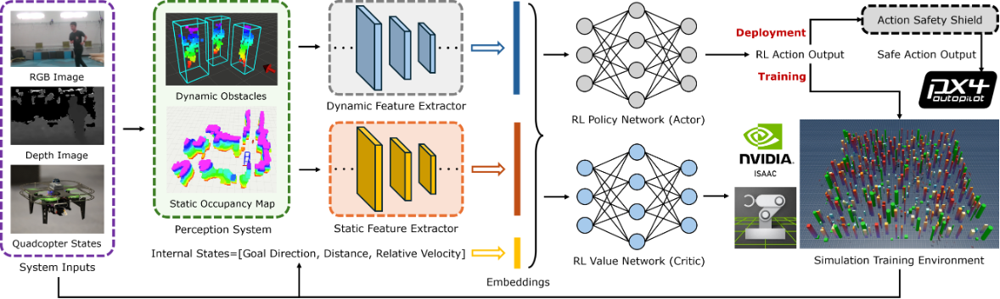
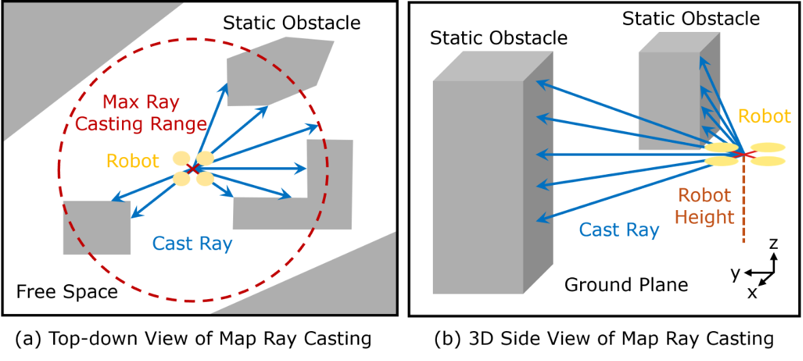
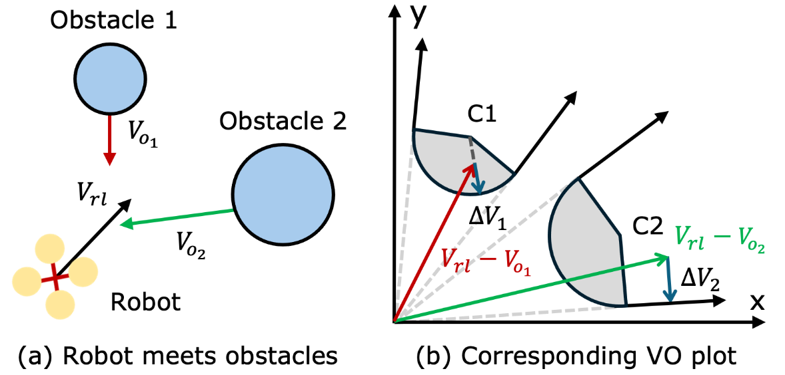
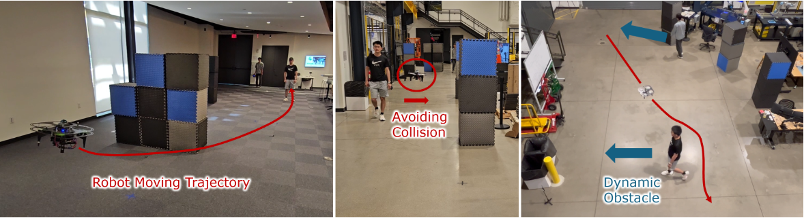

# NavRL 论文导读：用强化学习让无人机在动态环境中安全飞行

> **论文标题**：NavRL: Learning Safe Flight in Dynamic Environments
> **会议/期刊**：IEEE Robotics and Automation Letters (RA-L), 2025（机器人领域顶级期刊）
> **作者**：Zhefan Xu, Xinming Han, Haoyu Shen, Hanyu Jin, Kenji Shimada
> **机构**：Carnegie Mellon University, Department of Mechanical Engineering
> **arXiv**：https://arxiv.org/abs/2409.15634
> **代码**：https://github.com/Zhefan-Xu/NavRL

---

## 读之前先搞清楚

### 这篇论文要解决什么问题？

想象这样一个场景：一架四旋翼无人机在森林中飞行，需要从 A 点飞到 B 点。树林里有静止的树木（静态障碍物），还有飞行的鸟类或走动的行人（动态障碍物）。无人机必须在**不撞到任何东西**的前提下，以尽量快的速度到达目的地。

传统方法把这个问题拆成"预测"和"规划"两个阶段：先预测障碍物未来会怎么动，再规划一条安全路径。但这套系统有两个致命弱点：

1. **参数难调**：环境变了（比如从森林换到城市），之前精心调试的参数就不管用了，需要重新手动调整
2. **模型假设不准**：为了让计算变快，传统方法会用简化的数学模型（比如假设障碍物匀速直线运动），但实际上障碍物的运动往往不按套路出牌

**强化学习（Reinforcement Learning, RL）天然适合解决这类问题**——让无人机在仿真里不断试错（撞了就知道疼），自己学会怎么躲避障碍物。但 RL 用在无人机导航上有三个挑战：

- **Sim-to-Real 迁移难**：在仿真里训练好的策略，放到真实世界中会因为传感器噪声、视觉差异等原因失效
- **安全性难保证**：神经网络是个"黑箱"，你不知道它什么时候会输出一个危险的指令
- **训练慢**：RL 需要海量的试错经验，单台机器人收集数据太慢了

NavRL 正是为了解决这三个挑战而设计的。

> **小白理解**：传统方法相当于给无人机写一本厚厚的"飞行手册"——什么情况下该左转、什么情况下该爬升，全靠工程师手动规定。手册写得好，飞行就安全；环境变了手册没更新，就可能出事。NavRL 则让无人机自己在仿真里"学飞"——就像人类飞行员通过无数次模拟器训练掌握飞行技巧，而不是死记硬背操作手册。**更重要的是，NavRL 还加了一层"安全保镖"，在策略网络可能犯错时及时纠偏**。

### 读懂这篇论文需要的前置知识

| 概念 | 简单解释 |
|:---|:---|
| **强化学习（RL）** | 智能体通过与环境交互获得奖励/惩罚信号，学习最优决策策略 |
| **PPO（近端策略优化）** | 一种稳定高效的 RL 算法，通过限制每次策略更新的幅度来保证训练稳定性 |
| **Actor-Critic** | 一种 RL 架构：Actor（演员）负责做决策，Critic（评论家）负责评价决策好坏 |
| **速度障碍（Velocity Obstacle, VO）** | 一种几何方法：计算会导致碰撞的"危险速度集合"，避开它就安全 |
| **Sim-to-Real 迁移** | 把仿真中训练好的模型部署到真实机器人上，由于仿真和真实世界有差距，这是一大难点 |
| **占用体素地图（Occupancy Voxel Map）** | 把空间切成小方块，记录每个方块是否被障碍物占据，类似 3D 版的"我的世界" |
| **Beta 分布** | 一种在 [0,1] 区间内的概率分布，用于从策略网络输出有界的连续动作 |

---

## 一、NavRL 的解决思路

NavRL 的核心思路可以用一句话概括：**把感知、决策和安全三层解耦但协同工作，让 RL 只负责"怎么飞"，而"看到了什么"和"会不会撞"分别由专门的模块来保证。**

具体来说，NavRL 做了三件关键的事情：

1. **聪明的状态设计（解决 Sim-to-Real）**：不把原始摄像头图像直接喂给神经网络（仿真图像和真实图像差距太大），而是先把图像处理成结构化的信息——静态障碍物用"射线距离"表示（从无人机向四周发射射线，记录每条射线撞到障碍物的距离），动态障碍物用位置+速度+尺寸表示。这种结构化表示在仿真和真实世界中几乎一样，大大缩小了 Sim-to-Real 的差距。

2. **安全盾机制（解决安全性）**：在策略网络（神经网络）输出的速度指令后面，加一个基于速度障碍（VO）的"安全盾"。如果神经网络输出的速度会导致碰撞，安全盾会把它"投影"到安全区域内，相当于给神经网络配了一个保守但靠谱的副驾驶。

3. **大规模并行训练（解决训练慢）**：用 NVIDIA Isaac Sim 同时模拟 1024 架无人机一起训练，数据收集速度提升了上千倍；再加上课程学习（从简单环境逐步过渡到复杂环境），训练又快又稳。

> **小白理解**：NavRL 的设计哲学很像现代汽车的安全系统。RL 策略网络相当于"自动驾驶"，负责灵活地规划路线；安全盾相当于"AEB 自动紧急刹车"，只在即将碰撞时介入，平时不打扰正常驾驶；感知模块相当于"车载传感器"，负责看清周围有什么。**三个模块各司其职，既保证了灵活性，又守住了安全底线**。

---

## 二、NavRL 整体流程：4 步完成安全导航



*图：NavRL 整体框架。感知系统处理 RGB-D 图像和机器人内部状态，生成静态和动态障碍物的表示；这些表示通过特征提取器转换为状态嵌入；训练阶段采用 Actor-Critic 结构在 Isaac Sim 中并行训练；部署阶段策略网络输出经安全盾修正后执行。*

NavRL 的整个流程可以分为 4 个步骤：感知障碍物 → 构建 RL 状态 → 策略网络决策 → 安全盾纠偏。

---

### 第 1 步：障碍物感知（把摄像头看到的变成结构化的"障碍物地图"）

感知模块是整个系统的"眼睛"，负责把 RGB-D 摄像头（能拍彩色图 + 深度图的相机）的原始数据，处理成 RL 策略网络能理解的结构化信息。**静态障碍物和动态障碍物分开处理**，因为它们性质完全不同——静态的（树、墙）不会动但形状复杂，动态的（人、鸟）会动但可以近似为刚体。

- **输入**：RGB-D 图像 + 机器人自身状态（位置、速度）
- **操作**：

  > **总览**：RGB-D 图像 → 分别处理静态和动态障碍物 → 输出结构化表示
  >
  > ```
  > RGB-D 图像
  >      ↓
  > ┌─────────────────────────────────────┐
  > │ ① 静态障碍物：构建 3D 占用体素地图    │
  > │   递归更新每个体素的log-odds占用概率   │
  > │   （占用概率高的格子 = 有障碍物）       │
  > └─────────────────────────────────────┘
  >      ↓
  > ┌─────────────────────────────────────┐
  > │ ② 动态障碍物：双检测器 + 集成 + 追踪  │
  > │   U-depth 检测器 + DBSCAN 聚类检测器   │
  > │   → 互验证去假阳性 → Kalman 滤波追踪   │
  > └─────────────────────────────────────┘
  >      ↓
  > 输出：结构化障碍物表示（体素地图 + 带速度的3D包围框）
  > ```

  **① 静态障碍物感知：3D 占用体素地图**

  静态障碍物（树木、墙壁、建筑物等）不会移动，但形状可能很复杂。NavRL 用一个固定大小的 3D 体素地图来表示静态环境。每个体素（可以理解为一个 3D 像素）存储一个"log-odds"值，表示该位置被占用的概率。

  关键设计是**递归更新**：每帧新的深度图像到来时，用贝叶斯公式更新每个体素的占用概率，而不是从头重建整张地图。这样既高效（时间复杂度 $\mathcal{O}(1)$），又能积累历史信息（偶尔的传感器噪声不会导致地图剧烈变化）。

  > **小白理解**：体素地图就像 3D 版的"俄罗斯方块"。空间被切成一个个小方块，每个方块记录"这里有没有障碍物"。新的深度图数据来了，就更新对应方块的概率。**如果一个方块连续 10 帧都被认为有障碍物，它大概率真的被占了；如果只是某一帧误检测到，概率值不会太高**——这种概率式更新的方式天然抗噪声。

  **② 动态障碍物感知：集成检测 + 追踪**

  动态障碍物（行人、其他无人机等）会移动，NavRL 用一个三步流水线来处理：

  - **检测**：同时运行两个轻量级检测器——U-depth 检测器（把深度图转成俯视图然后用线分组算法找障碍物）和 DBSCAN 检测器（对点云做密度聚类找障碍物中心）。两个检测器独立工作，然后用"互验证"（ensemble agreement）策略合并结果——只有两个检测器都认为有障碍物的地方，才确认存在障碍物。这大大减少了假阳性。
  - **区分动静**：用一个轻量级 YOLO 检测器，在 2D 图像上确认障碍物是不是动态物体（比如人）。
  - **追踪 + 速度估计**：用特征向量（位置、包围框尺寸、点云大小、点云标准差）做数据关联，再用 Kalman 滤波器（一种经典的从噪声观测中估计真实状态的算法）估计障碍物的速度（采用常加速度模型）。

- **输出**：
  - 3D 占用体素地图（静态障碍物）
  - 带位置、速度、尺寸的 3D 包围框列表（动态障碍物）

> **小白理解**：感知模块的工作方式很像人类飞行员扫视驾驶舱仪表——不会盯着每一个像素看，而是快速提取关键信息：前面 10 米有棵树（静态），左前方 5 米有个人以 1m/s 的速度走过来（动态）。**这种"提取结构化信息而非像素"的设计，让仿真中学到的策略可以直接用到真实无人机上，因为信息格式完全一样**。

---

### 第 2 步：构建 RL 状态（把障碍物信息变成神经网络能吃的"食物"）

感知模块提供了原始信息，但神经网络（多层感知器 MLP）不能直接处理 3D 体素地图——数据量太大、格式不匹配。所以需要把感知结果"翻译"成固定大小的向量。

- **输入**：3D 占用体素地图 + 动态障碍物列表 + 机器人内部状态
- **操作**：

  > **总览**：体素地图 + 障碍物列表 → 三个子状态 → 拼接成完整 RL 状态
  >
  > ```
  > 输入：体素地图 / 动态障碍物列表
  >         ↓
  > ┌───────────────────────────────────────────┐
  > │ ① 静态障碍状态：3D 射线投射（ray casting）  │
  > │   从机器人位置向四周发射射线                │
  > │   水平：360° 全覆盖（按角度间隔分 N_h 条）  │
  > │   垂直：视野范围内（按角度间隔分 N_v 条）   │
  > │   → 每条射线碰到障碍物的距离 → 2D 距离矩阵  │
  > └───────────────────────────────────────────┘
  >         ↓
  > ┌───────────────────────────────────────────┐
  > │ ② 动态障碍状态：N_d 个最近障碍物的结构化向量│
  > │   每个障碍物：相对方向、距离、速度、尺寸     │
  > │   所有坐标转换到"目标坐标系"                │
  > └───────────────────────────────────────────┘
  >         ↓
  > ┌───────────────────────────────────────────┐
  > │ ③ 机器人内部状态：                          │
  > │   目标方向（单位向量）+ 目标距离 + 当前速度   │
  > │   同样在目标坐标系下表示                     │
  > └───────────────────────────────────────────┘
  >         ↓
  > 输出：三个子状态，各自送入对应的特征提取器
  > ```

  **① 静态障碍物的射线投射表示**

  

  *图：3D 射线投射。左(a)为水平方向 360° 全覆盖的俯视图，右(b)为垂直方向的侧视图。只显示了有效范围内的射线。*

  这是 NavRL 状态设计中**最关键的一步**。从机器人的位置出发，向水平面 360° 和垂直方向（视野范围内）发射射线，记录每条射线碰到最近障碍物的距离。水平方向有 $N_h$ 条射线，垂直方向有 $N_v$ 条，构成一个 $N_h \times N_v$ 的 2D 距离矩阵 $S_{stat}$。

  如果某条射线在最大范围内没碰到任何障碍物，就填最大距离值。这个设计的精妙之处在于：**距离值在仿真和真实世界中是高度一致的**（相比之下，原始图像像素值在不同环境差异巨大）。

  > **小白理解**：想象你在一个黑暗的房间里，手里有一个可以 360° 旋转的激光测距仪。你站在原地转一圈，每隔 10° 测量一次到最近墙面的距离，把结果记在一个表格里。这个表格就是你对"周围静态环境"的全部了解。**NavRL 把这个过程自动化了——从体素地图上虚拟发射射线，得到的距离矩阵就是神经网络对静态环境的"感觉"**。

  **② 动态障碍物的结构化向量表示**

  每个动态障碍物用一个向量 $\mathcal{D}_i$ 表示，包含：
  - 相对于机器人的方向（单位向量）
  - 相对距离
  - 障碍物速度
  - 障碍物尺寸（高和宽）

  只保留距离最近的 $N_d$ 个动态障碍物（少于 $N_d$ 则补零），保证输入维度固定。

  **③ 机器人内部状态 + 目标坐标系变换**

  机器人的内部状态包括：到目标的方向、到目标的距离、当前速度。**所有向量都在"目标坐标系"下表示**——该坐标系以起点到目标的方向为 x 轴正方向。这样做的好处是消除对全局坐标系的依赖，让策略学会"向目标前进"的通用能力，而不是记住特定位置的绝对坐标。

  > **小白理解**：目标坐标系变换就像你开车用导航时，"前方 200 米左转"比"北纬 31.2° 东经 121.4° 左转"更直观。策略不需要知道自己在世界地图上的绝对位置，只需要知道"目标在哪个方向、有多远"。**这个设计不仅让训练收敛更快，还让策略对不同的起点-目标组合都有很好的泛化能力**。

- **输出**：三个子状态（静态 2D 矩阵 + 动态矩阵 + 内部状态向量），分别送入 CNN 和直接拼接

> **小白理解**：状态设计的整体思路是"去像素化"——把高维的、仿真和真实差距大的原始传感器数据（RGB 图像），压缩成低维的、仿真和真实差距小的结构化数据（距离、方向、速度）。**这就像把一张照片转成文字描述——虽然丢失了一些细节，但在仿真和真实世界中，"前方 5 米有人"这个文字描述的差异远小于两张照片的像素差异**。

---

### 🔢 具体数字例子：从传感器数据到 RL 状态的全过程

**条件设定：** 无人机在森林中飞行，前方 8m 有一棵树，左前方 5m 有一个行人以 1.2 m/s 向右移动。目标在正前方 20m。水平射线间隔 15°（共 24 条），垂直射线间隔 5°（共 6 条）。

**Step 1：静态障碍物射线投射**

| 水平角度 | 垂直角度 | 射线距离 | 说明 |
|:---:|:---:|:---:|:---|
| 0°（正前方） | 0°（水平） | 8.0m | 前方 8m 的树 |
| 0°（正前方） | +5°（略向上） | MAX（无遮挡） | 树不够高 |
| 15° | 0° | 12.0m | 这个方向较远才有树 |
| 345°（略偏左） | 0° | 5.0m | 树在左前方 |

**Step 2：动态障碍物表示**

| 障碍物 | 相对方向 | 距离 | 速度 | 尺寸(宽×高) |
|:---:|:---:|:---:|:---:|:---:|
| 行人#1 | (−0.2, 0.98) | 5.0m | 1.2 m/s 向右 | 0.5m × 1.7m |

**Step 3：内部状态（目标坐标系，x 轴 = 起点→目标方向）**

当前速度 = (1.5, 0, 0) m/s（正朝目标飞），目标距离 = 20m，目标方向 = (1, 0, 0)

> **关键理解**：射线投射把"前方有棵树"这个视觉信息压缩成了 24×6=144 个距离值。**与直接输入 640×480 的 RGB 图像（约 92 万个像素值）相比，数据量减少了 6000 多倍，而且距离值在仿真和真实之间几乎没有 gap——这就是零样本 Sim-to-Real 迁移的秘诀**。

---

### 第 3 步：策略网络决策（用 PPO + Beta 分布输出安全的速度指令）

有了状态，现在是 RL 的核心——策略网络（Actor）根据当前状态，输出一个速度指令。NavRL 采用 PPO 算法 + Beta 分布动作空间的组合。

- **输入**：三个子状态，经过特征提取后的拼接向量
- **操作**：

  > **总览**：拼接状态向量 → CNN 提取静态/动态特征 → MLP 策略网络 → Beta 分布参数 → 速度指令
  >
  > ```
  > 静态障碍状态 (2D矩阵)         动态障碍状态 (2D矩阵)        机器人内部状态 (向量)
  >      ↓ CNN特征提取                ↓ CNN特征提取                    ↓
  > ┌──────────────┐          ┌──────────────┐                       │
  > │ 3层CNN       │          │ 3层CNN       │                       │
  > │ 展平→1D向量  │          │ 展平→1D向量  │                       │
  > └──────┬───────┘          └──────┬───────┘                       │
  >        └──────────┬─────────────┘                               │
  >                   ↓ 拼接                                        │
  >           完整输入特征向量                                        │
  >                   ↓
  >     ┌─────────────────────────────┐
  >     │  Actor网络 (MLP)             │   Critic网络 (MLP)
  >     │  输出: Beta分布参数(α, β)   │   输出: 状态价值 V(s)
  >     │  训练时: 从Beta采样动作      │
  >     │  部署时: 用Beta均值          │
  >     └──────────────┬──────────────┘
  >                    ↓
  >     归一化速度 v̂ ∈ [0,1]³  →  实际速度 v = v_lim · (2·v̂ − 1)
  > ```

  **① 特征提取**

  静态障碍状态（2D 射线距离矩阵）和动态障碍状态（2D 矩阵）各自通过一个 3 层 CNN（卷积神经网络，专门处理网格状数据）提取特征，展平成 1D 特征向量，然后和机器人内部状态向量拼接在一起，作为 Actor 和 Critic 网络的输入。

  **② Beta 分布动作空间 —— 精妙的设计**

  这是 NavRL 动作空间设计的一个亮点。策略网络不直接输出速度值，而是输出 Beta 分布的参数 $\alpha$ 和 $\beta$。Beta 分布天然定义在 $[0,1]$ 区间上，非常适合表示归一化的速度。
  
  具体做法：
  - 网络输出 $(\alpha, \beta)$ → 构成 Beta 分布
  - **训练时**：从 Beta 分布中随机采样，鼓励探索（尝试不同的速度）
  - **部署时**：用 Beta 分布的均值 $\frac{\alpha}{\alpha+\beta}$ 作为归一化速度输出，确定性强
  
  然后映射到实际速度：$v_{ctrl} = v_{lim} \cdot (2\hat{v}_{ctrl} - 1)$，其中 $v_{lim}$ 是用户设定的最大速度（论文中设为 2.0 m/s），$\hat{v}_{ctrl} \in [0,1]$。

  > **小白理解**：为什么用 Beta 分布而不是更常见的高斯（正态）分布？因为高斯分布是无界的——理论上可以输出 [−∞, +∞] 的任何值，需要在输出端"截断"，而截断会引入偏差（边界附近的概率被扭曲了）。**Beta 分布天然有界 [0,1]，不需要截断，因此边界处的行为更加准确，训练也收敛得更快**。

  **③ PPO 算法训练**

  采用 Proximal Policy Optimization（PPO），这是一种目前最主流的策略梯度 RL 算法。它的核心思想是：每次更新策略时，不允许新策略和旧策略"差太远"（通过 clip 操作限制更新幅度）。这样做的好处是训练稳定，不容易"学崩"。

  训练使用 Actor-Critic 架构：
  - **Actor（策略网络）**：输入状态，输出动作（速度指令）
  - **Critic（价值网络）**：输入状态，输出对该状态的"评分"（预期未来累积奖励）

  Critic 的评分用来计算"优势函数"（Advantage），告诉 Actor 这个动作比平均水平好多少。

- **输出**：3 维速度指令 $(v_x, v_y, v_z)$，在目标坐标系下表示

> **小白理解**：选择输出"速度指令"而不是更低层的"电机转速"或更高层的"路径点"，是一个巧妙的抽象层次选择。**速度指令既能跨平台泛化（无人机、地面机器人都能理解"以 1m/s 向前飞"），又足够底层以至于能实时响应避障需求**。

---

#### ❓ 深入理解：PPO 训练与奖励函数设计

**奖励函数——RL 的"教学大纲"**

RL 的核心是奖励函数——它定义了什么是"好行为"。NavRL 的奖励函数有 5 个组成部分：

$$r = \lambda_1 r_{vel} + \lambda_2 r_{ss} + \lambda_3 r_{ds} + \lambda_4 r_{smooth} + \lambda_5 r_{height}$$

**① 速度奖励 $r_{vel}$**：鼓励向目标方向快速飞行
$$r_{vel} = \frac{P_g - P_r}{\|P_g - P_r\|} \cdot V_r$$
即当前速度在"目标方向"上的投影越大，奖励越高。

**② 静态安全奖励 $r_{ss}$**：鼓励远离静态障碍物
$$r_{ss} = \frac{1}{N_h N_v} \sum_{i=1}^{N_h} \sum_{j=1}^{N_v} \log S_{stat}(i,j)$$
射线距离的 log 平均值——距离越远，奖励越大。log 函数的选择很关键：当距离很小时（接近碰撞），log 值急剧变小，产生很强的惩罚。

**③ 动态安全奖励 $r_{ds}$**：鼓励远离动态障碍物
$$r_{ds} = \frac{1}{N_d} \sum_{i=1}^{N_d} \log \|P_r - P_{oi}\|$$

**④ 平滑奖励 $r_{smooth}$**：惩罚速度突变
$$r_{smooth} = -\|V_r(t_i) - V_r(t_{i-1})\|$$
相邻时间步的速度变化越大，惩罚越重。

**⑤ 高度奖励 $r_{height}$**：防止"取巧"——通过飞得很高来绕过所有障碍物
$$r_{height} = -(\min(|P_{r,z} - P_{s,z}|, |P_{r,z} - P_{g,z}|))^2$$
仅当无人机飞出了起点和终点之间的高度范围时才惩罚。

> **核心设计理由**：奖励函数的五个分量分别对应了安全导航的五个目标——快速（速度奖励）、远离静态障碍（静态安全）、远离动态障碍（动态安全）、平稳（平滑奖励）、不取巧（高度奖励）。**这种多目标加权设计让 RL 策略在多个约束之间自动找到平衡，而无需工程师手动设计复杂的优先级规则**。

---

### 第 4 步：安全盾纠偏（给策略网络配一个"安全副驾驶"）

前面的步骤让策略网络学会了导航，但神经网络毕竟是"黑箱"——即使在训练中表现很好，部署时也可能输出危险的指令（比如突然冲向障碍物）。NavRL 的安全盾就是来解决这个问题的。

- **输入**：策略网络输出的原始速度 $V_{rl}$ + 当前所有障碍物的位置和速度
- **操作**：

  > **总览**：检查 $V_{rl}$ 是否在速度障碍区域内 → 如果在，通过线性规划投影到安全区域
  >
  > ```
  > 策略网络输出速度 V_rl
  >         ↓
  > ┌───────────────────────────────────────────┐
  > │ ① 构建速度障碍（VO）区域                    │
  > │   对每个障碍物：基于相对位置和速度           │
  > │   计算会导致碰撞的速度集合                   │
  > │   VO区域 = 圆形区（大小=机器+障碍物半径和）  │
  > │           + 锥形区（从原点延伸）             │
  > └───────────────────────────────────────────┘
  >         ↓
  > ┌───────────────────────────────────────────┐
  > │ ② 判断 V_rl 是否在 VO 区域中               │
  > │   如果在 → 需要修正                         │
  > │   如果不在 → V_safe = V_rl（无需修正）      │
  > └───────────────────────────────────────────┘
  >         ↓
  > ┌───────────────────────────────────────────┐
  > │ ③ 线性规划求解安全速度                      │
  > │   minimize ||V_safe - V_rl||              │
  > │   s.t. V_safe 在所有 VO 区域外              │
  > │        V_min ≤ V_safe ≤ V_max             │
  > │   → 找到"离原输出最近的安全速度"            │
  > └───────────────────────────────────────────┘
  >         ↓
  > 输出：安全速度 V_safe
  > ```

  **① 速度障碍（VO）是什么？**

  

  *图：基于速度障碍的安全区域判定。左(a)为机器人与两个障碍物的场景，右(b)为对应的速度障碍图。红色和绿色箭头分别表示相对障碍物 1 和障碍物 2 的相对速度位于 VO 区域内，意味着将会发生碰撞。蓝色箭头表示离开 VO 区域所需的最小速度改变量。*

  速度障碍（Velocity Obstacle, VO）是一个经典的机器人避障概念。它的核心思想是：**不是在位置空间里判断会不会撞（"距离太近就会撞"），而是在速度空间里判断**。给定机器人和障碍物的当前位置和速度，可以算出一个"危险速度集合"——如果机器人的速度落在这个集合里，那么按照当前的相对运动趋势，在未来某个时刻一定会碰撞。

  从几何上看，VO 区域是一个圆锥形（从速度原点向外延伸），顶点在原点上，开口朝向障碍物的方向。圆锥的大小取决于机器人和障碍物的半径之和以及相对距离——障碍物越大、距离越近，VO 区域就越大。

  **② 安全投影优化**

  如果策略网络输出的速度 $V_{rl}$ 落在某个 VO 区域内，安全盾就会求解以下优化问题：

  $$\min_{V_{safe}} \|V_{safe} - V_{rl}\| \quad \text{s.t.} \quad V_{safe} \text{ 在所有 VO 区域外}$$

  这意味着：找到一个**尽可能接近原输出**、但又**保证安全**的速度。约束条件是 $V_{safe}$ 必须在每个障碍物的 VO 区域之外（用一个超平面约束来近似）。

  这是一个**线性规划**问题，可以用标准求解器高效求解。对于静态障碍物，把每条射线探测到的障碍物转成"位置+半径"的表示，速度设为 0；对于动态障碍物，用球体包裹。

- **输出**：安全的速度指令 $V_{safe}$，直接发送给飞控执行

> **小白理解**：安全盾就像一个非常有经验的副驾驶——平时它不插手（RL 策略在大多数时候输出的是安全的指令），但一旦发现驾驶员（策略网络）在向一堵墙冲过去，它会立刻把方向盘往安全方向拧一把。**关键设计是"最小修正"原则**——安全盾找到的是"离原输出最近的安全速度"，而不是直接急刹车。这样既保证了安全，又尽量不干扰策略的导航意图。

> ❓ **常见疑问：安全盾会不会太保守，导致无人机在密集障碍物中"卡住"不动？**
>
> 确实有这个风险。当障碍物很多时，VO 区域的并集可能覆盖了整个速度空间，导致线性规划找不到可行解——此时安全盾会让机器人原地不动（速度为 0）。论文作者也指出了这个局限性。
>
> 但在实际使用中，这种情况很少见——因为 RL 策略本身已经学会了避障，只在**偶尔**输出危险指令时才需要安全盾介入。**安全盾是"保险丝"，不是"主控制器"——它只在极少数危险时刻才发挥作用，日常导航完全由 RL 策略主导。**

---

### 🔢 具体数字例子：安全盾如何修正一个危险的速度指令

**条件设定：** 无人机当前位置 (0, 0, 1)，前方 6m 有一个行人从右向左以 0.8 m/s 横穿。无人机当前以 1.5 m/s 向前飞行。

**Step 1：策略网络输出**

策略网络输出归一化速度 v̂ = (0.9, 0.5, 0.5)，映射后 V_rl = (1.6, 0.0, 0.0) m/s（几乎直行向前）。

**Step 2：构建速度障碍区**

| 参数 | 值 | 说明 |
|:---:|:---:|:---|
| 机器人半径 | 0.3m | 含安全距离 |
| 行人半径 | 0.4m | 近似值 |
| 相对位置 | (6.0, 0.0)m | 正前方6m |
| 行人速度 | (−0.8, 0)m/s | 从右向左 |
| 相对速度 (机器人相对行人) | (1.6−(−0.8), 0) = (2.4, 0)m/s | 接近速度很快 |
| VO区域半角 | arcsin((0.3+0.4)/6.0) ≈ 6.7° | 距离近，VO区域窄但危险 |

**Step 3：安全投影**

V_rl = (1.6, 0, 0) 落在 VO 区域内（相对速度正对障碍物），触发修正。

需要的最小速度改变 ΔV₁ 约为 (−0.5, 0.3, 0)（向左上方偏转避开行人）。

安全盾求解后输出 V_safe = (1.1, 0.3, 0.2) m/s——略微减速并向左上方偏转。

> **关键理解**：安全盾把直行 (1.6, 0, 0) 修正为略偏左上的 (1.1, 0.3, 0.2)。**修正幅度很小（仅改变了约 0.6 m/s 的大小和方向），但足以避开碰撞——这就是"最小修正"原则的体现**。

---

## 三、核心创新点

### 创新 1：专为 Sim-to-Real 设计的状态表示

这是 NavRL 最核心的贡献。**不直接使用图像作为 RL 输入**，而是通过射线投射和结构化向量，把传感器数据压缩成仿真和真实之间差异极小的表示。

- **射线投射**替代原始深度图 → 距离值在 sim/real 中高度一致
- **目标坐标系**替代全局坐标系 → 消除绝对位置依赖
- **方向-距离分离编码**（单位向量 + 范数分别输入）→ 实验验证收敛更快

> **小白理解**：这个设计思路本质上是"信息降维"。原始图像有百万级像素，其中 99% 的信息对避障任务来说是冗余的。**NavRL 的做法就像一个经验丰富的飞行员——不看窗外的完整风景，而是快速扫一眼仪表盘上的几个关键数字（前方障碍距离、侧方来物速度），就能做出正确的飞行决策**。

### 创新 2：基于速度障碍的安全盾

把经典机器人学中的 VO 概念和深度 RL 结合起来，用线性规划做安全投影。这个安全盾：
- **与策略网络解耦**：安全盾不需要知道策略网络内部在算什么，只检查最终的输出速度
- **计算高效**：线性规划求解快（论文中仅需 2ms RTX 4090 / 16ms Jetson Orin NX）
- **可解释**：不像某些基于神经网络的安全验证方法（"另一个黑箱检查黑箱"），VO 的几何意义清晰

### 创新 3：大规模并行训练 + 课程学习

用 NVIDIA Isaac Sim 同时运行 1024 架无人机，配合课程学习（障碍物数量从少到多渐进增加），实现了高效的训练。

| 训练配置 | 成功率 |
|:---|:---:|
| 无课程学习（动态障碍=120） | 显著下降 |
| 有课程学习（动态障碍=100） | **80.96%** |

> **小白理解**：课程学习相当于先让无人机在"空旷的操场上飞"，学会基本的方向控制后，再逐步进入"繁忙的十字路口"。**如果一上来就是最复杂的环境，无人机会因为频繁撞机而学不到任何有效行为——这叫"稀疏奖励"问题，是 RL 的头号杀手**。

---

## 四、实验结果

### 训练环境与平台

- **仿真训练**：NVIDIA Isaac Sim，1024 架四旋翼并行
- **仿真测试**：Gazebo（不同仿真器，测试 sim-to-sim 迁移能力）
- **真实飞行**：定制四旋翼 + NVIDIA Jetson Orin NX（机载计算机）+ Intel RealSense D435i 相机
- **GPU**：NVIDIA RTX 4090，训练约 10 小时
- **最大速度**：2.0 m/s

---

### 训练效果

| | 有课程学习 | 无课程学习 |
|:---|:---:|:---:|
| 静态350 + 动态60 | 较好 | 较好 |
| 静态350 + 动态80 | 较好 | 下降 |
| 静态350 + 动态100 | **80.96%** | 显著降低 |
| 静态350 + 动态120 | 降低 | 严重降低 |

论文选择了动态障碍=100 时训练出的最佳模型（成功率 80.96%）。

> **小白理解**：课程学习的效果随着环境复杂度增加而越来越明显。**在 60 个动态障碍物时有无课程学习差别不大，但到了 100-120 个时，没有课程学习的策略几乎学不会——说明在高度复杂的环境中，循序渐进是必需的**。

---

### 仿真对比实验（核心结果）

在 Gazebo 中测试了三种类型的环境：纯静态、纯动态、混合（静态+动态）。每种跑 20 次，记录平均碰撞次数。

| 方法 | 静态环境 | 动态环境 | 混合环境 |
|:---|:---:|:---:|:---:|
| EGO-Planner（优化法） | 0.45 | N/A | N/A |
| ViGO（视觉优化法） | 0.80 | 3.15 | 4.40 |
| NavRL w/o Safety | 0.95 | 2.70 | 4.60 |
| **NavRL（完整）** | **0.65** | **0.85** | **2.10** |

> **小白理解**：这是整篇论文最关键的对比表。几个要点：
>
> - **EGO-Planner 在动态环境中直接失效**（N/A）——因为它是纯静态规划器，动态障碍物产生的地图噪声让它无法正常工作
> - **ViGO 是专门为动态环境设计的，但在近距离避障时不够灵敏**，碰撞次数是 NavRL 的 3.7 倍
> - **安全盾的效果**：对比 NavRL w/o Safety 和完整 NavRL，安全盾在动态环境中将碰撞从 2.70 降到 0.85（**减少 68%**），在混合环境中从 4.60 降到 2.10（**减少 54%**）
> - **NavRL 在三种环境中的表现最均衡**，尤其是在动态环境中的领先优势非常显著

---

### 真实飞行测试



*图：真实飞行测试示例。NavRL 让无人机在静态和动态障碍物共存的环境中安全飞行和导航。*

在室内环境中进行了真实飞行实验：放置了静态障碍物，让行人走向无人机。**无人机成功避开了所有碰撞并到达目标——证明了零样本 Sim-to-Real 迁移的有效性。**

---

### 各模块运行时间（实时性验证）

| 模块 | RTX 4090 | Jetson Orin NX（机载） |
|:---|:---:|:---:|
| 静态感知 | 8 ms | 15 ms |
| 动态感知 | 11 ms | 27 ms |
| RL 策略网络 | 1 ms | 7 ms |
| 安全盾 | 2 ms | 16 ms |
| **总计** | **22 ms** | **65 ms** |

> **小白理解**：即使在算力有限的机载计算机（Jetson Orin NX）上，整个系统也能以约 15 FPS 的速度运行——远高于大多数飞控的更新频率。**RL 策略网络本身只占 7ms，说明神经网络的推理开销非常小，主要时间花在感知上**。

---

## 五、在整个领域的位置

```
无人机导航技术演进树：
========================

传统方法（规则式）
├── 分层架构：预测→规划→控制
│   └── 代表: ViGO, EGO-Planner
│   └── 问题: 参数难调，模型假设不准
│
├── 监督学习方法
│   ├── 端到端模仿: 收集人类飞行数据→训练CNN映射图像到动作
│   │   └── 代表: DroNet, Learning to Fly by Crashing
│   │   └── 问题: 需大量标注数据，泛化差
│   └── 视觉导航基础模型: 大规模数据预训练
│       └── 代表: ViNT, GNM, NoMaD
│
└── 强化学习方法 ★ NavRL 在这里
    ├── 值函数方法 (DQN系列)
    │   └── 问题: 只能输出离散动作（左/右/直行），不够灵活
    ├── 策略梯度方法 (PPO系列)
    │   ├── 端到端图像输入 → Sim-to-Real 差距大
    │   ├── + 知识蒸馏（教师-学生）→ 需要教师策略
    │   ├── + 对比学习 → 改善视觉编码
    │   └── ★ NavRL: 结构化状态 + 安全盾 + 大规模并行训练
    │       ├── 上游: 继承 PPO + Beta分布 + 速度障碍理论
    │       └── 下游: NavRL++（Sim-to-Real 系统级框架）
    └── 安全RL（Safety RL）
        ├── 可达性分析投影 → 计算复杂度指数增长
        └── ★ NavRL安全盾: VO+线性规划 → 计算高效
```

> **小白理解**：NavRL 处在一个有趣的交叉点上——它不是纯端到端（不直接从像素预测动作），也不是纯传统方法（不用手工规划器）。**它把传统机器人学中的可靠几何方法（VO）和深度 RL 的学习能力结合起来，各取所长**。

---

## 六、局限性

| 局限性 | 为什么是局限 |
|:---|:---|
| **安全盾在极密集环境中可能过于保守** | 多个 VO 区域的并集可能覆盖整个速度空间，导致机器人停止移动。论文也承认"the robot defaults to zero velocity" |
| **感知模块依赖手工设计的规则** | U-depth检测 + DBSCAN聚类 + 集成策略全都是手工设计的，在新环境中可能需要重新调整参数 |
| **仅在室内/森林类环境中验证** | 没有在极端天气、强光、大雾等条件下测试，这些场景下深度相机可能失效 |
| **动态障碍物检测依赖视觉分类器（YOLO）** | YOLO 可能无法识别训练集中没有的物体类型（如野生动物、其他型号的无人机） |
| **速度输出（而非轨迹）的局限性** | 速度指令是即时反应的，没有预测未来几步的状态——在面对快速移动的障碍物时可能不够"前瞻" |

---

## 七、一句话总结

> **NavRL 证明了一个重要的设计哲学：在 RL 机器人导航中，把"感知"（结构化状态设计）和"安全"（VO 安全盾）从"决策"（RL 策略）中解耦出来，三者各司其职——感知负责"去像素化"以消除 Sim-to-Real gap，安全盾负责兜底以防止黑箱出错，RL 策略专注于在安全约束下学会最优导航——这个三层架构在无人机动态避障任务上取得了当时最优的性能。**

---

## 参考资料

1. NavRL 论文: https://arxiv.org/abs/2409.15634
2. NavRL 代码: https://github.com/Zhefan-Xu/NavRL
3. 实验视频: https://youtu.be/EbeJW8-YlvI
4. PPO 算法: Schulman et al., "Proximal Policy Optimization Algorithms", arXiv 2017
5. 速度障碍: Fiorini & Shiller, "Motion Planning in Dynamic Environments Using Velocity Obstacles", IJRR 1998
6. Beta 分布策略: Chou et al., "Improving Stochastic Policy Gradients...Using the Beta Distribution", ICML 2017
7. EGO-Planner: Zhou et al., "EGO-Planner: An ESDF-free Gradient-based Local Planner for Quadrotors", RA-L 2020
