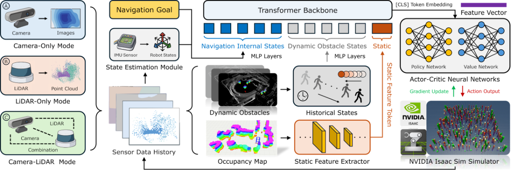
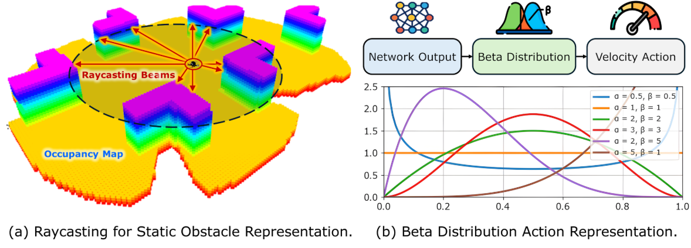
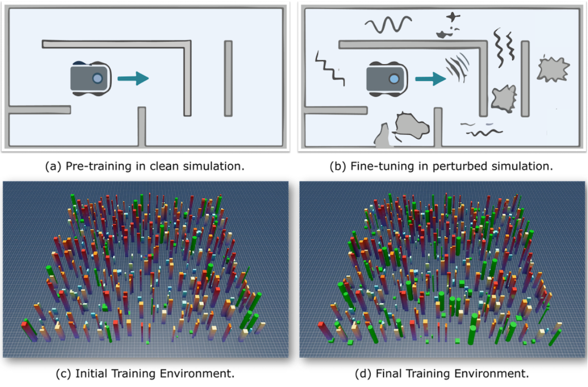
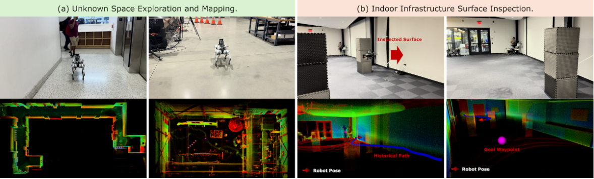
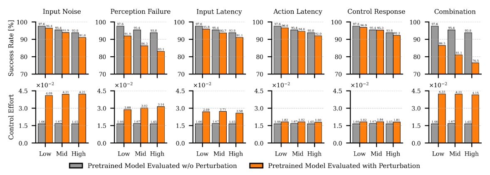
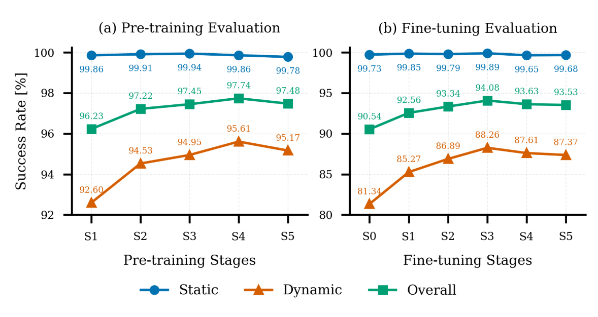
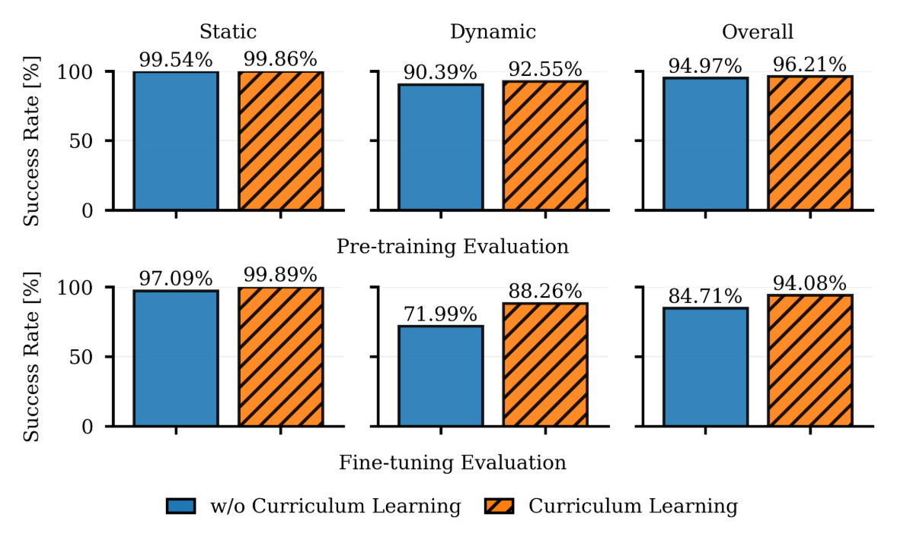
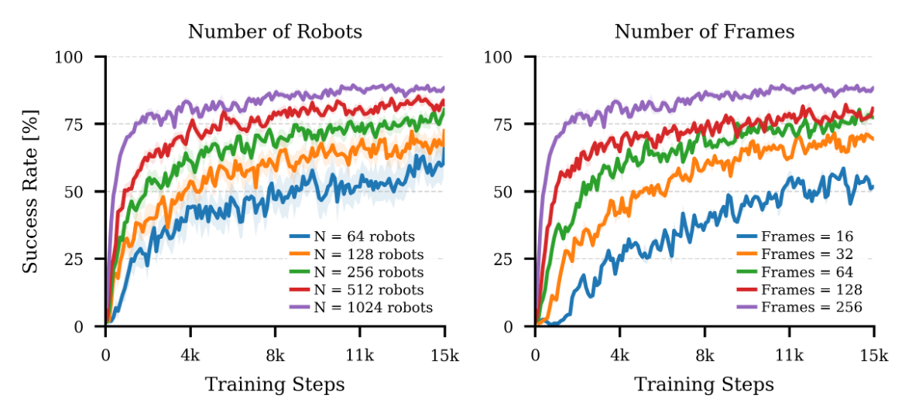
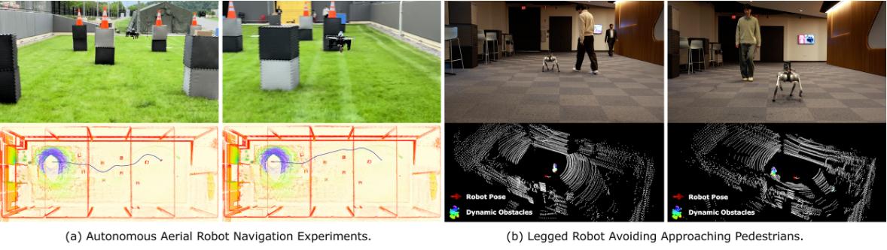

# NavRL++ 论文导读：用系统级框架 + 扰动感知微调，打通强化学习导航从仿真到真机的"最后一公里"

> **论文标题**：NavRL++: A System-Level Framework for Improving Sim-to-Real Transfer in Reinforcement Learning-Based Robot Navigation
> **会议/期刊**：arXiv 预印本，2026 年 5 月（尚未正式发表）
> **作者**：Zhefan Xu, Hanyu Jin, Kenji Shimada
> **机构**：Carnegie Mellon University, Department of Mechanical Engineering
> **arXiv**：https://arxiv.org/abs/2605.15559
> **代码**：即将在 GitHub 开源

---

## 读之前先搞清楚

### 这篇论文要解决什么问题？

NavRL（上一篇论文）已经证明了：用强化学习 + 结构化状态 + 安全盾，无人机可以在动态环境中安全飞行。但如果你真的想把 NavRL 部署到一台真实的机器人上（不管是无人机还是四足机器狗），你会立刻遇到一堆头疼的问题：

1. **传感器数据不对齐**：仿真里深度图清晰完美，真实世界中深度相机有噪声、有盲区、有拖影
2. **感知模块会漏检**：动态障碍物检测器不是 100% 准确的——有时候人就在前面，检测器却没检测到（假阴性）
3. **系统有延迟**：从传感器采集数据 → 感知模块处理 → 策略网络推理 → 飞控执行，每一步都有毫秒级的延迟——加起来可能就几十上百毫秒了。对于以 2m/s 飞行的无人机，100ms 的延迟意味着它已经飞了 20cm 而控制指令还没更新
4. **控制器响应不一致**：仿真里的飞控是理想化的，真实飞控有不同的响应速度和超调
5. **同一个策略要适配不同机器人**：无人机是 3D 运动的，四足机器狗是地面 2D 运动的，它们的动力学完全不同

现有的 RL 导航论文大多只关注"怎么设计更好的状态/动作/奖励"，很少有人系统性地分析**这些部署层面的问题到底对性能有多大影响，以及怎么解决它们**。

NavRL++ 就是来回答这些问题的。

> **小白理解**：如果把 NavRL 比作在驾校里学会了开车，那 NavRL++ 就是在驾校毕业后，专门请了一个教练陪你上路——这个教练知道你会在哪里犯错（比如倒车入库时后视镜有盲区、雨天刹车距离变长），针对性地帮你练习这些薄弱环节。**NavRL++ 不改变 NavRL 的核心架构，而是在训练的最后阶段加入"真实世界的干扰"，让策略提前适应这些干扰——这就是"扰动感知微调"的核心思想**。

### 读懂这篇论文需要的前置知识

| 概念 | 简单解释 |
|:---|:---|
| **Sim-to-Real Transfer** | 仿真训练的策略部署到真实机器人上，由于两个"世界"有差距，效果会下降 |
| **PPO（近端策略优化）** | 一种稳定高效的强化学习算法，通过限幅操作控制策略更新幅度 |
| **Transformer** | 一种基于自注意力机制的神经网络架构，擅长捕捉序列中的长程依赖关系 |
| **自注意力（Self-Attention）** | 让序列中每个元素都能"看到"其他所有元素，从而理解全局上下文 |
| **速度障碍（Velocity Obstacle, VO）** | 在速度空间中计算会导致碰撞的速度集合，用于安全判据 |
| **课程学习（Curriculum Learning）** | 先从简单任务开始训练，逐步增加难度——类比人类从小学到大学的教育过程 |
| **域随机化（Domain Randomization）** | 在仿真中随机变化环境参数（如光照、纹理、物理参数），让策略学会适应变化 |

---

## 一、NavRL++ 的解决思路

NavRL++ 的核心思路可以用一句话概括：**不仅告诉你 RL 导航"怎么学"，还告诉你"学了之后怎么在真实世界中用得好"——通过系统级分析 + 扰动感知微调 + Transformer 时序推理，三重手段打通 Sim-to-Real 的"最后一公里"。**

具体来说，NavRL++ 做了五件关键的事：

1. **系统级 Sim-to-Real 因子分析（首次）**：把 Sim-to-Real 的差距拆解为 5 个独立因子——传感器噪声、感知失败（假阴性漏检）、输入延迟、动作延迟、控制响应差异——并定量测量每个因子对导航性能的独立影响和叠加影响。这是该领域第一次有人做这么系统的分析。

2. **扰动感知微调（Perturbation-Aware Fine-tuning）**：基于上述分析，在 RL 预训练完成后，再在仿真中注入这些扰动对策略进行微调。策略提前"见过"真实世界的噪声模式，部署时就不慌了。

3. **Transformer 时序推理策略**：NavRL 用的是单帧 CNN 策略（只看当前时刻的观测做决策），NavRL++ 改用 Transformer 架构，输入过去 2 秒（5 帧）的观测历史，让策略能够理解"障碍物正在往哪移动"而不仅仅是"障碍物现在在哪"。这不仅提升了动态环境下的安全性，还显著减少了控制震荡。

4. **多模态传感器支持**：同时支持纯相机（RGB-D）、纯激光雷达（LiDAR）、以及相机+激光雷达融合三种感知模式，同一个策略网络无需重新训练。

5. **跨平台跨任务部署验证**：同一份策略权重（甚至不需要微调），同时部署到四旋翼无人机和四足机器狗上，执行探索建图和表面巡检两种不同任务——证明了策略的泛化能力远超之前的方法。

> **小白理解**：NavRL++ 的三层防护很像手机的"信号优化"策略。Transformer 时序推理相当于"多天线接收"——不是只看当前一瞬间的信号，而是综合过去几毫秒的信号来解码，更稳定；扰动感知微调相当于"提前在不同信号环境下测试"——在电梯、地下室、高速公路上都测过，正式使用时就不怕信号差了；系统级因子分析相当于"诊断工具"——先搞清楚到底是基带芯片的问题、天线设计的问题、还是协议栈的问题，然后对症下药。

---

## 二、NavRL++ 整体流程：从训练到部署的完整闭环



*图：NavRL++ 的强化学习自主导航框架。系统支持纯相机、纯激光雷达和相机-激光雷达融合三种模式。传感器数据经状态估计模块处理后聚合为传感器历史以形成导航内部状态，同时感知模块从环境中提取静态占用地图和动态障碍物信息。Transformer 骨干网络编码多模态输入，提取的特征向量送入 Actor-Critic 网络生成控制动作并通过 PPO 更新策略。*

NavRL++ 的整体框架比 NavRL 更"工业化"——它不仅是一个研究原型，更是一个考虑了工程部署细节的完整系统。

---

### 第 1 步：多模态感知 + 状态估计（统一不同传感器的"语言"）

NavRL++ 的一大升级是支持多种传感器配置，每种配置下感知和状态估计的方式不同，但最终输出的状态格式完全一致（这就是"统一表示"的威力）。

- **输入**：RGB-D 图像和/或 LiDAR 点云 + 机器人内部状态
- **操作**：

  > **总览**：多模态传感器数据 → 传感器特定处理 → 统一的障碍物状态表示
  >
  > ```
  > ┌──────────────────────────────────────────────────────────┐
  > │ 感知模式选择：                                            │
  > │                                                          │
  > │ ① Camera-Only: RGB-D → 深度聚类 + U-depth检测 → 集成     │
  > │ ② LiDAR-Only:  点云 → 降采样 → DBSCAN聚类 → 3D包围框     │
  > │ ③ Camera-LiDAR: ① + ② → 合并检测结果                     │
  > └──────────────────────────────────────────────────────────┘
  >         ↓
  > ┌──────────────────────────────────────────────────────────┐
  > │ 状态估计模块：                                            │
  > │   Camera模式 → VINS-Mono（视觉惯性里程计）                 │
  > │   LiDAR模式  → FAST-LIO2（激光惯性里程计）                │
  > │   输出：机器人位姿 + 速度（高频更新）                       │
  > └──────────────────────────────────────────────────────────┘
  >         ↓
  > ┌──────────────────────────────────────────────────────────┐
  > │ 静态障碍物感知：                                          │
  > │   递归占用体素地图更新（log-odds贝叶斯更新）               │
  > │   固定内存大小、O(1)访问、在线运行无需预建图                │
  > └──────────────────────────────────────────────────────────┘
  >         ↓
  > ┌──────────────────────────────────────────────────────────┐
  > │ 动态障碍物感知（三步流水线）：                              │
  > │   ① 几何检测 → 3D包围框（不估计朝向）                      │
  > │   ② 数据关联 + Kalman滤波追踪（速度估计）                  │
  > │   ③ 动静分类（速度阈值法 + 2D深度学习检测器辅助）           │
  > └──────────────────────────────────────────────────────────┘
  >         ↓
  > 输出：统一格式的静态距离矩阵 + 动态障碍物状态列表
  > ```

  **① 多模态检测策略**

  不同传感器有不同的数据特征，需要不同的处理方法：
  - **LiDAR 点云**：范围广、几何精度高 → 降采样后用 DBSCAN 聚类找到障碍物中心和尺寸
  - **RGB-D 深度图**：数据密集但噪声大 → 需要用 U-depth 图 + 线分组 + 深度聚类做集成检测来抑制假阳性
  - **融合模式**：两个传感器各自独立检测，然后合并结果

  **② 状态估计模块**

  根据使用的传感器，选择不同的 SLAM/里程计算法来估计机器人自身的位姿和速度。这些信息会和用户设定的导航目标结合，形成"导航内部状态"。

  **③ 动静分离**

  追踪到障碍物后，需要判断它是静态的还是动态的：
  - 方法一：看速度是否超过阈值 → 速度快 = 动态
  - 方法二：看 2D 深度学习检测器（YOLO 类）是否识别为"人/车/动物"等动态类别

- **输出**：统一的障碍物表示（静态距离矩阵 + 动态障碍物位置/速度/尺寸列表 + 机器人内部状态）

> **小白理解**：多模态支持的设计就像手机同时支持 Wi-Fi 和蜂窝网络——不管你当前用的是哪种连接方式，App 访问互联网的接口是一样的。**NavRL++ 的策略网络只需要知道"前面 5 米有人、左边 3 米有墙"，而不关心这些信息是从相机算出来的还是从激光雷达算出来的——这就是"统一表示"的价值**。

---

### 第 2 步：构建带时序的 RL 状态（让策略"记住过去 2 秒"）

这是 NavRL++ 相比 NavRL 最大的架构升级。NavRL 的 CNN 策略只看当前时刻的观测，但导航是一个时序决策问题——你需要知道障碍物过去几帧的运动趋势才能预判它接下来会去哪。

- **输入**：当前帧 + 前 4 帧的障碍物状态和机器人内部状态（共 5 帧，覆盖 2 秒，采样间隔 0.5 秒）
- **操作**：

  > **总览**：5 帧历史数据 → 分别编码 → 拼接为 token 序列 → Transformer 处理
  >
  > ```
  > 时间 t-4     t-3     t-2     t-1     t (当前)
  >   ↓          ↓       ↓       ↓       ↓
  > ┌──────────────────────────────────────────────────┐
  > │ 静态障碍物状态：单 token（每帧更新但结构相同）      │
  > │   → 3层CNN编码(通道: 4→16→16) → 展平 → MLP投影   │
  > └──────────────────────────────────────────────────┘
  >         ↓
  > ┌──────────────────────────────────────────────────┐
  > │ 动态障碍物状态：5 个 token（每个时间步 1 个）       │
  > │   每个token: [位置, 速度, 半径] × N_d个障碍物       │
  > │   → MLP投影到共享嵌入维度 64                       │
  > └──────────────────────────────────────────────────┘
  >         ↓
  > ┌──────────────────────────────────────────────────┐
  > │ 机器人内部状态：5 个 token（每个时间步 1 个）       │
  > │   每个token: [目标方向, 目标距离, 当前速度]        │
  > │   → MLP投影到共享嵌入维度 64                       │
  > │   所有向量在目标坐标系下表示                        │
  > └──────────────────────────────────────────────────┘
  >         ↓
  > 拼接为 12 个 token 的序列（1 static + 5 dynamic + 5 internal + 1 [CLS]）
  >         ↓
  > ┌──────────────────────────────────────────────────┐
  > │ Transformer Encoder（4层，4头注意力，dim=64）       │
  > │   加入位置编码保留时序信息                          │
  > │   Self-Attention 让 static/dynamic/internal 交互   │
  > └──────────────────────────────────────────────────┘
  >         ↓
  > [CLS] token 的输出特征（聚合了所有信息）
  >         ↓
  > Actor (MLP, 2×256) → Beta分布的(α, β) → 速度指令
  > Critic (MLP, 2×256) → 状态价值 V(s)
  > ```

  **① Token 设计（固定 12 个 token）**

  NavRL++ 的策略网络是一个轻量级 Transformer，输入固定为 12 个 token：
  - **1 个静态障碍物 token**：静态障碍物在短时间内不会变化，所以只需要 1 个 token（节约计算）
  - **5 个动态障碍物 token**：每个 token 包含该时刻所有动态障碍物的状态（最多 5 个障碍物），5 个 token 覆盖 2 秒历史
  - **5 个机器人内部状态 token**：每个 token 包含该时刻的目标方向、目标距离、机器人速度
  - **1 个 [CLS] token**：类似 BERT 的设计，这个 token 会通过 Self-Attention 聚合所有其他 token 的信息，作为最终的特征表示

  **② 模态对齐（Modality Alignment）**

  不同来源的信息（静态距离、动态障碍、内部状态）维度不同，需要"对齐"到同一个嵌入空间。具体做法：
  - 静态障碍物的 2D 距离矩阵 → 3 层 CNN（通道 4→16→16）→ 展平 → MLP 投影到 64 维
  - 动态障碍物状态向量 → MLP 投影到 64 维
  - 机器人内部状态向量 → MLP 投影到 64 维
  
  所有 token 都变成 64 维向量，Transformer 内部的处理维度也是 64。

  **③ 极轻量的设计（0.31M 参数）**

  整个策略网络只有 **31 万个参数**，这对于 Transformer 架构来说极其轻量。作为对比，GPT-2 Small 有 1.24 亿参数。这么小的模型可以在机载计算机上以 4.1ms 的推理时间运行，完全可以做到实时。

  **④ 静态障碍物的射线投射**

  

  *图：静态障碍物和动作表示。(a) 占用地图 + 射线投射编码周围几何结构，水平 36 条射线 × 垂直 4 条 = 144 个距离值；(b) 网络输出 Beta 分布参数以生成连续速度动作。*

  水平面：36 条射线（每 10° 一条，360° 全覆盖）
  垂直面：4 条射线（-10° 到 20°，每 10° 一条）
  总共：144 个距离值
  最大感知范围：4 米（超过此距离的值截断为 4m，防止远处障碍物过度影响策略）

- **输出**：[CLS] token 的 64 维特征向量，送入 Actor 和 Critic 网络

> **小白理解**：为什么要用 5 帧历史而不是 1 帧？想象你开车时只看当前这一瞬间的照片——你看到前面有一辆车，但完全不知道它是停在原地还是正在向你倒车。**看了 5 帧（2 秒）就不一样了**——你可以算出它每 0.5 秒移动了多少，从而知道它的大致速度和方向。Transformer 的 Self-Attention 机制天然适合处理这种"把不同时刻的信息关联起来"的任务——它可以自动学会关注那些"位置在变化"的障碍物 token。

---

### 🔢 具体数字例子：Transformer 如何利用 5 帧历史预测障碍物轨迹

**条件设定：** 前方 8m 有行人，在 2 秒内从 (8, 2) 走到 (8, 0)，即横穿马路。无人机当前速度 1.5 m/s 向前。

**Step 1：5 帧动态障碍物 token（只关注该行人）**

| 帧 | 时间 | 行人位置 | 距本机 | Token 内容 |
|:---:|:---:|:---:|:---:|:---|
| t-4 | −2.0s | (8.0, 2.0) | 8.25m | 在右前方 |
| t-3 | −1.5s | (8.0, 1.5) | 8.14m | 略向右前 |
| t-2 | −1.0s | (8.0, 1.0) | 8.06m | 接近正前方 |
| t-1 | −0.5s | (8.0, 0.5) | 8.02m | 几乎正前方 |
| t (当前) | 0.0s | (8.0, 0.0) | 8.00m | 正前方！ |

**Step 2：Self-Attention 自动计算"这个行人在横穿"**

Transformer 的 Self-Attention 会让 t 时刻的 token 关注 t-2 和 t-4 时刻的 token，计算出行人的运动模式：

运动速度 ≈ (0, −1.0) m/s（从右向左，每秒 1 米）

**Step 3：[CLS] token 聚合信息后，Actor 输出**

综合判断：
- 静态障碍物 token：前方 8m 无遮挡 ✓
- 机器人内部状态 token：正以 1.5 m/s 向目标飞去
- 动态障碍物 token（关键！）：行人正在从右向左横穿，预计 8 秒后到达无人机正前方

策略输出：略微减速 + 略微右转以从行人后方通过（因为行人在向左移动）。

> **关键理解**：如果只看当前帧 t，行人就在正前方 8m 处，策略可能会选择向左绕行——但这正好和行人移动方向一致，可能撞上。**5 帧历史让 Transformer "看到"了行人的运动趋势，于是做出了"向右绕行"的更好决策。这就是时序推理的核心价值——不是被动反应，而是主动预判**。

---

### 第 3 步：两阶段训练策略（预训练 + 扰动感知微调）

这是 NavRL++ 最具原创性的贡献之一。训练不是一步到位的，而是分为两个阶段。

- **输入**：
  - 预训练阶段：干净仿真环境（无噪声、无延迟、无感知失败）
  - 微调阶段：带扰动的仿真环境

- **操作**：

  > **总览**：预训练（学基础导航）→ 注入 5 种扰动 → 微调（学鲁棒导航）
  >
  > ```
  > ┌─────────────────────────────────────────────────────────┐
  > │               第一阶段：预训练（Pre-training）             │
  > │                                                         │
  > │  环境：干净仿真（无噪声、无延迟）                           │
  > │  机器人：1024 架四旋翼并行                                 │
  > │  算法：PPO + GAE                                         │
  > │  优化器：Adam，学习率 2×10⁻⁴                              │
  > │  课程：S1(300静+60动) → S2(350+80) → S3(400+100) → S4(400+120)│
  > │  目标：学会基本的导航和避障能力                              │
  > └─────────────────────────────────────────────────────────┘
  >         ↓
  > ┌─────────────────────────────────────────────────────────┐
  > │             第二阶段：扰动感知微调（Post-training）         │
  > │                                                         │
  > │  学习率降低：5×10⁻⁵（微调需要更小心）                      │
  > │  课程：S1 → S2 → S3                                      │
  > │                                                         │
  > │  同时注入 5 种扰动：                                      │
  > │  ┌───────────────────────────────────────────────────┐  │
  > │  │ ① 输入噪声（Input Noise）                          │  │
  > │  │   静态距离估计 + 动态障碍状态 + 机器人状态           │  │
  > │  │   → 注入零均值高斯噪声（标准差经验确定）             │  │
  > │  ├───────────────────────────────────────────────────┤  │
  > │  │ ② 感知失败（Perception Failure）                   │  │
  > │  │   以 p_drop=0.3 的概率随机丢弃检测到的障碍物        │  │
  > │  │   → 模拟假阴性漏检（检测器没看到人）                │  │
  > │  ├───────────────────────────────────────────────────┤  │
  > │  │ ③ 输入延迟（Input Latency）                        │  │
  > │  │   随机延迟 [0, 0.1] 秒                              │  │
  > │  │   → 模拟感知模块的处理延迟                          │  │
  > │  ├───────────────────────────────────────────────────┤  │
  > │  │ ④ 动作延迟（Action Latency）                       │  │
  > │  │   随机延迟 [0, 0.04] 秒                             │  │
  > │  │   → 模拟网络通信延迟                                │  │
  > │  ├───────────────────────────────────────────────────┤  │
  > │  │ ⑤ 控制响应差异（Control Response）                 │  │
  > │  │   速度控制器增益随机化 ±40%（60%~140% 标称值）       │  │
  > │  │   → 模拟不同平台/不同载重的动力学差异               │  │
  > │  └───────────────────────────────────────────────────┘  │
  > └─────────────────────────────────────────────────────────┘
  >         ↓
  > 输出：鲁棒策略，可在真实世界中零样本部署
  > ```

  

  *图：训练策略示意。(a) 策略首先在干净仿真环境中预训练，(b) 随后在受控扰动下微调以提高泛化鲁棒性，(c-d) 课程学习从低密度障碍物逐步增加到高密度。*

  **① 预训练阶段**

  在完全干净的 Isaac Sim 环境中训练，让策略先学会基本的导航行为——向目标飞、躲避障碍物、保持平稳。采用课程学习（5 个难度级别 S1→S5），但只用到 S4，因为实验发现 S5 反而会导致性能略微下降。

  **② 扰动感知微调的核心设计哲学**

  这 5 种扰动的选择来自于作者的**真实部署经验**——他们先尝试直接部署 NavRL 到真实机器人，发现效果不好，然后逐一定位问题来源，最后把这些"坑"反向注入到仿真训练中。

  - **输入噪声**：模拟传感器噪声和状态估计算法的不准确性
  - **感知失败（p=0.3）**：模拟真实检测器的漏检率（保守估计约 30%），这是 5 种扰动中对成功率影响最大的
  - **输入延迟（0~100ms）**：模拟占用地图构建、障碍物检测追踪、状态估计等模块的处理时间
  - **动作延迟（0~40ms）**：模拟网络通信和指令传输延迟
  - **控制响应差异（±40%）**：覆盖从轻载无人机到重载四足机器人的不同动力学响应范围（上升时间 0.32s~1.12s，稳定时间 0.96s~2.14s）

  **③ 课程学习细节**

  | 阶段 | 静态障碍物 | 动态障碍物 |
  |:---|:---:|:---:|
  | S1 | 300 | 60 |
  | S2 | 350 | 80 |
  | S3 | 400 | 100 |
  | S4 | 400 | 120 |
  | S5 | 400 | 140 |

  预训练：S1→S2→S3→S4，微调：S1→S2→S3

- **输出**：经过两阶段训练的鲁棒策略，可以在真实世界中零样本部署

> **小白理解**：两阶段训练策略就像是"考驾照 + 防御性驾驶培训"。第一阶段（预训练）相当于在标准驾校场地里学会了基本的倒车入库、侧方停车；第二阶段（扰动感知微调）相当于教练在副驾驶上随机给你制造"意外"——突然遮住一个后视镜（感知失败）、让你踩着延迟的刹车（输入延迟）、方向盘响应变迟钝（控制差异）。**经历过这些"刁难"之后，真正上路遇到类似的意外时，你已经有了肌肉记忆，不会慌乱**。

---

#### ❓ 深入理解：PPO + GAE 的训练目标

**PPO 的 Clip 机制**

PPO 的目标函数中使用 clip 操作来限制策略更新的幅度：

$$\mathcal{L}^{CLIP}(\theta) = \hat{\mathbb{E}}_t \left[ \min(r_t(\theta) \hat{A}_t, \text{clip}(r_t(\theta), 1-\epsilon, 1+\epsilon) \hat{A}_t) \right]$$

其中 $r_t(\theta) = \frac{\pi_\theta(a_t|s_t)}{\pi_{\theta_{old}}(a_t|s_t)}$ 是新旧策略的概率比。clip 操作确保单次更新不会让策略变化太大（$\epsilon = 0.2$）。

**GAE（广义优势估计）**

GAE 用于平衡偏差和方差：

$$\hat{A}_t^{GAE(\gamma,\lambda)} = \sum_{l=0}^{\infty} (\gamma\lambda)^l \delta_{t+l}$$

其中 $\delta_t = r_t + \gamma V(s_{t+1}) - V(s_t)$ 是 TD 误差。$\lambda$ 在 0（低方差高偏差）和 1（高方差低偏差）之间平衡。

**总损失函数**：

$$\mathcal{L}_{total} = \mathcal{L}_{actor} + \mathcal{L}_{critic} + \mathcal{L}_{entropy}$$

熵正则化项鼓励策略在训练中保持一定的探索随机性，避免过早收敛到次优解。

> **核心设计理由**：PPO + GAE 的组合是当前 RL 社区最成熟稳定的训练方案之一。**对于导航这种安全关键的任务，训练稳定性比算法的新颖性更重要——一个稳定收敛的 PPO 策略远比一个"可能更好但容易崩溃"的 novelty 算法有价值**。

---

### 第 4 步：安全盾 + 任务部署（从导航策略到真实应用）

NavRL++ 沿用了 NavRL 的 VO 安全盾，但增加了两个重要的应用场景展示。

- **输入**：策略网络输出速度 + 当前障碍物状态
- **操作**：

  > **总览**：安全盾可选用 → 集成到高层任务规划中 → 执行真实任务
  >
  > ```
  > 策略网络输出 V_π
  >         ↓
  > ┌─────────────────────────────┐
  > │ 可选：VO安全盾               │
  > │   minimize ||V_safe - V_π|| │
  > │   s.t. V_safe 在安全区域内   │
  > │   如果无可行解 → V_safe = 0  │
  > └─────────────────────────────┘
  >         ↓
  > ┌──────────────────────────────────────────────────┐
  > │ 集成到高层任务：                                   │
  > │                                                   │
  > │ ① 未知环境探索建图                                │
  > │   全局探索规划器 → 给waypoint目标                  │
  > │   → RL导航策略执行局部避障+追踪waypoint            │
  > │   → 在线建图                                      │
  > │                                                   │
  > │ ② 自主表面巡检                                    │
  > │   已知地图 → 生成巡检waypoints序列                 │
  > │   → RL导航策略执行waypoint间导航+动态避障          │
  > └──────────────────────────────────────────────────┘
  >         ↓
  > 输出：安全速度指令，驱动不同机器人平台
  > ```

  **① 安全盾的改进讨论**

  与 NavRL 相同，安全盾是一个可选的模块。NavRL++ 的论文更坦诚地讨论了它的局限性：在高度拥挤的环境中，VO 约束的并集可能覆盖整个速度空间，导致线性规划不可行，机器人只能原地停下。

  **② 探索建图任务**

  机器人被放入一个完全未知的环境中，没有预先建好的地图。全局探索规划器根据已探索的区域，不断生成下一个需要前往的 waypoint 目标。**这些 waypoint 不保证是安全可达的**——路径上可能有未发现的障碍物——这恰好需要 RL 策略的局部避障能力。

  **③ 自主巡检任务**

  从一个已知的楼层平面图出发，生成一系列需要巡检的 waypoint。同样，平面图上没有标注的临时障碍物（如行人、临时堆放的物品）需要 RL 策略来实时规避。

  

  *图：基于 NavRL++ 的导航核心应用。(a) 未知环境的探索与建图——左侧两列展示了不同环境下的最终探索地图；(b) 室内基础设施表面巡检——右侧两列展示了 RViz 中被巡检的表面视图。*

- **输出**：安全速度指令，由机器人底层控制器执行

> **小白理解**：NavRL++ 不只是一个"导航算法"，而是一个"导航基础设施"——就像 TCP/IP 协议栈之于互联网。**高层应用（探索、巡检、送货……）只需要调用"请从 A 飞到 B"这个接口，底层的避障、安全、鲁棒性全部由 NavRL++ 的策略 + 安全盾来保证**。这种"分层解耦"的设计哲学使得同一个策略可以被多种不同的应用复用。

---

## 三、核心创新点

### 创新 1：系统级 Sim-to-Real 因子分析（领域首次）

这是 NavRL++ 最独特的贡献——**首次将 Sim-to-Real 迁移问题系统性地拆解为 5 个独立因子，并定量测量每个因子的影响**。



*图：各扰动因子及其组合对成功率和控制力的影响。最重要的是：感知失败（Perception Failure）是单一因子中影响最大的，成功率下降超过 5%；所有因子叠加时，成功率下降超过 15%。*

实验发现：
| 单一扰动因子 | 成功率下降 | 控制力增加 |
|:---|:---:|:---:|
| **感知失败**（30%漏检率） | **>5%** | 中等 |
| 输入噪声 | 1-3% | **最大** |
| 输入延迟（0-100ms） | 1-3% | 中等 |
| 动作延迟（0-40ms） | <1% | 较小 |
| 控制响应差异（±40%） | 1-2% | 较小 |
| **全部叠加** | **>15%** | **~2.5×** |

> **小白理解**：这个分析的价值相当于医生看病——不是笼统地说"你身体不舒服"，而是做了全套检查后告诉你："你的问题是血压偏高（输入噪声）+ 轻度贫血（感知失败），其他指标正常"。**知道哪个因子的影响最大，就可以优先解决它——这就是 NavRL++ 为什么把感知失败的概率设得最高（p=0.3）的原因**。

### 创新 2：扰动感知微调（Perturbation-Aware Fine-tuning）

基于创新 1 的分析结果，在 RL 训练的最后阶段注入仿真扰动，让策略适应真实世界的"不完美"。这不是简单的域随机化（Domain Randomization）——域随机化是盲目地随机化所有参数，而 NavRL++ 的扰动是基于**实证测量**的精确选择。

实验证明：扰动感知微调 + Transformer 策略（NavRL++）相比单纯改进训练的 Transformer 策略（NavRL-IT-T），在动态环境中成功率从 81.09% 提升到 88.32%，在高密度环境中从 76.49% 提升到 83.96%。

### 创新 3：Transformer 时序推理策略

将单帧 CNN 策略替换为 5 帧 Transformer 策略，带来了两个关键收益：
- **控制更平滑**：控制力（CE）从 0.093 降至 0.043 m/s²（降低 54%），大幅减少震荡
- **鲁棒性更强**：在延迟和噪声条件下表现更好，因为 Transformer 可以"脑补"缺失/错误的单帧信息

### 创新 4：跨平台跨任务的零样本泛化

同一份策略权重，不做任何微调：
- ✅ 四旋翼无人机（3D 运动）→ 避免碰撞、安全导航
- ✅ 四足机器狗（2D 运动）→ 避免碰撞、安全导航
- ✅ 探索建图任务 → 跟踪 waypoint + 局部避障
- ✅ 表面巡检任务 → 跟踪 waypoint + 局部避障

这说明策略学到的是"通用的避障和导航能力"，而不是某个特定平台的动力学细节。

### 创新 5：多模态传感器统一框架

三种感知配置（纯相机/纯激光雷达/融合）共用同一个策略网络，无需重新训练。这得益于"统一的状态表示"设计——无论传感器是什么，最终输出的状态格式都是相同的。

---

## 四、实验结果

### 实现细节

- **训练平台**：NVIDIA Isaac Sim，1024 机器人并行，RTX 4090 GPU
- **训练时间**：总计约 200 GPU 小时（预训练：S1 约 80h，S2-S4 各 20-30h；微调：S1-S3 各 10-15h），相当于 80000+ 小时的聚合经验
- **推理速度**：20 Hz 频率下平均 4.1ms（机载计算机）
- **模型大小**：0.31M 参数
- **最大速度**：2.0 m/s（也测试了 1.5-3.0 m/s 范围）
- **评估指标**：
  - **成功率（SR）**：在规定时间内安全到达目标的比例
  - **控制力（CE）**：速度变化量之和 / 总导航时间，越低表示越平滑
  - **路径长度**：实际飞行距离

---

### 核心对比实验（Ablation Study）

在 Isaac Sim 内，加入全部扰动后评估。所有数据基于 10,000 次随机起点-目标的导航试验。

| 方法 | 整体成功率 | 整体控制力 | 说明 |
|:---|:---:|:---:|:---|
| NavRL（原始） | 63.05% | 0.050 | 基线方法 |
| NavRL-IT | 92.85% | 0.093 | +改进训练（成功率高但震荡大） |
| NavRL-IT-T | 90.54% | 0.043 | +Transformer（成功率高+平滑） |
| NavRL-IT-PF | 77.30% | 0.081 | +扰动微调但用CNN（效果反而变差） |
| **NavRL++（完整）** | **94.08%** | **0.048** | +改进训练+Transformer+扰动微调 |

> **小白理解**：这张消融表揭示了几个重要的发现：
>
> 1. **改进训练策略（IT）比原始 NavRL 提升了近 30 个百分点**——说明很多性能瓶颈不在算法本身，而在训练配置（如目标随机化、大规模并行、合理的课程设计）
> 2. **Transformer（T）以微小的成功率代价换来了大幅的平滑性提升**——控制力降低了一半多（0.093→0.043），意味着机器人的飞行轨迹不再"抖来抖去"
> 3. **扰动感知微调（PF）只在和 Transformer 搭配时才有效**——NavRL-IT-PF（CNN+PF）反而比 NavRL-IT 更差，但 NavRL++（Transformer+PF）比 NavRL-IT-T 更好。**这说明了时序推理能力是"消化"噪声扰动的关键前提**——Transformer 可以利用多帧信息"过滤"掉噪声，而单帧 CNN 面对噪声只能做出剧烈反应

---

### 跨仿真器评估（Gazebo，核心结果的独立验证）

在完全不同的仿真器（Gazebo）中测试，排除"在训练环境过拟合"的可能性。

| 方法 | 静态低 | 静态中 | 静态高 | 动态低 | 动态中 | 动态高 |
|:---|:---:|:---:|:---:|:---:|:---:|:---:|
| Fast-Planner | 99% | 100% | 96% | — | — | — |
| EGO-Planner | 99% | 100% | 99% | — | — | — |
| ViGO | 91% | 89% | 86% | 71% | 70% | 57% |
| NavRL | 83% | 79% | 75% | 68% | 65% | 50% |
| **NavRL++** | **100%** | **99%** | **100%** | **94%** | **85%** | **81%** |

> **小白理解**：NavRL++ 在静态环境中达到了和顶级优化规划器（EGO-Planner、Fast-Planner）几乎相同的成功率（接近 100%），这在 RL 方法中是前所未有的。**在动态环境中，NavRL++ 以 81-94% 的成功率远超其他方法（ViGO 57-71%、NavRL 50-68%），差距非常显著**。

---

### 部署参数鲁棒性

| 参数 | 设定值 | 静态 SR | 动态 SR | 整体 SR |
|:---|:---|:---:|:---:|:---:|
| 速度限制 | 1.5 m/s | 99.77% | 81.09% | 90.43% |
| | **2.0 m/s** | **99.89%** | **88.26%** | **94.08%** |
| | 2.5 m/s | 99.77% | 89.53% | 94.68% |
| | 3.0 m/s | 99.07% | 87.42% | 93.25% |
| 控制频率 | 2 Hz | 96.47% | 72.92% | 84.69% |
| | 5 Hz | 99.65% | 82.48% | 91.06% |
| | 10 Hz | 99.82% | 86.58% | 93.20% |
| | **20 Hz** | **99.88%** | **88.18%** | **94.03%** |

> **小白理解**：NavRL++ 对部署参数的变化非常鲁棒。速度从 1.5 到 3.0 m/s 几乎不影响静态环境的表现，动态环境也只在 1.5 m/s 时有轻微下降。**控制频率只要不低于 10 Hz，性能基本无变化——这给真实部署留了很大的安全余量**。

---

### 训练策略分析



*图：各课程阶段的导航成功率评估。*



*图：使用和不使用课程学习训练的策略在静态和动态环境中的成功率对比。*



*图：不同训练规模下的成功率对比。增加并行机器人数量和每次更新的帧数都能显著提升收敛速度和最终成功率。*

几个关键发现：

1. **课程学习的效果在微调阶段尤其显著**：动态环境成功率从无课程学习的 ~70% 提升到有课程学习的 ~85%（+15%）
2. **训练规模至关重要**：1024 机器人比 256 机器人收敛更快、最终成功率更高
3. **目标随机化**（每个 episode 随机采样目标位置，而不是从预定义集合中选择）在所有设置下都持续提升成功率
4. **课程并非越难越好**：S5（400 静态 + 140 动态）反而导致性能轻微下降——存在一个"最佳难度"

---

### 真实世界部署



*图：在无人机和四足机器人平台上的真实世界导航实验。(a) 无人机在杂乱环境中的导航，同时可视化轨迹和在线地图；(b) 四足机器人躲避接近的行人，RViz 视图中高亮显示了感知到的动态障碍物。*

在两种机器人平台（四旋翼无人机 + Unitree 四足机器狗）上进行了真实世界测试：
- 杂乱环境中安全导航
- 行人从正面和侧面接近时有效避让
- 同一个策略，跨平台零样本部署
- 所有计算在机载计算机上完成（推理 4.1ms，20Hz）

两种真实任务验证：
- **未知环境探索建图**：机器人在无先验地图的情况下自主探索并建图，RL 策略负责局部避障
- **室内表面巡检**：按照楼层平面图生成的 waypoint 序列飞行，动态避开临时障碍物

---

## 五、在整个领域的位置

```
RL 机器人导航技术演进树：
=========================

早期 RL 导航（离散动作空间）
├── DQN 系列: CAD2RL, 单目避障
│   └── 局限: 只能输出左/右/直行等离散动作
│
├── 策略梯度方法（连续动作空间）★ NavRL 系列在这里
│   ├── PPO + 图像输入 → Sim-to-Real gap 大
│   │   └── 代表: 各类端到端飞行策略
│   ├── PPO + 蒸馏（教师-学生）
│   │   └── 代表: Song et al. 2023
│   ├── PPO + 结构化状态
│   │   ├── NavRL (RA-L 2025): 射线投射 + VO安全盾 + 大规模并行训练
│   │   │   └── 局限: 单帧CNN策略，无Sim-to-Real系统分析
│   │   └── ★ NavRL++ (arXiv 2026): 
│   │       ├── Transformer时序推理（5帧历史，0.31M参数）
│   │       ├── 扰动感知微调（5种实证扰动的精确注入）
│   │       ├── 系统级Sim-to-Real因子分析（首次定量拆解5个因子）
│   │       ├── 多模态传感器（Camera/LiDAR/Fusion统一框架）
│   │       └── 跨平台跨任务零样本部署
│   └── DRL-VO: 速度障碍融入奖励函数
│
├── 导航基础模型
│   ├── ViNT, GNM: 大规模数据预训练
│   └── NoMaD: 扩散策略用于导航
│
└── 优化规划方法（非RL，但常作为对比基准）
    ├── Fast-Planner, EGO-Planner（静态环境王者）
    └── ViGO（动态环境，但近距离不够灵敏）
```

> **小白理解**：NavRL++ 在 RL 导航领域的定位是**工程实用化的里程碑**。之前的论文大多在回答"能不能用 RL 做导航？"，NavRL 在回答"怎么做更好？"，而 NavRL++ 在回答"怎么在真实世界中稳定地用？"**它把 RL 导航从"实验室 demo"推进到了"可以部署到不同机器人上执行不同任务"的阶段**。

---

## 六、局限性

| 局限性 | 为什么是局限 |
|:---|:---|
| **感知模块仍是规则式的** | 动态障碍物检测和追踪用的是 DBSCAN + Kalman 滤波这类传统方法，在遮挡、复杂场景中容易漏检和误检。论文也承认这是"remaining limitation" |
| **轨迹平滑性不及优化方法** | EGO-Planner 的轨迹平滑度仍明显优于 RL 方法——优化方法会显式地优化整条轨迹的形状，而 RL 是逐步反应的 |
| **高密度动态环境仍有碰撞** | 在动态障碍物密集的环境中，成功率 81-88%，意味着每 5-8 次导航就有 1 次失败——对安全关键应用仍不够 |
| **安全盾在拥挤环境中过于保守** | 如果 VO 约束太多，机器人会原地停下——论文没有给出这个问题的解决方案 |
| **狭窄空间表现不佳** | 当两侧间隙小于 0.1-0.2m 时，策略会表现出犹豫/震荡行为。论文认为增加射线密度可能缓解，但并未验证 |
| **微调的扰动参数依赖经验设定** | 噪声标准差、延迟范围、漏检概率等参数基于作者的部署经验设定，在不同硬件平台上可能需要重新标定 |

---

## 七、一句话总结

> **NavRL++ 通过系统级 Sim-to-Real 因子分析（首次定量拆解 5 个部署差异因子）+ 扰动感知微调（将实证测量的噪声注入训练）+ Transformer 时序推理策略（5 帧历史，0.31M 参数，控制力降低 54%），将 RL 导航从"在仿真中跑得好"推进到了"同一份策略权重、零样本部署到无人机和机器狗上执行探索和巡检任务"的工程实用化水平——它是 RL 机器人导航从研究走向落地的标志性工作。**

---

## 参考资料

1. NavRL++ 论文: https://arxiv.org/abs/2605.15559
2. NavRL 论文: https://arxiv.org/abs/2409.15634
3. NavRL 代码: https://github.com/Zhefan-Xu/NavRL
4. PPO: Schulman et al., "Proximal Policy Optimization Algorithms", arXiv 2017
5. GAE: Schulman et al., "High-Dimensional Continuous Control Using Generalized Advantage Estimation", arXiv 2015
6. Vel. Obstacle: Fiorini & Shiller, "Motion Planning in Dynamic Environments Using Velocity Obstacles", IJRR 1998
7. Beta Policy: Chou et al., "Improving Stochastic Policy Gradients...Using the Beta Distribution", ICML 2017
8. Isaac Sim: Mittal et al., "Isaac Lab: A GPU-Accelerated Simulation Framework for Multi-Modal Robot Learning", arXiv 2025
9. FAST-LIO2: Xu et al., "FAST-LIO2: Fast Direct LiDAR-Inertial Odometry", IEEE TRO 2022
10. VINS-Mono: Qin et al., "VINS-Mono: A Robust and Versatile Monocular Visual-Inertial State Estimator", IEEE TRO 2018
