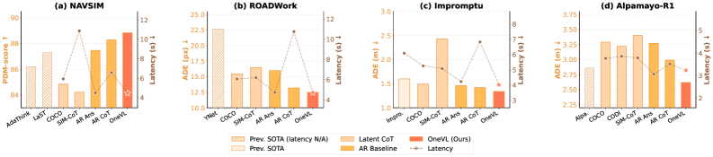
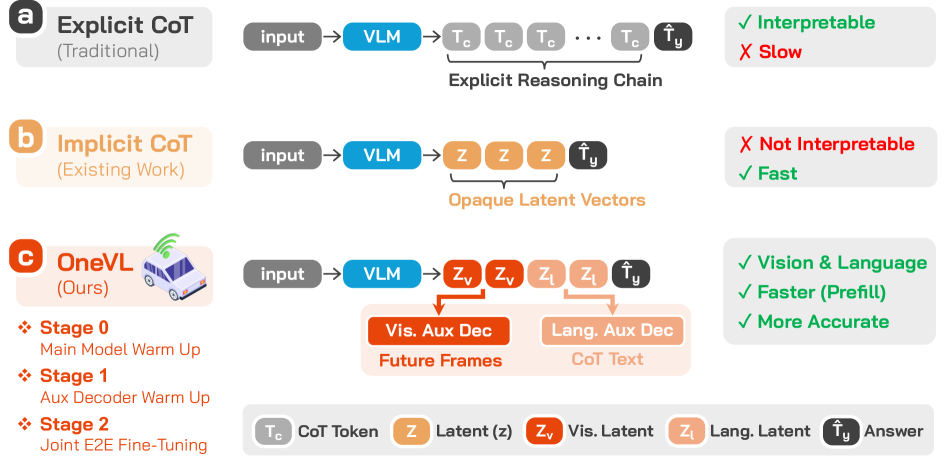
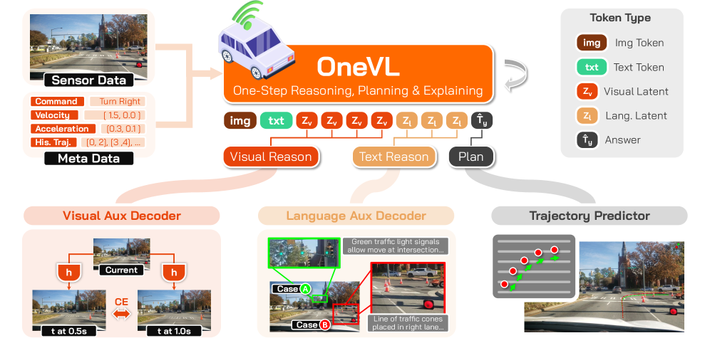
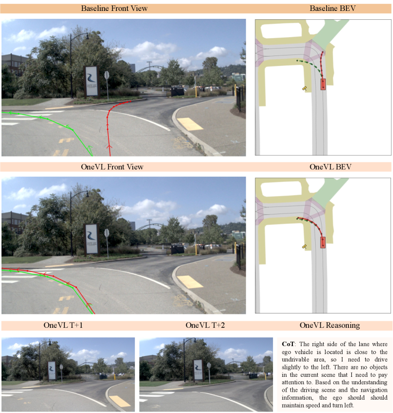
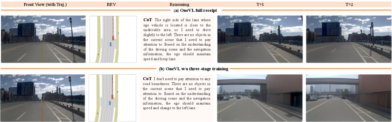

# OneVL 论文导读：用 World Model 监督 + latent space 压缩，让 latent CoT 首次超越 explicit CoT

> **论文标题**：OneVL: One-Step Latent Reasoning and Planning with Vision-Language Explanation
> **会议/期刊**：Technical Report，2026（arXiv 预印本）
> **作者**：Jinghui Lu, Jiayi Guan, Zhijian Huang, Jinlong Li, Guang Li, Lingdong Kong 等
> **机构**：小米具身智能团队（Xiaomi Embodied Intelligence Team）
> **arXiv**：https://arxiv.org/abs/2604.18486
> **代码**：https://github.com/xiaomi-research/OneVL

---

## 读之前先搞清楚

### 这篇论文要解决什么问题？

自动驾驶领域，VLA 模型（Vision-Language-Action——能"看懂场景、用语言思考、输出驾驶动作"的 AI）做轨迹规划时，**Chain-of-Thought**（CoT——让模型先说"我看到了什么、打算怎么做"，再输出轨迹）是提升准确率的关键手段。

但 explicit CoT 有一个致命问题：**慢**。标准的 autoregressive（逐 token 生成）方式必须先输出完整推理文字，才能输出轨迹。在实时自动驾驶场景中，多等 2-3 秒可能就是安全的代价。

于是有人提出 **latent CoT**（把推理压缩成几个紧凑的 latent vector，不逐 token 输出文字），但现有方法（COCONUT、CODI、SIM-CoT）在自动驾驶上**全都败给 explicit CoT**，甚至不如"不推理直接答"（answer-only）。

**OneVL 的诊断**：之前的方法只压缩了**文字**——而文字本身就是对物理世界的一种符号抽象。压缩文字等于压缩"二手抽象"，丢失了真正决定驾驶轨迹的**因果物理动态**（车辆运动规律、道路几何演变、障碍物交互）。

> **小白理解**：好比教 AI 开车，有两种方法：
>
> 方法 A：让 AI 说"前方 20 米有车以 30km/h 向右变道，所以我应减速左转"。说完再给方向盘指令——效果好但嘴太碎，说完车已撞上。
>
> 方法 B：不让 AI 说话，脑子里形成几个"思想向量"，直接输出方向盘指令——快但效果差。因为"思想向量"只压缩了文字，没压缩场景的物理规律。
>
> **OneVL 的做法**：既给"思想向量"，又要求这些向量能被还原成文字解释（语义正确）**和**未来画面（物理正确）。压缩的是"一手因果"，不是"二手抽象"。

### 读懂这篇论文需要的前置知识

| 概念 | 简单解释 |
|:---|:---|
| **VLA（Vision-Language-Action）** | 输入 image、输出 driving action，中间可用文字推理的 AI model |
| **Chain-of-Thought（CoT）** | 让 model 先说推理过程再输出答案，提高准确率 |
| **latent space / latent vector** | 神经网络内部的连续数值表示，是"压缩后的信息" |
| **autoregressive（AR）** | 逐 token 生成，每次预测都依赖前面已生成的结果 |
| **World Model** | 能预测环境未来变化的 model，相当于"在脑中模拟物理世界" |
| **Prefill / Decode** | Transformer 推理两阶段：prefill 并行处理全部输入，decode 逐 token 输出 |
| **auxiliary decoder** | training 时挂在 backbone 旁提供监督信号的 branch，inference 时丢弃 |

---

## 一、OneVL 的解决思路

OneVL 的核心 idea：

> **把推理压缩为 4 个 visual latent token + 2 个 language latent token，用两个 auxiliary decoder（language decoder 还原文字推理 + visual World Model decoder 预测未来画面）来监督这些 token。Inference 时丢弃 decoder，token 全部 prefill 进 prompt 并行处理，速度 ≈ answer-only，效果 > explicit CoT。**



*图1：四个 benchmark 上的 accuracy vs latency 对比。OneVL（红色星号）是唯一一个 accuracy 超越 explicit CoT（AR CoT+Answer）且 latency 匹配 answer-only（AR Answer）的方法。COCONUT/CODI/SIM-CoT 等之前的 latent CoT 方法在所有 benchmark 上均低于 answer-only baseline。*

```
传统 explicit CoT（accuracy 高但慢）：
  image → [逐 token 生成推理文字...] → trajectory   延迟 ∝ 推理长度
  
之前 latent CoT（快但 accuracy 差）：
  image → [几个 latent vector] → trajectory   只压缩了语言，丢了物理因果
  
OneVL（又快又准）：
  image → [4个 visual latent token + 2个 language latent token] → trajectory
              ├→ visual World Model decoder → 预测 0.5s/1.0s 后画面（training 时监督）
              └→ language auxiliary decoder → 还原 CoT 文字（training 时监督）
  inference 时：decoder 全部丢弃，latent token prefill（并行处理）→ 只生成 trajectory
```

> **小白理解**：考试答题。Explicit CoT 把草稿全写在答题纸上——老师看得懂但费时间。之前的 latent CoT 只在草稿纸上写几个关键词——快但关键词可能概括偏了（只概括了文字草稿，没概括题目逻辑）。
>
> OneVL 在草稿纸上写 6 个要点（4 个画面+2 个逻辑），必须同时满足：(1) 能还原成完整文字推理，(2) 能预测 0.5s 和 1s 后画面。**两种检验都通过，才算真正"理解"了场景，而不是在背答案模板。**



*图2：(a) Explicit CoT——逐 token 生成完整推理链再输出答案；(b) Implicit CoT——推理压缩为少量不透明 latent vector 𝒵；(c) OneVL——两类 latent token（红色 visual 𝒵ᵥ + 橙色 language 𝒵ₗ），training 时双 auxiliary decoder 分别 decode 为 future-frame visual token 和 CoT 文本，inference 时 decoder 丢弃、token prefill。*

---

## 二、OneVL 整体流程



*图3：Image + 结构化文本 prompt（ego state、command、historical trajectory）输入 VLM backbone（Qwen3-VL-4B）。输出 hidden state 包含 image token、text token、visual latent token 𝒵ᵥ、language latent token 𝒵ₗ 和 trajectory answer。Training 时，latent token 位置的 hidden state ℋᵥ/ℋₗ 送入 visual auxiliary decoder（预测 future frame，ℒᵥ）和 language auxiliary decoder（还原 CoT 文本，ℒₗ）。Inference 时两个 decoder 全部丢弃。*

### 第 1 步：输入编码 —— 把场景"读进去"

将摄像头画面和结构化信息（车速、acceleration、historical trajectory、driving command）转成 model 能理解的 token 序列。

- **输入**：front-view camera image（512×512）+ 结构化 prompt（ego speed、acceleration、historical trajectory、command 如"直行"）
- **操作**：

  > **总览**：image + text prompt → ViT visual encoding → MLP projection → LLM forward pass → 所有 token 位置的 hidden state
  >
  > ```
  > front-view image（512×512）
  >         ↓ ① ViT visual encoder（切 patch → 向量化）
  > image patch embedding（~1000+ 个 vector，各 2560 维）
  >         ↓ ② MLP projection layer（对齐 visual space → language space）
  > visual token                          text token（ego state / command / historical trajectory）
  >         └──────────┬──────────┘
  >                    ↓ ③ LLM forward pass（Qwen3-VL-4B，32 层 Transformer）
  > 所有 token 位置的 hidden state（供后续各 decoder 按需提取）
  > ```

  **① ViT visual encoding**：Qwen3-VL-4B 的 visual encoder（Vision Transformer——把 image 切成 patch，每块转成 vector 编码其内容）将 image 转为约 1000+ 个 patch embedding（每个 2560 维的 vector）。

  **② MLP projection**：通过一个可学习的全连接层将 visual vector 映射到 LLM 的 language embedding space，使 visual token 和 text token 可以在同一个 Transformer 里交互。

  **③ LLM forward pass**：拼接 [System prompt] + [visual token] + [User query（含 ego state、command、historical trajectory）]，经过 32 层 Transformer 逐层处理，每个 token 位置输出一个 2560 维 hidden state。

- **输出**：所有 token 位置上的 2560 维 hidden state vector

> **小白理解**：就像你坐在驾驶座上，眼睛看到前方路况（image），同时知道"40km/h、方向盘正、前车 15m"（结构化信息）。OneVL 的 encoder 把"所见"和"所知"都转成神经网络内部可计算的数字，存到每个 token 位置。

#### ❓ 补充理解：这个 prompt 是怎么来的？是另一个 model 生成的吗？

**不是。Prompt 是一段代码根据传感器数据"填模板"拼出来的字符串，不需要任何 model 参与生成。**

论文附录 8.1 给出了 NAVSIM 的完整 prompt 格式。拆开来看每条数据的来源：

| Prompt 中的内容 | 数据来源 | 怎么填的 |
|:---|:---|:---|
| `<image>` | 前视 camera 原始画面 | ViT encoder 转成 patch embedding 后插入 |
| `Command: MOVE FORWARD` | 导航指令（nuPlan dataset 提供） | 直接从 dataset 读取字符串 |
| `Velocity: [1.5, 0.0]` | CAN 总线车速传感器 | 浮点数 → `f"{velocity}"` |
| `Acceleration: [0.3, 0.0]` | IMU 加速度计 | 浮点数 → 格式化字符串 |
| `Historical trajectory: (0,0,0), (-0.75,0,0), ...` | 里程计（前 2 秒轨迹） | 坐标列表 → 格式化字符串 |
| Assistant 中的 latent token + trajectory answer | dataset annotation（training 时） | 从 annotation 文件读取，training 做 target，inference 做 template |

本质上就是一段 Python f-string，把传感器数值填进去：

```python
prompt = f"""<image> Front-view image of the driving scene.
  Command: {command}.
  Velocity: {velocity}.
  Acceleration: {acceleration}.
  Historical trajectory: {history_str}.
  [Task instruction to output reasoning and predicted trajectory…]"""
```

#### ❓ 补充理解：Hidden state 到底是什么？

**Hidden state = 每个 token 经过所有 Transformer 层处理后得到的"理解向量"——一个 2560 维的浮点数数组，编码了"这个位置在看过全文上下文后代表什么"。**

本质就是：**一个向量进来 → 32 层变换加工 → 一个信息更丰富的向量出去。**

```
用 token "车" 来举例说明这个过程：

  Token ID = 5813（vocabulary 中"车"这个字的编号）
      ↓ ① embedding 查表
  初始向量 = [0.02, -0.01, 0.05, ...]       ← 只有"车"这个字本身的含义，无上下文
      ↓ ② Layer 1 Self-Attention
      "车"开始"看"周围 token：前方有...
  更新向量 = [0.15, 0.08, -0.01, ...]       ← 开始融入"前方有"的信息
      ↓ ③ Layer 2 ~ 31（反复 Self-Attention + FFN）
      "车"也 attend to image token（看到图里白色轿车的 pixel 特征）
      "车"也 attend to ego state（知道本车 40km/h）
  更新向量 = [...]                           ← 逐步融合全局信息
      ↓ ④ Layer 32 输出
  最终 hidden state = [0.91, -0.23, 0.56, ..., 0.31]  ← 2560 个浮点数
                                                        编码了"在看过全文后对这个位置的完整理解"
```

**为什么叫 "hidden"？** 因为 2560 个数字无法被人直接解读——你不能指着某个数字说"这个数是 0.91，说明前方有车"。信息是**分布式**分散在所有维度里的，只有整个向量作为一个整体才代表完整的"理解"。这就是 latent representation 的含义。

**Hidden state 在 OneVL 的三个去向：**

```
                   Layer 32 的所有 hidden state
                            │
      ┌─────────────────────┼─────────────────────┐
      ▼                     ▼                     ▼
  trajectory token     latent token          image / text token
  的 hidden state      的 hidden state       的 hidden state
      │                     │                     │
      ▼                     ▼                     ▼
  softmax → 预测       提取 ℋᵥ / ℋₗ          投影成 (K, V)
  下一个 waypoint      送入 auxiliary          存入 KV-Cache
  token（如"0.75"）    decoder 做 CoT/        （供 decode 阶段
                        future frame 预测       trajectory token 查询）
```

---

### 第 2 步：Latent Token 设计 —— 压缩推理的"information bottleneck"

这是整个论文**最容易被误解、也是最关键**的一步。下面从"它到底是什么"、"它是怎么来的"、"训练中如何被塑造"、"推理中如何被使用"四个角度彻底讲清楚。

---

#### 2.1 Latent token 是什么？（本质）

**Latent token 不是 model "生成"出来的，而是预先"放置"在 prompt 里的普通占位 token。**

这是 OneVL 和 explicit CoT 最本质的区别：

```
Explicit CoT（model 逐 token "写出"推理）：
  model → 生成了 → "前" → "方" → "有" → "车" → ... → 然后生成 trajectory
          ↑ 每个推理字都是 model autoregressive "写"出来的，走 decode 阶段

OneVL latent token（提前"放好"在 prompt 里）：
  Prompt template 里已经写好：
    <|start-latent-vis|> ...(一些 token)... <|end-latent-vis|>
    <|start-latent|> ...(一些 token)... <|end-latent|>
  
  model 做一次 forward pass → 每个 token 位置自动产生一个 hidden state
  latent token 位置的 hidden state = "压缩后的推理"
  这些 token 走 prefill 阶段（并行），不走 decode 阶段（逐 token）
```

> **小白理解**：Explicit CoT 像你一道一道地"说出"解题步骤。OneVL 的 latent token 像考卷上已经印好的"草稿区"——你不用在草稿区写字，但你做题时脑子里的思考过程自然就"映射"到了这个区域。考完后老师检查这个区域（auxiliary decoder 还原），就能还原你的思考过程。

---

#### 2.2 Latent token 具体用什么 token 实现？（实现细节）

论文发现**添加全新的特殊 token 到 vocabulary 中会降低性能**（破坏 pre-trained vocabulary 的分布），所以用了一个巧妙的方法：**delimiter 用新 token，中间的 latent token 复用 vocabulary 中已有的普通 token**。整个机制分为三步走：

---

**Step 1：Qwen3-VL-4B 自带一个约 15 万 token 的 vocabulary，每个 token 都有 pre-trained 好的 embedding**

```
Qwen3-VL-4B vocabulary（示意）：

  Token ID = 0       → "!"      → embedding = [0.001, -0.002, ..., 0.003]（2560 维）
  Token ID = 1       → "。"     → embedding = [0.003, 0.001, ..., -0.001]
  Token ID = 2       → "的"     → embedding = [0.005, -0.001, ..., 0.002]
  ...
  Token ID = 3721    → "某"     → embedding = [0.01, -0.03, ..., 0.05]
  Token ID = 8904    → "个"     → embedding = [0.02, 0.01, ..., -0.01]
  ...
  Token ID = 50000   → "车"     → embedding = [0.05, -0.02, ..., 0.03]
  ...
  Token ID = 149999  → "<eos>"  → embedding = [0.001, 0.002, ..., 0.001]
```

---

**Step 2：新增 4 个 delimiter token 到 vocabulary 末尾（这些是唯一的新 token）**

```
  Token ID = 150000 → "<|start-latent-vis|>"  → embedding = [随机初始化]（从头训练）
  Token ID = 150001 → "<|end-latent-vis|>"    → embedding = [随机初始化]
  Token ID = 150002 → "<|start-latent|>"      → embedding = [随机初始化]
  Token ID = 150003 → "<|end-latent|>"        → embedding = [随机初始化]
```

---

**Step 3：从已有 vocabulary 中任意挑 55 个 token ID，硬编码进 prompt 模板**

挑哪些？**论文没说，也不重要**——因为这些 token 本来的语义（它们代表哪个汉字）在 latent 区域完全不生效，只有它们的 token ID 和 embedding 向量被用到。举个可能的例子：

```python
# 这是实际代码逻辑（伪代码，精确数值来自论文附录 8.1）

# 从 vocabulary 中任意选定 35 个 token ID 作为 visual latent 的"肉身"
VISUAL_LATENT_IDS = [30000, 30001, 30002, ..., 30034]  # 35 个，具体是哪些不重要

# 从 vocabulary 中任意选定 20 个 token ID 作为 language latent 的"肉身"
LANG_LATENT_IDS   = [40000, 40001, 40002, ..., 40019]  # 20 个，具体是哪些不重要

# —— 这两行就是全部的"参照"。它是代码常量，不是 lookup table，不是 model 生成的。

def build_prompt(image, ego_state, trajectory_gt=None):
    """构建训练/推理 prompt。latent token 的 ID 列表是写死的。"""
    tokens = []

    # System + User 部分
    tokens.append(SYSTEM_TOKEN_ID)           # <|system|>
    tokens.extend(encode_image(image))       # image → ViT → image token IDs
    tokens.extend(tokenize(f"Command: {ego_state.command}. "
                           f"Velocity: {ego_state.velocity}. ..."))

    # Assistant 部分（这是关键）
    tokens.append(ASSISTANT_TOKEN_ID)
    tokens.append(150000)                    # <|start-latent-vis|>
    tokens.extend(VISUAL_LATENT_IDS)         # [30000,30001,...,30034]  ← 硬编码常量！
    tokens.append(150001)                    # <|end-latent-vis|>
    tokens.append(150002)                    # <|start-latent|>
    tokens.extend(LANG_LATENT_IDS)           # [40000,40001,...,40019]  ← 硬编码常量！
    tokens.append(150003)                    # <|end-latent|>

    if trajectory_gt is not None:           # 训练时有 ground truth
        tokens.extend(tokenize(trajectory_gt))
    # 推理时没有 trajectory_gt，model 在 decode 阶段自己生成

    return tokens
```

---

**为什么 delimiter 必须是新 token，但中间的不行？**

论文发现：如果把中间 35 个 visual latent 也设成全新 token（vocabulary 中不存在），它们的 embedding 从随机初始化开始训练，由于没有 pre-trained embedding 的先验知识，这些 token 学不到好的表示，最终性能下降。而 delimiter 只有 4 个，数量少、作用简单（标记边界），所以新 token 没问题。

**"4 个逻辑 token 用 35 个实际 token 来模拟"是什么意思？**

这只是一个"口径"问题——论文在概念上说"我有 4 个 visual latent token"，但实际实现时用了 35 个 vocabulary token（含 delimiter）。35 不是 4 的倍数，说明它不是"1 个逻辑 token = 8.75 个实际 token"这种映射，而是"整个 35 个 token 作为一个 group，共同承担 4 个逻辑 token 的功能"。这就是为什么没有"参照表"——这 35 个 token 的 hidden state 是作为一个整体被 auxiliary decoder 消费的，中间没有 35→4 的映射步骤。

---

**一句话总结**：latent token "怎么来的" = 代码里写死了两个常量列表 `[30000,...,30034]` 和 `[40000,...,40019]`，训练和推理时每次构建 prompt 就把这些 token ID 按模板拼进去。没有任何"参照表"，没有任何 model 参与选择——就是一个写死在代码里的 token ID 列表。

---

#### 2.3 Latent token 在 training 中如何被"塑造"？（训练过程）

这是理解 OneVL 最核心的部分。Latent token 本身只是普通 token（有固定的 token ID 和 embedding），**它成为"推理载体"的过程完全是通过 gradient 反传训练出来的**。

```
一次 training step 的完整过程（以 visual latent token 为例）：

─────────────────────────────────────────────────────────────
Step A：Forward pass（数据和 latent token 一起走过 model）
─────────────────────────────────────────────────────────────

  Prompt 内容：
    [System] [image token × ~1000] [User: ego state + command + history]
    [Assistant: 
      <|start-latent-vis|>           ← 特殊标记 token A
      token_3721 token_8904 ...      ← 35 个普通 vocabulary token（模拟 4 个 visual latent token）
      <|end-latent-vis|>             ← 特殊标记 token B
      <|start-latent|>               ← 特殊标记 token C
      token_2156 token_4309 ...      ← 20 个普通 vocabulary token（模拟 2 个 language latent token）
      <|end-latent|>                 ← 特殊标记 token D
      <answer> [trajectory waypoints] </answer>
    ]

  Model（Qwen3-VL-4B，32 层 Transformer）做一次 forward pass：
    
    Layer 1:
      Self-Attention: 每个 token 的 query 去和所有 token 的 key 算相似度
        → visual latent token（token_3721 等）的 query 会 attend to image token
        → "我看到图像里有一辆车在左边"
        → 也会 attend to text token（ego state = 40km/h 等）
        → "我知道自己 40km/h、直行"
    
    Layer 2 ~ Layer 31:
      反复做 Self-Attention + FFN
        → latent token 位置的 hidden state 逐步"吸收"全局信息
        → 从 image token 吸收视觉信息
        → 从 text token 吸收结构化信息
        → 从其他 latent token 吸收互补信息（visual ↔ language 交互）
    
    Layer 32（输出层）:
      每个 token 位置输出一个 2560 维 hidden state
      
      对于 latent token 位置（token_3721 等 35 个 token）：
        取出这 35 个 token 的 hidden state → ℋᵥ ∈ ℝ^(35×2560)
          （这些 hidden state 目前是"随机"的，因为 model 还没被训练过这个任务）

─────────────────────────────────────────────────────────────
Step B：把 latent token 的 hidden state 送入 auxiliary decoder
─────────────────────────────────────────────────────────────

  ℋᵥ（35×2560）+ 𝒱（image patch embedding，~1000×2560）
      ↓ MLP projection
      ↓ 拼在一起
  visual auxiliary decoder（一个独立的 Qwen3-VL-4B）
      ↓ autoregressive 逐 token 预测
  [<vis_45231>, <vis_89127>, ..., <vis_23001>]  ← 未来帧的 ground-truth visual token

  算 cross-entropy loss：每个预测 visual token 和 ground-truth visual token 的差距
  → ℒᵥ（visual World Model loss）

─────────────────────────────────────────────────────────────
Step C：关键！Loss 的 gradient 反向传播回主 model
─────────────────────────────────────────────────────────────

  ℒᵥ 的 gradient 沿着 auxiliary decoder → MLP projection → 主 model 的输出层反向传播

  这个 gradient 在"告诉"主 model：
    "在 token_3721 等 35 个位置，你的 hidden state 不够好——根据这些 hidden state，
     我（auxiliary decoder）预测的未来画面和真实画面差太远。
     请调整你的参数，让这些位置的 hidden state 能更好地编码'场景的物理因果动态'。"

  主 model 收到这个 gradient 后，更新自己的参数（所有 32 层 Transformer 的权重矩阵）。
  
  参数更新后，下一次 forward pass 时：
    同样的 latent token（token_3721 等）经过更新后的 Transformer 层
      → 它们的 hidden state 发生了变化
      → 更"擅长"编码视觉因果信息
      → auxiliary decoder 能从中更好地预测未来帧

─────────────────────────────────────────────────────────────
Step D：反复迭代（数百万次 training step）
─────────────────────────────────────────────────────────────

  经过 Stage 0 → Stage 1 → Stage 2 的反复训练：
    
    最初（随机初始化）：
      token_3721 的 hidden state = 纯噪声，auxiliary decoder 无法解码出任何有用信息
    
    训练中（gradient 不断反传）：
      token_3721 的 hidden state 逐渐学会编码：
        - 前方车辆的位置和速度
        - 道路走向和曲率
        - 交通灯状态
        - 本车将采取的动作对这些元素的因果影响
      
      token_2156（language latent token 之一）的 hidden state 逐渐学会编码：
        - 语义推理："因为右边车道有施工，所以应该向左变道"
        - 决策意图："保持速度，跟随前车"
    
    训练完成后：
      同样的 token_3721，经过训练好的 Transformer 层 → hidden state 包含了"压缩的场景因果理解"
```

> **小白理解**：想象你是一个学生，老师给你一张试卷，上面有 6 个特殊的"草稿格"（其实就是普通格子，但位置特殊）。一开始你不知道这些格子该放什么。
>
> 训练过程：你做一道题 → 把答案写在答题区 → 同时老师要求根据你 6 个草稿格里的"脑补内容"还原完整推理过程（语言）和预测下一幕画面（视觉） → 如果还原得不好，老师给你指正 → 你调整自己的思维方式 → 下次同样的场景，6 个草稿格里的"脑补"就更好了。
>
> 经过几千道题的训练：你形成了条件反射——看到"前方有车减速"的图，不用思考就知道 6 个草稿格里应该放哪些要点。**这些要点不是写出来的，是你大脑神经网络自动计算出来的——这就是 latent token 的 hidden state。**

---

#### 2.4 Latent token 在 inference 中如何被使用？（推理过程）

```
Inference 时的完整流程：

─────────────────────────────────────────────────────────────
Step 1：构建 Prompt（和 training 时结构完全一样）
─────────────────────────────────────────────────────────────

  [System prompt]
  [User: <image> + command: FORWARD + ego speed: 40km/h + history: ...]
  [Assistant: 
    <|start-latent-vis|>            ← 同样的 token
    token_3721 token_8904 ...       ← 同样的 35 个 token（模拟 4 个 visual latent token）
    <|end-latent-vis|>
    <|start-latent|>
    token_2156 token_4309 ...       ← 同样的 20 个 token（模拟 2 个 language latent token）
    <|end-latent|>
  ]
  注意：这里没有任何 auxiliary decoder！它们已经被丢弃。

─────────────────────────────────────────────────────────────
Step 2：Prefill 阶段（并行处理）
─────────────────────────────────────────────────────────────

  Transformer 一次 forward pass 处理所有 token（image + text + latent）：
    
    token_3721 的 query 通过 Self-Attention 从 image token 和 text token 提取信息
      → 因为 training 时 model 已经学会了"在这个位置应该关注哪些信息"
      → 产生一个包含"压缩的场景因果理解"的 hidden state
    
    所有 latent token 的 hidden state 都自动产生（无需 autoregressive 逐 token 生成！）
    
    同时，KV-Cache 中保存了所有 token 的 key 和 value：
      包括 latent token 的 key/value → 后续 trajectory token 可以 attend to 这些位置

─────────────────────────────────────────────────────────────
Step 3：Decode 阶段（只生成 trajectory）
─────────────────────────────────────────────────────────────

  Model 开始 autoregressive 生成 trajectory waypoints：
    
    生成第 1 个 waypoint token 时：
      Self-Attention: 当前 token 的 query 去和 KV-Cache 中所有 key 算相似度
        → attend to image token（视觉信息）
        → attend to latent token 的 key（压缩推理信息！）
        → attend to ego state text token（结构化约束）
        → 综合所有信息 → 输出 [0.75, 0.0, 0.0]
    
    生成第 2 个 waypoint token 时：
      同样 attend to KV-Cache（包括 latent token）→ 输出 [1.5, 0.0, 0.0]
    
    ...继续直到所有 waypoint 生成完毕

  关键：整个 inference 过程中，latent token 不需要被"生成"——
  它们已经在 prefill 阶段并行处理完毕，存在 KV-Cache 里供后续 trajectory token 查询。

─────────────────────────────────────────────────────────────
Step 4（可选）：需要查看"推理过程"时
─────────────────────────────────────────────────────────────

  如果事后需要文字解释或未来画面（调试/安全审计/人机交互）：
    
    取出 latent token 位置的 hidden state ℋᵥ 和 ℋₗ
      → 送入 auxiliary decoder（language decoder 或 visual decoder）
      → 生成可读的 CoT 文字 或 未来帧预览
    
    注意：这一步是"附加"的，不参与轨迹推理。
```

> **小白理解**：考试时，你看着题目（图+结构化信息），脑子里自动浮现出 6 个关键要点（latent token 的 hidden state），然后直接写出答案（trajectory）。你不需要把要点逐字说出来，要点就已经在脑子里了。考后复盘时，如果需要，你可以根据脑中的要点还原出完整推理和未来预测——但这不影响你答题的速度。**这就是 prefill 的核心：latent token 作为"思维载体"在 Attention 机制中自然工作，而非作为"输出文字"被逐 token 生成。**

---

#### 2.5 总结：Latent token 的本质

| 维度 | 解释 |
|:---|:---|
| **它是什么？** | 预置在 prompt 中的普通 vocabulary token，占据特定的序列位置 |
| **它不是怎么来的？** | ❌ 不是 model "生成"的（不走 autoregressive decode） |
| **它是怎么来的？** | ✅ 预先写在 prompt template 里，和 image token、text token 一起 prefill |
| **它的"内容"是什么？** | 没有文字内容——它的 hidden state 是 2560 维浮点数向量，承载压缩推理 |
| **训练如何塑造它？** | auxiliary decoder 的 loss → gradient 反传 → model 学会"在这个 token 位置编码有用信息" |
| **推理如何使用它？** | Prefill 阶段产生 hidden state → 存入 KV-Cache → trajectory token 通过 Self-Attention 间接引用 |
| **为什么比 explicit CoT 快？** | Explicit CoT 是逐 token decode（串行），latent token 是 prefill 并行处理 |
| **为什么比 explicit CoT 好？** | Information Bottleneck：压缩强制 model 只保留因果信息，过滤模板化噪声 |

---

#### 🔢 具体数字例子：一次 forward pass 的 token 构成

**场景设定**：NAVSIM dataset，一次 forward pass 的 assistant response 序列。

| 组成部分 | 逻辑含义 | 实际 token 数 | Inference 时处理方式 |
|:---|:---:|:---:|:---|
| visual latent token | 编码 future scene dynamics | 35 个（含 delimiter） | Prefill（并行，~0 cost） |
| language latent token | 编码 semantic reasoning | 20 个（含 delimiter） | Prefill（并行，~0 cost） |
| trajectory answer waypoints | 8 个未来路径点 | ~50 个 | Decode（逐 token 生成，主要耗时） |

> **关键理解**：55 个 latent token 全部在 prefill 阶段并行处理（和 image token 一样），只有 ~50 个 trajectory token 需要逐 token decode。**这就是"latency = answer-only"的核心机制——latent token 不走逐 token decode 路径。**

#### ❓ 常见疑问：如果在 prompt 里用的是普通 token（token_3721 等），model 怎么知道"这些 token 现在是 latent token 而不是它们本来的含义"？

因为 **context（上下文位置和特殊 delimiter）告诉 model 这些 token 的角色变了**。

```
同一个 token（比如 token_3721，vocabulary 中是某个中文字）：

情况 1：token_3721 出现在 User prompt 中
  → model 把它当作普通文字 token 处理
  → 表示它本来的语义

情况 2：token_3721 出现在 <|start-latent-vis|> 和 <|end-latent-vis|> 之间
  → model（经过训练）识别出"这个位置是 visual latent token 区域"
  → Self-Attention 中的 position embedding + 前后 delimiter 的上下文信号
  → model 学会了在这个位置输出"适合做 visual World Model 预测"的 hidden state
```

训练过程中，model 的 Self-Attention 权重学会了识别这个模式：**"当 token_3721 出现在 `<|start-latent-vis|>` 和 `<|end-latent-vis|>` 之间时，我应该把它当作 visual 推理的载体，而不是普通的文字 token。"** 这是通过大量训练样本中的 gradient 信号学到的——auxiliary decoder 只从这些特定位置的 hidden state 做预测，gradient 反传时自然就强化了"这些位置应该编码 visual 推理信息"的行为。

---

### 第 3 步：双 auxiliary decoder —— 压缩质量的"双重检验"

**这是整篇论文最核心的创新**——之前的方法只有 language supervision，OneVL 加上了 World Model supervision（预测 future frame）。

- **输入**：
  - language decoder：$\mathcal{H}_l$（language latent token hidden state，2×2560）+ $\mathcal{V}$（当前帧 ViT embedding，~1000×2560）
  - visual decoder：$\mathcal{H}_v$（visual latent token hidden state，4×2560）+ $\mathcal{V}$（当前帧 ViT embedding）

- **操作**：

  > **总览**：latent token hidden state + 当前帧 visual feature → 各自 MLP projection → auxiliary decoder（各自独立的 Qwen3-VL-4B）→ supervision loss 反传回 backbone
  >
  > ```
  >              当前帧 ViT embedding 𝒱（~1000×2560）
  >                       │
  >          ┌────────────┴────────────┐
  >          │ MLPₗ（projection） MLPᵥ（projection）│  ← 各自可学习 parameters
  >          ↓                         ↓
  >   language aux input 𝒵ₗ     visual aux input 𝒵ᵥ
  >   = [Wₗ(𝒱), Wₗ(ℋₗ)]        = [Wᵥ(𝒱), Wᵥ(ℋᵥ)]
  >          │                         │
  >          ↓                         ↓
  >   language decoder 𝒟ₗ       visual decoder 𝒟ᵥ
  >   (Qwen3-VL-4B)             (Qwen3-VL-4B)
  >          │                         │
  >          ↓ CE Loss                 ↓ CE Loss
  >   逐 token 还原 CoT 文本     逐 token 预测 future frame visual token
  >   loss weight λₗ = 1.0      loss weight λᵥ = 0.1
  >          │                         │
  >          └─────────┬───────────────┘
  >                    ↓
  >         总 loss ℒ = ℒ_c + λₗℒₗ + λᵥℒᵥ
  >         （ℒ_c 为 backbone trajectory prediction cross-entropy loss）
  >  gradient 同时反传回 backbone → 直接塑造 latent token 表示
  >  ```

  **① language auxiliary decoder**：使用和 backbone 相同结构的 Qwen3-VL-4B（但 parameters 独立），输入拼接了当前帧 visual feature 和 language latent token hidden state。目标是逐 token 还原 ground-truth CoT 推理文本（如"右侧车道靠近不可行驶区域，需稍向左行驶……"）。Loss weight $\lambda_l = 1.0$。

  **② visual auxiliary decoder（World Model）**：同样 Qwen3-VL-4B 结构，输入拼接当前帧 visual feature 和 visual latent token hidden state。目标是预测 0.5s 和 1.0s 后的 future frame visual token。具体做法：
  - 用 IBQ visual tokenizer（Emu3.5，codebook size 131,072）将 future frame image 离散化为 token 序列
  - Qwen3-VL-4B vocabulary 扩展 +131,072 个 visual token
  - visual decoder autoregressive 逐 token 预测这个 visual 序列
  - loss weight $\lambda_v = 0.1$（visual reconstruction 是更困难的任务，weight 过大会干扰主 training）

  **③ visual decoder 的前置 pre-training（关键！）**：在正式 training 前，visual decoder 先独立 pre-train——**只用当前帧 ViT feature（无 latent token）预测 future frame**。这相当于让 decoder 学会"世界从当前状态会如何自然演化"。接入 latent token 后，变为"以 driving action 为条件的 World Model"——latent token 代表"车打算怎么开"，decoder 据此预测"这样开之后世界会长什么样"。

- **输出**：training 时的 auxiliary loss $\mathcal{L}_l$ 和 $\mathcal{L}_v$，gradient 反传入 backbone

> **小白理解**：驾考的两个科目。
>
> 科目一（language decoder）：学员说清楚"刚才为什么变道"——考验语义理解和逻辑表达。
>
> 科目四（visual decoder）：学员预判"如果左转，0.5 秒后路况画面什么样"——考验对物理因果的把握。**语言可以说谎（"看到左边有车"是背模板），但画面预测极难造假——latent token 里没编码"左边车的速度和方向"，就画不出正确的 future frame。这就是 World Model supervision 的核心价值：一个"物理上无法说谎"的检验标准。**

#### ❓ 深入理解：visual decoder 如何做 future frame prediction

**IBQ visual tokenizer（Emu3.5）**

Visual decoder 不直接输出 pixel，而是输出"visual word"——将 image 离散化为类似文字的 token 序列：

```
future 0.5s ground-truth image（512×512）
      ↓ IBQ Tokenizer（codebook 131,072）
输出：[<vis_45231>, <vis_89127>, ..., <vis_23001>]（~1024 个 visual token）
      ↓ visual decoder autoregressive 逐 token 预测（和 text generation 完全一样的机制）
CE Loss：每个位置对比 predicted token 和 ground-truth token 的差距
```

**为什么 $\lambda_v = 0.1$ 而不是 1.0？**

Visual token 序列（~1024 个）远长于 CoT 文本（~100 个 token），若 weight 也是 1.0，visual loss 会主导总 loss。$\lambda_v = 0.1$ 在"提供足够物理 supervision signal"和"不干扰主任务"之间做平衡。

> **核心设计理由**：双 decoder 的本质是用两种互补检验标准确保压缩质量——language 检验 semantic correctness，visual 检验 causal correctness。两者缺一不可。

---

### 第 4 步：Prefill Inference —— 一步到位

Inference 时丢弃所有 auxiliary decoder，latent token 全部 prefill 进 prompt context，只需 autoregressive 生成 trajectory。

- **输入**：image + 结构化 prompt + latent token（prefill 进 context）
- **操作**：

  > **总览**：构建含 latent token 的 prompt → Prefill 阶段并行处理全部输入 → Decode 阶段只生成 trajectory waypoints
  >
  > ```
  > Inference Prompt 构建：
  > [System prompt]
  > [User: <image> + command + ego state + historical trajectory]
  > [Assistant: <|start-latent-vis|> ...35 tokens... <|end-latent-vis|>
  >             <|start-latent|> ...20 tokens... <|end-latent|>]
  >         └────────── Prefill 阶段 ──────────┘
  >              全部 token 并行处理（一次 forward pass 完成）
  >              latent token 的 hidden state 存入 KV-Cache
  >                      │
  >         └────────── Decode 阶段 ──────────┘
  >              只 autoregressive 生成 trajectory waypoints
  >              每个 waypoint token 的 Self-Attention 可查询 KV-Cache 中的 latent hidden state
  >              （不包含任何 latent token 或推理文字的逐 token 生成）
  > ```

  **① Prefill 阶段**：所有 latent token 与 image、text 一起作为输入。Modern Transformer 在 prefill 阶段用一次矩阵乘法并行处理全部 input token（利用 KV-Cache 机制），latent token 在此阶段产生包含压缩推理的 hidden state，其 key 和 value 被存入 KV-Cache。

  **② Decode 阶段**：model 只逐 token 输出 trajectory waypoints，如 `[0.75, 0.0, 0.0], [1.5, 0.0, 0.0], ...`。每个 decode step 中，当前 token 的 query 通过 Self-Attention 查询 KV-Cache 中的所有 key（包括 latent token 的 key），间接利用压缩推理信息。

  **③ 可选后处理**：若需文字解释或 future frame preview（调试/安全审计/人机交互），可调用 auxiliary decoder 生成——但它们不参与 trajectory 推理，只在需要时"附加输出"。

- **输出**：trajectory waypoints +（可选）文字推理 +（可选）future frame preview

> **小白理解**：考试时脑子里（latent token hidden state）已想好关键步骤，只需把最终答案（trajectory）写出来。考官（auxiliary decoder）不在考场——training 时的质检员，考试不需要。若考后需复盘（安全审计），可把质检员请来，根据脑子里的"6 个要点"还原完整推理和 future frame。**复盘不影响答题速度。**

#### ❓ 深入理解：KV-Cache 到底是什么？为什么训练不需要、推理才需要？

**KV-Cache 不是"训练时保存、推理时回放"的记忆库。它是推理时刚刚算出来的 Key 和 Value 向量，暂存在显存里供后续 decode step 查询——本质是"算过的就别再算了"的性能优化。**

```
KV-Cache 里存的不是 token 本身，而是每层对每个 token 产生的 (Key, Value) 投影：

  以 Layer 5 为例：

  输入：所有 token 经过 Layer 4 后的 hidden state
          ↓
  训练好的 W_K 矩阵 × 每个 hidden state → Key  向量（2560 维）
  训练好的 W_V 矩阵 × 每个 hidden state → Value 向量（2560 维）
          ↓
  (Key, Value) 对全部存入 KV-Cache

  Layer 5 KV-Cache 快照：
    k₀  v₀     ← image token #0 的 K 和 V
    k₁  v₁     ← text token "前" 的 K 和 V
    ...
    k₆  v₆     ← latent token <|latent-vis|> 的 K 和 V
    ...
  32 层 Transformer，每层都有一份这样的 KV-Cache
```

**为什么训练不需要 KV-Cache？** 训练时所有 token（包括 trajectory answer）一次性全输入，所有 K 和 V 同时在一次矩阵乘法中算出来——不需要"缓存留给后面用"。

**为什么推理需要 KV-Cache？** 推理时 trajectory token 是一个一个生成的。每生成一个新 token，它需要 attend to 之前所有 token（image/text/latent + 已生成的 trajectory token）。如果没有 KV-Cache，每生成一个 token 就要把之前所有 token 重新跑一遍 Transformer——计算量从 O(n) 变成 O(n²)，速度会慢几十倍。

```
Decode 阶段的 KV-Cache 使用流程：

Step 1 Prefill：image + text + latent token 全进来
  → 32 层每层算出各自的 (K, V) → 全部存入 KV-Cache（历史上下文已存档）

Step 2 Decode 生成 "0.75"：
  当前 token 的 Query → 查 KV-Cache 里所有 Key 的相似度
  → "前面说啥了？image 里有车、latent token 里有视觉推理、ego state = 40km/h……好"
  → 加权融合相关 Value → 输出 token "0.75"
  → 这个 token 自己的 (K, V) 也追加进 KV-Cache

Step 3 Decode 生成 "0.0"：
  查 KV-Cache（image + text + latent + 前面生成的 "0.75"）
  → 输出 token "0.0"
  → 继续追加

...每次 decode 都查"累积的历史记忆"，越查越全，越全越准。
```

> **一句话**：KV-Cache 就是推理时的"短期记忆区"——每一次前向传播刚算出来的 K 和 V 暂存在显存，后面 decode 的每一步直接查询这个记忆区，避免把之前所有 token 重新算一遍。

#### 🔢 具体数字例子：NAVSIM 上的 latency 对比

| 方法 | 推理模式 | Latency（秒） | 说明 |
|:---|:---|:---:|:---|
| AR Answer | 仅输出 trajectory，无推理 | 4.49 | 速度下限 baseline |
| AR CoT+Answer | 先生成完整推理文字，再输出 trajectory | 6.58 | 比 answer-only 慢 47% |
| **OneVL（prefill）** | **latent token 并行 prefill + 仅生成 trajectory** | **4.46** | **和 answer-only 几乎一样快！** |
| **OneVL（MLP head）** | **MLP head 直出 trajectory，无 AR decode** | **0.24** | **4.16 Hz，适合实时部署** |

> **关键理解**：OneVL prefill 比 explicit CoT 快 1.5 倍（6.58→4.46），MLP variant 快 27 倍（6.58→0.24）。**压缩推理不仅没降 performance（反超 explicit CoT），还把 latency 提到了"不思考"的水平。**

---

## 三、三段式 training pipeline —— 为什么不能一步到位？

**Ablation study 揭示的关键发现**：如果跳过三段 training 直接 end-to-end joint learning，PDM-score 从 88.84 暴跌到 67.13（跌 21.71 分）。

```
为什么不能直接 end-to-end？

原因 1：Gradient Shock
  直接 training：gradient norm = 378.22（爆炸！）
  三段 training：gradient norm = 0.28（稳定）
  → 初始 gradient 过大会破坏 pre-trained backbone

原因 2：Task Interference（多任务冲突）
  backbone 同时优化 3 个目标（trajectory + language + visual）
  无顺序热身 → 三者互相干扰 → 收敛到差解

原因 3：Latent token 的"cold start"问题
  training 开始时 latent token hidden state 是随机初始化的
  不携带任何有意义信息
  auxiliary decoder 面对"空"latent token → 学不到任何东西
```

### Training 四阶段：

```
阶段       │ Training 内容                      │ 目的
───────────┼───────────────────────────────────┼─────────────────────
Pre-train  │ 仅 visual decoder                  │ 学会"世界怎么变"
           │ 用 ViT feature → 预测 future frame   │ 建立无条件 visual prior
           │ 13040 steps，batch=256              │
───────────┼───────────────────────────────────┼─────────────────────
Stage 0    │ Backbone + latent token             │ Latent token "热身"
           │ 仅 ℒ_c（trajectory prediction loss）│ 包含 latent token 但不监督它们
           │ 2 epochs，lr=4×10⁻⁵                │ Attention 路径建立
───────────┼───────────────────────────────────┼─────────────────────
Stage 1    │ 冻结 backbone，训练 auxiliary decoder│ 让 decoder 对齐 latent token
           │ ℒ_l + ℒ_v                         │ Backbone 不动，decoder 适应
           │ 1 epoch，lr=1×10⁻⁴                 │
───────────┼───────────────────────────────────┼─────────────────────
Stage 2    │ 全部 joint fine-tuning              │ End-to-end optimization
           │ ℒ = ℒ_c + λₗℒₗ + λᵥℒᵥ            │ Gradient 反传入 backbone
           │ 5 epochs，lr=1×10⁻⁴                │ 真正"压缩驱动泛化"
```

> **小白理解**：建三层楼不能一楼二楼三楼同时造。必须先打地基（pre-train）→ 建一楼框架（Stage 0）→ 装二三楼设备（Stage 1）→ 通水电联动调试（Stage 2）。一上来全部同时建：一楼承重墙没干就架梁 → 整体倒塌，score 暴跌 21.71。**三段 training 代价是更多训练时间（约 8 epochs），但换来的是从"崩溃"到"SOTA"。**

---

## 四、核心创新点

| 创新点 | 具体内容 | 为什么重要 |
|:---|:---|:---|
| **双模态 latent token** | 4 个 visual + 2 个 language latent token | 同时压缩 visual causal 和 semantic reasoning |
| **World Model auxiliary decoder** | 预测 future frame visual token 作为 supervision | "物理上无法造假"的检验标准，贡献 +0.87 |
| **Prefill inference** | Latent token 并行 prefill，不参与逐 token decode | Latency = answer-only，比 explicit CoT 快 1.5-2.3 倍 |
| **三段式 training** | Pre-train→backbone 热身→decoder 热身→joint fine-tune | 消除 Gradient Shock 和 Task Interference，贡献 +21.71 |
| **MLP head deployment variant** | 用 MLP 从最后 latent token hidden state 直出 trajectory | Latency 降至 0.24s（4.16 Hz），仍超多数 baseline |

---

## 五、实验结果

### 5.1 NAVSIM 主结果

NAVSIM 是 nuPlan 衍生的大规模自动驾驶 simulation benchmark，使用 **PDM-score**（越高越好，综合 safety/comfort/progress）。

| 方法 | Parameters | PDM-score↑ | Latency(s)↓ | Interpretability |
|:---|:---:|:---:|:---:|:---|
| *先前 SOTA* | | | | |
| AdaThinkDrive | 8B | 86.20 | — | Language |
| LaST-VLA | 8B | 87.30 | — | — |
| *AR baseline (Qwen3-VL-4B)* | | | | |
| AR Answer | 4B | 87.47 | 4.49 | — |
| AR CoT+Answer | 4B | 88.29 | 6.58 | Language |
| *Latent CoT baseline (Qwen3-VL-4B)* | | | | |
| COCONUT | 4B | 84.73 | 5.07 | — |
| CODI | 4B | 84.93 | 5.53 | — |
| SIM-CoT | 4B | 85.61 | 5.19 | Language |
| **OneVL** | **4B** | **88.84** | **4.46** | **Language+Visual** |

> **小白理解**：
> 1. **OneVL 是唯一超越 explicit CoT 的 latent CoT 方法**（88.84 > 88.29）。其他 latent CoT 最高才 85.61，连 answer-only（87.47）都不如。
> 2. **4B parameters 超越 8B 的先前 SOTA**（88.84 > 87.30），parameters 少一半，效果更好。
> 3. **Latency 和 answer-only 一模一样**（4.46 vs 4.49），却额外提供 language+visual 双模态 interpretability。

### 5.2 ROADWork（施工区场景）

施工区场景（临时路障、锥桶、非标准车道），用 ADE/FDE（displacement error，越低越好）：

| 方法 | ADE↓ | FDE↓ | Latency(s)↓ |
|:---|:---:|:---:|:---:|
| YNet（先前 SOTA） | 22.68 | 80.78 | — |
| AR Answer | 15.98 | 40.29 | 4.74 |
| AR CoT+Answer | 13.18 | 29.98 | 10.74 |
| **OneVL** | **12.49** | **28.80** | **4.71** |

> **小白理解**：施工区是最难的场景——临时的路障、锥桶没有标准规则。OneVL 在此场景下 ADE 比先前 SOTA 好了近一倍（12.49 vs 22.68），同时 latency 只有 explicit CoT 的一半不到。**World Model supervision 在需要精确 spatial reasoning 的场景中尤为关键。**

### 5.3 Ablation Study

| Variant | Language Decoder | Visual Decoder | Staged Training | PDM-score↑ |
|:---|:---:|:---:|:---:|:---:|
| 无 visual decoder | ✓ | — | ✓ | 87.97 |
| 无 language decoder | — | ✓ | ✓ | 88.53 |
| 无 staged training | ✓ | ✓ | — | 67.13 |
| **完整 OneVL** | **✓** | **✓** | **✓** | **88.84** |

> **小白理解**：
> - Visual（World Model）supervision 贡献 +0.87，language supervision 贡献 +0.31。**Visual supervision 贡献是 language 的近 3 倍**——验证了"因果物理 > 符号语义"。
> - Staged training 贡献 +21.71。**少了它 model 直接崩溃**——这不是"锦上添花"，而是"没它不行"。

### 5.4 解释质量（NAVSIM test set 500 例）

| 方法 | Meta Action Accuracy↑ | STS Semantic Similarity↑ | LLM-as-Judge↑ |
|:---|:---:|:---:|:---:|
| AR CoT+Answer（上界） | 73.20 | 79.75 | 81.86 |
| SIM-CoT | 67.20 | 76.25 | 78.73 |
| **OneVL（language auxiliary decoder）** | **71.00** | **78.26** | **79.13** |

> **小白理解**：从 6 个 latent token 还原出的文字解释已非常接近 explicit CoT（Meta Action Accuracy 71.00 vs 73.20，仅差 2.2%）。SIM-CoT 虽有 language 解释但质量明显更差——仅靠 language supervision 训练的 latent token，连 language 解释本身也不够准。

### 5.5 Qualitative Results



*图4：NAVSIM 上的 prediction visualization。绿色 = ground-truth trajectory，红色 = predicted trajectory，叠加在 front-view image 上。OneVL 提供了 trajectory prediction + future frame preview（visual explanation）+ CoT text（language explanation）。*



*图8：(a) 完整三段 training——visual decoder 输出场景一致、可用的 future frame；(b) 跳过三段 training——decoder 坍塌为记忆化结果，生成的"future frame"与输入完全无关。证明三段 training 是 visual decoder 学到 generalization 能力的必要条件。*

---

## 六、在整个领域的位置

```
VLA 自动驾驶规划的技术演进

Explicit CoT（accuracy 高、latency 大）        Latent CoT（latency 小、accuracy 差）
        │                                              │
DriveLM (ECCV'24)                              COCONUT (NeurIPS'24)
AdaThinkDrive (2025)                           CODI (EMNLP'25)
LaST-VLA (2025)                                SIM-CoT (2025)
Alpamayo-R1 (2025)                                   │
        │                                              │
        └──────────────────┬───────────────────────────┘
                           │
                           ▼
                  OneVL (2026) ← 首个让 latent CoT accuracy 超越 explicit CoT 的方法
                  ┌────────┼────────┐
                  │        │        │
                  ▼        ▼        ▼
            World Model   三段      Prefill
            supervision  training   inference
            （核心突破） （必要保障）（效率保证）
                  │
                  ▼
           未来方向：
           · 多 camera 360° World Model
           · 非 autoregressive trajectory decoding（消除最后 bottleneck）
           · 闭环 reinforcement learning policy optimization
```

---

## 七、局限性

| 局限性 | 为什么是局限 |
|:---|:---|
| **Training 时 3× memory 占用** | Backbone + language decoder + visual decoder ≈ 12B parameters 同时在 GPU 上，虽用 DeepSpeed ZeRO-2 缓解，仍需高端硬件 |
| **Latent token 数量经验选定** | 4 个 visual + 2 个 language 是手动试出来的，缺少系统性的"token 数量 vs representation capacity"研究 |
| **仅单 camera** | 当前只支持 front-view camera，visual World Model 无法预测 360° 场景，限制了在复杂路口等需要环视推理的场景 |
| **Trajectory 仍需 autoregressive generation** | 虽 latent token prefill 消除了推理 latency，但 trajectory waypoints 仍是逐 token 输出的，MLP variant 可提速但牺牲 accuracy |
| **CoT annotation 需要外部来源** | Language decoder 需 CoT 文本标注（论文用 AdaThinkDrive 等已有 annotation），对新 dataset 需额外构建 |

---

## 八、一句话总结

> **OneVL 把 latent token 预置在 prompt 中（不生成），通过 auxiliary decoder 的 gradient 反传让这些 token 位置的 hidden state 学会编码"场景因果理解"——training 时 World Model（预测 future frame）+ language（还原 CoT 文字）双重检验压缩质量，inference 时 latent token prefill 并行处理、轨迹 token 通过 Self-Attention 间接引用——结果是 latent space 推理首次超越 explicit 逐 token 推理，且 latency 和 answer-only 一样快。**

---

## 参考资料

- 论文：https://arxiv.org/abs/2604.18486
- 代码：https://github.com/xiaomi-research/OneVL
- 项目页面：https://xiaomi-embodied-intelligence.github.io/OneVL
- Qwen3-VL：https://arxiv.org/abs/2511.21631
- COCONUT（latent space CoT）：https://arxiv.org/abs/2412.06769
- SIM-CoT：https://arxiv.org/abs/2509.20317
- Emu3.5 / IBQ visual tokenizer：https://arxiv.org/abs/2510.26583
- Information Bottleneck 原理：Tishby & Zaslavsky, "Deep learning and the information bottleneck principle", IEEE ITW 2015
- NAVSIM benchmark：Dauner et al., NeurIPS 2024
- ROADWork benchmark：Ghosh et al., ICCV 2025
