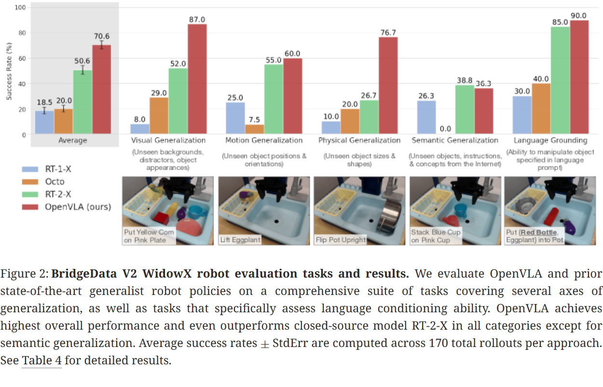
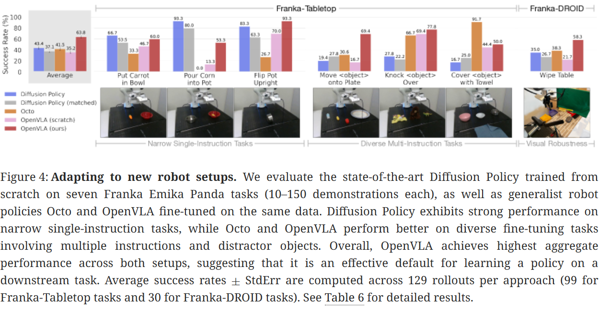

# OpenVLA 论文导读：用开源 7B VLM 直接驱动机器人，超越闭源 55B 方案

> **论文标题**：OpenVLA: An Open-Source Vision-Language-Action Model
> **会议/期刊**：arXiv 2024（CoRL 2024 投稿，机器人学习顶级会议）
> **作者**：Moo Jin Kim, Karl Pertsch, Siddharth Karamcheti, Ted Xiao, Ashwin Balakrishna, Suraj Nair, Rafael Rafailov, Ethan Foster, Grace Lam, Pannag Sanketi, Quan Vuong, Thomas Kollar, Benjamin Burchfiel, Russ Tedrake, Dorsa Sadigh, Sergey Levine, Percy Liang, Chelsea Finn
> **机构**：Stanford University / UC Berkeley / Toyota Research Institute / Google DeepMind / Physical Intelligence
> **arXiv**：https://arxiv.org/abs/2406.09246
> **代码**：https://github.com/openvla/openvla（PyTorch 训练管线 + HuggingFace 模型权重）

---

## 读之前先搞清楚

### 这篇论文要解决什么问题？

要让机器人真正走进千家万户，一个核心瓶颈是：**每换一个新任务、新环境、新机器人，就得从零训练一个新策略**。你给机器人买了新的机械臂，想让它学会"把杯子放到托盘上"——传统做法需要你手动采集几百条演示数据，花几天训练，结果换个杯子颜色可能还不行。

2022-2023 年，RT-1、RT-2 等 "通用机器人策略"（Generalist Robot Policy）的出现改变了这一局面——在互联网规模的图文数据 + 多机器人数据上预训练一个大模型，就能"开箱即用"地控制多种机器人。但 RT-2 系列有两个致命问题：

1. **闭源**：模型权重、训练代码、数据配比全部不公开，社区无法复现和改进
2. **不支持高效微调**：RT-2 是个 55B 的巨型模型，官方只提供推理 API，没有给出把它适配到新机器人的低成本方案

> **小白理解**：RT-2 就像一个只租不卖、且只能按固定模式使用的高级工具箱——你没法拆开看看里面怎么做的，也没法给它加个新功能（比如适配你刚买的机械臂）。OpenVLA 则像把整个工具箱的设计图纸、零件清单、装配流程全部开源——不仅公开了 7B 模型权重，还提供了只用一张消费级显卡就能微调的方案。

### 读懂这篇论文需要的前置知识

| 概念 | 简单解释 |
|:---|:---|
| **VLM（视觉语言模型）** | 输入图片+文字，输出文字的模型，如 GPT-4V、LLaVA |
| **VLA（视觉语言动作模型）** | VLM 的扩展：输入图片+指令，输出机器人动作（如末端位姿） |
| **模仿学习（Imitation Learning）** | 从人类遥操作演示中学习策略，而非通过强化学习的试错 |
| **Open X-Embodiment** | 一个汇集 70+ 个机器人数据集的开源联盟，包含 200 万+ 条轨迹 |
| **LoRA（低秩适配）** | 只训练插入的小矩阵，不修改原模型权重，微调成本大幅降低 |
| **量化（Quantization）** | 把模型参数从 16 位浮点压缩到 8 位或 4 位，节省显存 |
| **动作分桶（Action Discretization）** | 把连续动作（如"移动 3.7cm"）离散化为 256 个"词"，让语言模型能预测 |

---

## 一、OpenVLA 的解决思路

一句话概括 OpenVLA 的核心思路：**把最强的开源 VLM 拿来，直接微调成能预测机器人动作的"翻译器"——输入的图片和指令是"源语言"，输出的动作是"目标语言"。**

具体做法分三步：
1. **选一个好 VLM**：用 Prismatic-7B（基于 Llama 2 + SigLIP + DINOv2 融合视觉编码器），这个 VLM 已经学会了从图片中理解语义和空间关系
2. **把动作变成"文字"**：将连续的机器人动作（7 维：x, y, z, roll, pitch, yaw, gripper）每维离散为 256 个 token，让语言模型像预测下一个词一样预测下一个动作
3. **用海量机器人数据微调**：在 970k 条来自 20+ 种机器人的真实操作演示上训练，让模型学会控制多种机器人

> **小白理解**：传统方法为每个新任务从零训练一个小模型（如 Diffusion Policy），就像为每个新菜谱专门定制一口锅。OpenVLA 的做法是：先找一个已经很懂世界的"大厨"（VLM 学会了识别物体、理解空间），然后带他去 20 多个不同的"厨房"（机器人平台）实习，让他学会用不同的"厨具"（机械臂）做菜。学成之后，他只需要看几眼你的厨房和菜谱，就能上手操作了。

---

## 二、整体流程：从图片+指令到机器人动作


*图1：OpenVLA 模型架构。给定一张观测图片和一条语言指令，模型预测 7 维机器人控制动作。架构由三部分组成：(1) 融合视觉编码器——拼接 DINOv2 和 SigLIP 特征，(2) 投影器——将视觉特征映射到语言模型输入空间，(3) LLM 主干——Llama 2 7B 语言模型，直接输出动作 token。*

### 第 1 步：视觉编码——用两个"眼睛"同时看图

OpenVLA 不只用一种视觉编码器，而是融合了两个互补的预训练模型：

- **SigLIP**（Sigmoid Loss for Language-Image Pre-training）：从互联网图文对中学到的**语义特征**——擅长识别"这是杯子"、"这是红色"
- **DINOv2**（自监督 ViT）：从无标注图片中学到的**空间特征**——擅长理解"杯子在桌子左边"、"物体边界在哪"

> 📖 **深入阅读**：SigLIP 和 DINOv2 的原理、训练方式和为什么两者融合比单独更好，详见 [OpenVLA 视觉编码器深度解读](./OpenVLA_vision_backbones.md)。本文档以下部分只保留概要。

> **这一步在图中对应什么**：图1 左侧的 "Visual Encoder" 模块——图片分别经过 SigLIP 和 DINOv2，输出的 patch 特征沿通道维度拼接。

- **输入**：一张 224×224 的 RGB 图片（来自机器人第三视角相机）
- **操作**：

  > **总览**：输入图片 → SigLIP 提取语义特征 + DINOv2 提取空间特征 → 通道拼接 → 得到融合视觉特征
  >
  > ```
  > 输入：224×224 RGB 图片
  >     │
  >     ├──────────────────┐
  >     ▼                  ▼
  > SigLIP (ViT)      DINOv2 (ViT)
  > 语义：这是什么？     空间：它在哪？
  >     │                  │
  >     ▼                  ▼
  > patch embeddings   patch embeddings
  > (n_patches, d_sig)  (n_patches, d_dino)
  >     │                  │
  >     └────────┬─────────┘
  >              ▼
  >      通道拼接 → (n_patches, d_sig + d_dino)
  > ```

  **为什么用两个编码器而不是一个？** 论文做了消融实验：只用 SigLIP 或只用 DINOv2 都不如两者拼接。SigLIP 提供高阶语义（"这是一个易拉罐"），DINOv2 提供细粒度空间信息（"罐子平躺在桌子右前方，姿态是水平的"）。机器人操作恰恰需要两者兼备——知道物体是什么还不够，必须精确知道它的位置和姿态。

  > **小白理解**：SigLIP 像一个人的左脑——识别物体类别和语义属性（"红杯子"、"金属罐"）。DINOv2 像右脑——理解空间关系（"杯子在罐子左边 5cm，倾斜 30°"）。机器人抓取需要左右脑协同：左脑告诉你"目标是最右边的那个红色杯子"，右脑告诉你"它的把手朝右，以 45° 角去够"。

- **输出**：融合视觉特征，$n_{\text{patches}} \times (d_{\text{sig}} + d_{\text{dino}})$

### 第 2 步：投影 + 语言模型——把视觉信息"翻译"给 LLM 理解

视觉编码器输出的特征维度与 Llama 2 的嵌入空间不同。需要一个**投影器**（2 层 MLP）将视觉特征映射到语言模型的输入空间，然后与语言指令的 token 嵌入拼接，一起送入 Llama 2。

- **输入**：融合视觉特征 + 语言指令（如 "put the eggplant into the pot"）
- **操作**：

  > **总览**：视觉特征 → 2 层 MLP 投影 → 与指令 token 拼接 → Llama 2 7B → 输出动作 token
  >
  > ```
  > 视觉特征 ∈ (n_patches, d_vis)
  >     │  2 层 MLP 投影
  >     ▼
  > 投影后 ∈ (n_patches, d_llm)     ← 对齐到 Llama 2 的嵌入维度
  >     │
  >     ├─ 与指令 token 嵌入拼接 ─┐
  >     │                         │
  >     ▼                         ▼
  >  [视觉token | 指令token] ∈ (n_patches + n_inst, d_llm)
  >     │
  >     ▼  32 层 Llama 2 Transformer
  > 输出隐藏状态
  >     │
  >     ▼  LM Head (线性层 + Softmax)
  > 动作 token 序列
  > ```

- **输出**：7 个离散动作 token（对应 x, y, z, roll, pitch, yaw, gripper），每个取值 0~255

### 第 3 步：动作分桶——把连续动作变成语言模型能预测的"文字"

这是整个 pipeline 最关键的技术环节。语言模型只能输出离散 token，而机器人动作是连续的（如"末端沿 x 轴移动 3.7cm"）。如何桥接？

**方案**：把连续动作变成"文字"。用一个具体例子走一遍——假设现在要处理 x 轴的移动量。

**Step 1：找出训练数据中 x 轴动作的"正常范围"**

翻遍 970k 条训练轨迹，记录每条轨迹中机械臂沿 x 轴每次移动的距离。把所有数值从小到大排列：

```
训练数据中 x 轴的所有移动量（从小到大）：
  -12.3  ← 这个可能是传感器异常（数据收集时机械臂撞到限位）
   -4.9  ← 第 1 百分位：只有 1% 的数据比这个更小（正常左移的极限）
   -2.1
   -0.3
    0.0  ← 机械臂不动
    1.7
    4.2
    7.8  ← 第 99 百分位：只有 1% 的数据比这个更大（正常右移的极限）
   28.1  ← 这个可能是数据标注错误（遥操作员手抖了一下）
```

用**第 1 百分位**（-4.9）和**第 99 百分位**（7.8）作为正常范围。两端的极端值（-12.3 和 28.1）直接被丢弃——它们是噪声，不参与分桶。

**Step 2：在正常范围内均匀切 256 格**

把 [-4.9, 7.8] 这个 12.7cm 的区间均分成 256 个小格子：

```
Bin 0:   -4.90 cm（x 轴左移极限）
Bin 1:   -4.85 cm
Bin 2:   -4.80 cm
  ...
Bin 128:  1.45 cm（接近零点）
  ...
Bin 254:  7.75 cm
Bin 255:  7.80 cm（x 轴右移极限）
```

每格宽度 = (7.8 - (-4.9)) / 255 ≈ **0.05 cm = 0.5 mm**。这个精度远超机械臂的重复定位精度（通常 0.1~1 mm），完全够用。

**Step 3：编码——把真实数值翻译成 bin ID**

训练时，每条轨迹中的 x 轴动作值会被转换成 bin ID。比如：
- 某一步机械臂向右移动了 **3.2 cm** → 落在 bin 163 → 模型的学习目标是输出 token `163`
- 某一步机械臂向左移动了 **-1.7 cm** → 落在 bin 64 → 目标 token `64`

推理时反过来——模型输出 token `180`，解码：-4.9 + 180 × 0.05 ≈ **4.1 cm**，机械臂就向右移 4.1 cm。

> **小白理解**：想象你在用对讲机指挥一个只能听懂数字的机器人，而且这个机器人对你说的话只有 256 种理解——"0"到"255"。
>
> 你事先和机器人约定了一套"密码本"：0 号指令 = 向左移 4.9cm，128 号指令 = 移到中间（约 1.45cm），255 号指令 = 向右移 7.8cm。中间的数字按比例换算——比如 180 号就是中间偏右：离最左端 4.9cm 越远，乘上每格的"步长"0.05cm，就得到了 4.1cm 的实际位移。
>
> OpenVLA 做的就是这件事——7 个维度各输出一个 0~255 的数字，按各自的密码本翻译成真实动作。**语言模型预测这 7 个数字，就像预测一句话的 7 个词一样自然。**

#### ❓ 常见疑问：解码时为什么要"乘区间长度"？不能直接拿 bin ID 当动作值吗？

> bin ID 只是一个**无量纲的序号**（0~255），不是物理量。bin 0 意味着"最小动作"，但"最小动作"具体是几厘米，取决于训练数据中这个动作维度的实际物理范围——不同维度、不同机器人的范围完全不一样。
>
> ```
> bin ID（模型输出）          真实动作（发给机器人）
>      │                            │
>      │   解码公式：                 │
>      │   real = min + bin × ─────  │
>      │                       255   │
>      │              ↑              │
>      │        这个 range 就是       │
>      │       "×20"（或 ×12.7）的来历 │
> ```
>
> 举个例子：x 轴范围 12.7cm（-4.9~7.8），bin 步长 = 12.7/255 ≈ 0.05cm。gripper（夹爪）范围 1.0（0=全开, 1=全闭），bin 步长 = 1.0/255 ≈ 0.004。**两个维度用同样的 bin 0~255，但解码时乘以各自的区间长度，才得到各自的真实物理量。** 如果不乘区间长度，bin 128 在 x 轴上是 1.45cm，在 gripper 上也变成 1.45——夹爪直接飞到不可能的位置。
>
> **这个乘法本质上是"单位换算"：把模型的 0~255 语言，翻译成机器人听得懂的厘米、弧度、开度。**

> **用百分位而非最大最小值，是整个方案最聪明的细节。** 如果直接用最大值 28.1：每格宽度变成 (28.1-(-12.3))/255 ≈ 0.16 cm，精度直接降了 3 倍。而且那两端的格子（对应 -12 和 +28 的区域）在推理时几乎永远不会被用到——白白浪费了宝贵的 bin 分辨率。**丢掉 2% 的噪声数据，换来 3 倍的精度提升——这就是数据预处理的价值。**

#### ❓ 深入理解：为什么覆盖 Llama 词表最不常用的 256 个 token？

Llama 2 的词表有 32000 个 token，但只预留了 100 个"特殊 token"位。动作分桶需要 7 维 × 256 bin = 1792 个 token（但实际上每维重复使用同样的 256 个"动作 token"，所以只需 256 个）。

论文的做法简单粗暴但有效：**直接覆盖 Llama 词表中使用频率最低的 256 个 token**（词表末尾的 256 个）。这些 token 在自然语言中几乎不会出现（如罕见 Unicode 字符），覆盖它们对语言能力的影响微乎其微。这个做法继承自 RT-2。

```
Llama 2 词表 (32000 个 token):
[0 ... 31743]: 正常 token，保持不变
[31744 ... 31999]: 最不常用的 256 个 token → 被替换为动作 token
  action_bin_0, action_bin_1, ..., action_bin_255
```

#### 🔢 具体数字例子：一次完整的动作预测

**条件设定**：WidowX 机械臂，任务 "put the eggplant into the pot"。当前状态：机械臂末端在 (0.12, 0.08, 0.15)，茄子在前方 0.3m 处。

**Step 1：视觉编码**

图片 → SigLIP 输出 256 个 patch 特征（每 patch 1024 维），DINOv2 输出 256 个 patch 特征（每 patch 768 维）
→ 拼接 → 256 × 1792 维

**Step 2：投影 + LLM 前向**

```
投影后: 256 × 4096 维（对齐 Llama 2）
指令 "put the eggplant into the pot" → 7 个 token → 7 × 4096 维
拼接 → (256+7) × 4096 维 → 32 层 Transformer → 最后位置隐藏状态
→ LM Head 输出 32000 维 logits
```

**Step 3：取动作 token 的 logits 并解码**

```
x 维: logits[action_bin_*] → argmax → bin_187
  解码: bin_187 对应 x = -5.0 + 187/255 * 20.0 = 9.69cm（向前移动）
y 维: bin_92 → y = -10.0 + 92/255 * 20.0 = -2.78cm（略微左移）
z 维: bin_201 → z = 0.0 + 201/255 * 15.0 = 11.82cm（向下接近物体）
...
gripper: bin_52 → gripper = 0.204（张开接近物体）
```

> **关键理解**：上面的例子为了简洁，把 7 个 bin ID 并列展示。但模型实际并非"一次性同时输出 7 个 token"——而是**逐 token 自回归生成**。下面详细解释这个机制。

---

### 第 4 步：自回归生成——7 个动作 token 逐个"解码"

这是 OpenVLA 动作生成中最容易被误解的环节。上面的数字例子看起来像"模型一次前向输出 7 个 bin ID"，但实际机制是**自回归（autoregressive）**——模型一次只输出一个 token，然后把它拼回输入，再输出下一个。

**为什么是 7 个 token，不是 1 个？**

OpenVLA 把 7 维连续动作（x, y, z, roll, pitch, yaw, gripper）每一维**独立离散化为 0~255 的 bin ID**，所以一个完整动作 = 7 个整数。每个整数对应 Llama 词表中的一个"动作 token"（action_bin_0 ~ action_bin_255，共 256 个专用 token）。**7 维 × 每维 1 个 token = 7 个 action token。** 不是"一个 token 包含 7 个值"，也不是"7×256 个 token"。

**自回归生成流程（一次完整的动作预测）**：

```
输入序列：
  [视觉token_1, ..., 视觉token_256, 指令token_1, ..., 指令token_n]
                                                           │
                                                           ▼
┌─────────────────────────────────────────────────────────────────┐
│ Forward Pass #1：预测第 1 维动作（x 轴位移）                      │
│                                                                 │
│ Llama 2 前向 → 最后位置 hidden state → LM Head → 32000维 logits │
│                                                                 │
│ 只取 action_bin_0 ~ action_bin_255 这 256 个位置的 logits       │
│   → softmax → 概率分布 P(bin | 图像, 指令)                       │
│   → argmax → bin_187（概率最高）                                 │
│   → 解码：x = -5.0 + (187/255) × 20.0 = 9.69 cm                 │
│                                                                 │
│ 输出 token：<action_bin_187>                                    │
└─────────────────────────┬───────────────────────────────────────┘
                          │ 把 <action_bin_187> 拼回输入序列末尾
                          ▼
输入序列变为：
  [视觉token..., 指令token..., <action_bin_187>]
                                                │
                                                ▼
┌─────────────────────────────────────────────────────────────────┐
│ Forward Pass #2：预测第 2 维动作（y 轴位移）                      │
│                                                                 │
│ Llama 2 前向 → 最后位置 hidden state → LM Head → 32000维 logits │
│                                                                 │
│ ★ 这一次的 hidden state 已经"看过"了 bin_187（x=向前移了9.69cm）│
│    → 模型知道"已经向前伸了"，y 的预测会受此影响                   │
│                                                                 │
│ 取 action_bin 的 logits → softmax → argmax → bin_92             │
│   → 解码：y = -10.0 + (92/255) × 20.0 = -2.78 cm                │
│                                                                 │
│ 输出 token：<action_bin_92>                                     │
└─────────────────────────┬───────────────────────────────────────┘
                          │ 拼回 <action_bin_92>
                          ▼
┌─────────────────────────────────────────────────────────────────┐
│ Forward Pass #3 ~ #7：依次预测 z, roll, pitch, yaw, gripper     │
│                                                                 │
│ 每次前向的输入都比上一次多一个 action token                       │
│ 第 k 次前向时，模型已经"知道"了前 k-1 维的预测值                  │
│   → 后续维度的预测会**条件于**前面已生成的维度                    │
│                                                                 │
│ Forward #3: [视觉, 指令, bin_187, bin_92] → bin_201 (z)         │
│ Forward #4: [..., bin_201] → bin_45 (roll)                      │
│ Forward #5: [..., bin_45] → bin_133 (pitch)                     │
│ Forward #6: [..., bin_133] → bin_210 (yaw)                      │
│ Forward #7: [..., bin_210] → bin_52 (gripper)                   │
└─────────────────────────────────────────────────────────────────┘

最终输出：7 个 token → 解码 → (9.69cm, -2.78cm, 11.82cm, ..., 0.204)
```

**为什么用自回归而不是并行输出？**

7 个动作维度之间存在**相关性**——例如 x 轴位移和 y 轴位移通常协调一致（"向右前方移动"而非"向右同时向后"），gripper 的闭合动作通常在 z 轴下降之后。自回归让后续维度"看到"前面已生成的维度，从而产生协调一致的动作。如果 7 维独立并行预测，可能出现"x 向前伸、y 向后缩"这种物理上矛盾的动作。

> **小白理解**：自回归生成就像写一句话——不是一次性把 7 个字全写出来，而是一个字一个字地写。写第 2 个字时你已经在看第 1 个字写了什么，所以整句话是通顺的。OpenVLA 生成动作也一样：先决定"往前伸多少"，再根据这个决定"往左偏多少"，再决定"爪子张多大"——**每一步都看着前面几步的决定来调整，保证最终 7 维动作协调一致。** 如果 7 维同时独立输出，就像让 7 个人各自写一个字拼成一句话——结果大概率不通顺。

**推理代价**：7 次前向传播（每次 ~100ms/7 ≈ 14ms，因为输入序列只增加了 1 个 token），总计 ~100ms 生成一个完整动作。这是 OpenVLA 推理较慢的根本原因——**7 次串行前向，无法并行**。

#### ❓ 常见疑问：256 个 action token 是每维独享还是共享？

> **共享的。** 所有 7 个维度使用同一组 256 个 action token（action_bin_0 ~ action_bin_255）。区分不同维度的不是 token 本身，而是：
> 1. **解码时乘以各自的区间长度**（x 轴 ×20cm，y 轴 ×20cm，gripper ×1.0）
> 2. **自回归顺序中的位置**——第 1 个 token 永远是 x，第 7 个永远是 gripper
>
> 这种设计非常经济：只需要在词表中新增 256 个 token，就能覆盖所有 7 个维度的动作空间。如果每维独享 256 个 token，需要 7×256=1792 个，远超 Llama 词表的预留空间。

#### ❓ 常见疑问：为什么不直接预测连续动作？离散化有精度损失吗？

> 连续预测（回归）和离散预测（分类）在机器人学习中是一个长期争论。离散化的优势在于：
> - **训练稳定**：分类 loss（交叉熵）比回归 loss（MSE）对异常值不敏感，梯度更稳定
> - **多模态输出**：如果 gripper 在某个状态下既可以"张开"也可以"闭合"（取决于策略偏好），离散 bin 可以自然地给两个 bin 都分配较高的概率
> - **精度足够**：256 个 bin，5cm 范围内精度约 0.02cm——远高于机械臂的重复定位精度（通常 0.1~1mm）
>
> 代价是：离散化引入了微小的量化误差（最多半个 bin 宽度），加上自回归的 7 次串行前向导致推理较慢（~100ms）。但对于 5Hz 的低频控制，这个误差和延迟在下一帧就会被修正。

---

## 三、核心创新点

### 创新点 1：首个开源通用 VLA，性能反超闭源 RT-2-X

在 OpenVLA 之前，通用 VLA（如 RT-2、RT-2-X、Octo）要么闭源、要么规模太小。OpenVLA 是第一个将 VLA 的**训练管线、模型权重、微调工具、推理代码**全部开源的 7B 级通用机器人策略——且性能超越了 55B 的闭源 RT-2-X。

| 模型 | 参数量 | 开源 | 平均成功率 (Bridge V2) | 平均成功率 (Google Robot) |
|:---|:---:|:---:|:---:|:---:|
| RT-1-X | 35M | ✅ | 18.5% | 33.3% |
| Octo | 93M | ✅ | 20.0% | 26.7% |
| **RT-2-X** | **55B** | ❌ | **50.6%** | **78.3%** |
| **OpenVLA** | **7B** | ✅ | **70.6%** | **85.0%** |

> **小白理解**：OpenVLA 仅用 7B 参数（RT-2-X 的 1/8），成功率却高出 16.5%（Bridge）和 6.7%（Google Robot）。这不是因为 RT-2-X 做得不好，而是 OpenVLA 的**数据更多样化**（970k vs 350k 轨迹）、**视觉编码更强**（双编码器融合）、**数据预处理更细致**（如过滤 Bridge 数据集中的全零动作）。**小模型 + 好数据 > 大模型 + 差数据，这个规律在机器人领域同样成立。**

### 创新点 2：系统化探索 VLA 高效微调——LoRA + 量化

以前没人研究过怎么高效地微调 VLA 以适应新机器人。OpenVLA 首次系统对比了多种策略，核心结论是两条：**LoRA 用 1.4% 参数匹配全参数微调；4-bit 量化用 7GB 显存匹配 bfloat16。**

#### 2.1 LoRA 微调：只训练 1.4% 的参数

**LoRA 在做什么？** LoRA（Low-Rank Adaptation, Hu et al. 2021）的核心思想很简单：不给原模型的 7B 参数做梯度更新，而是在每一层旁边"挂"两个小矩阵 $A$ 和 $B$，只训练它们。

```
原始层:  y = W·x          (W ∈ 4096×4096, 16.8M 参数，全部冻结)

LoRA 层: y = W·x + (α/r)·B·A·x
                ↑              ↑
           原权重冻结     只训练这两个小矩阵
                         B ∈ 4096×r, A ∈ r×4096
                         r=32 时：2×4096×32 ≈ 262K 参数
```

$A$ 把 4096 维的输入压缩到一个 $r=32$ 维的"瓶颈"（降维），$B$ 再把这个低维表示投影回 4096 维（升维）。**$A$ 和 $B$ 一起构成一个低秩增量**——原权重 $W$ 负责"已有知识"，$A B$ 负责"新任务特化"。

> **小白理解**：LoRA 就像一个翻译在旁边小声补充。原模型（Llama 2 7B）已经是一个"世界通才"了——它懂物体、空间、语言。你不需要重新教它一切，只需要在每个决策点旁边安一个小"提示员"。提示员不像翻译官那样掌握全部知识（只有几十万个参数），但他非常了解你当前这个具体任务（"在这个 Franka 机械臂上怎么抓茄子"）。原模型输出 + 提示员补充 = 最终输出。**不修改原模型的 99%，只加 1% 的"小贴士"，效果却几乎一样。**

**LoRA 具体"挂"在哪？** OpenVLA 把 LoRA 挂在 Llama 2 的所有线性层上——包括：Self-Attention 的 $W_Q, W_K, W_V, W_O$，FFN 的 $W_1, W_2, W_3$，以及 LM Head。总共插入约 97.6M 可训练参数（仅为全参数 7.19B 的 1.4%）。

#### 🔢 具体数字例子：LoRA 权重更新的一次前向计算

**条件**：Llama 2 第 5 层的某个 FFN 线性层，$W \in \mathbb{R}^{4096 \times 4096}$。输入向量 $\mathbf{x} \in \mathbb{R}^{4096}$（来自上一层的隐藏状态）。

**不用 LoRA（全参数微调）**：
```
y = W_new · x     ← W_new 全部 16.8M 个值都需要存储梯度 + 更新
显存：16.8M × (4 字节 param + 4 字节 grad + 8 字节 optimizer states) ≈ 269 MB/层
32 层总计 ≈ 8.6 GB（仅 optimizer states）
```

**用 LoRA（rank=32）**：
```
y = W_frozen · x + (α/r) · B · A · x
    └─ 冻结，不看梯度          └─ B (4096×32) + A (32×4096) = 262K 参数  ┘

A @ x: (32×4096) @ (4096,) → (32,)         ← 先降维到 32
B @ (A@x): (4096×32) @ (32,) → (4096,)      ← 再升回 4096
                                                      ↓
                                                + W_frozen·x → 最终输出
显存增量：262K × 16 字节 ≈ 4.2 MB/层
32 层总计 ≈ 135 MB（比全参数微调少 98%+）
```

> **关键理解**：rank $r=32$ 不是随便选的。论文测试了 $r=32$ 和 $r=64$，成功率完全一样（都是 68.2%）——说明 $r=32$ 已经足够表达"新任务的增量信息"。**$r$ 翻倍意味着参数量翻倍但收益为零，rank 32 是这个任务的经验最优值。**

#### ❓ 常见疑问：LoRA 为什么不会"遗忘"原模型的知识？

> 因为原权重 $W$ 完全冻结——梯度不经过它，参数不更新。LoRA 加的 $B A$ 只是一个**增量修正**：如果新任务和预训练知识一致，$A$ 和 $B$ 自然会学到接近零矩阵（$BA \approx 0$），此时模型退化为原 VLM，不做任何修正。
>
> 相比之下，全参数微调会修改 $W$ 的每一个值——微调数据量少（几十条轨迹）但改动了全部 7B 参数，很容易"过拟合到这几条轨迹"并丢失预训练的泛化能力。**LoRA 的"少改"反而是一种隐式的正则化——只允许模型在低维子空间内调整，天然防止了灾难性遗忘。**

#### 2.2 量化推理：4-bit 为什么不掉点？

OpenVLA 的 bfloat16 推理需要 15GB 显存——只有 A5000/4090 这个级别的卡能跑。论文测试了 8-bit 和 4-bit 量化（把权重从 16 位浮点压缩到 8 位/4 位整数），结果：

| 精度 | 成功率 (Bridge V2) | 显存 | 推理速度 (A5000) |
|:---|:---:|:---:|:---:|
| bfloat16 | 71.3% | 16.8 GB | 5 Hz |
| int8 | 58.1% | 10.2 GB | 1.2 Hz ⚠️ |
| **int4** | **71.9%** | **7.0 GB** | **3 Hz** |

**为什么 8-bit 反而掉点严重？** 不是精度问题，是**速度问题**。8-bit 量化在 A5000 上引入了额外的量化/反量化操作开销，推理速度从 5Hz 掉到 1.2Hz——控制频率大幅偏离训练时的 5Hz，导致系统动力学不匹配，机械臂动作"跟不上"。

**为什么 4-bit 不掉点？** 4-bit 虽然精度更低，但内存带宽节省 > 量化操作开销，推理速度恢复到 3Hz。而且对于 7B 的 VLA 来说，动作预测是一个"粗粒度"任务——不像语言生成那样需要精确到每个 token 的细微语义差异。**7GB 显存意味着 RTX 3070（8GB）就能跑，把 VLA 推理的门槛从"专业级 GPU"降到了"游戏卡"。**

---

### 创新点 3：双视觉编码器融合——语义 + 空间双通道

OpenVLA 是首个在 VLA 中采用 SigLIP + DINOv2 融合视觉编码的方案。消融实验证明：仅用 SigLIP 或 DINOv2 都不如融合，两者互补：
- SigLIP 擅长大类识别和语言对齐（"这个苹果 vs 那个橙子"）
- DINOv2 擅长细粒度空间定位（"苹果在桌子上，朝左倾斜"）

> **小白理解**：单用 SigLIP，模型知道场景里有个茄子，但不知道茄子的精确位置——抓取时机械臂可能偏 3cm。单用 DINOv2，模型知道哪里有个椭球形物体，但不知道那是茄子还是紫包菜——语言指令"把茄子放进锅里"可能被错误执行。**两者融合后，模型既知道"那是茄子"又知道"它在右下角离末端 25cm 处"，这才叫真正理解了场景。**

---

## 四、实现细节：关键设计决策与训练基础设施

> **这一步在论文中对应 §3.4 ~ §3.5**——论文花了大量篇幅讨论"为什么要这样设计"，这些决策背后都有小规模消融实验支撑。理解这些细节才能理解 OpenVLA 为什么能成功。

### 决策 1：VLM Backbone 选型——为什么是 Prismatic 而不是 LLaVA？

论文在 BridgeData V2 的小规模实验上对比了三个 VLM backbone：

| Backbone | 单物体任务 | 多物体 + 语言对齐任务 | 结论 |
|:---|:---:|:---:|:---|
| IDEFICS-1 | ✓ | ✗（比 LLaVA 低 35%） | 语言对齐差 |
| LLaVA | ✓ | ✓ | 基线 |
| **Prismatic-7B** | **最佳** | **比 LLaVA 高 10%** | ✅ 选择 |

Prismatic 赢在两个地方：
1. **DINOv2 带来的空间理解**：多物体场景中，模型必须根据指令操作**正确的那个物体**——Prismatic 的 DINOv2 特征天然擅长区分"左边那个茄子"和"右边那个杯子"
2. **模块化代码**：Prismatic 的代码库设计干净，直接集成到 VLA 训练 pipeline 中成本最低

> **小白理解**：选 backbone 就像选发动机——不是马力最大就最好，而是看和你的车架（训练 pipeline）的匹配度。Prismatic 不一定是最强的 VLM，但它的 SigLIP+DINOv2 架构天然适合机器人操作（需要空间精度），而且代码好改。**选型不是"谁最先进"，而是"谁最适合当前任务 + 工程成本最低"。**

### 决策 2：图像分辨率——224px vs 384px

| 分辨率 | 训练时间 | 成功率 | 结论 |
|:---|:---:|:---:|:---|
| 224×224 | 1× | 无差别 | ✅ 选择 |
| 384×384 | 3× | 无差别 | 不划算 |

这在 VLM 领域是个**反直觉**的结论——大多数 VLM 的高分辨率版本都有显著提升（如 LLaVA-1.5 的 336px vs 224px）。但机器人操作中物体通常占画面很大比例（机械臂工作台上物体离相机不到 1m），不需要高分辨率来"看清远处的小物体"。

> **小白理解**：你用手机拍桌上的杯子，224px 和 384px 差别不大——杯子已经占了半张图。但拍远处的车牌，224px 可能看不清数字，384px 才有用。**机器人操作场景的特点是"近距大目标"，高分辨率的收益被稀释了，但训练成本翻了 3 倍。**

### 决策 3：冻结 vs 微调视觉编码器

这是论文最反直觉的发现之一。在 VLM 训练中，冻结视觉编码器通常是更好的做法（保留互联网预训练特征不被"污染"）。但 OpenVLA 发现：

| 策略 | 成功率 | 原因 |
|:---|:---:|:---|
| 冻结视觉编码器（VLM 常用） | ❌ 47.0% | 互联网特征不够细粒度 |
| **微调视觉编码器** | **✓ 69.7%** | 需要适配具体场景 |

**假设的解释**：互联网图片的视觉特征偏向"宏观语义"（这是一个杯子），但机器人操作需要"微观空间"（这个杯子的把手朝向 37°，离桌面 2.3cm）。SigLIP 和 DINOv2 的预训练特征虽然强，但不足以捕捉特定桌面纹理、特定光照条件下物体的微米级位置差异。微调让视觉编码器适应了目标场景的视觉细节。

### 决策 4：训练 Epoch——为什么是 27 遍而不是 1~2 遍？

典型的 VLM/LLM 训练只跑 1~2 个 epoch（数据量太大，多跑容易过拟合）。但 OpenVLA 跑了 **27 个 epoch**，原因是：

> 机器人数据的多样性远低于互联网数据——970k 条轨迹中，很多动作模式是重复的（"抓取-移动-放置"）。模型需要反复看这些数据，直到**动作 token 准确率超过 95%**，真实机器人上的成功率才停止增长。

```
训练 epoch 与成功率的关系（近似）：
Epoch  1: 动作准确率 ~70%，机器人成功率 ~20%（动作不精确）
Epoch  5: 动作准确率 ~85%，机器人成功率 ~45%
Epoch 15: 动作准确率 ~92%，机器人成功率 ~60%
Epoch 27: 动作准确率 ~96%，机器人成功率 ~70%（收敛）
```

### 决策 5：学习率——为什么不需要 Warmup？

OpenVLA 使用固定学习率 2e-5，**不用 Warmup**。这和原版 Transformer 论文的做法相反（Transformer 必须有 Warmup 否则训练发散）。

原因：Prismatic VLM 的权重已经在图文数据上做了充分的预训练，初始权重不是随机的——Loss 从一个较低的起点开始，梯度方向从一开始就比较稳定，不需要小步预热。

### 训练基础设施

| 参数 | 值 | 备注 |
|:---|:---:|:---|
| GPU | 64× A100 (80GB) | 多节点集群 |
| 训练时间 | 14 天 | 总计 21,500 A100-小时 |
| Batch size | 2048 | 充分利用 64 卡 |
| 并行策略 | FSDP（全分片数据并行） | PyTorch 原生支持 |
| 注意力加速 | FlashAttention-2 | 标准的 Transformer 加速 |
| 混合精度 | bfloat16 AMP | 节省显存，数值稳定 |

---

## 五、实验结果

### 4.1 开箱即用：多机器人零样本控制

**BridgeData V2 WidowX**（17 个任务，170 次 rollout）：



*图2：BridgeData V2 WidowX 机器人评估。覆盖视觉/运动/物理/语义泛化和语言对齐等多维度任务。OpenVLA 在所有类别中取得最高总体表现，仅在语义泛化上略逊于 RT-2-X。*

| 泛化类型 | RT-1-X | Octo | RT-2-X (55B) | **OpenVLA (7B)** |
|:---|:---:|:---:|:---:|:---:|
| 视觉泛化（新背景/物体） | 8% | 29% | 53% | **87%** |
| 运动泛化（新位置/朝向） | 25% | 8% | 55% | **60%** |
| 物理泛化（新尺寸/形状） | 10% | 20% | 27% | **77%** |
| 语义泛化（新物体/指令） | 26% | 0% | 39% | **36%** |
| 语言对齐（多物体+指令） | 30% | 40% | 85% | **90%** |
| **总平均** | **18.5%** | **20.0%** | **50.6%** | **70.6%** |

> **小白理解**：最惊人的是 OpenVLA 在视觉泛化和物理泛化上远超 RT-2-X（87% vs 53%，77% vs 27%）。RT-2-X 在不熟悉的物体形状和大小上表现很差——比如拿 AAA 电池时经常对不准。OpenVLA 借助 DINOv2 的细粒度空间特征，即使物体尺寸变了，也能精确调整抓取姿态。

唯一落后的是语义泛化（36% vs 39%），因为 RT-2-X 在互联网图文数据上做了更大规模的联合训练，保留了更多"世界知识"（如知道 Taylor Swift 长什么样）。

### 4.2 微调适应：在新机械臂上快速学会新任务



*图4：在 7 个 Franka Emika Panda 任务上比较 Diffusion Policy（从零训练）与 OpenVLA/Octo（微调）。Diffusion Policy 在窄单指令任务上表现出色，而 OpenVLA 在涉及多指令和干扰物体的多样化微调任务中表现更优。*

在 Franka Emika Panda 机械臂上（7 个任务，129 次 rollout）：

| 方法 | 窄任务成功率（单指令） | 宽任务成功率（多指令） | 总平均 |
|:---|:---:|:---:|:---:|
| Diffusion Policy (from scratch) | **73.3%** | 19.9% | 48.5% |
| **OpenVLA (fine-tuned)** | 67.8% | **64.6%** | **67.2%** |
| Octo (fine-tuned) | 16.7% | 58.2% | 43.4% |

> **小白理解**：Diffusion Policy 在窄任务上略胜（73.3% vs 67.8%），因为这些任务只需要"把胡萝卜放进碗里"，场景简单、物体固定。但在多指令任务中（"把 A 放到盘子上 / 把 B 打翻 / 用毛巾盖住 C"），OpenVLA 的巨大预训练优势就体现出来了——64.6% vs 19.9%。**OpenVLA 是唯一在所有 7 个任务上成功率都超过 50% 的方法**，意味着它可以作为一个通用的"默认方案"，不用担心某个任务完全失败。

### 4.3 消融实验：哪些设计是真正关键的？

| 消融项 | 成功率变化 | 结论 |
|:---|:---:|:---|
| 去掉 OpenX 预训练（直接微调 Prismatic VLM） | -23.8% | 大规模机器人预训练至关重要 |
| 仅用 SigLIP 视觉编码器 | 语言对齐任务下降 | 缺少 DINOv2 影响空间精度 |
| 图像分辨率从 384→224 | 无变化 | 224px 足够，更高分辨率反而增加 3× 训练时间 |
| 冻结视觉编码器（微调时不更新） | -22.7% | 视觉特征需要适配特定机器人和场景 |
| LoRA rank=32 vs rank=64 | 无变化 | rank=32 足够，推荐使用 |

> **最关键发现**：微调时冻结视觉编码器是最大的性能杀手（-22.7%）。虽然 VLM 训练时冻结视觉编码器通常有益，但 VLA 需要视觉特征去适配新场景的细粒度细节（如特定桌面的纹理、机器人的外观），所以微调时必须同步更新视觉编码器。

---

## 六、在整个领域的位置

```
          模仿学习 + 预训练视觉表征 (2020-2022)
            R3M, VIP, Voltron ...
                         │
           ┌─────────────┼─────────────┐
           │             │             │
    RT-1 (2022)    RT-2 (2023)    Octo (2023)
    Transformer    VLA (PaLI)     开源通用策略
    从零训练       闭源 55B        93M 参数
           │             │             │
           └─────────────┼─────────────┘
                         │
              Open X-Embodiment (2023)
              统一 70+ 数据集格式
                         │
           ┌─────────────┼─────────────┐
           │             │             │
      RT-1-X (2023)  RT-2-X (2024)  OpenVLA (2024)
      多机器人策略   闭源 55B VLA   开源 7B VLA ← 本文
                         │             │
                         ▼             ▼
                  闭源生态终结      开源 VLA 生态起步
                                      │
                              ┌───────┼───────┐
                              │       │       │
                          LoRA微调  量化部署  社区扩展
                         (1张4090) (7GB显存) (新机器人)
```

> **小白理解**：OpenVLA 在机器人领域的角色，类似于 LLaMA 在 NLP 领域的角色——它本身是一个高性能模型，但更重要的是它开启了"开源通用机器人策略"的大门。任何人都可以下载 OpenVLA，在自己的机械臂上花几小时微调，得到一个能理解自然语言指令的操作策略。**从 RT-2 的"只租不卖"到 OpenVLA 的"完全开源"，这是机器人基础模型走向民主化的关键一步。**

---

## 七、局限性

| 局限性 | 描述 | 可能改进 |
|:---|:---|:---|
| **仅支持单帧图片输入** | 无法利用历史观测和 proprioceptive 信号，难以处理需要时序记忆的任务 | 扩展为多帧输入 + 观测历史，或使用视频 VLM 作为 backbone |
| **推理频率低** | bfloat16 下约 6Hz（RTX 4090），无法满足高频控制（如 ALOHA 的 50Hz） | 推测解码（speculative decoding）、action chunking、TensorRT-LLM 优化 |
| **语义泛化弱于 RT-2-X** | 纯机器人数据微调导致互联网知识遗忘，"Taylor Swift" 这类概念无法识别 | 联合训练（机器人数据 + 互联网图文数据），类似 RT-2 的 co-fine-tuning |
| **成功率仍低于 90%** | 在多数任务上远未达到部署所需的可靠性 | 更大规模预训练、更好的数据配比、集成 safety layer |
| **不支持多模态输入** | 无法利用深度图、力传感器等多模态信号 | 扩展 VLM backbone 支持更多模态 |
| **LLaMA 许可证限制** | Llama 2 的商用许可有限制 | 迁移到 Llama 3 / Mistral / Gemma 等更开放的主干 |

> **小白理解**：OpenVLA 最大的硬伤是单帧输入——它只能"看一张照片然后行动"，无法记住上一秒做了什么。这就像一个只能凭当前一帧画面打游戏的玩家——没法判断球是朝自己飞来还是飞走。加上观测历史和多帧输入，是下一代 VLA 最期待的特性。

---

## 八、一句话总结

> **OpenVLA 证明了：把最强开源 VLM 直接微调为"动作翻译器"，在 970k 条多机器人数据上训练，就能得到一个 7B 参数、完全开源的通用机器人策略——它开箱即用超越 55B 的闭源 RT-2-X，且用 LoRA 微调 1.4% 参数就能在一张消费级显卡上适配新机器人。**

---

## 九、核心公式速查

### VLA 动作预测（下一个 token 预测）

$$\mathcal{L} = -\sum_{t=1}^{T} \sum_{d=1}^{7} \log p(a_t^d \mid I, \ell, a_{<t}^{<d})$$

其中 $I$ 为观测图像，$\ell$ 为语言指令，$a_t^d$ 为第 $t$ 步的第 $d$ 维动作 token。

### 动作离散化

$$a_{\text{bin}}^d = \left\lfloor 256 \cdot \frac{a_{\text{cont}}^d - q_1^d}{q_{99}^d - q_1^d} \right\rfloor$$

其中 $q_1^d$ 和 $q_{99}^d$ 分别是训练数据中第 $d$ 维动作的第 1 和第 99 百分位数。

### LoRA 参数化

$$W_{\text{updated}} = W_{\text{frozen}} + \frac{\alpha}{r} \cdot BA$$

其中 $B \in \mathbb{R}^{d_{\text{in}} \times r}$，$A \in \mathbb{R}^{r \times d_{\text{out}}}$，$r \ll \min(d_{\text{in}}, d_{\text{out}})$。论文使用 $r=32$，$\alpha=64$。

---

## 十、架构参数速查表

| 参数 | 值 | 含义 |
|:---|:---:|:---|
| LLM 主干 | Llama 2 7B | 32 层 Transformer，4096 隐藏维 |
| 视觉编码器 | SigLIP + DINOv2 | 约 600M 参数（冻结过再微调） |
| 输入分辨率 | 224×224 | 更高分辨率在实验中无增益 |
| 动作维度 | 7 | x, y, z, roll, pitch, yaw, gripper |
| 动作分桶 | 256 bin/维 | 用第 1~99 百分位确定区间 |
| 训练数据 | 970k 轨迹 | 来自 Open X-Embodiment 的 20+ 数据集 |
| 训练硬件 | 64× A100 | 14 天，batch size 2048 |
| 训练 epoch | 27 | 远多于典型 LLM/VLM 训练 |
| 学习率 | 2e-5（固定） | 无 warmup，固定学习率 |
| 推理显存 | 15 GB (bf16) / 7 GB (int4) | 消费级 GPU 可用 |
| 推理速度 | ~6 Hz (RTX 4090, bf16) | 适合 5Hz 非阻塞控制 |

---

## 参考资料

- 原论文：[OpenVLA: An Open-Source Vision-Language-Action Model](https://arxiv.org/abs/2406.09246)
- 项目主页：[https://openvla.github.io](https://openvla.github.io/)
- GitHub 代码：[https://github.com/openvla/openvla](https://github.com/openvla/openvla)
- HuggingFace 模型：[https://huggingface.co/openvla](https://huggingface.co/openvla)
- RT-2 论文：[https://arxiv.org/abs/2307.15818](https://arxiv.org/abs/2307.15818)
- Octo 项目：[https://octo-models.github.io](https://octo-models.github.io/)
