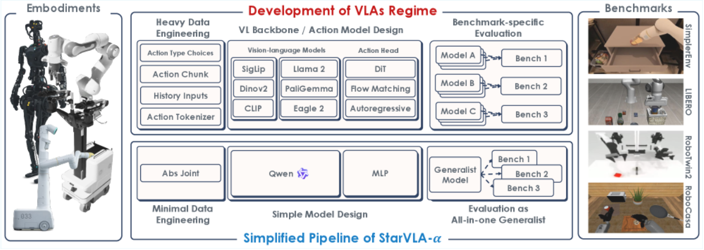
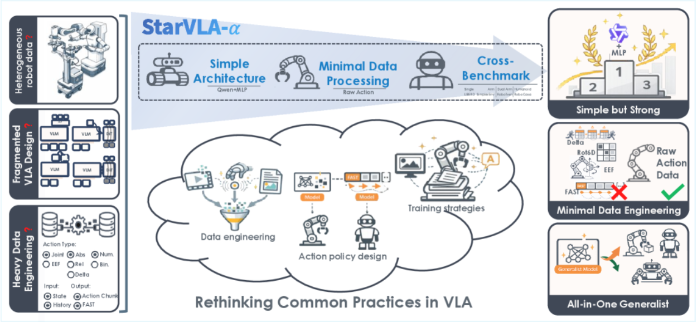
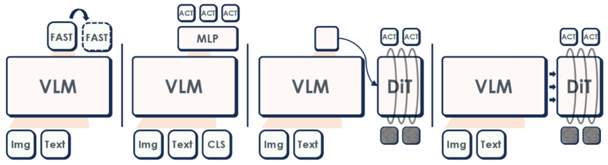

# StarVLA-α 论文导读：用极简设计揭示 VLA 系统的"够用就好"原则

> **论文标题**：StarVLA-α: Reducing Complexity in Vision-Language-Action Systems
> **会议/期刊**：arXiv 2026.04（预印本）
> **作者**：Jinhui Ye, Ning Gao, Senqiao Yang, Jinliang Zheng, Zixuan Wang, Yuxin Chen, Pengguang Chen, Yilun Chen, Shu Liu, Jiaya Jia
> **机构**：HKUST（香港科技大学）/ XJTU（西安交通大学）/ CUHK（香港中文大学）/ THU（清华大学）/ Tongyi Lab, Alibaba Group / SmartMore Ltd.
> **arXiv**：https://arxiv.org/abs/2604.11757
> **代码**：https://github.com/starVLA/starVLA（基于 StarVLA 开源框架）

---

## 读之前先搞清楚

### 这篇论文要解决什么问题？

2022 年以来，VLA（视觉-语言-动作模型，Vision-Language-Action）领域发展极其迅速。从 RT-1、RT-2 到 OpenVLA、π0、GR00T，各路方法在架构设计、训练策略、数据处理上花样百出——有的用扩散模型（逐步去噪生成动作），有的用流匹配（Flow Matching，用微分方程建模从噪声到动作的连续变化），有的用离散 token 预测（把动作切成 256 个"词"让语言模型猜），有的甚至搞双系统架构（一个高层的 VLM 做"大脑"决策，一个低层的运动模块做"小脑"执行）。

但问题来了：**这么多花活，到底哪个是真有用的，哪个只是锦上添花？**

现状是——

1. **各家用各家的骨架（backbone）**：有人用 SigLIP（一种用 Sigmoid 损失训练、擅长图文匹配的视觉模型）+ Llama（Meta 开源的大语言模型），有人用 Qwen-VL（阿里通义千问的多模态模型），有人甚至从头训。换了骨架，性能变了，你没法说清楚是骨架的功劳还是方法的功劳。

2. **各家用各家的数据**：有的在 OXE（Open X-Embodiment，汇集 70+ 机器人数据集的联盟）上预训练，有的用内部采集的百万级私有数据，有的甚至混了人类视频进去。数据不一样，公平比较无从谈起。

3. **各家用各家的技巧**：有人加历史帧（前两帧图片叠在一起输入），有人加本体感知（机械臂关节角度等自身状态信息），有人搞绝对动作、有人搞相对动作、有人搞增量动作。这些"调料"到底有没有用、在什么情况下有用——没人系统研究过。

StarVLA-α 要做的就是这件事：**把所有变量控制住，用同一个 VLM 骨架（Qwen3-VL）、同一套数据预处理、同一个训练协议，去逐个检验每一种流行的 VLA 设计选择到底值不值。** 不是要提出新的花活，而是告诉大家哪些花活其实可以省掉。

> **小白理解**：这就像一个厨艺比赛，10 个厨师各做一道菜——有人用进口牛肉、有人用顶级酱油、有人用了独家秘方、有人换了最好的锅。评委说 A 赢了，但谁都不知道赢在哪——是因为肉好？酱油香？还是锅厉害？
>
> StarVLA-α 的做法是：**固定食材（VLM 骨架）、固定锅具（数据管线）、固定火候（训练协议），然后逐个换佐料（动作头设计 / 预训练数据 / 数据工程技巧），看换不换佐料对最终味道的影响有多大。**
>
> **结论出乎意料：大部分"昂贵的佐料"其实可有可无——只要食材（VLM）足够好，简单炒炒就很好吃。**

### 读懂这篇论文需要的前置知识

| 概念 | 简单解释 |
|:---|:---|
| **VLM（视觉语言模型）** | 输入图片+文字，输出文字的多模态模型，如 GPT-4V、Qwen-VL |
| **VLA（视觉语言动作模型）** | VLM 的扩展：输入图片+指令，输出机器人动作（如末端位姿、关节角度） |
| **动作头（Action Head）** | 接在 VLM 输出端、专门负责把"理解"翻译成"动作"的小网络 |
| **模仿学习（Imitation Learning）** | 从人类遥操作演示数据中学习策略，而非通过强化学习的试错 |
| **扩散模型（Diffusion Model）** | 从纯噪声开始，逐步"去噪"生成目标输出（用于生成连续动作轨迹） |
| **流匹配（Flow Matching）** | 用微分方程建模从噪声到目标分布的连续变化路径，比扩散更灵活 |
| **跨具身泛化（Cross-Embodiment）** | 同一个模型控制不同形态的机器人（单臂/双臂/人形） |

---

## 一、StarVLA-α 的解决思路

一句话概括 StarVLA-α 的核心思路：**用最简单的方式搭一个 VLA 基线，然后系统性地回答三个关键问题——花哨的动作头有没有用？预训练有没有用？数据工程技巧有没有用？**

具体设计极其克制：

1. **骨架选最强的开源 VLM**：用 Qwen3-VL（阿里通义千问 3 代多模态模型），它原生支持图文联合输入，不需要像 OpenVLA 那样手动拼接 SigLIP + DINOv2 + Llama
2. **动作头选最简单的**：一个轻量级 MLP（多层感知机，几层全连接网络），直接从一个特殊 token 的隐藏状态回归出连续动作序列
3. **数据处理选最少的**：只用训练集做零均值单位方差归一化，不加历史帧、不加本体感知、不做 benchmark 专属适配

在这个"极简基线"上，逐一替换动作头（FAST 离散化 / 扩散流匹配 / 双系统 GR00T）、加入预训练数据（OXE / InternData-A1）、加入工程技巧（本体感知 / 历史帧 / 增量动作 / 相对动作），看性能怎么变。

> **小白理解**：传统 VLA 研究像"开药铺"——有人卖十全大补丸（把所有技巧全用上），有人说自己的配方最灵。StarVLA-α 则像"做减法实验"——先开一张只有一味主药的方子，看效果；再一味一味加辅药，看哪味药真有效、哪味药纯属心理安慰。**结果发现：主药（VLM 骨架）够好，大部分辅药（复杂动作头、预训练、数据工程）都是可选的。**



*图2：StarVLA-α 整体架构。统一使用 Qwen3-VL 作为 VLM 骨架，配合轻量 MLP 动作头，不做 benchmark 专属适配，最小化数据预处理。同一套框架跑通 LIBERO、SimplerEnv、RoboTwin 2.0、RoboCasa-GR1 四个 benchmark。*

---

## 二、整体流程：从图片+指令到机器人动作

### 第 1 步：视觉编码——直接用 Qwen3-VL 的"眼睛"看世界

StarVLA-α 不做视觉编码器的"自由组合"——它直接用一个已经训好的 VLM（Qwen3-VL）同时处理图片和文字。Qwen3-VL 内部已经内置了视觉编码器和语言模型的对齐，不需要像 OpenVLA 那样手动选 SigLIP 还是 DINOv2 还是 CLIP（一种用对比学习训练、把图片和文字映射到同一空间的经典模型）。

- **输入**：一张 RGB 图片（来自机器人相机，如第三视角相机或腕部相机）+ 一条语言指令（如 "put the eggplant into the pot"）
- **操作**：图片和文字直接送入 Qwen3-VL，模型内部自动完成视觉特征提取和图文对齐
- **输出**：经过 VLM 内部多层 Transformer（一种基于自注意力机制的神经网络架构，能捕捉序列中任意两个位置的关系）处理后的隐藏状态序列

> **小白理解**：OpenVLA 的做法像自己去菜市场买菜（SigLIP）买肉（DINOv2）再回家自己炒——你得操心买什么、怎么搭配。StarVLA-α 的做法像叫外卖——Qwen3-VL 就是那个已经配好菜、调好味的厨师，你只需要告诉他"今天想吃红烧茄子"，他就能端出一盘色香味俱全的菜。**省掉了选择和组合视觉编码器的麻烦，也避免了搭配不当导致的性能损失。**

### 第 2 步：动作预测——用最简单的 MLP 头"翻译"出动作

VLM 处理完图片和指令后，它的最后一个 hidden state 包含了"理解当前场景和任务"的所有信息。StarVLA-α 的做法极其简单：

- **输入**：VLM 输出的一个特殊 `<action>` token 的隐藏状态（一个高维向量，如 4096 维）
- **操作**：一个轻量级 MLP（几层全连接网络）直接从这个向量回归出连续动作序列（action chunking，一次预测未来多步动作，而不是只预测下一步）

  > **总览**：VLM 隐藏状态 → MLP 降维 → 连续动作向量 → 发给机器人执行
  >
  > ```
  > 输入图片 + 语言指令
  >     │
  >     ▼
  > Qwen3-VL (4B / 8B) —— 统一处理视觉和语言
  >     │
  >     ▼
  > <action> token 的 hidden state (4096维)
  >     │
  >     ▼  MLP: 4096 → 1024 → 512 → action_dim × chunk_size
  > 连续动作序列
  >     │  (如 7维 × 16步 = 112个值，或 32维动作补齐)
  >     ▼
  > 发给机器人执行
  > ```

- **输出**：连续动作向量——直接是关节角度、末端位姿等物理量，不需要离散化/去离散化

> **小白理解**：这就像同声传译——VLM 是"听懂了"的人，MLP 头是"翻译"。VLM 听完一句话（看懂图片和指令），在脑子里形成了一个"意思"（hidden state），翻译把这个意思直接说出来（回归出动作值）。**不需要先翻译成密码（离散 token）再解密（解码回连续值），一步到位。**

#### ❓ 深入理解：为什么用 MLP 回归而不是更复杂的动作头？

StarVLA-α 对比了四种主流动作头设计（详细对比见第三章），发现**当 VLM 骨架足够强时，简单的 MLP 回归和一众复杂方案（扩散、流匹配、离散 token）性能几乎没有差距**。MLP 回归的优势在于：

- **训练快**：一次前向传播直接出结果，不需要像扩散模型那样迭代几十步
- **推理快**：同上，适合实时机器人控制场景（通常需要 10-50Hz 的控制频率）
- **实现简单**：不涉及离散化分桶、不涉及噪声调度、不涉及双系统协调

---

## 三、三大核心发现：重新审视 VLA 领域的"常识"



*图1：当前 VLA 系统的比较困境——不同方法使用不同的机器人数据集、不同的架构、不同的 benchmark 专属适配，使得公平比较几乎不可能。StarVLA-α 通过统一骨架和数据管线消除了这些混淆因素。*

这是整篇论文最核心的贡献——不是提出新方法，而是**用控制变量实验揭穿三个 VLA 领域的"神话"**。

### 发现一：复杂动作头不是必需的（Section 3.1）

**实验设计**：固定 Qwen3-VL 骨架不变，换四种动作头——

| 动作头 | 原理 | 代表方法 |
|:---|:---|:---|
| **MLP 回归**（StarVLA-α 默认） | 直接从 hidden state 回归连续动作 | OpenVLA-OFT |
| **FAST 离散化** | 把连续动作用 VQ-VAE（向量量化变分自编码器，把连续信号压成离散"码本"）离散化，再用自回归生成 | π0-FAST |
| **扩散/流匹配** | 从噪声逐步去噪生成动作序列 | π0 |
| **双系统 GR00T** | VLM 做 System 2（高层规划），流匹配做 System 1（低层执行） | GR00T-N1 |



*图3：StarVLA-α 框架下四种动作头设计的对比——从左到右分别为 FAST 离散化、MLP 回归（默认）、双系统 GR00T、扩散流匹配 π0 风格。*

**结果**：

| 方法 | LIBERO avg | SimplerEnv WidowX | RoboTwin Clean | RoboCasa-GR1 |
|:---|:---:|:---:|:---:|:---:|
| StarVLA-α（MLP） | **98.8** | 64.6 | 88.2 | **53.8** |
| StarVLA-α-FAST | 97.8 | 35.6 | 72.5 | 45.0 |
| StarVLA-α-GR00T | 98.7 | 65.3 | 88.5 | 52.8 |
| StarVLA-α-π | 98.1 | **65.9** | 88.1 | 48.9 |

> **小白理解**：四种高档做法中，离散动作（FAST）明显最差——把连续动作切成 256 个格子再拼回来，中间损失了精度。但三种连续动作方案（MLP、GR00T 双系统、π0 扩散）之间的差距**微乎其微**——在 LIBERO 上全部超过 98%，差距不到 1 个百分点。**花几十倍的计算量搞扩散模型或双系统，换来的收益几乎为零——这就是这篇论文最大的"暴击"。**

#### 🔢 具体数字例子：MLP vs 扩散模型的计算成本对比

**条件设定**：推理一步动作，VLM 骨架 4B 参数。

| 方案 | 前向传播次数 | 每次耗时 | 总耗时 | 成功率（LIBERO） |
|:---|:---:|:---:|:---:|:---:|
| MLP 回归 | 1 次 | ~50ms | **~50ms** | 98.8% |
| 扩散/流匹配 | 20~50 次 | ~50ms | **1~2.5s** | 98.1% |

> **关键理解**：MLP 回归只需 VLM 前向一次，扩散模型需要反复去噪 20-50 步。在机器人实时控制场景（需要 10-20Hz），扩散模型根本无法满足实时性要求。**而两者最终的成功率几乎一样——这说明在 VLM 骨架足够强的条件下，复杂的动作生成策略纯属画蛇添足。**

### 发现二：大规模动作预训练是把"双刃剑"（Section 3.2）

**实验设计**：在 StarVLA-α 基线（只用 Qwen3-VL 预训练权重，无任何机器人数据预训练）之上，分别加入三种预训练数据——

| 预训练数据 | 数据规模 | 与目标域关系 | RoboTwin Clean | RoboCasa-GR1 |
|:---|:---:|:---|:---:|:---:|
| 无（基线） | 0 | — | **88.2** | **53.8** |
| +OXE | 232.6k 条 | 跨域（多机器人混合） | 83.6 ↓ | 27.8 ↓↓ |
| +InternData-A1 | 630k 条 | 部分重叠（含 RoboTwin 同类具身） | 88.6 ↑ | 35.4 ↓ |
| +RoboTwin-Rand | 25k 条 | 同域（同 benchmark 的随机数据） | **88.8** ↑ | 33.3 ↓ |

> **小白理解**：最震撼的是 OXE 的结果——加了 23 万条跨域预训练数据，RoboTwin 从 88.2 掉到 83.6，RoboCasa 从 53.8 暴跌到 27.8。**这不是预训练没用，而是"不对口的预训练"反而有害。**
>
> 这就像一个在美国开了 10 年车的司机（Qwen3-VL 已见过海量图文数据，有很强的通用理解能力），你让他去日本开右舵车（目标机器人任务）。如果你先让他在欧洲各国乱开几天（OXE 混合多机器人数据），他反而适应了错误的驾驶习惯，到日本后更手忙脚乱。**但如果你直接让他到日本先练几圈（少量目标域数据微调），反而上手最快。**
>
> **结论：好的 VLM 骨架本身就是最强的"预训练"——再加不相关的机器人预训练，可能不是在"打基础"，而是在"添乱"。**

### 发现三：大部分数据工程技巧可有可无（Section 3.3）

**实验设计**：在 StarVLA-α 基线上逐一添加四项常用数据工程技巧——

| 技巧 | 说明 | LIBERO avg | RoboTwin 50×50 | RoboCasa 24×10 |
|:---|:---|:---:|:---:|:---:|
| 基线（无技巧） | 只有 RGB + 指令 | **98.8** | 50.3 | 9.8 |
| +本体感知（Proprioception） | 加上关节角度等机器人状态 | 98.5 | **60.8** ↑ | 12.5 ↑ |
| +历史帧（History frames） | 叠加前两帧图片 | 97.8 | 44.8 ↓ | 10.2 ↑ |
| +增量动作（Delta action） | 预测关节位置的变化量而非绝对值 | 98.1 | 48.7 | **15.8** ↑ |
| +相对动作（Relative action） | 在末端坐标系下预测动作 | 98.7 | 51.1 | 13.6 ↑ |

> **小白理解**：当数据量足够大时（如 RoboTwin 500 条轨迹以上、RoboCasa 1000 条以上），这些技巧的效果全部消失，和基线持平。**它们只在"数据极度匮乏"的低资源场景下有一点微弱帮助。**
>
> 这就像一个经验丰富的厨师（强 VLM）——食材充足时（数据量够），他不需要菜谱（工程技巧）也能做出一桌好菜。**只有冰箱快空了（数据很少），才需要翻菜谱想办法。**

---

## 四、实现细节

### 模型配置

| 配置项 | 设置 | 为什么这样设置 |
|:---|:---|:---|
| VLM 骨架 | Qwen3-VL 4B（主实验）/ 2B / 8B（消融） | 4B 是性价比最优点——2B 容量不足，8B 提升有限 |
| 动作头 | 轻量 MLP：4096→1024→512→action_dim | 论文已验证复杂动作头无额外收益 |
| 动作预测方式 | Action Chunking（一次预测未来多步） | 提高动作连贯性，减少抖动 |
| 跨具身动作补齐 | 统一补齐到 32 维（零填充） | 不同机器人动作维度不同（7→32），零填充最简单有效 |

### 训练配置

| 配置项 | 设置 | 为什么这样设置 |
|:---|:---|:---|
| VLM 学习率 | 1×10⁻⁵ | VLM 已预训练好，只需微调 |
| 动作头学习率 | 1×10⁻⁴ | 动作头随机初始化，需要更大学习率 |
| 学习率调度 | Cosine（余弦退火） | 训练后期逐渐降低学习率，帮助收敛 |
| 最大训练步数 | 100k steps | 涵盖所有 benchmark 的充分收敛 |
| 每 GPU batch size | 16 | 标准配置 |
| 总 batch size (generalist) | 256~1024 | 跨 benchmark 训练需要更大 batch 以保证多样性 |
| 优化器 | AdamW | 大模型训练标配 |

### 数据配置

| 配置项 | 设置 | 为什么这样设置 |
|:---|:---|:---|
| 数据预处理 | 仅零均值单位方差归一化 | 最小化处理，减少信息损失 |
| 输入格式 | 原始 RGB + 原始语言指令 | 不做 benchmark 特定格式化 |
| 历史帧 | 不使用 | 消融实验表明作用可忽略 |
| 本体感知 | 不使用（默认） | 消融实验表明数据充足时无增益 |
| 动作表示 | 绝对动作（默认） | 简单直接，避免坐标系转换误差 |

### 硬件配置

| Benchmark | GPU 配置 | 说明 |
|:---|:---|:---|
| LIBERO | 8× A100 | 数据量较小（~6500 条轨迹） |
| SimplerEnv | 16× A100 | 中等数据规模 |
| RoboTwin-Clean | 16× A100 | 50 任务 × 50 条/任务 |
| RoboTwin +Random | 48× A100 | 含 500 条随机化数据/任务 |
| RoboCasa-GR1 | 16× A100 | 24 任务 × 1000 条/任务 |
| All benchmarks 联合 | 64× A100 | 全 benchmark 联合训练 Generalist 模型 |

---

## 五、实验结果

### 主要结果（Table 1）：极简基线打平甚至超越所有复杂方法

| 方法 | LIBERO avg | SimplerEnv WidowX | SimplerEnv Google VM | RoboTwin Clean | RoboCasa-GR1 |
|:---|:---:|:---:|:---:|:---:|:---:|
| OpenVLA-OFT | 97.6 | 31.3 | 54.3 | — | — |
| π0 | 96.8 | 27.1 | 54.8 | 46.4 | — |
| π0.5 | 98.8 | 46.9 | **72.7** | 60.2 | 37.0 |
| GR00T-N1.6 | 97.5 | 62.0 | 67.7 | — | 47.6 |
| **StarVLA-α (Specialist)** | **98.8** | **64.6** | **76.0** | **88.2** | **53.8** |
| **StarVLA-α (Generalist)** | 97.8 | 65.2 | 74.3 | 88.7 | **57.3** |

> **小白理解**：StarVLA-α 的 Specialist（每个 benchmark 单独训一个模型）在所有 benchmark 上全面领先。最夸张的是 RoboTwin Clean（双臂协调任务）：StarVLA-α 88.2% vs π0.5 的 60.2%——**高出 28 个百分点，几乎翻了一倍半。** 而 StarVLA-α 的设计比 π0.5 简单得多（无扩散、无预训练、无数据工程）。
>
> Generalist（一个模型训所有 benchmark）的表现更令人惊喜：在 RoboCasa-GR1 上达到 57.3%，比 Specialist（53.8%）还高——**说明跨 benchmark 联合训练不仅没拖后腿，反而对困难任务有正向迁移效果。**

### 真机实验（Table 7）：在真实机器人上碾压 π0.5

在 RoboChallenge 真机 benchmark 的 ARX5 机器人上，11 项日常任务：

| 方法 | 平均成功率 (SR) | 平均进度分 (score) |
|:---|:---:|:---:|
| π0.5 | 12.7% | 27.6 |
| π0 | 3.6% | 14.7 |
| **StarVLA-α** | **33.6%** | **54.5** |

> **小白理解**：真机不像仿真，传感器有噪声、机械臂有误差、光照会变化——这些因素叠加起来能把仿真中 98% 的成功率直接打到 30%。StarVLA-α 的真机成功率是 π0.5 的近 3 倍。**这说明极简设计不仅没有牺牲鲁棒性，反而因为"少即是多"，减少了复杂组件在真实噪声下出错的概率。**

### 消融实验：什么才是真正重要的？

#### 模型初始化（最重要！）

| 初始化 | LIBERO | RoboCasa-GR1 |
|:---|:---:|:---:|
| 随机初始化 | 77.5 | 28.8 |
| Florence-2 | 93.2 | 39.2 |
| Qwen2.5-VL | 95.5 | 53.6 |
| **Qwen3-VL** | **97.8** | **57.3** |

#### 模型大小

| 模型大小 | LIBERO | RoboCasa-GR1 |
|:---|:---:|:---:|
| 2B | 97.8 | 50.7 |
| **4B** | 97.8 | **57.3** |
| 8B | 98.2 | 58.2 |

#### Batch Size（第二重要！）

| Batch Size | RoboCasa-GR1 |
|:---:|:---:|
| 64 | 40.0 |
| 128 | 44.6 |
| 256 | 48.3 |
| 512 | 57.3 |
| **1024** | **59.2** |

> **小白理解**：三组消融实验揭示了一个清晰的"重要性排序"——
>
> 1. **VLM 初始化质量 > 一切**：随机初始化 vs Qwen3-VL，RoboCasa 差距 28.8→57.3，翻了一倍。**VLM 预训练学到的视觉理解和语言理解能力，是 VLA 性能的绝对基石。**
> 2. **Batch Size > 模型大小**：batch 从 64 扩到 1024，RoboCasa 从 40 涨到 59.2（+19.2 点）。模型从 4B 扩到 8B，只涨了 0.9 点。**大 batch 带来的梯度多样性，比更多参数更关键。**
> 3. **4B 是甜蜜点**：2B 容量不够，8B 边际收益极低。**在当前的训练规模下，4B 参数已经够用了。**

---

## 六、在整个领域的位置

```
VLA 领域技术演进树
═══════════════════════════════════════════════════════════════

2022  RT-1 ─── 首个通用机器人策略，Transformer + 离散动作
  │
2023  RT-2 ─── VLM 驱动机器人（55B PaLI-X + PaLM-E），闭源
  │
2024  OpenVLA ─── 首个开源 VLA（SigLIP+DINOv2+Llama 7B）
  │    π0 ──────── 扩散流匹配动作生成，多机器人预训练
  │    Octo ────── 开源通用机器人策略，Transformer 架构
  │    RDT-1B ──── 扩散双臂操作基础模型
  │
2025  π0.5 ─────── 开放世界泛化，大规模多模态联合训练
  │    GR00T-N1 ── 开源人形机器人基础模型，双系统架构
  │    OpenVLA-OFT ─ 高效微调方案，MLP 动作头
  │    FAST ────── 高效动作离散化，VQ-VAE tokenizer
  │    InternVLA ── 理解-生成-动作统一框架
  │
2026  StarVLA (codebase) ─── 乐高式 VLA 开源框架
  │    ★ StarVLA-α ★ ───── 本文：极简基线 + 系统性消融
  │         │                 揭示"复杂设计收益有限"
  │         │                 推动领域向"简单高效"收敛
  │         ▼
  └── 未来方向：更统一的 VLA 训练范式
                更标准化的评估协议
                更好的跨具身泛化
```

> **小白理解**：StarVLA-α 在技术演进树中的位置很特殊——它不往前"长新枝"，而是往回"修剪枝叶"。它告诉整个 VLA 社区：**过去三年我们加了很多复杂度，但真正有用的东西其实很少——一个好的 VLM 骨架 + 简单的 MLP 头 + 统一的数据管线，就能打平甚至超越所有花哨方案。** 这篇论文的价值不在于"提出了什么新东西"，而在于"告诉大家哪些旧东西可以扔掉"。

---

## 七、局限性

| 局限性 | 为什么是局限 |
|:---|:---|
| **仅在操作任务上验证** | 没有涉及导航、移动操作等更复杂的机器人任务类型，结论的泛化性有待进一步验证 |
| **VLM 骨架单一** | 主要使用 Qwen3-VL 系列，未验证其他 VLM 骨架（如 InternVL、Gemini 等）下结论是否成立 |
| **4B 参数量可能不够大** | 虽然消融表明 4B→8B 提升微弱，但这可能是因为当前训练数据规模限制了更大模型发挥潜力 |
| **真机实验规模有限** | RoboChallenge 只评估了 ARX5 一种机器人、11 个任务，更多机器人形态和更多任务的验证不足 |
| **没有探索多模态输入融合** | 未考虑触觉、力觉、深度图等对操作可能有帮助的额外感知模态 |
| **"简单到极致"是否有隐藏代价？** | 极简设计在分布外（OOD）泛化、长时序任务上的表现是否依然稳健，论文只做了初步验证 |

---

## 八、一句话总结

> **StarVLA-α 用最直白的控制变量实验告诉 VLA 社区一个"反直觉"的结论：把 VLM 骨架选好、数据管线统一、动作头做简单——就赢了。扩散模型、大规模预训练、复杂的工程技巧，在这个强力基线上几乎全是"可选的"，而非"必需的"。**

---

## 参考资料

1. StarVLA-α 论文：https://arxiv.org/abs/2604.11757
2. StarVLA 开源框架：https://github.com/starVLA/starVLA
3. StarVLA 框架论文：https://arxiv.org/abs/2604.05014
4. Qwen3-VL 技术报告：https://arxiv.org/abs/2511.21631
5. OpenVLA 论文：https://arxiv.org/abs/2406.09246
6. π0 论文：https://arxiv.org/abs/2410.24164
7. π0.5 论文：https://arxiv.org/abs/2504.16054
8. GR00T-N1 论文：https://arxiv.org/abs/2503.14734
9. FAST 论文：https://arxiv.org/abs/2501.09747
10. RoboChallenge 论文：https://arxiv.org/abs/2510.17950
