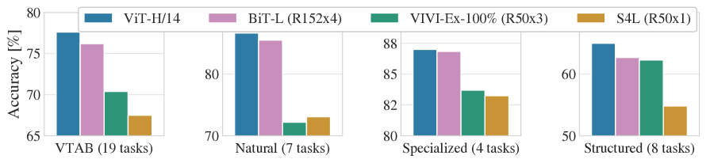
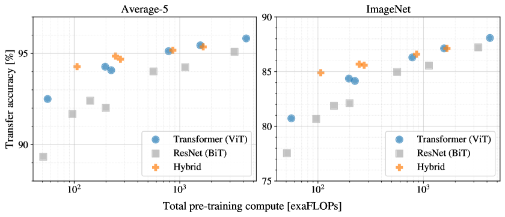

# ViT 论文导读：把图像切成"单词"，让 Transformer 直接看图

> **论文标题**：An Image is Worth 16x16 Words: Transformers for Image Recognition at Scale
> **会议/期刊**：ICLR 2021（深度学习顶级会议，Oral）
> **作者**：Alexey Dosovitskiy, Lucas Beyer, Alexander Kolesnikov, Dirk Weissenborn, Xiaohua Zhai, Thomas Unterthiner, Mostafa Dehghani, Matthias Minderer, Georg Heigold, Sylvain Gelly, Jakob Uszkoreit, Neil Houlsby
> **机构**：Google Research
> **arXiv**：https://arxiv.org/abs/2010.11929
> **代码**：https://github.com/google-research/vision_transformer

---

## 读之前先搞清楚

### 这篇论文要解决什么问题？

2020 年之前，计算机视觉领域几乎被 CNN（Convolutional Neural Network，卷积神经网络——用滑动窗口在图像上提取局部特征的网络）统治了整整八年。ResNet、EfficientNet 等 CNN 架构不断刷新 ImageNet 记录。

但 NLP 领域在 2017 年后发生了革命——Transformer 架构在几乎所有文本任务上取代了 RNN。Transformer 的核心是 **Self-Attention**（每个 token 都能直接"看到"序列中所有其他 token，而不是像 CNN 只能看局部窗口、像 RNN 只能看前面）。

自然的问题：**能不能把 Transformer 直接用在图像上？** 之前有人试过，但要么把 Self-Attention 只当 CNN 的辅助组件，要么用特殊设计的"局部 attention"模拟卷积。**从来没有人试过：完全扔掉 CNN，用纯 Transformer 做图像分类。**

ViT 是第一个证明"纯 Transformer 可以在图像分类上达到甚至超越 CNN"的工作——而且需要的计算资源更少。

> **小白理解**：CNN 看图像像用放大镜——每次只能看一小块（3×3 或 5×5 的窗口），通过堆很多层来逐步扩大视野。Transformer 看图像像直接摊开一张地图——每个位置都能同时看到整张图的所有位置。问题是图像不像文字天然就是"序列"——图像是 2D 的像素网格，怎么把 2D 图像变成 Transformer 能吃的 1D token 序列？ViT 的答案是：**把图像切成 16×16 的小方块（patch），每个 patch 当作一个"单词"**。

### 读懂这篇论文需要的前置知识

| 概念 | 简单解释 |
|:---|:---|
| **Transformer** | 完全基于 Self-Attention 的神经网络架构，NLP 标配 |
| **Self-Attention** | 每个 token 用 Query 去匹配所有 token 的 Key，加权聚合 Value——"全局看" |
| **CNN / Convolution** | 用固定大小的滑动窗口在图像上提取局部特征——"局部看" |
| **ImageNet** | 120 万张图片、1000 个类别的分类 benchmark |
| **Patch** | 从图像上切下来的小块，如 16×16 像素 |
| **Position Embedding** | 告诉 Transformer "每个 patch 在原图的哪个位置"的编码 |
| **CLS Token** | 借鉴 BERT，在序列最前面加一个特殊 token，用它最终的 output 做分类 |

---

## 一、ViT 的解决思路

核心 idea 极其简洁：

> **把图像切成 N 个 16×16 的 patch → 每个 patch 展平成一个向量 → 像 NLP 的 word embedding 一样送入标准 Transformer → 用最前面一个特殊 [CLS] token 的输出去做图像分类。**

```
CNN 看图像的方式                       ViT 看图像的方式
  
  滑动窗口，逐层扩大感受野              切成 patch，直接全局 attention
  ┌──────┐                              ┌──┬──┬──┬──┐
  │ 3×3  │ → 只能看邻居                 │P1│P2│P3│P4│  → 每个 patch
  ├──────┤                              ├──┼──┼──┼──┤  都能直接"看"到
  │ 3×3  │ → 第二层看更远               │P5│P6│P7│P8│  所有其他 patch
  ├──────┤                              └──┴──┴──┴──┘
  │ ...  │ → 堆很多层才能看全图
  └──────┘
```

> **小白理解**：CNN 是"盲人摸象"——每个人只摸到大象的一小块，需要很多人交流信息才能拼出全貌。ViT 是"上帝视角"——直接把大象切成 196 块，每块都能同时看到所有其他块，一步到位建立全局理解。

---

## 二、ViT 整体流程


*图1：ViT 的整体架构——图像切成 patch → Linear Projection → 添加 [CLS] token + Position Embedding → Transformer Encoder → MLP Head 分类。整个流程完全抛弃了 CNN，只用标准 Transformer。*

### 第 1 步：把图像切成 Patch —— "图像 → 文字序列"

**这一步在整个流程里的作用**：把 2D 图像转成 1D 的 token 序列，这是 ViT 最关键的创新——解决了"Transformer 只能处理序列"和"图像是 2D 网格"之间的矛盾。

- **输入**：一张 RGB 图像，如 224×224×3
- **操作**：

  > **总览**：224×224 图像 → 切成 14×14=196 个 16×16 的 patch → 每个 patch 展平 → Linear Projection → 196 个 patch embedding（每个 768 维）
  >
  > ```
  > 输入图像（224 × 224 × 3）
  >         ↓ ① 切成 14×14 = 196 个 patch，每个 16×16×3 = 768 个像素值
  > 196 个 patch，每个是 768 维的 vector
  >         ↓ ② Linear Projection（768 → 768 的可学习全连接层）
  > 196 个 patch embedding（每个 768 维）
  >         ↓ ③ 在最前面添加一个可学习的 [CLS] token embedding（1 个 768 维 vector）
  >         ↓ ④ 加上 Position Embedding（197 个，每个 768 维，可学习）
  > 197 个 token embedding → 送入 Transformer
  > ```

  **① 切 Patch**：把 224×224 的图像均匀切成 14×14=196 个格子，每个格子是 16×16 像素的 RGB 小块。每个小块有 16×16×3=768 个像素值，直接展平成 768 维向量。

  **② Linear Projection**：用一个可学习的全连接层（768→768）对每个 patch vector 做线性变换。这个操作相当于 CNN 第一层卷积（kernel_size=16, stride=16），但更灵活——它是一个纯矩阵乘法。

  **③ [CLS] Token（借鉴 BERT）**：在序列最前面拼接一个可学习的 embedding。这个 token 不属于任何 patch，它在 Transformer 处理过程中通过 Self-Attention 从所有 196 个 patch 聚合全局信息。最终只用这个 token 的 hidden state 做分类——它的 hidden state 编码了"整张图的全局理解"。

  **④ Position Embedding**：因为 Transformer 的 Self-Attention 本身对位置不敏感（"猫在左上角"和"猫在右下角"对它来说 patch 序列是一样的），需要给每个位置添加一个可学习的 position embedding。ViT 用的是 1D 可学习 position embedding（不像有些方法用 2D 正弦编码）。

- **输出**：197 个 768 维 token embedding（1 个 [CLS] + 196 个 patch）

> **小白理解**：把一张照片（224×224）像切披萨一样切成 196 个小方块（每块 16×16），每个方块贴上编号（1 号方块、2 号方块……）。然后把每个方块的像素值"翻译"成一个 768 维的向量（就像每个单词有一个 word embedding）。最后在最前面加一个特殊的"总结令牌"（[CLS] token），它的任务是在看完所有方块后，说出"这张图是什么"。

#### 🔢 具体数字例子

**条件设定**：ImageNet 标准输入，224×224 RGB 图像，patch_size=16。

| 步骤 | 张量形状 | 说明 |
|:---|:---|:---|
| 输入图像 | (224, 224, 3) | H×W×C |
| 切 patch | (14, 14, 768) | 14×14 个 patch，每个 16×16×3=768 |
| 展平 | (196, 768) | 196 个 768 维 vector |
| Linear Projection | (196, 768) | 维度不变，线性变换 |
| 添加 [CLS] | (197, 768) | 前面加一个可学习 embedding |
| 加 Position Embedding | (197, 768) | 逐元素相加 |

> **关键理解**：224×224 的图像变成了 197 个"单词"——恰好和一个短句子的 token 数量相当。**这就是 ViT 能够直接套用 NLP Transformer 的根本原因。**

---

### 第 2 步：Transformer Encoder 处理 —— "看图理解"

**这一步在整个流程里的作用**：用 L 层标准 Transformer Encoder 对 197 个 token 反复做 Self-Attention，让每个 token 融合全局信息。

- **输入**：197 个 768 维 token embedding
- **操作**：

  > **总览**：197 个 token embedding → L 层 Transformer Encoder → 197 个 768 维 hidden state
  >
  > ```
  > 197 个 token embedding（每个 768 维）
  >         ↓
  > ┌──────────────────────────────────┐
  > │  Layer 1:                        │
  > │    Multi-Head Self-Attention     │  ← [CLS] 看所有 196 个 patch
  > │    LayerNorm + Residual          │     patch_i 看所有其他 patch + [CLS]
  > │    MLP (768 → 3072 → 768)        │
  > │    LayerNorm + Residual          │
  > ├──────────────────────────────────┤
  > │  Layer 2 ~ L-1:  重复上述操作    │
  > ├──────────────────────────────────┤
  > │  Layer L:                        │
  > │    Multi-Head Self-Attention     │
  > │    MLP                           │
  > └──────────────────────────────────┘
  >         ↓
  > 197 个 hidden state（每个 768 维）
  >         ↓ 只取第一个（[CLS] token 的输出）
  > [CLS] hidden state = 768 维 vector → 送入分类 head
  > ```

  **① Multi-Head Self-Attention（MHSA）**：每个 token 生成 Query、Key、Value 三个投影。以 [CLS] token 为例：它的 Query 去和所有 197 个 token 的 Key 算相似度 → softmax 得到 attention 权重 → 用权重加权聚合所有 Value → 得到 [CLS] 的新表示。**这意味着 [CLS] token 在每一层都能"看到"所有 196 个 patch 的信息。** ViT 使用 12 个 attention head（ViT-Base），每个 head 关注不同的模式。

  **② MLP**：两层全连接（768 → 3072 → 768），中间用 GELU activation。给每个 token 独立做非线性变换。

  **③ Residual Connection + LayerNorm**：和标准 Transformer 一样，"先 Norm 再 Attention/MLP，然后加上原始输入"。

- **输出**：197 个 768 维 hidden state。**只用第 1 个（[CLS] token 的 hidden state）** 做分类。

> **小白理解**：[CLS] token 像一个"会议主持人"。196 个 patch 是 196 个参会者，每人只知道自己那一小块区域的信息。主持人通过 12 轮会议（12 层 Transformer），每轮都和所有人交流，逐步汇总所有人的信息。最后一轮结束后，主持人脑子里就有了"整张图的完整理解"——这个理解就是一个 768 维的 vector。

#### ❓ 深入理解：Self-Attention 在 ViT 中到底在看什么？

```
以 [CLS] token 在 Layer 1 的 Self-Attention 为例：

[CLS] token 的 hidden state h_cls（768 维）
      ↓ W_Q × h_cls → q_cls（64 维，per head）
      
对于每个 patch_i：
  h_i（768 维）→ W_K × h_i → k_i（64 维）
                → W_V × h_i → v_i（64 维）

  attention_score_i = dot(q_cls, k_i) / sqrt(64)
  → 196 个 score，softmax 后变成 196 个权重

  h_cls_new = sum_i(weight_i × v_i)  ← 将所有 patch 的信息按权重融合
```

**不同层关注的内容不同**（论文通过 attention rollout 可视化发现）：
- 浅层：关注相邻 patch，类似 CNN 的局部特征提取
- 中层：关注同属一个物体的 patch 群
- 深层：关注对分类最关键的物体区域（如狗的脸、鸟的翅膀）

> **核心设计理由**：ViT 不需要设计特殊的 attention 模式（不像 CNN 需要手工设计 kernel size、stride、dilation），Self-Attention 在训练中自动学会"该看哪里"。



*图2：ViT 不同层 Self-Attention 的可视化。浅层关注相邻 patch（局部纹理），中层关注同一物体的 patch 群，深层关注对分类最关键的物体区域（如狗的头部）。这证明了 Self-Attention 能从数据中自动学到类似 CNN 层次化特征的结构。*

---

### 第 3 步：分类 —— "说出答案"

- **输入**：[CLS] token 的 hidden state（768 维）
- **操作**：一个简单的 Linear 层（768 → num_classes，如 1000）把 [CLS] hidden state 映射到类别分数
- **输出**：1000 个类别的 logits，取 argmax 得到预测类别

---

## 三、核心创新点

| 创新点 | 具体内容 | 为什么重要 |
|:---|:---|:---|
| **纯 Transformer 做视觉** | 完全不用 CNN，直接切 patch + Transformer | 证明了 CNN 不是视觉的必需品 |
| **Patch Embedding** | 16×16 patch 展平 → Linear Projection | 巧妙地把 2D 图像变成 1D token 序列 |
| **[CLS] Token** | 序列最前面放一个可学习的聚合 token | 避免了复杂的 pooling 设计，极简 |
| **大规模 Pre-training 是关键** | 在 JFT-300M（3 亿张图）上 pre-train → ImageNet fine-tune | 证明了 Transformer 比 CNN 更需要数据，但数据够多时效果更好 |

---

## 四、实验结果

### 4.1 主结果：ViT vs CNN

| 模型 | 参数量 | ImageNet Top-1 | 训练成本 |
|:---|:---:|:---:|:---|
| ViT-H/14（JFT pre-train） | 632M | **88.55%** | ~2500 TPUv3 天 |
| ViT-L/16（JFT pre-train） | 307M | 87.76% | ~600 TPUv3 天 |
| BiT-L（ResNet152×4，CNN SOTA） | 928M | 87.54% | ~2500 TPUv3 天 |
| Noisy Student（EfficientNet-L2） | 480M | 88.4% | 更多 |

> **小白理解**：ViT-H/14 在参数量更少的情况下超过了当时最强的 CNN（BiT-L），并且训练成本相当。虽然 Noisy Student 稍微更高，但那是用额外未标注数据做半监督学习的结果。**ViT 证明了纯 Transformer 在视觉上是可行的、有竞争力的。**

### 4.2 关键发现：数据量是决定性因素



*图4：不同规模的 pre-training 数据（ImageNet → ImageNet-21k → JFT-300M）对 ViT 性能的影响。小数据上 ViT 不如 ResNet，大数据上 ViT 反超——证明了 Transformer 的 data-hungry 特性。*

| Pre-training 数据 | ViT-L ImageNet Top-1 | 对比 BiT-L（ResNet） |
|:---|:---:|:---:|
| ImageNet（1.2M） | 76.5% | **更差** |
| ImageNet-21k（14M） | 83.6% | 持平 |
| JFT-300M（300M） | **87.8%** | **超越** |

> **小白理解**：这是 ViT 论文最重要的 insight——**Transformer 在小数据上不如 CNN，因为 Self-Attention 缺少 CNN 内置的"局部性"和"平移不变性"先验（卷积天然假设相邻像素相关、同一特征在任何位置都应被同一方式检测）。但当数据足够多时，Transformer 可以从数据中自行学到这些先验，甚至学到比 CNN 更灵活的模式。**这就是"data-hungry but data-efficient"——给够数据，回报更大。**

---

## 五、在整个领域的位置

```
计算机视觉架构演进

CNN 时代                        Transformer 时代
    │                                │
LeNet (1998)                   Transformer (2017, NLP)
AlexNet (2012)                      │
VGG (2014)                    ┌──────┴──────┐
ResNet (2015)                 │             │
DenseNet (2017)          DETR (2020)   ViT (2021) ← 第一篇纯 Transformer 视觉论文
EfficientNet (2019)      检测任务      分类任务
    │                         │             │
    └─────────┬───────────────┘             │
              │                             │
        CNN + Attention 混合           ┌────┴────┐
        (BoTNet, CoAtNet)          Swin       MAE
                                  (2021)     (2022)
                               层级 ViT    自监督 ViT
                                    │
                              ┌─────┴──────┐
                         BEVFormer    DINOv2
                         (3D 检测)   (foundation)
```

---

## 六、局限性

| 局限性 | 为什么是局限 |
|:---|:---|
| **小数据上不如 CNN** | Self-Attention 没有内置的局部性先验，数据少时容易过拟合 |
| **计算量与图像分辨率平方成正比** | 224×224 切成 196 patch 还好，但 1024×1024 就是 4096 patch，Self-Attention 的复杂度是 O(N²) |
| **Patch 边界可能切断物体** | 16×16 的固定切分不感知物体边界，一个物体可能被切到两个 patch 里 |
| **Position Embedding 不支持变分辨率** | 可学习的 position embedding 长度固定，换更大图像需要插值 |

---

## 七、一句话总结

> **ViT 把图像切成 16×16 的 patch 当作"视觉单词"，送入标准 Transformer，证明了 CNN 的归纳偏置（局部性、平移不变性）不是视觉理解的必需品——只要有足够数据，Self-Attention 能从零开始学到比 CNN 更灵活的特征表示。**

---

## 参考资料

- 论文：https://arxiv.org/abs/2010.11929
- 代码：https://github.com/google-research/vision_transformer
- ar5iv：https://ar5iv.labs.arxiv.org/html/2010.11929
- Transformer 原论文：Vaswani et al., "Attention is All You Need", NeurIPS 2017
- BERT（[CLS] token 来源）：Devlin et al., NAACL 2019
