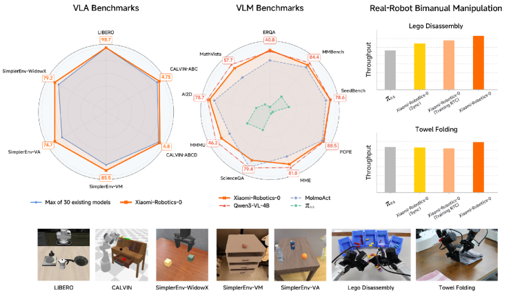
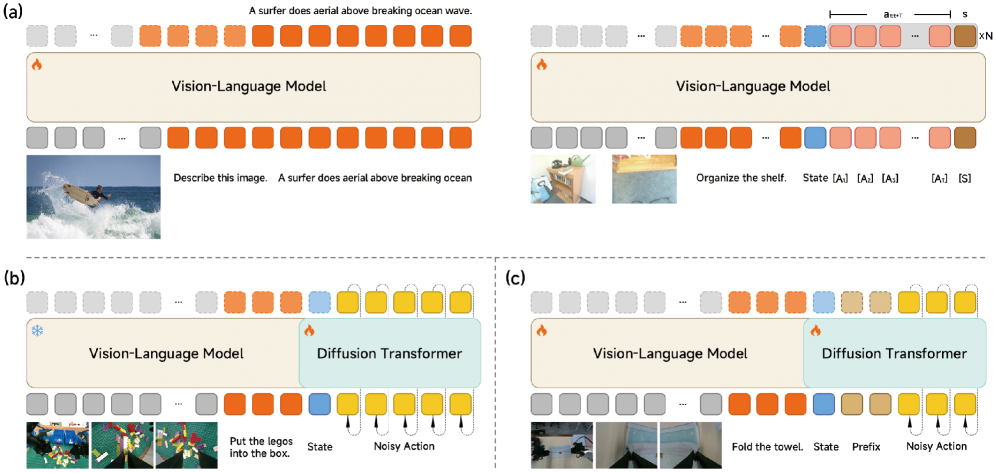
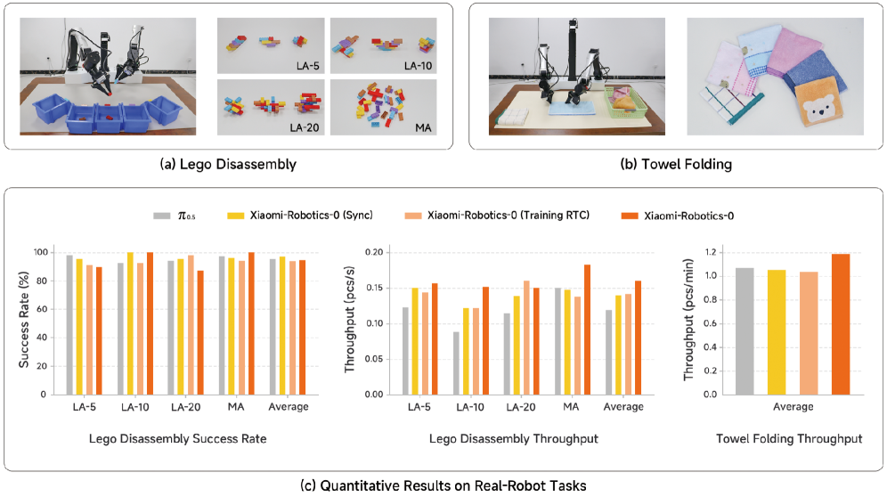

# Xiaomi-Robotics-0 论文导读：用 MoT 架构+异步执行+VL 数据保 cap，打造开源 SOTA 实时 VLA 模型

> **论文标题**：Xiaomi-Robotics-0: An Open-Sourced Vision-Language-Action Model with Real-Time Execution
> **发布形式**：Technical Report，arXiv 预印本，2026 年 2 月
> **作者**：Rui Cai, Jun Guo, Xinze He, Piaopiao Jin, Jie Li, Bingxuan Lin, Futeng Liu, Wei Liu, Fei Ma, Kun Ma, Feng Qiu, Heng Qu, Yifei Su, Qiao Sun, Dong Wang, Donghao Wang, Yunhong Wang, Rujie Wu, Diyun Xiang, Yu Yang, Hangjun Ye, Yuan Zhang, Quanyun Zhou
> **机构**：Xiaomi Robotics（小米机器人）
> **arXiv**：https://arxiv.org/abs/2602.12684
> **代码**：https://xiaomi-robotics-0.github.io

---

## 读之前先搞清楚

### 这篇论文要解决什么问题？

VLA 模型（如 π₀、π₀.₅、OpenVLA）虽然在 simulation 和 real robot 上展现了强大性能，但有一个共同问题：**推理延迟太高。** 几十亿参数的模型一次 forward pass 需要 80-200ms，而机器人控制需要 30-50Hz 的高频。同步执行（等推理完再动→推理时停住不动→推理完再执行）导致动作不连贯、机器人"一顿一顿"的。

异步执行（推理的同时继续执行上一个 action chunk 的后半段）可以解决停顿问题，但又引入新问题：**前后两段 action chunk 不一致**——上一个 chunk 的最后几步和下一个 chunk 的开头几步可能对不上，导致 jerky motions（急动），甚至把机器人带入训练数据中不存在的 out-of-distribution 状态。

此外，VLA 训练还有一个隐性问题：**catastrophic forgetting**——用 robot trajectory 数据 fine-tune VLM 后，VLM 原本的视觉语义能力（看图问答、物体识别、OCR）会大幅退化。例如 π₀ 训练后在所有 VL benchmark 上几乎全部归零。

Xiaomi-Robotics-0 同时对这三个问题给出了完整的解决方案。

> **小白理解**：VLA 模型像一个大胖子——脑子很聪明（VLM），但身体反应慢（推理延迟高）。之前的方案是"想一下→动一下→停住→再想→再动"——像机器人跳机械舞，一顿一卡的。异步执行是"一边动一边想"——但问题是你的手还在执行上一个"想法"的末尾，下一个"想法"的开头接不上，手可能会抖一下。Xiaomi-Robotics-0 教模型学会了"接动作"——让下一个 action 的前几步和上一个 action 的后几步平滑过渡，同时用特殊的 attention mask 防止模型偷懒（只看前缀 action 而不看 camera 画面）。

### 读懂这篇论文需要的前置知识

| 概念 | 简单解释 |
|:---|:---|
| **VLA（Vision-Language-Action）** | 输入 image + text → 输出 robot action 的模型 |
| **Mixture-of-Transformers（MoT）** | VLM + DiT 两个 Transformer 组合，而非一个统一模型 |
| **DiT（Diffusion Transformer）** | 用 Transformer 架构做 diffusion/flow-matching 去噪 |
| **Flow Matching** | 从噪声到目标 action 的确定性路径，只需 5-10 步 |
| **Action Chunking** | 一次预测未来 T 步的 action 序列而非逐步 |
| **Catastrophic Forgetting** | 用新任务数据训练后，模型忘记了之前学到的能力 |
| **Λ-Shape Attention Mask** | 允许噪声 action 看前 w 步前缀 action，但不让看更远的 action（防止偷懒） |
| **Asynchronous Execution** | 机器人在执行 action 的同时，模型在推理下一个 action chunk |

---

## 一、Xiaomi-Robotics-0 的解决思路

核心 idea：**用 Mixture-of-Transformers（MoT）架构——一个大 VLM（Qwen3-VL-4B）处理视觉和语言，冻结后为一个轻量 DiT（16 层）提供 KV cache condition；训练分两步——先 co-train VL data + robot data 保持 VLM 能力，再单独训练 DiT 出 action；部署时用 action prefix + Λ-shape attention mask + RoPE offset 实现平滑异步执行。**

```
Xiaomi-Robotics-0 的三重创新：

┌─────────────────────────────────────────────────────────────┐
│ 创新 ①：MoT 架构 + 两阶段 pre-training                       │
│   Qwen3-VL-4B (VLM) + DiT (300M action expert)              │
│   Step 1: co-train VLM on VL data + robot trajectories      │
│   Step 2: freeze VLM, train DiT with flow-matching           │
│   → VLM 保持视觉语义能力，DiT 专注 action 生成              │
├─────────────────────────────────────────────────────────────┤
│ 创新 ②：异步执行 + Λ-attention + RoPE offset                │
│   Action prefix（前 chunk 后几步作为 condition）              │
│   Λ-shape attention mask（只让前 w 步看 prefix）              │
│   RoPE position offset（区分 clean/ noisy action token）      │
│   → 动作平滑过渡 + 防止偷懒（避免 copypaste prefix）          │
├─────────────────────────────────────────────────────────────┤
│ 创新 ③：VL data co-training 防止 catastrophic forgetting   │
│   80M VL samples + 200M robot timesteps 混合训练              │
│   → 训练后 VLM 能力几乎完全保留（匹配 Qwen3-VL-4B 原版）     │
└─────────────────────────────────────────────────────────────┘
```



*图1：Xiaomi-Robotics-0 在三个 simulation benchmark（LIBERO/CALVIN/SimplerEnv）上达到 SOTA，在两个真实双臂任务（Lego Disassembly/Towel Folding）上实现高吞吐量实时执行，同时保留了底层 VLM 的视觉语义能力。*

---

## 二、模型架构

本节只讲"模型由什么组成"——VLM 和 DiT 各自是什么、怎么连接。**下一节讲"怎么训练"**。



*图3：三个阶段的流水——(a) Pre-training Step 1：VLM 同时在 VL 数据和 robot 数据上训练；(b) Step 2：冻结 VLM，用 flow-matching 训练 DiT；(c) Post-training：用 action prefix 训练异步执行。*

### 2.1 整体结构：两个 Transformer，一个"问"一个"答"

Xiaomi-Robotics-0 不是一个大模型，而是**两个** Transformer 的组合（总 4.7B 参数）：

```
                        ┌─────────────┐
   3 张 camera image → │    VLM      │ → KV Cache（最后 16 层）
   语言指令          → │ Qwen3-VL-4B │         │
                        │  32 层, 4B  │         │ Cross-Attention
                        └─────────────┘         ▼
                                        ┌─────────────┐
   关节状态 s_t +                    → │    DiT      │ → action chunk
   噪声 action a                     │   16 层, 300M │   (30 步关节角)
                                        └─────────────┘
```

**两个模型的分工**：

| | VLM（Qwen3-VL-4B） | DiT（Diffusion Transformer） |
|:---|:---|:---|
| **职责** | 看图和指令，理解场景语义 | 基于场景理解，生成精确动作 |
| **参数量** | 4B（占总 85%） | ~300M（占总 15%） |
| **训练状态** | Step 1 可训练，Step 2 冻结 | Step 2 训练 |
| **推理次数** | 1 次（出一个 KV Cache） | 5 次（flow matching 去噪 5 步） |
| **输入** | 3 张相机图 + 语言指令 | 关节状态 + 噪声动作 + VLM 的 KV Cache |
| **输出** | 最后 16 层的 KV Cache | 30 步去噪后的关节角度序列 |

> **小白理解**：VLM 像作战指挥部的参谋——看地图（相机图）、读作战指令（自然语言），分析完给出一份"情报摘要"（KV Cache）。DiT 像前线指挥官——根据情报摘要 + 部队当前状态（关节角），一步步制定精确的行动方案（30 步关节角序列）。**参谋只分析一次（VLM 1 次 forward），指挥官根据分析结果反复推演 5 次（DiT 5 次去噪）——这就是总延迟只有 80ms 的原因。**

### 2.2 DiT 的输入：一条"动作 token 序列"

DiT 接收的是一串 token，每个 token 都是一个 d 维向量：

```
[SINK]   s_t     a_t    a_{t+1}   ...   a_{t+29}
  ↑       ↑       ↑       ↑               ↑
 可学习   当前    当前步  第 1 步         第 29 步
 的      关节    噪声    噪声            噪声
 "垃圾桶" 状态    action  action         action
```

三个角色的含义：

- **`[SINK]`**：1 个可学习的"注意力垃圾桶"token——causal attention 中前面的 token 会累积过多的注意力权重，[SINK] 把它们"吸走"，防止 attention 分布崩溃
- **`s_t`**：机器人当前 14 维关节角（双臂 6-DoF）→ MLP 编码 → d 维
- **`a_{t+i}`**：第 i 步的**带噪声**动作（同样是 14 维 → MLP → d 维）。训练时随机加噪声；推理时从纯噪声开始，逐步去噪

#### ❓ 常见疑问：这 31 个 token 和 2.1 的 VLM KV Cache 是什么关系？

> **它们是两套完全独立的数据，通过 Cross-Attention 连接，不是一回事。** 很多读者在这里会搞混，下面用一张图说清楚：
>
> ```
>                     ┌─── DiT 自己的 31 个 token ───┐
>                     │  (独立数据流，不来自 VLM)      │
>                     │                               │
>   VLM ──────────→  KV Cache (16 层)                │
>   (只跑 1 次)        │                              │
>                      │  Cross-Attention              │
>                      │  Q=DiT, K/V=VLM KV           │
>                      ▼                              │
>                     DiT 每层都"查"一次 VLM ←────────┘
> ```
>
> - **DiT 的 31 个 token 是 DiT 自己的"草稿纸"**：上面写着"当前关节角度是 xxx，第 0 步动作可能是 yyy（带噪声），第 1 步可能是 zzz……"。这张草稿纸**完全由 DiT 自己维护**，和 VLM 没有直接关系。
> - **VLM 的 KV Cache 是 DiT 的"参考手册"**：DiT 每做一步 Self-Attention（自己推理），就抬头翻一下手册（Cross-Attention），确认"这一步的场景是这样的，指令要求抓那个"。
> - **两者通过 Cross-Attention 桥接**：DiT 的 token 作为 Q（"我想知道什么"），VLM 的 KV Cache 作为 K 和 V（"场景里有什么"），在 DiT 的每一层各做一次查询。
>
> **噪声 action 是哪来的？**
> - **训练时**：拿 ground truth 动作 $a^{gt}$，加上随机噪声 $\varepsilon \sim \mathcal{N}(0,I)$，按比例混合：$a^\tau = \tau \cdot a^{gt} + (1-\tau) \cdot \varepsilon$。$\tau$ 越小噪声越大
> - **推理时**：从纯噪声 $\varepsilon$ 开始（31 个 token 的后 30 个全是随机数），DiT 跑 5 次，每次预测一个"去噪方向" $v_\theta$，沿这个方向挪一步 → 5 步后噪声变成了可执行的动作

### 2.3 DiT 怎么"问"VLM：Cross-Attention + adaLN

DiT 的每一层都做三件事——先内部讨论（Self-Attention），再查情报（Cross-Attention），最后根据"还剩多少步去噪"调节力度（adaLN）：

```
DiT 第 l 层内部（重复 16 层）：

  ① Self-Attention:  [SINK]、s_t、a 这 31 个 token 互相看
     → 动作步之间协调关系："第 5 步如果太快，第 6 步要收一点"
  
  ② Cross-Attention: Q 来自 DiT，K/V 来自 VLM 第 l 层 KV Cache
     → 查情报："这一步对应的场景是什么？指令要求抓哪个？"
  
  ③ FFN + adaLN:  由去噪时间步 τ 控制归一化参数
     → τ≈0（全是噪声）：α 大 = 残差路径粗调，大步去噪
     → τ≈1（接近干净）：α 小 = 残差路径微调，精修细节
```

> **小白理解**：DiT 就像一个戴着 AR 眼镜的技工。Self-Attention = 低头看自己手里的 30 个零件（action steps），协调它们的位置关系。Cross-Attention = 抬头看 AR 眼镜上的说明书（VLM KV Cache），确认"当前这一步的目标物体在哪"。adaLN = 根据进度条（τ）调整手上的力度——刚开始还剩很多噪点，用力搓（大步去噪）；快完成时轻拿轻放（微调）。

---

## 三、训练流程：三步走，从预训练到部署

上一节讲了模型**长什么样**，本节讲模型**怎么训练出来**。训练分三步，数据配方和 loss 设计逐步演进。

> **总览**：
> ```
> 输入：3 张相机图 + 语言指令 + 机器人轨迹数据
>     │
>     ▼
> Step 1: Co-train VLM（VL数据 + 机器人数据混合训练）
>   VLM 学会：看懂场景 + 初步预测动作
>     │
>     ▼
> Step 2: Freeze VLM, Train DiT（Flow Matching 去噪训练）
>   DiT 学会：从噪声中还原精确动作，同时查 VLM 的情报
>     │
>     ▼
> Step 3: Post-training（在目标机器人上精调，训练异步执行）
>   模型学会：动作 chunk 之间平滑衔接
>     │
>     ▼
> 部署：VLM 出 KV Cache → DiT 5 步去噪 → 30 步关节角 → 机器人执行
> ```

### Step 1：Co-train VLM——图文能力 + 动作能力两手抓

**这一阶段解决什么问题？** 直接用机器人数据微调 VLM 会导致灾难性遗忘——VLM 看图问答、物体识别、OCR 等能力全部归零（π₀ 就是前车之鉴）。

小米的解法很直接：**让 VLM 在两份"作业"上同时训练**——同一 batch 里，6 条机器人轨迹配 1 条图文数据。机器人数据教动作，图文数据保住语义。两份作业用不同的 loss，但共享同一个 VLM 参数，梯度一起反传。

```
一个 training batch 里有两类数据：

  机器人轨迹（6 份）                    图文数据（1 份）
  ┌──────────────────┐              ┌──────────────┐
  │ 图 + 指令 → 预测动作            │ 图 + 文字 →    │
  │ 用 Choice Policies loss       │ 预测下一个词    │
  │ （下面详讲）                    │ 标准 CE loss   │
  └──────────────────┘              └──────────────┘
          │                                │
          └───────────┬────────────────────┘
                      ▼
              两份 loss 加权求和 → 一次 backward → 更新 VLM
```

VL 数据那部分很简单——标准的下一个 token 预测，不需要额外解释。**机器人数据这部分才是关键**，下面一步步讲。

---

**机器人数据怎么训练？核心挑战是：VLM 本来只会输出文字，怎么让它输出动作？**

答案是在 VLM 的输入序列末尾**插入一组"空白的查询 token"**，让它们通过 Self-Attention 从整条序列中"读"出场景信息，然后各自输出对应的动作：

```
VLM 完整输入序列（用机器人数据训练时）：

  [相机图切成 256 个 patch token]  ["把" "茄" "子" "放" "进" "锅" "里"]  [s_t]  [A1] [A2] ... [A30] [S]
   └── 和平时一样，VLM 看图识字 ──┘  └── 和平时一样，VLM 读指令 ──┘  └关节┘  └── 新插入的 31 个 token ──┘
                                                                              ↑                  ↑
                                                                     30 个动作查询 token      1 个评分 token
```

这些 `[A_i]` 和 `[S]` 是**随机初始化、可学习**的向量——不是文字，而是纯粹的数值向量。一开始它们只是空白，但随着训练推进，梯度反传会教会它们"怎样从 VLM 的上下文中提取信息"。就像公司新招了 31 个实习生——他们不懂业务，但每天和老员工（VLM 的 patch/text token）一起开会（Self-Attention），逐渐学会了各自的职责。

**一次完整的 forward pass 长什么样？** 假设场景：机械臂面前有个茄子，指令是"把茄子放进锅里"。N=5（出 5 套候选方案），T=30（预测 1 秒的动作）：

```
① 输入编码
   图片 → ViT → 256 个 patch token（每个携带局部视觉信息）
   指令 → tokenizer → 7 个 text token
   关节角 s_t → MLP → 1 个 state token
   [A1]...[A30] → 30 个随机向量（初期）或已学会的 query（后期）
   [S] → 1 个随机向量

② VLM 前向（32 层 Transformer）
   所有 295 个 token 互相做 Self-Attention
   → [A_i] 们学会了"重点关注茄子的 patch 和'茄子'这个词"
   → [S] 学会了"综合所有 A_i 的信息，判断整体方案质量"

③ 输出动作和评分
   每个 [A_i] 的最后层隐藏状态 → Linear → 5 个候选（每候选 14 维关节角）
   [S] 的最后层隐藏状态 → Linear → 5 个 score 值

   结果：5 套完整的 30 步动作方案，每套带一个自评分
```

**训练时怎么选 winner？** 5 套方案都算出来了，但只有一套能被用来更新模型：

```
方案1 ─┐
方案2 ─┤  各自与 ground truth 算 L1 距离
方案3 ─┤  d1=1.8, d2=0.3, d3=2.5, d4=0.7, d5=3.2
方案4 ─┤                    ↓
方案5 ─┘              方案2 距离最小 → winner!

Action loss:  只对方案2 算 L1 regression
              L_action = ||方案2 - ground_truth||₁
              （输了的 4 套不参与——winner-takes-all）

Score loss:   5 套都参与，目标是把 score 训练成"距离的负数"
              L_score = Σⱼ ||scoreⱼ - (-dⱼ)||²
              （距离越小 → score 应该越高 → -dⱼ 就是 target）
```

> **小白理解**：这就像学生考试——给你一张场景图 + 指令，你要同时交 5 份答卷，每份自己估一个分。老师（ground truth）批改后，找出和标准答案最接近的那份。训练的目标是两个：① 让"最接近的那份"下次更接近（action loss）；② 让自己的估分能力变准——真正好的答卷估高分，差的估低分（score loss）。**为什么交 5 份不是 1 份？因为机器人动作天生有多解——"从左边抓"和"从上面抓"都可能是对的。只交 1 份会逼模型对多个答案"取平均"，结果哪边都不靠，什么也抓不到。**

#### ❓ 常见疑问：`[A_i]` 和 `[S]` 和普通文字 token 有什么区别？

> `[A_i]` 和 `[S]` 不是文字，是**可训练的向量**——类似 BERT 的 `[CLS]`，只不过 `[CLS]` 学的是"整句话的摘要"，`[A_i]` 学的是"第 i 步动作是什么"。它们和普通 token 的对比如下：
>
> ```
> 普通 token:  "茄子" → 查词表 → 固定嵌入向量（冻结的，来自预训练）
> [A_3]:       随机向量 → 训练中不断更新 → "第 3 步动作查询器"
> [S]:         随机向量 → 训练中不断更新 → "方案质量评估器"
> ```
>
> 注意：这些 token 只在 Step 1 存在。到了 Step 2，VLM 的输入恢复为纯 `[image] + [text]`，不再有 `[A_i]` 和 `[S]`——动作生成的任务完全交给 DiT 了。

### Step 2：Freeze VLM, Train DiT——Flow Matching 去噪训练

**这一阶段解决什么问题？** Step 1 训练完的 VLM 已经能粗略预测动作了——但精度不够。VLM 用 Choice Policies 出 5 选 1 的动作，本质上是在"多个粗糙方案里挑最好的"，而不是"从零打磨出一个精确方案"。此外，Step 1 的 `[A_i]` 和 `[S]` token 占用了 VLM 的输入空间，推理时每一帧都要跑一次 VLM forward——太慢了。

Step 2 的设计思路是：**把"粗略理解"和"精确动作"解耦**。VLM 专心看图看指令，输出一份"场景摘要"（KV Cache），冻住不动。然后训练一个轻量的 DiT，拿着这份摘要，从纯噪声一步步"雕刻"出精确动作。VLM 只跑一次，DiT 跑 5 次——这就是总延迟 80ms 的来源。

---

**Step 2 的 VLM 和 Step 1 有什么不同？** 两个变化：

| | Step 1 的 VLM | Step 2 的 VLM |
|:---|:---|:---|
| **输入** | `[image] [text] [s_t] [A_1]...[A_T] [S]` | `[image] [text]` 纯视觉+语言 |
| **输出** | 通过 `[A_i]` 和 `[S]` 出动作+评分 | 最后 16 层的 KV Cache |
| **可训练？** | ✓ 全部可训练 | ✗ 冻结，梯度不传回 |
| **推理次数** | 每帧跑一次 | 只跑一次，KV Cache 复用 |

`[A_i]` 和 `[S]` 完成了 Step 1 的历史使命——让 VLM 学会了"看图+指令→动作"的初步映射——现在退休了。动作生成的接力棒完全交给 DiT。

---

**一次训练 iteration 的完整流程——两条平行线在 DiT 汇合：**

```
          ① VLM 看场景                         ② 准备训练样本
          ┌──────────────┐                    ┌──────────────────┐
          │ 图 + 指令     │                    │ ground truth 动作 │
          │   ↓          │                    │   a^{gt}         │
          │ VLM forward  │                    │   ↓              │
          │   ↓          │                    │ 加噪声 ε          │
          │ KV Cache     │                    │   ↓              │
          │ (16 层)      │                    │ a^τ = 混合        │
          └──────┬───────┘                    └────────┬─────────┘
                 │                                     │
                 │         ③ DiT forward               │
                 └──────────→  ←───────────────────────┘
                          ┌──────────────┐
                          │ 31 个 token:  │
                          │ [SINK] + s_t  │
                          │ + a^τ(噪声动作)│
                          │              │
                          │ Self-Attn     │  ← 在自己 token 间推理
                          │ Cross-Attn    │  ← 抬头查 VLM KV Cache！
                          │ FFN + adaLN   │
                          │   ↓          │
                          │ 预测 v_θ     │  ← 去噪方向
                          └──────────────┘
```

关键：① 和 ② 是**并行准备的**，互不依赖。① 负责"场景长什么样"，② 负责"给 DiT 一道练习题"。两者在 ③ 汇合——DiT 拿着噪声动作（②），通过 Cross-Attention 去查 VLM 的场景理解（①），预测去噪方向。

下面用具体数字走一遍。延续 Step 1 的场景：机械臂面前有茄子，指令"把茄子放进锅里"。我们已有 ground truth 动作 $a^{gt}$（30 步关节角序列，每步 14 维）。

```
① VLM forward（只跑一次，冻结）
   输入：3 张相机图 + "把茄子放进锅里"
   处理：32 层 Transformer 对图片 patch 和文字 token 做 Self-Attention
   输出：最后 16 层的 KV Cache
         → K: 16 个矩阵，每个 (seq_len, d_head)
         → V: 16 个矩阵，每个 (seq_len, d_head)
         → 里面存的是"这张图里茄子在哪、锅在哪、指令要求做什么"的编码
   状态：VLM 完全冻结，此步骤不产生任何梯度

② 制造"不完美的动作"——给 DiT 出题
   从 Beta(1.5, 4.0) 采样一个 τ 值 → 比如 τ=0.3
   生成纯随机噪声 ε ~ N(0, I)（30×14 维，全是无意义的随机数）
   混合：a^τ = 0.3 × a^{gt} + 0.7 × ε
         └─ 30% 是真值  └─ 70% 是垃圾

   τ=0.3 意味着：给 DiT 看的动作里 70% 是噪声——DiT 必须从这堆垃圾里猜出真值
   τ 越小噪声越大，题目越难——但练得越多，DiT 的去噪能力越强
   注意：这一步和 VLM 完全无关——噪声是纯数学运算，不需要 VLM 参与

③ DiT forward——两条线在这里汇合！
   从 ② 拿到：[SINK] + s_t(MLP编码) + a^τ(MLP编码) → 31 个 token（全是 DiT 自己的）
   从 ① 拿到：VLM 的 16 层 KV Cache
   
   DiT 的 16 层中，每一层：
     a) Self-Attention：31 个 token 互相看——"第 5 步和第 6 步要协调"
     b) Cross-Attention：Q=DiT token, K/V=VLM KV Cache——"这一步对应场景里哪个物体？"
     c) FFN + adaLN：τ 控制去噪力度
   
   输出：预测的"去噪方向" v_θ（30×14 维）

④ 算 loss——Flow Matching 的核心
   最短路径方向：u = a^{gt} - ε
   这是什么意思？ε 是纯噪声，a^{gt} 是目标——从 ε 直接指向 a^{gt} 的向量就是 u
   u 是"一步到位"的最优方向（直线最短）

   模型预测了 v_θ，真值是 u：
   L = ||v_θ - u||² = 把 (30×14=420) 个差值的平方全加起来

   训练目标：让 DiT 预测的去噪方向 v_θ，尽量接近"从噪声直达真值"的方向 u

⑤ 反向传播
   只更新 DiT 的 300M 参数
   VLM 完全不受影响——这就是"冻住 VLM"的含义
```

> **小白理解**：Flow Matching 就像教一个雕刻学徒，训练流程是两条平行线汇合：
> - **左线（VLM）**：老师傅看了一眼模特（场景图+指令），画了张素描（KV Cache）贴在墙上。画完他就下班了，不再参与后续。
> - **右线（噪声）**：助教拿真值雕像（a^{gt}），随机凿了很多坑（加噪声 ε），制造了一块"半成品石料"（a^τ）给学徒练手。
> - **汇合（DiT）**：学徒面对半成品石料，每凿一下之前，抬头看墙上的素描（Cross-Attention 查 VLM KV Cache），确认"这一凿应该往哪个方向"。loss 就是"学徒猜的方向"和"从石料到雕像的直线方向"（u = a^{gt} - ε）之间的差距。
>
> **所以 VLM 的 KV Cache 和噪声动作不是"谁喂给谁"的关系——它们是两条独立准备的材料，在 DiT 的 Cross-Attention 这一步汇合。** 就像你做菜：菜谱（KV Cache）和食材（噪声动作）是两样东西，你（DiT）一手看菜谱一手处理食材。菜谱不会变成食材，食材也不会变成菜谱。

#### ❓ 常见疑问：VLM 输出的 KV Cache 和噪声动作 a^τ 到底是什么关系？谁先谁后？

> **没有先后，两者平行准备，在 DiT 内部通过 Cross-Attention 汇合。** 一张图说清楚：
>
> ```
> 训练数据的两个来源，完全独立：
> 
>   来源 A：场景理解                    来源 B：动作监督
>   ┌─────────────────┐               ┌─────────────────┐
>   │ 相机图 + 指令     │               │ ground truth     │
>   │      ↓           │               │ 动作 a^{gt}      │
>   │ VLM 编码         │               │      ↓           │
>   │      ↓           │               │ 随机加噪声 ε     │
>   │ KV Cache         │               │      ↓           │
>   │ (存的是"茄子      │               │ a^τ              │
>   │  在右下角，       │               │ (存的是"30步      │
>   │  锅在中间")       │               │  带噪声关节角")   │
>   └────────┬────────┘               └────────┬────────┘
>            │                                 │
>            │     同时喂给 DiT                 │
>            └────────────┬────────────────────┘
>                         ▼
>                   DiT 的 Cross-Attention:
>                   Q = "我这一步该怎么动？"（来自噪声动作 token）
>                   K = "茄子在这里，锅在那里"（来自 VLM KV Cache）
>                   V = "场景的具体视觉特征"（来自 VLM KV Cache）
>                         │
>                         ▼
>                   融合输出 → 预测去噪方向 v_θ
> ```
>
> 训练时，a^{gt} 是已知的（来自人类遥操作采集的数据），所以可以任意加噪声出题。推理时没有 a^{gt}——DiT 从纯噪声出发，靠 VLM KV Cache 提供的场景信息，一步步去噪，5 步后得到可执行动作。

#### ❓ 常见疑问：Flow Matching 和 Diffusion（DDPM）有什么区别？

> 两者都做"去噪"，但路径不同：
>
> | | Diffusion (DDPM) | Flow Matching |
> |:---|:---|:---|
> | **路径** | 随机游走，弯弯绕绕 | 直线最短路径 |
> | **去噪步数** | 通常 50-1000 步 | 5-10 步就够了 |
> | **速度场** | 需要估计噪声 ε | 直接估计从噪声到目标的直线方向 u |
> | **训练目标** | ||ε_θ - ε||² | ||v_θ - (x_1 - x_0)||² |
>
> Flow Matching 选直线路径的代价是：需要知道"起点（纯噪声）和终点（真值）"，而这两个在训练时都有（ground truth 是已知的）。推理时只有起点，沿着预测的方向走 5 步就能到终点附近。**直线路径 = 更少步数 = 更快推理——这就是为什么 Xiaomi-Robotics-0 的 DiT 只需要 5 步去噪。**

训练配置：40k steps，batch=32768，AdamW 优化器，DeepSpeed ZeRO-2 分布式。Action chunk 长度 T=30（对应 1 秒 @30Hz）。

### Step 3：Post-training——在目标机器人上精调，训练异步执行

**这一阶段解决什么问题？** Step 2 训练出的 DiT 是一个"通用去噪器"——它在各种机器人和场景的数据上都练过，但还没见过你的具体机械臂、具体桌面、具体光照。Post-training 就是让模型在**目标机器人的少量轨迹数据**上继续训练，适应这个特定环境。

但这只是表层任务。深层挑战是：**怎么部署才能让机器人不卡顿？**

---

**先看问题：同步执行为什么不行。**

Step 2 的 DiT 推理一次需要 80ms。最简单的部署方式是：

```
同步执行（机器人一顿一卡）：
  时间轴 →  ├─推理80ms─┤───执行30步(1s)───├─推理80ms─┤───执行30步───┤
  机器人 →  停住不动    正常动             停住不动    正常动
             ↑ 卡了！                        ↑ 又卡了！
```

每 1 秒就卡 80ms——机器人像在跳机械舞。对于需要连续平滑运动的操作（叠毛巾、拆 Lego），这种停顿是致命的。

**异步执行可以消灭停顿——但引入新问题。**

```
异步执行（不停顿）：
  时间轴 →  ├─推理chunk#0─┤├─推理chunk#1─┤├─推理chunk#2─┤
            ├────执行 chunk #0（30步）────┤
                         ├────执行 chunk #1（30步）────┤
                                      ├────执行 chunk #2 ────┤
  机器人 → 一直连续动！永不停顿！
```

关键在"重叠区"：chunk #0 还在执行时，GPU 已经在推理 chunk #1 了。推理完成后，chunk #1 无缝接上 chunk #0 的末尾。

**但重叠带来了衔接问题。** 用一个具体例子说明：

```
假设 T=30 步（1秒），T_e=10（执行 10 步后触发下一次推理），推理耗时 80ms≈3 步。

chunk #0:  [步0] [步1] ... [步9] [步10] [步11] [步12] [步13] ... [步29]
              └── 已执行 10 步 ──┘└── 还在执行中，同时 GPU 在推理 chunk #1 ──┘

chunk #1:                              [步0'] [步1'] [步2'] ... [步29']
                                           ↑
                                    这个"步0'"和 chunk #0 的"步13"能平滑衔接吗？
```

chunk #1 的步0'是凭空生成的——DiT 从纯噪声去噪出来的。如果它和 chunk #0 的步13（机械臂正在执行的这一步）方向不一致、速度不连续，机械臂就会"抖一下"。这种 jerk 轻则影响精度，重则把机械臂带入从未训练过的状态，后续动作全部崩溃。

---

**小米的三件套解法：action prefix + Λ-attention + RoPE offset。**

#### 3.1 Action Prefix——告诉 DiT"上一段最后怎么动的"

解法很简单：在 DiT 推理 chunk #1 时，把 chunk #0 的**最后 Δt_c 步已经执行的动作**拼接在 noisy action 前面，作为"上下文"：

```
DiT 输入（推理 chunk #1 时）：

  [SINK] [s_t] [a_10] [a_11] [a_12] [a_13] [a^τ_0] [a^τ_1] ... [a^τ_29]
         关节   └── chunk #0 的最后 4 步（Δt_c=4）──┘  └── chunk #1 的噪声动作 ──┘
         状态         ↑  clean action prefix              ↑ noisy actions to predict
                "上一段末尾是这样动的"              "基于此，我预测接下来该怎么动"
```

训练时，Δt_c 从 {0,1,2,3,4,5,6} 中随机采样——有时给 6 步 prefix，有时给 0 步（完全不给）。这逼模型学会在各种衔接条件下都能工作。

> **小白理解**：就像你接替别人继续弹钢琴。你不知道他上一段弹到哪了，就很难无缝衔接。但如果你能听到他最后几个音符（prefix），你就知道"哦，他在弹 C 大调，节奏是 120bpm，手指正停留在中央 C 附近"——然后你的第一个音符就能和他的最后一个音符自然过渡。

#### 3.2 Λ-Shape Attention Mask——防止 DiT"偷懒抄作业"

action prefix 解决了"信息从哪来"，但引入了一个新陷阱：**如果 DiT 在推理 chunk #1 时能看到全部 prefix，它会学会偷懒——直接复制 prefix 的动作，而不是看相机画面。**

这在训练时看不出来（因为 prefix 恰好是 ground truth 的末尾，抄了也对），但部署时：如果 chunk #0 的最后几步因为外界扰动（桌子被人碰了一下）略微偏移了，DiT 如果"闭眼抄 prefix"就会把偏移无限放大——机械臂越跑越偏。

Λ-shape attention mask 的解法：**只让前 w 步 noisy action 看 prefix，后面的步强制看相机画面。**

```
Λ-shape Mask（✅=可以看, ❌=禁止看）：

                       noisy action tokens →
                     a^τ_0  a^τ_1  a^τ_2  ...  a^τ_29
  clean prefix a_10    ✅      ✅      ❌         ❌
  clean prefix a_11    ✅      ✅      ❌         ❌
  clean prefix a_12    ✅      ✅      ❌         ❌
  clean prefix a_13    ✅      ✅      ❌         ❌
  noisy a^τ_0          ❌      ✅      ✅         ✅
  noisy a^τ_1          ❌      ✅      ✅         ✅
       ...
  
  解读：
  - 前 w=2 步 noisy action（a^τ_0, a^τ_1）可以看 prefix → 保证衔接平滑
  - 后续 noisy action 完全不能看 prefix → 必须看相机画面 + VLM KV Cache
  - noisy action 之间 causal mask（下三角）→ 第 5 步不能偷看第 6 步
```

> **小白理解**：Λ-attention 像接力赛的规则——接棒的前两步可以回头看上一棒调整节奏，但跑起来之后必须看前方跑道。**如果允许全程回头看，你就会变成"拷贝机器"——机械重复上一棒的动作，前面有障碍物也看不见。**

#### 3.3 RoPE Position Offset——让模型分清"抄来的"和"自己猜的"

还有一个微妙问题：clean prefix action 和 noisy action 在数值上可能非常接近（比如 prefix 的最后一步恰好和 noisy 的第一步预测了同样的关节角）。如果 RoPE 位置编码也连续排下去（prefix=位置0~3, noisy=位置4~33），模型可能分不清"这是已经执行的"还是"这是我要预测的"。

解法：**给 noisy action token 的 RoPE 位置索引统一加 10 的偏移。**

```
RoPE 位置索引：

  clean prefix:  pos = 0, 1, 2, 3      ← "这是已经发生的"
  noisy action:  pos = 10, 11, 12, ...  ← "这是要预测的"（+10 offset）
                                  ↑
                    数值上可能和 prefix 接近，
                    但位置编码差了 10，模型能区分
```

> **小白理解**：两段录音听起来一样，但你给第二段录音打上"这是明天的预报"的时间戳——模型就能区分"这是已经执行的"和"这是我要预测的"。

---

**Post-training 的完整训练流程：**

解冻全部参数（VLM + DiT 都可训练），在目标机器人轨迹数据上用 Step 2 的 Flow Matching loss + 上述三种异步机制继续训练。关键超参数：

| 参数 | Lego Disassembly | Towel Folding |
|:---|:---|:---|
| 训练步数 | 40k | 80k |
| Batch size | 2,048 | 2,048 |
| Action chunk T | 30（1秒） | 30（1秒） |
| Δt_c 采样范围 | {0,1,2,3,4,5,6} | {0,1,2,3,4,5,6} |
| RoPE offset | 10 | 10 |
| Λ-attention 窗口 w | 论文未明示 | 论文未明示 |

最终部署：VLM 1 次 forward（80ms）→ DiT 5 步去噪 → 30 步关节角 → 机器人以 30Hz 执行，异步模式下无停顿。

---

## 四、核心创新点

| 创新点 | 具体内容 | 为什么重要 |
|:---|:---|:---|
| **MoT 架构** | Qwen3-VL-4B (frozen, 32L) → KV Cache (last 16L) → DiT (trainable, 16L, 300M) | 保护 VLM 能力 + 推理高效（VLM 1 次 + DiT 5 次 = 80ms） |
| **VL Data Co-training** | 80M VL + 200M robot timesteps，6:1 比例混合 | 几乎完全保留 VLM 能力，ERQA 反超原版 |
| **Choice Policies** | N 候选 + score + winner-takes-all L1 | VLM 原生架构最小改动支持多模态 action 预测 |
| **Λ-Shape Attention Mask** | 前 w 步看 prefix，后续禁止看 prefix | 防止 copy-paste shortcut，保持 visual-reactive |
| **RoPE Position Offset** | Noisy action position index +10 | 区分 clean prefix vs noisy action token |
| **Dynamic Loss Re-weighting** | 按 online prediction error 动态调整 loss 权重 | 优先修正衔接误差大的样本 |
| **Asynchronous Chunk Stitching** | Δt_c ≥ Δt_inf，prefix 覆盖推理窗口 | 无停顿实时执行，80ms 延迟 |

---

## 五、实现细节 —— 论文 implement 章节全量配置

> 本章汇总论文中所有关键配置参数。这些数字是复现论文、评估工程可行性的核心依据。每一个配置项都标注了"为什么这样设置"。

### 5.1 模型架构配置

| 配置项 | VLM（Qwen3-VL-4B） | DiT（Action Expert） | 说明 |
|:---|:---|:---|:---|
| **基础模型** | Qwen3-VL-4B，32 层 Transformer | 从头训练，16 层 DiT | VLM 继承互联网预训练知识 |
| **参数量** | ~4B | ~300M | 总 ~4.7B（含 Projector） |
| **视觉输入** | 3 张 224×224 RGB，ViT 编码 | 不直接处理图像 | 每张图 → 256 patch tokens |
| **文本输入** | Qwen3 tokenizer，max 256 tokens | 不直接处理文本 | 指令文本 token 化后拼接 |
| **状态输入** | 14 DoF 关节角 → MLP → embedding | 同，拼接在 DiT 输入序列中 | 双臂各 6-DoF + 手爪各 1 |
| **动作输出** | 30 步 × 14 维（N=5 候选） | 30 步 × 14 维（5 步去噪） | 覆盖 1 秒 @30Hz |
| **VLM 输出给 DiT** | — | 最后 16 层的 KV Cache | 通过 Cross-Attention 注入 DiT |
| **特殊 Token** | [SINK]（1个）、[A₁]...[A₃₀]（30个）、[S]（1个） | [SINK]（1个） | Step 1 用 [A_i] 和 [S]，Step 2+3 只保留 [SINK] |
| **Attention 机制** | Blockwise Causal Mask | Causal Self-Attn + Cross-Attn + adaLN | Blockwise 保护 VLM 预训练表示 |

### 5.2 训练配置（分阶段）

| 配置项 | Step 1：Co-train VLM | Step 2：Train DiT | Step 3：Post-training |
|:---|:---|:---|:---|
| **训练步数** | 论文未明示 | **40,000 steps** | Lego: 40k / Towel: 80k |
| **全局 Batch Size** | 论文未明示 | **32,768** | **2,048** |
| **优化器** | 论文未明示（推断 AdamW） | **AdamW** | AdamW |
| **学习率调度** | 论文未明示 | Warmup + Cosine Decay | 论文未明示 |
| **分布式框架** | 论文未明示 | **DeepSpeed ZeRO-2** | DeepSpeed ZeRO-2 |
| **数值精度** | 论文未明示（推断 BF16 混合精度） | 同左 | 同左 |
| **可训练参数** | VLM 全部参数（含 [A_i] 和 [S]） | **仅 DiT 300M**（VLM 完全冻结） | **全部解冻**（VLM + DiT） |
| **Gradient Clipping** | 论文未明示 | max_norm=1.0 | 同左 |

> **关键解读**：Step 2 的 batch size 32,768 是整个训练管线中对算力要求最高的配置——需要数百张 GPU 的数据并行才能支撑。Step 3 的 batch=2,048 则显著降低，适合在目标机器人数据上精调。**这种"大规模预训练 + 小规模精调"的策略是当前 VLA 训练的通用范式。**

### 5.3 数据配置

| 配置项 | 详情 | 为什么这样设置 |
|:---|:---|:---|
| **VL 数据总量** | **80M samples** | 足够覆盖多种视觉语义任务，防止 catastrophic forgetting |
| **Robot 数据总量** | **200M timesteps**（约 5,500 小时） | 覆盖多种机器人构型和操作任务 |
| **Step 1 混合比例** | VL : Robot = **1 : 6** | 经验最优——VL 太少则遗忘，太多则动作能力退化 |
| **Robot 数据来源** | 多种双臂机器人（不同构型），多个操作任务 | 提高跨 embodiment 泛化 |
| **数据过滤** | 去除 success=0 的失败轨迹 | 只用成功和部分成功数据，保证训练信号质量 |
| **VL 数据清洗管道** | 三模型交叉验证（Qwen3-VL + 2 辅助 VLM）→ 不一致样本送 GPT-4V re-label | 保证 VL 数据标注质量，低质 VL 数据反而损害能力 |
| **数据增强** | 随机裁剪、颜色抖动（±0.2）、光照变化 | 提高视觉鲁棒性 |
| **多环境采样** | 所有环境和机器人均匀采样 | 避免 overfit 到特定场景 |

### 5.4 Flow Matching 动作生成配置

| 配置项 | 设置 | 说明 |
|:---|:---|:---|
| **Action Chunk 长度 T** | **30 步**（1 秒 @30Hz） | 平衡响应速度与轨迹平滑性 |
| **动作维度** | 14 DoF（双臂 6-DoF × 2 + 手爪 1-DoF × 2） | 适配小米双臂机器人 |
| **Flow Matching 路径** | 直线最短路径（条件 ODE） | 允许更少去噪步数 |
| **训练时去噪步数** | 10 步 | 更多步数 → 更稳定训练 |
| **推理时去噪步数** | **5 步** | 直线路径允许减半，20ms 完成 |
| **Noise Schedule** | τ ~ Beta(1.5, 4.0) | 偏态分布：更多采样在低噪声区域 |
| **Loss 函数** | MSE: \|v_θ - u\|²，u = a^{gt} - ε | 预测去噪方向 vs 真实最短路径方向 |
| **Step 1 动作 Loss** | Choice Policies：L1（仅 winner）+ MSE（score） | Winner-takes-all 避免多模态平均 |
| **N 候选数** | N = 5 | 覆盖动作多解性，计算开销可控 |

### 5.5 异步执行配置

| 配置项 | 设置 | 说明 |
|:---|:---|:---|
| **Chunk 长度 T** | 30 步（1 秒） | 一次推理覆盖 1 秒动作 |
| **执行触发步数 T_e** | 10 步 | 执行 10 步后触发下一次推理（重叠 20 步窗口） |
| **推理延迟 Δt_inf** | ~80ms ≈ 3 步 | VLM 60ms + DiT 5步 20ms |
| **Action Prefix 长度 Δt_c** | 训练：从 {0,1,2,3,4,5,6} 随机采样 | 推理：用实际执行的步数 |
| | 推理：前缀长度 = 已执行步数 | |
| **Λ-Attention 窗口 w** | 论文未明示（推断 2-3 步） | 前 w 步 noisy action 可看 prefix |
| **RoPE Position Offset** | **+10** | 噪声 action token 位置索引统一偏移 +10 |
| **Dynamic Loss Re-weighting** | 按 online prediction error 动态调整权重 | 优先修正衔接误差大的样本 |

### 5.6 推理部署配置

| 配置项 | 设置 | 说明 |
|:---|:---|:---|
| **VLM 推理频率** | 每 chunk 1 次 | 冻结的 VLM 只做一次前向传播 |
| **DiT 推理频率** | 每 chunk 5 次（5 步去噪） | 轻量 DiT 5 次总计 ~20ms |
| **总推理延迟** | **~80ms** | 论文报告的核心实时性指标 |
| **控制频率** | 30Hz（每步 ~33ms） | 推理延迟 80ms ≈ 3 步，被重叠窗口吸收 |
| **KV Cache 策略** | 每 chunk 重新 forward VLM | 利用最新相机画面保持 visual-reactive |
| **单卡部署** | 支持（1×A100/H100） | 4B VLM + 300M DiT 可单 GPU 推理 |
| **异步模式** | 机器人执行中 GPU 并行推理 | 无缝，无停顿 |
| **同步模式（可选）** | 推理完成后再执行 | 精度略高但吞吐量低 |

> **小白理解**：实现细节章节回答了"这个模型到底能不能用"的问题。80ms 延迟 → 可以实时部署。batch=32,768 → 训练需要大集群，但 Step 3 batch=2,048 → 微调只需要适量资源。VL 数据 80M → 数据清洗是关键工程挑战。**这些数字不是参考文献——它们是决定你的团队能不能复现这篇论文的核心信息。**

---

## 六、实验结果

### 6.1 Simulation Benchmarks —— 全面 SOTA

**LIBERO（4 个 split，T=10）：**

LIBERO 包含一个机械臂在仿真中执行各种操作任务。使用过滤后的专家演示（去除失败轨迹）训练，在所有 4 个 split 上联合训练，标准 OpenVLA 评估协议。

| 方法 | Spatial | Object | Goal | Long | **Average** |
|:---|:---:|:---:|:---:|:---:|:---:|
| OpenVLA | 84.7 | 88.4 | 79.2 | 53.7 | 76.5 |
| OpenVLA-OFT | 97.6 | 98.4 | 97.9 | 94.5 | 97.1 |
| π₀ | 96.8 | 98.8 | 95.8 | 85.2 | 94.2 |
| π₀-FAST | 96.4 | 96.8 | 88.6 | 60.2 | 85.5 |
| π₀.₅ | 98.8 | 98.2 | 98.0 | 92.4 | 96.9 |
| GR00T-N1 | 94.4 | 97.6 | 93.0 | 90.6 | 93.9 |
| **Xiaomi-Robotics-0** | **99.5** | **99.3** | **97.8** | **98.3** | **98.7** |

**CALVIN（任务连续执行，T=10）：**

CALVIN 包含 A/B/C/D 四个环境，评估长序列多任务操作。ABCD→D 是 in-distribution，ABC→D 是 zero-shot 环境泛化（模型从未在 D 中训练过）。评估时使用 1000 条独特指令链，每条链包含 5 个连续指令。

| 方法 | ABCD→D Avg Len | ABC→D Avg Len |
|:---|:---:|:---:|
| RoboFlamingo | 4.09 | 2.48 |
| GR-1 | 4.21 | 3.06 |
| 3DDA | — | 3.35 |
| MoDE | 4.39 | 4.01 |
| RoboVLMs | 4.49 | 4.25 |
| MDT | 4.52 | — |
| UniVLA | 4.63 | 4.41 |
| FLOWER | 4.67 | 4.53 |
| **Xiaomi-Robotics-0** | **4.80** | **4.75** |

> **小白理解**：CALVIN ABC→D 中，模型从没见过环境 D 的任何训练数据，但 Xiaomi-Robotics-0 在 D 中连续完成 4.75 个任务（满分 5），展现了极强的 zero-shot 泛化。ABCD→D 的 4.80 也是 SOTA——包含 91.8% 的 5 任务全完成率。

**SimplerEnv（T=4）：**

SimplerEnv 是 real-to-sim benchmark——用真实机器人数据训练，在仿真中评估。Google Robot 环境分 Visual Matching（视觉对齐）和 Variant Aggregation（视觉随机化）两种设置，WidowX 环境用 Bridge 数据集训练。

| 方法 | Visual Matching | Variant Aggregation | WidowX |
|:---|:---:|:---:|:---:|
| RT-2-X | 47.3 | 54.4 | — |
| OpenVLA | 24.5 | 30.0 | 1.0 |
| Octo-Base | 11.0 | 1.2 | 16.0 |
| Magma | 48.8 | 57.5 | 44.8 |
| π₀ | 71.4 | 54.7 | — |
| EO-1 | 76.5 | 63.0 | — |
| **Xiaomi-Robotics-0** | **85.5** | **74.7** | **79.2** |

> **小白理解**：三个 benchmark 全部第一。SimplerEnv 的 Visual Matching 85.5%——比 π₀ 高了 14 个百分点——证明了强大的视觉泛化能力。

### 6.2 Real-Robot Experiments —— 双臂精密操作



*图6：(a) Lego Disassembly 评估设置（大组装+多组装体）；(b) Towel Folding 评估设置及所有测试毛巾；(c) 不同方法在两个任务上的定量结果。*

**Lego Disassembly（拆 Lego + 按颜色分类）**：
- Large-Assembly (LA)：3 种规格（LA-5/LA-10/LA-20），每种 3 个不同装配配置 × 3 次试验
- Multi-Assembly (MA)：共 34 块积木（含单块和 2-3 块组合），1 次试验

**Towel Folding（叠毛巾）**：
- 6 条不同毛巾，每条 2 次，30 分钟连续运行

| 方法 | Lego 成功率 | Lego 吞吐量 | Towel 吞吐量 |
|:---|:---:|:---:|:---:|
| π₀.₅ | ~85% | 中等 | ~1.0 pcs/min |
| X-Robotics-0 (Sync) | ~87% | 较高 | ~1.0 pcs/min |
| X-Robotics-0 (Training RTC) | ~83% | 较高 | ~1.0 pcs/min |
| **X-Robotics-0 (Ours)** | **~85%** | **最高** | **~1.2 pcs/min** |

**关键发现**：
1. 同步方法精度略高但效率低——异步执行时动作反应略慢
2. 异步方法吞吐量最高——Xiaomi-Robotics-0 在 Lego 和 Towel 上都达到最高
3. Training RTC 变体在叠毛巾时容易陷入重复甩毛巾死循环——因为 Λ-attention 没加
4. Λ-attention 有效避免了死循环——强制模型关注 visual/language 信号

### 6.3 VL 能力保持 —— 10 个 benchmark 的完整评估

| Model | ERQA | SEED | POPE | AI2D | MMBench | MME | MMMU | TextVQA | SciQA | ChartQA |
|:---|:---:|:---:|:---:|:---:|:---:|:---:|:---:|:---:|:---:|:---:|
| Qwen3-VL-4B (原版) | 40.0 | 78.8 | 89.7 | 81.6 | 88.7 | 87.1 | 51.7 | 78.0 | 92.7 | 76.8 |
| π₀ | 0.0 | 0.0 | 0.0 | 0.0 | 0.0 | 0.1 | 0.1 | 1.4 | 0.0 | 0.0 |
| π₀.₅ | 0.0 | 21.5 | 0.0 | 14.4 | 22.1 | 0.0 | 19.9 | 0.0 | 28.0 | 0.5 |
| MolmoAct | 33.5 | 72.7 | 86.6 | 72.0 | 80.1 | 69.5 | 38.0 | 67.3 | 91.1 | 57.1 |
| **X-Robotics-0 (Ours)** | **40.8** | **78.6** | **88.5** | **78.7** | **84.4** | **81.8** | **46.2** | **72.0** | **79.4** | **59.2** |
| X-Robotics-0 (w/o VL data) | 0.0 | 0.0 | 0.0 | 0.0 | 0.0 | 0.0 | 0.0 | 0.0 | 0.0 | 0.0 |

> **核心发现**：
> - π₀ 和 X-Robotics-0 (w/o VL data) 在所有 benchmark 上几乎全部归零——**没有 VL data co-training = catastrophic forgetting**
> - Xiaomi-Robotics-0 在所有 benchmark 上大幅领先其他 VLA 方法
> - ERQA（具身推理）：Xiaomi-Robotics-0 **反超原版 Qwen3-VL-4B**（40.8 vs 40.0）

---

## 七、在整个领域的位置

```
VLA 模型演进——从"能用"到"好用"：

RT-2 (2023)              OpenVLA (2024)           π₀ (2024)
离散 action token        开源 VLA baseline        Flow Matching 奠基
    │                        │                     │
    └──────────┬─────────────┘                     │
               │                                   │
        π₀-FAST (2025)                        π₀.₅ (2025)
        autoregressive action                 开放世界泛化
               │                                   │
               └──────────────┬────────────────────┘
                              │
                    ┌─────────┴─────────┐
                    │                   │
            GR00T-N1 (2025)      Xiaomi-Robotics-0 (2026)
            NVIDIA 通用人形       • 实时异步执行 80ms
                                  • VL 能力几乎完全保留
                                  • MoT 架构（VLM+DiT）
                                  • Λ-attention 防 shortcut
                                  • 开源 SOTA（3 benchmark 全面第一）
```

---

## 八、局限性

| 局限性 | 为什么是局限 |
|:---|:---|
| **仅在双臂任务上验证** | real-robot 实验只覆盖 Lego Disassembly + Towel Folding，更广泛任务的泛化未验证 |
| **异步执行在精密任务上略逊同步** | Lego Disassembly 中异步方法成功率略低——精密操作时零停顿的精度更高 |
| **依赖高质量 VL data annotation** | 需要三模型交叉验证 + VLM re-labeling pipeline，数据准备成本高 |
| **DiT causal attention 可能限制表现** | causal attention 让后续 action 不能看前面 action，可能限制全局一致性 |
| **未探索更大规模** | 只用了 Qwen3-VL-4B，更大 VLM backbone 的效果未验证 |

---

## 九、一句话总结

> **Xiaomi-Robotics-0 通过 MoT 架构（VLM frozen + DiT trainable）保护 VL 能力、通过 VL data co-training 防止 catastrophic forgetting、通过 action prefix + Λ-shape attention + RoPE offset 实现平滑异步实时执行——三项创新合一，在三个 simulation benchmark 上全面 SOTA，在 real-robot 双臂精密操作上实现高吞吐量实时控制，完全开源。**

---

## 参考资料

- 论文：https://arxiv.org/abs/2602.12684
- 项目页面：https://xiaomi-robotics-0.github.io
- Qwen3-VL：https://arxiv.org/abs/2511.21631
- Choice Policies：Qi et al., arXiv 2025
- Flow Matching：Lipman et al., arXiv 2022
- Λ-Shape Attention：Han et al. (LM-Infinite), Jiang et al. (MInference)
- Attention Sink：Xiao et al., 2023
