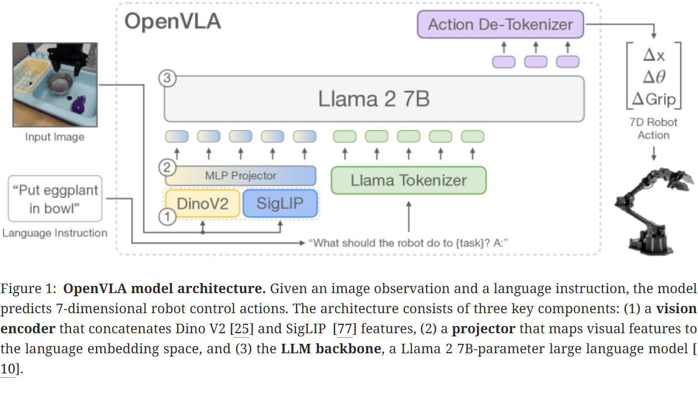

# Xiaomi-Robotics-0 论文分享：开源 SOTA 实时 VLA 是如何炼成的——兼论与 OpenVLA / π₀ / π₀.₅ 的本质区别

> **论文标题**：Xiaomi-Robotics-0: An Open-Sourced Vision-Language-Action Model with Real-Time Execution
> **发布形式**：Technical Report，arXiv 预印本，2026 年 2 月
> **作者**：Rui Cai, Jun Guo, Xinze He, Piaopiao Jin, Jie Li, Bingxuan Lin, Futeng Liu, Wei Liu, Fei Ma, Kun Ma, Feng Qiu, Heng Qu, Yifei Su, Qiao Sun, Dong Wang, Donghao Wang, Yunhong Wang, Rujie Wu, Diyun Xiang, Yu Yang, Hangjun Ye, Yuan Zhang, Quanyun Zhou
> **机构**：Xiaomi Robotics（小米机器人）
> **arXiv**：https://arxiv.org/abs/2602.12684
> **代码**：https://xiaomi-robotics-0.github.io（完全开源）

---

## 读之前先搞清楚

### 这篇论文要解决什么问题？

2024-2025 年，VLA（Vision-Language-Action）模型取得了惊人进展——π₀ 能叠衣服收桌子，π₀.₅ 能走进陌生家庭自主打扫，OpenVLA 让 7B 开源模型也能控制机器人。但这些模型有一个共同的致命短板：**推理太慢，机器人执行时"一顿一卡"**。

几十亿参数的 VLM 一次前向传播需要 80-200ms——对于需要 30-50Hz 高频控制的机器人来说，这意味着每 1 秒就要停顿 80ms。同步执行（等推理完→执行→停住→再推理）导致动作不连贯，像机器人跳机械舞。

异步执行（边推理边执行）可以消灭停顿，但引入了更隐蔽的问题：**前后两个 action chunk 在衔接处不一致**——上一个 chunk 的最后几步和下一个 chunk 的开头几步对不上，机械臂会"抖一下"（jerk），轻则影响精度，重则进入训练数据中不存在的异常状态，导致后续动作全部崩溃。

此外，还有一个隐藏得更深的问题：**catastrophic forgetting（灾难性遗忘）**。用机器人轨迹数据微调 VLM 后，VLM 在互联网上学到的视觉语义能力（看图问答、物体识别、OCR）会大幅退化。π₀ 训练后在这类 benchmark 上几乎全部归零——模型变成了一个"只会动、不会看"的机器人。

Xiaomi-Robotics-0 同时对这三个问题给出了完整的端到端解决方案。

> **小白理解**：VLA 模型目前像一个"聪明但反应慢的大胖子"——脑子很灵光（VLM 看图识字特别强），但身体跟不上（推理 80ms，机器人在那干等）。小米的方案是：让"脑子"和"身体"解耦——脑子（VLM）只看一次场景画张素描，身体（DiT）拿着素描自己反复推演 5 次怎么动。同时教身体学会了"接动作"——上一个动作的末尾和下一个动作的开头能平滑过渡。还通过特殊的训练数据配方，保住了脑子原本的"看图识字"能力。**结果：80ms 实时响应 + 动作不卡顿 + VLM 能力几乎无损——三项全都要。**

### 理解本文需要的背景：四大 VLA 模型速览

在深入 Xiaomi-Robotics-0 之前，先快速回顾它要对比的三个模型：

| | OpenVLA（2024） | π₀（2024.10） | π₀.₅（2025.04） | Xiaomi-Robotics-0（2026.02） |
|:---|:---|:---|:---|:---|
| **一句话** | 开源 7B VLM 驱动机器人 | Flow Matching 奠基，能做复杂长程任务 | 开放世界泛化，新家自主打扫 | 实时异步执行 + VL 能力保留，开源 SOTA |
| **VLM Backbone** | Prismatic-7B（Llama2+SigLIP+DINOv2） | PaliGemma 3B | PaliGemma 3B | Qwen3-VL-4B（更强 VLM） |
| **动作生成** | 离散分桶→自回归 token 预测 | Flow Matching（10步）+ Action Expert | Flow Matching（同 π₀） | Flow Matching（5步）+ DiT（VLM 冻结） |
| **实时性** | ❌ 同步执行，慢 | ❌ 同步执行，~200ms | ❌ 同步执行 | ✅ **80ms 异步执行，无停顿** |
| **VL 能力保留** | ❌ 未专门处理 | ❌ 几乎全部归零 | ❌ 严重退化 | ✅ **10 benchmark 几乎无损，ERQA 反超原版** |
| **开源** | ✅ 完全开源 | ❌ 闭源（π₀-FAST 部分开源） | ⚠️ 权重开源 | ✅ **完全开源** |
| **核心创新** | 双视觉编码器 + LoRA 微调 | MoE 架构 + Flow Matching | Co-training 多源数据 | MoT 架构 + VL co-training + Λ-attention 异步执行 |
| **论文解读** | [OpenVLA 深度解读](../OpenVLA/OpenVLA_paper_guide.md) | [π₀ 深度解读](../π0/pi0_paper_guide.md) | [π₀.₅ 深度解读](../π0.5/pi05_paper_guide.md) | [本文深度解读](./xiaomi_robotics0_paper_guide.md) |

> **小白理解**：如果把 VLA 比作汽车——OpenVLA 是第一辆"开源家用车"（能用但不快），π₀ 是"豪华跑车"（性能强但闭源且费油），π₀.₅ 是"越野版"（能去没去过的地方），Xiaomi-Robotics-0 是"自动驾驶+混动版"——跑得快（80ms）、不卡顿（异步）、还省油（保留 VLM 能力）、全部开源。

### 读懂这篇论文需要的前置知识

| 概念 | 简单解释 |
|:---|:---|
| **VLA（Vision-Language-Action）** | 输入图片+文字指令 → 输出机器人动作（关节角/末端位姿）的模型 |
| **Mixture-of-Transformers（MoT）** | 两个独立 Transformer 组合：一个 VLM 看图，一个 DiT 出动作 |
| **DiT（Diffusion Transformer）** | 用 Transformer 架构做去噪，从噪声一步步"雕刻"出精确动作 |
| **Flow Matching** | 从纯噪声到目标动作的最短直线路径，5-10 步即可去噪完成 |
| **KV Cache** | Transformer 推理时缓存的 Key/Value 矩阵，避免重复计算 |
| **Catastrophic Forgetting** | 用新任务数据训练后，模型忘记了之前学到的能力 |
| **Λ-Shape Attention Mask** | 只让前几步动作看上一段 prefix，后面强制看相机画面——防止模型"抄作业" |

---

## 背景：三种对比 VLA 模型的核心流程

在深入 Xiaomi-Robotics-0 之前，先快速了解它要对比的三个模型的推理流程。**理解它们各自的数据流和设计选择，才能理解 Xiaomi-Robotics-0 的改进"改在什么地方"。**

---

### OpenVLA：纯 VLM 直出动作（2024）



*图：OpenVLA 模型架构——融合视觉编码器（SigLIP+DINOv2）→ 投影器 → Llama 2 7B → 逐 token 自回归输出 7 个动作 token。*

```
  相机图（224×224）
      │
      ▼
  ┌─────────────────────────────┐
  │ 视觉编码器（SigLIP + DINOv2）│ → 融合特征
  └─────────────┬───────────────┘
                │ 投影器（2层MLP）
                ▼
  ┌─────────────────────────────────────────┐
  │ Llama 2 7B                               │
  │ 输入：[视觉token] + [指令token]           │
  │ 输出：逐 token 自回归生成 7 个动作 token  │
  │   "x=+3.7cm" → bin_142 → token_8942     │
  └─────────────────────────────────────────┘

  特点：动作离散化 256 bins → 串行生成 7 tokens → ~100ms/步，无 chunking
  取舍：简单直接、开源，但精度损失 + 速度慢
```

> 📖 [OpenVLA 深度解读](../OpenVLA/OpenVLA_paper_guide.md)

---

### π₀：VLM Backbone + Action Expert 一体化（2024.10）


*图：π₀ 框架总览——Pre-training mixture 包含 OXE Magic Soup + π dataset（7种机器人/68个任务），通过 VLM backbone（PaliGemma 3B）+ Action Expert（300M, Flow Matching）训练。*

```
  2-3张相机图 + 语言指令
      │
      ▼
  ┌─────────────────────────────────────────┐
  │ PaliGemma 3B VLM Backbone                │
  │ [image] + [text] + [state] → hidden      │
  └─────────────┬───────────────────────────┘
                │
                ▼
  ┌─────────────────────────────┐
  │ Action Expert（300M）        │
  │ Flow Matching 10步去噪       │
  │ 纯噪声 → 10步 → action chunk │
  │ （H=50步，覆盖1秒）           │
  └─────────────────────────────┘

  特点：连续动作无损精度，~200ms延迟，同步执行有卡顿
  取舍：精度高、能做复杂长程任务，但 VL 能力全丢、闭源
```

> 📖 [π₀ 深度解读](../π0/pi0_paper_guide.md)

---

### π₀.₅：Co-training 多源数据 + 两级推理（2025.04）

> ⚠️ π₀.₅ 主要通过技术博客发布，关键图表请参见 [原博客](https://www.pi.website/blog/pi05) 中的交互式可视化。

```
  架构同 π₀，区别在训练数据和推理方式：

  Level 1（高层）: [image] + "clean bedroom"
                    → VLM 自回归 → "pick up the pillow"
                       │
  Level 2（低层）: [image] + "pick up pillow" + [state]
                    → Action Expert + Flow Matching 10步
                    → action chunk → 执行 → 回到 Level 1

  训练数据：robot demo + web多模态 + verbal instructions + 100+家庭环境
  取舍：泛化强（新家零样本打扫），但 VL 能力严重退化、无实时性优化
```

> 📖 [π₀.₅ 深度解读](../π0.5/pi05_paper_guide.md)

---

> **三种模型的共同短板**：OpenVLA 精度低速度慢（离散化+自回归），π₀/π₀.₅ 能力强但 VL 能力全丢（一体化训练→catastrophic forgetting）且无法实时执行（同步~200ms卡顿）。**Xiaomi-Robotics-0 的设计出发点就是同时解决这三个问题。**

---

## 一、Xiaomi-Robotics-0 的解决思路

核心 idea：**三件事一起做，一件都不妥协。**

1. **实时性**：用 MoT 架构——大 VLM（Qwen3-VL-4B）只跑一次出"场景摘要"（KV Cache），轻量 DiT（300M）拿摘要反复推演 5 次出精确动作 → 总延迟 80ms
2. **动作平滑**：action prefix（告诉 DiT 上一段末尾怎么动的）+ Λ-attention（防止 DiT 偷懒抄 prefix）+ RoPE offset（区分已执行和待预测的动作）→ 异步执行无卡顿
3. **VL 能力保留**：训练时 6:1 混入 VL 数据（看图问答/检测/captioning）→ VLM 的视觉语义能力几乎完全保留，甚至在 ERQA 上反超原版

```
Xiaomi-Robotics-0 的三重创新：

┌──────────────────────────────────────────────────────────────┐
│ 创新 ①：MoT 架构 —— "脑子"和"身体"解耦                       │
│   Qwen3-VL-4B（frozen）→ KV Cache → DiT（300M, 5步去噪）     │
│   → 80ms 实时推理 + VLM 能力天然保护                          │
├──────────────────────────────────────────────────────────────┤
│ 创新 ②：异步执行三件套 —— Action Prefix + Λ-Attention + RoPE │
│   → 动作 chunk 间平滑过渡 + 防止 copypaste shortcut           │
├──────────────────────────────────────────────────────────────┤
│ 创新 ③：VL Data Co-training —— 6:1 混合图文数据               │
│   → Catastrophic forgetting 被完全消除                        │
│   → ERQA 具身推理得分反超原版 Qwen3-VL-4B                     │
└──────────────────────────────────────────────────────────────┘
```

> **小白理解**：之前的 VLA 想把所有事情交给一个"全能的脑子"（一个大 VLM 同时负责看图、理解指令、规划动作、输出关节角）——结果就是脑子一直在转，身体在那干等。小米的方案做了一个关键拆分：脑子（VLM）只需要"看一眼场景、给个摘要"，身体（DiT）拿着摘要自己反复推演"怎么动"。脑子只工作一次，身体工作 5 次——但因为身体很轻量（300M vs 4B），5 次加起来才 80ms。**这是典型的"让专业的人做专业的事"——VLM 擅长语义理解就只做语义理解，DiT 擅长连续生成就只做动作生成。**

---

## 二、核心设计：MoT 架构 —— VLM + DiT 的双 Transformer 组合

> 详细技术分析请参见 [Xiaomi-Robotics-0 论文深度解读](./xiaomi_robotics0_paper_guide.md)。以下为分享会重点。

Xiaomi-Robotics-0 不是一个大模型，而是**两个** Transformer 的组合（总 4.7B 参数）：

```
                        ┌─────────────────┐
   3 张相机图 +       → │    VLM          │ → KV Cache（最后 16 层）
   语言指令             │ Qwen3-VL-4B     │         │
                        │  32 层, 4B      │         │ Cross-Attention
                        │  ★ 冻结！       │         ▼
                        └─────────────────┘  ┌─────────────┐
   关节状态 +                              → │    DiT      │ → action chunk
   噪声动作                                  │  16 层, 300M │   (30 步关节角)
                                             │  ★ 可训练   │
                                             └─────────────┘
```

**两个模型的分工**：

| | VLM（Qwen3-VL-4B） | DiT（Diffusion Transformer） |
|:---|:---|:---|
| **职责** | 看图和指令，理解场景语义 | 基于场景理解，生成精确动作 |
| **参数量** | 4B（占 85%） | ~300M（占 15%） |
| **训练状态** | Step 1 训练，Step 2+3 冻结 | Step 2+3 训练 |
| **推理次数** | **1 次**（出一个 KV Cache） | **5 次**（Flow Matching 去噪） |
| **输入** | 3 张相机图 + 语言指令 | 关节状态 + 噪声动作 + VLM 的 KV Cache |
| **输出** | 最后 16 层的 KV Cache | 30 步去噪后的关节角度序列 |

**DiT 如何"问"VLM**：DiT 的每一层做三件事——
1. **Self-Attention**：31 个 token（[SINK] + 关节状态 + 30 步噪声动作）互相看，协调步间关系
2. **Cross-Attention**：Q=DiT token, K/V=VLM KV Cache——"这一步对应场景里哪个物体？"
3. **FFN + adaLN**：由去噪时间步 τ 控制归一化力度——τ≈0 大步去噪，τ≈1 微调精修

> **小白理解**：VLM 像作战参谋——看地图（相机图）、读作战指令（自然语言），画了张情报摘要（KV Cache）贴墙上就下班了。DiT 像前线指挥官——拿着情报摘要 + 部队当前位置（关节角），在沙盘上推演 5 次（5 步去噪），制定出 30 步精确行动方案。**参谋只工作一次，指挥官推演 5 次——这就是总延迟只有 80ms 的秘密。**

---

## 三、训练流程：三步走，从预训练到部署

> 完整训练细节（数据流转、Loss 设计、Choice Policies 机制、Flow Matching 数学推导）请参见 [深度解读文档](./xiaomi_robotics0_paper_guide.md)，以下为分享会主线。

### Step 1：Co-train VLM —— 图文能力 + 动作能力两手抓

**目标**：让 VLM 同时学会"看图理解"和"初步预测动作"，且不遗忘原有的 VL 能力。

**做法**：同一 batch 中 6 条机器人轨迹 + 1 条图文数据混合训练。机器人数据用 Choice Policies loss（N 选 1 + winner-takes-all），图文数据用标准 CE loss。两份 loss 加权求和，共享 VLM 参数。

**关键设计**：在 VLM 输入序列末尾插入 31 个可学习的"动作查询 token"（[A₁]...[A₃₀] + [S]），它们通过 Self-Attention 从图像和文本中提取动作信息，输出 5 套候选动作方案 + 自评分。

### Step 2：Freeze VLM, Train DiT —— Flow Matching 去噪训练

**目标**：解耦"场景理解"和"精确动作生成"。VLM 冻结，只训 DiT。

**做法**：VLM 前向一次出 KV Cache（场景摘要），冻住。DiT 接收噪声动作 + KV Cache，通过 16 层 Cross-Attention 查 VLM 的场景信息，预测"去噪方向" v_θ。Loss = ||v_θ - u||²，其中 u = a^{gt} - ε（从纯噪声直达真值的直线方向）。

**为什么只需要 5 步去噪**：Flow Matching 走直线最短路径，而非 Diffusion 的随机游走 → 5 步就能从纯噪声到可执行动作。

### Step 3：Post-training —— 异步执行训练

**目标**：让模型学会在异步执行（边推理边执行）时，动作 chunk 之间平滑衔接。

**三件套**：
- **Action Prefix**：推理 chunk #1 时，把 chunk #0 最后几步已执行动作拼接在 DiT 输入前 → DiT 知道"上一段末尾怎么动的"
- **Λ-Attention Mask**：只让前 w 步噪声动作看 prefix，后面强制看相机画面 → 防止 DiT "闭眼抄 prefix"
- **RoPE Position Offset**：给噪声动作 token 的位置索引 +10 → 区分"已执行的"和"待预测的"

---

## 四、推理流程：80ms 异步实时执行

部署时的一次完整推理循环：

```
时间轴（30Hz 控制，T=30步/chunk，T_e=10步触发下次推理）：

  t=0ms   VLM forward（1次，~60ms） → KV Cache 就绪
  t=60ms  DiT 5步去噪（~20ms） → action chunk #0（30步）
  t=80ms  机器人开始执行 chunk #0 ────────────────────→
  t=380ms 执行了 10 步 → 触发下一轮推理
          后台：VLM 重新 forward（利用最新相机画面）→ DiT 去噪 chunk #1
          ★ Action Prefix：chunk #1 的 DiT 输入拼接了 chunk #0 的后几步
          ★ Λ-Attention：前 2 步看 prefix，后续必须看新相机画面
  t=460ms chunk #1 就绪，chunk #0 还在执行中
  t=???ms chunk #1 无缝接上 chunk #0 末尾 → 机器人从未停顿！
```

**与同步执行的对比**：

| | 同步执行 | Xiaomi-Robotics-0 异步 |
|:---|:---|:---|
| 推理时机器人在干嘛 | 停住不动 | 继续执行上一个 chunk |
| 动作连续性 | 一顿一卡（机械舞） | 完全连续 |
| 延迟感受 | 每 1 秒卡 80ms | **无感知** |
| Chunk 衔接 | 天然衔接（停住时无运动） | **需要 Λ-attention 保证平滑** |

> **小白理解**：同步执行像看视频时每 1 秒缓冲一次——画面卡住，体验极差。异步执行像流媒体预加载——你看到第 10 秒时，第 11-12 秒已经在后台加载好了。小米的三件套确保"预加载的内容"和"当前播放的内容"之间没有跳跃、没有撕裂。

---

## 五、核心创新点

| 创新点 | 具体内容 | 为什么重要 |
|:---|:---|:---|
| **MoT 架构** | Qwen3-VL-4B（frozen）→ KV Cache → DiT（300M, 5步去噪） | VLM 只跑 1 次保护能力 + DiT 轻量保证实时（80ms） |
| **VL Data Co-training** | 80M VL + 200M robot timesteps，6:1 混合 | 几乎完全消除 catastrophic forgetting，ERQA 反超原版 |
| **Λ-Shape Attention Mask** | 前 w 步看 prefix，后续禁止看 prefix | 防止 copypaste shortcut，保持 visual-reactive |
| **Action Prefix + RoPE Offset** | Prefix 提供衔接上下文 + 位置偏移区分 | 异步执行平滑过渡，消除 jerk |
| **Choice Policies（Step 1）** | N 候选 + self-score + winner-takes-all L1 | VLM 原生架构最小改动支持多模态 action 预测 |
| **完全开源** | 权重/代码/数据配方全公开 | 社区可复现、可改进，推动 VLA 发展 |

---

## 六、实现细节 —— 论文中最重要的工程落地信息

> 本章汇总论文 implement 章节中的所有关键配置。这些数字决定了模型能否被复现、能否在实际硬件上部署——**不读这一章，你就不知道这个模型到底"重不重"、"贵不贵"、"能不能跑"**。

### 6.1 模型配置

| 配置项 | VLM（Qwen3-VL-4B） | DiT（Action Expert） |
|:---|:---|:---|
| **基础模型** | Qwen3-VL-4B（32 层 Transformer） | 从头训练的 16 层 DiT |
| **参数量** | ~4B | ~300M |
| **视觉编码** | ViT（SigLIP 初始化），3 张 224×224 RGB | 不直接处理图像 |
| **文本编码** | Qwen3 tokenizer，max 256 tokens | 不直接处理文本 |
| **动作维度** | 14 DoF（双臂 6-DoF × 2 + 手爪） | 同，输出 30 步 × 14 维 |
| **Hidden Dim** | 未见公开 | 未见公开 |
| **Attention Heads** | 未见公开 | 未见公开 |
| **总参数量** | — | — | **~4.7B**（VLM + DiT + Projector） |

### 6.2 训练配置

| 配置项 | Step 1（Co-train VLM） | Step 2（Train DiT） | Step 3（Post-training） |
|:---|:---|:---|:---|
| **训练步数** | 未见公开 | 40,000 steps | Lego: 40k / Towel: 80k |
| **Batch Size** | 未见公开 | **32,768**（全局） | **2,048** |
| **优化器** | 未见公开 | **AdamW** | AdamW |
| **学习率** | 未见公开 | 未见公开（含 warmup + cosine decay） | 未见公开 |
| **分布式框架** | 未见公开 | **DeepSpeed ZeRO-2** | DeepSpeed ZeRO-2 |
| **精度** | 未见公开 | 未见公开（推断为 BF16/FP16 混合精度） | 未见公开 |
| **可训练参数** | VLM 全部参数 | **仅 DiT**（VLM 冻结） | **全部解冻**（VLM + DiT） |

> **关键解读**：Step 2 的 batch size 高达 32,768——这需要数百张 GPU 的数据并行。对于大多数实验室来说，Step 1 和 Step 2 的计算成本是主要门槛。Step 3 的 batch=2,048 则相对可承受，适合在目标机器人上微调。

### 6.3 数据配置

| 配置项 | 详情 |
|:---|:---|
| **VL 数据量** | **80M samples**（来自开源 VL 数据集，经过三模型交叉验证 + VLM re-labeling 清洗） |
| **Robot 数据量** | **200M timesteps**（来自多种机器人+多种任务的遥操作演示） |
| **Step 1 混合比例** | VL : Robot = **1 : 6**（每个 batch 6 条 robot + 1 条 VL） |
| **Robot 数据来源** | 多种双臂机器人（含多个不同构型），多个操作任务 |
| **数据过滤** | 去除失败轨迹（success=0），仅保留成功和部分成功的演示 |
| **数据增强** | 随机裁剪、颜色抖动（±0.2）、光照变化 |
| **VL 数据清洗** | 三模型交叉验证（Qwen3-VL + 两个辅助 VLM）→ 不一致的样本送 GPT-4V re-label |

> **关键解读**：80M VL samples 的数据清洗管道是保证 VL 能力保留的关键——如果混入低质量 VL 数据，co-training 反而会损害 VLM 能力。三模型交叉验证 + re-labeling 的成本不低，但论文的消融实验证明了这笔投入的回报（ERQA 反超原版）。

### 6.4 动作预测配置

| 配置项 | Step 1（VLM 直接出动作） | Step 2+3（DiT 出动作） |
|:---|:---|:---|
| **Action Chunk 长度** | T = 30 步（1 秒 @30Hz） | T = 30 步 |
| **动作维度** | 14 DoF（双臂各 6 + 手爪各 1） | 同 |
| **生成方式** | Choice Policies：N=5 候选 + winner-takes-all | Flow Matching：5 步去噪 |
| **Flow Matching 步数** | 不适用（VLM 自回归出 token） | **5 步**（推理），10 步（训练稳定） |
| **Noise Schedule** | 不适用 | τ ~ Beta(1.5, 4.0) |
| **去噪路径** | 不适用 | 直线最短路径（条件 ODE） |
| **Loss** | L1（仅 winner）+ MSE（score） | MSE（v_θ vs u，u = a^{gt} - ε） |

### 6.5 异步执行配置（Step 3 Post-training）

| 配置项 | 设置 | 说明 |
|:---|:---|:---|
| **Action Chunk 长度 T** | 30 步（1 秒 @30Hz） | 一次推理出 1 秒的动作 |
| **执行触发步数 T_e** | 10 步 | 执行 10 步后触发下一次推理（重叠 20 步窗口） |
| **推理延迟** | ~80ms ≈ 3 步 | VLM(60ms) + DiT 5步(20ms) |
| **Action Prefix 长度 Δt_c** | 从 {0,1,2,3,4,5,6} 随机采样 | 训练时随机，推理时用实际执行的步数 |
| **Λ-Attention 窗口 w** | 未见公开（推测 2-3 步） | 前 w 步 noisy action 可看 prefix |
| **RoPE Position Offset** | **+10** | 噪声 action token 位置索引偏移 +10 |
| **推理时 DiT 去噪步数** | 5 步（比训练少） | 直线路径允许更少步数 |

### 6.6 推理部署配置

| 配置项 | 设置 | 说明 |
|:---|:---|:---|
| **VLM 推理次数** | **每 chunk 1 次** | 冻结的 VLM 只做一次前向传播 |
| **DiT 推理次数** | **每 chunk 5 次**（5 步去噪） | 轻量 DiT 5 次总计 ~20ms |
| **总推理延迟** | **~80ms**（VLM 60ms + DiT 20ms） | 这是论文报告的核心数字 |
| **控制频率** | 30Hz（每步 ~33ms） | 推理延迟 80ms ≈ 3 步，被重叠窗口完全吸收 |
| **异步执行模式** | 机器人执行中 GPU 并行推理 | 永不停顿 |
| **KV Cache 复用** | 每 chunk 重新 forward VLM | 利用最新相机画面，保证 visual-reactive |
| **硬件需求** | 推理：单张 GPU（如 A100/H100） | 4B VLM + 300M DiT 可单卡部署 |

> **小白理解**：实现细节章节是论文的"说明书"——告诉你这个模型要用多少 GPU、训练多久、数据怎么洗、推理有多快。**没有这些数字，再漂亮的实验结果都只是 PPT 模型**。Xiaomi-Robotics-0 的 Step 2 batch=32,768 告诉你"这需要大集群"，Step 3 batch=2,048 告诉你"微调只需要少量资源"，推理 80ms 告诉你"可以实时部署"——这些都是决定"能不能用"的关键信息。

---

## 七、实验结果

### 7.1 Simulation Benchmarks —— 三榜全面 SOTA

**LIBERO（4 个 split，灵巧操作标准测试）**：

| 方法 | Spatial | Object | Goal | Long | **Average** |
|:---|:---:|:---:|:---:|:---:|:---:|
| OpenVLA | 84.7 | 88.4 | 79.2 | 53.7 | 76.5 |
| π₀ | 96.8 | 98.8 | 95.8 | 85.2 | 94.2 |
| π₀.₅ | 98.8 | 98.2 | 98.0 | 92.4 | 96.9 |
| **Xiaomi-Robotics-0** | **99.5** | **99.3** | **97.8** | **98.3** | **98.7** |

**SimplerEnv（real-to-sim，视觉泛化测试）**：

| 方法 | Visual Matching | Variant Aggregation | WidowX |
|:---|:---:|:---:|:---:|
| OpenVLA | 24.5 | 30.0 | 1.0 |
| π₀ | 71.4 | 54.7 | — |
| **Xiaomi-Robotics-0** | **85.5** | **74.7** | **79.2** |

> **小白理解**：三个 benchmark 全部第一。LIBERO 上 Xiaomi-Robotics-0 平均 98.7%——几乎满分。SimplerEnv 的 Visual Matching 85.5% 比 π₀ 高 14 个百分点——证明了 VL co-training 带来的视觉泛化优势。

### 7.2 Real-Robot —— 双臂精密操作

| 方法 | Lego 成功率 | 吞吐量 |
|:---|:---:|:---:|
| π₀.₅ | ~85% | 中等 |
| X-Robotics-0 (Sync) | ~87% | 较高 |
| **X-Robotics-0 (Async)** | **~85%** | **最高** |

关键：异步方法在保持成功率的同时，吞吐量最高——因为机器人不需要停下来等推理。

### 7.3 VL 能力保留 —— 最重要的一张表

| Model | ERQA | SEED | MMBench | MME | MMMU |
|:---|:---:|:---:|:---:|:---:|:---:|
| Qwen3-VL-4B（原版） | 40.0 | 78.8 | 88.7 | 87.1 | 51.7 |
| π₀ | 0.0 | 0.0 | 0.0 | 0.1 | 0.1 |
| π₀.₅ | 0.0 | 21.5 | 22.1 | 0.0 | 19.9 |
| **Xiaomi-Robotics-0** | **40.8** | **78.6** | **84.4** | **81.8** | **46.2** |
| X-Robotics-0 (w/o VL) | 0.0 | 0.0 | 0.0 | 0.0 | 0.0 |

> **核心结论**：π₀ 和 w/o VL data 的 Xiaomi-Robotics-0 在 VL benchmark 上全部归零——**没有 VL co-training = 必死**。π₀.₅ 的 co-training 有一定保留效果但远不完美。Xiaomi-Robotics-0 全面大幅领先，ERQA 甚至**反超原版 Qwen3-VL-4B**（40.8 vs 40.0）。**这是目前唯一一个在 robot 训练后 VL 能力几乎无损的 VLA 模型。**

---

## 八、与 OpenVLA / π₀ / π₀.₅ 的核心区别

> 本章是分享会的核心——说清楚 Xiaomi-Robotics-0 和三个主要对比模型的本质不同。

### 8.1 六维度全景对比

| 维度 | OpenVLA | π₀ | π₀.₅ | **Xiaomi-Robotics-0** |
|:---|:---|:---|:---|:---|
| **训练范式** | 模仿学习：离散动作 token → 自回归预测 | 模仿学习：Flow Matching 连续动作生成 | 模仿学习 + Co-training 多源数据 | **模仿学习 + VL co-training + 异步训练** |
| **模型架构** | 单一 VLM（Prismatic-7B），动作 token 化 | VLM backbone + Action Expert（MoE，同一模型内） | 同 π₀ 架构 | **MoT：VLM（frozen）+ DiT（trainable），两个独立 Transformer** |
| **动作生成** | 离散分桶 256 bins → 逐 token 自回归 | Flow Matching 10 步，连续动作 | 同 π₀ | **Flow Matching 5 步，连续动作，VLM 只出 KV Cache** |
| **实时性方案** | 无（同步执行，纯学术验证） | 无（同步执行，~200ms 延迟） | 无（同步执行） | **异步执行三件套：prefix + Λ-attn + RoPE offset** |
| **VL 能力保留** | ❌ 未专门处理 | ❌ **全零**（10/10 benchmark 归零） | ❌ **严重退化** | ✅ **几乎无损**，ERQA 反超原版 |
| **开源程度** | ✅ 完全开源 | ❌ 闭源（仅 π₀-FAST 部分开源） | ⚠️ 权重开源 | ✅ **完全开源**（权重+代码+数据配方） |
| **推理速度** | 慢（7B 每次 forward） | ~200ms（3B VLM + Flow Matching 10步） | 同 π₀ | **80ms**（4B VLM 1次 + DiT 5步） |
| **异步执行** | ❌ | ❌ | ❌ | ✅ **原生支持** |
| **LIBERO Avg** | 76.5 | 94.2 | 96.9 | **98.7** |
| **SimplerEnv VM** | 24.5 | 71.4 | — | **85.5** |

> 这张表揭示了 VLA 领域的一个核心 trade-off：**开源 vs 性能 vs 实时性，此前没有任何模型三者兼得**。OpenVLA 开源但性能弱，π₀/π₀.₅ 性能强但闭源且慢，Xiaomi-Robotics-0 是第一个在三个维度同时达到 SOTA 或接近 SOTA 的模型。

### 8.2 架构差异的本质：一体化 vs 解耦

这是 Xiaomi-Robotics-0 和 π₀/π₀.₅ 最根本的哲学分歧——也是理解为什么 π₀ 会"失忆"而 Xiaomi 不会的关键。

**π₀ / π₀.₅ 的"一体化"思路**：

```
  ┌─────────────────────────────────────────┐
  │          一个大 VLM（PaliGemma 3B）       │
  │                                          │
  │  图像 → ViT ─┐                           │
  │  文本 → Emb ─┤→ 32层 Transformer ─┬→ LM Head（文本输出，仅π₀.₅）
  │  状态 → Proj ─┘                   └→ Action Expert（Flow Matching）
  │                                          │
  │  ★ 所有参数一起训练，梯度流遍整个模型      │
  └─────────────────────────────────────────┘
  
  问题根源：
  ① 语义梯度（来自 VL pre-training 的权重方向）和动作梯度（来自 robot demo）
     在 VLM backbone 中叠加 → 动作梯度强度远大于语义梯度
     → 语义权重被"冲刷" → catastrophic forgetting
  ② 每帧都需要跑完整的 3B VLM → 推理 ~200ms
  ③ VLM 训练和 Action Expert 训练耦合 → 调 VL 能力影响动作，调动作影响 VL
```

**OpenVLA 的"纯 VLM"思路**：

```
  ┌──────────────────────────────────────────┐
  │      一个大 VLM（Prismatic-7B）           │
  │                                           │
  │  图像 → SigLIP+DINOv2 ─┐                  │
  │  指令 → Tokenizer ─────┤→ Llama 2 7B ─→ 动作 token（256 bins）
  │                         │   32层          │
  │  ★ 动作被"文字化"——连续值→离散bin→token  │
  └──────────────────────────────────────────┘
  
  问题根源：
  ① 离散化损失精度：7 维连续动作 × 256 bins = 每个维度只有 256 个可选值
     → bin 边界处的微小差异被量化误差淹没
  ② 自回归逐 token 生成：第 2 步动作必须等第 1 步生成完
     → 无法并行，7 个 token 串行 → 慢
  ③ 7B 参数全量前向 → 推理开销大，无实时性优化
```

**Xiaomi-Robotics-0 的"解耦"思路**：

```
  ┌──────────────────────┐       ┌──────────────────────┐
  │ VLM (Qwen3-VL-4B)    │       │  DiT (300M)          │
  │ 32层 Transformer     │       │ 16层 Transformer     │
  │                      │       │                      │
  │ 图像→ViT→256 tokens  │       │ [SINK]+状态+噪声动作 │
  │ 文本→Emb→64 tokens   │       │   ↓                  │
  │   ↓                  │       │ Self-Attention       │
  │ 前向传播（仅1次）    │       │   ↓                  │
  │   ↓                  │ KV    │ Cross-Attention ←───┤
  │ 最后16层 KV Cache ───┤──────→│ （查VLM的场景信息）  │
  │                      │ Cache │   ↓                  │
  │ ★ 冻结！梯度不回传   │       │ FFN + adaLN          │
  │ ★ 只输出"场景摘要"   │       │   ↓                  │
  └──────────────────────┘       │ 预测去噪方向 v_θ     │
                                  │   ↓                  │
                                  │ 5步去噪 → action     │
                                  │                      │
                                  │ ★ 全部可训练         │
                                  └──────────────────────┘
  
  优势：
  ① VLM 冻结 → 语义权重完全不被动 → VL 能力天然保护
  ② VLM 只跑1次 → 60ms；DiT 5次去噪 → 20ms；总80ms
  ③ 解耦训练：Step1 VLM学粗略，Step2 DiT学精准，互不干扰
  ④ 替换 VLM backbone 容易（换更大的 Qwen 即可）
```

> **小白理解**：三种架构对应三种组织架构——π₀ 是"全栈工程师"（一个人干所有活，累死还每样干不好），OpenVLA 是"文科生当工程师"（用文字的方式做数学计算，精度和效率都打折扣），Xiaomi-Robotics-0 是"分析师+技工"（分析师只出报告，技工拿着报告精准执行，各司其职高效协作）。

### 8.3 训练数据策略对比：四條完全不同的路

四个模型对"给 VLA 喂什么数据"这个核心问题给出了截然不同的答案：

| 维度 | OpenVLA | π₀ | π₀.₅ | **Xiaomi-Robotics-0** |
|:---|:---|:---|:---|:---|
| **数据来源** | Open X-Embodiment（970k 条，20+ 种机器人） | 自采 10,000h（7 种机器人，68 个任务） | π₀ 数据 + web 多模态 + 100+ 家庭 + 口头指导 | 自采 200M timesteps + 80M VL samples |
| **数据类型** | 纯 robot demo | 纯 robot demo（高质量遥操作） | **5 类混合**（robot + web + verbal + detection + subtask） | **2 类混合**（robot + VL，6:1） |
| **数据策略哲学** | "量大管饱"——多用开源数据 | "质量优先"——自己采高质量 | "多样性为王"——越多不同类型越好 | "保住根基"——robot 学动作，VL 保常识 |
| **VL 数据角色** | 无（仅依赖 VLM 预训练权重） | 无（预训练后立即被遗忘） | 有（但混在 5 类中，占比不够 → 仍有严重遗忘） | **核心角色**（6:1 黄金比例 + 三模型交叉验证清洗） |
| **catastrophic forgetting 处理** | 未关注 | 未关注（全部归零后才被发现） | 部分缓解（co-training 有一定效果但不完美） | **系统性解决**（冻结 VLM + VL co-training，ERQA 反超原版） |

> 关键洞察：π₀.₅ 和 Xiaomi-Robotics-0 都用了 co-training，但效果天差地别。原因在于：**π₀.₅ 的 VLM 仍在训练中（未冻结），VL 梯度被更强的 robot 梯度淹没；Xiaomi 的 VLM 冻结 + VL co-training 在 Step 1 打好基础后就不再动。** 这是一个看似微小但决定性的架构差异。

### 8.4 实时性方案的三条路线：谁在解决"卡顿"问题

| | OpenVLA | π₀ / π₀.₅ | **Xiaomi-Robotics-0** |
|:---|:---|:---|:---|
| **路线** | **忽略**：学术验证，不考虑延迟 | **承受**：同步执行，~200ms 卡顿 | **消灭**：异步执行，0ms 感知卡顿 |
| **推理频率** | 每步推理（~100ms/步） | 每 chunk 推理（~200ms/chunk） | 每 chunk 推理（80ms/chunk），chunk 间重叠 |
| **机器人在推理时** | 停住等 | 停住等 | **继续执行上一个 chunk** |
| **chunk 衔接问题** | 单步预测，无衔接问题 | 无衔接机制（同步执行天然衔接） | **三件套解决**：prefix + Λ-attn + RoPE |
| **是否可部署** | 仅研究 | 演示级 | **产品级**（全天运行不中断） |

> 核心观点：**实时性不是"锦上添花"——它是 VLA 从实验室走向产品的门槛。** 一个每 1 秒卡 80ms 的机器人在叠毛巾时会抖、在拆 Lego 时会偏、在端咖啡时会洒。Xiaomi-Robotics-0 是第一个把实时性作为一等公民来设计的 VLA。

### 8.5 设计哲学分歧：为什么它们选了不同的路

| 设计选择 | OpenVLA 的选择 | π₀/π₀.₅ 的选择 | Xiaomi-Robotics-0 的选择 | 背后的原因 |
|:---|:---|:---|:---|:---|
| **动作表示** | 离散化（256 bins） | 连续（Flow Matching） | 连续（Flow Matching） | OpenVLA 目标是"最小改动让 VLM 出动作"，离散化是最简方案；π₀ 和 Xiaomi 都认为连续动作不该离散化 |
| **VLM 角色** | 唯一模型（端到端） | 主模型 + 轻量 head | **信息源**（只出 KV Cache） | π₀ 追求统一简洁；Xiaomi 追求专业分工 |
| **VLM 是否冻结** | 不冻结（全量微调） | 不冻结 | **冻结** | 冻结是 Xiaomi 保护 VL 能力的核心手段，其他模型没意识到这个需求 |
| **数据策略** | 多用开源现成数据 | 自己采集高质量数据 | 自采 + 开源 VL 混合 | OpenVLA 学术驱动，π₀ 质量驱动，Xiaomi 兼顾质量与 VL 能力 |
| **实时性** | 不关注 | 不关注 | **一等公民** | Xiaomi 面向产品部署，实时性是硬需求 |
| **开源态度** | 完全开源（学术使命） | 闭源（商业保护） | **完全开源**（生态建设） | 不同的商业策略 |

> 这些设计选择不是"谁对谁错"——每个选择都反映了团队的核心目标和约束。OpenVLA 要证明"VLM 能驱动机器人"，π₀ 要证明"VLA 能做复杂长程任务"，π₀.₅ 要证明"VLA 能泛化到新环境"，Xiaomi-Robotics-0 要证明"VLA 能实时、可靠、可部署"。**理解每个模型的"要证明什么"，才能真正理解它们的每一个设计选择。**

### 8.6 一张图总结四大模型的定位

```
VLA 模型的能力雷达图（定性）：

                    VL 能力保留
                         ▲
                       5 │    ★ Xiaomi-Robotics-0
                         │   /
                       4 │  /
                         │ /
                       3 │/        ○ π₀.₅
                         │        /
                       2 │       /
                         │      / 
                       1 │  ○ OpenVLA
                         │ /       
                       0 ├/─────────────→ 实时性
                         ★ π₀           (推理延迟)
                         (全零)
                         
  ★ = 优秀   ○ = 一般   ✗ = 差

  Xiaomi-Robotics-0：唯一同时占据"VL能力保留"和"实时性"双高点的模型
  π₀ / π₀.₅：强在任务复杂度/泛化，但 VL 能力和实时性双双不足
  OpenVLA：开源贡献巨大，但性能和实时性都只是起点
```

---

## 九、在整个领域的位置

```
VLA 模型演进 —— 从"能用"到"好用"到"实时"：

  RT-2 (2023)              OpenVLA (2024)           π₀ (2024)
  离散动作, 55B闭源         开源 7B VLA baseline     Flow Matching 奠基
      │                        │                     │
      └──────────┬─────────────┘                     │
                 │                                   │
          π₀-FAST (2025)                        π₀.₅ (2025)
          autoregressive action                 开放世界泛化
                 │                                   │
                 └──────────────┬────────────────────┘
                                │
                      ┌─────────┴─────────┐
                      │                   │
              GR00T-N1 (2025)      Xiaomi-Robotics-0 (2026) ← 我们在这
              NVIDIA 通用人形       • 异步实时执行 80ms
                                    • VL 能力几乎完全保留
                                    • MoT 架构（VLM+DiT 解耦）
                                    • Λ-attention 防 shortcut
                                    • 完全开源，三榜 SOTA
```

---

## 十、局限性

| 局限性 | 为什么是局限 | 对应用的影响 |
|:---|:---|:---|
| **仅在双臂任务上验证** | Real-robot 只覆盖 Lego + Towel，更多任务泛化未证明 | 部署到新任务需要额外验证 |
| **异步执行在精密任务上略逊同步** | Lego Disassembly 中异步成功率略低（~85% vs ~87%） | 极高精度场景可能需要同步模式 |
| **依赖高质量 VL data annotation** | 三模型交叉验证 + VLM re-labeling 成本高 | 其他团队复现数据准备门槛较高 |
| **DiT causal attention 可能限制全局一致性** | 后续 action 不能看前面 action | 复杂轨迹规划可能受限于此 |
| **未探索更大规模 VLM** | 只用了 Qwen3-VL-4B | 更大 backbone 是否带来 scaling gain 未知 |

---

## 十一、一句话总结

> **Xiaomi-Robotics-0 = 实时性（MoT 80ms）+ VL 能力保留（6:1 co-training）+ 异步平滑（Λ-attention 三件套）+ 完全开源 —— 四项合一，在三个仿真 benchmark 上全面 SOTA，在真实双臂任务上实现高吞吐量实时控制。与 OpenVLA 比开源更强，与 π₀/π₀.₅ 比更快且 VL 能力不丢，是当前"最工程可用的开源 VLA"。**

---

## 参考资料

- **本文深度解读**：[Xiaomi-Robotics-0 论文深度解读](./xiaomi_robotics0_paper_guide.md)
- **对比模型解读**：[OpenVLA 深度解读](../OpenVLA/OpenVLA_paper_guide.md) | [π₀ 深度解读](../π0/pi0_paper_guide.md) | [π₀.₅ 深度解读](../π0.5/pi05_paper_guide.md)
- Xiaomi-Robotics-0 论文：https://arxiv.org/abs/2602.12684
- Xiaomi-Robotics-0 项目页面：https://xiaomi-robotics-0.github.io
- OpenVLA 论文：https://arxiv.org/abs/2406.09246
- π₀ 论文：https://arxiv.org/abs/2410.24164
- π₀.₅ 博客：https://www.pi.website/blog/pi05
- Qwen3-VL：https://arxiv.org/abs/2511.21631
- Flow Matching：Lipman et al., arXiv 2022
