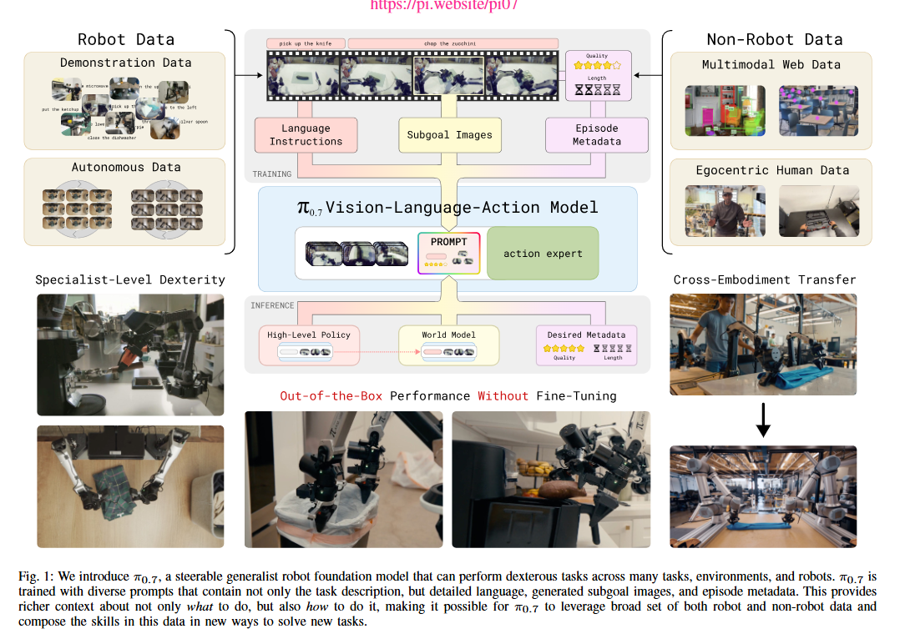
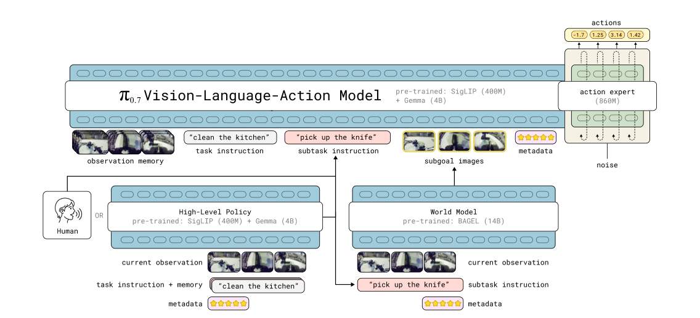
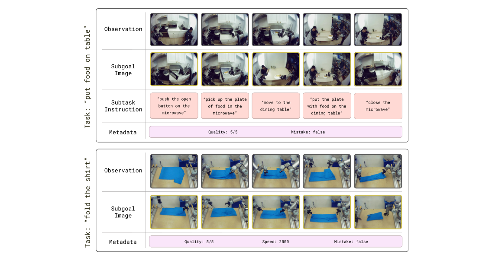

# π0.7 论文导读：用多模态 prompt 让一个模型统一所有技能——涌现组合泛化与可操控性

> **论文标题**：π0.7: a Steerable Model with Emergent Capabilities（Technical Report + Blog）
> **发布形式**：Technical Blog + PDF Report，2026 年 4 月 16 日
> **作者**：Physical Intelligence Team
> **机构**：Physical Intelligence（π）
> **博客**：https://www.pi.website/blog/pi07
> **论文 PDF**：https://www.pi.website/download/pi07.pdf

> ⚠️ **说明**：π0.7 通过技术博客 + PDF report 发布。关键图表、交互式可视化和完整实验视频请参见[原博客](https://www.pi.website/blog/pi07)。

---

## 读之前先搞清楚

### 这篇论文要解决什么问题？

π*0.6 展示了 RL 训练的威力——做咖啡、叠衣服、装纸箱，又快又好。但它是 **per-task specialist**：做咖啡的模型不会叠衣，叠衣的模型不会装纸箱。如果你要部署一个在家庭/工厂环境中能处理多种任务的机器人，你需要切换多个 specialist 模型——这在工程上很麻烦且不可扩展。

π0.7 的目标：**一个模型，不做 fine-tune，直接 out-of-the-box 做好所有任务——包括训练中从未见过的全新任务。** 这是 VLA 领域此前从未实现过的"组合泛化（compositional generalization）"——像 LLM 能把"翻译"+"JSON格式化"组合成"JSON格式的翻译"一样，VLA 能把"操作抽屉"+"叠衣服"组合成"从抽屉取出衣服然后叠好"。

**三个关键证据**：

1. **操作空气炸锅**：训练数据中没有"用空气炸锅做红薯"的完整任务，只有少数"关闭炸锅"的片段。π0.7 通过 language coaching 成功完成了整个序列。
2. **UR5e 双臂叠衣服**：训练数据中从未有过 UR5e 工业机器人叠衣的示范。π0.7 将其从其他机器人学到的"叠衣策略"与从 UR5e 其他任务学到的"操控特性"组合起来，零样本叠衣成功率 = 375 小时经验的人类遥操作专家水平。
3. **单模型超越所有 RL 专家**：同一个 π0.7 模型在叠衣（T恤+短裤+hardest items）、做咖啡、装纸箱四个任务上，达到甚至超过 π*0.6 per-task RL specialist 的水平。

> **小白理解**：π*0.6 像三个专科学历的专家——咖啡师只会做咖啡、洗衣工只会叠衣、包装工只会装盒。π0.7 像一个大厨——所有活都能干，而且不需要重新培训（fine-tune），看到新工具（空气炸锅）还能自己琢磨怎么用。这就是从"专用工具"到"通用大脑"的质变。

### π₀ vs π0.7：一张表看懂核心区别

π₀ 是 π 系列的第一代（2024.10），证明了 VLA 的可行性。π0.7 是第三代（2026.04），实现了此前被认为不可能的能力——**组合泛化 + 可操控 + 单模型超越 RL 专家**。这不是简单的"更强"，而是一次能力范式的跃迁。

| 维度 | π₀ | π0.7 |
|:---|:---|:---|
| **训练范式** | 模仿学习（IL）——看示范→模仿 | **多模态 prompt conditioning**——学会每个维度的独立含义，推理时自由组合 |
| **Prompt 能力** | 单一语言指令（"fold the laundry"） | **五维 prompt**：语言 + quality/speed metadata + control mode + visual subgoal + observation memory |
| **任务范围** | Foundation model：一个模型做多任务，但每个任务独立 fine-tune | **一个模型 out-of-the-box** 做所有任务，包括训练中未见过的组合任务 |
| **泛化类型** | 同一环境内跨任务 | **组合泛化**："开抽屉"+"叠衣"→"从抽屉取衣叠好"（涌现能力） |
| **新机器人适应** | 需 fine-tune | **零样本 cross-embodiment**：UR5e 工业臂从未叠过衣，首次成功率 = 375h 人类专家 |
| **可控性** | 无（只能指定做什么） | **Steerable**：可指定 quality（高/中/低）、speed（快/正常/慢）、control mode |
| **与 RL 专家关系** | 无 RL 组件 | **RECAP Distillation**：将 π*0.6 RL 专家的经验蒸馏进统一模型 → 单模型持平/超越所有 per-task specialists |
| **World Model** | 无 | **轻量 World Model**：根据语言指令生成 visual subgoal 图像 |

> **小白理解**：π₀ 像一个遥控玩具车——你只能告诉它"往前走"。π0.7 像一个全功能自动驾驶——你可以设定目的地（语言）、驾驶风格（激进/平稳）、速度限制、甚至给它看一张目的地的照片（visual subgoal）。最关键的是，π0.7 能把你教给它的"转弯"和"倒库"两个技能自动组合成"侧方位停车"——而你从未教过它侧方位停车。

### 读懂这篇论文需要的前置知识

| 概念 | 简单解释 |
|:---|:---|
| **Compositional Generalization（组合泛化）** | 把学过的不同能力重新组合，解决从未见过的新问题 |
| **Multimodal Prompt（多模态提示）** | 不只是文字指令，还包括视觉子目标图、质量/速度 metadata、控制模式标签 |
| **Visual Subgoal（视觉子目标）** | 一张图，展示"这一步做完后画面应该长什么样"——比文字精确得多 |
| **World Model（世界模型，轻量）** | 输入当前观测 + 语言子任务 → 生成期望的子目标图像 |
| **Steerable（可操控）** | 不只告诉模型"做什么"，还能指定"怎么做、做多快、做多好" |
| **RECAP Distillation（RECAP 蒸馏）** | 把 π*0.6 RL 专家的经验数据通过 metadata conditioning 蒸馏进统一模型 |
| **Cross-Embodiment（跨形态迁移）** | 在不同形态的机器人之间迁移技能 |

---

## 一、π0.7 的解决思路

核心 idea：**通过在训练时给 prompt 加入多种维度的 conditioning 信息（语言指令 + quality/speed metadata + 控制模式标签 + 视觉子目标图），让模型理解"不只是做什么，还有怎么做"——这"解耦"了任务的不同方面（目标 vs 标准 vs 方式 vs 空间位置），使学到的技能可以在这些维度上自由重组。推理时，通过设置这些 conditioning 值精确控制模型的行为。**



*图1：We introduce π0.7, a steerable generalist robot foundation model——图中展示 π0.7 能处理的多种灵巧操作任务（叠衣、做咖啡、装纸箱、操作空气炸锅等），体现其作为通用基础模型的"开箱即用"能力。右侧展示了模型的可操控性（steerability）——通过调整 prompt 中的 quality/speed 等 metadata 精确控制行为。*

```
π*0.6 的 prompt（只能做一件事）：
  "fold the laundry" → 用默认策略叠，无法控制速度/质量

π0.7 的多模态 prompt（精确控制所有维度）：
  ┌──────────────────────────────────────────────────────────┐
  │ Language: "fold the t-shirt and place it on the stack"  │ ← 做什么
  │ Metadata: quality=high, speed=fast                       │ ← 做多好、做多快
  │ Control Mode: end-effector control                       │ ← 用什么控制方式
  │ Visual Subgoal: [一张折好的T恤叠在衣物堆上的图]           │ ← 精确空间目标
  │ Observation Memory: [过去 K 步的画面序列]                │ ← 时序上下文
  └──────────────────────────────────────────────────────────┘

为什么这能实现组合泛化？

  训练时，模型学会了每个 conditioning 维度的独立含义：
    "quality=high"    → 动作更精准、更慢、更小心
    "quality=low"     → 动作更快但粗糙
    "speed=fast"      → 减少等待、加速执行
    "subgoal image"   → 精确空间布局目标
    "end-effector ctrl"→ 用末端位姿控制而非关节角度
    
  推理时，这些维度可以自由组合：
    "air fryer task" + "speed=medium" + "quality=high" + subgoal images
    → 模型从未见过这个组合，但能正确执行
    → 因为它分别理解每个维度的含义！
```

> **小白理解**：就像学开车时，教练不是只说"开车去超市"，而是说"用 40km/h 的速度（speed=medium），保持车道居中（quality=high），自动挡模式（control mode），目标是导航上那个红点（visual subgoal）"。你把"速度控制"、"车道保持"、"自动挡操作"、"看导航"这几项能力分别学会后，不管目的地是超市还是机场——组合起来就行。π0.7 的 conditioning 框架就是让 VLA 以这种方式学习。

> 交互式可视化及完整实验视频请参见[原博客](https://www.pi.website/blog/pi07)。

---

## 二、π0.7 核心设计



*图2：Architecture overview——π0.7 是一个 5B 参数的 VLA，由三部分组成：(1) 4B VLM backbone 处理多模态 prompt，(2) MEM-style video history 编码器提供时序上下文，(3) 860M Action Expert（Flow Matching）输出连续 action chunk。World Model 作为轻量 decoder 生成 visual subgoal images。*

---

### 模型结构与架构

在讲设计之前，先搞清楚**物理上**有哪些模块、各多少参数、怎么连接、用什么方法训练。

#### 整体架构总览

论文 Fig.2 画的是一个清晰的**线性流水线**——所有输入编码后拼接成一条 token 序列，流经 VLM Backbone，然后 Action Expert 解码出动作：

```
                        ┌────────────────────────────┐
                        │       输入: 多模态数据       │
                        └────────────┬───────────────┘
                                     │
        ┌────────────────────────────┼────────────────────────────┐
        │                            │                            │
        ▼                            ▼                            ▼
┌──────────────────┐    ┌──────────────────────┐    ┌──────────────────────┐
│ 相机观测          │    │ 文本指令              │    │ Metadata + 控制模式  │
│ 最多4路×6帧历史  │    │ subtask + task desc  │    │ speed/quality/      │
│ 448×448 RGB     │    │                      │    │ mistake/ctrl_mode   │
└────────┬─────────┘    └──────────┬───────────┘    └──────────┬───────────┘
         │                         │                           │
         ▼                         ▼                           ▼
┌──────────────────┐    ┌──────────────────────┐    ┌──────────────────────┐
│ ① MEM Encoder    │    │ ② Text Tokenizer     │    │ ② Embedding 查表     │
│ (~400M, ViT)     │    │ (Gemma3 自带)        │    │ 离散值→向量          │
│                  │    │                      │    │                      │
│ 输出:             │    │ 输出:                │    │ 输出:                │
│ obs_tokens       │    │ text_tokens          │    │ meta_tokens          │
│ (N_obs, 4096)   │    │ (N_txt, 4096)        │    │ (N_meta, 4096)       │
└────────┬─────────┘    └──────────┬───────────┘    └──────────┬───────────┘
         │                         │                           │
         │  subgoal 图像也走        │                           │
         │  同一个 MEM Encoder     │                           │
         │  → subgoal_tokens       │                           │
         │                         │                           │
         └─────────────────────────┼───────────────────────────┘
                                   │
                                   ▼
                        ┌──────────────────────┐
                        │ Token 拼接            │
                        │ [obs │ subgoal │     │
                        │  text │ meta │ ctrl] │
                        │ → (L, 4096)          │
                        │ 被dropout的维度→[MASK]│
                        └──────────┬───────────┘
                                   │
                                   ▼
                        ┌──────────────────────────────────────────┐
                        │  ③ VLM Backbone: Gemma3 4B              │
                        │  ~32-36 层 Transformer Decoder           │
                        │  每层: Self-Attention(所有token互看)     │
                        │        → FFN (SwiGLU)                    │
                        │  输出: hidden states (L, 4096)            │
                        └──────────────────┬───────────────────────┘
                                           │  hidden states
                                           ▼
                        ┌──────────────────────────────────────────┐
                        │  ④ Action Expert: 860M                   │
                        │  ~12-16 层 Transformer                   │
                        │  输入: 50个 action_noisy tokens           │
                        │        + timestep τ (Adaptive RMSNorm)   │
                        │  每层: Self-Attn(50 tokens双向)          │
                        │        → Cross-Attn(Q←action, K,V←VLM)  │
                        │        → FFN (SwiGLU)                    │
                        │  输出: v_pred (50, action_dim)           │
                        └──────────────────┬───────────────────────┘
                                           │
                                           ▼
                        ┌──────────────────────────────────────────┐
                        │  Flow Matching 去噪（不是模块，是方法）   │
                        │  a_{k-1} = a_k + v_pred × Δt            │
                        │  5步: a_5→a_4→a_3→a_2→a_1→a_0           │
                        │  最终: a_0 = 50步 action chunk           │
                        └──────────────────────────────────────────┘
```

#### 四个物理模块

##### ① MEM Encoder（视觉编码器，~400M）

| 属性 | 值 |
|:---|:---|
| **架构** | ViT (Vision Transformer) + temporal/spatial pooling |
| **层数** | ⚠️ 论文未披露（典型 ViT: 12-24 层） |
| **初始化** | 从 Gemma3 的视觉编码器权重初始化 |
| **输入** | 观测: 最多 4 相机 × 6 帧历史 × 448×448 RGB；Subgoal: 最多 3 张 × 448×448 |
| **输出** | 固定数量的视觉 tokens: obs_tokens `(B, N_mem, 4096)`, subgoal_tokens `(B, N_subgoal, 4096)` |
| **核心设计** | 时间+空间双重压缩——无论输入多少帧，输出 token 数恒定。历史帧以 stride=1s 采样，整段以 0.3 概率 drop |

##### ② Text Tokenizer + Embedding（文本编码，非独立模型）

| 属性 | 值 |
|:---|:---|
| **是什么** | Gemma3 自带的 tokenizer + 词嵌入表——不是独立的 Transformer 编码器 |
| **输入** | 文本字符串：子任务指令 `ℓ̂_t`（如 "fold the left sleeve"）+ 总任务描述 `ℓ_t` |
| **处理** | tokenizer 切分为 subword tokens → embedding 表查向量 → text_tokens `(N_txt, 4096)` |
| **去向** | text_tokens 和其他 token 拼接后一起进入 ③ VLM Backbone |
| **关键** | Gemma3 是**统一的** VLM——文本和图像在同一个 Transformer 里处理，没有独立的 "text encoder tower" |

> 这和 CLIP（独立的 text encoder + image encoder）不同。Gemma3 是一个 Decoder-only Transformer，文本和视觉 token 在同一序列中通过 Self-Attention 交互。

##### ③ VLM Backbone（多模态融合，4B）

| 属性 | 值 |
|:---|:---|
| **架构** | Transformer Decoder-only（Gemma3），⚠️ ~32-36 层，d_model=4096 |
| **初始化** | Gemma3 预训练权重（Google 在海量图文数据上训好的 VLM） |
| **输入** | 所有 token 拼接: `[obs │ subgoal │ text │ meta │ ctrl]` → `(B, L, 4096)` |
| **每层操作** | RMSNorm → Multi-Head Self-Attention（所有 token 互相看）→ FFN (SwiGLU)，均有 residual |
| **输出** | 每层的 hidden states `(B, L, 4096)`，供 ④ Action Expert 交叉注意 |
| **角色** | 唯一的"大脑"——所有模态的信息在这里融合，但**不直接输出动作** |

##### ④ Action Expert（动作解码器，860M）

| 属性 | 值 |
|:---|:---|
| **架构** | Transformer，⚠️ ~12-16 层，d_model=4096 |
| **初始化** | ⚠️ 论文未明确 |
| **输入** | `action_noisy` `(B, 50, action_dim)` + timestep τ + VLM hidden states `(B, L, 4096)` |
| **每层操作** | Adaptive RMSNorm(action, τ) → Self-Attention (50 token 双向) → Cross-Attention (Q←action, K,V←VLM hidden) → FFN (SwiGLU) |
| **最终输出** | Linear(4096→action_dim) → `v_pred` `(B, 50, action_dim)`——去噪速度向量 |
| **角色** | 从 VLM 的理解中**解码出具体动作**——"大脑想清楚后，小脑动手" |

#### 一种方法：Flow Matching

Flow Matching **不是**一个独立模块——它是训练 ④ Action Expert 的**损失函数**和推理时的**去噪算法**。

| | 训练 | 推理 |
|:---|:---|:---|
| **做什么** | 从真实 action `a*` 构造带噪样本 `a_τ`，让 Action Expert 预测从噪声到真实的**直线速度方向** | 从纯噪声 `a_5` 出发，Action Expert 每步预测速度方向，沿方向步进 5 次 |
| **数学** | `L = E[‖v_pred(a_τ, τ, C) - (a* - ε)‖²]` | `a_{k-1} = a_k + v_pred × (1/5)`, k=5→1 |
| **梯度更新** | 更新 ④ Action Expert 参数（+ VLM Backbone + MEM Encoder） | 不更新参数 |

> **关键区分**：Action Expert 是**模块**（860M 参数的 Transformer），Flow Matching 是**方法**（怎么训练它、怎么用它推理）。就像"分类头是模块，交叉熵是方法"——你不会说模型有一个"交叉熵层"。

**为什么用 Flow Matching 而不是 DDPM**：Flow Matching 走直线路径，5 步去噪就够；DDPM 走弯曲线，需要 50-100 步。机器人需要毫秒级推理——38ms 内完成 5 步 vs 几百 ms 完成 50 步，差距巨大。

#### 四个模块的参数总览

| 模块 | 参数量 | 层数 | 输入 | 输出 | 训练时是否更新 |
|:---|:---:|:---|:---|:---|:---:|
| **① MEM Encoder** | ~400M | ⚠️ ViT ~12-24层 | 相机图像 + subgoal 图像 | obs_tokens + subgoal_tokens | ✅ |
| **② Text Tokenizer** | 极小 (词表+嵌入) | 无 (非 Transformer) | 文本字符串 | text_tokens | ✅ (仅 embedding) |
| **③ VLM Backbone** | 4B | ⚠️ ~32-36层 | 所有 token 拼接 (L, 4096) | hidden states (L, 4096) | ✅ |
| **④ Action Expert** | 860M | ⚠️ ~12-16层 | action_noisy + τ + VLM hidden | v_pred (50, action_dim) | ✅ |
| **合计** | **~5.3B** | — | — | — | — |

> ⚠️ π0.7 以技术报告形式发布，标注 "⚠️" 的数值为基于参数量的合理推测，非论文事实。

#### World Model（独立的 14B 模型，非 VLA 的一部分）

| 属性 | 值 |
|:---|:---|
| **基础模型** | BAGEL 14B MoT（Mixture of Transformers） |
| **能力** | 图像理解 + 编辑 + 生成 |
| **预训练** | 海量网络图文数据（Google / BAGEL 团队） |
| **Fine-tune** | PI 用机器人 segment 子集 + egocentric human video + 开源图像/视频数据集 |
| **训练目标** | Flow Matching loss：$L_{CFM}(g^*, g_\psi(o_t, \hat{\ell}_t, m))$，$g^* = o_{t\_end}$ |
| **推理时** | 冻结，独立线程，输入 $(o_t, \hat{\ell}_t, m)$ → 5 步去噪 → subgoal 图像 (224×224) |

#### High-Level Policy（VLA 的同架构复用）

| 属性 | 值 |
|:---|:---|
| **架构** | 和 VLA 相同的 Gemma3 backbone |
| **输入** | 机器人观测 + 任务总指令 + 历史 subtask 序列 |
| **输出** | **文本**（下一个子任务指令 $\hat{\ell}_t$），不是动作 |
| **训练** | VLA 训完后，用 coaching 数据 fine-tune |
| **角色** | 自主判断进度、切换子任务——替代人类 coach |

> **小白理解**：π0.7 像一个乐队——VLA 是乐手（负责弹），World Model 是提词器（显示下一段的乐谱画面），High-Level Policy 是指挥（决定现在演奏哪一段）。乐手看提词器知道目标，听指挥知道切换时机。三个模块分工明确，训的时候各训各的，演的时候配合。

---

### 第 1 步：多模态 Prompt 框架 —— "解耦任务的所有维度"



*图3：Prompt overview——图中展示两个具体任务的 prompt 结构。左侧"put food on table"：Observation 帧（微波炉/厨房场景）→ Subgoal Images（期望完成后的画面）→ Subtask Instructions（5 步分解："push the open button"→"pick up the plate"→"move to dining table"→"put the plate"→"close the microwave"）→ Metadata（Quality: 5/5, Mistake: false）。右侧"fold the shirt"：Observation 帧（蓝色衬衫 + 机械臂）→ Subgoal Images → Metadata（Quality: 5/5, Speed: 2000, Mistake: false）。图中关键：每条数据都标注了 quality/speed/success（Mistake 标签），低质量数据标注 Mistake=true 后也能参与训练。**这一步在图中对应什么**：整个 prompt 组装流程——五种 conditioning 统一序列化为 token 送入 VLA Backbone。*

**这一步在整个流程里的作用**：把之前"模糊"的任务指令（如"叠衣服"）拆解为多个独立可控的维度，让模型在训练时学会每个维度的含义，推理时可以自由组合。

- **输入**：五种 conditioning 信号（对应 Fig.3 中标注的五类 prompt 输入）

- **操作**：将五种 conditioning 统一序列化为 token，送入 VLA Backbone。

  > **总览**：五种 conditioning 信号 → 统一序列化 → VLA Backbone → 模型学会每个维度的独立语义。**训练时全部由人提供，推理时部分由模型自己生成。**
  >
  > ```
  > Fig.3 中的数据流（从上到下 = 五种 prompt 汇聚到 Backbone）：
  > 
  > ┌──────────────────────────────────────────────────────────────────────────────────────────────┐
  > │ ① Subtask Instructions（语言子任务指令）                                                      │
  > │                                                                                              │
  > │   图中位置：Fig.3 左侧的 "Task Instruction" + 粉红色 "Subtask" blocks                          │
  > │   示例：  "clean the kitchen"（总任务）→ "push the open button on the microwave"（子任务1）    │
  > │           → "pick up the plate of food"（子任务2）→ "move to the dining table"（子任务3）      │
  > │   训练时：人工标注（遥操作时在每个子任务开始时记录一句文字，如"push the open button"，不是每帧都记录）│
  > │   推理时：人工给定（用户说"clean the kitchen"，VLA 会自己拆成子任务——这是 language coaching）   │
  > │   格式：   文本 token 序列，通过 tokenizer 编码                                                │
  > ├──────────────────────────────────────────────────────────────────────────────────────────────┤
  > │ ② Visual Subgoal Images（视觉子目标图）                                                       │
  > │                                                                                              │
  > │   图中位置：Fig.3 中部的 "Subgoal Image" 画面序列（展示"做完每一步后期望的画面"）              │
  > │   训练时：人工提供——从遥操作 episode 中，每个子任务完成瞬间截取一帧作为"做完后应有的画面"    │
  > │   推理时：模型自己生成——轻量 World Model 根据当前画面 + 语言子任务，预测"做完后应该长什么样"   │
  > │   格式：   图像 → ViT → patch tokens                                                          │
  > ├──────────────────────────────────────────────────────────────────────────────────────────────┤
  > │ ③ Metadata Tokens（质量/速度/成功标签）                                                       │
  > │                                                                                              │
  > │   图中位置：Fig.3 底部的 ⭐ Metadata 栏（Quality: 5/5, Speed: 2000, Mistake: false）           │
  > │   quality ∈ {high, medium, low}     speed ∈ {fast, normal, slow}                              │
  > │   success ∈ {1, 0, 0.5}             ★ Mistake = (success == 0)，即"这一步做错了"               │
  > │   训练时：人工标注——根据 episode 执行结果自动统计 + 少量人工复核                               │
  > │   推理时：用户设定——你告诉模型"我要 quality=high, speed=fast"，模型自动选择最佳行为            │
  > │   格式：   离散分类 token                                                                      │
  > ├──────────────────────────────────────────────────────────────────────────────────────────────┤
  > │ ④ Observation History（历史帧）                                                               │
  > │                                                                                              │
  > │   图中位置：Fig.3 左上角的 "Observation" 画面序列（5 帧连续的微波炉/厨房画面）                 │
  > │   训练时：自动记录——遥操作时相机连续采集，取当前时刻前 K 帧                                    │
  > │   推理时：自动记录——机器人执行时相机连续采集，取当前时刻前 K 帧                                │
  > │   格式：   K 帧画面 → MEM encoder → 时序编码 token                                            │
  > ├──────────────────────────────────────────────────────────────────────────────────────────────┤
  > │ ⑤ Control Modality（控制模式）                                                                │
  > │                                                                                              │
  > │   图中位置：Fig.3 中与 metadata 并列的 Control Modality 标签                                   │
  > │   joint_control（关节角控制）| end_effector_control（末端位姿控制）                            │
  > │   训练时：自动记录——数据收集时所用的实际控制模式自动标注                                       │
  > │   推理时：用户设定——根据部署场景选择关节控制还是末端控制                                       │
  > │   格式：   离散二分类 token                                                                    │
  > └──────────────────────────────────────────┬───────────────────────────────────────────────────┘
  >                                            │
  >                                            ▼
  > ┌──────────────────────────────────────────────────────────────────────────────────────────────┐
  > │                              统一序列化拼接                                                   │
  > │                                                                                              │
  > │  [image tokens | subgoal tokens | language tokens | metadata tokens | memory tokens | ctrl]   │
  > │                                            │                                                 │
  > └────────────────────────────────────────────┬──────────────────────────────────────────────────┘
  >                                            │
  >                                            ▼
  > ┌──────────────────────────────────────────────────────────────────────────────────────────────┐
  > │                          VLA Backbone（~5B Transformer）                                      │
  > │                                                                                              │
  > │  → 自注意力在所有 token 之间交互，模型学会每个 conditioning 维度的独立语义                     │
  > │  → Action Expert（Flow Matching）→ 输出 action chunk                                         │
  > └──────────────────────────────────────────────────────────────────────────────────────────────┘
  > ```

  **五种 prompt 来源速查**：

  | Prompt | 训练时谁提供 | 推理时谁提供 | 备注 |
  |:---|:---|:---|:---|
  | ① Subtask Instructions | 人工标注（遥操作时同步记录） | 人工给定（总任务），VLA 自己拆子任务 | 推理的时候不是人一步步写的 |
  | ② Visual Subgoal | 人工提供（截取 episode 中间帧） | **模型自己生成**（World Model） | 推理时不需要人给图 |
  | ③ Metadata | 人工标注（自动统计+复核） | **用户设定**（我要 quality=high） | 推理时是"旋钮"，拧到想要的值 |
  | ④ Observation History | 自动记录（相机连续采集） | 自动记录（相机连续采集） | 全程自动，无需人工 |
  | ⑤ Control Modality | 自动记录（实际控制模式） | **用户设定**（关节 or 末端） | 根据部署场景选择 |

  > 核心规律：**训练时大部分 prompt 靠人工标注（采集成本高但保证质量），推理时大部分 prompt 靠模型生成或用户设定（零成本）。** 这就是 π0.7 "开箱即用"的底气——推理时不需要人工标注任何东西。

  **① 图中 Metadata⭐ 的含义——"mistake"数据为什么能被利用**：Fig.3 中用星标标注的 metadata tokens 是 π0.7 最核心的设计。传统 IL 只能用好数据（success=1），因为坏数据会"污染"模型。π0.7 给每条数据打上 quality/speed/success 标签——**模型学会了"看见 success=0 标签时，这条 action 是坏的，不要学"**。训练时模型见过 `(obs, quality=low, success=0) → bad_action` 这种配对，学会了区分好坏；推理时设置 `quality=high, success=1`，模型自动从训练经验中选择最佳行为。图中 metadata 的 star 符号正是这些标签的视觉表示。

  **② 图中 Subgoal Image 和 Language 的关系——"语言说什么 vs 图长什么样"**：Fig.3 中 Language Instructions（左侧文字块）定义"做什么"，Subgoal Image（中间图块）定义"做成什么样"。两者互补——"把杯子放桌上"（语言）有歧义（放桌子哪里？），但 subgoal image 精确指定了杯子在桌面上的位置。图中箭头从 Language 和 Subgoal 同时指向 VLA Backbone，表示两者是并行的 conditioning 信号。

  **③ 图中 Observation Memory frames——为什么需要历史帧**：Fig.3 左侧的多个帧画面（observation memory）通过 MEM encoder 编码为时序 token。机器人执行长程任务时，单帧画面无法判断"正在做什么"（手伸向抽屉——是在开抽屉还是关抽屉？）。图中多帧画面提供了时序上下文，让模型能区分动作方向。

  **④ 图中 Control Modality——为什么需要区分控制模式**：Fig.3 中的 Control Modality 标签（joint / end-effector）让同一个模型能处理不同控制模式的数据。关节控制和末端控制在数据格式和物理含义上完全不同——不加区分混合训练会导致模型困惑。图中显式标注控制模式，让模型学会"看到 joint_control 标签时输出关节角，看到 end_effector 标签时输出末端位姿"。

- **输出**：一个能理解多维 conditioning 的 VLA 模型——推理时通过设置不同的 conditioning 值（如 quality=high, speed=fast），精确控制模型行为

> 📖 **深入阅读**：离散 token、MEM Encoder 时序编码、三种 token 在 Backbone 中的交互机制，详见 [π0.7 Prompt Token 编码方式详解](./pi07_prompt_tokenization.md)。

> **小白理解**：传统训练 data 是"一锅粥"——好数据和坏数据混在一起，没有标签。π0.7 的做法是给每条数据贴上"营养成分表"——"这条：蛋白质高、碳水低（quality=high）；那条：碳水高、蛋白质低（quality=low）"。模型学会了读"营养成分表"，推理时你只需告诉它"我要高蛋白低碳水的（quality=high）"，它就能从训练过的所有数据中选择最佳行为模式。

#### ❓ 常见疑问：低质量数据真的不会"污染"模型吗？

不会，因为 conditioning 把数据"好坏"显式告诉了模型。这和传统模仿学习有本质区别：

```
传统 IL（不标注好坏）：
  训练数据：{好示范, 好示范, 坏示范, 好示范, 好示范}
  模型看到的一条：observation → action
  模型学会了五种 action 的平均值（包括坏的那条）→ 被"污染"了

π0.7 conditioning（标注好坏）：
  训练数据：{(obs, quality=high, speed=fast) → action_good,
            (obs, quality=low, speed=slow) → action_bad,
            ...}
  模型学会的：
    (obs, quality=high, speed=fast) → 输出接近 action_good
    (obs, quality=low, speed=slow)  → 输出接近 action_bad
  推理时：
    (obs, quality=high, speed=fast) → 输出最佳 action
  低质量数据不仅没"污染"模型，还提供了负样本（知道什么是不好的）
```

> **核心设计理由**：conditioning 本质是"给数据加上可查询的索引"——模型学会了按索引（quality=high）查询最佳行为。坏数据被标注为 quality=low，推理时不会被"查到"。

---

### 第 2 步：视觉子目标生成 —— 轻量 World Model

**这一步在图中对应什么**：Fig.2 右下方的 "World Model" 模块——独立于 VLA Backbone 的轻量生成模型，基于 BAGEL 图像生成模型 [105] 初始化。输出 multi-view subgoal images 后拼入 VLA prompt 的 Visual Subgoal 位置。

**这一步在整个流程里的作用**：训练时 visual subgoal 来自真实 episode 的中间帧——推理时用 World Model 替代截取步骤。

- **输入**：当前观测 + 任务指令 + memory + 子任务指令 + metadata
- **操作**：

  > **总览**：World Model → multi-view subgoal images → 拼入 VLA prompt → VLA 出 action
  >
  > ```
  > Fig.2 中 World Model 的数据流（Fig.2 右下 → VLA prompt 中部 Subgoal Image）：
  > 
  >   conditioning: current obs + task + memory + subtask + metadata
  >         │
  >         ▼
  >   ┌──────────────────────────┐
  >   │  World Model              │  ← 轻量 decoder
  >   │  (initialized from BAGEL  │     论文未公开参数量
  >   │   image generation model) │
  >   │                           │
  >   │  → 预测 multi-view        │     多视角：
  >   │    subgoal images         │     基座 = 场景变化
  >   │    (base + wrist views)   │     腕部 = 手爪状态
  >   └──────────┬───────────────┘
  >              │
  >              ▼
  >   拼入 VLA prompt（Fig.2 中部的 Subgoal Image 位置）
  >              │
  >              ▼
  >   ┌────────────────────┐
  >   │  VLA Backbone       │
  >   │  → Action Expert    │
  >   │  → action chunk     │
  >   └────────────────────┘
  > ```
  
  **① 论文明确说的**（来自 §V-B "Subgoal images" + §VI-C "Training of the world model"）：subgoal image 是 multi-view 的（base view + wrist view），训练时 World Model 用真实 episode 的子任务段末期帧（ot_end）作为训练目标——输入当前观测 + 子任务指令，预测段末的真实画面。同时混入开源图像编辑和视频数据集保持语义能力。推理时 World Model 每 ∆=4 秒重新生成一次 subgoal。World Model 基于 BAGEL [105] 初始化，沿用 BAGEL 的训练配方。
  
  **② 论文未公开的**：World Model 具体参数量、训练细节、生成分辨率。仅描述为 "lightweight"，基于 BAGEL 初始化。

- **输出**：multi-view subgoal images，拼入 VLA prompt

> 📖 **深入阅读**：BAGEL 图像生成模型的架构、训练方式及其在 π0.7 中的角色，详见 [BAGEL 简介](./pi07_bagel_intro.md)。

> **小白理解**：训练时教练每做完一步拍张照说"这步做完后应该长这样"。推理时教练不在，World Model 代替教练——看着当前画面和任务描述，自己生成目标图，VLA 看图出动作。

---

### 第 3 步：组合泛化如何涌现 —— 解耦 + 多样化数据 + Prompt 灵活组合

**这是 π0.7 最核心的设计洞察**——不是刻意训练了"组合泛化"能力，而是前两步（多模态 prompt + 多样化数据）自然导致的结果。

**先说普通情况**：传统 VLA 训练用单一 prompt（一句任务描述），模型学会的是"这句话 → 这个动作"的固定映射。"叠衣"和"开关抽屉"是两个独立映射，模型从不知道它们可以组合——因为训练数据里从来没有人写过"打开抽屉然后叠衣服"。

**再说当前情况**：π0.7 的 prompt 把任务**拆成了独立维度**——language 说"做什么"、subgoal 说"空间目标在哪"、metadata 说"做到什么标准"。训练数据中大量不同任务、不同机器人、不同质量等级的数据，让模型见过**同一个 language 搭配不同 subgoal**、**同一个 subgoal 搭配不同 metadata**。模型被迫学会每个维度的独立含义——因为 prompt dropout 让它不能依赖"全套 prompt 都在"。

**最后说为什么涌现了组合泛化**：

```
训练数据中的碎片:

  任务 A: "打开抽屉"    + subgoal(抽屉打开后的画面)     + quality=4
  任务 B: "叠 T 恤"     + subgoal(叠好后的画面)         + quality=5
  任务 C: "操作 UR5e"   + subgoal(UR5e 视角的目标)      + quality=3

模型学到的是:
  · "打开抽屉" = 向后拉的动作模式
  · "叠 T 恤"   = 折叠 + 抚平的动作模式
  · subgoal 图像 = 空间目标的视觉锚点（独立于文字）
  · quality 标签 = 动作精度的调制信号（独立于任务）

推理时的新组合（训练中从未同时出现）:
  "从抽屉取出 T 恤然后叠好"
  → language 指定了任务链
  → World Model 可以生成"抽屉打开→取衣→叠好"的 subgoal 序列
  → 模型把"开抽屉的动作"+"叠衣的动作"拼在一起
  → 因为每个动作模式是独立学到的，组合时不需要重新训练
```

**三个关键前提**（缺一不可）：
1. **维度解耦**（第 1 步）：language、subgoal、metadata 各司其职，不混在一起
2. **Prompt dropout**（第 2 步）：训练时强制模型在缺失某些维度时也能工作 → 学会每维的独立贡献
3. **数据多样性**（第 0 步）：模型见过足够多不同任务、不同 embodiment、不同质量的数据 → 每个维度有丰富的取值空间

> 论文中的空气炸锅实验就是最好的证据：训练数据中没有"用空气炸锅做红薯"的完整任务，只有"开/关炸锅"的碎片和"抓取物体"的通用技能。π0.7 在 language coaching 下把这些碎片拼成了完整任务——**不是因为见过，是因为理解了每个碎片的独立含义。**

> **小白理解**：这就像你学会了"拧螺丝"和"锯木头"，但从来没做过"做一把椅子"。有一天别人告诉你"先锯四根木条做腿，再拧螺丝固定，最后锯一块板做座面"——你能做出来。因为你学的不是"一把椅子的完整流程"，而是"锯"和"拧"这两个独立技能。**π0.7 的组合泛化本质完全相同——不是背诵任务，是理解技能的独立含义。**

> 📖 组合泛化的实验证据（空气炸锅、UR5e 叠衣、烤贝果等）详见 [七、实验结果](#七、实验结果)。

### 第 4 步：RECAP 蒸馏——RL 专家知识进统一模型（论文 §V-A + §IX-A）

论文明确指出 π*0.6 RL specialist 数据被用于训练 π0.7——"This corresponds to a kind of distillation process, where the generalist π0.7 model can inherit the capabilities of RL-trained specialists."

**蒸馏机制**（§V-A "Suboptimal data"）：π*0.6 RL specialist 的执行轨迹以 quality=high/speed=fast/success=1 标注纳入训练。同时保留 suboptimal 数据（quality=low/speed=slow/success=0）——"Suboptimal data also diversifies the possible states and scenarios in a given task and leads to strong generalization in new, unseen situations."

**定量结果**（论文 Fig.6）：单模型 π0.7 在 Laundry (T-shirts/shorts + hardest items)、Espresso、Box Building 四个任务上达到与 per-task RL specialist 持平或更优的性能——验证了 distillation 的有效性。Hardest laundry items 上超专家表明跨任务知识正迁移（做咖啡学到的力控帮助了叠衣）。

---

## 三、训练流程

上面四步讲的是**核心设计**——多模态 prompt、World Model、组合泛化、RECAP 蒸馏各自是什么。这一节把它们串成完整的**训练闭环**，分四个层级展开：**数据从哪来 → 整体流水线 → 四步详解 → 一次迭代伪代码**。

---

### 3.0 数据从哪来 —— 训练前的数据收集与标注

在进入训练流水线之前，先搞清楚两件事：**数据怎么收集的**（三种模式）和**数据怎么标注的**（两个环节）。

#### 数据收集的三种模式（论文 §V）

```
模式 1: 人类遥操作 demo
  人全程操控机器人 → 产生完整 episode
  可能包含人类自己的失误（抓空、放歪等）

模式 2: 机器人自主执行
  旧模型（π0.5/π0.6/π*0.6）自主运行 → 产生 episode
  质量参差——有的成功、有的失败

模式 3: 人类干预（human interventions within policy rollouts）
  机器人自主执行 → 中途出错 → 人类立即接管 → 手动纠正 → 交还机器人继续
  产生一条"机器→人纠正→机器继续"的混合轨迹
  干预段被标注为 mistake=true，模型学会"这种情况不要这样做"
```

所有三种模式产生的原始轨迹汇入**原始数据池**。

#### "数据多样性"到底指什么？

不只是"数据多"——是数据在多个维度上都有足够的变化：

| 多样性维度 | 具体含义 | 对泛化的作用 |
|:---|:---|:---|
| **任务多样性** | 叠衣、做咖啡、装箱、倒垃圾、切西葫芦……几十种不同任务 | 模型见过足够多种"做什么"，才能把任务之间的共性抽象出来 |
| **机器人多样性** | BiPi（小型双臂）、UR5e（工业级长臂）、移动平台、单臂 | 模型学会"技能"和"执行技能的硬件"是两回事——叠衣策略不绑定具体臂长 |
| **策略多样性** | 同一个任务不同人做的方式不同（先叠左边 vs 先叠右边） | 模型不会死记一种做法，学会"条条大路通罗马" |
| **质量多样性** | quality=1~5，从完美执行到完全失败 | 模型学会区分好坏——metadata conditioning 的前提 |
| **环境多样性** | 实验室厨房、家庭厨房、卧室……不同背景、光照、物体摆放 | 模型不会过拟合特定环境 |

> 论文 Fig.18 的消融实验直接证明了这一点：**去掉最多样化的 20% 数据**（控制数据量不变）比**随机去掉 20%** 性能差得多。数据多样性本身——不只是数据量——是泛化的驱动力。

#### 网络/非机器人数据怎么喂给模型？

这是关键问题：网络图片没有 robot action 标签、人类视频没有关节角度——它们**不走 "prompt → action" 的 VLA 训练路径**，而是通过两条旁路进入模型：

```
非机器人数据的两条进入路径:

路径 1: 辅助多模态任务（VLA 训练时混入）
  ┌─────────────────────────────────────────────────────────┐
  │  网络图片 + 文字描述（如"一个打开的微波炉"）            │
  │  网络视频 + 字幕                                      │
  │      │                                                 │
  │      ▼                                                 │
  │  经过同一个视觉编码器（MEM encoder）→ 视觉 tokens       │
  │  经过同一个文本编码器 → 文本 tokens                     │
  │      │                                                 │
  │      ▼                                                 │
  │  用于辅助任务而非 action 预测:                          │
  │    · Video Captioning: 给定视频片段，生成文字描述       │
  │    · Visual Question Answering: 给定图片+问题，回答     │
  │    · Object Localization: 图中物体在哪                  │
  │      │                                                 │
  │      ▼                                                 │
  │  梯度更新 MEM encoder + text encoder（共享参数）        │
  │  → 视觉和语言理解能力提升                               │
  │  → 但不更新 action expert（因为没有 action label）      │
  └─────────────────────────────────────────────────────────┘

路径 2: World Model 训练（独立进程）
  ┌─────────────────────────────────────────────────────────┐
  │  网络图片/视频 + 文字描述                              │
  │  egocentric human video（第一人称人类操作视频）         │
  │      │                                                 │
  │      ▼                                                 │
  │  训练 BAGEL 14B 图像生成模型                            │
  │  → 学会: 物体长什么样、材质是什么、抓取后物体会移动     │
  │  → 学会: "打开"是什么画面、"折叠"是什么画面            │
  │      │                                                 │
  │      ▼                                                 │
  │  World Model 训好后冻结                                 │
  │  → 推理时输入当前观测 + 文字指令 → 输出 subgoal 图像    │
  │  → subgoal 图像作为 prompt 注入 VLA                     │
  └─────────────────────────────────────────────────────────┘
```

> **那网络数据是"预训练"吗？**——分三层，只有前两层是"预训练"：
>
> ```
> 层 1: Google 做的预训练（PI 直接用现成的）
>   ┌─────────────────────────────────────────────────────────┐
>   │  Gemma3 4B（VLA 的 Backbone）                           │
>   │  Google 在海量互联网图文数据上预训练好的 VLM            │
>   │  → 已学会: 语言理解、图像识别、常识推理                 │
>   │  → PI 拿到时这就是一个"会看图会读书"的模型              │
>   │                                                         │
>   │  BAGEL 14B（World Model 的起点）                         │
>   │  在海量图文数据上预训练好的图像生成/编辑模型            │
>   │  → 已学会: 物体长什么样、空间关系、物理变化             │
>   │  → PI 拿到时这就是一个"会画画的模型"                    │
>   └─────────────────────────────────────────────────────────┘
>
> 层 2: PI 的 World Model fine-tune（用非机器人数据 + 机器人数据）
>   ┌─────────────────────────────────────────────────────────┐
>   │  在 BAGEL 基础上，混入:                                  │
>   │    · egocentric human video（第一人称人类操作视频）     │
>   │    · 开源图像编辑/视频数据集                            │
>   │    · 机器人 segment 子集                                │
>   │  → fine-tune 后: 不仅会画画，还会画"机器人视角的未来帧" │
>   │  → 训完冻结，推理时用                                   │
>   └─────────────────────────────────────────────────────────┘
>
> 层 3: PI 的 VLA 训练（不是"预训练"，是混合训练）
>   ┌─────────────────────────────────────────────────────────┐
>   │  在 Gemma3 基础上，混入三种训练信号:                     │
>   │    ① 机器人数据 → prompt → action 预测（Flow Matching） │
>   │    ② 辅助任务: Video Captioning / VQA / Object         │
>   │       Localization（用网络图文数据，共享编码器）        │
>   │    ③ 纯文本数据（语言理解）                             │
>   │                                                         │
>   │  三种信号在同一个训练循环中混合，不是分阶段              │
>   │  → ②和③不产生 action，但让编码器更强                    │
>   │  → ①用更强的编码器 → action 预测更准                    │
>   └─────────────────────────────────────────────────────────┘
> ```
>
> **一句话**：Gemma3 和 BAGEL 是 Google 用网络数据**预训练**好的（PI 没做），PI 做的是在它们基础上**混入机器人数据 + 辅助任务继续训练**。

#### 一个具体的训练 Batch——三种数据混合训练

纸上谈兵不如看一个真实的 batch。以下是 π0.7 VLA 训练时一个 mini-batch 的可能构成：

```
一个 training batch（B=64）的真实构成:

┌─────────────────────────────────────────────────────────────────┐
│  类型 ①: 机器人数据（~50 个样本）——核心，产生 action loss       │
│                                                                  │
│  样本 1: 叠衣 episode #42, segment "折左袖"                      │
│    输入: o_{t-T:t} (200帧×3相机) + prompt [lang="fold",         │
│           quality=5, speed=2000, mistake=false, subgoal_img]    │
│    标签: a*_{t:t+50} (50步 action chunk)                        │
│    Loss: L_CFM（Flow Matching，预测 action 速度方向）            │
│                                                                  │
│  样本 2: 做咖啡 episode #8, segment "压实咖啡粉"                 │
│    同上结构，mistake=true（这段压得太轻了）                       │
│    ...                                                           │
│  样本 50: 装箱 episode #15, segment "折叠纸箱底部"               │
│    同上结构                                                      │
├─────────────────────────────────────────────────────────────────┤
│  类型 ②: 辅助多模态任务（~10 个样本）——不产生 action loss       │
│          只用网络图文数据，走共享编码器                          │
│                                                                  │
│  样本 51: Video Captioning                                       │
│    输入: 一段机器人操作视频片段（in-house 或 web）               │
│          → MEM encoder → 视频 tokens                             │
│    标签: 文字描述，如 "a robot arm picks up a white mug"         │
│    Loss: L_caption（cross-entropy，标准 image captioning loss）   │
│    梯度更新: MEM encoder + text encoder + VLA backbone          │
│             （action expert 不受此 loss 影响）                    │
│                                                                  │
│  样本 52: Visual Question Answering                              │
│    输入: 一张网络图片 + 问题 "what color is the cup?"            │
│          → MEM encoder → 图像 tokens + text encoder → 问题 tokens│
│    标签: "white"                                                 │
│    Loss: L_vqa（cross-entropy）                                  │
│                                                                  │
│  样本 53-60: 更多 Captioning / VQA / Object Localization         │
│    数据来源: COCO, VQA v2, 网络视频 等公开数据集                │
│    也可能包含 egocentric human video → captioning 任务           │
├─────────────────────────────────────────────────────────────────┤
│  类型 ③: 纯文本数据（~4 个样本）——保持语言能力                   │
│                                                                  │
│  样本 61-64: 纯文本语料（来自 web）                              │
│    输入: text encoder → 文本 tokens                              │
│    任务: 标准语言建模（next token prediction）或文本理解         │
│    Loss: L_text（cross-entropy）                                 │
│    梯度更新: text encoder + VLA backbone                        │
└─────────────────────────────────────────────────────────────────┘

总 Loss = L_CFM（机器人 action）× λ1 + L_caption × λ2 + L_vqa × λ3 + L_text × λ4
         ↑ 核心 loss              ↑ 辅助 losses（权重较小）
```

**每种数据的角色**：

| 数据类型 | 训练的是什么 | 为什么需要 | 不训练什么 |
|:---|:---|:---|:---|
| **机器人数据** | Action Expert 学会"给定观测+prompt→输出正确动作" | 核心能力 | — |
| **辅助多模态任务** | **共享的** MEM encoder 和 text encoder 学会更好的视觉/语言表示 | 机器人数据量有限（几万条），网络数据量巨大（百万级）→ 编码器见过更多场景 → VLA 做 action 预测时编码器更强 | Action Expert（因为没有 action label） |
| **纯文本数据** | text encoder + VLA backbone 保持语言理解和常识推理 | 防止在大量机器人数据上训练后"忘记"语言能力 | Action Expert |

**Egocentric Human Data 的特别之处**：

它同时出现在两条路径中：
1. **World Model fine-tune**：作为 BAGEL 的训练数据——人类操作视频教会 World Model"手抓物体后物体会动""折叠时布料的变化"等物理直觉
2. **VLA 的辅助 Captioning 任务**：作为 video captioning 的输入——"a person is folding a white t-shirt on a table"

> **小白理解**：π0.7 的训练像一个学生在同时上三门课——体育课（机器人数据，练动作）、美术鉴赏课（网络图文，练眼力）、语文课（纯文本，练语言）。体育课是主课，但另外两门课让学生的眼力和语感更强——做体育动作时判断更准。**所有课在同一个学期上（同一个训练循环），不是先上完语文再上体育。**

#### Suboptimal 数据的四个来源

| 来源 | 具体是什么 | 为什么会有 |
|:---|:---|:---|
| **人类干预** | 机器人在自主执行中出错 → 人接管纠正 → 交还 | 最直接的"纠正"——产生"机器→人→机器"混合轨迹 |
| **低质量人类 demo** | 人类遥操作时的失败 episode，或成功但包含大量失误 | 人类也会犯错——抓空了、放歪了 |
| **旧模型评估数据（eval data）** | 运行 π0.5/π0.6/π*0.6 做测试时，机器人自主执行产生的轨迹 | 开发过程中积累的大量模型评估数据 |
| **RL rollout 数据** | π*0.6 做 RL 训练时的中间轨迹 | RL 训练的副产品——学会之前的探索数据 |

> 论文脚注：**排除了泛化评估任务**的自主数据，避免数据泄露。

#### 人在哪里？——两个环节

| | 执行中干预 | 事后标注 |
|:---|:---|:---|
| **谁做** | 操作员（遥操作设备） | 标注员（看视频） |
| **什么时候** | 数据收集时，实时 | 数据收集后，离线 |
| **产出什么** | 带干预段的混合轨迹 | quality 评分 + mistake 标记 |
| **对应标签** | 干预段 → mistake=true | 整条 → quality_score，每段 → mistake_flag |

```
时间线: ──机器执行──→ ❌出错 → ──人接管纠正──→ ✓完成 → ──机器继续执行──→

标注结果:
  机器执行段（出错前）: mistake=false
  人类干预段:          mistake=true  ← 这段 action 是"纠错动作"，不要学
  机器执行段（纠正后）: mistake=false
```

#### "纠正"怎么生效？——条件行为克隆，不是 RL

π0.7 **没有**显式的奖励信号。它通过 metadata 告诉模型"这条数据质量如何"，让模型学会**条件化**：

```
训练时（同一个观测 o_t，不同的 metadata）:

  (o_t, quality=5, mistake=false) → action_a   ← "追求完美时这样做"
  (o_t, quality=3, mistake=false) → action_b   ← "中等水平时这样做"
  (o_t, quality=5, mistake=true)  → action_c   ← "完美尝试中的失误，不要模仿"

推理时 metadata 固定为最优:
  (o_t, quality=5, mistake=false) → action_best
```

| | RL（如 π*0.6） | π0.7 的 metadata conditioning |
|:---|:---|:---|
| **信号来源** | 环境 reward | 人类标注的 quality + mistake |
| **学习方式** | 试错 → reward 引导梯度 | 看标注数据 → 学会按标签切换行为 |
| **对坏数据** | 低 reward → 降低概率 | 标 mistake=true → 模型学会"换条件后不要这样" |
| **泛化原理** | 学一个最优策略 | 学一组条件策略，推理选最优条件 |

> **小白理解**：π0.7 没有"老师用红笔改错题"——而是"老师给每道题标了难度和得分，学生自己看出满分答案和零分答案的区别"。考试时老师说"给我满分的水平"，学生就按满分模式答题。**metadata 是贴在数据上的"使用说明书"——不是改数据，是告诉模型怎么读数据。人帮机器人"踩过坑"，机器人看录像学会了绕过坑。**

---

### 整体训练流程总览

以上数据汇入原始数据池后，进入四步训练流水线。**模型权重是串起全流程的主线**——VLA 从随机初始化开始，第 2 步训基础能力，第 4 步拔高上限。World Model 走独立旁路。

```
                             ┌───────────────────────────────────────────┐
                             │              原始数据池                    │
                             │  · 人类 demo · 自主执行 · RL specialist  │
                             │  · web video · egocentric human video     │
                             └─────────────────────┬─────────────────────┘
                                                   │
                                                   ▼
                             ┌───────────────────────────────────────────┐
                             │  第 1 步: Metadata 标注                   │
                             │  给每条 episode 打 speed/quality/mistake  │
                             │  产出: 带三维标签的 episode 数据集         │
                             └─────────┬───────────────────┬─────────────┘
                                       │                   │
                       ┌───────────────┘                   └───────────────┐
                       ▼                                                   ▼
       ┌───────────────────────────────┐         ┌───────────────────────────────────────────┐
       │  第 3 步: World Model 训练     │         │            ╔══════════════════════╗        │
       │  （独立进程，非模型主线）       │         │            ║   VLA 模型权重主线    ║        │
       │                               │         │            ╚══════════════════════╝        │
       │  输入: segment子集 + BAGEL     │         │                                           │
       │  操作: Flow Matching           │         │  随机初始化 VLA (Gemma3 4B)                │
       │  产出: 冻结的 World Model      │         │         │                                 │
       │        (仅推理时使用)           │         │         │  标注数据注入                    │
       └───────────────────────────────┘         │         ▼                                 │
                                                 │  ┌─────────────────────────────────────┐  │
                                                 │  │  第 2 步: Prompt Dropout 训练       │  │
                                                 │  │  · 用标注数据 + 随机dropout prompt  │  │
                                                 │  │  · Flow Matching 5步去噪 → action   │  │
                                                 │  │  · 产出: 基础 VLA 权重              │  │
                                                 │  └────────────────┬────────────────────┘  │
                                                 │                   │                       │
                                                 │                   │  基础 VLA 权重         │
                                                 │                   │  作为第 4 步的起点     │
                                                 │                   ▼                       │
                                                 │  ┌─────────────────────────────────────┐  │
                                                 │  │  第 4 步: RECAP 蒸馏               │  │
                                                 │  │  · 加载基础 VLA 权重继续训练       │  │
                                                 │  │  · 混入 RL specialist 数据          │  │
                                                 │  │  · Flow Matching（loss 不变）       │  │
                                                 │  │  · 产出: 最终 π0.7 VLA 权重        │  │
                                                 │  └────────────────┬────────────────────┘  │
                                                 │                   │                       │
                                                 │                   ▼                       │
                                                 │  ┌─────────────────────────────────────┐  │
                                                 │  │         最终 π0.7 模型              │  │
                                                 │  │                                     │  │
                                                 │  │  VLA Backbone: 第4步产出            │  │
                                                 │  │  World Model:  第3步产出（冻结）    │  │
                                                 │  │  推理时两者配合:                    │  │
                                                 │  │  World Model → subgoal 图像          │  │
                                                 │  │      → 注入 VLA prompt → action     │  │
                                                 │  └─────────────────────────────────────┘  │
                                                 └───────────────────────────────────────────┘
```

**这张图怎么看**：

| 轨道 | 内容 | 方向 |
|:---|:---|:---|
| **左侧支线** | 第 3 步 World Model——独立训练，和 VLA 无关 | 单独产出冻结模型，仅推理时用 |
| **右侧主线**（粗线框） | VLA 模型权重的完整生命周期 | **自上而下串行**：随机初始化 → 第2步 → 基础权重 → 第4步 → 最终权重 |
| **数据注入** | 第 1 步标注数据从顶部汇入，支撑第 2 步和第 4 步 | 横向流入 |

**四个阶段的关系**（按模型主线串行顺序）：

| 顺序 | 阶段 | 输入 | 输出 | 模型状态 |
|:---|:---|:---|:---|:---|
| **0** | — | — | 随机初始化权重 | VLA 什么都不会 |
| **1** | 第 1 步：标注 | 原始轨迹 | 带标签数据集 | （模型尚未参与） |
| **2** | 第 2 步：dropout 训练 | 标注数据 | 基础 VLA 权重 | 学会"给定任意 prompt → 出正确 action" |
| **3** | 第 4 步：RECAP 蒸馏 | 基础 VLA 权重 + RL 数据 | 最终 π0.7 VLA 权重 | 能力拔高，超越 per-task specialist |
| **旁路** | 第 3 步：World Model | segment 子集 + BAGEL | 冻结 World Model | （独立模型，推理时配合 VLA） |

> **关键理解**：第 1 步先标注数据 → 第 2 步用标注数据训基础 VLA → 第 4 步加载基础 VLA 权重、混入 RL 数据继续训 → 出最终模型。**模型权重是串起全流程的主线**——第 2 步产出的权重直接传给第 4 步，第 4 步在此基础上做"精修"。第 3 步 World Model 走的是旁路，独立训练，训完冻结，只在推理时配合 VLA——它和 VLA 的训练流程没有数据或梯度的交互。

下面逐步骤详解每个阶段的内部机制。

---

### 第 1 步：Episode Metadata 标注——给每条数据打上"三维成绩单"

**这一步在整个训练流程中的作用**：在模型看到任何一条 episode 之前，先为它贴上 speed / quality / mistake 三张标签。这决定了后续模型"以什么心态"学习这条数据——是当满分范例、当反面教材、还是当中等参考。

#### 总览

```                                                             ← 来自: 原始数据池
输入：原始 episode（观测序列 + action 序列）
         │
         ▼
  ┌──────────────────────────────────────────────────────────────┐
  │  切分 Subtask（人工标边界，标注前的预处理）                   │
  │    标注员在时间轴上标记每个子任务的起止帧                      │
  │    → 一条 episode 切成 4-8 个 segment                        │
  │    → 例: "抓衣领"→"抚平"→"折左袖"→"折右袖"→"折下摆"→"放好" │
  └──────────────────────────┬───────────────────────────────────┘
                             │  每个 segment = 独立标注单元
                             ▼
  ┌──────────────────────────────────────────────────────────────┐
  │  ① 自动统计 speed（全自动，无需人工）                         │
  │    统计 episode 总步数 N → 离散化到最近 500 步 bin            │
  │    例: N=1847 → 1847/500≈3.69 → round=4 → speed="2000"     │
  └──────────────────────────┬───────────────────────────────────┘
                             │
                             ▼
  ┌──────────────────────────────────────────────────────────────┐
  │  ② 人工 quality 评分（标注员看视频打分，1-5 分）              │
  │    · 5=完美  4=基本顺利  3=有明显失误但完成                  │
  │    · 2=严重失误勉强完成  1=任务失败                          │
  │    · 标注一条 30-60 秒 episode 约需 30-60 秒                 │
  └──────────────────────────┬───────────────────────────────────┘
                             │
                             ▼
  ┌──────────────────────────────────────────────────────────────┐
  │  ③ 人工 mistake 粗标（按 segment 标记，非逐帧）              │
  │    · 抓取失败 / 执行错子任务 / 物体掉落 → mistake=true       │
  │    · mistake=true 的 segment **不丢弃**，保留为负样本        │
  └──────────────────────────┬───────────────────────────────────┘
                             │
                             ▼
输出：带 metadata 的 episode                                                → 去往: 第2步/第3步/第4步
     原始观测+action 完整保留，metadata 作为附加标签挂载到 episode 上
```

#### 标注前 vs 标注后 —— 数据形态对比

标注**不修改**原始观测和 action——只是给每条 episode 和其中的每个 segment 挂上三维标签。

| | **标注前（原始 episode）** | **标注后（训练就绪）** |
|:---|:---|:---|
| **观测序列** | `o_1, o_2, ..., o_N`，每帧 3-6 相机 RGB 图像（224×224），共 N 帧 | **不变**，完整保留 |
| **Action 序列** | `a_1, a_2, ..., a_N`，每步 action_dim ≈ 20-30（末端位姿 + 夹爪 + 关节角），50Hz | **不变**，完整保留 |
| **Episode 级标签** | 无 | `speed_bin`（如 "2000"）、`quality_score`（1-5） |
| **Segment 级标签** | 无（segment 边界由 subtask 标注切分） | 每个 segment 挂 `mistake_flag`（true/false） |
| **用途** | 原始记录，无法直接用于可控训练 | 可直接喂给 VLA：prompt 中用 metadata 控制行为标准 |

> 一条 episode 被切分为多个 segment（按子任务边界），每个 segment 有自己的 mistake 标记。speed 和 quality 是整条 episode 级别的。**标注 = 给数据打上"使用说明"，不改数据本身。**

---

#### Subtask 切分 —— 标注前的数据预处理

在打 metadata 之前，每条 episode 需要先按**子任务（subtask）边界**切成多个 segment。这不是 metadata 标注的一部分，而是数据预处理——但它决定了 mistake 标注的粒度和 World Model 训练数据的来源。

**什么是 subtask**：一个语义完整的原子操作单元，如"抓住衣领""提起衣物""对折""抚平褶皱"。一条完整的叠衣 episode 可能包含 4-8 个 subtask。

**切分方式**（论文 §V-A）：

```
一条完整的叠衣 episode:
├── Segment 1: "pick up the shirt"        (约 3-5 秒, 150-250 步)
├── Segment 2: "flatten on table"         (约 2-4 秒, 100-200 步)
├── Segment 3: "fold left sleeve"         (约 3-5 秒, 150-250 步)
├── Segment 4: "fold right sleeve"        (约 3-5 秒, 150-250 步)
├── Segment 5: "fold bottom"              (约 2-3 秒, 100-150 步)
└── Segment 6: "place folded shirt"       (约 3-5 秒, 150-250 步)
                                            ↑
                                    每个 segment 有自己的 mistake 标记
```

**谁来切**：人工标注员在视频时间轴上标记每个 subtask 的起止帧。论文没有详细描述标注界面，但典型做法是标注员播放 episode 视频，在 subtask 切换点暂停并标记边界。

**为什么需要切分**：
1. **mistake 按 segment 标记**：一段 segment 内可能抓取失败，但另一段没问题——逐 segment 标记比整条 episode 标记更精确
2. **World Model 训练用 segment**：World Model 的输入是当前观测 + 子任务指令 → 预测该 segment 结束时的画面。每个 segment 是一个训练样本
3. **Coaching 时逐 segment 引导**：推理时 high-level policy 或人工 coach 给出当前 subtask 指令 l_hat，VLA 按 segment 执行

> **小白理解**：subtask 切分就像把一部电影切成多个场景——"主角进入房间""主角拿起杯子""主角喝水"。每个场景有独立的"拍得好不好"评价（mistake），World Model 也按场景来训练——"看到进房间的画面，预测拿杯子那场戏的最后一帧"。

---

#### ① 自动统计 speed —— 把步数变成"速度档位"

论文 §V-C 中 speed 的标注是全自动的：统计一条 episode 从开始到完成的总步数 N，然后离散化到最近的 500 步间隔 bin。

**离散化的具体操作**：

```
N = 1847 步
→ 1847 / 500 = 3.694
→ round(3.694) = 4
→ speed_bin = 4 × 500 = "2000"

N = 312 步
→ 312 / 500 = 0.624
→ round(0.624) = 1
→ speed_bin = 1 × 500 = "500"
```

**为什么是 500 而不是 100 或 1000？** 500 步在 π0.7 的 50Hz 控制频率下约等于 10 秒——这大约是完成一个子任务（如"抓住衣领"）的典型时间。太细（100 步 = 2 秒）区分度不足，太粗（1000 步 = 20 秒）失去操控精度。**500 步 = 一个"有意义的速度档位"。**

#### ② 人工 quality 评分 —— 1~5 分的标准

| 分数 | 标准 | 典型场景 |
|:---:|:---|:---|
| **5** | 完美执行，无任何失误 | π*0.6 RL specialist 的输出；人类专家 demo |
| **4** | 基本顺利，有小偏差但自行纠正 | 抓取时略有偏移但最终成功 |
| **3** | 有明显失误，但最终完成任务 | 中途掉落物体后捡起继续 |
| **2** | 严重失误，任务勉强完成 | 多次重试、动作明显不流畅 |
| **1** | 任务失败或几乎失败 | 物体完全掉落无法恢复 |

论文没有详细描述标注界面，但根据常见 VLA 标注流程：标注员在网页/桌面工具中观看 episode 视频（3-6 相机视角），在视频下方选择 1-5 分。标注一条 30-60 秒的 episode 约需 30-60 秒——和观看时间基本一致。

#### ③ 人工 mistake 粗标 —— "这段有错，那段没有"

mistake 标注不是逐帧的——是**按 segment（子任务段）** 标记的。论文 §V-A 将每条 episode 按 subtask 边界切分为多段，标注员只需判断每段中是否发生了"功能性错误"：

- 抓取失败（夹爪闭合但没抓到物体）
- 执行错子任务（应该"拿起杯子"但执行了"推向杯子"）
- 物体掉落（执行中物体从夹爪滑落）

**关键设计**：mistake=true 的 segment **不被丢弃**。论文明确指出推理时 mistake 始终设为 false，模型通过训练学会了"mistake=true 时看到的 action 是坏的，不要模仿"——这是一种**隐式负样本学习**。

#### 递进三段式

**先说普通情况**：传统模仿学习把所有 demo 混在一起，不区分好坏——模型不知道哪条学、哪条不学。数据标注最多只有"成功/失败"二分类，失败数据直接丢弃。

**再说当前情况**：π0.7 用三维 metadata 同时捕获**效率**（speed）、**质量**（quality）和**正确性**（mistake）。失败数据被保留并通过 mistake 标记转化为"反面教材"。

**最后说为什么**：三维标注看似简单，但它让 prompt 的每个维度有了**独立语义**——speed 只关乎效率、quality 只关乎整体精度、mistake 只关乎局部正确性。模型在训练中学会分别响应这三个维度，推理时才能独立操控。**三维而非一维的标注，是 prompt 可操控性的数据基础。**

> **小白理解**：传统 IL 的数据像一叠没有分数的试卷——老师只能让学生模仿所有答案，包括错题。π0.7 给每张试卷打了三维分数——总分（quality）、用时（speed）、错题标记（mistake）。学生不仅知道"这道错了"，还知道"错在哪里"和"整体考了几分"。**错题本比只做好题更值钱。**

#### ❓ 深入理解：为什么三维标注就够了——metadata 的解耦设计

metadata 的三个维度互不冗余，各自捕获任务执行的一个**独立轴**：

```
          quality (好 ──────────── 差)
            │
            │   "快 + 好"          "快 + 差"
            │   (RL specialist)    (匆忙出错)
            │
            └────────────────────────────── speed (快 → 慢)
            │
            │   "慢 + 好"          "慢 + 差"
            │   (谨慎的新手)       (既慢又错)
            │

  mistake: 在每个 (quality, speed) 格点内进一步区分"局部是否有错"
```

三个维度张成一个 $5 \times N_{bins} \times 2$ 的离散空间——足以覆盖从"完美专家"到"完全失败"的所有执行质量。论文没有尝试标注更细的维度（如每个关节的力控精度），因为这些信息已经隐含在 action token 里——metadata 只需要标注**action token 无法自我描述的任务级属性**。

> **核心设计理由**：metadata 不描述"怎么动"（action 自己描述），只描述"动得怎么样"（action 无法自我评价）。**三维标注刚好填满了"动作之外的评价维度"。**

> ❓ **常见疑问：speed 为什么离散到 500 步间隔，而不是直接用连续值？**
>
> 直接用连续数字，模型很难学到"1750"和"1800"的本质区别——两者都是"大约 1800 步"。离散化把相近值归入同一 bin，减少了标签空间的稀疏性。更关键的是：离散化后 speed 像一个**可控档位**——推理时你说"用 2000 档"比说"用 1847 步的速度"自然得多。**离散化把连续统计量变成了可操控的语义标签。**

---

### 第 2 步：Prompt Dropout 训练——让模型学会"缺什么都能干活"

**这一步在整个训练流程中的作用**：在 VLA 训练过程中随机丢弃 prompt 中的某些维度，迫使模型学会每种维度的**独立含义**——不依赖"全套 prompt 都在"才能正常工作。这是推理时灵活组合 prompt 和 CFG 引导的前提。

#### 总览

```
输入：一个训练样本（来自第 1 步标注后的 episode 数据集）             ← 来自: 第1步标注数据
      ├── 观测序列 o_{t-T:t}（T 帧历史 × 3-6 相机 RGB, 224×224） → MEM encoder → obs_tokens
      ├── 完整 prompt C_full = [lang, metadata, subgoal, memory, control]
      │     · lang:      任务指令文本 → text_encoder → lang_tokens
      │     · metadata:  speed+quality+mistake → embedding → meta_tokens
      │     · subgoal:   World Model 生成的未来帧 → MEM encoder → subgoal_tokens
      │     · memory:    即 obs_tokens（复用，无需额外编码）
      │     · control:   控制模式 → embedding → ctrl_tokens
      └── Ground-truth action a*_{t:t+H}（H=50 步, action_dim≈20-30）
         │
         ▼
  ┌──────────────────────────────────────────────────────────────┐
  │  ① Dropout 决策（每个维度独立抛硬币）                         │
  │    · 以概率 p_drop 决定是否丢弃该维度（p_drop ≈ 0.1~0.3）    │
  │    · language 几乎从不 drop（任务语义锚点，p_drop ≈ 0）      │
  │    · metadata/subgoal/memory/control 各自独立随机丢弃        │
  └──────────────────────────┬───────────────────────────────────┘
                             │  被 drop 的维度标记为 [MASK]
                             ▼
  ┌──────────────────────────────────────────────────────────────┐
  │  ② Token 级 Mask 执行（替换而非删除）                        │
  │    · 被 drop 维度 → 对应 token 替换为可学习 [MASK] 嵌入      │
  │    · 序列长度不变，[MASK] 嵌入与 VLA 参数一起被梯度更新      │
  │    · 效果: 模型学会"看到 [MASK] → 不依赖此位置，用其他补足" │
  └──────────────────────────┬───────────────────────────────────┘
                             │  C_partial（部分维度被 mask）
                             ▼
  ┌──────────────────────────────────────────────────────────────┐
  │  ③ 条件 Flow Matching（用剩余 prompt 预测 action）            │
  │    VLA(action_noisy=a_k, obs=o_t, prompt=C_partial)          │
  │    → 5 步去噪 → a_0（预测的 action chunk）                   │
  │    → L_CFM = E[||v_θ - (a* - ε)||²]                         │
  │    → 梯度更新: VLA 参数 + MEM encoder + [MASK] 嵌入          │
  └──────────────────────────┬───────────────────────────────────┘
                             │
                             ▼
输出：VLA 学会"给定任意 prompt 子集 → 都能出正确 action"          → 去往: 第4步 RECAP 蒸馏
```

#### 一个训练样本和一个 Batch 长什么样

**一个训练样本 ≠ 一条完整 episode**。如果一条 episode 有 1800 步，一次性塞进 VLA 显存放不下，也不好学——模型需要的是短片段中的"当前观测 → 未来 action"映射。

实际训练中，每条 episode 被**滑动窗口**切成多个训练样本。窗口有三个参数：

| 参数 | 值 | 含义 |
|:---|:---|:---|
| **T**（历史帧数） | ~100 帧 | 模型"看到"的过去观测——相当于给模型看 2 秒的记忆 |
| **H**（预测步数） | 50 步 | 模型需要预测的未来 action 长度——50 步 @ 50Hz = 1 秒 |
| **stride**（滑动步长） | ~25 步 | 窗口每次向前滑多远——25 步 = 0.5 秒 |

**滑动窗口的可视化**：

```
时间轴 ─────────────────────────────────────────────────────────→
帧序号  0    25   50   75   100  125  150  175  200  225  250 ...

        ├──── T=100 ────┤├── H=50 ──┤
样本1:  o_{0:100}                          → a*_{100:150}
               ├──── T=100 ────┤├── H=50 ──┤
样本2:        o_{25:125}                   → a*_{125:175}
                      ├──── T=100 ────┤├── H=50 ──┤
样本3:               o_{50:150}            → a*_{150:200}
                             ├──── T=100 ────┤├── H=50 ──┤
样本4:                      o_{75:175}     → a*_{175:225}

   ↖ 相邻样本的观测窗口有 75 帧重叠（T - stride = 100 - 25 = 75）
```

**为什么有重叠**：stride=25 < T=100，相邻样本共享 75 帧观测。这不是浪费——同一条 episode 的不同时间切片给了模型更多"当前观测→未来 action"的配对，相当于**数据增广**。如果 stride=100（不重叠），1800 步 episode 只能切出 18 个样本；stride=25 能切出约 68 个——数据利用率提高近 4 倍。

**一个 Batch**：从多条不同 episode 的样本池中随机抽取 B 个样本组成一个 mini-batch。

```
一个 batch（B=64）的构成示例:

  样本 1-5:   来自 laundry episode #42（RL specialist，quality=5）
  样本 6-12:  来自 laundry episode #17（人类 demo，quality=3）
  样本 13-18: 来自 espresso episode #8（人类 demo，quality=4）
  样本 19-25: 来自 box_building episode #3（自主执行，quality=较低, mistake=第3段）  ← 示意
  样本 26-35: 来自 laundry episode #56（人类 demo，quality=4）
  ...
  样本 60-64: 来自 espresso episode #15（RL specialist，quality=5）

  每个样本独立做 prompt dropout —— 样本1可能丢了subgoal，样本2丢了metadata
```

> **关键理解**：一个 batch 里混了不同任务、不同质量等级、不同 dropout 配置的样本。模型在一个 gradient step 中同时学"叠衣怎么叠""咖啡怎么做""质量高是什么样""质量低是什么样""没有 subgoal 时怎么靠文字推断"——**多样性是泛化的燃料**。

#### Metadata 如何落到每个训练样本上

滑动窗口切分后，episode 级和 segment 级的标签按**继承规则**分配给每个样本：

```
一条 episode: quality=5, speed="2000"（episode 级）
  ├── Segment 1: "pick up shirt"    mistake=false
  │     ├── 样本 1: quality=5, speed="2000", mistake=false
  │     ├── 样本 2: quality=5, speed="2000", mistake=false
  │     └── 样本 3: quality=5, speed="2000", mistake=false
  │
  ├── Segment 2: "flatten on table"  mistake=false
  │     ├── 样本 4: quality=5, speed="2000", mistake=false
  │     └── 样本 5: quality=5, speed="2000", mistake=false
  │
  └── Segment 3: "fold left sleeve"  mistake=true   ← 这段抓取失败了！
        ├── 样本 6: quality=5, speed="2000", mistake=true
        └── 样本 7: quality=5, speed="2000", mistake=true
```

**继承规则**：

| 标签 | 级别 | 继承方式 |
|:---|:---|:---|
| **speed_bin** | Episode 级 | 该 episode 的所有样本**统一继承**同一个 speed 值 |
| **quality_score** | Episode 级 | 该 episode 的所有样本**统一继承**同一个 quality 值 |
| **mistake_flag** | Segment 级 | 样本的 action 预测窗口落在哪个 segment，就继承该 segment 的 mistake 值 |

**训练时这些标签怎么用**：每个样本的 metadata 被编码为 token，注入 prompt。模型看到的不只是"当前帧 + 任务指令"，还有"这条数据的质量标签"：

```
样本 1（quality=5, mistake=false）的 prompt:
  "做叠衣任务，以 quality=5 的标准，speed=2000 档，这段没有犯错"
  → 模型学: 这个观测下，这个 action = "满分答案"

样本 6（quality=5, mistake=true）的 prompt:
  "做叠衣任务，以 quality=5 的标准，speed=2000 档，这段犯错了"
  → 模型学: 这个观测下，这个 action = "满分任务中的一次失误，不要模仿"
```

> **核心机制**：同一个 episode 里，quality 和 speed 不变，但 mistake 可以逐段变化。模型学会了——"quality=5 的 episode 里也可能有 mistake=true 的段，这两者不矛盾"。推理时设 quality=5 + mistake=false，模型就自动输出"高质量且不犯错"的 action。

> 📖 数据收集的三种模式、人类干预机制、以及"纠正"如何通过条件行为克隆生效，详见上方 [3.0 数据从哪来](#30-数据从哪来--训练前的数据收集与标注)。

#### ① Dropout 决策 —— 每个维度独立抛硬币

**"独立的伯努利概率"到底是什么意思**：

论文只说了一句 "train the model with dropout for each component"，没有给具体数字。但机制本身很清晰——把它拆开来看：

**伯努利 = 抛硬币**。每个 prompt 维度（metadata、subgoal、memory、control）在每一条训练样本上独立抛一次硬币：
- 正面（概率 p）：**保留**该维度，正常编码为 token
- 反面（概率 1-p）：**丢弃**该维度，对应 token 替换为 [MASK]

**独立 = 各抛各的**。metadata 抛硬币的结果不影响 subgoal 的结果。5 个可 drop 的维度（language 除外），每个样本产生一个独立的 5 位二进制"dropout 签名"：

```
一个 batch 中 3 个样本的 dropout:

            lang   metadata  subgoal  memory  control    ← 5 个维度
            (固定) (p≈0.15) (p≈0.2) (p≈0.15) (p≈0.1)   ← 各自的 dropout 概率
  样本 1:    ✓       ✓         ✗        ✓       ✓        ← 签名: 10111
  样本 2:    ✓       ✗         ✓        ✓       ✓        ← 签名: 11011
  样本 3:    ✓       ✓         ✓        ✗       ✓        ← 签名: 11101
```

**为什么每个维度的 p 可能不同**：
- **language（p≈0）**：从不 drop。没有任务指令，模型不知道"要做什么"，loss 无法提供有意义的学习信号
- **subgoal（p 偏高）**：推理时 subgoal 来自 World Model（可能不准或不存在），训练时多 drop subgoal 让模型不过度依赖它
- **metadata（p 中等）**：推理时需要 metadata 做 CFG 引导，训练时适度 drop 让模型学会"有无 metadata 都能工作"——这是 CFG 的前提
- **control（p 偏低）**：控制模式通常固定，不需要太多 dropout

**这个设计的精妙之处**：dropout 不是"让模型变笨"——是在 prompt 空间做**数据增广**。一条标注好的训练样本，因为 dropout 的存在，可以变成 $2^4 = 16$ 种不同的 prompt 组合（4 个可 drop 维度，每种组合模型都见过）。推理时用户给任意 prompt 子集，模型都不慌——因为它训练时已经见过这个组合了。

> **小白理解**：dropout 就像驾校教练的"随机刁难"——有时把后视镜蒙上、有时把导航关了、有时不告诉你限速。不是教练坏，是让你学会"没有某个工具时怎么补救"。考试（推理）时不管你给什么工具组合，你都能开车。**language 是方向盘——从来不蒙，因为没了方向盘你连路都走不了。**

#### ② Token 级 Mask —— [MASK] 嵌入替代被 drop 的 token

被 drop 的维度对应的 token 并非直接从序列中删除（否则序列长度变化，模型处理变复杂），而是替换为一个**可学习的 [MASK] 嵌入向量**：

```
原始 token 序列:  [lang_tok] [speed_tok] [qual_tok] [mistake_tok] [subgoal_tok] [mem_tok] [ctrl_tok]
                                                         ↓ subgoal 被 drop
Mask 后序列:      [lang_tok] [speed_tok] [qual_tok] [mistake_tok] [MASK]        [mem_tok] [ctrl_tok]
                                                                   ↑
                                                          可学习嵌入，告诉模型"这里缺了"
```

[MASK] 嵌入在训练中和 VLA 参数一起被优化——模型学会了"当看到 [MASK] 时，不要依赖这个位置的信息，用其他维度补足"。这个设计和 BERT 的 masked language modeling 同出一辙。

#### ③ 训练目标不变 —— Flow Matching 照常进行

dropout 不影响 loss 形式——仍然是 Flow Matching loss，只是条件从 C_full 变为 C_partial。一个被 drop 了 subgoal 的样本，VLA 必须仅凭 language + metadata + memory + control 预测 action——这迫使模型学会"没有 subgoal 图像也能靠文字+历史推断空间目标"。

#### 递进三段式

**先说普通情况**：训练时模型习惯了全套 prompt，推理时如果缺了某个维度（如没有 World Model 生成 subgoal），模型可能"慌"——输出质量骤降。

**再说当前情况**：π0.7 用 prompt dropout 在训练中制造"缺维度"的场景，让模型提前适应。dropout 是**每个样本独立随机**的——同一个 batch 里不同样本缺不同维度，从整个 batch 的梯度看，每个维度都被充分学习。

**最后说为什么**：这不仅是"抗干扰训练"——它为推理时的 CFG 提供了前提条件。CFG 需要"无条件"基线（v_uncond），而"无条件"就是通过 drop metadata 来实现的。**训练时的 dropout 和推理时的 CFG 是一对共生设计——没有 dropout 训练，CFG 就无法工作。**

> **小白理解**：就像学开车——教练有时让你看后视镜+仪表盘+导航，有时把导航关了让你自己认路，有时把后视镜遮了让你靠感觉。练多了之后，不管你给什么工具组合，你都能开车。**π0.7 的 prompt dropout 就是这种"抗干扰训练"——不是让你依赖工具，而是让你学会"没有某个工具时如何补救"。**

#### ❓ 深入理解：Dropout 与多任务学习的等价性

Prompt dropout 本质上是一种**隐式多任务学习**——每个 dropout 配置对应一个"子任务"：

```
可能的 prompt 子集组合（仅考虑 3 个可 drop 维度）:

  {metadata, subgoal, memory}    → 任务 1: 完整 prompt（原始任务）
  {metadata, subgoal}            → 任务 2: 无 memory
  {metadata, memory}             → 任务 3: 无 subgoal（仅文字引导）
  {subgoal, memory}              → 任务 4: 无 metadata（不可控速度/质量）
  {metadata}                     → 任务 5: 仅 language + metadata
  {subgoal}                      → 任务 6: 仅 language + subgoal
  {memory}                       → 任务 7: 仅 language + memory
  {}                             → 任务 8: 仅 language
```

8 种配置 × N 个训练样本 = 模型同时在 8 个"任务"上训练。这和多任务学习（如同时训练翻译、摘要、问答）的区别在于：这里的"任务"共享完全相同的 action label——只有 prompt 条件不同。**Dropout 让单一数据集自动产生了 2^k 种条件组合，无需人工为每种组合收集数据。**

> **核心设计理由**：如果不用 dropout 而是真的为每种 prompt 组合收集独立数据集，成本将乘以 2^k。**Dropout 是零成本的数据增广——在 prompt 空间上的增广。**

> ❓ **常见疑问：dropout 随机丢弃 prompt 维度，会不会让模型"学不到东西"？**
>
> 不会——因为 dropout 是每个样本随机丢弃不同的维度，同一个 batch 里每个维度都被足够多的样本保留过。这本质上是**多任务学习**——"只用 language"是一种任务，"language+subgoal"是另一种。Dropout 让模型在所有任务上同时训练，推理时自然能应对任意组合。**丢的不是信息，丢的是对单一维度的依赖。**

---

### 第 3 步：World Model 训练——从真实帧学"预测未来画面"

**这一步在整个训练流程中的作用**：独立训练一个轻量生成模型，学会从当前观测 + 文字指令预测"几秒后的画面"。World Model 训好后冻结，推理时为 VLA 提供 visual subgoal——把抽象的文字指令变成精确的空间目标图。

#### 总览

```
输入：当前观测 o_t + 子任务指令 l_hat + metadata m                      ← 来自: 第1步 segment 子集 + BAGEL 14B
         │
         ▼
  ┌──────────────────────────────────────────────────────────────┐
  │  ① 多模态编码（三种输入 → 三种编码器）                        │
  │    o_t  → MEM encoder（与 VLA 共享）→ 视觉 tokens            │
  │    l_hat → text encoder            → 文本 tokens            │
  │    m     → 离散化 embedding        → metadata tokens        │
  └──────────────────────────┬───────────────────────────────────┘
                             │  三种 tokens 拼接
                             ▼
  ┌──────────────────────────────────────────────────────────────┐
  │  ② 条件拼接 → 条件向量 C                                     │
  │    C = [视觉 tokens | 文本 tokens | metadata tokens]         │
  │    固定长度，作为 Flow Matching 每步的条件输入               │
  └──────────────────────────┬───────────────────────────────────┘
                             │  C + 真实 subgoal g* = o_{t+end}
                             ▼
  ┌──────────────────────────────────────────────────────────────┐
  │  ③ Flow Matching 训练循环（学直线的速度方向）                 │
  │    τ ~ U(0,1): g_τ = τ·g* + (1-τ)·ε    (直线插值)          │
  │    v_ψ ← BAGEL(g_τ, τ, C)               (预测速度方向)      │
  │    Loss = ||v_ψ - (g* - ε)||²           (与真实直线比)      │
  │    → 梯度更新 BAGEL 参数（fine-tune，非从头训练）            │
  └──────────────────────────┬───────────────────────────────────┘
                             │  训后 BAGEL → 冻结
                             ▼
  ┌──────────────────────────────────────────────────────────────┐
  │  ④ 推理生成 subgoal（训后冻结，仅 5 步出图）                  │
  │    g_1 = 纯噪声 → 5 步 ODE 积分 → g_0 = subgoal (224×224)   │
  └──────────────────────────┬───────────────────────────────────┘
                             │
                             ▼
输出：像素级 subgoal 图像 g*                                       → 去往: 推理时注入 VLA prompt
```

#### ① 多模态编码 —— 三种输入进三种编码器

- **视觉编码**：当前观测 ot 通过 MEM encoder（与 VLA 共享的视觉编码器）转为视觉 tokens。因为是共享的，World Model "看到"的世界和 VLA "看到"的世界是一致的。
- **文本编码**：子任务指令 l_hat（如 "pick up the sweet potato"）通过 text encoder 转为文本 tokens——与 VLA 的 language prompt 使用同一编码器。
- **Metadata 编码**：speed/quality/mistake 三元组被离散化后映射为 metadata tokens——告诉 World Model "以什么速度/质量标准来预测未来"。

#### ② 条件拼接 —— 把所有信息压进一个向量

三种 tokens 拼接成一个固定长度的条件向量 C。这个 C 在 Flow Matching 的每一步都作为条件输入——告诉 BAGEL "在什么场景下、做什么任务、以什么标准"来生成图像。

#### ③ Flow Matching 训练 —— 学直线的方向

已在下方深入理解中详述。

#### ④ 推理生成 —— 5 步出图

训练完成后 World Model 冻结。推理时给定 (ot, l_hat, m)，从纯噪声出发，沿学习到的速度向量场做 5 步 ODE 积分，得到 subgoal 图像。5 步出图 + 独立线程运行 = 不阻塞 VLA 推理。

#### 递进三段式

**先说普通情况**：一般的"世界模型"学抽象 latent state 转移——输入向量，输出向量。问题是 latent 向量人看不懂，无法跨任务共享。

**再说当前情况**：π0.7 的 World Model 直接生成像素级 RGB 图像作为 subgoal。这张图可以直接喂给 VLA（VLA 的 MEM encoder 本就处理图像），打通了"视觉理解→视觉预测→视觉引导行动"的完整链路。World Model 从 BAGEL（14B 图像生成 MoT）初始化，而非从头训练——BAGEL 在海量图文数据上学到的物体形状、材质、空间关系等物理常识被直接复用。

**最后说为什么**：用图像而非向量——因为 VLA 的 prompt 机制本就是为多模态（文+图）设计的，图像作为 prompt 无需额外适配。从 BAGEL 初始化——因为机器人数据量（几万条轨迹）远不足以从头训练一个 14B 的图像生成模型。BAGEL 提供"世界常识"，机器人数据提供"任务精度"，两者互补。

> 论文原话："By augmenting our world model training with web data, non-robot data sources such as egocentric human videos, and other video data, we can acquire semantic and physical concepts from these other data sources and then transfer them into π0.7 via subgoal images."

> **小白理解**：World Model 就像一个"未来画面预测器"——给它看当前场景的照片 + 文字说明"拿起红薯"，它画一张几秒后的照片（红薯在手里、靠近炸锅）。这张画直接贴到 VLA 的 prompt 里，VLA 看着画就知道"我要到达这个画面"。

#### ❓ 深入理解：Flow Matching loss 在 World Model 训练中的计算流程

**Flow Matching 的基本思路**（与扩散模型对比）：

```
扩散模型（DDPM）:
  x_0 (真实图) → 逐步加噪 → x_T (纯噪声)
  训练: 学"从 x_t 预测噪声"
  推理: x_T → 逐步去噪 → x_0（走弯曲线，需 50-100 步）

Flow Matching:
  x_0 (真实图) ──直线插值──→ x_1 (噪声)
  训练: 学"从 x_t 预测速度向量 v_t"（直线的切线方向）
  推理: x_1 → 沿直线去噪 → x_0（走最短路径，5 步足够）
```

**World Model 中的具体计算**（论文 Appendix C）：

```
1. 采样时间步: τ ~ Uniform(0, 1)

2. 构造带噪图像:
   g_τ = τ · g* + (1-τ) · ε
   其中 g* = o_{t+end}（段末真实帧），ε ~ N(0, I)
   τ=0 → g_0 = ε（纯噪声）
   τ=1 → g_1 = g*（真实图）

3. 模型预测速度方向:
   v_ψ(g_τ, τ, C) → 预测 g_τ 处应向哪个方向移动才能到达 g*

4. 真实速度方向:
   v_true = g* - ε（从噪声到真实图的直线向量）

5. Flow Matching Loss:
   L_CFM = E_{τ, ε}[ || v_ψ(g_τ, τ, C) - (g* - ε) ||² ]
   让模型的预测速度方向尽可能接近真实直线方向

6. 推理时（5 步 ODE 积分）:
   g_1 = ε（初始噪声）
   g_{k-1} = g_k + v_ψ(g_k, τ_k, C) · Δt_k   (k = 5, 4, 3, 2, 1)
   最终 g_0 ≈ subgoal 图像
```

> **核心设计理由**：Flow Matching 走直线路径，只需 5 步去噪即可生成高质量 subgoal——比 DDPM（50-100 步）快 10-20 倍。这对机器人实时推理至关重要——World Model 在后台线程以 30ms 生成 subgoal，不影响 VLA 的 38ms 推理延迟。

> ❓ **常见疑问：World Model 为什么从 BAGEL（图像生成模型）初始化，而不是从机器人数据从头训练？**
>
> BAGEL（14B 参数）在海量图文数据上预训练，已学会"苹果是红的圆的"、"布料会折叠"、"手抓住物体后物体会移动"等基本的语义和物理常识。从头用机器人数据训练 14B 图像生成模型——数据量远不够（几万条 vs 互联网级）。**BAGEL 提供"世界常识"，机器人数据提供"任务精度"——就像让已会画素描的美术生专练几周机械零件。**

---

### 第 4 步：RECAP Distillation——RL 专家的经验"蒸馏"进统一模型

**这一步在整个训练流程中的作用**：将 π*0.6 per-task RL specialist 的高质量执行数据混入 π0.7 的训练集，同时保留各类 suboptimal 数据——让统一模型在"见过最好的、也见过最差的"条件下学习，最终在多个任务上达到甚至超越 per-task specialist 的水平。

#### 总览

```
输入：多来源训练数据（在第 2 步基础 VLA 上继续训练）               ← 来自: 第2步基础VLA + RL specialist数据
  ├── π*0.6 RL specialist 执行数据（quality=5, speed=fast, mistake=false）  ← 论文确认
  ├── 人类 demo 数据（含各质量等级，从高质量到含失误的均有）                  ← 论文: "lower quality demos"
  └── suboptimal 数据（之前模型自主执行 + 失败轨迹）                           ← 论文: "failures + autonomous data"
       ↑ 论文未给出这些数据的精确 quality 分布，仅说明"质量较低"
         │
         ▼
  ┌──────────────────────────────────────────────────────────────┐
  │  ① 数据混比策略（少量高质量锚点 + 大量多样性数据）            │
  │    RL specialist 数据量较少 : suboptimal 数据量较大           │
  │    ⚠️ 论文未披露精确混合比例                                  │
  │    → specialist 数据虽少但 quality=5 → 梯度权重高            │
  │    → suboptimal 数据量大 → 覆盖更多状态分布                  │
  └──────────────────────────┬───────────────────────────────────┘
                             │
                             ▼
  ┌──────────────────────────────────────────────────────────────┐
  │  ② Metadata 统一重标（区分数据等级，而非丢弃低质量数据）      │
  │    RL 数据:    quality←5, speed←"fast", mistake←false       │
  │    Suboptimal: quality←原始评分(2~4), speed←自动统计         │
  │                mistake←保留 true 标记（不丢弃！）            │
  └──────────────────────────┬───────────────────────────────────┘
                             │
                             ▼
  ┌──────────────────────────────────────────────────────────────┐
  │  ③ Batch 内混合采样（每个 batch 同时见最好和最差）            │
  │    少量 RL specialist  →  高质量锚点，告诉模型"天花板在哪"    │
  │    较大量 human demo    →  常规状态分布的主体                  │
  │    适量 suboptimal      →  边缘状态，告诉模型"什么不要学"      │
  │    ⚠️ 精确比例论文未披露，以上为概念示意                       │
  └──────────────────────────┬───────────────────────────────────┘
                             │  混合 batch → 同第2步的 VLA 训练循环
                             ▼
  ┌──────────────────────────────────────────────────────────────┐
  │  ④ Flow Matching 训练（loss 形式不变，数据变了）              │
  │    每个样本按自己的 metadata 做 prompt:                       │
  │    · quality=5, speed=fast  → 模型学"这是满分答卷"           │
  │    · quality=较低, speed=较慢 → 模型学"这是低分参考"（示意）    │
  │    · mistake=true           → 模型学"这个action不要模仿"     │
  │    → 同一个 batch 内，模型同时接收上限信号和下限信号          │
  └──────────────────────────┬───────────────────────────────────┘
                             │
                             ▼
输出：统一 π0.7 VLA 模型 → 在所有训练任务上达到/超越 per-task RL specialist
```

#### ① 数据混比策略 —— 不是越多越好

RL specialist 数据虽然质量最高，但量最少——每个任务只有 specialist 策略自主执行的几十到几百条轨迹。Suboptimal 数据（人类 demo + 失败 + 历史模型输出）量大但质量参差。

论文 §V-A 的关键洞察：**不需要大量高质量数据**——少量 RL specialist 数据作为"锚点"即可，大量的 suboptimal 数据负责覆盖状态多样性。"Suboptimal data diversifies the possible states and scenarios in a given task and leads to strong generalization。"

#### ② Metadata 统一重标 —— 用标签区分数据等级

RL specialist 数据进入训练集时，metadata 被统一标注为最高标准：quality=5, speed="fast"（取该任务 episode 长度的下分位）, mistake=false。这个标注告诉模型——"这条数据代表了你应该追求的终极水平"。

Suboptimal 数据保留其原始标注——quality 可能是 2~4，speed 可能是 "normal" 或 "slow"，mistake 可能为 true。关键是**所有数据都参与训练，但通过 metadata 区分了"学习优先级"**。

#### ③ Batch 内混合 —— 每个 batch 同时见"最好"和"最差"

每个训练 batch 中同时包含 RL specialist 数据和 suboptimal 数据。这意味着：

- 同一个 gradient step 中，模型看到 quality=高 的 action 和 quality=低 的 action
- 模型学会的不是"模仿所有数据取平均"，而是"给定 quality=高 → 输出这种 action；给定 quality=低 → 输出那种 action"
- **metadata 成为了 action 的"调制信号"而非"筛选条件"**

#### ④ 训练目标 —— 和普通 VLA 训练完全一样

RECAP 蒸馏不引入额外的蒸馏 loss（如 KL 散度）——所有数据都用同一个 Flow Matching loss 训练。论文将此称为 "a kind of distillation process"——"蒸馏"体现在数据层面（RL 专家的行为被混入），而非 loss 层面（不需要额外的 teacher-student 对齐 loss）。

> 这比传统知识蒸馏更简洁：不需要在训练时跑 teacher 模型做推理，只需要 teacher 模型的**历史执行数据**。**"离线蒸馏"——数据级的迁移，而非模型级的对齐。**

#### 递进三段式

**先说普通情况**：传统做法是每个任务单独训一个 RL specialist，部署时切换模型——工程复杂且不可扩展。或者用多任务 RL 从头训一个 generalist——样本效率极低。

**再说当前情况**：π0.7 用 RECAP 框架——已有 per-task RL specialist 的执行数据被标注后混入通用训练集，和大量 suboptimal 数据一起训一个统一模型。不需要在线 RL、不需要 multi-task RL 的复杂 reward 设计。

**最后说为什么**：RL specialist 提供"上限信号"——告诉模型什么是可能的；suboptimal 数据提供"多样性信号"——告诉模型什么状态可能遇到。两者缺一不可：只有 specialist 数据 → 泛化差（没见过边缘状态）；只有 suboptimal 数据 → 上限低（不知道什么是"好"）。**混合训练让模型同时知道"世界有多宽"和"天花板有多高"。**

> **小白理解**：RECAP 蒸馏就像**特级教师（RL specialist）的教案被复印发给所有学生（π0.7）**。特级教师只教自己最擅长的那门课（叠衣），教案写得极好。普通学生同时看特级教案、普通教案、甚至以前学生的错题本——每份材料都标了难度和分数。**结果：一个学生把多门课都学到了特级教师水平——因为他同时知道"最好的答案长什么样"和"最常见的错误是什么"。**

#### ❓ 深入理解：为什么不需要 KL 蒸馏 loss——数据级迁移 vs 模型级迁移

传统知识蒸馏（Hinton et al., 2015）需要：
```
L_distill = L_task(y_true, y_pred) + α · KL(teacher_logits || student_logits)
```
这要求在训练时同时跑 teacher 和 student 做前向传播——teacher 推理成本高（尤其是 RL specialist 可能需要在环境中 rollout）。

RECAP 的做法是**数据级迁移**：
```
L_RECAP = L_CFM(action_true, VLA(obs, prompt_with_metadata))
```
training set 中包含 teacher 的执行数据，teacher 的行为已经编码在 action_true 中——不需要在训练时跑 teacher。metadata 标记了每条数据的质量——student 不会盲目模仿所有数据，而是学会"给定高质量标记 → 输出高质量 action"。

> **核心设计理由**：数据级迁移比模型级迁移更简单、更可扩展——你可以不断往训练集里加新的 specialist 数据而无需修改 loss 函数。**metadata 替代了 teacher logits 的"软标签"作用——离散的 quality/speed 标记虽然粗，但足以引导模型区分行为质量。**

> ❓ **常见疑问：suboptimal 数据真的有用吗？不会拖累模型吗？**
>
> 不仅不会拖累，反而是泛化的关键。高质量数据只覆盖"顺利执行"的状态分布——夹爪总是稳稳抓住物体。但现实中机器人会进入各种"尴尬状态"——物体歪了、夹爪偏了。**只有低质量数据覆盖了这些边缘状态**，模型见过 + 标注了 mistake=true，学会"这种状态下不要这样做"。**泛化 = 见过足够多的失败方式。**

---

### 一次训练迭代的完整过程

上面四步拆开讲了每个阶段的机制。这里把它们**串回一个真实的 training step**——当训练脚本调用 `train_one_step(batch)` 时，到底发生了什么。

#### 伪代码：一次 VLA 训练迭代

```python
# ============================================================
# 一次 π0.7 VLA 训练迭代（简化但完整）
# 论文 §VI + Appendix C
# ============================================================

def train_one_step_vla(batch):
    """
    batch: 一个 mini-batch，包含 B 条 episode segment
          每条 segment 约 2-5 秒（100-250 步 @ 50Hz）
    """

    # ─── 1. 采样与编码 ───
    # 从 batch 中取一条 segment
    for segment in batch:                          # segment 长度 T ≈ 100-250

        o_{t-T:t} = segment.observations           # shape: (T, 3, 224, 224)
                                                    # T 帧历史观测，每帧 3 相机 RGB
        a*_{t:t+H} = segment.actions               # shape: (H, action_dim)
                                                    # H=50 步 ground-truth action
        metadata    = segment.metadata              # (speed_bin, quality_score, mistake_flag)
        lang        = segment.language_instruction  # 如 "fold the laundry"
        l_hat       = segment.subtask_label         # 如 "pick up the shirt"


    # ─── 2. 编码观测 → MEM encoder ───
    # 多帧观测被 MEM encoder 压缩为固定长度记忆
    obs_tokens = MEM_encoder(o_{t-T:t})             # shape: (N_mem, d_model)
                                                    # N_mem: 记忆 token 数（≈16-64）
                                                    # d_model: 模型隐藏维度


    # ─── 3. 组装 Prompt（含 dropout） ───
    prompt_parts = {}

    # 语言指令 → text encoder → language tokens
    prompt_parts['lang'] = text_encoder(lang)        # shape: (N_lang, d_model)

    # Metadata → 查表嵌入 → metadata tokens
    prompt_parts['speed']    = embed(speed_bin)       # 离散值 → 嵌入向量
    prompt_parts['quality']  = embed(quality_score)
    prompt_parts['mistake']  = embed(mistake_flag)
    # metadata tokens shape: (3, d_model)

    # Control mode → 嵌入
    prompt_parts['control']  = embed(control_mode)

    # Memory → 就是 obs_tokens（或压缩版）
    prompt_parts['memory']   = obs_tokens

    # Subgoal image（如果 World Model 已训好 + 本轮未 drop）
    if not drop_subgoal and world_model_trained:
        g_star = world_model(o_t, l_hat, metadata)   # shape: (3, 224, 224)
        prompt_parts['subgoal'] = MEM_encoder(g_star) # → subgoal tokens


    # ─── 4. Prompt Dropout ───
    # 每个维度独立抛硬币决定是否丢弃
    for key in ['metadata', 'subgoal', 'memory', 'control']:
        if random() < p_drop[key]:                   # p_drop ≈ 0.1~0.3
            prompt_parts[key] = MASK_token           # 替换为可学习 [MASK] 嵌入

    # language 几乎从不 drop（任务语义锚点）
    # 拼接所有 prompt tokens
    C = concat([prompt_parts[k] for k in prompt_order])
    # shape: (N_prompt, d_model)，N_prompt ≈ 100-300


    # ─── 5. Flow Matching 去噪 → 预测 action ───
    # 从纯噪声开始，5 步去噪
    a_5 = randn(H, action_dim)                       # 纯噪声 action chunk

    for k in [5, 4, 3, 2, 1]:                       # 5 步去噪
        # 模型预测当前噪声状态下的"速度方向"
        v_pred = VLA_backbone(                       # Gemma3 4B
            action_noisy = a_k,                      # 当前带噪 action
            timestep    = k/5,                        # 去噪进度 τ
            obs_tokens  = obs_tokens,                # 观测上下文
            prompt      = C                          # 完整/部分 prompt
        )

        # ODE 步进：沿预测速度方向走一步
        a_{k-1} = a_k + v_pred * delta_t             # delta_t = 1/5


    # ─── 6. Flow Matching Loss ───
    # 直接用预测速度与真实速度的 L2 距离
    a_pred = a_0                                     # 5 步去噪后的预测 action
    v_pred_final = a_pred - a_5                      # 预测的整体速度方向
    v_true = a*_{t:t+H} - a_5                        # 真实速度方向（从噪声到 ground truth）

    loss = mean((v_pred_final - v_true) ** 2)        # L_CFM


    # ─── 7. 反向传播 ───
    loss.backward()
    optimizer.step()                                 # 更新 VLA_backbone + MEM_encoder
                                                     # + text_encoder + embeddings + MASK_token

    return loss.item()
```

#### 数据流可视化：一个 training step 的张量旅程

以 batch 中一条 laundry segment 为例，追踪每个环节的张量形状变化：

```
观测序列 o_{t-T:t}
  T=200 帧, 3 相机, 224×224 RGB
  shape: (200, 3, 3, 224, 224)              ← T × 相机数 × 通道 × H × W
      │
      ▼  MEM encoder（ViT + temporal pooling，与 VLA 共享权重）
obs_tokens
  shape: (64, 4096)                          ← 64 个记忆 token，每个 4096 维
      │
      ├──→ 作为 prompt 的 'memory' 部分      ← 直接复用，无需额外编码
      │
      ▼  + language tokens  (32, 4096)       ← text_encoder("fold the laundry")
      │  + metadata tokens  (3, 4096)        ← embed(speed="2000", quality=5, mistake=false)
      │  + control tokens   (2, 4096)        ← embed(control_mode)
      │  + [MASK] tokens    (16, 4096)       ← subgoal 本轮被 drop，替换为可学习 [MASK]
      │
      ▼  concat（沿序列维度拼接）
完整 prompt C
  shape: (117, 4096)                          ← 32+3+2+16+64 = 117 个 token
      │
      ▼  与带噪 action 一起送入 VLA Backbone
┌──────────────────────────────────────────────────────────────────────┐
│                      VLA Backbone (Gemma3 4B)                        │
│                                                                      │
│  输入（每个 denoising step k = 5,4,3,2,1）:                          │
│    · action_noisy a_k : (50, action_dim)     ← 当前带噪 action      │
│    · timestep τ_k     : 标量                  ← 去噪进度 (k/5)       │
│    · obs_tokens       : (64, 4096)           ← 历史观测上下文       │
│    · prompt C         : (117, 4096)          ← 任务+质量+控制指令   │
│                                                                      │
│  内部: M 层 Transformer (self-attn + cross-attn + FFN)              │
│    · action tokens 通过 cross-attention 关注 obs_tokens + C         │
│    · 每一步输出: v_pred (50, action_dim)     ← 预测的速度方向       │
│                                                                      │
│  a_{k-1} = a_k + v_pred × Δt                 ← ODE 步进             │
│                                                                      │
│  5 步后输出: a_0 (50, action_dim)            ← 最终 action chunk     │
│  action_dim ≈ 20-30（末端位姿 + 夹爪开度 + 关节角度）               │
└──────────────────────────────────┬───────────────────────────────────┘
                                   │
                                   ▼
L_CFM = || (a_0 - a_5) - (a* - a_5) ||²          ← 预测速度 vs 真实速度
       = || v_pred_final - v_true ||²              ← 标量 loss
                                   │
                                   ▼
backward() → 更新 ~4B 参数（VLA Backbone + MEM encoder + text_encoder + embeddings）
```

#### VLA 与 World Model 的训练关系

**关键澄清**：VLA 和 World Model 是**分开训练**的，不是端到端联合训练。VLA 模型走的是**串行主线**——第 2 步产出基础权重，第 4 步在此基础上继续训。

```
模型主线（串行）:
  ─────────────────────────────────────────────────────→

  Step 1: 标注所有数据（metadata）                      ← 数据准备，模型未参与
              │
              ▼
  Step 2: 基础 VLA 训练（Prompt Dropout）               ← 模型主线起点
    for epoch in range(N_epochs):
        for batch in dataloader:
            loss = train_one_step_vla(batch)            ← 如上伪代码
            loss.backward()
              │
              │  产出: 基础 VLA 权重
              │  (学会"给定任意 prompt → 出正确 action")
              ▼
  Step 4: RECAP 蒸馏                                    ← 模型主线终点
    加载 Step 2 训好的 VLA 权重 ← 关键：不是从头训！
    混入 RL specialist 数据
    继续训练（同样的 VLA 训练循环，数据变了）
              │
              │  产出: 最终 π0.7 VLA 权重
              ▼


旁路: World Model 训练（与 Step 2 可并行，独立进程）:
  for epoch in range(N_epochs_wm):
      for batch in wm_dataloader:                      ← 只用 subtask segment 子集
          g_star = o_{t+end}                            ← 段末真实帧
          v_pred = BAGEL(o_t, l_hat, m, g_noisy, τ)
          loss = ||v_pred - (g_star - ε)||²
          loss.backward()
  → World Model 训完后冻结，不再更新
  → 推理时作为"外挂"，为 VLA 生成 visual subgoal
```

**为什么分开训**：
1. World Model 从 BAGEL 14B 初始化，参数量大，和 VLA 联合训显存不够
2. World Model 的输出（subgoal 图像）是离散的像素——如果端到端训，梯度需要穿过"图像生成"这个不可微过程
3. 分开训让 World Model 可以独立利用非机器人数据（web video 等），不受 VLA 训练数据的限制

> **训练一手的直觉**：VLA 训练就是不断做一件事——给模型看"当前场景 + 任务描述 + 质量要求"，让它猜"接下来 50 步怎么动"，然后告诉它真实答案，让它修正。反复几万次后，模型就学会了。**World Model 是提前训好的"外挂"，训练时不更新；RECAP 是训好基础 VLA 后，用更好的数据（RL specialist）再"补课"。**

---

### 🔢 具体数字例子：一条 RL specialist 数据的完整训练旅程

**条件设定**：π*0.6 Laundry Specialist 在叠衣任务上执行了一条 episode，现将其混入 π0.7 训练集。

| 阶段 | 操作 | 具体数值/操作 | 论文依据 |
|:---|:---|:---|:---|
| **来源** | RL specialist 自主执行 | episode 长度 N = 1823 步，50Hz 下约 36.5 秒 | §V-A |
| **Speed 标注** | 自动离散化 | 1823 / 500 ≈ 3.65 → round → 4 → speed = "2000" | §V-C |
| **Quality 标注** | 人工评定 | quality = 5（RL 策略输出，极少失误） | §V-C |
| **Mistake 标注** | 人工粗标（按 segment） | 4 个 segment 全部 mistake = false | §V-C |
| **混入比例** | batch 内采样 | 该 batch 共 64 样本：~13 条 RL 数据 + ~32 条 demo + ~19 条 suboptimal | §V-A（推测比例） |
| **Dropout** | 随机决定 | 本轮 drop subgoal（保留 lang/metadata/memory/control） | §VI-B |
| **Prompt** | 组装 | `[ℓ: "fold laundry"] [speed: 2000] [qual: 5] [mistake: false] [mem: 16 prev obs]` | §VI |
| **训练** | Flow Matching | VLA 看 prompt + obs → 5 步去噪 → action chunk | §VI |
| **Loss** | L_CFM | 预测速度向量与真实 action 的 L2 距离，反传更新 4B 参数 | §VI |

> **关键理解**：这条 RL 数据虽然只有 1823 步（~36 秒），但它以 quality=5, speed="2000", mistake=false 的标签告诉模型——**"这是你要追求的满分答卷"**。而同 batch 里的 suboptimal 数据则以 quality=较低, mistake=可能 true 的标签告诉模型——**"这些是你要避免的常见错误"**（示意）。模型在每个 gradient step 中同时接收"上限信号"和"下限信号"。

---

## 四、推理流程

π0.7 推理时的核心机制论文用 Algorithm 1 描述（§VII）。下面从三个层面展开：**整体闭环、关键参数、CFG 引导**。

---

### 4.1 整体闭环——一次推理循环

**先说普通情况**：传统 VLA 推理是"看→想→动"的同步循环——每执行一步（或固定步数）就重新推理一次。问题是 4B 参数的 VLA 推理一次要 38~80ms，如果每步都等推理结果，机器人就会"卡顿"——动一下、停一下、再动一下。

**再说当前情况**：π0.7 用**异步推理 + action chunk 预生成**解决这个问题。VLA 一次生成 50 步 action chunk，机器人先执行前 Ĥ ∈ {15, 25} 步，在执行的**同时**下一轮推理已经在后台跑了。推理延迟被"藏"在执行时间里——机器人不等。

Subgoal 的刷新也是异步的：World Model 在独立线程中运行，每 ∆=4 秒或子任务变化时更新 subgoal 图像，VLA 始终使用最新可用的 subgoal——不阻塞 action 生成。

**最后说为什么**：这个设计让推理延迟和机器人控制频率**解耦**。UR5e 跑在 20Hz（50ms/步），推理 38ms——如果同步跑，每两步就要等一次推理。异步模式下，Ĥ=15 意味着每 15 步才触发一次推理（750ms 间隔），38ms 推理在这 750ms 内轻松完成。**推理不再是瓶颈，机器人可以连续平滑运动。**

> **小白理解**：传统 VLA 像一个边看导航边开车的新手——每 50 米就要停下来看一次地图。π0.7 像一个老司机——出发前看好前 500 米的路（50 步 chunk），开到头 300 米（Ĥ=15）时，副驾已经把后 500 米的地图准备好了。**你不停车，地图已经在等着你了。**

**Algorithm 1（论文原文）**：

```
1: Input: o0 (初始观测), ℓ (任务指令), m (metadata), c (控制模式)
2: l_hat ← high-level policy 或 coaching 给出当前子任务
3: g* ← World Model(o0, l_hat, m)          ← 生成初始 visual subgoal
4: C = {ℓ, l_hat, g*, m, c}                ← 组装完整 prompt
5: a_{t:t+H} ← VLA(o_{t-T:t}, C)           ← Flow Matching 5步去噪 → 50步 action chunk
6: loop:
     if l_hat changed or ∆秒已过:           ← 异步，非阻塞
       更新 C
     if 已执行 Ĥ 步:                        ← Ĥ ∈ {15, 25}
       a_{t:t+H} ← VLA(o_{t-T:t}, C, a_t:) ← 新一轮推理
```

**数据流**：

```
  初始观测 + 任务指令 + metadata
          │
          ▼
  ┌─────────────────┐
  │ World Model       │  ← 预测 subgoal（每 ∆=4s 或子任务变化时刷新）
  │ → g* (subgoal)   │
  └────────┬────────┘
           │
           ▼
  ┌─────────────────────────────────────┐
  │ 完整 Prompt: ℓ + l_hat + g* + m + c │
  └────────────────┬────────────────────┘
                   │
                   ▼
  ┌─────────────────────────────────────┐
  │ VLA Backbone → Flow Matching 5步     │
  │ → 50-step action chunk              │
  └────────────────┬────────────────────┘
                   │
                   ▼
        执行前 Ĥ ∈ {15, 25} 步 → 循环
```

---

### 4.2 关键参数——论文怎么说，为什么这样设

**先说参数值**（论文 §VII）：

| 参数 | 值 | 论文依据 |
|:---|:---|:---|
| 去噪步数 | **5** | "For all experiments we use 5 denoising steps" |
| Action chunk | **50 步** | "generate the 50-step action chunks" |
| 执行步数 Ĥ | **15 或 25** | "execute Ĥ ∈ {15, 25} steps out of the chunk" |
| Subgoal 刷新间隔 ∆ | **4 秒** | "after ∆=4 seconds have elapsed" |
| Quality 设定 | **5（最高）** | "always set to 5" |
| Mistake 设定 | **false** | "always set to false" |
| Speed 设定 | 任务 episode 长度的 **15th 百分位** | "set per-task to the 15th percentile" |
| CFG β | **1.3 / 1.7 / 2.2** | "moderate values of β ∈ {1.3, 1.7, 2.2}" |

**再说为什么**：

- 5 步去噪而非更多：Flow Matching 走直线路径，5 步足够
- Ĥ ∈ {15, 25} 而非 50：执行中间就触发下一次推理，推理延迟（38~80ms）被并行吸收 → 机器人不等
- Quality=5, Mistake=false：推理时等于告诉模型"给我最好的行为"
- Speed=15th 百分位：取较快但非极端的速度——既高效又不激进

> **小白理解**：这些参数就像汽车的默认驾驶模式——上车自动设到"运动模式"（quality=5, speed=快但不极端），用最短路径导航（5步去噪），每 4 秒刷新一次路况（subgoal 刷新）。**你不用每次都手动调，系统默认就已经是最优配置。**

> ❓ **常见疑问：Ĥ 为什么是 15 或 25，而不是直接执行全部 50 步？**
>
> 因为越到 action chunk 的末尾，预测越不准。50 步的 chunk 是一个"前瞻窗口"——前 15~25 步是最可靠的，后面的步骤作为"缓冲"让下一轮推理有时间准备。论文实际做法是**滚动窗口**：执行 Ĥ 步后，用最新的观测重新推理下一段 50 步。所以不是"只用了前 15 步浪费了后 35 步"，而是"前 15 步执行，后 35 步提供连续性参考"。
>
> ❓ **常见疑问：speed 为什么取 15th 百分位，而不是中位数（50th）或最快（1st）？**
>
> 15th 百分位是一个**偏快但不极端**的选择：比 85% 的 demo 都快，但不是最快的 1%。中位数太保守（和平均 demo 一样快没有意义），1st 百分位太激进（可能不稳定）。论文可能通过实验发现 15th 是一个安全的"快档"——就像高速限速 120，你开 110 既不算慢也不超速。

---

### 4.3 Classifier-Free Guidance——用"负样本"把动作推向更优方向

**先说普通情况**：生成模型（Stable Diffusion 等）用 CFG 提升图像质量——同时跑"有条件"和"无条件"两个推理，取两者的差值作为"质量提升方向"。

**再说当前情况**：π0.7 在 action denoising 的每一步应用 CFG，引导动作向更高质量/速度偏移（论文 §VII）：

```
每个 denoising step:

  v_cond   = VLA 在完整 metadata prompt 下预测的去噪方向
  v_uncond = VLA 在部分 prompt 被 drop 后预测的去噪方向（"无条件"基线）

  最终方向 = v_cond + β × (v_cond - v_uncond)
                      ↑
                 β ∈ {1.3, 1.7, 2.2}
```

**β 的含义**：
- β=0：不引导，和普通推理一样
- β=1.3：温和引导，动作稍微更精准
- β=2.2：强力引导，动作明显更优但可能不够自然

**最后说为什么**：训练时的 prompt dropout 让模型学会了"无 metadata 时也能出 action"。推理时同时跑"有 metadata"和"无 metadata"两个推理——前者知道"我要高质量"，后者不知道——两者的差值就是"质量提升的梯度方向"。CFG 沿着这个方向加大步长，把动作推向更优。

> **小白理解**：CFG 就像一个教练站在你旁边——让你同时想象"最好的自己怎么做"和"随便的自己怎么做"，然后说"往最好的自己那个方向再努力一点"。β 就是教练的严厉程度——β=1.3 是温柔提醒，β=2.2 是拿喇叭喊。

#### ❓ 深入理解：CFG 在 action denoising 每一步的数学计算

CFG 并非在"最终 action"上做，而是**渗透在 Flow Matching 的每一步去噪中**：

```
π0.7 的 action 去噪共 5 步（k = 1, 2, 3, 4, 5），每步都做 CFG：

第 k 步去噪:
  输入: a_k（当前带噪 action chunk），o_t（观测），C（完整 prompt）

  ┌─ 条件分支（完整 prompt C）────────────────────┐
  │ a_k + [o_t, ℓ, l_hat, g*, m, c] → VLA → v_cond │  ← "有 metadata，知道要高质量"
  └────────────────────────────────────────────────┘

  ┌─ 无条件分支（部分 prompt drop）─────────────────┐
  │ a_k + [o_t, ℓ, l_hat, g*, c] → VLA → v_uncond  │  ← "metadata 被 drop，不知道要多好"
  └────────────────────────────────────────────────┘

  合并: v_cfg = v_uncond + β × (v_cond - v_uncond)
         ↑                      ↑
    基线方向              "质量提升"增量方向

  更新: a_{k-1} = a_k + v_cfg × Δt（沿 CFG 方向走一步去噪）

输出（5 步后）: a_0 = 最终 50 步 action chunk
```

**为什么在每步而非最后做**：Flow Matching 的去噪路径是直线——每一步都沿速度向量方向前进。在每一步都做 CFG，相当于**每一步都往"更优方向"微调**，5 步累积下来的效果远大于最后一步做一次。

**β 的选取逻辑**：β 过小 → 引导太弱，和普通推理差不多；β 过大 → 动作过度偏离数据分布，可能出现不自然的抖动。论文的 β ∈ {1.3, 1.7, 2.2} 是一个经验范围——洗衣等精细任务用较小的 β（保证平滑），装箱等粗放任务可用较大的 β（追求速度）。

> **核心设计理由**：CFG 之所以能工作，前提是训练时的 prompt dropout——模型学会了"无 metadata 时也能出 action"。只有这样，v_uncond 才是合理的基线。如果模型只在 full prompt 下训练过，v_uncond 就是随机噪声，CFG 没有任何意义。**训练时的 dropout 和推理时的 CFG 是一对配套设计。**

---

### 4.4 推理速度——论文报告的实际数字

论文 §IX-D：基于 Gemma3 4B backbone，单张 NVIDIA H100。最小配置（3 相机 + 5 denoising steps + training-time RTC）仅 **38ms**。启用 MEM encoder + subgoal images 后延迟增加。

部署系统（§VIII）：多平台（bimanual mobile / BiPi static / UR5e），UR5e 20Hz 其他 50Hz。每平台前视+腕部相机。Action 经 PD controller 执行，末端控制用数值 IK 转关节角。

> **小白理解**：38ms 意味着什么？人类反应时间的极限大约是 100~150ms——π0.7 的推理比人类反应还快 3~4 倍。而且因为异步执行，这 38ms 完全不影响机器人运动的连续性。**你看到的机器人动作是流畅的，不是"想一下动一下"的卡顿。**

---

### 🔢 具体数字例子：一次完整推理的时序

**条件设定**：UR5e 双臂叠衣（50Hz，20ms/步），β=1.7 CFG，Ĥ=15。

| 时刻 | 事件 | 耗时 | 说明 |
|:---|:---|:---:|:---|
| t = 0ms | 初始观测 o0 进入 | — | 3 相机图像 + 任务指令 "fold the laundry" |
| t = 0ms | World Model 生成 subgoal g* | ~30ms（异步） | 在独立线程运行，不阻塞 VLA |
| t = 0ms | VLA 第 1 轮推理开始 | 38ms | 5 步 Flow Matching，每步做 β=1.7 CFG |
| t = 38ms | 第 1 轮输出：50 步 action chunk | — | a_{0:50} 已就绪 |
| t = 38~338ms | 执行前 Ĥ=15 步 | 300ms（15×20ms） | **同时第 2 轮推理在后台跑** |
| t = 338ms | 第 2 轮推理完成（假设同样 38ms） | — | a_{15:65} 已就绪 |
| t = 338~638ms | 执行下 15 步 | 300ms | 第 3 轮推理在后台跑 |
| ... | ... | ... | 循环直到任务完成 |
| t ≈ 4s | World Model 刷新 subgoal | ~30ms（异步） | 每 ∆=4s 自动刷新 |

**CFG 在每一步的作用**（以第 1 轮推理为例）：

```
5 步去噪，每步 β=1.7 CFG:
  Step 5 (最噪): v_cfg = v_uncond + 1.7×(v_cond - v_uncond) → 粗粒度"往好方向走"
  Step 4:        v_cfg = v_uncond + 1.7×(v_cond - v_uncond) → 继续修正
  Step 3:        ... → 越来越精细
  Step 2:        ...
  Step 1 (最清): ... → 最终 action chunk 已偏向高质量
```

> **关键理解**：CFG 的 1.7 倍增量在 5 步去噪中**累积生效**——每步都把 action 往"更好"方向推一点，5 步累计效果让最终动作明显优于不加 CFG 的基线。**推理 38ms 不包含 World Model 的 30ms——两者是并行的，总延迟 = max(38, 30) = 38ms。**

> 📖 Classifier-Free Guidance 的数学原理和对比，详见 [BAGEL 简介](./pi07_bagel_intro.md) 中的 Flow Matching 章节。

---

### 常见疑问：World Model 与 VLA 的配合机制

#### ❓ World Model 是单独训练的么？

**是的，完全分开。** World Model（BAGEL 14B）和 VLA（Gemma3 4B）是不同的模型、不同的参数、不同的训练循环。原因：BAGEL 参数量大，联合训显存不够；而且生成图像的过程不可微，梯度穿不过去。World Model 训好后冻结，推理时在独立线程中跑。

#### ❓ 训练 VLA 时 subgoal 是哪来的？跑 World Model 吗？

**不跑 World Model。** 训练 VLA 时，subgoal 直接取 episode 数据里的**真实段末帧** $g^* = o_{t\_end}$——这本就是录好的数据，不需要生成。如果 prompt dropout 决定本轮丢弃 subgoal，那就用 [MASK]。推理时才跑 World Model 生成 subgoal，因为那时没有"未来帧"了。

#### ❓ 推理时 World Model 的输入和训练时能保持一致吗？

**不能完全保证，但四层保险兜底**：① 输入格式完全对齐（相同相机、分辨率、编码器）；② BAGEL 在海量数据上预训练过，有强泛化能力，不是死记硬背；③ VLA 不需要像素级精确的 subgoal——大致空间目标就够；④ VLA 是模仿学习训出来的，输出的 action 分布本来就在训练分布内，不会突然走到离谱状态。

#### ❓ World Model 和 VLA 不是串行的，怎么保证 VLA 每次都能拿到 subgoal？

**异步设计——不等。** World Model 在独立线程中运行，刷新一次约 30ms。VLA 推理时不触发 World Model——直接从**共享缓存**里取当前最新的 subgoal 用。刷新由两个条件触发：子任务指令变了 OR 距上次刷新过了 4 秒。最坏情况 subgoal 旧了 4 秒——但子任务中间画面本来也不怎么变。

#### ❓ subgoal 和 VLA 当前任务不匹配怎么办？

**不会跑偏，因为 VLA 同时看到了当前观测。** subgoal 告诉 VLA"目标在哪"，MEM encoder 的观测 tokens 告诉 VLA"你现在在哪"——两者的差距就是 VLA 要规划的路径。而且训练时 prompt dropout 经常丢掉 subgoal，模型学会了"没有 subgoal 时靠文字+观测推断"。即使 subgoal 暂时不对，VLA 也能靠 language 指令继续执行。

#### ❓ 怎么判断子任务切换了？

**两个触发条件，满足任意一个就刷新 subgoal**：① l_hat 变了——High-Level Policy（或人类 coach）判断当前子任务完成，说出下一个指令；② 距上次刷新超过 4 秒——兜底，防止长子任务画面过时。World Model 自己不动脑——外部告诉它"该画了"，它就画。

#### ❓ High-Level Policy 是什么？在哪训练的？

**两层结构**：高层（High-Level Policy）决定"接下来做什么子任务"，低层（VLA）决定"这一步具体怎么动"。两者用同一个 Gemma3 架构，但 High-Level Policy 输出的是**文字指令**而不是动作。它的训练在 VLA 训完之后：人类 coach 对着 VLA 说分步指令，收集 (观测, 下一步指令) 数据，fine-tune 出一个能自主判断进度的 High-Level Policy。没有它也能用——人类 coach 就行了，它只是让系统全自主的"最后一公里"。

#### ❓ World Model 怎么知道开始下一个子任务？

**它不知道，也不负责。** World Model 是纯被动的：输入 (当前观测, l_hat, metadata) → 输出 subgoal 图像。谁切换 l_hat？High-Level Policy 或人类。World Model 只管画图，不管决策。

---

## 五、核心创新点

| 创新点 | 具体内容 | 为什么重要 |
|:---|:---|:---|
| **多模态 Prompt 框架** | 语言+metadata+控制模式+visual subgoal+observation memory | "解耦"任务维度，实现自由组合 |
| **质量标注统一坏数据** | quality/speed/success 标签让低质量数据也能用于训练 | 数据利用率大幅提升 |
| **组合泛化涌现** | 首次在 VLA 中观察到"分散技能自动重组成新任务" | 类似 LLM 的组合能力首次在物理世界出现 |
| **Visual Subgoal + World Model** | 推理时自动生成精确空间目标图 | 比纯文字的空间精度高一个量级 |
| **Cross-Embodiment 零样本迁移** | 新机器人+新任务，零样本成功率=375h 人类专家水平 | 证明了学到的技能是抽象且可迁移的 |
| **RECAP 蒸馏到统一模型** | 单模型在四个任务上超越或持平 per-task RL 专家 | 从 specialist 到 generalist 的质变 |
| **Steerable（可操控）** | 不只指定做什么，还能指定怎么做、做多快、做多好 | 真正的"可控 AI" |

---

## 六、实现细节

> 以下配置来自论文 §VI、§VIII、Appendix B/C/E。论文未以标准表格形式披露全部超参数（如精确 learning rate、batch size），以下为可从论文中确认的配置。标注 "⚠️ 论文未明确" 的项为根据常见实践推测。

### 模型配置

| 配置项 | 值/说明 | 论文依据 |
|:---|:---|:---|
| **VLA Backbone** | Gemma3 4B（Transformer decoder-only） | §VI-B, §IX-D |
| **视觉编码器** | MEM encoder（ViT + temporal pooling），与 VLA 共享权重 | §VI-B |
| **文本编码器** | Gemma3 自带的 text encoder | §VI |
| **输入图像尺寸** | 448×448（先 resize） | Appendix B |
| **相机数量** | 最多 4 路（前视 + 双腕 + 后视），移动平台另有后视 | §VIII |
| **历史帧数** | 最多 6 帧，步长 1 秒（stride=1s） | Appendix B |
| **历史帧 dropout** | 以 0.3 概率整段丢弃所有历史帧 | Appendix B |
| **Action 维度** | ≈ 20-30（末端位姿 + 夹爪开度 + 关节角度） | §VI（推测） |
| **Action Chunk** | H = 50 步 | §VII |
| **去噪步数** | 5 步 Flow Matching | §VII |
| **Subgoal 图像** | 最多 3 张（无后视），经 MEM encoder → subgoal tokens | Appendix B |
| **World Model** | BAGEL 14B MoT（Mixture of Transformers），Flow Matching 训练 | §V-B, Appendix C |

### 训练配置

| 配置项 | 值/说明 | 论文依据 |
|:---|:---|:---|
| **训练范式** | Flow Matching（Conditional Flow Matching loss） | §VI |
| **Prompt Dropout** | 每维度独立伯努利 dropout，language≈0，其他≈0.1~0.3 | §VI-B |
| **训练数据组成** | 人类 demo + 自主执行（含失败）+ RL specialist 数据 + web video + egocentric human video | §V-A |
| **Suboptimal 数据利用** | 低质量 demo 和失败轨迹不丢弃，通过 metadata 标注后纳入训练 | §V-A |
| **World Model 训练** | 独立进程，BAGEL 初始化 + fine-tune，Flow Matching loss | Appendix C |
| **World Model 数据增广** | 混入 web data、egocentric human video、开源图像编辑/视频数据集 | Appendix C |
| **Video-language 辅助任务** | 训练中包含 video captioning（in-house robot data + web data） | §VI-B |
| **学习率 / Optimizer / Batch Size** | ⚠️ 论文未明确披露 | — |
| **训练硬件** | ⚠️ 论文未明确（推测多卡 H100 集群） | — |

### 推理与部署配置

| 配置项 | 值/说明 | 论文依据 |
|:---|:---|:---|
| **推理延迟（最小配置）** | 38ms（3 相机 + 5 denoising + training-time RTC），单 H100 | §IX-D |
| **推理频率** | 异步模式：Ĥ ∈ {15, 25} 步执行间隔，推理与执行并行 | §VII |
| **Subgoal 刷新间隔** | ∆ = 4 秒，或在子任务变化时立即刷新 | §VII |
| **推理时 metadata 设定** | quality=5, mistake=false, speed=该任务 episode 长度 15th 百分位 | §VII |
| **CFG β 值** | β ∈ {1.3, 1.7, 2.2} | §VII |
| **机器人平台** | Bimanual mobile / BiPi static / UR5e bimanual / 单臂 6-DoF | §VIII |
| **控制频率** | UR5e 20Hz，其他 50Hz | §VIII |
| **控制器** | PD controller + 数值 IK（末端控制→关节角） | §VIII |
| **夹爪** | 平行爪（parallel-jaw gripper） | §VIII |

### 数据配置

| 配置项 | 值/说明 | 论文依据 |
|:---|:---|:---|
| **Episode 标注维度** | speed（自动统计 500 步 bin）、quality（人工 1-5 分）、mistake（人工按 segment 粗标） | §V-C |
| **Subtask 切分** | 人工在时间轴标注子任务边界，每 episode 切为 4-8 个 segment | §V-A |
| **Subgoal 训练数据** | 只用高质量 subtask 标注的 segment 子集 | §V-B |
| **非机器人数据** | Web video、egocentric human video、开源数据集 | §V-A, Appendix C |

> ⚠️ **说明**：π0.7 以技术报告形式发布（非传统学术论文），部分工程细节（如精确 learning rate、batch size、训练时长、GPU 数量）未在报告中披露。以上为可从论文中确认的配置。

---

## 七、实验结果

π0.7 的实验围绕四个核心问题展开：**出箱即用的灵巧性**（能否超越 specialist）、**指令遵循**（能否听懂复杂语言）、**跨实施例迁移**（能否适应新机器人）、**组合泛化**（能否做从未见过的新任务）。以下逐一呈现关键结果。

### 7.1 出箱即用灵巧性——单模型 vs Per-Task Specialist

**实验设置**（论文 Fig.6）：同一个 π0.7 模型不做任何 fine-tune，直接在四个任务上与 π*0.6 per-task RL specialist 对比。

| 任务 | π0.7 vs π*0.6 RL Specialist | 关键发现 |
|:---|:---|:---|
| **Laundry（T恤+短裤）** | 成功率持平，**吞吐量超越** | 统一模型比 RL 专家更快 |
| **Laundry（Diverse - Hardest Items）** | 成功率持平，**吞吐量大幅超越** | 跨任务知识正迁移——做咖啡学的力控帮了叠衣 |
| **Make Espresso** | 成功率持平 | 精度要求极高的任务，统一模型不输专家 |
| **Box Building** | 成功率持平，**吞吐量超越** | 装箱这类粗放任务，统一模型做得更快 |

> **小白理解**：同一个 π0.7 模型，在四个完全不同的任务上，要么和"只练这一项的 RL 专家"打平，要么更快。这就像一个人同时参加烹饪比赛、叠衣比赛、装箱比赛，每一场都和该项目的世界冠军打成平手——但他没有为任何一场比赛专门训练过。

### 7.2 消融实验——Prompt 组件和数据的作用

**实验设置**（论文 Fig.7）：对比 π0.7 完整模型 vs 两个消融版本：

| 版本 | 配置 | 相对完整模型 |
|:---|:---|:---|
| **π0.7（完整）** | 全部 prompt 组件 + 全部训练数据 | 基线 |
| **π0.7（no metadata）** | 去掉 episode metadata（speed/quality/mistake 不注入 prompt） | 性能**明显下降**——模型无法区分高质量和低质量行为 |
| **π0.7（no eval data）** | 去掉自主评估数据（RL 执行数据 + 失败轨迹） | 性能**明显下降**——缺少多样性状态覆盖 |

> **小白理解**：去掉 metadata = 学生看不到每道题的分数和批注，只能盲目模仿所有答案。去掉 eval data = 学生只做了教科书例题，没做过错题和真题——遇到稍微变形的题目就不会了。**两者缺一不可：metadata 告诉模型"什么是好"，eval data 告诉模型"世界有多宽"。**

### 7.3 数据扩展性——越多越杂反而越好？

**实验设置**（论文 Fig.18）：随着训练数据量增大（平均质量下降），π0.7 的性能反而**持续提升**——更多样化的数据 > 更干净的数据。进一步消融：随机去掉 20% 数据 vs 去掉最多样化的 20% 数据——后者性能显著下降。

| 消融对比 | 结果 |
|:---|:---|
| π0.7（w/o most diverse 20%）vs π0.7（w/o random 20%） | 去掉最多样化 20% **显著更差**——数据多样性本身是泛化能力的关键驱动力 |
| 数据量 ↑ + 平均质量 ↓ | 性能持续提升——diverse prompting 使模型能"消化"低质量数据 |

> **小白理解**：传统观念是"数据越干净越好"。π0.7 颠覆了这个观念——只要给数据打上正确的 metadata 标签，乱七八糟的数据反而让模型更聪明。**就像看书——只看教科书的人考不过什么都看的人（前提是每本书都标了难度和可信度）。**

### 7.4 指令遵循与组合泛化

**实验设置**（论文 Fig.9-11, Fig.14-17）：

| 实验 | 结果 |
|:---|:---|
| **14 个指令遵循场景**（4 个新厨房 + 2 个新卧室） | π0.7 **显著超越** π0.5 和 π0.6，绝对成功率很高 |
| **复杂指代指令**（"拿起桌上最大的碗""拿起我用来喝汤的东西"） | π0.7 远超前代；加 World Model subgoal（π0.7 GC）**进一步提升** |
| **打破数据偏见**（"把餐具扔进垃圾桶，把垃圾放进碗柜"） | 前代模型被训练数据偏见束缚，π0.7 能按指令"反着来" |
| **Coaching 完成新长程任务**（空气炸锅做红薯、烤贝果） | 训练数据中无完整任务，通过分步语言 coaching **成功完成** |
| **新短程任务零样本**（舀米进电饭煲、擦拭办公用品、旋转齿轮） | π0.7 直接成功，前代模型基本失败 |

> **小白理解**：最有意思的是"打破数据偏见"实验——训练数据里从来没有人把餐具扔进垃圾桶，但 π0.7 听到这个指令后照做了。这说明模型**真正理解了语言的含义**，而不是背诵"餐具→放碗柜"的固定映射。**这就是组合泛化的本质——不是背答案，是理解问题。**

### 7.5 跨实施例（Cross-Embodiment）迁移

**实验设置**（论文 Fig.12-13）：UR5e 工业双臂从未见过叠衣数据，π0.7 将在小型双臂上学到的叠衣策略迁移过去。

| 对比维度 | 结果 |
|:---|:---|
| π0.7 零样本 UR5e 叠衣 | **85.6% task progress, 80% success rate** |
| 人类专家（375h 遥操作经验）首次 UR5e 叠衣 | 90.9% task progress, 80.6% success rate |
| 前代模型（π0.5, π0.6） | 显著更差 |
| π0.7 + World Model subgoal（GC） | **进一步提升** |

> **小白理解**：一个从未在 UR5e 上叠过衣服的 AI，首次尝试就和"有 375 小时遥操作经验的人类专家"打成平手。这不只是"迁移学习"——模型在小型臂上学到的不是"小型臂怎么叠衣"，而是**"叠衣"这个抽象技能本身**，然后在 UR5e 上找到了实现这个技能的新动作策略（Fig.13 展示了它自动发现了不同的抓取角度）。

---

## 八、在 π 系列中的完整位置

```
能力递进全景图：

            Dexterity    OOD Env    RL Self-     Compositional   Steerable   Single
            (灵巧操作)   General   Improve      Generalization  (可操控)    Generalist
                        (环境泛化) (RL自改进)   (组合泛化)                 (统一模型)

π₀          ✓           ✗          ✗            ✗               ✗           ✗
π₀.₅        ✓           ✓          ✗            ✗               ✗           ✗
π*0.6       ✓           ✓          ✓            ✗               ✗           ✗
π0.7        ✓           ✓          ✓(蒸馏)      ✓               ✓           ✓

每个模型的角色：
  π₀     = 证明可行性——VLA 能做复杂长程任务
  π₀.₅   = 证明泛化性——能在新环境工作
  π*0.6  = 证明可优化性——能从经验中自我改进
  π0.7   = 证明通用性+涌现——一个模型统一一切，还能做新任务
```

---

## 九、局限性

| 局限性 | 为什么是局限 |
|:---|:---|
| **组合泛化仍是早期迹象** | 空气炸锅任务零样本只完成部分步骤，需 coaching 辅助；LLM 级别的可靠组合泛化尚未达到 |
| **World Model 细节未公开** | 子目标图的生成质量和泛化能力缺乏公开 benchmark |
| **对语言 coaching 的依赖** | 新任务需要人类提供分步语言指导——不是完全的 zero-shot autonomy |
| **仍然需要大量多样化数据** | 泛化能力源于数据多样性——对小团队来说数据获取门槛仍然极高 |
| **cross-embodiment 的极限未知** | UR5e→叠衣成功了，但差异更大的 embodiment 之间（如人形机器人）的迁移能力未知 |

---

## 十、一句话总结

> **π0.7 通过多模态 prompt conditioning（语言+质量/速度标注+控制模式+视觉子目标+记忆）解耦了任务的"做什么"和"怎么做"，训练出一个统一的、可操控的 VLA 模型——它首次展现了组合泛化（用从未见过的空气炸锅做红薯）、零样本跨实施例迁移（UR5e 叠衣达到人类专家水平）、以及单模型超越所有 RL 专家的能力——标志着 VLA 从"专用工具"迈向"通用物理智能大脑"的关键一步。**

---

## 参考资料

- 博客：https://www.pi.website/blog/pi07
- 论文 PDF：https://www.pi.website/download/pi07.pdf
- π₀ 论文：https://arxiv.org/abs/2410.24164
- π₀.₅ 博客：https://www.pi.website/blog/pi05
- π*0.6 博客：https://www.pi.website/blog/pistar06
- Human-to-Robot Transfer：https://www.pi.website/research/human_to_robot
