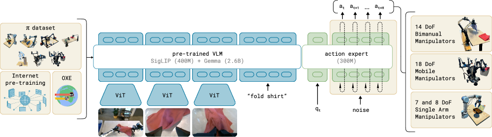
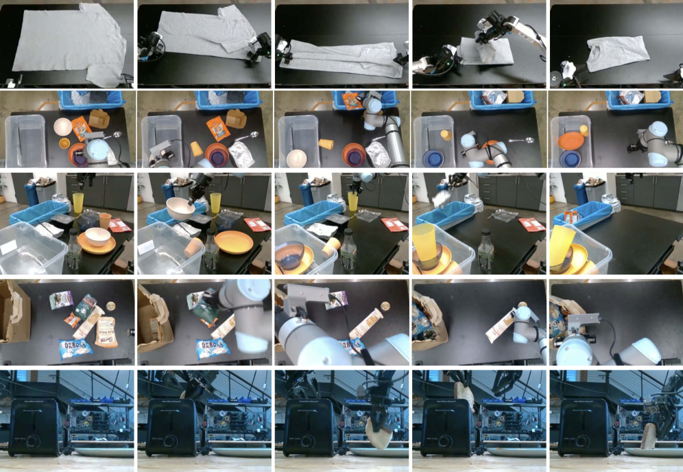
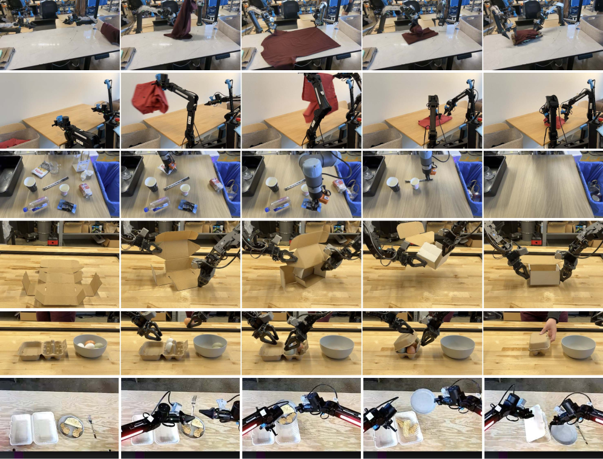

# π₀ 论文导读：用 Flow Matching + VLM backbone，打造能叠衣服、收桌子的通用机器人基础模型

> **论文标题**：π₀: A Vision-Language-Action Flow Model for General Robot Control
> **会议/期刊**：RSS 2025（Robotics: Science and Systems，机器人顶会）
> **作者**：Kevin Black, Noah Brown, Danny Driess, Adnan Esmail, Michael Equi, Chelsea Finn, Niccolo Fusai, Lachy Groom, Karol Hausman, Brian Ichter, Sergey Levine 等
> **机构**：Physical Intelligence（π）
> **arXiv**：https://arxiv.org/abs/2410.24164
> **代码**：https://github.com/Physical-Intelligence/openpi（π₀-FAST 开源）

---

## 读之前先搞清楚

### 这篇论文要解决什么问题？

机器人学习有一个核心瓶颈：**数据**。语言模型可以从整个互联网的文字中学习，但机器人不行——每个新任务、新机器人、新环境都需要从头收集大量演示数据。

π₀ 的目标：**训练一个通用的机器人基础模型（robot foundation model），让它像 GPT 之于语言一样——pre-train 在大规模多任务多机器人数据上，然后 zero-shot 或少量 fine-tune 就能适应新任务。**

这不是增量改进——π₀ 展示了之前从未有人做到的复杂度：叠衣服（从烘干机取出→放篮子→拿到桌上→叠好堆放）、收桌子（区分餐具和垃圾，甚至把盘子上的垃圾抖进垃圾桶再放盘子）、组装纸箱（需要双臂配合、利用桌面辅助折叠）。

> **小白理解**：之前的机器人模型像"只会做一道菜的厨师"——训练叠毛巾的模型不会收桌子。π₀ 像一个"上过烹饪学校的厨师"——在 7 种不同机器人、68 种不同任务上训练了 10,000 小时后，给它一个新菜谱（新任务），它只需要很少的额外练习（fine-tune）就能做出来。

### 读懂这篇论文需要的前置知识

| 概念 | 简单解释 |
|:---|:---|
| **VLA（Vision-Language-Action）** | 输入 image + text，输出 robot action 的模型 |
| **Flow Matching** | Diffusion 模型的变体——从纯噪声出发，学一个 vector field 逐步"引导"噪声变成目标 action |
| **Action Chunking** | 一次预测未来 H=50 步的 action 序列（而不是一步一步预测），提高动作连续性 |
| **Cross-Embodiment** | 同一个模型控制多种不同构型的机器人（单臂/双臂/移动底盘） |
| **Pre-training / Post-training** | 模仿 LLM 的两阶段训练：先大规模多任务 pre-train 打基础，再高质量 fine-tune 精调 |
| **PaliGemma** | Google 的 3B 参数 VLM（Vision-Language Model），π₀ 用它做 backbone |
| **Mixture of Experts（MoE）** | 模型有两套权重：一套大的处理 image/text（VLM backbone），一套小的处理 robot state/action（action expert） |

---

## 一、π₀ 的解决思路

核心 idea：**用一个 pre-trained VLM（PaliGemma 3B）作为 backbone 来继承互联网规模的视觉和语义知识 → 加一个轻量的 action expert（300M 参数）用 Flow Matching 输出连续的高频 action chunk → 在 10,000 小时的多机器人数据上 pre-train → fine-tune 到复杂下游任务。**

```
传统方法（从零训练一个机器人策略）：
  单个机器人 + 单个任务 + 几百条 demos → 只能做这一件事
  
π₀ 的方法（pre-train + fine-tune）：
  VLM backbone（互联网 pre-train）
        +
  Action Expert（Flow Matching，输出 50Hz action chunk）
        ↓ 在 7 种机器人、68 种任务、10,000 小时数据上 pre-train
  π₀ base model（通用物理理解）
        ↓ fine-tune 几小时高质量数据
  专精的下游策略（叠衣服/收桌子/装纸箱/装鸡蛋……）
```

> **小白理解**：VLM backbone 像一个读过所有互联网图文的大学生——有丰富的常识（"盘子是餐具放洗碗槽，纸巾是垃圾扔垃圾桶"）。Action Expert 像一个电机控制专家——能把"拿起盘子"翻译成 50 个连续的关节角度指令。π₀ 把两者结合起来，先在 7 种不同机器人上练了 10,000 小时基本功，再针对特定任务精调。

---

## 二、π₀ 整体流程



*图3：Pre-training mixture 包含 OXE Magic Soup + π dataset（7 种机器人/68 个任务），通过 VLM backbone（PaliGemma 3B）+ Action Expert（300M，Flow Matching）训练。输出可 zero-shot 控制多种机器人，或 fine-tune 到复杂下游任务。*

### 第 1 步：多模态输入编码 —— VLM backbone 读取场景

- **输入**：2-3 张 RGB 图像（腕部相机 + 基座相机）+ 语言指令 + 机器人 proprioceptive state（关节角度）
- **操作**：

  > **总览**：多张 image → ViT encoder → image token；语言指令 → text token；关节角度 → Linear Projection → state token → 全部拼接送入 PaliGemma VLM backbone
  >
  > ```
  > Image 1（腕部相机）  Image 2（基座相机）  Language cmd   Joint angles
  >      ↓ ViT               ↓ ViT            ↓ tokenize      ↓ Linear proj
  >  image tokens         image tokens       text tokens    state token
  >      └────────────────────┴─────────────────┴──────────────┘
  >                               ↓
  >              PaliGemma VLM backbone（3B params，18 层 Transformer）
  >                               ↓
  >                       所有 token 的 hidden state
  > ```

  **① ViT image encoding**：每张图通过 ViT（SigLIP 预训练）转为 256 个 image token。

  **② Proprioceptive state encoding**：关节角度向量用 Linear layer 投影到与 text token 相同的 embedding 维度。

  **③ Blockwise causal attention mask**：3 个 block——[image + text] → [state] → [action]。前向 block 不能 attend 后向 block，保护 VLM 的 pre-trained 表示不被新加的 token 干扰。

- **输出**：所有 token 的 hidden state，供 action expert 用于生成 action

---

### 第 2 步：Action Expert + Flow Matching —— 生成连续 action chunk

**这是 π₀ 最核心的创新**——不用 autoregressive 离散化（如 RT-2 把 action 变成文字 token "左转 5 度"），而是用 Flow Matching 直接建模连续 action 分布。

- **输入**：observation 的 hidden state（VLM backbone 输出）+ noisy action chunk
- **操作**：

  > **总览**：action expert（独立的小 Transformer，width=1024, mlp_dim=4096）接收 noisy action + observation → 预测 vector field → 10 步 integration 从纯噪声恢复到干净 action
  >
  > ```
  > Inference 时 10 步 Flow Matching：
  > 
  > Step τ=0:  A⁰ ~ N(0, I)  ← 纯随机噪声（50 个 action × 14 维）
  >                ↓
  >            喂给 action expert，预测 vector field v_θ(A⁰, o)
  >                ↓
  > Step τ=0.1: A^(0.1) = A⁰ + 0.1 × v_θ(A⁰, o)  ← 噪声稍微朝 action 方向走了一步
  >                ↓
  >            ...重复 10 次...
  >                ↓
  > Step τ=1: A¹ ← 最终 action chunk（50 步 × N 维关节角度）
  >                ↓
  >        发送给机器人执行（50Hz，1 秒的动作序列）
  > ```

  **① 为什么用 Flow Matching 而不是 autoregressive？** 机器人 action 是连续值（关节角度为 -π 到 π 之间的浮点数），autoregressive 需要离散化（→ 精度损失），且不能生成 action chunk（→ 动作不连贯）。Flow Matching 天然支持连续值，且一次性输出整个 action chunk。

  **② 为什么用 action expert（独立的权重）而不是全用 VLM backbone？** VLM backbone 是为处理 text/image 设计的，让同样的权重去处理连续 action vector 会导致两者都不好。用独立的 action expert 类似于 MoE——text/image 用 VLM 的权重，action 用 expert 自己的权重，只在 Self-Attention 层交互。

  **③ Flow Matching timestep 采样策略**：不同于图像生成的均匀采样，π₀ 用 Beta(1.5, 1) 分布，偏向低 timestep（高噪声）区域——因为从 observation 预测 action 的均值本身就很难（不像文生图中"一只猫"的均值图相对好预测）。

- **输出**：50 步 action chunk × action_dim 维关节角度

> **小白理解**：Action Expert 像"雕塑家"。给他的不是成品雕像，而是一团乱石（纯噪声）。他根据"场景描述"（VLM backbone 的 hidden state），用 10 刀（10 步 integration）把乱石雕成最终的动作序列。每次下刀前他都会重新审视整个场景，确保每一步都在正确的方向上。

#### 🔢 具体数字例子：一次 inference 的完整计算

**条件设定**：Bimanual UR5e 机器人，3 张相机图，50 步 action chunk，10 步 Flow Matching。

| 步骤 | 计算量 | 耗时（RTX 4090） |
|:---|:---|:---:|
| 3 张图 ViT encode | 3 × 256 token forward pass | 14 ms |
| Observation forward pass（[image+text+state]） | VLM backbone 18 层 | 32 ms |
| Action forward pass × 10（Flow Matching） | Action expert 18 层 × 10 | 27 ms |
| **总计** | | **73 ms（on-board）** |
| 执行频率 | 50 Hz, 每 0.8s 重新推理 | |

> **关键理解**：50 步 action 只需 73ms 推理一次，然后机器人可以用 50Hz 执行 1 秒。下一个 action chunk 在第 0.8 秒时开始推理（有 0.2 秒重叠）。**这就是 π₀ 能做到 50Hz 高频控制的秘密——一次性输出 chunk 比逐步输出快得多。**

---

### 第 3 步：Pre-training + Post-training —— 模仿 LLM 的训练范式

这是 π₀ 在方法论上的重要贡献——把 LLM 的两阶段训练范式引入机器人学习。

#### 先搞清楚：Pre-training 和 Post-training 到底是什么意思？

**Pre-training（预训练）** 和 **Post-training（后训练）** 这两个词是从大语言模型（LLM，如 GPT-4、ChatGPT）的训练流程中借来的概念。π₀ 的贡献之一就是把 LLM 这套成熟的训练范式搬到了机器人领域。

| 阶段 | 一句话解释 | LLM 类比 | π₀ 中的含义 |
|:---|:---|:---|:---|
| **Pre-training** | 用海量、多样、质量参差不齐的数据"打基础" | GPT 读整个互联网的文字，学会语法、常识、推理 | 在 7 种机器人、68 种任务、~10,000 小时数据上训练，学会"物理世界的常识" |
| **Post-training** | 用少量、高质量、任务特定的数据"精调" | ChatGPT 用人类反馈数据微调，学会对话、遵循指令 | 用几小时到上百小时的高质量演示数据 fine-tune，学会"把某个具体任务做流畅" |

> **小白理解**：Pre-training 像"上小学到高中"——学语文数学英语物理化学，什么都学一点，打了 12 年基础。Post-training 像"大学选专业"——你已经有了通识基础，再专攻计算机科学，4 年就能成为合格的工程师。如果没有 12 年基础教育，直接让你 4 年学会编程？大概率连数学符号都看不懂。

---

#### Pre-training 阶段：怎么训练的？

**训练数据：三部分拼成的大杂烩**

```
Pre-training 数据组成（~10,000 小时 ≡ 903M+ timesteps）：

① OXE Magic Soup（Open X-Embodiment 精选子集）
   └─ 22 种不同机器人，覆盖抓取、推动、放置等基础操作
   └─ 作用：提供极宽的 embodiment 覆盖（不同机械臂、不同相机、不同场景）

② Bridge v2 + DROID（开源数据集）
   └─ Bridge v2：桌面操作场景，WidowX 机械臂
   └─ DROID：多任务多场景，Franka 机械臂
   └─ 作用：补充开源社区的高质量数据

③ π Dataset（Physical Intelligence 自采数据）
   └─ 7 种机器人（单臂 UR5e、双臂 UR5e、Franka、Mobile ALOHA 等）
   └─ 68 种任务（从简单的 pick-place 到复杂的叠衣服、收桌子）
   └─ 作用：提供论文核心验证所需的复杂任务覆盖

总数据量：~10,000 小时 ≡ 903M+ timesteps
训练步数：700k steps
目的：建立广泛的物理世界理解
```

**训练方式：标准的 Flow Matching 损失**

Pre-training 的训练目标和第 2 步中介绍的 Flow Matching 完全一致——**给定 observation 和干净 action，加噪声后让 action expert 预测 vector field（噪声 → 干净 action 的方向）**。

具体的损失函数是 **Conditional Flow Matching (CFM) 损失**：

$$\mathcal{L}_{CFM} = \mathbb{E}_{t, x_0, x_1} \left\| v_\theta(x_t, t \mid o) - (x_1 - x_0) \right\|^2$$

其中每一项的含义：

| 符号 | 含义 | 白话 |
|:---|:---|:---|
| $x_0$ | 纯噪声（从标准正态分布 $\mathcal{N}(0,I)$ 采样） | "一团乱麻" |
| $x_1$ | 真实的 action chunk（人类演示的关节角度序列） | "正确的动作" |
| $t \sim \text{Beta}(1.5, 1)$ | 时间步，偏向高噪声区域 | "噪声加了多少" |
| $x_t = (1-t)x_0 + t x_1$ | 当前带噪 action（线性插值路径） | "半成品动作" |
| $v_\theta(x_t, t \mid o)$ | action expert 预测的 vector field | "模型猜的修正方向" |
| $x_1 - x_0$ | 真实的 vector field（从噪声指向干净 action） | "正确的修正方向" |

**训练时的一个 step 长什么样？**

```
① 取一条人类演示数据：observation o（图片+语言+关节状态）+ action chunk x₁（50步×18维）

② 随机采样噪声 x₀ ~ N(0, I)，随机采样 timestep t ~ Beta(1.5, 1)

③ 构造带噪 action：x_t = (1-t)·x₀ + t·x₁

④ VLM backbone 前向：o → hidden state h

⑤ Action expert 前向：(x_t, t, h) → 预测的 vector field v̂

⑥ 计算 CFM loss：L = ||v̂ - (x₁ - x₀)||²

⑦ 反向传播，更新 VLM backbone + action expert 的全部权重
```

> **小白理解**：训练就像一个"你画我猜"游戏。我给你看一张场景照片（observation），然后给你一条被涂改过的动作轨迹（noisy action chunk），问"这条轨迹应该往哪个方向修正才能变成正确的动作？"你猜一个方向（预测 vector field），我告诉你正确答案（真实 vector field），你根据差距调整自己的判断能力（反向传播）。反复练 700,000 次（700k steps），你就成了动作修正大师。

**Pre-training 的关键设计决策**

**① 为什么动作空间的维度统一为 18 维？**

7 种机器人的关节数不同（有的 6 轴、有的 7 轴、有的还有移动底盘），但 Flow Matching 要求固定的输入/输出维度。π₀ 的做法：选定一个最大维度（18 维 = 双臂 6+6 轴 + 夹爪 + 移动底座），对于小机器人（如单臂 6 轴），**zero-pad**（填 0）到 18 维；对于不需要的维度，mask 掉 loss（不计算这些维度的梯度）。

```
单臂 UR5e（6 轴 + 1 夹爪 = 7 维）：
  [θ₁, θ₂, θ₃, θ₄, θ₅, θ₆, grip, 0, 0, 0, 0, 0, 0, 0, 0, 0, 0, 0]
   ←─── 有效 action ───→  ←────── zero-pad ──────────→
```

**② 为什么 timestep 采样用 Beta(1.5, 1) 而不是均匀分布？**

这是 π₀ 的一个重要发现。图像生成（如 Stable Diffusion）通常均匀采样 timestep，因为从噪声恢复一张"猫的图片"，低噪声阶段（图已经基本清晰，只需微调细节）和高噪声阶段（图还是一片模糊，需要确定大体形状）都很重要。

但机器人 action 预测不同——**从 observation 预测 action 的"均值"本身就很难**（你不知道该抓杯子还是盘子），所以模型需要更多地在高噪声阶段（低 $t$）训练，学会"从场景确定大致该做什么"。Beta(1.5, 1) 分布的密度在 $t=0$ 附近更高：

$$p(t) \propto t^{1.5-1} \cdot (1-t)^{1-1} = t^{0.5}$$

这意味着模型花了更多 training compute 去学习"从 observation 推断 action 的大方向"，而不是"精调已经差不多对的 action"。

**③ 训练规模：700k steps，~10,000 小时数据**

- 700k 步在当时的机器人学习中是前所未有的规模（此前的工作通常在 10k-100k 步）
- 数据覆盖了 903M+ timesteps（时间步），每个 timestep 是 50Hz 的一次观测-动作对
- 训练用了多 GPU 分布式训练（估计在 64-128 块级别）

---

#### Post-training 阶段：怎么训练的？

**Post-training 的本质**：就是 **fine-tune（微调）**——拿 pre-training 得到的 π₀ base model 作为起点，在少量高质量的任务特定数据上继续训练。这和 LLM 的 SFT（Supervised Fine-Tuning）是同一个思路。

```
Pre-trained π₀ base model（已理解物理世界）
        │
        ├─→ fine-tune 5h 数据 → π₀ (stack bowls) ── 能流畅叠碗
        ├─→ fine-tune 20h 数据 → π₀ (table bussing) ── 能收桌子分垃圾
        ├─→ fine-tune 100h 数据 → π₀ (laundry folding) ── 能叠衣服
        └─→ fine-tune 50h 数据 → π₀ (box building) ── 能组装纸箱
```

**训练方式：和 pre-training 完全一样，只是数据换了**

Post-training 不改变任何模型结构、损失函数、优化器——**就是继续跑 CFM loss，但数据从"大杂烩"换成了"精品菜"**。

| 对比维度 | Pre-training | Post-training |
|:---|:---|:---|
| **数据量** | ~10,000 小时 | 5~100+ 小时 |
| **数据质量** | 参差不齐（有噪音、有次优示范） | 高质量（精选的最优人类演示） |
| **数据多样性** | 68 个任务、7 种机器人 | 1 个任务、1 种机器人 |
| **训练步数** | 700k steps | 几千到几万 steps |
| **学习率** | 正常（如 1e-4） | 更小（如 1e-5），防止"灾难性遗忘" |
| **优化目标** | 学会从各种失误中恢复 | 学会流畅、高效、稳健地执行 |

---

#### 为什么需要两阶段？为什么不能只用高质量数据从零训练？

这是 π₀ 论文最有洞察力的发现之一。答案分三个层次：

**层次 1：高质量数据只能教"完美路径"**

高质量演示数据通常是专家反复练习后的"最优执行"——没有犹豫、没有失误、没有纠正。如果只用这种数据从零训练：（1）模型学会了"在完美初始条件下走最优路径"；（2）但一旦执行中出现了偏差（夹爪滑了一点、物体位置和演示时不同），模型完全不知道该怎么恢复；（3）结果：在实际部署中，一个小失误就导致整个任务失败。

**层次 2：多样化数据教会"恢复能力"**

Pre-training 数据中有大量次优的、甚至有失误和纠正的演示（因为数据来自不同质量的数据集）。模型从中学到了："如果抓歪了，应该怎么调整""如果物体掉了，应该重新捡起来还是换策略"。这种能力叫 **recovery behavior（恢复行为）**，是从零训练的高质量模型完全不具备的。

**层次 3：两阶段组合产生 1+1 > 2 的效果**

```
仅 pre-training（不做 post-training）：
  ✅ 能应对各种意外、知道如何恢复
  ❌ 动作不够流畅、效率不高、偶尔会走弯路

仅 post-training（从零训练高质量模型）：
  ✅ 动作流畅、一气呵成
  ❌ 遇到意外就崩溃、完全不知道如何恢复

Pre-training → Post-training（π₀ 的方法）：
  ✅ 动作流畅、一气呵成         ← 来自 post-training
  ✅ 遇到意外知道如何恢复       ← 来自 pre-training
  ✅ 泛化到新的初始条件         ← VLM backbone 的常识
```

> **小白理解**：这就像学游泳。你看了 100 个奥运冠军的游泳视频（高质量数据），然后直接下水——大概率扑腾两下就沉了。因为你只看到了"完美路径"（标准划水、标准呼吸），但没学过"呛水了怎么办""腿抽筋了怎么自救"。
>
> 如果你先在浅水区自己玩 100 小时（多样化数据）——呛过水、滑过倒、被浪打过——你学会了各种自救和调整。然后教练再教你标准泳姿（post-training），你就能游得又标准又安全。**π₀ 的 pre-training 本质上就是在浅水区"乱玩"10,000 小时，积累了大量"搞砸了怎么办"的经验。**

---

#### 🔢 具体数字例子：一个任务的完整训练过程

**条件设定**：Table Bussing（收桌子）任务——12 件物品，区分餐具（放洗碗槽）和垃圾（扔垃圾桶），盘子上的垃圾先抖掉。

| 阶段 | 数据 | 训练量 | 关键效果 |
|:---|:---|:---|:---|
| Pre-training | ~10,000h，含各种抓取/放置/推动任务 | 700k steps | 学会了"抓东西""放东西""区分物体类别""推盘子"等基本技能 |
| Post-training | ~50h 专门的收桌子演示 | ~20k steps | 学会了"先判断是垃圾还是餐具→垃圾扔桶→餐具放槽→盘子有垃圾先抖→放盘子"这个完整序列 |

**Pre-training 中模型的"预备知识"**：
- VLM backbone 已经认识盘子、杯子、纸巾、食物残渣（来自互联网 pre-training）
- Action expert 已经知道怎么抓、怎么放、怎么推（来自 68 种任务的 joint training）
- 模型见过"抓错了→放下→重新抓"的恢复模式（来自低质量数据中的失误案例）

**Post-training 中模型"新学到"的**：
- 任务的高级结构："先判断→再分类处理→最后归位"
- 涌现行为（emergent behavior）：**自己发现"盘子上的垃圾要先抖进垃圾桶"**——这不是人类显式编程的策略，而是模型在 fine-tune 中自己"悟"出来的

> **小白理解**：Pre-training 给了模型一个"物理世界的本科文凭"——它知道什么是盘子、怎么抓东西、搞砸了怎么补救。Post-training 是"收桌子专业的硕士训练"——在已有基础上，50 小时就学会了收桌子这个具体技能，甚至自己发明了"抖垃圾"这个小技巧。如果让一个没有本科文凭的人直接读硕士？那就是从零训练——50 小时可能连"怎么稳定抓住一个盘子"都学不会。

---

#### 总结

| 问题 | 答案 |
|:---|:---|
| **Pre-training 是什么？** | 用海量（10,000h）、多样（7 机器人 / 68 任务）、质量参差的数据，通过 Flow Matching 训练一个"理解物理世界"的基础模型 |
| **Post-training 是什么？** | 拿 pre-trained 模型，在少量（5~100h）高质量任务特定数据上继续 fine-tune，学会"流畅执行某个具体任务" |
| **为什么要两阶段？** | Pre-training 提供**恢复能力**（搞砸了知道怎么办），Post-training 提供**流畅策略**（动作一气呵成），两者缺一不可 |
| **怎么训练的？** | 两阶段用完全相同的 CFM loss + Flow Matching 框架，唯一的区别是**数据**（多样化 vs 高质量）和**训练步数**（700k vs 几千~几万） |
| **核心 insight？** | 机器人学习和 LLM 训练遵循同样的规律——**先广度（pre-training）后深度（post-training），先通才后专才** |

---

## 三、核心创新点

| 创新点 | 具体内容 | 为什么重要 |
|:---|:---|:---|
| **VLM + Flow Matching 混合架构** | VLM backbone（3B）处理语义 + Action Expert（300M）用 Flow Matching 出 action | 首次将 VLM 语义理解与连续高频控制结合 |
| **Cross-Embodiment Pre-training** | 7 种不同机器人联合训练，统一 action space = 18 维（zero-pad 小机器人） | 数据共享，不同机器人互相"教"对方 |
| **Action Chunk + Flow Matching** | 一次输出 50 步 action，10 步 Flow Matching 去噪 | 50Hz 高频 + 动作连贯性，远超离散化方案 |
| **Pre-training / Post-training 范式** | 模仿 LLM：大规模 pre-train → 高质量 post-train | 恢复能力 + 流畅策略兼得 |
| **10,000 小时训练规模** | 远超此前任何机器人学习实验 | 证明了机器人学习中的 scaling law |

---

## 四、实验结果

### 4.1 Zero-shot 基础能力（pre-train 后不 fine-tune）



*图7：π₀ (full)、π₀ (parity, 160k steps)、π₀-small、OpenVLA、Octo 在 5 个 zero-shot 任务上的对比。π₀ 在所有任务上大幅领先。*

| 任务 | π₀ (full) | π₀-small | OpenVLA (7B) | Octo (93M) |
|:---|:---:|:---:|:---:|:---:|
| Shirt Folding | **~1.0** | 0.85 | 0.0 | 0.1 |
| Bussing Easy | **~1.0** | 0.7 | 0.2 | 0.2 |
| Bussing Hard | **0.9** | 0.55 | 0.05 | 0.05 |
| Grocery Bagging | **0.85** | 0.4 | 0.0 | 0.05 |
| Toast out of Toaster | **0.8** | 0.3 | 0.1 | 0.1 |

> **小白理解**：OpenVLA（7B 参数，比 π₀ 还大）在叠衣服上得分 0.0——因为它用离散化 action token，不支持 action chunk 和高频控制，面对需要精细连续操作的叠衣服任务完全无法工作。π₀-small（无 VLM 初始化）虽好于 baseline，但和完整 π₀ 差距巨大——**VLM pre-training 是关键**。

### 4.2 Fine-tune 到复杂新任务

| 任务 | 难度 | π₀ fine-tune | 从零训练 | ACT | Diffusion Policy |
|:---|:---|:---:|:---:|:---:|:---:|
| Stack Bowls | 易（pre-training 中有类似） | **0.9** | 0.5 | 0.5 | 0.45 |
| Towel Folding | 易 | **0.85** | 0.4 | 0.4 | 0.35 |
| Tupperware in Microwave | 中（微波炉是新的） | **0.75** | 0.25 | 0.3 | 0.25 |
| Paper Towel Replacement | 难（全新物体） | **0.55** | 0.2 | 0.1 | 0.15 |
| Franka Items in Drawer | 难（全新机器人） | **0.65** | 0.3 | 0.15 | 0.2 |

> **小白理解**：任务和 pre-training 越相似（Stack Bowls 和 Bussing 都是餐具操作），π₀ 的 fine-tune 优势越大。但即使是最难的"全新物体+全新机器人"任务，π₀ 仍然显著好于从零训练——**因为 VLM backbone 提供了通用视觉理解和物体识别能力，这是从零训练的模型没有的。**

### 4.3 复杂多阶段任务（论文亮点——前所未有）



*图13：π₀ pre-train+fine-tune vs zero-shot vs scratch 在 laundry folding、mobile laundry、table bussing、box building、packing eggs、to-go box 上的对比。pre-train+fine-tune 在所有任务上最佳，证明 pre-training 对困难任务尤其重要。*

| 任务 | 描述 | π₀ Fine-tune |
|:---|:---|:---:|
| **Laundry Folding** | 从篮子取出→放桌上→叠好→堆放，5 件衣物 | **~0.7** |
| **Mobile Laundry** | 同上 + 移动底座导航 | **~0.65** |
| **Dryer Unloading** | 移动到底座→开烘干机→取出→放篮筐 | **~0.6** |
| **Table Bussing** | 12 件物品，区分垃圾/餐具，抖掉垃圾 | **~0.55** |
| **Box Building** | 折平纸箱→折侧边→塞挡板 | **~0.5** |
| **Packing Eggs** | 从碗中取 6 个鸡蛋→放入蛋托→合盖 | **~0.45** |

> **小白理解**：这些任务的难度远超此前任何机器人学习实验。叠衣服不是"把平铺的 T 恤对折"——而是从一堆揉成一团的衣物中取出一件，展开、抚平、折叠、堆放。机器人需要处理无限种揉团方式。"收桌子"中，机器人甚至会自己发现"把盘子上的垃圾抖进垃圾桶再放盘子"这种策略——这是 emergent behavior（涌现行为），不是人类显式编程的。

---

## 五、在整个领域的位置

```
机器人基础模型演进

RT-1 (2022)               RT-2 (2023)               Octo (2024)
Google, 130k demos        Google, VLA + CoT          UC Berkeley, open-source
小规模单任务               文字 action token           93M, diffusion
    │                         │                         │
    └───────────┬─────────────┴───────────┬─────────────┘
                │                         │
                ▼                         ▼
        OpenVLA (2024)              Diffusion Policy (2023)
        7B VLA, OXE 训练            从零训练，小数据上很强
        离散化 action               (但无 pre-training)
                │                         │
                └───────────┬─────────────┘
                            │
                            ▼
                    π₀ (2024, RSS 2025)
                    · VLM backbone + Flow Matching action expert
                    · 10,000h / 7 robots / 68 tasks pre-training
                    · Pre-train + post-train 范式
                    · 首次展示叠衣服、装纸箱等复杂长程任务
                            │
                    ┌───────┴────────┐
                    ▼                ▼
              π₀-FAST (2025)   π₀.₅ (2025)
              5× faster train  开放世界泛化
              autoregressive   co-training + chain-of-thought
```

---

## 六、局限性

| 局限性 | 为什么是局限 |
|:---|:---|
| **非完全端到端** | 复杂任务需要 high-level VLM policy 分解子任务，不是单一模型完成一切 |
| **Inference 仍有延迟** | 73ms on RTX 4090，加上 Wi-Fi 传输 86ms；对更快响应的任务仍不够 |
| **数据集组成缺乏系统理解** | 把所有可用数据混合，不理解"哪种数据更有用、如何加权" |
| **跨 embodiment 的正迁移有限** | 对非常不同的领域（自动驾驶、腿式运动）泛化能力未知 |
| **无法从自身经验中学习** | 仅用人类演示数据，不能像 RL 一样从失败中自我改进 |

---

## 七、一句话总结

> **π₀ 把 pre-trained VLM 的互联网常识 + Flow Matching 的高频连续 action 生成 + 10,000 小时多机器人 pre-training 结合起来，模仿 LLM 的 pre-train/post-train 范式，首次让一个模型在叠衣服、收桌子、装纸箱等从未有人做到的复杂长程任务上展现出 viable 的自主能力。**

---

## 参考资料

- 论文：https://arxiv.org/abs/2410.24164
- 博客：https://physicalintelligence.company/blog/pi0
- 开源 π₀-FAST：https://github.com/Physical-Intelligence/openpi
- PaliGemma：https://arxiv.org/abs/2407.07726
- Flow Matching：Lipman et al., arXiv 2022
- Action Chunking（ACT）：Zhao et al., arXiv 2023
- OpenVLA：Kim et al., arXiv 2024
- Octo：Team et al., arXiv 2024
