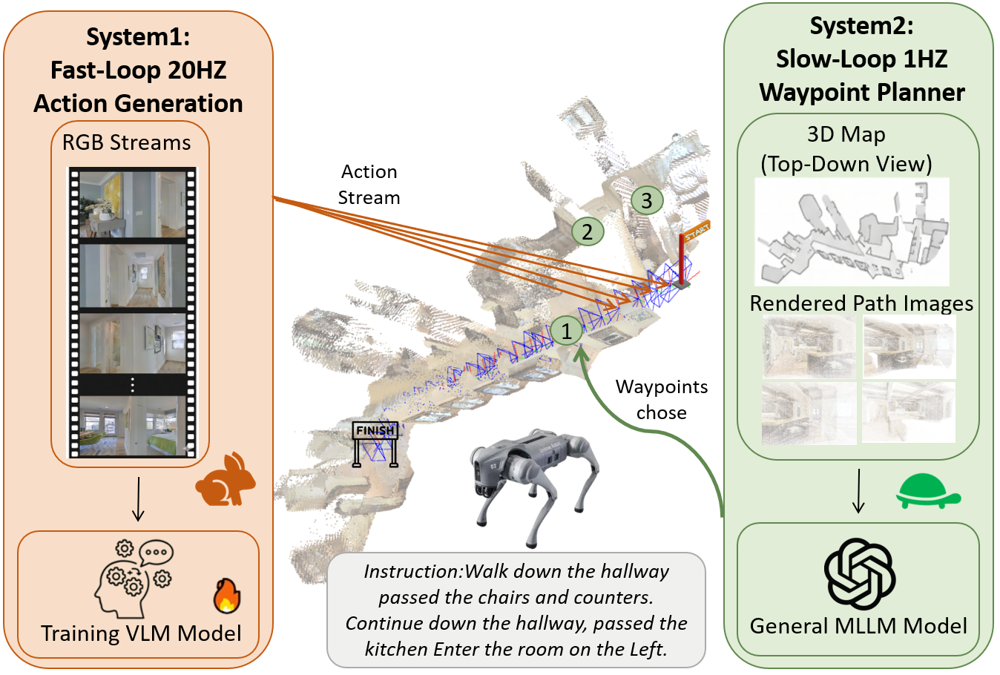
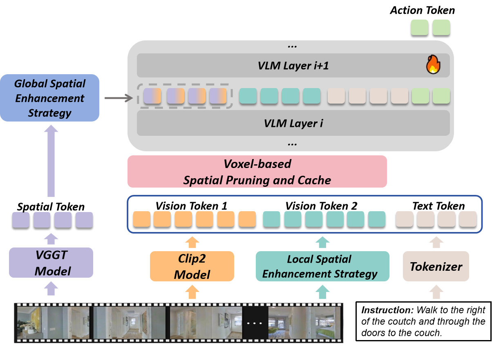
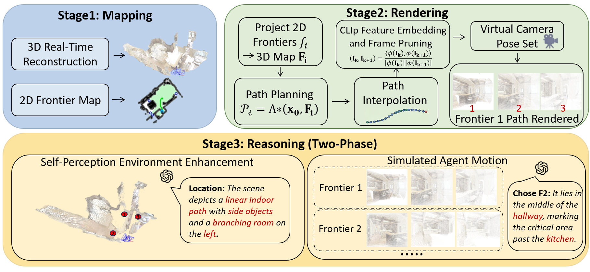
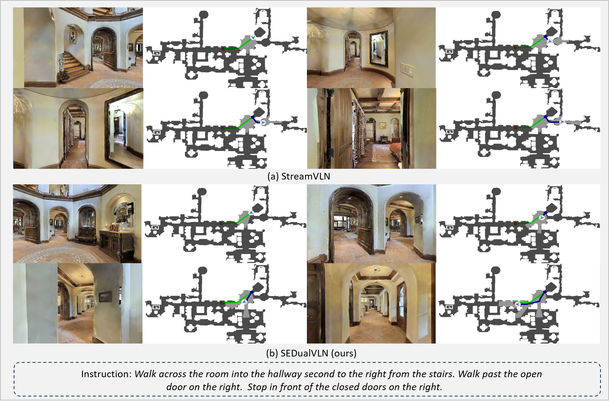
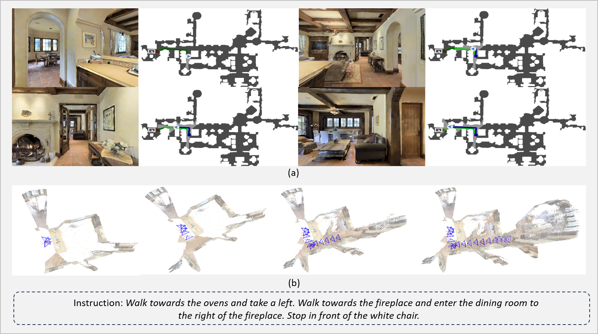

# SEDualVLN 论文导读：用空间增强双系统，让 VLN 智能体又准又快

> **论文标题**：SEDualVLN: A Spatially-Enhanced Dual-System for Vision-Language Navigation
> **会议/期刊**：arXiv 预印本，2026年5月
> **作者**：Jingzhi Huang, Junkai Huang, Wenxuan Song, Haoyang Yang, Hailong Huang, Haoang Li, Yi Wang
> **机构**：香港理工大学、中国科学院自动化研究所、香港科技大学（广州）
> **arXiv**：https://arxiv.org/abs/2605.17249
> **代码**：https://github.com/kim-os/SEDualVLN

---

## 读之前先搞清楚

### 这篇论文要解决什么问题？

你对机器人说"去厨房，经过客厅时左转"，它需要在完全陌生的房子里，仅凭摄像头画面和你的语言指令（没有地图、没有 GPS），一步步走到目的地。这就是**视觉语言导航**（Vision-Language Navigation，简称 VLN）。

目前做 VLN 有两派主流方法，各有各的致命弱点：

- **端到端派**（把画面+文本直接喂给大模型，输出"前进/左转/右转"等动作）：反应快，但**走远了容易迷路**（上下文越来越长），也**不会停下来思考**（遇到意外只能瞎走）
- **零样本派**（直接用 GPT-4o 等现成大模型规划路径，不额外训练）：能应付没见过的环境，但**对空间"没感觉"**（不理解 3D 几何关系，经常产生"空间幻觉"——以为前面有路其实没有），而且**太慢了**（每走一步都要想半天）

> **小白理解**：端到端派像一个"凭肌肉记忆走路的人"——反应快但不怎么过脑子，跑到长走廊就懵了。零样本派像一个"边走边查地图的人"——能应对新环境但每个路口都要停下来研究半天。**SEDualVLN 做的是：给快的那位装上方向感芯片，给慢的那位配一张 3D 实景地图，然后让他们配合——快的负责走，慢的负责指路。**

### 读懂这篇论文需要的前置知识

| 概念 | 简单解释 |
|:---|:---|
| **VLN（视觉语言导航）** | 给定语言指令和摄像头画面，让机器人走到目的地 |
| **VLM（视觉语言模型）** | 能同时理解图片和文字的大模型，如 LLaVA |
| **MLLM（多模态大语言模型）** | 能处理图+文等多种信息的超大规模语言模型，如 GPT-4o |
| **端到端（End-to-End）** | 从输入直接到输出，中间不拆步骤，一个模型干到底 |
| **零样本（Zero-Shot）** | 不用针对特定任务训练，拿来就能用 |
| **空间增强（Spatial Enhancement）** | 让模型对"上下左右、远近高低"更有感觉的技术 |
| **DAgger** | 一种模仿学习技巧：先用专家数据训练 → 让模型自己跑 → 收集犯错数据 → 再训练 |

---

## 一、SEDualVLN 的解决思路

核心 idea 来自心理学家丹尼尔·卡尼曼的《思考，快与慢》——人类有两套思维系统。SEDualVLN 把两套系统都"空间增强"后用来做 VLN：



*图中橙色部分为 System 1（快系统）：基于 VLM，看 RGB 画面直接输出动作指令，加入了全局和局部两种空间增强策略。绿色部分为 System 2（慢系统）：基于 MLLM，通过建图→渲染→推理三阶段管道输出高层次 waypoint 规划。两个系统以快慢协作的方式交替工作。*

- **System 1（快系统，~50ms/步）**：基于 VLM（LLaVA-Video 7B），当前画面进来，立刻输出动作。论文给它加了两个"空间增强"——
  - **全局增强**：训练时让 VLM 模仿一个 3D 空间模型（VGGT）的特征，学会"感受"自己的空间位置
  - **局部增强**：用目标检测 + 分割模型显式识别走廊、门口等"通道"，避免走错岔路口
- **System 2（慢系统，~1s/次规划）**：基于 GPT-4o，做三件事——实时建 3D 地图、渲染候选路径画面、推理选最优路径
- **协作模式**：System 2 每规划 1 次，System 1 已经走了约 20 步动作（20:1 的步频比）

> **小白理解**：就像越野拉力赛——导航员（System 2）拿着地图，每隔一段路告诉车手"下个路口右转"；车手（System 1）负责实际打方向盘、踩油门，还自带方向感（知道车头朝哪）和路感（能识别岔路口）。导航员不用每秒钟都说话，车手也不用每次看到路口都停下来查地图。

---

## 二、整体流程：快慢交替，空间增强

SEDualVLN 的完整导航流程是一个"System 2 定期规划 waypoint → System 1 持续执行动作"的循环：

```
输入：语言指令（"经过客厅去厨房"） + RGB 摄像头画面流
        ↓
┌──────────────────────────────────────────────────┐
│  循环执行（直到到达目标 3m 内 或 超过500步）       │
│                                                  │
│  System 2（每 20 步触发一次）：                    │
│    ① Mapping  → ② Rendering → ③ Reasoning        │
│    输出：一个 waypoint（3D 坐标）                  │
│                                                  │
│  System 1（每一步都执行）：                        │
│    看画面 → 全局空间感知 → 通道检测 → 输出动作     │
│    动作：前进0.25m / 左转15° / 右转15° / 停止     │
└──────────────────────────────────────────────────┘
        ↓
输出：到达目标附近 → 发 STOP → 导航成功！
```

---

### 第1步：System 1 快速动作生成（每步 ~50ms）

System 1 是"执行层"，负责把当前看到的 RGB 画面立刻翻译成动作。论文在 StreamVLN 架构基础上，加入了两个空间增强策略。



*System 1 的详细框架。输入 RGB 图像流和语言指令后，首先提取 4 种 Token。其中 VGGT 提取的 3D 空间 Token 通过全局空间增强策略在 VLM 的第 24 层注意力层提供隐式监督。另外三种 Token 经过体素空间修剪和缓存后送入 VLM。右下角的通道连通性提取模块（Local Spatial）用 Grounding DINO + SAM 检测并分割"通道"区域，将通道掩码编码为额外 Token。*

- **输入**：当前 RGB 图像帧 + 语言指令 + 历史动作
- **操作**：分两个空间增强子模块

  > **总览**：RGB 图像 → 提取 4 种 Token（视觉 + VGGT空间 + 通道 + 历史）→ VLM 第24层监督 → 输出动作
  >
  > ```
  > 输入：当前帧 RGB + 语言指令
  >         ↓
  > ┌────────────────────────────────────┐
  > │ ① 全局空间增强（Global）            │
  > │   用 VGGT 提取3D特征               │
  > │   → 在VLM第24层做余弦相似度监督      │
  > │   → 模型学会"感知"位置和朝向        │
  > │        ↓                           │
  > │ ② 局部空间增强（Local）             │
  > │   用 Grounding DINO 检测通道       │
  > │   + SAM 分割通道区域               │
  > │   → 模型学会"识别"岔路口           │
  > │        ↓                           │
  > │ ③ VLM 推理 → 输出动作              │
  > └────────────────────────────────────┘
  >         ↓
  > 输出：MOVE_FORWARD / TURN_LEFT / TURN_RIGHT / STOP
  > ```

  **① 全局空间增强策略**

  传统的 VLM 看图像时，对空间只有模糊的"感觉"——知道前面有个门，但不知道门在 3D 空间里的精确位置。SEDualVLN 用了一个巧妙的做法：在训练时，让一个预训练好的 3D 基础模型 **VGGT**（Visual Geometry Grounded Transformer，能把 2D 图像映射到 3D 空间的模型）当"老师"，让 VLM 在第 24 层（消融实验验证的最佳层数）去模仿 VGGT 的 3D 空间特征。具体做法：

  - 取 VLM 第 24 层的视觉 Token 嵌入向量
  - 用一个简单的两层 MLP 投影到和 VGGT 空间特征相同的维度
  - 计算两者的**余弦相似度**（衡量两个向量"方向"有多接近），作为额外的训练损失

  训练损失 = 动作预测损失 + α × 空间对齐损失（1 - 余弦相似度）
  
  这个损失的含义是：**模型不仅要走对路，还要"心里有数"——知道自己在哪、朝向哪**。

  > **小白理解**：就像学书法——老师（VGGT）先写一个字帖，学生（VLM）不直接照着描，而是在心里"感受"每一笔的空间位置。通过不断对比自己的感受和老师的字帖，学生慢慢学会了"这个字的空间结构"。**选第24层是因为**：太浅（第1-8层）还在处理边缘和颜色，没形成空间理解；太深（第32层）已经高度抽象，低级空间信息被"遗忘"了。第24层刚好是语义和空间的"最佳交汇点"。

  **② 局部空间增强策略——通道连通性提取模块**

  VLN 最常见的失败模式是什么？**走错岔路口**。一旦在路口拐错弯，后面基本全错。

  论文为此设计了"通道连通性提取模块"：
  1. **检测**：用 **Grounding DINO**（开放词汇检测器，能用任意文字（如"doorway""corridor"）找到图中的物体）检测画面中所有"通道"——走廊入口、门口、过道
  2. **分割**：用 **SAM**（Segment Anything Model，能精确分割任意物体轮廓的模型）把每个通道区域精确切出来，得到二值掩码（通道=1，非通道=0）
  3. **编码**：把掩码通过 MLP 投影到和全局视觉 Token 相同的维度，作为额外 Token 输入 VLM

  这样一来，VLM 能"看到"哪些方向可以走、哪些是死路，大大减少走错岔路的概率。

  > **小白理解**：你开车到一个复杂的立交桥，GPS 说"前方右转"，但这里有 3 个长得差不多的出口。如果 GPS 能在屏幕上**高亮标出正确出口的轮廓**（通道检测），你就不容易走错了。局部空间增强就是这个"高亮标出口"的功能——把每个可通行方向的轮廓显式标注出来，帮模型选对路。

  > ❓ **常见疑问：为什么不直接用深度相机或激光雷达来获得 3D 信息，要用 VGGT 这种间接方式？**
  >
  > 因为 SEDualVLN 的目标是**只用最便宜的单目 RGB 摄像头**完成导航——不需要深度传感器、不需要激光雷达。在真实世界的低成本机器人上，多一个传感器就多一份成本和复杂度，还涉及硬件同步和标定等麻烦。用 VGGT 从普通 2D 图像中"猜"3D 结构，虽然不如真传感器精准，但**足够让模型产生方向感和空间感**，而且不增加一毛钱硬件成本。

- **输出**：一个离散动作（MOVE_FORWARD / TURN_LEFT / TURN_RIGHT / STOP）

### 🔢 具体数字例子：一次完整的快慢协作

**条件设定**：智能体在客厅出发，目标指令是"经过走廊去厨房"。当前画面中，前方是一个 T 字路口，有三个可走方向。

**Step 1：System 1 持续执行，走到路口**

| 步数 | 画面中情况 | System 1 动作 |
|:---:|:---|:---:|
| 1-3 | 前方是开阔客厅 | ↑↑↑（连续前进） |
| 4 | 画面中出现 T 字路口 | 等待 System 2 判断 |

**Step 2：局部空间增强检测通道**

| 检测到的通道 | 画面位置 | 置信度 | 是否符合"去厨房"？ |
|:---:|:---:|:---:|:---:|
| 走廊入口 | 画面中央偏右 | 0.92 | ✅ "经过走廊" |
| 卧室门 | 画面左侧 | 0.85 | ❌ |
| 卫生间 | 画面右侧 | 0.78 | ❌ |

**Step 3：System 2 在第 20 步触发，推理选路**

System 2 建好 3D 地图，渲染三条候选路径的虚拟画面给 GPT-4o，GPT-4o 选"走廊入口"对应的 waypoint。

**Step 4：System 1 继续朝 waypoint 前进**

→→→↑↑↑↑↑（右转后直行），成功进入走廊。

> **关键理解**：如果没有通道检测，模型可能随便挑一个"看起来像路"的方向走，走错概率约 30%；有了局部空间增强，模型**显式看到每个方向的"可通行轮廓"**，结合语言指令"经过走廊"正确选出走廊入口。

---

### 第2步：System 2 全局规划（每 20 步触发一次，~1 秒）

System 2 是"决策层"——它不关心每一步怎么迈，而是每隔一段路指一个大方向（waypoint）。



*System 2 的三阶段工作流。左：Mapping（建图）——增量构建 3D 地图和 2D 前沿图。中：Rendering（渲染）——对每个前沿点用 A* 规划路径，沿路插值采样虚拟相机位姿，渲染 RGB 画面，CLIP 去冗余。右：Reasoning（推理）——阶段一：看俯视图，描述环境结构；阶段二：对比每条路径的渲染画面和语言指令，选出最优 waypoint。*

- **输入**：当前已构建的 3D 地图 + 语言指令
- **操作**：三阶段流水线

  > **总览**：RGB 图像 → 增量建 3D 地图 → 提取前沿点 → A* 规划路径 → 虚拟相机渲染 → CLIP 去重 → GPT-4o 两阶段推理 → 选 waypoint
  >
  > ```
  > 输入：当前 RGB 图像
  >         ↓
  > ① Mapping（建图）
  >   用 LingBot-Map 前馈式在线增量建 3D 地图
  >   同步生成 2D 前沿图（已探索/未探索边界）
  >         ↓
  > ② Rendering（渲染）
  >   对每个前沿点 → 投影到3D → A* 规划路径
  >   → 沿路径插值采样 → 虚拟相机拍照片
  >   → CLIP 余弦相似度去冗余（太像的帧只保留1张）
  >         ↓
  > ③ Reasoning（推理）
  >   阶段1：看 3D 俯视图 → 描述"我在哪、周围有什么"
  >   阶段2：看每条路径的渲染照 → 对比指令 → 选最优
  >         ↓
  > 输出：最优 waypoint 的 3D 坐标
  > ```

  **① 建图（Mapping）**

  基于 **LingBot-Map**（一种前馈式在线 3D 建图方法，不需要迭代优化，速度快），从 RGB 图像中增量构建环境的 3D 地图。同时生成一张 **2D 前沿图**（Frontier Map）——已探索区域是亮的，没去过的地方是黑的。亮暗交界处的"前沿点"，就是 System 2 下一步要决策去哪个的候选。

  > **小白理解**：就像玩即时战略游戏——你探索过的地图是亮的，没去过的地方是黑的。"前沿点"就是亮暗交界处的格子，System 2 要决定下一步去探索哪个前沿点。

  **② 渲染（Rendering）**

  对每个前沿点 $\mathbf{f}_i$：
  1. 投影到 3D 地图，得 3D 坐标 $\mathbf{F}_i$
  2. 用 **A\***算法（一种保证最短路径的经典图搜索算法）规划从当前位置到 $\mathbf{F}_i$ 的无碰撞路径 $\mathcal{P}_i$
  3. 沿路径做插值采样（保证相邻采样点间距 < 阈值 $d$），每个采样点放一台"虚拟相机"，渲染一张 RGB 图像
  4. 用 **CLIP**（一种能判断两张图"语义上像不像"的模型）去除冗余帧：连续两帧太像（余弦相似度 > 阈值 $\tau$），只保留一张

  最终每条候选路径得到 $m$ 张精简后的渲染图像。

  > **小白理解**：就像用 Google 街景"预走"一遍路线——不真的走过去，而是让计算机模拟"如果走这条路，会依次看到什么"。CLIP 去重相当于：如果连续两张街景几乎一样（比如一直对着同一面白墙），就只留一张，省 GPT-4o 的眼力和时间。

  **③ 推理（Reasoning）——两阶段**

  **阶段1（环境感知）**：把 3D 俯视地图给 GPT-4o，让它描述智能体当前在哪、周围环境结构怎样、有哪些可能的行进方向。

  **阶段2（路径选择）**：把每条候选路径的渲染图像序列给 GPT-4o，让它逐条比较和语言指令的匹配度，选出最优 waypoint。

  > **小白理解**：GPT-4o 像一个"老司机"——先看一眼卫星地图了解大环境（阶段1），然后对比每条可能路线的街景照片（阶段2），最后指着一条路说"走这边"。**这个设计巧妙在**：GPT-4o 不需要理解 3D 坐标和几何计算，只需要"看图说话+看图选路"——把复杂的空间推理转化成了大模型最擅长做的视觉-语言对齐。

- **输出**：一个最优 waypoint 的 3D 坐标

---

## 三、核心创新点

### 创新1：空间增强双系统架构

**与众不同之处**：之前的双系统 VLN（如 DualVLN）只是简单拼凑快慢两套系统，没从根本上增强各自的空间能力。SEDualVLN 首次**同时给两个系统都做了空间增强**——System 1 学会"感知方向"，System 2 学会"看地图推理"。

> **小白理解**：旧的双系统相当于让一个没有方向感的人和一个不会看地图的人组队——各干各的，但都干不好。SEDualVLN 给快的人装"方向感芯片"（全局空间增强），给慢的人配"3D 实景地图"（建图+渲染+推理），**两人都变强了，配合才有 1+1>2 的效果**。

### 创新2：多层次局部空间感知——直击 VLN 最大痛点

**与众不同之处**：不是模糊地"感觉"空间结构，而是**显式检测通道、精确分割轮廓**。这直接针对 VLN 最常见的失败模式——走错岔路口。消融实验显示，加上局部空间增强后，R2R 成功率提升 3.5%、RxR nDTW 提升 6.3%（nDTW 大幅提升意味着走的路更准）。

> **小白理解**：想象蒙着眼睛，一只手摸墙走迷宫——你大略知道自己的位置（全局感知），但到岔路口时摸不清每个岔路的方向。如果给你能力：摸到岔路口时能感知每个岔路的**完整轮廓形状**，你就不容易走错了。局部空间增强就是这个"摸轮廓"的能力——用 SAM 把每个通道的精确形状勾勒出来。

### 创新3：建图→渲染→推理 三阶段 MLLM 管道

**与众不同之处**：不是直接把 RGB 画面扔给 MLLM 问"往哪走"（这相当于闭卷考试），而是**先生成所有候选路径的"街景预览"，再让 MLLM 做选择题**。

> **小白理解**：直接问 GPT-4o"从这张照片看，我应该往哪走？"就像闭卷考试——可能猜对也可能猜错。SEDualVLN 的做法是**先把所有选项的"参考答案"（候选路径的照片）都准备好，再让 GPT-4o 选**——准确率自然高得多。

---

## 四、实现细节

### 模型配置

| 维度 | 配置 | 为什么这样设置 |
|:---|:---|:---|
| **System 1 基座** | LLaVA-Video 7B（Qwen2-7B 语言骨干） | 7B 参数在精度和推理速度间平衡 |
| **System 2 MLLM** | GPT-4o（默认）/ Gemini / Qwen2.5-VL 可选 | GPT-4o 空间推理最强，但支持替换 |
| **3D 建图** | LingBot-Map（预训练，无需额外训练） | 前馈式，速度快，适合在线 |
| **通道检测** | Grounding DINO + SAM | 开放词汇检测 + 精确分割 |
| **空间教师** | VGGT（预训练 3D 基础模型） | 高质量 3D 特征监督 |
| **去重编码器** | CLIP | 计算语义相似度去冗余帧 |

### 训练配置

| 维度 | 配置 | 为什么这样设置 |
|:---|:---|:---|
| **训练阶段** | ① oracle 轨迹训练1 epoch ② DAgger 采样训练1 epoch | DAgger 让模型见过自己的"犯错样本" |
| **每步处理量** | 128 个视频片段 | 平衡 GPU 显存和效率 |
| **总 GPU 耗时** | ~2000 A100 GPU 小时 | 两阶段 VLM fine-tuning |
| **空间监督层** | VLM 第 24 层注意力层 | 消融实验确定最优 |
| **损失函数** | 动作预测损失 + α × (1 - cos(视觉Token, 空间特征)) | 同时优化导航和空间感知 |

### 推理部署

| 维度 | 配置 | 为什么这样设置 |
|:---|:---|:---|
| **System 1 硬件** | 单 RTX 4090 | 消费级即可，便于部署 |
| **System 2 硬件** | 单 RTX 4090 | 同上，两张卡可并行 |
| **System 1 频率** | ~50ms/步（~20 FPS） | VLM 实时推理 |
| **System 2 频率** | ~1s/次规划 | 建图+渲染+MLLM 推理 |
| **双系统步频比** | **20:1**（最优） | 速度快且成功率最高 |
| **动作空间** | 前进0.25m / 转15° / 停止 | VLN-CE 标准设置 |
| **成功条件** | 距目标 < 3m + 步数 ≤ 500 | VLN-CE 标准评测 |

---

## 五、实验结果

### 主要对比（R2R-CE & RxR-CE Val-Unseen，只用 RGB）

| 方法 | R2R SR↑ | R2R SPL↑ | RxR SR↑ | RxR SPL↑ | RxR nDTW↑ |
|:---|:---:|:---:|:---:|:---:|:---:|
| Seq2Seq（2020） | 25.0 | 22.0 | 13.9 | 11.9 | 30.8 |
| NaVILA（2024） | 54.0 | 49.0 | 49.3 | 44.0 | 58.8 |
| StreamVLN（2025） | 56.9 | 51.9 | 52.9 | 46.0 | 61.9 |
| DualVLN（2025） | 64.3 | 58.5 | 61.4 | 51.8 | 70.0 |
| **SEDualVLN** | **67.3** | **62.5** | **63.9** | **52.4** | **72.8** |

> **小白理解**：SR（成功率）= 走到目的地的比例。SPL（路径加权成功率）= 不光走到，还要走得"高效"（不绕远路）。nDTW = 实际路径和参考路径的"形状相似度"。SEDualVLN 全面超过了前代 DualVLN，尤其在 RxR 多语言数据集上 nDTW 提升 2.8 个百分点——说明空间增强对理解不同语言的指令（如英语 vs 印地语）特别有帮助，因为更强空间感能弥补语言理解的不足。

### 消融1：全局空间增强在哪层做最好？

| 监督层 | R2R SR↑ | R2R SPL↑ | RxR SR↑ |
|:---:|:---:|:---:|:---:|
| 无监督 | 61.3 | 58.7 | 49.5 |
| 第1层（太浅） | 66.4 | 60.4 | 62.8 |
| 第8层 | 66.8 | 61.6 | 63.5 |
| 第16层 | 67.0 | 62.3 | 63.7 |
| **第24层（最优）** | **67.3** | **62.5** | **63.9** |
| 第32层（太深） | 66.7 | 61.7 | 63.4 |

> **小白理解**：太浅的层还在处理边缘/颜色，没形成空间理解；太深的层已高度抽象，低级空间信息被遗忘。**第 24 层是语义和空间的"金发姑娘区域"——刚刚好。**

### 消融2：局部空间增强有用吗？

| 配置 | R2R SR↑ | RxR SR↑ | RxR nDTW↑ |
|:---|:---:|:---:|:---:|
| w/o 局部空间增强 | 63.8 | 59.8 | 66.5 |
| **完整版** | **67.3** ↑3.5 | **63.9** ↑4.1 | **72.8** ↑6.3 |

> **小白理解**：nDTW 大幅提升 6.3% 是最关键的信号——说明通道检测让智能体不再绕远路，走得更准确。

### 消融3：双系统配合 vs 单独使用

| 配置 | 频率比 | R2R SR↑ | RxR SR↑ | 平均时间 |
|:---|:---:|:---:|:---:|:---:|
| 仅 System 1 | — | 62.8 | 58.5 | **48.9s** |
| 仅 System 2 | — | 59.8 | 56.6 | 294.3s |
| S1+S2 | 10:1 | 67.0 | 63.5 | 59.9s |
| **S1+S2** | **20:1** | **67.3** | **63.9** | **57.3s** |
| S1+S2 | 30:1 | 66.5 | 63.4 | 52.8s |

> **小白理解**：纯 System 2 平均耗时近 **5 分钟**，完全不可用。双系统在 20:1 的比例下，成功率最高（67.3%），时间只比纯快系统多了 8 秒。**20:1 是论文找到的最佳平衡点。**

### 定性分析



*对比实验。左侧为 StreamVLN，右侧为 SEDualVLN。可以看到 StreamVLN（左）在岔路口一开始就走错了方向（红线偏左），而 SEDualVLN（右）从一开始就选择了正确的路径（绿线），成功穿越 T 字路口到达目标。这说明空间增强确实让模型在岔路口做出更准确的决策。*



*完整的一次导航案例。上方为第一人称视角的导航过程，下方为实时构建的 3D 地图。可以看到智能体从起点出发，经过多个房间和走廊，最终成功到达目标。System 2 的 3D 地图（下方）逐步被增量构建，前沿点（未探索区域）以不同颜色标注。*

---

## 六、在整个领域的位置

```
                            VLN 技术演进树
                                  │
            ┌─────────────────────┼─────────────────────┐
            ▼                     ▼                      ▼
      传统方法                 端到端 VLM             零样本 MLLM
  (Seq2Seq, CMA, BERT)   (NaVid, NaVILA,       (SpatialVLN, NavGPT,
                           StreamVLN)             InstructNav)
            │                     │                      │
            └──────┬──────────────┘                      │
                   ▼                                    ▼
             双系统方法                            空间增强零样本
        (DualVLN, Run-Ruminate-              (SpatialNav, SpatialGPT)
         Regulate)
                   │                                    │
                   └────────────┬───────────────────────┘
                                ▼
                    ★ SEDualVLN ★（本文）
              空间增强双系统 — VLN-CE SOTA
                                │
                                ▼
                          未来方向：
                  • 真实机器人部署（当前仅仿真）
                  • 更快的实时 3D 建图
                  • 更多传感器融合（深度、IMU）
```

---

## 七、局限性

| 局限 | 为什么是局限 |
|:---|:---|
| **仅仿真验证** | 只在 VLN-CE（Matterport3D 仿真）上测试，没有真实机器人实验。论文也承认 3D 建图在真实世界可能扭曲 |
| **依赖 GPT-4o 闭源 API** | System 2 默认用 GPT-4o，增加部署成本和网络依赖 |
| **双 GPU 需求** | 推理需要两张 RTX 4090，增加硬件成本 |
| **离散动作空间** | 只能前进 0.25m / 转 15°，不够精细 |
| **步频比需手调** | 20:1 的最优比是通过网格搜索确定的，不同场景可能需要不同值 |
| **通道检测依赖 SAM+DINO** | 两个额外模型增加了 System 1 的复杂度和推理开销 |

---

## 八、一句话总结

**SEDualVLN 用"快 VLM 执行 + 慢 MLLM 规划"的双系统架构，给两个系统都做了全局和局部空间增强——全局让模型感知自己在空间中的位置，局部让模型识别岔路口的通道轮廓。在只用单目 RGB 的条件下，R2R-CE 成功率达 67.3%（SOTA），比纯 MLLM 系统快了约 5 倍。**

---

## 参考资料

1. SEDualVLN 论文: https://arxiv.org/abs/2605.17249
2. 代码: https://github.com/kim-os/SEDualVLN
3. StreamVLN: https://arxiv.org/abs/2507.05240
4. DualVLN (Ground Slow, Move Fast): https://arxiv.org/abs/2512.08186
5. NaVILA: https://arxiv.org/abs/2412.04453
6. VGGT: CVPR 2025
7. LingBot-Map: https://arxiv.org/abs/2604.14141
8. VLN-CE: Krantz et al., ECCV 2020
9. RxR: Ku et al., EMNLP 2020
