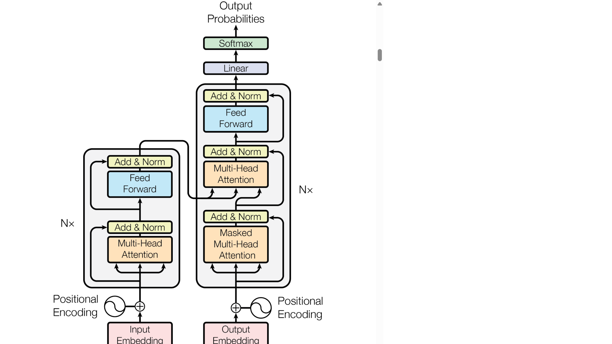
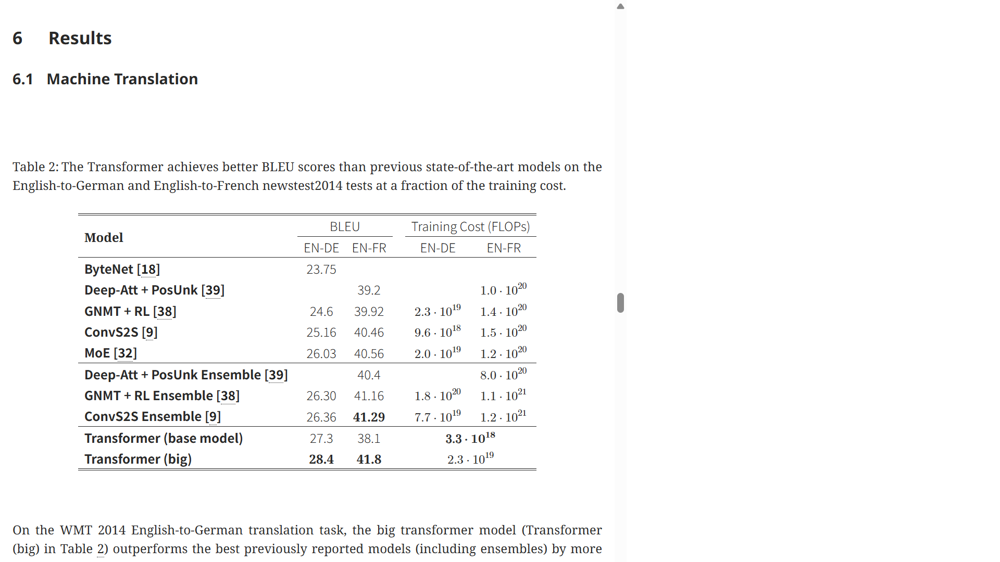

# Attention Is All You Need 论文导读：用纯 Attention 取代 RNN，奠基大模型时代

> **论文标题**：Attention Is All You Need
> **会议/期刊**：NeurIPS 2017（神经信息处理系统大会，深度学习顶级会议）
> **作者**：Ashish Vaswani, Noam Shazeer, Niki Parmar, Jakob Uszkoreit, Llion Jones, Aidan N. Gomez, Łukasz Kaiser, Illia Polosukhin
> **机构**：Google Brain / Google Research / University of Toronto
> **arXiv**：https://arxiv.org/abs/1706.03762
> **代码**：https://github.com/tensorflow/tensor2tensor（官方 TensorFlow 实现，社区 PyTorch 版本见 The Annotated Transformer）

> 📎 **关联文档**：[Embedding 详解](./embedding_guide.md) · [Positional Encoding 详解](./positional_encoding_guide.md) · [Attention 机制深度解读](./attention_guide.md)

---

## 读之前先搞清楚

### 这篇论文要解决什么问题？

2017 年之前，机器翻译、文本摘要等序列任务的主流方案是 **Encoder-Decoder + RNN/LSTM**。这套方案有一个无法绕过的工程瓶颈：**RNN 必须按时间步顺序计算**——第 $t$ 步的隐藏状态 $h_t$ 依赖 $h_{t-1}$，整个计算链不能并行。

更致命的是，梯度沿时间反向传播时指数衰减（梯度消失），导致句首的语义信息传不到句尾。翻译长句 "The agreement on climate change signed by 196 countries in Paris last December was hailed as a historic breakthrough" 时，读到句尾的 "was" 时，模型可能早已忘了主语是单数的 "The agreement" 还是复数的 "196 countries"——动词单复数直接出错。

> **小白理解**：RNN 就像一个只有 7 秒记忆的翻译官。原文 "猫咬狗" 和 "狗咬猫"，RNN 可能翻成一样的结果，因为它记不清谁在前谁在后。更糟的是，这个翻译官一次只能听一个词——100 个词的句子要串行处理 100 步，GPU 的几千个计算核心只能排队干等。

Transformer 的答案是：**彻底去掉 RNN，只用 Attention**。通过 Scaled Dot-Product Attention，序列中任意两个位置都能"一步直达"地建立依赖——路径长度从 RNN 的 $O(n)$ 缩短为 $O(1)$，且所有位置完全并行计算。

### 读懂这篇论文需要的前置知识

| 概念 | 简单解释 |
|:---|:---|
| **词嵌入（Embedding）** | 把词变成固定长度的数字向量，语义近的词向量也近 |
| **RNN / LSTM** | 按时间步逐词处理序列，有"记忆"但速度慢、长程遗忘 |
| **Seq2Seq（序列到序列）** | 输入一个序列、输出另一个序列的任务框架（如翻译） |
| **Attention 机制（传统）** | Decoder 生成每个输出时，有权重地"回头看" Encoder 中相关的输入 |
| **Softmax** | 把任意实数向量变成概率分布（输出在 0~1 之间，和为 1） |
| **LayerNorm（层归一化）** | 对神经网络中间层做标准化，让训练更稳定 |
| **残差连接（Residual）** | 把输入直接加到子层输出上（$x + F(x)$），防止深层梯度消失 |

---

## 一、Transformer 的解决思路

Transformer 的设计哲学浓缩为一句话：**让序列中每个词都能直接看到其他所有词，并且 8 组"观察员"同时从不同角度审视这些关系。**

对比 RNN 和 Transformer 处理同一个句子 "The cat sat on the mat"：

| | RNN | Transformer |
|:---|:---|:---|
| **处理方式** | 逐词串行：The → cat → sat → ... | 全句并行：所有词同时互相"看" |
| **"cat" 看到 "mat"** | 经过 4 个时间步的间接传递 | 一次点积运算直接建立联系 |
| **训练速度** | GPU 大量时间在等待上一步完成 | 矩阵乘法一次完成，GPU 满载 |
| **长程依赖** | 超 ~50 个词后显著退化 | 理论上任意长度直接关联 |

**递进三段式——为什么 Self-Attention 能取代 RNN**：

1. **先说普通情况（RNN 怎么做）**：RNN 把序列处理看作"时间上的接力"。第 $t$ 个词的处理结果 $h_t$ 必须等前一个词处理完 $h_{t-1}$ 才能算。信息沿 $h_1 \to h_2 \to \cdots \to h_n$ 单向传递——"cat" 要影响 50 步后的动词单复数，信息得穿过 50 个时间步，每步都有衰减。这就像 50 个人排队传话——传到最后一个人的内容往往和最初大相径庭。

2. **再说当前情况（Self-Attention 怎么做）**：Transformer 扔掉"时间步"的概念，把整个序列当做一个**全连接图**——每个词和其他所有词之间都有一条直连边。第 $t$ 个词的更新不依赖 $h_{t-1}$，而是对所有词做一次全局加权聚合：$\mathrm{output}_t = \sum_i \alpha_{ti} \cdot \mathrm{value}_i$。所有词**同时、并行**完成这个操作。

3. **最后说为什么（这样设计的本质原因）**：自然语言中词与词的关系本质上是**稀疏的、跳跃的、长程的**——"The agreement...was" 中间隔了 20 个修饰词，但"agreement"对"was"的单复数约束是**直接的、不需要中间词传递的**。RNN 强制信息沿时间步传递，违背了这个本质；Self-Attention 允许任意两词直达，**和语言的结构完全吻合**。

> **小白理解**：RNN 像排队传话游戏——第一个人小声告诉第二个人，第二个人传给第三个人……到第 20 个人时内容面目全非。Transformer 则像所有人同在一个会议室，每个人可以直接对任何其他人喊话，而且有 8 个不同角度的"监听器"同时记录。论文把这种互相"看"的操作称为 Self-Attention（自注意力），核心洞察是：**与其让信息沿时间步一步步传递，不如每个位置直接查询所有位置，一步到位。**

---

## 二、整体流程：从输入句子到输出翻译



*图1：Transformer 模型架构。左侧 Encoder（$N=6$ 层堆叠），右侧 Decoder（$N=6$ 层）。底部为词嵌入 + 位置编码，顶部 Softmax 输出层。箭头 $N\times$ 表示该模块重复 6 次。Decoder 中间 Cross-Attention 的 Q 来自 Decoder 自身，K/V 来自 Encoder 输出。*

### 第 1 步：输入处理——把词变成带位置标签的向量（Embedding + Positional Encoding）

翻译的第一步是把原始文本变成模型能理解的数字。每个词先通过词嵌入表映射为 512 维向量，再叠加位置编码告诉模型词在句子中的位置。

- **输入**：一个英文句子，如 "The cat sat on the mat"（6 个词，另加特殊标记）
- **操作**：

  > **总览**：词 ID → 查嵌入表得 512 维向量 → 加上位置编码 → 得到 Encoder 输入矩阵 $X \in \mathbb{R}^{n \times 512}$
  >
  > ```
  > 输入："The cat sat on the mat"
  >     │
  >     ▼
  > ① 词嵌入（Embedding Lookup）
  >   每个词 → 512 维向量（从训练好的嵌入表查找）
  >     │
  >     ▼
  > ② 位置编码（Positional Encoding）
  >   按正余弦公式生成 512 维位置向量，直接加到词向量上
  >     │
  >     ▼
  > 输出：X ∈ (6, 512)，每行 = 带有位置标签的词向量
  > ```

  **① 词嵌入（Embedding）**

  词嵌入是一张可训练的查找表（词表大小 $\times 512$）。训练初期每个词对应随机向量；随着训练进行，语义相近的词（如 "cat" 和 "kitten"）的向量会逐渐靠近。论文词表大小 37000（BPE 子词切分），嵌入维度 $d_{\text{model}} = 512$。

  **② 位置编码（Positional Encoding）**

  Self-Attention 本质是"集合操作"——打乱输入顺序，输出完全相同。这意味着模型天然不知道词的顺序。所以必须在词向量上叠加位置信息。

  论文使用正余弦函数生成位置编码。第 $pos$ 个位置的第 $2i$ 维（偶数维）和第 $2i+1$ 维（奇数维）分别为：

  $$PE_{(pos, 2i)} = \sin\!\left(\frac{pos}{10000^{2i/d_{\text{model}}}}\right)$$

  $$PE_{(pos, 2i+1)} = \cos\!\left(\frac{pos}{10000^{2i/d_{\text{model}}}}\right)$$

  其中 $pos$ 是词的位置（0, 1, 2, ...），$i$ 是向量维度的索引。不同维度用不同频率——低维变化慢（区分远距离位置），高维变化快（区分相邻位置）。

  > **小白理解**：Attention 就像把所有词倒进一个袋子搅拌——搅完就分不清先后了。位置编码就是给每个词贴"编号标签"。正余弦函数的好处是：即使训练时只见过 100 词的句子，测试时来了 200 词的，也能用同一个公式算出新位置的编码——不用重新训练。

- **输出**：输入矩阵 $X \in \mathbb{R}^{n \times 512}$，每行 = 词嵌入 + 位置编码

#### ❓ 深入理解：为什么用正余弦而不用可学习位置嵌入？

**可学习位置嵌入的局限**：如果每个位置独立学一个向量（BERT 的做法），位置 0 有可训练向量 $\mathbf{p}_0$，位置 1 有 $\mathbf{p}_1$……训练时最长的句子只有 100 词，位置 101 的嵌入从未被训练过，测试遇到更长句子就出错。

**正余弦编码的优势**：它是确定性函数——给定任意 $pos$，无论 $pos=5$ 还是 $pos=5000$，都能用同一公式算出编码。而且有优雅的数学性质：$PE_{pos+k}$ 可表示为 $PE_{pos}$ 的线性变换，模型能自然学到相对位置关系。

> **核心设计理由**：选正余弦不是因为它比可学习嵌入"更准"（论文消融显示两者 BLEU 几乎相同），而是因为它**天然支持外推到训练时未见过的序列长度**。

### 第 2 步：Encoder 堆叠——逐层理解输入的深层语义

Encoder 由 $N=6$ 个完全相同的层堆叠，每层两个子层：Multi-Head Self-Attention + Feed-Forward Network，每个子层后跟残差连接 + 层归一化。

> **这一步在图中对应**：图1 左侧 $N\times$ 灰色方块——输入从底部进入，逐层向上经过 6 个相同的 Encoder Block。

- **输入**：$X \in \mathbb{R}^{n \times 512}$
- **操作**：

  > **总览**：输入 → [Self-Attention → Add & Norm → FFN → Add & Norm] × 6 层 → Encoder 输出
  >
  > ```
  > 输入 X ∈ (n, 512)
  >     │
  >     ▼   ┌──────────────────────────────────────┐
  > ① Multi-Head Self-Attention                    │
  >    每个词看所有词，加权融合信息                   │
  >     │                                          │
  >     ▼                                          │
  > ② Add & LayerNorm: x + Attention(x) → 归一化    │  重复 6 层
  >     │                                          │
  >     ▼                                          │
  > ③ Feed-Forward Network                         │
  >    每个词独立做非线性变换                         │
  >     │  升维 512→2048→ReLU→降维 512              │
  >     ▼                                          │
  > ④ Add & LayerNorm: x + FFN(x) → 归一化          │
  >     │   └──────────────────────────────────────┘
  >     ▼
  > Encoder 输出 ∈ (n, 512)
  > ```

  **① Multi-Head Self-Attention**

  Transformer 的核心操作。每个词通过三组可学习的投影矩阵生成 Q（Query，查询）、K（Key，键）、V（Value，值），然后用 Q 去"查询"所有词的 K，算相关性分数，Softmax 归一化后加权融合所有词的 V。多头（$h=8$）意味着 8 组不同投影同时运行，每组关注不同类型的关系。详细机制见「三、核心创新点」。

  **② Add & LayerNorm**

  $$\mathrm{Output} = \mathrm{LayerNorm}(x + \mathrm{Sublayer}(x))$$

  残差连接 $x + \mathrm{Sublayer}(x)$ 让梯度直接流过子层，防止 6 层堆叠的梯度消失。LayerNorm 对每个样本的特征维度做标准化（均值→0，方差→1），稳定训练。

  **③ Feed-Forward Network**

  $$\mathrm{FFN}(x) = \max(0,\; xW_1 + b_1)\,W_2 + b_2$$

  对每个位置独立应用的两层全连接网络：$W_1 \in \mathbb{R}^{512 \times 2048}$ 先升维，ReLU 激活引入非线性，$W_2 \in \mathbb{R}^{2048 \times 512}$ 再降回 512。

  > **小白理解**：Self-Attention 是"集体讨论"——每个词和其他所有词交流，融合全局信息。FFN 是"独立思考"——每个词关起门来深度加工讨论中得到的信息。升维到 2048 给足够"思考空间"，再降回 512 提炼最关键的特征。**6 层 Encoder = 6 轮"讨论→思考"，每轮理解都更深一层。**

- **输出**：编码后的序列表示 $Z \in \mathbb{R}^{n \times 512}$，每个位置都融合了全句上下文

#### 🔢 具体数字例子：一层 Self-Attention 的完整计算

**条件设定**：场景有 3 个 token——ego（自车）、front（前车）、left（左车），为直观用 2 维特征简化（实际 512 维）：

| token | 特征向量 | 含义 |
|:---:|:---|:---|
| ego | $[1,\ 0]$ | 关注纵向风险 |
| front | $[3,\ 0]$ | 纵向风险高（前车减速） |
| left | $[0,\ 2]$ | 横向风险高（左车靠近） |

**Step 1：ego 的 Query 与所有 Key 算相关性**

设 ego 当前的 Query $\mathbf{q}_{\text{ego}} = [1,\ 0]$（"我最担心纵向风险"）：

| 计算 | 点积 | 含义 |
|:---|:---:|:---|
| $\mathbf{q}_{\text{ego}} \cdot \mathbf{k}_{\text{ego}}$ | $1 \times 1 + 0 \times 0 = 1$ | ego 自关注度 |
| $\mathbf{q}_{\text{ego}} \cdot \mathbf{k}_{\text{front}}$ | $1 \times 3 + 0 \times 0 = \mathbf{3}$ | ego 最关注前车 |
| $\mathbf{q}_{\text{ego}} \cdot \mathbf{k}_{\text{left}}$ | $1 \times 0 + 0 \times 2 = 0$ | 左车暂不相关 |

分数向量 $[1,\ 3,\ 0]$。

**Step 2：Softmax 归一化**

$$\mathrm{softmax}([1,\ 3,\ 0]) \approx [0.11,\ 0.84,\ 0.05]$$

| 对象 | Attention 权重 |
|:---|:---:|
| ego 自身 | 0.11 |
| front（前车） | **0.84** |
| left（左车） | 0.05 |

**Step 3：按权重加权融合 Value**

$$\mathbf{z}_{\text{ego}} = 0.11 \cdot [1,0] + 0.84 \cdot [3,0] + 0.05 \cdot [0,2] \approx [2.63,\ 0.10]$$

ego 从 $[1,0]$ 变成 $[2.63, 0.10]$——融入了前车减速的强烈信号（权重 0.84）和少量左车横向风险。

> **关键理解**：Attention 本质只做两件事——**决定看谁**（Softmax 权重）+ **把对方的信息拿回来**（加权求和 V）。前车减速权重 84%，下游规划模块拿到 $[2.63, 0.10]$ 就知道：**当前主要任务是减速跟车，不是变道避让左车。**

#### ❓ 深入理解：Scaled Dot-Product Attention 完整推导

**Step 1：线性投影生成 Q、K、V**

$$Q = XW_Q,\quad K = XW_K,\quad V = XW_V$$

$W_Q, W_K \in \mathbb{R}^{512 \times 64}$，$W_V \in \mathbb{R}^{512 \times 64}$（$d_k=d_v=512/8=64$）

**Step 2：算注意力分数 & 缩放**

$$\mathrm{Scores} = \frac{QK^\top}{\sqrt{d_k}}$$

- $QK^\top \in \mathbb{R}^{n \times n}$：每对词的相关性（点积）
- 除以 $\sqrt{d_k}$：关键缩放！$d_k=64$ 时点积方差约 64，除以 $\sqrt{64}=8$ 把方差归一到 1，防止 Softmax 进入梯度饱和区

**Step 3：Softmax + 加权求和**

$$\mathrm{Attention}(Q,K,V) = \mathrm{softmax}\!\left(\frac{QK^\top}{\sqrt{d_k}}\right)V$$

```
输入: Q,K,V ∈ (n, d_k) 或 (n, d_v)
      ↓ MatMul: Q @ K^T
scores ∈ (n, n)        ← 每对词的相关性
      ↓ Scale: / sqrt(d_k)
      ↓ Softmax (dim=-1)
weights ∈ (n, n)       ← 每行和为1
      ↓ MatMul: weights @ V
输出 ∈ (n, d_v)        ← 加权融合后的新表示
```

#### ❓ 常见疑问：为什么要除以 $\sqrt{d_k}$？不除会怎样？

> 不除的话，$d_k$ 较大时点积数值范围很大（方差正比于 $d_k$），Softmax 输出趋向极端——"赢家"权重接近 1，其余接近 0，梯度几乎为零，训练无法进行。

$d_k=64$ 时不缩放：随机两向量点积方差 64，Softmax 前值的范围约 ±24，$\exp(24) \approx 2.6 \times 10^{10}$ 碾压 $\exp(0)=1$，结果只有一个位置有非零权重。

除以 $\sqrt{d_k}=8$ 后：方差归一化为 1，Softmax 输入范围约 ±3，分布更均匀，梯度流通畅。

> **小白理解**：你在给 10 个候选人打分（满分 100）。极端评委打 99、1、1、1……第一名碾压所有人。除以 $\sqrt{d_k}$ 就像强制把满分压缩到 10 分——分数差异变小，更多候选人的意见被听到。**这不是削弱判断力，而是防止模型过早"固执己见"。**

#### ❓ 常见疑问：FFN 为什么升到 2048 而不是别的维度？

> FFN 的隐藏维度 2048 是 $4 \times d_{\text{model}}$，这不是随意选的：
>
> - **太小（如 2x=1024）**："思考空间"不够——Self-Attention 融合的信息在降维时丢失过多
> - **太大（如 8x=4096）**：参数暴增——FFN 参数量 $2 \times d_{\text{model}} \times d_{ff} = 2 \times 512 \times 4096 \approx 4.2$M/层，6 层 25M，已接近整个 Base 模型的 40%
> - **4× 是经验最优**：论文消融未公开不同 $d_{ff}$ 的对比，但后续大量工作（BERT、GPT-2）延续 4× 比例且验证有效——**4× 在精度和效率之间达到了最佳平衡**
>
> ```python
> # FFN 参数计算
> W1: (512, 2048) → 512×2048 ≈ 1.05M
> b1: (2048,)    → 2048
> W2: (2048, 512) → 2048×512 ≈ 1.05M
> b2: (512,)     → 512
> 合计: ≈ 2.1M / 层
> ```

### 第 3 步：Decoder 堆叠——逐词生成翻译结果

Decoder 同为 $N=6$ 层，但每层有**三个**子层（比 Encoder 多一个 Cross-Attention），且第一个 Self-Attention 使用因果掩码（Causal Mask）防止"偷看未来"。

> **这一步在图中对应**：图1 右侧 $N\times$ 灰色方块。底部的 "Outputs (shifted right)" 表示输入是已生成词右移一位。

- **输入**：已生成的目标序列（训练时为真实目标序列右移一位），同样经词嵌入 + 位置编码
- **操作**：

  > **总览**：已生成词 → [Masked Self-Attn → Cross-Attn → FFN] × 6 → Linear → Softmax
  >
  > ```
  > 已生成词 (shifted right) ∈ (m, 512)
  >     │
  >     ▼   ┌──────────────────────────────────────────┐
  > ① Masked Multi-Head Self-Attention                  │
  >    只看已生成的词（下三角），不能偷看未来              │
  >     │                                              │
  >     ▼                                              │
  > ② Add & LayerNorm                                  │
  >     │                                              │  重复 6 层
  >     ▼                                              │
  > ③ Multi-Head Cross-Attention                       │
  >    Q 来自 Decoder（我想查什么）                      │
  >    K/V 来自 Encoder（源句的完整编码）                  │
  >     │                                              │
  >     ▼                                              │
  > ④ Add & LayerNorm                                  │
  >     │                                              │
  >     ▼                                              │
  > ⑤ FFN → Add & LayerNorm                            │
  >     │   └──────────────────────────────────────────┘
  >     ▼
  > Linear (512 → 词表大小) → Softmax → 每个位置的预测概率
  > ```

  **① Masked Multi-Head Self-Attention**

  与 Encoder 的 Self-Attention 相同，但多了一步因果掩码：在分数矩阵中把 $j > i$（未来位置）填入 $-\infty$，Softmax 后变成 0 权重——

  $$\mathrm{Mask}(\mathrm{scores})_{ij} = \begin{cases} \mathrm{scores}_{ij} & j \leq i \\ -\infty & j > i \end{cases}$$

  ```
  位置 0 能看：[0]
  位置 1 能看：[0, 1]
  位置 2 能看：[0, 1, 2]
  ...（下三角结构）
  ```

  > **小白理解**：翻译时写到第 3 个词，不可能知道第 4、5 个词是什么。Mask 把"未来位置"封死——训练时虽然有完整目标句子，但模型每个位置只能看到它之前的词。**这保证训练和推理行为一致。**

  **③ Multi-Head Cross-Attention**

  Encoder 和 Decoder 之间的"桥梁"。与 Self-Attention 不同的是：
  - **Q** 来自 Decoder 自身——"生成这个词时需要从源句获取什么信息？"
  - **K 和 V** 来自 Encoder 输出——源句的完整编码

  本质就是传统 Attention：Decoder 生成每个目标词时，去 Encoder 输出中检索最相关的源词信息。

  > **小白理解**：Cross-Attention 就像翻译员对照原文——写中文第 3 个字时，扫一眼英文原句，看哪个英文词和当前要写的中文字最相关。Decoder 说"我需要一个名词"，然后在 Encoder 输出中找哪个源词最能回答这个问题。

- **输出**：经 Linear 映射到词表大小 37000 → Softmax → 每个位置的下一个词概率分布

#### ❓ 常见疑问：Decoder 的两个 Attention 各管什么？会不会冲突？

> 不会冲突，各司其职：

```
Decoder 第 l 层:
    │
    ▼
[Masked Self-Attention]
    管：已生成文本的内部一致性
    例："the car" → "it"（单数），"the cars" → "they"（复数）
    │
    ▼
[Cross-Attention]
    管：从源句提取当前生成所需的信息
    例：生成法语 "voiture" 时，去英文源句找 "car"
    │
    ▼
[FFN] → 下一层
```

> **Self-Attention 管"自己写的东西别前后矛盾"，Cross-Attention 管"对照原文别翻错了"。两者输入来源不同、目标不同，互不干扰。**

#### 🔢 具体数字例子：Cross-Attention 的一次"翻译对照"

**条件设定**：翻译 "The cat" → 法文 "Le chat"。已生成 "Le"，现在生成第二个词。Encoder 已编码源句为两个向量。

**Step 1：Decoder 生成 Query**

当前 Decoder 状态经 $W_Q$ 投影得查询向量：

$$\mathbf{q} = [0.8,\ 0.2]$$

（80% 关注"主体是什么"，20% 关注修饰语）

**Step 2：从 Encoder 取 K、V**

| 源词 | Key $\mathbf{k}$ | Value $\mathbf{v}$ | 信息量 |
|:---|:---|:---|:---|
| "The" | $[0.1,\ 0.3]$ | $[0.1,\ 0.0]$ | 冠词，信息少 |
| "cat" | $[0.7,\ 0.1]$ | $[0.9,\ 0.4]$ | 核心名词 |

**Step 3：算相关性 & 加权融合**

$$\mathrm{scores} = [0.8 \times 0.1 + 0.2 \times 0.3,\ 0.8 \times 0.7 + 0.2 \times 0.1] = [0.14,\ 0.58]$$

$$\mathrm{softmax}([0.14,\ 0.58]) \approx [0.39,\ 0.61]$$

$$\mathbf{z} = 0.39 \cdot [0.1, 0.0] + 0.61 \cdot [0.9, 0.4] \approx [0.59,\ 0.24]$$

> **关键理解**：Decoder 自动把注意力集中在 "cat"（权重 0.61），因为当前要生成的就是 "cat" 的法语翻译 "chat"。**Query 的方向 $[0.8,0.2]$ 是通过训练自动学出来的——模型学会了"需要名词时 Query 该指向哪个方向"。**

---

## 三、核心创新点

### 创新点 1：Scaled Dot-Product Attention 替代 RNN 循环

RNN 的信息传递是链式的：$x_1 \to h_1 \to h_2 \to \cdots \to h_n$，路径 $O(n)$，梯度指数衰减。Transformer 用 Attention 一步建立任意两位置直接连接：

```
RNN:        cat → sat → on → the → mat    (5 步)
Transformer: cat ⇄ mat                      (1 步)
```

这不只是工程优化——它从根本上把序列建模从"记忆过去"变成了"检索全局"。

### 创新点 2：Multi-Head Attention

单头 Attention 一次只能从一种"视角"看关系。但语言中的关系是多维的：语法依存、语义相关、指代关系、局部共现……Multi-Head 并行运行 $h=8$ 个独立 Attention，各自学习不同类型的关系，最后拼接融合：

$$\mathrm{head}_i = \mathrm{Attention}(QW_i^Q,\ KW_i^K,\ VW_i^V)$$

$$\mathrm{MultiHead}(Q,K,V) = \mathrm{Concat}(\mathrm{head}_1, \ldots, \mathrm{head}_h)\,W^O$$

每个头 $d_k = d_v = d_{\text{model}} / h = 512/8 = 64$，输出投影 $W^O \in \mathbb{R}^{512 \times 512}$。

> **小白理解（自动驾驶版）**：开车时需同时关注——前车减速（纵向）、左车靠近（横向）、前方红灯（交规）。单个 Attention 头只能聚焦一种关系，8 个头 = 8 个专项观察员——head1 盯前车、head2 盯左车、head3 盯红灯……最后综合所有人的观察做决策。

#### 🔢 具体数字例子：Multi-Head 维度拆分

**条件**：$d_{\text{model}}=8$（简化），$h=2$，每头 $d_k=4$。

ego 的 8 维向量：$[1, 0, 3, 0, 0, 2, 1, 1]$

```
完整向量: [1, 0, 3, 0, 0, 2, 1, 1]
              │              │
    ┌─────────┘        ┌─────┘
    ▼                  ▼
head_1 输入:       head_2 输入:
[1, 0, 3, 0]       [0, 2, 1, 1]
    │                   │
  Attention          Attention
 (纵向风险)          (横向风险)
    │                   │
    ▼                   ▼
[0.9,0.1,0.5,0.0]  [0.1,0.8,0.2,0.7]
              │              │
              └──────┬───────┘
                     ▼
           Concat: [0.9,0.1,0.5,0.0,0.1,0.8,0.2,0.7]
                     │
                     ▼  W^O (8×8)
           输出: [0.5,0.4,0.35,0.3,0.2,0.5,0.3,0.4]
```

> **关键理解**：Multi-Head 不是跑 8 遍 Attention 再串行合并——而是**一次矩阵乘法 + reshape，同时算所有头**。每个头天然关注不同子空间，因为 $W_Q, W_K, W_V$ 初始化不同、梯度路径不同。**消融实验：单头 BLEU 比多头低 0.9 分，但头数增至 32 反而略降——8 头是经验最优。**

#### ❓ 深入理解：Multi-Head 的矩阵等价性证明

Multi-Head 常被误解为"串行跑 h 次 Attention"。实际上，h 个头的 $W_i^Q$ 沿列方向拼接成一个大矩阵 $W_Q \in \mathbb{R}^{d_{\text{model}} \times d_{\text{model}}}$（因为 $h \times d_k = d_{\text{model}}$），**一次矩阵乘法就完成所有头的投影**。

```
实现方式 A（概念上的，低效）:
  for i in 1..8:
    Q_i = X @ W_i^Q    # W_i^Q ∈ (512, 64)，需要 8 次乘法
    head_i = Attention(Q_i, K_i, V_i)
  output = concat(head_1,...,head_8) @ W^O

实现方式 B（实际代码，等价且高效）:
  W_Q_big = [W_1^Q | W_2^Q | ... | W_8^Q]   # 拼接成 (512, 512)
  Q_all = X @ W_Q_big                        # 一次乘法!
  Q_heads = Q_all.view(batch, 8, seq_len, 64)  # reshape 拆分
  out = attention(Q_heads, K_heads, V_heads)    # 并行计算所有头
  out = out.view(batch, seq_len, 512) @ W^O     # reshape 合并
```

**为什么等价？** 矩阵乘法可以按列分块：

$$X \cdot [W_1^Q | \cdots | W_8^Q] = [X \cdot W_1^Q | \cdots | X \cdot W_8^Q]$$

右边的每个分块恰好对应一个头的 Query 投影。reshape 只是改变张量形状（不改变数据在内存中的布局），将"拼接后的 512 维"重新解释为"8 个独立的 64 维"。**整个过程中数据只移动了一次，没有循环。**

> **核心设计理由**：这种"拼接→一次乘法→reshape"的模式是 Multi-Head 能在 GPU 上高效运行的关键。它把 8 个头的投影融合为一次大规模矩阵乘法，充分利用 GPU 的并行算力。

### 创新点 3：纯 Attention 架构，零 RNN / CNN

"Attention Is All You Need" 是一个宣言——不需要 RNN、不需要 CNN，只需要 Attention。

**递进三段式——为什么敢说 All You Need**：

1. **先说普通情况（2017 年主流方案）**：当时最强模型是 ConvS2S（卷积 Seq2Seq）和 MoE（混合专家 LSTM）——前者用 CNN 替代 RNN 的一部分但仍有序列依赖，后者用多个 LSTM 专家增加容量但本质还是 RNN。所有方案都至少保留了一种序列化组件（RNN 或 CNN）。

2. **再说当前情况（Transformer 的做法）**：把整个序列处理简化为两种操作——① Self-Attention（全局信息融合）+ ② FFN（逐位置独立变换）。堆叠这两种操作，什么都不需要了。Self-Attention 负责"交流"（token 之间交换信息），FFN 负责"思考"（每个 token 内部加工信息）。

3. **最后说为什么（去掉 RNN/CNN 的真正收益）**：不是 Attention "更好"——而是去掉 RNN **释放了并行性**。RNN 的串行瓶颈不是"算得慢"，而是"算得快也没用——必须等上一步"。去掉 RNN 后，一次矩阵乘法处理整个序列，GPU 的几千个核心首次能做到**真正满载**。

带来的改变：

- **完全并行化**：训练时间从数周缩短到 12 小时（Base 模型，8× P100 GPU）
- **统一架构**：同一个 Block 可原样用于 NLP（BERT/GPT）、视觉（ViT）、语音、多模态

#### ❓ 常见疑问：Self-Attention + FFN 真的够吗？不需要卷积来捕捉局部模式？

> 够用——因为 Multi-Head Self-Attention 可以学出"局部注意力"。虽然理论上每个词能看全局，但训练后不同头会自然分化为不同的关注范围：
>
> ```
> Head 1: ▌█████░░░░░░░░░░  关注前 3 个词（局部句法头——"冠词+名词"搭配）
> Head 2: ░░░░▐████░░░░░░  关注中间 3 个词（局部语义头——形容词修饰）
> Head 3: ░░░░▐░░░░░█░░░░  关注远距离（长程依赖头——主语-谓语一致）
> Head 5: ██░░░░░░░█░░░░░  跳跃式关注（指代消解——代词→先行词）
> ```
>
> 多个头组合起来，既有局部模式也有全局模式。**论文消融实验证明：注意力头数从 1 增加到 8 持续改善 BLEU，说明模型确实需要多种"视野"。**

> **小白理解**：Attention 不是"只关心全局"。就像开会时，你可以同时关注"坐你旁边的同事说了什么"（局部）和"老板在大屏幕上展示的战略目标"（全局）。**Multi-Head 让模型同时拥有"短焦镜头"和"广角镜头"——前者捕捉相邻词的语法搭配，后者追踪跨句子的指代关系。**

---

## 附：训练与推理关键技术（深度解析）

### A. 残差连接如何拯救深层 Transformer 的梯度

6 层 Encoder + 6 层 Decoder 共 12 层，每层 2~3 个子层。没有残差连接，深层 Transformer 根本无法训练。原因在于梯度流：

**没有残差连接时**，第 $l$ 层的正向传播为 $\mathbf{x}_{l+1} = F_l(\mathbf{x}_l)$，反向传播梯度为：

$$\frac{\partial \mathcal{L}}{\partial \mathbf{x}_l} = \frac{\partial \mathcal{L}}{\partial \mathbf{x}_{l+1}} \cdot \frac{\partial F_l}{\partial \mathbf{x}_l}$$

每过一层，梯度乘以一次 Jacobian 矩阵 $\frac{\partial F_l}{\partial \mathbf{x}_l}$。12 层下来，梯度被连乘 12 次——如果每次乘的因子 $< 1$，梯度指数衰减到零（梯度消失）。

**有残差连接时**，正向传播为 $\mathbf{x}_{l+1} = \mathbf{x}_l + F_l(\mathbf{x}_l)$，反向传播梯度为：

$$\frac{\partial \mathcal{L}}{\partial \mathbf{x}_l} = \frac{\partial \mathcal{L}}{\partial \mathbf{x}_{l+1}} \cdot \left(I + \frac{\partial F_l}{\partial \mathbf{x}_l}\right)$$

其中第一项为**直接通路**（残差连接的 $I$ 保证梯度不经子层变换直达底层），第二项为**经子层变换**的梯度。即使 $\frac{\partial F_l}{\partial \mathbf{x}_l}$ 很小，直接通路仍把梯度原封不动地传下去。

关键在 $I$（单位矩阵）——梯度有一条**不经任何子层变换的"高速公路"**直接从顶层通向底层。即使 $\frac{\partial F_l}{\partial \mathbf{x}_l}$ 很小，$\frac{\partial \mathcal{L}}{\partial \mathbf{x}_{l+1}} \cdot I$ 仍然把梯度原封不动地传下去。

```
梯度流对比：

无残差:  Loss → [×J₁₂] → [×J₁₁] → ... → [×J₁] → 输入
         每层乘一次 Jacobian → 指数衰减

有残差:  Loss →  [I + J₁₂] → [I + J₁₁] → ... → [I + J₁] → 输入
         每条路径都有一条 I 的分支 → 梯度永不归零
```

> **小白理解**：没有残差连接的深层网络，梯度就像一场"传话游戏"——每传一层信息就衰减一点，12 层下来输入层几乎收不到任何信号。有残差连接后，相当于给每层配了一个"直通电话"——顶层可以直接把梯度"喊"到任意底层，不需要经过中间层的衰减。**这就是为什么 Transformer 6+6 层能稳定训练——不是层数少，而是残差连接的"梯度高速公路"让深层也能收到充足的梯度。**

### B. 自回归解码与 KV Cache：推理时如何逐词生成

Transformer 在训练时可以一次性看到整个目标序列（通过 Causal Mask 保证每个位置只看到之前的词），但**推理时只能逐词生成**——因为生成第 $t$ 个词需要知道前 $t-1$ 个词。

**自回归解码流程**：

```
Step 1: 输入 [<SOS>] → 输出概率分布 → 采样得到词 "Le"
Step 2: 输入 [<SOS>, "Le"] → 输出概率分布 → 采样得到 "chat"
Step 3: 输入 [<SOS>, "Le", "chat"] → 输出概率分布 → 采样得到 <EOS>
→ 生成结束
```

问题在于：Step 2 重新计算了整个序列的 Attention，包括 Step 1 已经算过的部分。随着序列增长，每步都重算前面的所有 K、V，计算量按 $O(n^2)$ 累积。

**KV Cache 的解决方案**：既然已生成词不会变，它们的 K 和 V 也不会变——那就把它们缓存起来，每次只算新词的 Q、K、V，Attention 时新 Q 去查缓存中的所有 K。

```
Step 1: 输入 [<SOS>]
  Q₁,K₁,V₁ = proj([<SOS>])
  output₁ = softmax(Q₁K₁^T/√d)V₁
  Cache: [K₁], [V₁]

Step 2: 输入 ["Le"]（只输入新词！）
  Q₂,K₂,V₂ = proj(["Le"])
  K = concat(Cache.K, K₂) = [K₁, K₂]   ← 复用缓存
  V = concat(Cache.V, V₂) = [V₁, V₂]
  output₂ = softmax(Q₂K^T/√d)V          ← 只算了新 Q 与所有 K 的点积
  Cache: [K₁,K₂], [V₁,V₂]

Step 3: 输入 ["chat"]
  Q₃,K₃,V₃ = proj(["chat"])
  K = concat(Cache.K, K₃)
  V = concat(Cache.V, V₃)
  output₃ = softmax(Q₃K^T/√d)V
  ...
```

**复杂度节省**：
- 无 KV Cache：第 $t$ 步计算量 $O(t^2 d)$，总计 $O(n^3 d)$
- 有 KV Cache：第 $t$ 步计算量 $O(t d)$，总计 $O(n^2 d)$——节省了一个 $n$ 因子

> **小白理解**：没有 KV Cache 时，生成第 100 个词要把前 99 个词的 Attention 全部重算一遍——相当于每次写新内容都要把整篇文章重读一遍。有了 KV Cache，已经读过的部分做了"摘要笔记"（K/V 缓存），每次只读新词、查笔记就够了。**这就是为什么大模型生成第一个 token 很慢（要算全句），但后续 token 越来越快——80% 的计算已经在缓存里了。**

#### ❓ 常见疑问：Multi-Head 下 KV Cache 的显存有多大？

> 以 LLaMA-2 7B 为例：$h=32$ 头，$d_k=128$，FP16（2 字节），生成 2048 个 token：
>
> $$\mathrm{KV\ Cache} = 2 \times 32\text{层} \times 2048\mathrm{tokens} \times 32\text{头} \times 128\text{维} \times 2\mathrm{B} \times 2(\mathrm{K+V}) \approx 2\mathrm{GB}$$
>
> **这就是推理时显存的主要占用——不是模型参数，而是 KV Cache。** GQA（分组查询注意力）通过让多个头共享 K/V，将缓存缩小 $g$ 倍（$g=8$ 时仅 256 MB）。

### C. 训练技巧的数学原理

### C.1 学习率预热（Warmup）为什么必要

论文使用自定义学习率调度：前 4000 步线性增大（Warmup），之后按步数的平方根衰减。

$$\text{lrate} = d_{\text{model}}^{-0.5} \cdot \min\!\left(\text{step}^{-0.5},\ \text{step} \cdot \text{warmup\_steps}^{-1.5}\right)$$

**为什么需要 Warmup？** 训练初期，参数随机初始化，梯度方向高度不确定。同时，Adam 优化器的自适应学习率依赖于梯度二阶矩的指数移动平均——初期二阶矩估计极不准确，会给出过大的逐参数学习率。

Warmup 用极小的学习率起步（如 step=1 时约 $4 \times 10^{-7}$），让 Adam 积累足够的梯度统计信息，逐步建立可靠的二阶矩估计。第 4000 步后峰值学习率约 $5 \times 10^{-4}$，此时 Adam 的自适应机制已经稳定。

> **核心设计理由**：Warmup 不是为 Transformer "量身定做"的，而是**所有使用 Adam 的深层 Transformer 模型的共同需要**。后续工作（Pre-LN Transformer、RMSNorm）通过将 LayerNorm 移到子层之前，大幅降低了对 Warmup 的依赖——本质上是因为前置归一化让残差分支的梯度更稳定。

### C.2 标签平滑（Label Smoothing）的交叉熵推导

标准交叉熵使用 one-hot 目标：目标词概率=1，其余=0。这鼓励模型对正确词输出极高的 logit（趋近 $\infty$），对其他词输出极低的 logit（趋近 $-\infty$）。问题是——两个不同语义的同义词（如 "good" 和 "great"）之间的 logit 差距也会被拉开，导致模型过拟合到训练集的精确词选择。

标签平滑将目标分布从 one-hot 改为平滑版：

$$y_{\text{smooth}} = (1 - \epsilon_{ls})\,y_{\text{one-hot}} + \frac{\epsilon_{ls}}{|V|}$$

论文取 $\epsilon_{ls} = 0.1$，词表 $|V| = 37000$。这意味着正确词的目标概率从 1.0 降为 0.9，其余 36999 个词各分到约 $2.7 \times 10^{-6}$ 的概率。交叉熵损失变为：

$$\mathcal{L}_{\text{smooth}} = -(1-\epsilon_{ls})\log p_{\text{correct}} - \frac{\epsilon_{ls}}{|V|}\sum_{i \neq \text{correct}} \log p_i$$

第二项阻止模型把所有概率质量都堆给正确词——即使正确词的 logit 已经很高，模型仍有动力给其他"合理但不完美"的词分配一些概率。

> **小白理解**：不用标签平滑时，模型被训练成"只有 'delicious' 是对的，'tasty' 和 'yummy' 都是错的"。用了标签平滑后，模型被训练成"'delicious' 最对（90%），但 'tasty' 和 'yummy' 也有微弱可能（各 0.00027%）"。结果是模型泛化更好——BLEU 提升 0.1~0.2，尽管训练困惑度（perplexity）会略微上升。

---

## 四、实现细节

> 本节汇总论文中所有可复现的配置信息——这是读者复现论文或评估工程可行性的核心依据。

### 4.1 模型配置

| 超参数 | Base | Big | 为什么这样设置 |
|:---|:---|:---|:---|
| $d_{\text{model}}$ | 512 | 1024 | 嵌入/隐藏维度——Big 翻倍以获得更强表达能力 |
| $h$（注意力头数） | 8 | 16 | 每头 $d_k = d_{\text{model}} / h = 64$——保持每头维度不变 |
| $d_k = d_v$ | 64 | 64 | 每头 Key/Value 维度固定 64——和 Base 一致，只为公平比较 |
| $d_{ff}$（FFN 中间层） | 2048 | 4096 | FFN 升维倍数固定为 4×——$d_{ff} = 4 \times d_{\text{model}}$ |
| Encoder 层数 $N$ | 6 | 6 | 层数不变——Big 通过加宽而非加深来提升容量 |
| Decoder 层数 $N$ | 6 | 6 | 同上 |
| Dropout 率 | 0.1 | 0.3（Big 用 0.3 防过拟合） | 随机丢弃神经元比例——Big 数据更少（EN-DE 仅 4.5M 句对），需要更强正则化 |
| 标签平滑 $\epsilon_{ls}$ | 0.1 | 0.1 | 防止对正确词过拟合，详见 §附.C.2 |
| 参数总量 | 65M | 213M | 不包括 Embedding 和 Softmax 的权重共享 |

### 4.2 训练配置

| 配置项 | Base | Big | 为什么这样设置 |
|:---|:---|:---|:---|
| 优化器 | Adam | Adam | Adam 是当时深层 Transformer 的标配——自适应学习率 + 动量 |
| Adam 参数 | $\beta_1=0.9,\ \beta_2=0.98,\ \epsilon=10^{-9}$ | 相同 | $\beta_2=0.98$ 而非默认 0.999——二阶矩用更短窗口，对训练初期的梯度突变响应更快 |
| 学习率调度 | Warmup + 逆平方根衰减 | 相同 | Wakeup 4000 步线性增大→按 step⁻⁰·⁵ 衰减，详见 §附.C.1 |
| 峰值学习率 | ~$5 \times 10^{-4}$（Base）/ ~$3.5 \times 10^{-4}$（Big） | — | Big 模型对学习率更敏感——需更保守的峰值 |
| Warmup 步数 | 4000 | 4000 | Adam 需要足够步数积累可靠的二阶矩估计后才能加速 |
| Batch size | ~25000 源 token + ~25000 目标 token | ~25000/批（EN-DE）/ ~58000/批（EN-FR） | 按 token 数定义——确保每批包含足够的序列多样性 |
| 训练步数 | 100K（EN-DE）/ 200K（EN-FR） | 300K（EN-DE）/ 80K（EN-FR） | EN-DE 数据少（4.5M）需多 epoch，EN-FR 数据多（36M）少 epoch |
| 梯度裁剪 | 最大范数 = 1.0 | 相同 | 防止单步梯度爆炸——残差连接下梯度方差仍可能很大 |
| 损失函数 | 交叉熵（+ 标签平滑） | 相同 | 标准自回归语言模型损失 |

### 4.3 数据配置

| 配置项 | 值 | 说明 |
|:---|:---|:---|
| 训练数据（EN-DE） | WMT 2014 EN-DE，~4.5M 句对 | 英德翻译数据 |
| 训练数据（EN-FR） | WMT 2014 EN-FR，~36M 句对 | 英法翻译数据——比 EN-DE 大 8 倍 |
| 词表大小 | 37000（BPE 子词） | 共享源/目标词表——编码器和解码器用同一张嵌入表 |
| 序列长度限制 | 最大 256 token（训练）/ 384 token（测试） | 超出截断——长句分段处理 |
| 数据批处理 | 按近似长度分组（bucketing） | 减少 padding 浪费——长度相近的句子放同一 batch |

### 4.4 硬件与训练时长

| 配置项 | Base | Big |
|:---|:---|:---|
| GPU | 8 × NVIDIA P100 | 8 × NVIDIA P100 |
| 训练时长 | 12 小时（EN-DE，100K 步） | 3.5 天（EN-DE，300K 步） |
| 单步耗时 | ~0.4 秒 | ~1.0 秒 |
| 显存使用 | ~4 GB / GPU | ~12 GB / GPU |
| 总计算量（训练 FLOPs） | $3.3 \times 10^{18}$ | $2.3 \times 10^{19}$ |

### 4.5 推理配置

| 配置项 | 值 | 说明 |
|:---|:---|:---|
| 解码策略 | Beam Search，beam size=4 | 保留 4 条最优候选路径——平衡质量和速度 |
| 长度惩罚 $\alpha$ | 0.6（Base）/ 1.0（Big） | 控制生成长度——<1 鼓励短句，=1 无偏向 |
| 最大输出长度 | 输入长度 + 50 | 防止无限制生成 |
| 单句推理延迟 | ~50 ms（Base，1×P100） | 生成一条翻译的平均耗时 |

> **小白理解**：Base 模型 12 小时训练——8 张 P100 显卡，一遍跑完。和同时代方法比惊人：GNMT+RL（RNN方案）同等数据需要数周。**65M 参数的 Base 模型比当时最好的非注意力方法（ConvS2S 的 216M 参数）BLEU 高 2.1 分，参数却只有其 1/3——效率革命。**

---

## 五、实验结果

### 5.1 机器翻译 BLEU 分数



*表2：WMT 2014 英德（EN-DE）和英法（EN-FR）翻译任务。Transformer (big) 分别达到 28.4 和 41.8 BLEU，超越所有之前方法，训练成本仅为竞争模型的一小部分。*

| 方法 | EN-DE BLEU | EN-FR BLEU | 训练 FLOPs |
|:---|:---:|:---:|:---:|
| GNMT + RL | 24.6 | 39.9 | — |
| ConvS2S | 25.2 | 40.5 | $9.6 \times 10^{18}$ |
| MoE | 26.0 | 40.6 | $2.0 \times 10^{19}$ |
| **Transformer (base)** | **27.3** | **38.1** | $3.3 \times 10^{18}$ |
| **Transformer (big)** | **28.4** | **41.8** | $2.3 \times 10^{19}$ |

> **小白理解**：BLEU 越高越好（满分 100，30+ 已是优秀）。Transformer (big) 英德 28.4，比之前最好的 MoE（26.0）高出 **+2.4 分**——在 BLEU 尺度上这是巨大飞跃。更关键的是，训练计算量仅为 MoE 和 ConvS2S 的 1/3~1/4。**质量更好的同时，还更省算力。**

### 5.2 消融实验——哪些设计真关键？

| 变化 | EN-DE BLEU | 变化量 | 结论 |
|:---|:---:|:---:|:---|
| Base（$h=8, d_k=64$） | 27.3 | — | 基线 |
| 单头（$h=1$） | ↓ 0.9 | 多头确实有用 |
| $h=32$（增加头数） | ↓ 0.2 | 不是越多越好 |
| $d_k=16$（减小 Key 维度） | ↓ 0.6 | 点积空间需足够大 |
| 去掉位置编码 | ↓ ~2 | 位置信息至关重要 |
| 可学习位置编码 | 几乎不变 | 正弦编码是合理选择 |

> **小白理解**：最惊人的发现——**位置编码不能少**，去掉后 BLEU 暴跌约 2 分。但用正余弦还是可学习嵌入差别不大。多头增益约 0.9 BLEU，虽然不惊艳，但考虑到其他组件已固定，0.9 的提升足够证明多头能捕捉单头无法捕捉的关系模式。

---

## 六、在整个领域的位置

```
                Attention Is All You Need (2017)
                用纯 Attention 取代 RNN，序列到序列
                            │
           ┌────────────────┼────────────────┐
           │                │                │
      只用 Encoder      只用 Decoder     Encoder + Decoder
           │                │                │
     BERT (2018)      GPT-1 (2018)      T5 (2020)
     RoBERTa (2019)   GPT-2 (2019)      BART (2019)
     ALBERT (2020)    GPT-3 (2020)
     XLNet            ChatGPT (2022)
           │                │                │
           └────────────────┼────────────────┘
                            │
                    扩展到视觉 & 多模态
                            │
                    ViT (2020) — 图像分类
                    DETR (2020) — 目标检测
                    DALL·E (2021) — 文生图
                    CLIP (2021) — 图文对齐
                    Stable Diffusion (2022)
                    GPT-4V, Gemini (2023+)
                            │
                    扩展到自动驾驶
                            │
                    UniAD, VAD, DriveVLM ...
```

> **小白理解**：Transformer 之于深度学习，就像内燃机之于工业革命。BERT 是"只用 Encoder"的理解模型（分类、问答）；GPT 是"只用 Decoder"的生成模型（写作、对话）；T5 是完整的 Encoder+Decoder（翻译、摘要）。**所有这些都建立在 2017 年这篇论文的积木之上。**

---

## 七、局限性

| 局限性 | 描述 | 社区改进 |
|:---|:---|:---|
| **$O(n^2)$ 二次复杂度** | Self-Attention 内存和计算量随序列长度平方增长，$n>2048$ 时代价急剧上升 | Flash Attention（2022，IO 优化精确 Attention）、Linformer（低秩近似）、Longformer（稀疏 Attention） |
| **无内置位置感知** | 依赖外部位置编码，相对位置理解不如专门方案 | T5 的相对位置偏置、RoPE（旋转位置编码，LLaMA 使用） |
| **数据饥渴** | 小数据集上不如 RNN/LSTM | 预训练+微调范式（BERT/GPT）缓解 |
| **无法流式处理** | 推理时需完整序列才能计算 | KV Cache：缓存已算的 K/V，每次只算新词 |
| **训练不稳定** | 需要精心设计的 Warmup，否则易发散 | Pre-LN Transformer（LayerNorm 前置）大幅降低对 Warmup 的依赖 |

> **小白理解**：$O(n^2)$ 是 Transformer 最"臭名昭著"的局限。一张 480p 图像展平成序列约有 230K 个像素——Attention 矩阵有 $230K^2 \approx 530$ 亿元素，单张显卡根本装不下。ViT 最早只能处理 $16 \times 16$ 图块而非逐像素，不是不想，是算不起。**Flash Attention 通过对 GPU 内存层级的极致利用，不改变数学结果就把 Attention 加速 4-8 倍，是当前大模型训练的标配。**

---

## 八、一句话总结

> **Transformer 用 Scaled Dot-Product Attention 实现序列中任意两位置的 $O(1)$ 直达依赖，Multi-Head Attention 并行捕获多维语义关系，彻底打破了 RNN 的顺序计算瓶颈——它不是一个更好的 RNN，而是用"全局检索"替代了"逐步记忆"，奠定了从 BERT 到 GPT 到 ViT 的统一架构基础。**

---

## 九、核心公式速查

### Scaled Dot-Product Attention

$$\text{Attention}(Q,K,V) = \text{softmax}\!\left(\frac{QK^\top}{\sqrt{d_k}}\right)V$$

### Multi-Head Attention

$$\mathrm{head}_i = \mathrm{Attention}(QW_i^Q,\ KW_i^K,\ VW_i^V)$$

$$\mathrm{MultiHead}(Q,K,V) = \mathrm{Concat}(\mathrm{head}_1,\ldots,\mathrm{head}_h)\,W^O$$

### 位置编码（偶数维 / 奇数维）

$$PE_{(pos, 2i)} = \sin\!\left(\frac{pos}{10000^{2i/d_{\text{model}}}}\right),\quad PE_{(pos, 2i+1)} = \cos\!\left(\frac{pos}{10000^{2i/d_{\text{model}}}}\right)$$

### Add & LayerNorm

$$\mathrm{Output} = \mathrm{LayerNorm}(x + \mathrm{Sublayer}(x))$$

### FFN

$$\mathrm{FFN}(x) = \max(0,\,xW_1+b_1)\,W_2+b_2$$

---

## 十、PyTorch 核心代码速览

与论文公式一一对应的最简实现：

```python
import torch, torch.nn as nn, torch.nn.functional as F, math

def scaled_dot_product_attention(Q, K, V, mask=None):
    """Q/K/V: (batch, heads, seq_len, d_k)"""
    d_k = Q.size(-1)
    scores = torch.matmul(Q, K.transpose(-2, -1)) / math.sqrt(d_k)  # QK^T / sqrt(d_k)
    if mask is not None:
        scores = scores.masked_fill(mask == 0, float('-inf'))
    weights = F.softmax(scores, dim=-1)
    return torch.matmul(weights, V), weights

class MultiHeadAttention(nn.Module):
    def __init__(self, d_model=512, h=8):
        super().__init__()
        self.h, self.d_k = h, d_model // h
        self.W_Q = nn.Linear(d_model, d_model)
        self.W_K = nn.Linear(d_model, d_model)
        self.W_V = nn.Linear(d_model, d_model)
        self.W_O = nn.Linear(d_model, d_model)

    def forward(self, Q, K, V, mask=None):
        B, L, _ = Q.shape
        def proj_split(linear, x):
            return linear(x).view(B, -1, self.h, self.d_k).transpose(1, 2)
        Q, K, V = proj_split(self.W_Q, Q), proj_split(self.W_K, K), proj_split(self.W_V, V)
        out, _ = scaled_dot_product_attention(Q, K, V, mask)
        out = out.transpose(1, 2).contiguous().view(B, L, -1)
        return self.W_O(out)
```

> **小白理解**：代码里的 `view + transpose` 把 `d_model=512` 切成 `h=8` 份（每份 `d_k=64`），并行跑 8 个 Attention，最后 `view` 回去拼接。**这就是 "Multi-Head" 的全部秘密——本质是一次矩阵乘法，通过 reshape 模拟 8 个并行头，效率极高。**

---

## 十、架构参数速查表

| 参数 | Base | Big | 含义 |
|:---|:---:|:---:|:---|
| $N$ | 6 | 6 | Encoder / Decoder 层数 |
| $d_{\text{model}}$ | 512 | 1024 | 模型隐藏维度 |
| $d_{\text{ff}}$ | 2048 | 4096 | FFN 中间维度 |
| $h$ | 8 | 16 | Attention 头数 |
| $d_k = d_v$ | 64 | 64 | 每头维度 |
| $P_{\text{drop}}$ | 0.1 | 0.3 | Dropout 比率 |
| 训练步数 | 100K | 300K | — |
| 参数量 | ~65M | ~213M | — |

---

## 参考资料

- 原论文：[Attention Is All You Need (arXiv 1706.03762)](https://arxiv.org/abs/1706.03762)
- ar5iv HTML 版：[https://ar5iv.labs.arxiv.org/html/1706.03762](https://ar5iv.labs.arxiv.org/html/1706.03762)
- The Annotated Transformer（逐行代码讲解）：[https://nlp.seas.harvard.edu/annotated-transformer/](https://nlp.seas.harvard.edu/annotated-transformer/)
- Jay Alammar 图解 Transformer：[https://jalammar.github.io/illustrated-transformer/](https://jalammar.github.io/illustrated-transformer/)
