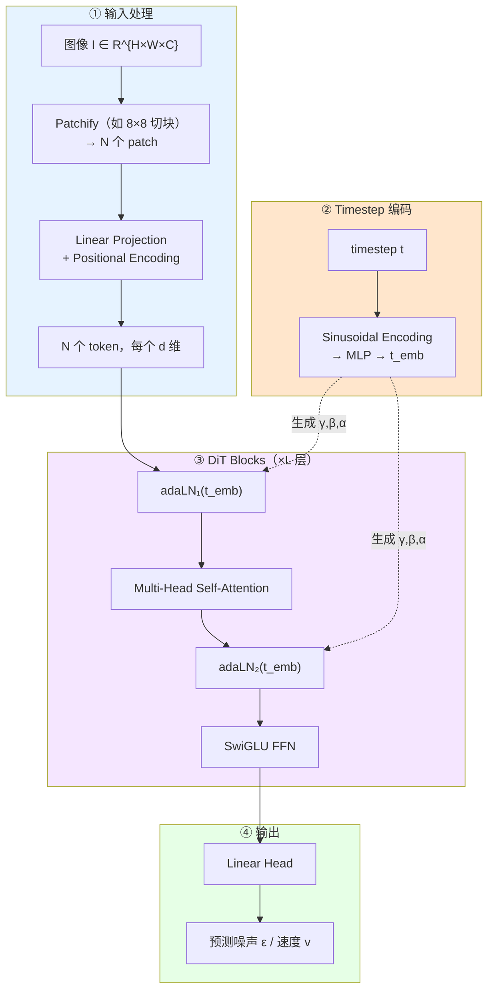

# DiT（Diffusion Transformer）完全解读：用 Transformer 替代 U-Net 做扩散生成

> **核心论文**：Scalable Diffusion Models with Transformers（Peebles & Xie, ICCV 2023）
> **概念类型**：扩散模型 backbone 架构演进——从 U-Net（卷积）到 Transformer（注意力）
> **自动驾驶/VLA 中的典型应用**：π₀ / π₀.₅ / π₀.₆ / π₀.₇ 的 Action Expert（第九章）/ Xiaomi-Robotics-0 的 Action Head（第九章）/ DiffusionDrive 的规划解码器（第六章）

---

## 读之前先搞清楚

### DiT 要解决什么问题？

扩散模型（DDPM/DDIM）的传统 backbone 是 **U-Net**——一个卷积架构，在图像生成（Stable Diffusion）上极其成功。但 U-Net 有两个先天局限：

```
U-Net 的问题：

1. 架构僵化：U-Net 是"为图像设计的"
   - 下采样 + 上采样的 U 形结构 → 对 pixel grid 非常自然
   - 但 trajectory（轨迹）是低维序列，不是 2D grid
   - 强行把轨迹 reshape 成 2D 图 → 信息被扭曲

2. 扩展性差：U-Net 的参数扩展方式不灵活
   - 要增加表达能力 → 只能堆更多的卷积层 → 不优雅
   - Transformer 可以更灵活地控制深度/宽度/注意力头数

3. 多模态融合难：U-Net 的 cross-attention 是"外加的"
   - 用 cross-attention 注入 text condition 是后来 hack 进去的
   - Transformer 原生支持 sequence-to-sequence 的多模态交互
```

**DiT 的核心 idea**：**用 Transformer 替代 U-Net 作为扩散模型的 backbone。** 扩散模型的"扩散+去噪"框架不变，但把去噪网络从 U-Net 换成 Transformer。

> **小白理解**：U-Net 像一个专门为"画图"设计的画架——很好用，但只能画画。DiT 像一个通用机器人手臂——不但能画画，还能写书法、拧螺丝、叠毛巾。在自动驾驶里，你需要的是"生成轨迹"而不是"生成图像"，用 DiT 比 U-Net 自然得多。

### 读懂 DiT 需要的前置知识

| 概念 | 简单解释 |
|:---|:---|
| **DDPM/Flow Matching** | 扩散模型：加噪→去噪；Flow Matching：学速度场 ODE 直线走 |
| **U-Net** | 编码器-解码器的卷积架构，中间有 skip connection |
| **Transformer Block** | Self-Attention + FFN + Layer Norm，可堆叠任意层数 |
| **adaLN（Adaptive Layer Norm）** | 根据 timestep t 动态调整 Layer Norm 的 scale 和 shift |
| **Patchify（分块）** | 把输入切成大小相同的小块，每块展平成 1D token |
| **Cross-Attention** | Q 来自当前序列，K/V 来自另一个序列（如 text condition） |

---

## 一、DiT 的核心设计



### 第 1 步：输入处理 —— 把一切变成 token

DiT 的第一步：把任意输入（图像 / 轨迹 / action）变成一维 token 序列。

```
图像输入（原始 DiT 论文）：
  I ∈ R^{H×W×C}（如 256×256×3）
    ↓ Patchify（切成 8×8 的 patch）
  变成 (H/8)×(W/8) = 32×32 = 1024 个 patch
    ↓ 每个 patch 展平 + Linear Projection
  1024 个 token，每个 token 维度 d（如 768）
    ↓ 加上 Positional Encoding
  [token₁, token₂, ..., token₁₀₂₄]


轨迹/动作输入（自动驾驶，如 π₀）：
  τ ∈ R^{T×D}（如 30 步 × 14 维 action）
    ↓ 无需 patchify，直接 Linear Projection
  T 个 token（每个时间步一个 token），每个维度 d
    ↓ 加上 Sinusoidal PE（时间位置编码）
  [token_τ₁, token_τ₂, ..., token_τ_T]
```

> **核心差异**：U-Net 需要把输入 reshape 成 2D grid → 卷积；DiT 把输入变成 1D token 序列 → Attention。**后者天然适合非图像数据（轨迹、action、state）。**

### 第 2 步：adaLN —— 如何把 timestep 注入 Transformer？

扩散模型的去噪网络必须知道当前时间步 t（噪声水平有多高）——因为 t=0.1（几乎干净）和 t=0.9（几乎全是噪声）的去噪策略完全不同。

U-Net 的做法：把 t 编码 + 加到每个卷积层的 feature map 上（通过 FiLM 或简单的加法）。
DiT 的做法：**adaLN（Adaptive Layer Norm）**——让 t 控制 Transformer 内部归一化层的参数。

```
adaLN 的工作流程：

  timestep t（标量）
    ↓ Sinusoidal Encoding
  t_emb ∈ R^d（如 768 维的 time embedding）
    ↓ MLP（1 层）
  [γ₁, β₁, γ₂, β₂, α₁, α₂] ← 6 个参数向量，每个维度 d

  对每个 Transformer Block 内的 Layer Norm：
    LN₁(x) = γ₁ ⊙ LayerNorm(x) + β₁    ← t 决定了怎么"缩放"和"平移"归一化
    LN₂(x) = γ₂ ⊙ LayerNorm(x) + β₂

  对 Attention 和 FFN 的残差路径：
    x = x + α₁ × Attention(LN₁(x))
    x = x + α₂ × FFN(LN₂(x))
    ← t 还控制了残差分支的"强度"


🔢 直觉：
  t=0.0（纯噪声）：adaLN 让网络"大步去噪"，残差分支权重 α 很大
  t=1.0（几乎干净）：adaLN 让网络"精细微调"，残差分支权重 α 很小
```

**为什么不用 Cross-Attention 注入 t？**

Cross-Attention 也可以把 t_emb 作为 K/V 注入。但 adaLN 有两个优势：
1. **参数效率更高**——adaLN 每层只需 6d 个额外参数（γ, β, α），cross-attention 需要更多
2. **更直接**——t 直接控制归一化和残差强度，对训练的稳定性和收敛速度有好处

### 第 3 步：DiT Block 的完整结构

```
DiT Block 的内部：

  输入 x（[N_tokens × d]）

  ┌─ adaLN₁ ─→ Multi-Head Self-Attention ─→ ×α₁ ─┐
  │                                                ├─→ +
  └────────────────────────────────────────────────┘    │
                                                         ├─→ 中间 x
  ┌─ adaLN₂ ─→ FFN (SwiGLU) ─→ ×α₂ ──────────────┐    │
  │                                                ├─→ +
  └────────────────────────────────────────────────┘

  其中 Multi-Head Self-Attention：
    Q, K, V = Linear(x), Linear(x), Linear(x)
    Attention(Q,K,V) = softmax(QK^T/√d_head) × V

  其中 FFN（SwiGLU 变体，更现代）：
    gate = σ(W_g · x)      ← sigmoid 门控
    up = W_up · x           ← 升维
    y = W_down · (gate ⊙ up)  ← 降维


  adaLN₁ 和 adaLN₂ 的参数：
    由 t_emb 经过 MLP 生成：γ₁, β₁, α₁, γ₂, β₂, α₂
```

> **小白理解**：DiT Block 就是标准的 Transformer Block，但所有 normalization 的参数都是"活的"——会随着 timestep t 变化。你可以理解为：不同 t 对应不同的"滤镜参数"——噪声大时用粗滤镜（大步去噪），噪声小时用细滤镜（精细微调）。

### 第 4 步：DiT 的三种条件注入方式

原始 DiT 论文探索了三种注入 condition（如 text / timestep）的方式：

```
① In-Context Conditioning（上下文条件）：
  把 condition token 拼接在输入序列里：
  input = [cond_token₁, cond_token₂, ..., x₁, x₂, ..., x_N]
  → Self-Attention 自动处理 cond 和 x 的交互
  
  优点：最灵活，原生支持多模态
  缺点：condition 和 x 的序列混在一起，不分离
  典型用途：π₀ —— 把 [SINK] + state token + noisy action token 拼一起


② Cross-Attention Conditioning（交叉注意力条件）：
  x → Self-Attention（Q 来自 x）
  x → Cross-Attention（Q 来自 x，K/V 来自 condition token）
  
  优点：condition 和 x 清楚分离，各自独立处理
  缺点：需要额外设计 condition encoder
  典型用途：Xiaomi-Robotics-0 —— DiT 的 Cross-Attention 去 VLM KV cache


③ adaLN-Zero Conditioning（自适应归一化条件）：
  只用 adaLN 注入 t，condition 信息全靠 t_emb 的 MLP 生成
  
  优点：最参数高效
  缺点：condition 容量受限于 MLP
  典型用途：原始 DiT 论文的图像生成
```

---

## 二、DiT 在自动驾驶 VLA 中的角色

```
VLA 中 DiT 的典型用法：

  VLM（大模型，4B-7B）          ← 理解场景（image + language）
    │
    │ KV cache / hidden states
    ▼
  DiT（轻量，300M-500M）        ← 生成 action（用 Flow Matching）
    │
    ▼
  Action Chunk（30 步 trajectory）
```

**为什么是 DiT 而不是 U-Net？**

| 原因 | 详述 |
|:---|:---|
| **轨迹是 1D 序列** | 30 步 × 14 维 → 天然是 token 序列，不需要强扭成 2D grid |
| **多模态融合容易** | Transformer 天然支持 image/text/state 混合序列 |
| **与 VLM 架构一致** | VLM 也是 Transformer → KV cache 可以直接喂给 DiT 的 Cross-Attention |
| **可 Scale** | 加层数、加宽度、加注意力头 → 三个 knob 灵活控制参数量 |
| **Flow Matching 友好** | adaLN 注入 timestep → 天然的 Flow Matching conditioner |

---

## 三、各论文中的 DiT 差异

| 论文 | DiT 层数 | 参数量 | 条件注入方式 | 输出 |
|:---|:---|:---|:---|:---|
| **原始 DiT** | 12-28 层 | 33M-675M | adaLN-Zero | 图像 patch token |
| **π₀** | ~20 层 | ~300M | In-Context (state+noise 拼接) | 50 步 action chunk |
| **π₀.₅** | ~20 层 | ~300M | In-Context + Cross-Attention to VLM | 50 步 action chunk |
| **Xiaomi-Robotics-0** | 16 层 | ~300M | Cross-Attention to VLM KV cache | 30 步 action chunk |
| **DiffusionDrive** | ~6 层 | 轻量 | Cross-Attention to BEV feature | 轨迹航点 (T×2) |

---

## 四、DiT vs U-Net —— 完整对比

| 维度 | U-Net | DiT |
|:---|:---|:---|
| **核心操作** | 卷积（局部感受野） | Self-Attention（全局感受野） |
| **架构形状** | U 形（下采样→上采样） | 直筒（等长序列，无压缩） |
| **天然适合** | 2D 图像（pixel grid） | 1D 序列（token sequence） |
| **Scale 方式** | 堆层数、加通道数 | 加层数、加宽度、加注意力头 |
| **Condition 注入** | Cross-Attention（后期 hack） | adaLN / In-Context / Cross-Attn（原生） |
| **多模态** | 需要额外设计条件编码器 | 直接拼 token 序列 |
| **训练稳定性** | 好（CNN 天然稳定） | 需要 warmup / lr schedule |
| **推理速度** | 快（CNN 硬件优化好） | 与序列长度二次方（但短序列时够快） |

---

## 五、一句话总结

> **DiT 用 Transformer 替代 U-Net 作为扩散模型的 backbone——通过 adaLN 根据 timestep 动态调整归一化参数，天然支持 1D 序列（轨迹/action）生成和多模态 token 混合——成为 π₀ 系列和 Xiaomi-Robotics-0 等 VLA 模型 Action Expert 的标配架构。**

---

## 参考资料

- **DiT 原始论文（Peebles & Xie, ICCV 2023）**：https://arxiv.org/abs/2212.09748
- **π₀（Physical Intelligence）**：https://arxiv.org/abs/2501.00951 —— DiT + Flow Matching VLA
- **Xiaomi-Robotics-0**：https://arxiv.org/abs/2602.12684 —— MoT（VLM + DiT）
- **U-Net（Ronneberger et al., MICCAI 2015）**：https://arxiv.org/abs/1505.04597 —— 经典去噪 backbone
