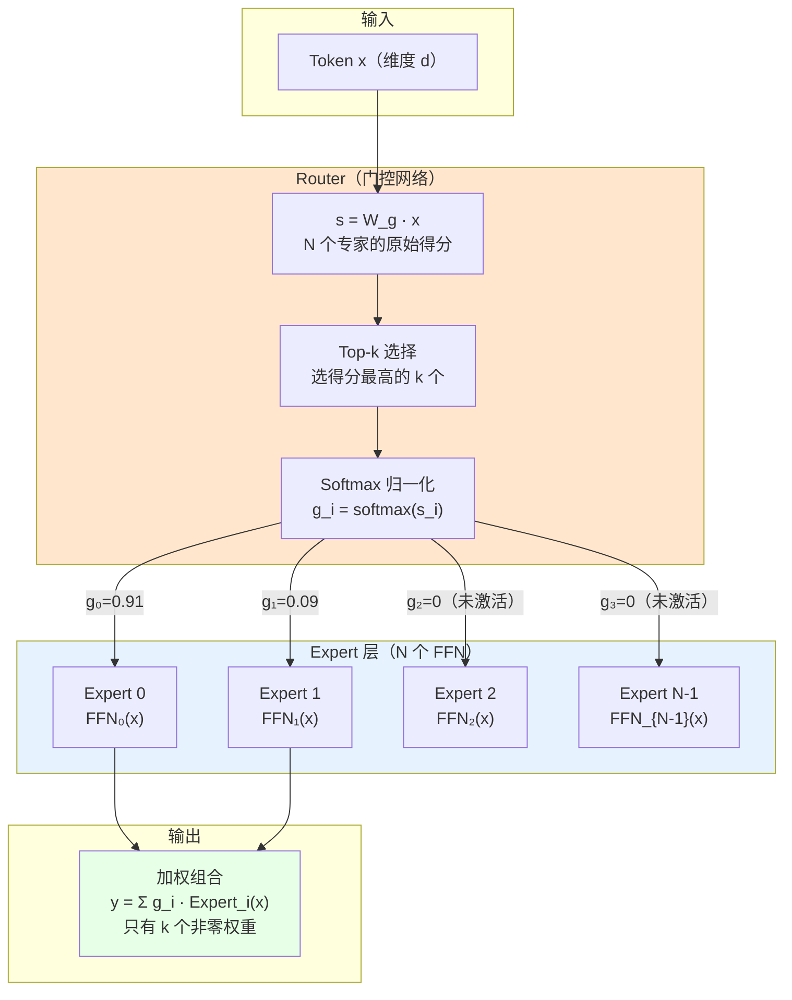

# MoE（Mixture of Experts）完全解读：用"专家团"替代"通才"，参数涨 8 倍计算只涨 1 倍

> **核心论文**：Outrageously Large Neural Networks: The Sparsely-Gated Mixture-of-Experts Layer（Shazeer et al., ICLR 2017）；Switch Transformers（Fedus et al., JMLR 2022）；Mixtral of Experts（Jiang et al., 2024）
> **概念类型**：深度学习架构设计模式，LLM 和 VLA 模型中广泛使用的参数扩展技术
> **自动驾驶中的典型应用**：DriveMoE（第五章）/ DriveVLA-W0 Action Expert（第六章）/ π₀ Action Expert（第九章）

---

## 读之前先搞清楚

### MoE 要解决什么问题？

做大模型有一个根本矛盾：**参数越多 → 表达能力越强 → 但计算量也线性增长。**

```
传统 Dense 模型（如 GPT-4）：
  每个 token 必须经过所有参数 → 1T 参数 = 1T 计算量
  → GPU 烧钱、推理慢、部署难

MoE 模型（如 Mixtral 8×7B）：
  总参数 47B，但每个 token 只激活 2/8 个专家 = 13B 活跃参数
  → 47B 参数的表达能力，只花 13B 参数的计算量
  → 参数涨了 6 倍，计算只涨了 1 倍！
```

**核心 trick**：不是让一个大全连接层处理所有输入，而是准备 N 个"专家"（每个是一个 FFN 子网络），每个 token 由 Router（门控网络）决定"该找哪几个专家"，只激活被选中的专家。

> **小白理解**：传统模型像一个"全科医生"——不管你是什么病，他都得给你看一遍，挂号费（计算量）固定。MoE 像一个"专家门诊"——前台护士（Router）根据你的症状分诊：头痛→神经内科（Expert 3），胃痛→消化内科（Expert 7）。你只看一两个专家，挂号费便宜，但医院里坐了几十个各科专家，什么病都能看。

### 读懂 MoE 需要的前置知识

| 概念 | 简单解释 |
|:---|:---|
| **FFN（前馈网络）** | Transformer 中 Attention 之后的 2 层 MLP：x → W₁·σ(W₁·x) → 升维再降维 |
| **Token** | 输入序列中的一个位置向量（一个词 / 一个图像 patch / 一个 state 向量） |
| **Sparse Activation（稀疏激活）** | 只激活网络的一部分（几个专家），其余不计算，梯度也不传 |
| **Top-k Gating** | 从 N 个专家中选得分最高的 k 个，只让它们处理当前 token |
| **Load Balancing** | 确保每个专家都被"公平使用"，不让某些专家闲置、某些过劳 |
| **Conditional Computation** | 根据输入内容动态决定"用哪些参数"而非固定全用 |

---

## 一、MoE 的核心机制



### 第 1 步：Router（门控网络）—— "分诊护士"

```
输入：一个 token 向量 x（维度 d）

Router 计算每个专家的"匹配得分"：
  s = W_g · x          ← W_g 是 [N_experts × d] 的可学习矩阵
  s_i = 专家 i 对当前 token 的原始得分

Top-k 选择：
  selected = topk(s, k)  ← 选得分最高的 k 个专家（典型值 k=2）
  
Softmax（仅对选中的专家做）：
  g_i = softmax(s_i) for i in selected
  g_i = 0 for i not in selected

输出给专家 i 的"门控权重"：g_i


🔢 数字例子（N=4 个专家，k=2）：

  x 是某个自动驾驶场景的 token（d=512，简化为概念）
  Router 计算出 4 个得分：s = [0.3, 5.1, 2.8, 0.9]
  
  Top-2 选择：Expert 1 (5.1) 和 Expert 2 (2.8) 被激活
  Softmax 归一化：g₁ = e^5.1/(e^5.1+e^2.8) ≈ 0.91
                  g₂ = e^2.8/(e^5.1+e^2.8) ≈ 0.09
  Expert 0 和 Expert 3：不激活，g₀=g₃=0

  最终输出 = 0.91 × Expert₁(x) + 0.09 × Expert₂(x)
```

> **小白理解**：Router 就是分诊台。每个 token 进来，护士（Router）看它一眼，在电脑上查"这个症状匹配哪个科室"（W_g × x），然后给最匹配的两个科室打电话（只激活 Top-2）。挂号费只收两个科室的钱（计算量 = 2 × 单专家 FFN）。

### 第 2 步：Expert（专家网络）—— 各自专精的"科室"

```
每个 Expert 本质上就是一个标准 FFN：

  Expert_i(x) = W₂_i · σ(W₁_i · x)

  其中：
    W₁_i: [d_ff × d]     ← 升维矩阵（如 512 → 2048）
    W₂_i: [d × d_ff]     ← 降维矩阵（如 2048 → 512）
    σ: 激活函数（GELU / SwiGLU）

所有 N 个 Expert 的 W₁、W₂ 参数都不同 → 各自学不同的模式
```

**专家到底学到了什么？** 这是一个开放研究问题，但有观察表明：

| 专家类型 | 可能学到的模式 | 出现场景 |
|:---|:---|:---|
| **语法专家** | 从句结构、时态变化 | 复杂长句 |
| **知识专家** | 历史事实、科学概念 | "爱因斯坦出生于..." |
| **驾驶场景专家** | 路口左转 / 高速巡航 / 拥堵跟车 | 不同驾驶场景 |

> **小白理解**：每个专家就像一个不同科室的医生。神经内科（Expert 3）专看头痛，消化内科（Expert 7）专看胃痛。但这些都是"训出来的"——训练过程中，神经网络自己学会了"把不同类型的 token 分配给不同专家"，而不是人为规定的。

### 第 3 步：稀疏激活的输出

```
MoE Layer 的完整前向传播：

  输入 x（维度 d）
    │
    ├──→ Router → Top-k 选择 → g₁, g₂（门控权重）
    │
    └──→ Expert₁(x) → 输出₁
         Expert₂(x) → 输出₂
         Expert₃(x) → 不计算（未激活）
         Expert₄(x) → 不计算（未激活）
    
  最终输出 = g₁ × 输出₁ + g₂ × 输出₂  ← 加权组合

与标准 FFN 的对比：
  标准 FFN：y = W₂ · σ(W₁ · x)          ← 所有参数都参与
  MoE：     y = Σ g_i · Expert_i(x)      ← 只有 k 个专家的参数参与
```

---

## 二、MoE 的训练 —— 两个关键挑战

### 挑战 1：Load Balancing（负载均衡）

**问题**：Router 可能学会"偷懒"——总是把 token 发给同一两个专家，其余专家闲置。

```
专家闲置问题：
  Expert 0: ████████████████████ (被 80% 的 token 选中)
  Expert 1: ████ (被 15% 的 token 选中)
  Expert 2: █ (被 5% 的 token 选中)
  Expert 3: _ (从未被选中 → 梯度为 0 → 永远学不到东西 → "死专家")

后果：花了 N 个专家的显存，只用了 1-2 个专家的效果
```

**解决方案：Load Balancing Loss（辅助损失）**

```
L_balance = N · Σ_i f_i · P_i

其中：
  f_i = 专家 i 被选中的频率（这一 batch 中，多少 token 选了专家 i）
  P_i = 专家 i 的平均门控概率（Router 给专家 i 的平均得分 softmax）

当 f_i = 1/N（均匀分布）时，L_balance 最小
当 f_i 集中在少数专家时，L_balance 变大，惩罚不均匀

总 Loss = L_task + α · L_balance    （α 一般很小，如 0.01）
```

**还有更直接的方法——Auxiliary Loss + Capacity Factor**：

```
Capacity Factor（容量因子）：
  每个专家设置最大处理 token 数：
    capacity = (total_tokens / N_experts) × capacity_factor
  
  如果某个专家的 capacity 满了，多余的 token "溢出"——
  可能被丢掉（token dropping）或通过残差连接原样传递

  效果：强制 Router 不能把太多 token 发给同一个专家
```

> **小白理解**：Load Balancing Loss 就像医院考核——如果某个科室总是没人去（专家闲置），就扣绩效（增加 loss），逼着分诊护士把病人均匀分配。Capacity Factor 则是"每个科室每天只看 50 个号，满了就转其他科"——强行分流。

### 挑战 2：Expert Collapse（专家坍缩）

```
Expert Collapse 的表现：
  训练初期：Router 随机分配 token 给各专家
  训练中期：所有专家输出越来越相似（都学了"平均策略"）
  训练后期：相当于 k 个相同的 FFN → MoE 退化成普通 FFN × k

原因：
  Router 有多个"差不多好"的选择时，
  各专家接收的 token 分布越来越相似 → 学的 pattern 也趋同
```

**缓解方法**：
- **Noisy Top-k Gating**：Router 输出加高斯噪声再选 Top-k → 增加随机探索
- **Expert Dropout**：随机丢掉一些专家的输出 → 防止过度依赖某个专家
- **Switch Transformer 的简化**：k=1（每 token 只激活 1 个专家）→ 强行让每个专家独立学习

---

## 三、MoE 的经典架构变体

```
MoE 演进树：

  Sparsely-Gated MoE (Shazeer 2017) ─── 奠基：提出 Router + Expert 范式
      │
      ├── GShard (2020) ─── 把 MoE 扩展到 600B 参数、跨 TPU 分布式
      │
      ├── Switch Transformer (2021) ─── k=1 简化，证明 MoE 可稳定训练
      │     │                            提出 capacity factor 防止溢出
      │     └── → 训练速度快 7×（比同 FLOPs 的 Dense 模型）
      │
      ├── Mixtral 8×7B (2024) ─── 开源 SOTA，47B 总参，130B 的 Dense 效果
      │     │                      8 专家，每 token 激活 2 个
      │     └── → 证明 MoE 在开源 LLM 上的可行性
      │
      └── 自动驾驶 MoE (2025) ───
            │
            ├── DriveMoE：多专家处理不同驾驶场景（高速/城市/路口）
            │
            ├── DriveVLA-W0 Action Expert：
            │     MoE 作为动作专家（500M 参数，每 token 激活 2-4 专家）
            │     与 7B VLM 通过 Joint Attention 耦合
            │
            └── π₀ Action Expert：
                  MoE 作为 DiT 内部的 FFN 层
                  不同专家处理不同 dexterity 的动作模式
```

---

## 四、为什么自动驾驶 VLA 特别适合 MoE？

| VLA 的特性 | 为什么适合 MoE |
|:---|:---|
| **场景多样性** | 高速 / 城市 / 路口 / 停车场 → 每种场景激活不同专家 |
| **动作多样性** | 左转 / 直行 / 加速 / 刹车 / 精细操作 → 不同动作模式不同专家 |
| **VLM 冻结** | VLM 不动，Action Expert 需要充分的表达能力 → MoE 以少量计算换大表达力 |
| **推理延迟敏感** | 自动驾驶需要实时 → MoE 稀疏激活 = 参数大但计算少 = 推理快 |
| **数据混合训练** | VL data + robot data + navigation data → 不同专家可"分工"记忆不同数据类型 |

---

## 五、MoE 的代价

| 代价 | 说明 |
|:---|:---|
| **显存占用大** | 总参数 = N × 单专家参数，即使不激活也要存权重 |
| **通信开销** | 分布式训练中，不同专家在不同 GPU 上，token 路由需要 all-to-all 通信 |
| **Load Balancing 难调** | α 太小 → 专家不均；α 太大 → Router 退化成"均匀轮询"，失去专家分工 |
| **推理 batch size 敏感** | 小 batch 时某些专家可能没被激活 → 资源浪费 |
| **微调不稳定** | 新任务可能破坏原有的专家分工，需要专门的微调策略 |

---

## 六、MoE vs Dense —— 什么时候用哪个？

| 场景 | 推荐 | 原因 |
|:---|:---|:---|
| 参数预算大但计算预算小 | **MoE** | 稀疏激活 = 参数大 + 计算小 |
| 显存受限（边缘设备） | Dense | MoE 所有专家都要加载到显存 |
| 单一任务、场景简单 | Dense | MoE 的分工优势体现不出来 |
| VLA 中的 Action Expert | **MoE** | 需要大表达力处理多样动作 + 轻量推理 |
| 分布式训练（多 GPU） | Dense（简单）或 MoE（需优化通信） | MoE 通信开销可能抵消计算优势 |

---

## 七、一句话总结

> **MoE 用 Router + Top-k Expert 的稀疏激活机制，让模型总参数暴增（8 倍+）但每个 token 的计算量几乎不涨——用"专家门诊"替代"全科医生"，特别适合场景多样、动作多样的自动驾驶 VLA 模型。**

---

## 参考资料

- **Sparsely-Gated MoE（Shazeer et al., ICLR 2017）**：https://arxiv.org/abs/1701.06538 —— 奠基工作
- **Switch Transformers（Fedus et al., JMLR 2022）**：https://arxiv.org/abs/2101.03961 —— k=1 简化
- **Mixtral 8×7B（Jiang et al., 2024）**：https://arxiv.org/abs/2401.04088 —— 开源 SOTA MoE LLM
- **DriveMoE**：https://arxiv.org/abs/2505.16278 —— 多专家驾驶场景分工
- **DriveVLA-W0**：见 `第六章/DriveVLA-W0/drivevla_paper_guide.md` —— MoE Action Expert + Joint Attention
