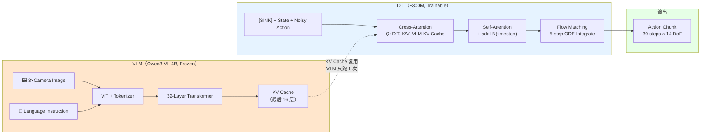

# MoT（Mixture of Transformers）完全解读：多个专用 Transformer 协作，保护 VLM + 高效推理

> **核心论文**：Xiaomi-Robotics-0（Cai et al., arXiv 2026.02）——首次提出将 MoT 架构用于 VLA 模型
> **概念类型**：多 Transformer 协作架构——不同于 MoE（一个模型内的专家混合），MoT 是多个独立 Transformer 模型之间的接口设计
> **相关概念**：MoE（第九章/基础概念/MoE）/ DiT（第九章/基础概念/DiT）/ VLA / KV Cache

---

## 读之前先搞清楚

### MoT 要解决什么问题？

VLA 模型面临一个"鱼和熊掌"的困境：

```
VLM（Vision-Language Model，如 Qwen3-VL-4B）：
  ✅ 理解图像和语言的能力非常强
  ✅ 预训练了海量知识（图文对齐、常识推理）
  ❌ 不是为 action generation 设计的
  ❌ 如果让 VLM 的梯度参与 action loss → 视觉语言能力被"冲刷"掉
     （catastrophic forgetting）


DiT（Diffusion Transformer，~300M）：
  ✅ 专为 action generation 设计（Flow Matching 出轨迹）
  ✅ 轻量，推理快（16 层，~300M 参数）
  ❌ 没有视觉语言理解能力
  ❌ 单独用就是盲的——不知道场景是什么
```

**MoT 的核心 idea**：不训练一个大一统模型，而是让 VLM 和 DiT 各自做自己最擅长的事，通过 **KV Cache 接口** 连接——VLM 处理 image+language → 输出 KV cache → DiT 以 KV cache 为 condition 生成 action。

```
大一统方案（如 π₀.₅、OpenVLA）：
  ┌─────────────────────────────────────┐
  │ 一个大 Transformer                  │
  │ Image + Language + Action 一起训练  │
  │                                     │
  │ 问题：action 训练的梯度会破坏 VLM   │
  │ 的视觉语义能力（catastrophic forgetting）│
  └─────────────────────────────────────┘

MoT 方案（Xiaomi-Robotics-0）：
  ┌──────────────┐    KV Cache    ┌──────────────┐
  │ VLM (frozen) │ ═══════════════│ DiT (trainable)│
  │ 4B params    │   接口         │ 300M params   │
  │ 理解场景     │                │ 生成 action    │
  └──────────────┘                └──────────────┘
  
  优势：VLM 冻结 → 视觉语言能力完整保留
       DiT 独立训练 → 专注 action，不受 VLM 干扰
       推理时 VLM 只跑 1 次 → KV cache 复用 → DiT 跑 5 次 → 总延迟可控
```

> **小白理解**：大一统方案像一个"全才"——什么都学，结果什么都学不精（VLM 能力被 action 训练毁了）。MoT 像一个"导演+演员"组合——导演（VLM）看剧本理解场景，不需要亲自演戏；演员（DiT）根据导演指示执行动作，不需要看懂剧本。各司其职，互不干扰。

### 读懂 MoT 需要的前置知识

| 概念 | 简单解释 |
|:---|:---|
| **VLM（Vision-Language Model）** | 能同时理解图像和文本的 Transformer 模型（如 Qwen3-VL） |
| **DiT（Diffusion Transformer）** | 用 Transformer 做 flow-matching 去噪生成 action 的模型 |
| **KV Cache** | Transformer 推理时缓存的 Key/Value 矩阵，供后续 Cross-Attention 使用 |
| **Cross-Attention** | Q 来自一个序列，K/V 来自另一个序列——"用我的问题查你的信息" |
| **Catastrophic Forgetting** | 新任务训练后，模型在旧任务上的能力大幅退化 |
| **MoE** | 一个模型内多个 FFN Expert + Router —— 与 MoT（多个独立模型）不同 |

---

## 一、MoT 和 MoE —— 最容易混淆的两个概念

```
                  MoE（Mixture of Experts）     MoT（Mixture of Transformers）
                  
层次：             一个模型 内部                  多个独立模型 之间

粒度：             FFN 层 的替换                 整个 Transformer 的协作

Router 在哪：      模型内部（每个 MoE 层一个）     无 Router，固定接口（KV Cache）

参数共享：         所有 Expert 共享 Attention      各自独立的 Attention + FFN

典型例子：         Mixtral 8×7B                 Xiaomi-Robotics-0
                  DriveVLA-W0 Action Expert     VLM + DiT

类比：             一个医院里的多个科室            两个不同医院之间的会诊
                  （内科/外科/儿科都在同一栋楼）   （综合医院→专科医院的转诊单）

何时用：           需要同一类网络的大表达力         需要不同性质模型的专业分工
                  + 少量推理计算                   + 保护各自的能力
```

> **小白理解**：MoE 是"一个公司有多个部门"（都在同一套管理体系下）；MoT 是"两家公司合作"（各自独立运营，通过合同接口对接）。MoE 适合"同质化但容量大"的需求（LLM 的知识记忆），MoT 适合"异质化且要独立"的需求（VLM 的理解能力 + DiT 的 action 生成能力）。

---

## 二、MoT 的核心机制 —— 以 Xiaomi-Robotics-0 为例



### 第 1 步：VLM 作为"场景理解器"（冻结）

```
VLM 的输入：
  - 3 张 camera image（2 腕部 + 1 全局）
  - 语言指令（如 "把红色积木放进蓝盒子里"）
  - Proprioceptive state（关节角度 —— 可选注入）

VLM 的处理：
  image₁ → ViT patch embedding → [img_tokens_1]
  image₂ → ViT patch embedding → [img_tokens_2]
  image₃ → ViT patch embedding → [img_tokens_3]
  text   → tokenizer → [text_tokens]
  
  拼接：[img_tokens_1] [img_tokens_2] [img_tokens_3] [text_tokens]
  
  ↓ Qwen3-VL-4B（32 层 Transformer，frozen）
  
  输出：最后 16 层的 KV Cache → 传给 DiT

VLM 的关键属性：
  ✅ 冻结：gradient 不传回 VLM → 视觉语言能力完整保留
  ✅ 只跑一次：推理时 VLM 的 KV Cache 可复用（DiT 跑多次）
```

### 第 2 步：KV Cache 作为"模型间接口"

```
KV Cache 是什么？
  对每一层 Transformer：
    K = X @ W_K    ← Key 矩阵，[seq_len × d_head × n_heads]
    V = X @ W_V    ← Value 矩阵，[seq_len × d_head × n_heads]
  
  KV Cache = 堆叠所有层的 (K, V) 对

为什么用 KV Cache 做接口？

  ① 信息密度高：KV Cache 包含了 VLM 对所有输入 token 的编码表示
  ② 原生 Cross-Attention 接入：
     DiT 的任意层都可以直接：
       Q_dit = X_dit @ W_Q_dit
       output = softmax(Q_dit @ K_vlm^T / √d) @ V_vlm
     无需额外设计接口
  ③ 计算高效：VLM 只跑 1 次 → KV Cache 存储起来 → DiT 跑 5 次 flow matching
     每次 DiT 推理都复用同一个 KV Cache
```

### 第 3 步：DiT 作为"动作生成器"（可训练）

```
DiT 的输入序列：
  [SINK] [proprioceptive state] [noisy action tokens]
  
  其中：
    SINK：可学习的 attention sink token（吸收多余 attention 权重）
    state：当前机器人关节角度编码
    noisy action：flow matching 的当前噪声 action → 逐步去噪

DiT 的每一层：
  Self-Attention：
    Q, K, V 都来自 DiT 自己的序列
    → 学习 state 和 action 之间的关系
  
  Cross-Attention：
    Q 来自 DiT 序列（state tokens + action tokens）
    K, V 来自 VLM 的 KV Cache
    → DiT "查" VLM 看到了什么、理解了什么指令


推理时 Flow Matching（5 步 ODE）：

  Step 0:  action_noise ~ N(0,I)
  Step 1:  DiT(action_noise, KV_cache) → v₁ → action₁ = action_noise + v₁×Δt
  Step 2:  DiT(action₁, KV_cache) → v₂ → action₂ = action₁ + v₂×Δt
  ...
  Step 5:  action_final → 作为 30 步 action chunk 输出

每次 DiT 推理都 Cross-Attend 到同一个 VLM KV Cache（复用！）
```

> **小白理解**：VLM 像一本"场景说明书"（KV Cache = 书的内容摘要）。DiT 像一个工程师，手边放着这本说明书——每次做决策（flow matching 的每一步）时，都翻一下说明书（Cross-Attention to KV Cache），确认"现在的场景是什么、指令是什么"。说明书只需要写一次（VLM 跑 1 次），工程师可以反复翻（DiT 跑 5 次）。

---

## 三、MoT 的关键设计选择

| 设计选择 | Xiaomi-Robotics-0 的做法 | 替代方案 | 权衡 |
|:---|:---|:---|:---|
| **VLM 是否冻结** | ✅ 冻结 | 可训练（如 π₀.₅） | 冻结→保护 VL 能力；可训练→更好的 action 性能但 VL 退化 |
| **接口层数** | VLM 最后 16 层 KV | VLM 全部层 / 只最后一层 | 越多层→信息越丰富，但显存越大 |
| **Cross-Attention 频率** | DiT 每层都做 | 隔层做 / 只在第一层做 | 每层都做→深度融合；隔层做→更快 |
| **SINK Token** | ✅ 使用 | 不使用 | SINK → 训练更稳定，吸收多余 attention |
| **DiT 大小** | 16 层 ~300M | 更多层更大 | 越大→action 精度越好，但推理越慢 |

---

## 四、为什么 MoT 比大一统方案更好？

### 理由 1：保护 VLM 的视觉语言能力

```
大一统方案（如 π₀.₅）的 VL 能力测试结果：
  ERQA: 0.0  |  POPE: 0.0  |  AI2D: 14.4  |  MMBench: 22.1
  → 训练后 VLM 几乎完全"失明"

MoT 方案（Xiaomi-Robotics-0）的 VL 能力测试结果：
  ERQA: 40.8  |  POPE: 88.5  |  AI2D: 78.7  |  MMBench: 84.4
  → 与原版 Qwen3-VL-4B 几乎完全一致
  → ERQA（具身推理）甚至反超原版 (+0.8)
```

### 理由 2：推理效率

```
大一统方案（π₀，单模型）：
  VLM 每步 Flow Matching 都要重新跑 → 5 步 = VLM 跑 5 次
  推理延迟：~200ms

MoT 方案（Xiaomi-Robotics-0）：
  VLM 只跑 1 次 → KV Cache 复用 → DiT 跑 5 次（DiT 只有 300M）
  推理延迟：~80ms

加速比：200ms → 80ms = 快了 2.5 倍
```

### 理由 3：训练灵活性

```
大一统方案：
  VLM + Action 必须同时训练 → 梯度耦合 → 难以调参
  VL data 和 robot data 的比例必须小心设计

MoT 方案：
  Step 1: 训练 VLM（可以 inclusion of VL data）→ 保持能力
  Step 2: 冻结 VLM，单独训练 DiT → 只关心 action loss
  → 两个阶段解耦，各自优化自己的目标
```

---

## 五、MoT 的局限性

| 局限性 | 说明 |
|:---|:---|
| **VLM 和 DiT 之间没有梯度流通** | VLM 的表示可能不是"最优的 action condition"——因为 VLM 不看 action loss |
| **KV Cache 显存开销** | VLM KV Cache 存储需要显存（16 层 × seq_len × d × 2），大 seq_len 时显著 |
| **只能用在 VLA** | MoT 目前只在 VLA 场景被验证，泛化到其他多模态任务未知 |
| **需要精心设计接口** | KV Cache 的哪些层、Cross-Attention 的频率都需要实验调优 |
| **VLM 能力保留有上限** | 如果 Step 1 的 robot data 比例太高，VLM 仍可能轻微退化 |

---

## 六、MoT vs 其他架构 —— 定位一览

```
模型架构的谱系：

  单一大模型                  MoE 混合专家                MoT 多 Transformer
  ┌──────────┐              ┌──────────┐              ┌────┐  ┌────┐
  │   GPT    │              │ Mixtral  │              │VLM │  │DiT │
  │   π₀     │              │ DriveMoE │              └──┬─┘  └─┬──┘
  │          │              │          │                 │      │
  │ 一个模型 │              │ 一个模型 │              KV Cache 接口
  │ 所有参数 │              │ 稀疏激活 │              │ 两个独立模型 │
  └──────────┘              └──────────┘              └─────────────┘
  
  参数效率：★☆☆            参数效率：★★★           参数效率：★★☆
  训练简单：★★★            训练简单：★★☆           训练简单：★★★
  推理速度：★★☆            推理速度：★★★           推理速度：★★★
  VL 保护：  ★☆☆            VL 保护：  ★★☆           VL 保护：  ★★★
  多模态：  ★★★            多模态：  ★★☆           多模态：  ★☆☆
```

---

## 七、一句话总结

> **MoT（Mixture of Transformers）用 KV Cache 接口连接冻结的 VLM（理解场景）和可训练的 DiT（生成 action），各司其职——避免大一统模型中 action 梯度破坏 VLM 的视觉语义能力，同时通过 KV Cache 复用实现高效推理（VLM 跑 1 次 + DiT 跑 5 次 = 80ms），是当前 VLA 领域保护 VLM 能力 + 实时推理的最佳架构方案。**

---

## 参考资料

- **Xiaomi-Robotics-0**：https://arxiv.org/abs/2602.12684 —— MoT 架构首次在 VLA 中的完整实现
- **π₀ 系列**：https://arxiv.org/abs/2501.00951 —— 大一统 VLA 方案（对比参考）
- **MoE 概念指南**：见 `第九章/基础概念/MoE/moe_guide.md`
- **DiT 概念指南**：见 `第九章/基础概念/DiT/dit_guide.md`
