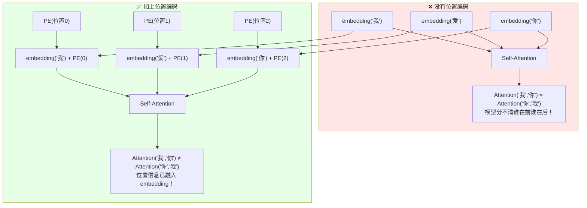

# 位置编码（Positional Encoding）完全解读：从 1D 文字到 3D 空间

> **核心论文**：Attention is All You Need（Vaswani et al., NeurIPS 2017）——首次提出 Sinusoidal Positional Encoding
> **概念类型**：深度学习基础组件，几乎所有 Transformer 架构的必备模块
> **关键变体**：Sinusoidal PE / Learnable PE / 2D PE (ViT) / 3D Ray PE (BEVFormer, DriveTransformer) / MLP-Coordinate PE (DriveTransformer, NeRF) / RoPE (LLaMA)

---

## 读之前先搞清楚

### 这个模块要解决什么问题？

Transformer 的 Self-Attention 有一个"天生的盲区"：**它对位置完全不敏感。**

```
假设你给 Transformer 输入三个 token：A、B、C

Self-Attention 计算 "A 和 B 的关系" 时：
  score(A, B) = dot(W_Q × embedding_A,  W_K × embedding_B)

如果交换 A 和 C 的位置，输入变成 C、B、A：
  score(C, B) = dot(W_Q × embedding_C,  W_K × embedding_B)
  
  只要 embedding 不变，score 就不变！
  Transformer 根本不知道 A 在前 C 在后，还是 C 在前 A 在后。
```

这与 CNN 完全不同——CNN 天然知道"像素在空间中的位置"，因为卷积是在固定窗口内操作的。但 Self-Attention 是全局的——每个 token 都能看到所有 token，**位置信息丢失了**。

**位置编码的作用**：在 token embedding 上"叠加"位置信息，让 Transformer 知道每个 token 在哪。

```
没有位置编码：
  "我  爱  你" → 三个 embedding → Self-Attention
  Attention("我", "你") 和 Attention("你", "我") 完全一样！模型分不清。

加了位置编码：
  "我" + PE(位置0) → embedding'_0
  "爱" + PE(位置1) → embedding'_1  
  "你" + PE(位置2) → embedding'_2
  → Self-Attention
  现在 Attention("我", "你") ≠ Attention("你", "我")
  因为 PE(位置0) ≠ PE(位置2)，embedding 本身就带了位置信息
```

> **小白理解**：Self-Attention 就像一个所有人都穿着同样衣服的会议室——你分不清谁是第一个发言的、谁是最后一个。位置编码就是给每个人贴上一个"座位号标签"——"1 号座位"、"2 号座位"……有了标签，你才知道谁坐在哪。

### 读懂这个模块需要的前置知识

| 概念 | 简单解释 |
|:---|:---|
| **Token Embedding** | 每个 token（单词/patch）对应的 D 维向量，查表得到或模型算出 |
| **Self-Attention** | Q 和 K 做点积算权重 → 用权重对 V 加权求和 |
| **正弦函数 sin/cos** | 周期函数，sin(x) 和 cos(x) 在 [-1,1] 之间振荡 |
| **内参/外参（Camera）** | 内参 K = 镜头焦距+光心；外参 (R,t) = camera 在世界中的位置姿态 |
| **Ego 坐标系** | 以自车为原点、车头方向为 x 轴的 3D 坐标系 |

---

## 一、位置编码的核心原理



**核心公式（极其简洁）**：

```
Token 的最终输入 = Token Embedding + Position Encoding

  input[i] = embedding[i] + PE[i]

  其中 PE[i] 只依赖于位置 i（如第 i 个 token、3D 坐标 P_i）
  不依赖于 token 内容（不是"我"或"你"）
```

> 为什么是**加**而不是拼接？因为加法在数学上等价于"让 embedding 在 PE 的方向上偏移"——如果 PE 的某维是 +0.5，embedding 在这个维度上的值就被整体"抬高"了 0.5。后续的 Self-Attention 会自动利用这个偏移来判断位置关系。

---

## 二、四种位置编码的完整详解

### 第 1 种：1D Sinusoidal Positional Encoding（Transformer 原版，最经典）

**用于**：NLP 文本序列（"我/爱/你" → 位置 0, 1, 2）

- **输入**：位置索引 pos（整数，0, 1, 2, ...）
- **操作**：

  > **总览**：位置整数 → 正弦函数映射 → D 维向量（sin 和 cos 交替）
  >
  > ```
  > pos = 3（第 3 个 token）
  >         ↓
  > ┌─────────────────────────────────────────────────────┐
  > │ PE(pos, 2i)   = sin(pos / 10000^(2i/D))           │
  > │ PE(pos, 2i+1) = cos(pos / 10000^(2i/D))           │
  > │                                                   │
  > │ i = 0, 1, 2, ..., D/2-1（D/2 个频率）             │
  > │                                                   │
  > │ 偶维度 = sin，奇维度 = cos，交替排列               │
  > └─────────────────────────────────────────────────────┘
  >         ↓
  > PE(3) = [sin(3/w₀), cos(3/w₀), sin(3/w₁), cos(3/w₁), ..., sin(3/w_{127}), cos(3/w_{127})]
  >         = 256 维向量（如果 D=256）
  > ```

  **① 频率设计**：$w_i = 10000^{2i/D}$。当 i=0（最低频维度），$w_0 = 1$，sin(pos/1) 变化很慢——pos 从 0 到 100，sin 的值缓慢振荡。当 i=D/2-1（最高频维度），$w_{max} = 10000$，sin(pos/10000) 变化极快——pos 从 0 到 1，sin 值几乎不变（因为 1/10000 ≈ 0）。

  **② 为什么用 sin/cos 而不是直接用位置数字？** 因为 sin/cos 有**平移不变性**——$\sin(a+b) = \sin a \cos b + \cos a \sin b$。这意味着任意两个位置之间的相对关系可以被线性变换表达：`PE(pos+k)` 可以通过一个线性变换从 `PE(pos)` 得到。这使 Self-Attention 能自然地学到"相距 k 个位置的 token 之间的关系"。

  **③ 为什么用多个频率？** 低频维度区分"远距离"（pos=0 和 pos=100 的 sin(pos/1) 完全不同），高频维度区分"近距离"（pos=0 和 pos=1 的 sin(pos/10000) 几乎不可区分，但 pos=0 和 pos=3 可以区分）。多频率组合 = 同时编码绝对位置和相对位置。

- **输出**：D 维向量，与 token embedding 维度相同，直接相加

> **小白理解**：正弦位置编码像一个"尺子"。低频维度是厘米刻度——适合量长距离；高频维度是毫米刻度——适合量短距离。把厘米尺和毫米尺叠在一起，你就能精确测量任何距离。多频率的 sin/cos 组合就是这把"多维尺子"。

#### 🔢 具体数字例子：D=8, pos=0 vs pos=1 vs pos=5

**条件设定**：简化版，D=8 维（实际是 256/512/768/1024），计算 3 个位置的编码。

| 维度 i | 频率 w_i = 10000^(2i/8) | PE(0) | PE(1) | PE(5) | 说明 |
|:---:|:---|:---|:---|:---|:---|
| 0 | 10000^0 = 1 | sin(0)=**0** | sin(1)=**0.84** | sin(5)=**-0.96** | 最低频，区分大范围 |
| 1 | 10000^0 = 1 | cos(0)=**1** | cos(1)=**0.54** | cos(5)=**0.28** | |
| 2 | 10000^0.25 ≈ 10 | sin(0)=**0** | sin(0.1)=**0.10** | sin(0.5)=**0.48** | |
| 3 | 10 | cos(0)=**1** | cos(0.1)=**0.99** | cos(0.5)=**0.88** | |
| 4 | 10000^0.5 = 100 | sin(0)=**0** | sin(0.01)≈**0.01** | sin(0.05)=**0.05** | |
| 5 | 100 | cos(0)=**1** | cos(0.01)≈**1.00** | cos(0.05)≈**1.00** | 中频 |
| 6 | 10000^0.75 ≈ 1000 | sin(0)=**0** | sin(0.001)≈**0** | sin(0.005)≈**0.005** | 高频 |
| 7 | 1000 | cos(0)=**1** | cos(0.001)≈**1** | cos(0.005)≈**1** | 最高频，几乎不变 |

> **关键理解**：低维度（i=0,1）在 pos=0→1→5 之间剧烈变化（0→0.84→-0.96），高维度（i=6,7）几乎不变（1→1→1）。**低维编码绝对位置，高维编码精细相对位置**——这就是多频率正弦编码的魔力。

---

### 第 2 种：Learnable Position Embedding（ViT 用的）

**用于**：ViT、BERT 等。不做正弦编码，而是把位置当作"可学习的参数"。

- **输入**：位置索引（0, 1, 2, ...）
- **操作**：

  > **总览**：位置索引 → 查表（lookup table）→ D 维可学习向量
  >
  > ```
  > 初始化：随机生成一个 (N, D) 的矩阵（N=最大位置数，如 197）
  >   PE_table = torch.randn(197, 768)  ← 可学习的参数！
  > 
  > 使用时：
  >   PE(pos=3) = PE_table[3]   ← 直接从表中取第 3 行
  > 
  > 训练中：
  >   gradient 反传 → PE_table 的值不断更新
  >   最终 PE_table 的每一行学会了"编码该位置的模式"
  > ```

  **① 和 Sinusoidal PE 的区别**：

| | Sinusoidal PE | Learnable PE |
|:---|:---|:---|
| 来源 | 数学公式（固定） | 训练出来的（可学习） |
| 长度限制 | 无限（sin 可算任意 pos） | 有限（表多大就只能支持多少位置） |
| 泛化到更长序列 | 自然支持 | 需要插值 |
| 典型用户 | Transformer 原版 | ViT, BERT, GPT |

  **② ViT 为什么用 Learnable PE？** 因为图像 patch 的数量是固定的（如 224×224 切成 196 patch），不需要无限长的位置编码。而且 Learnable PE 可以学到"左上角的 patch"vs"右下角的 patch"等 2D 空间模式。

- **输出**：D 维向量，和 patch embedding 相加

> **小白理解**：Sinusoidal PE 像"用公式算出来的标准尺子"——精确但不够灵活。Learnable PE 像"定制的尺子"——通过大量训练数据调整，学到了最适合当前任务的刻度分布。

---

### 第 3 种：2D Positional Encoding（图像专用）

**用于**：处理 2D 图像 patch 的 Transformer（如 ViT 有时也用）。

图像上的 patch 有 2D 位置 (row, col)，而不是 1D 位置 pos。

```
图像 patch 的 2D 位置：
  patch(0,0)  patch(0,1)  patch(0,2)  ...  patch(0,13)
  patch(1,0)  patch(1,1)  patch(1,2)  ...  patch(1,13)
  ...
  patch(13,0) patch(13,1) patch(13,2) ...  patch(13,13)
```

**方法 A：分别编码 row 和 col，再拼接**

```
PE(row=3, col=5):
  PE_row = Sinusoidal_1D(3, D/2)   ← 前 D/2 维编码行号
  PE_col = Sinusoidal_1D(5, D/2)   ← 后 D/2 维编码列号
  PE(3,5) = concat(PE_row, PE_col) ← 拼接成 D 维向量
```

**方法 B：直接用 2D 正弦编码**

```
PE(row=3, col=5, 2i)     = sin(row / 10000^(4i/D))
PE(row=3, col=5, 2i+1)   = cos(row / 10000^(4i/D))
PE(row=3, col=5, D/2+2i) = sin(col / 10000^(4i/D))
PE(row=3, col=5, D/2+2i+1) = cos(col / 10000^(4i/D))
```

前 D/2 维 = row 的正弦编码，后 D/2 维 = col 的正弦编码。

> 两种方法本质上一样——都是把 2D 位置拆成两个 1D 位置分别编码。

---

### 第 4 种：3D Ray Positional Encoding（DriveTransformer / BEVFormer 用的）

**这是你问的那种。** 用于多目 camera 的自动驾驶场景——每个 image patch 不只对应一个 2D 位置，而是对应 3D 空间中的**一条射线**。

- **输入**：camera 内外参 + patch 的像素坐标 (u, v)
- **操作**：

  > **总览**：像素 (u,v) → 相机模型反投影 → 沿射线采 K 个 3D 点 → 对每个点做 3D 正弦编码 → 合并 K 个编码
  >
  > ```
  > Step 1：像素 → 射线
  > ─────────────────
  > 像素 (u, v) + 相机内参 K
  >         ↓
  > camera 坐标系中的方向向量：
  >   x_cam = (u - c_x) / f_x  × d
  >   y_cam = (v - c_y) / f_y  × d
  >   z_cam = d
  > 
  > 其中 d 是未知深度 → 这就是一条射线！
  > 
  > Step 2：沿射线采 K=7 个 3D 点
  > ────────────────
  > 在 d=1m, 3m, 5m, 10m, 20m, 35m, 50m 各取一个点
  > 
  > 对每个点，通过 camera 外参 (R, t) 转到 ego 坐标系：
  >   P_ego = R × P_cam + t
  > 
  > 得到 K 个 ego 坐标系下的 3D 坐标：
  >   P₁ = (x₁, y₁, z₁)
  >   P₂ = (x₂, y₂, z₂)
  >   ...
  >   P₇ = (x₇, y₇, z₇)
  > 
  > Step 3：每个 3D 坐标 → 正弦位置编码
  > ────────────────────────
  > 对 Pₖ = (x, y, z)：
  > 
  >   PE_x = Sinusoidal_1D(x, D/3)  ← 前 D/3 维（~85 维 for D=256）
  >   PE_y = Sinusoidal_1D(y, D/3)  ← 中间 D/3 维
  >   PE_z = Sinusoidal_1D(z, D/3)  ← 后 D/3 维
  > 
  >   PE(Pₖ) = concat(PE_x, PE_y, PE_z)  ← 256 维向量
  > 
  > Step 4：合并 K 个点的编码
  > ────────────────
  > PE_ray = Mean(PE(P₁), PE(P₂), ..., PE(P₇))  ← 简单平均
  > 
  > 或者：保留 7 个独立编码，在 SCA 中分别使用
  > ```

- **输出**：256 维向量（或 7×256 维），和 patch embedding 相加

> **小白理解**：1D PE 像一根线上标刻度（token 0,1,2...）。2D PE 像一张纸上标网格位置（第几行第几列）。3D Ray PE 像用探照灯扫描 3D 空间——一条光线扫过整个深度范围，在 7 个距离各取一个"快照"，7 个快照拼成对这条光线的完整描述。

#### 🔢 具体数字例子：前视 camera 的一个 patch 如何得到 PE

**条件设定**：前视 camera，patch 对应像素 (800, 360)（图像中心偏下），f_x=f_y=800, c_x=800, c_y=450。

```
Step 1：像素 (800, 360) → camera 坐标
──────────────────────────────────
  x_cam = (800-800)/800 × d = 0      ← 正好在 camera 正前方
  y_cam = (360-450)/800 × d = -0.1125d ← 略偏上
  z_cam = d

Step 2：沿射线取 7 个点（ego 坐标，camera 高度 1.5m）
──────────────────────────────────
  d=1m:   P₁ = (1.0,  -0.11, 1.39)  ← 车正前方 1m，接近地面
  d=3m:   P₂ = (3.0,  -0.34, 1.16)  
  d=5m:   P₃ = (5.0,  -0.56, 0.94)  ← 前方 5m 地面
  d=10m:  P₄ = (10.0, -1.13, 0.38)  ← 前方 10m，接近地面
  d=20m:  P₅ = (20.0, -2.25, -0.75) ← 前方 20m，低于地面（地面上方物体）
  d=35m:  P₆ = (35.0, -3.94, -2.44) 
  d=50m:  P₇ = (50.0, -5.63, -4.19) ← 前方 50m

Step 3：对 P₄ = (10.0, -1.13, 0.38) 做 3D 正弦编码
──────────────────────────────────
  维度分配：D=256，x 占 0~84 维，y 占 85~169 维，z 占 170~255 维

  x=10.0 的编码（取前几维示意）：
    PE[0] = sin(10.0 / 1)     = sin(10)    ≈ -0.54
    PE[1] = cos(10.0 / 1)     = cos(10)    ≈ -0.84
    PE[2] = sin(10.0 / 10^0.024) = sin(9.46) ≈ -0.05
    PE[3] = cos(10.0 / 10^0.024) = cos(9.46) ≈ -1.00
    ...

  y=-1.13 的编码：
    PE[85] = sin(-1.13)       ≈ -0.90
    PE[86] = cos(-1.13)       ≈ 0.43
    ...

  z=0.38 的编码：
    PE[170] = sin(0.38)       ≈ 0.37
    PE[171] = cos(0.38)       ≈ 0.93
    ...

Step 4：7 个点的 PE 取平均
───────────────────────
  PE_ray = (PE(P₁) + PE(P₂) + ... + PE(P₇)) / 7
         = [0.12, -0.45, 0.33, ..., 0.67]（256 维）
  
  → 这个 256 维向量就是该 patch 的最终位置编码
  → 它编码了"从 camera 正前方、从上到下、从近到远的整条光线"的 3D 空间信息
```

> **关键理解**：光线上的近处点（如 P₁）和远处点（如 P₇）在 x 维度上差异巨大（1.0 vs 50.0）→ PE 的低频维度会显著不同。在 y 维度上也有差异（-0.11 vs -5.63）。**这条光线的 PE 同时编码了方向（水平和垂直角度）和范围（最近和最远距离）。**

---

### 第 5 种：MLP-Coordinate PE —— "用神经网络从坐标直接学出编码"

**这是你在 DriveTransformer 里看到的那种！** 之前的 3D Ray PE 在正弦编码后还有一个 **MLP（多层感知机，即可学习的全连接网络）**，这才是从坐标到最终 PE 的完整链路。

```
之前讲的 3D Ray PE 只说了前半段：
  3D 坐标 → sin/cos → PE_raw（固定数学公式）

DriveTransformer 实际用的完整链路：
  3D 坐标 → sin/cos → PE_raw → MLP → PE_final（可学习！）
                                    ↑
                              不是固定的！
                              通过训练数据学出来的！
```

**这里的关键区别**：

| | 纯正弦 PE | 正弦 + MLP（DriveTransformer） | 纯 MLP（NeRF 风格） |
|:---|:---|:---|:---|
| **流程** | 坐标 → sin/cos → PE | 坐标 → sin/cos → **MLP** → PE | 坐标 → **MLP** → PE |
| **可学习参数** | 无 | MLP 的权重（如 Linear(256→256)） | MLP 的全部权重 |
| **sin/cos** | 是（唯一来源） | 是（预处理器） | 否（MLP 自己学） |
| **优点** | 无需训练，数学保证 | 既保留数学结构（sin/cos），又允许任务适配（MLP） | 最灵活，MLP 能学到任何映射 |
| **缺点** | 对特定任务可能不是最优 | 需额外训练 | 坐标变化大时可能学不好（高频信息丢失） |
| **典型用户** | 基础研究 | DriveTransformer, BEVFormer | NeRF, 3D 视觉 |

**为什么 DriveTransformer 用"正弦 + MLP"而不是纯正弦？**

```
纯正弦 PE：
  坐标 (10.0, -1.13, 0.38) → 固定公式 → PE = [sin(10), cos(10), sin(10/w), ...]
  → 这个 PE 和 DriveTransformer 的训练任务（检测/地图/规划）没有任何关系
  → 它只是"数学上合理"，不一定"任务上最优"

正弦 + MLP：
  坐标 (10.0, -1.13, 0.38) → sin/cos（保留数学结构）→ MLP（任务适配）
  → MLP 在训练中学会了：
    "x 坐标大的 patch（远处的）→ PE 的某几个维度应该调大，因为远处小物体需要更多 attention"
    "z 坐标接近 0 的 patch（地面的）→ PE 的某几个维度应该特殊处理，因为地面有车道线"
    → 这些知识不是数学公式能编码的，是从训练数据中学到的
```

**MLP 具体是什么？**

```python
# DriveTransformer 中位置编码的 MLP 部分（伪代码）
class PositionEncodingMLP(nn.Module):
    def __init__(self, D=256):
        # D = 256 是隐藏维度
        self.mlp = nn.Sequential(
            nn.Linear(D, D),    # 256 → 256
            nn.ReLU(),          # 非线性激活
            nn.Linear(D, D),    # 256 → 256
        )
    
    def forward(self, pe_raw):
        # pe_raw: 正弦编码后的 256 维向量
        # pe_final: MLP 处理后的 256 维向量
        return self.mlp(pe_raw)

# 完整流程：
# coords → sinusoidal_encode(coords) → PE_raw (256维)
# PE_raw → self.pos_mlp(PE_raw) → PE_final (256维，可学习适配)
# PE_final 加到 sensor token embedding 上
```

**为什么要有 sin/cos 预处理，不能直接用纯 MLP？**

这就是 NeRF 论文（Mildenhall et al., 2020）的经典发现：**直接把坐标 (x,y,z) 喂给 MLP，MLP 倾向于学到低频函数——它对微小的坐标变化不敏感。** 加上 sin/cos 预处理（也叫"傅里叶特征映射"）后，MLP 就能学到高频细节了。

```
纯 MLP（不加 sin/cos）：
  (10.0, -1.13, 0.38) → MLP → PE
  (10.1, -1.13, 0.38) → MLP → PE'   ← 两个 PE 几乎一样（MLP 对 0.1 的差不敏感）
  → 无法区分 10m 和 10.1m 处的物体 → 定位不准

正弦 + MLP：
  (10.0, ...) → sin(10)/cos(10)/sin(10/10)/cos(10/10)/... → 高频振荡向量 → MLP → PE
  (10.1, ...) → sin(10.1)/cos(10.1)/... → 和前一个明显不同 → MLP → PE'
  → 能精确区分 10m 和 10.1m → 精确定位
```

> **小白理解**：sin/cos = 给你一副"显微镜+望远镜"组合镜片，让你看清近处和远处的细节。MLP = 你的大脑，通过看大量样本学会了"镜片里的哪种图案对应车道线、哪种图案对应车辆"。**如果没有镜片（纯 MLP），你看什么都是糊的；如果没有大脑（纯正弦），你看到清晰的图案但不知道它们代表什么。两者配合 = 既看得清（sin/cos 高频映射）又看得懂（MLP 任务适配）。**

#### 🔢 用 DriveTransformer 实际数据走一遍完整流程

```
输入：前视 camera，特征图位置 (i=25, j=40)，对应像素 (640, 360)

Step 1：7 个采样点 → 7 个 3D 坐标（ego 坐标系）
  P₁ = (1.0, -0.11, 1.39)    ← 1m 处
  P₂ = (5.0, -0.56, 0.94)    ← 5m 处  
  P₇ = (50.0, -5.63, -4.19)  ← 50m 处

Step 2：纯正弦编码 → PE_raw（7 个 256 维向量 → 取平均 → 1 个 256 维）
  PE_raw = [0.12, -0.45, 0.33, -0.78, ..., 0.67]
  这些数字是 sin/cos 算出来的，固定的，和训练任务无关

Step 3：PE_raw 送入 MLP → PE_final
  h₁ = Linear_1(PE_raw)     = [0.15, -0.32, 0.41, ..., 0.58]  ← 256 维
  h₂ = ReLU(h₁)             = [0.15,  0.00, 0.41, ..., 0.58]  ← 负数→0
  h₃ = Linear_2(h₂)         = [0.08, -0.21, 0.55, ..., 0.42]  ← 256 维
  PE_final = h₃

  MLP 的权重是从训练数据中学到的：
    Linear_1.weight = (256, 256) 可学习矩阵
    Linear_2.weight = (256, 256) 可学习矩阵
    训练中 gradient 反传 → 自动调整这两个矩阵

Step 4：PE_final 加到 sensor token embedding 上
  sensor_token[i=25, j=40] = image_feature[25, 40] + PE_final
  后续 Self-Attention 利用 PE_final 中编码的 3D 空间信息做推理
```

> **关键理解**：同一个 MLP 处理所有 patch 的 PE——它学会了"把标准正弦编码映射到对当前任务最有用的位置表示"。这个 MLP 很小（256→256→256，约 13 万参数），几乎不增加计算量，但让位置编码从"通用数学公式"变成了"任务特定的空间理解器"。

#### ❓ 常见疑问：这和 Learnable PE（第 2 种）有什么区别？

```
Learnable PE（如 ViT）：
  每个位置有一个独立的可学习向量
  PE_table[0] → 向量 v₀（训练出来的）
  PE_table[1] → 向量 v₁（训练出来的）
  问题：位置 0 和位置 1 的 PE 完全独立！模型不知道"相邻位置应该相似"

MLP-Coordinate PE（DriveTransformer）：
  坐标 → sin/cos → MLP → PE
  (10, -1, 0.4) → PE₁
  (10.1, -1, 0.4) → PE₂（和 PE₁ 非常接近，因为坐标只差了 0.1）
  
  优势：相邻坐标自动产生相似的 PE（通过 sin/cos 的连续性）
       不需要 PE_table，支持任意连续坐标
       适合 3D 空间（坐标是连续的，不是离散的整数位置）

一句话区别：
  Learnable PE = 按位置编号查表，每个位置独立
  MLP-Coordinate PE = 把连续坐标喂给神经网络，利用连续性自动泛化
```

---

### 第 6 种：RoPE（Rotary Position Embedding）—— 旋转式位置编码

**用于**：LLaMA、Qwen、Mistral、DeepSeek 等几乎所有现代 LLM。是目前 NLP 大模型的**事实标准**。

RoPE 的思路和前面五种**完全不同**——它不把 PE 加到 embedding 上，而是**把 Self-Attention 中的 Q 和 K 向量"旋转"一个角度，旋转角度取决于位置。**

- **输入**：位置索引 pos（整数），Q 和 K 向量（D 维）
- **操作**：

  > **总览**：位置 pos → 旋转角度 θ → 把 Q 和 K 按维度对分组旋转 → 旋转后的 Q 和 K 做点积
  >
  > ```
  > ┌─────────────────────────────────────────────────────────┐
  > │ 传统 PE（Sinusoidal / Learnable / MLP-Coordinate）：    │
  > │   embedding_final = embedding + PE(pos)                 │
  > │   → PE 影响的是"token 表示什么"                         │
  > │   → 后续 Q = W_Q × embedding_final                     │
  > │     K = W_K × embedding_final                          │
  > │     Attention = softmax(Q·K^T / √d)                    │
  > ├─────────────────────────────────────────────────────────┤
  > │ RoPE：                                                  │
  > │   embedding 不变！                                      │
  > │   Q = W_Q × embedding                                  │
  > │   K = W_K × embedding                                  │
  > │   然后分别旋转 Q 和 K：                                  │
  > │     Q' = Rotate(Q, pos)   ← 按位置 pos 旋转 Q          │
  > │     K' = Rotate(K, pos)   ← 按位置 pos 旋转 K          │
  > │     Attention = softmax(Q'·K'^T / √d)                  │
  > │   → PE 影响的是"token 之间的相对关系"，不是 token 本身  │
  > └─────────────────────────────────────────────────────────┘
  > ```

  **① 旋转是怎么做的？** 把 D 维 Q 向量两两分组，每组是一个 2D 向量，按位置相关的角度旋转：

  ```
  Q = [q₀, q₁, q₂, q₃, q₄, q₅, ..., q_{D-2}, q_{D-1}]
       └─┬─┘ └─┬─┘ └─┬─┘         └────┬────┘
        第1对  第2对  第3对          第D/2对

  对第 i 对 (q_{2i}, q_{2i+1})，旋转角度 θ_i = pos / 10000^(2i/D)：

    q'_{2i}   = q_{2i} × cos(θ_i) - q_{2i+1} × sin(θ_i)
    q'_{2i+1} = q_{2i} × sin(θ_i) + q_{2i+1} × cos(θ_i)

  这就是标准的 2D 旋转公式！把 (q_{2i}, q_{2i+1}) 绕原点旋转 θ_i 弧度。
  ```

  **② RoPE 的核心性质——天然编码相对位置**：

  旋转后 Q 和 K 的点积满足：

  ```
  Rotate(Q, pos_m) · Rotate(K, pos_n) = g(pos_m - pos_n)
  
  即：两个 token 的 attention score 只依赖于它们的相对位置 pos_m - pos_n！
  不依赖于各自的绝对位置 pos_m 和 pos_n。
  ```

  这是 RoPE 最精妙的数学性质——**绝对位置编码（每个位置的编码都不同），但 Self-Attention 计算时自动转化为相对位置编码（只关心两个 token 差多远）。**

  **③ 为什么 RoPE 是最好的？** 它在相对位置编码的基础上还有一个额外性质——**远程衰减**：

  ```
  当两个 token 距离很远时（|pos_m - pos_n| 很大）：
    高频率维度（i 大，θ_i 大）的 dot product 衰减到接近 0
    低频率维度（i 小，θ_i 小）的 dot product 仍有值
  
  效果：近距离 token 获得高 attention，远距离 token 获得低 attention
        → 自然实现了"局部关注、远程衰减"
        → 不需要额外设计，数学自动保证！
  ```

- **输出**：旋转后的 Q' 和 K'，用于 Self-Attention 计算

> **小白理解**：前面五种 PE 都是"给每个人贴上座位号标签"——标签影响"你是谁"。RoPE 是"给每个人的视线加一个偏转角"——位置影响的是"你看别人的角度"。你坐在 1 号座看 3 号座的人（距离 2），和你坐在 5 号座看 7 号座的人（距离也是 2）——你看的"角度差"是一样的。这就是 RoPE 的"相对位置"本质。

#### 🔢 具体数字例子：D=8, "我(pos=0) 爱(pos=1) 你(pos=2)"

**条件设定**：简化 RoPE，D=8 维，每 2 维一组共 4 组，频率 10000^(2i/8)。

```
Step 1：计算每个 token 的 Q 和 K
─────────────────────────────
  Q("我", 0) = [0.5, -0.3, 0.8, 0.1, -0.2, 0.6, 0.4, -0.7]
  K("爱", 1) = [0.2, 0.5, -0.4, 0.3, 0.7, -0.1, 0.1, 0.8]
  K("你", 2) = [-0.3, 0.6, 0.2, -0.5, 0.4, 0.1, -0.6, 0.3]

Step 2：计算旋转角度（每个位置、每组不同）
─────────────────────────────
  频率：w₀=1, w₁=10, w₂=100, w₃=1000
  
  pos=0：θ = [0/1, 0/10, 0/100, 0/1000] = [0, 0, 0, 0]    ← 所有角=0，不旋转
  pos=1：θ = [1/1, 1/10, 1/100, 1/1000] = [1, 0.1, 0.01, 0.001]
  pos=2：θ = [2/1, 2/10, 2/100, 2/1000] = [2, 0.2, 0.02, 0.002]

Step 3：旋转 Q("我", 0)（所有角度=0，等于没转）
─────────────────────────────
  第1对 (0.5, -0.3):  0.5×cos(0)-(-0.3)×sin(0)=0.5,  0.5×sin(0)+(-0.3)×cos(0)=-0.3
  → Q'("我", 0) = Q("我", 0)  （完全不变）

Step 4：旋转 K("爱", 1)
─────────────────────────────
  第1对 (0.2, 0.5), θ=1rad:
    0.2×cos(1) - 0.5×sin(1) = 0.2×0.54 - 0.5×0.84 = -0.31
    0.2×sin(1) + 0.5×cos(1) = 0.2×0.84 + 0.5×0.54 = 0.44
  
  第2对 (-0.4, 0.3), θ=0.1rad:  ← 高频，几乎不转
    -0.4×cos(0.1) - 0.3×sin(0.1) ≈ -0.4×0.995 - 0.3×0.1 = -0.43
    -0.4×sin(0.1) + 0.3×cos(0.1) ≈ -0.4×0.1 + 0.3×0.995 = 0.26
  
  → K'("爱", 1) ≈ [-0.31, 0.44, -0.43, 0.26, ...]

Step 5：计算 Attention("我", "你")  vs  Attention("爱", "你")
─────────────────────────────
  Attention("我", "你") = dot(Q'("我",0), K'("你",2))
    相对位置 = |0-2| = 2
    ≈ 某个值（取决于 Q 和 K 的具体数值和旋转角度差 2）

  Attention("爱", "你") = dot(Q'("爱",1), K'("你",2))
    相对位置 = |1-2| = 1
    ≈ 另一个值（取决于旋转角度差 1，因为间距更近，attention 更大！）
```

> **关键理解**：RoPE 不改变 token embedding，只改变 Q 和 K——位置信息"绕过了"token 表示，直接进入了 attention score。**这让 RoPE 特别适合长序列（远程自动衰减）和外推（没见过的位置也能转出合理的角度）。**

#### ❓ RoPE 和其他 PE 的核心区别

| | Sinusoidal / Learnable / MLP-Coordinate | RoPE |
|:---|:---|:---|
| **作用位置** | Token embedding 上（加） | Q 和 K 向量上（旋转） |
| **编码的是** | 绝对位置（每个 token 知道自己在哪） | 相对位置（attention score 只依赖距离） |
| **远程衰减** | 需要额外设计 | 数学自动保证 |
| **外推能力** | Sinusoidal 可以，Learnable 不行 | **最好**——没见过的长度也能转 |
| **为什么大模型都选它** | — | LLM 需要处理任意长度输入 → 外推是关键 |

---

## 三、六种 PE 的对比

| | 1D Sinusoidal | Learnable (ViT) | 2D Sinusoidal | 3D Ray (纯正弦) | **MLP-Coordinate** | RoPE (LLaMA) |
|:---|:---|:---|:---|:---|:---|:---|
| **用于** | NLP Transformer | ViT, BERT, GPT | 2D 图像 | 多目自动驾驶早期 | **DriveTransformer, NeRF** | LLaMA, Qwen |
| **输入** | 位置整数 pos | 位置整数 pos | (row, col) | (u,v) + 相机参数 | **3D 坐标 (x,y,z)** | 位置整数 pos |
| **核心机制** | 固定 sin/cos 公式 | 查表（可学习） | 固定 sin/cos 公式 | 固定 sin/cos 公式 | **sin/cos 预处理 → MLP 学习** | 旋转矩阵作用于 Q,K |
| **可学习部分** | 无 | PE table 全部可学 | 无 | 无 | **MLP 权重可学** | 无 |
| **编码连续性** | ✓ (sin/cos) | ✗ (离散查表) | ✓ | ✓ | **✓✓ (sin/cos + MLP)** | ✓ |
| **任务适配** | ✗ (通用数学) | ✓ (但位置间独立) | ✗ | ✗ | **✓✓ (MLP 针对任务优化)** | ✗ |
| **适用坐标类型** | 离散整数 | 离散整数 | 离散整数 | 连续 3D 坐标 | **连续 3D 坐标** | 离散整数 |
| **长度限制** | 无 | 有 | 无 | 无 | **无** | 无 |

---

## 四、在整个技术栈中的位置

```
位置编码技术演进：

Sinusoidal PE (2017, Transformer 原版)
  │  解决：1D 序列的位置信息
  │
  ├──→ Learnable PE (2018, BERT / 2020, ViT)
  │     解决：固定长度序列的灵活位置编码
  │     局限：位置间独立，无连续性
  │
  ├──→ 2D PE (2020, 图像 Transformer)
  │     解决：2D 图像 patch 的空间位置
  │
  ├──→ 3D Ray PE + sin/cos (2022, BEVFormer 早期)
  │     解决：多目 camera 的 3D 空间位置（绕过 BEV 投影）
  │
  ├──→ ★ MLP-Coordinate PE (2025, DriveTransformer / 2020, NeRF)
  │     解决：让位置编码从"通用数学"变成"任务特定的空间理解器"
  │     方法：坐标 → sin/cos（保留高频结构）→ MLP（任务适配）
  │     优势：既有数学保证的连续性，又能根据训练任务自适应优化
  │
  └──→ RoPE (2023, LLaMA / 2024, Qwen)
        解决：相对位置 + 远程衰减的优雅统一
        目前 NLP 大模型的标准选择
```

---

## 五、一句话总结

> **位置编码 = 给每个 token 贴上"空间标签"——最简单的是数学公式直接映射（sin/cos），最灵活的是用神经网络从坐标学出来（坐标→sin/cos→MLP→PE，DriveTransformer 的做法）。六种变体本质都是：把位置信息编码成 D 维向量 → 加到 token embedding 上 → Self-Attention 自动利用 PE 相似度做空间推理。选哪种取决于：坐标是离散还是连续（决定用查表还是函数）、是否需要任务适配（决定是否加 MLP）、是否有长度限制（决定用公式还是可学习表）。**

---

## 参考资料

- Transformer 原论文（Sinusoidal PE）：Vaswani et al., "Attention is All You Need", NeurIPS 2017
- ViT（Learnable PE）：Dosovitskiy et al., ICLR 2021
- BEVFormer（3D Ray PE）：Li et al., ECCV 2022
- DriveTransformer（3D Ray PE + Sparse Query）：Jia et al., ICLR 2025
- RoPE：Su et al., "RoFormer: Enhanced Transformer with Rotary Position Embedding", 2023
