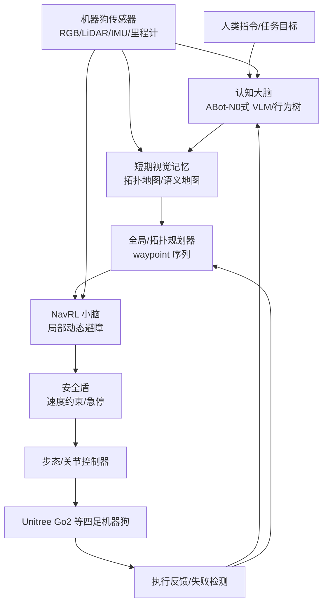

# 机器狗导航大脑详解：参考 ABot-N0、DualVLN 与 NavRL++ 的 Brain-Action 架构

> 本文专门讨论四足机器狗的导航大脑，重点参考本项目 `paper-review` 目录中的 ABot-N0、InternVLA-N1/DualVLN、NavRL++、NavRL 和 Xiaomi-Robotics-0 论文导读。
>
> 这里的“大脑”不是某一个固定算法，而是负责理解任务、记住环境、决定大方向和更新子目标的慢速系统；NavRL 属于下面的“小脑”，负责高频局部避障和速度决策。

## 1. 先给结论：机器狗的大脑应该用什么

对于机器狗，不建议把“大脑”理解成单一的 A*、单一的 VLM 或单一的大语言模型。更合理的系统是：

```text
认知大脑（慢）
  = 视觉/语言理解 + 任务分解 + 空间记忆 + 全局/长程规划

动作小脑（快）
  = 当前局部感知 + 动态避障 + waypoint 跟踪 + 速度输出

低层控制
  = 机身稳定、步态、关节/足端控制
```

参考论文给出了三种互补答案：

| 论文 | 对“大脑”的主要贡献 | 对机器狗的意义 |
|---|---|---|
| **ABot-N0** | Cognitive Brain + Action Expert + Agentic Planner | 用 Qwen3-4B 统一理解场景、任务和导航目标，真实部署在 Unitree Go2 |
| **InternVLA-N1 / DualVLN** | System 2 慢速导航员 + System 1 快速执行器 | 大脑输出像素目标/隐式目标，小系统高频生成轨迹，避免大模型卡顿 |
| **NavRL++** | 任务层给 waypoint，RL 策略执行局部避障 | 同一导航策略跨无人机和四足机器狗，支持探索建图和巡检 |
| **Xiaomi-Robotics-0** | VLM 与动作专家异步执行，action chunk 平滑衔接 | 说明大模型不能阻塞控制，必须快慢解耦 |

针对当前 NavRL 小脑项目，推荐的“大脑”第一版是：

```text
行为树/任务状态机
    + 语义目标识别（可选 VLM）
    + 局部/拓扑地图记忆
    + 全局路径或 waypoint 规划
    + 卡住检测与重规划
```

不建议一开始就训练一个端到端大模型直接输出机器狗关节动作。

## 2. 机器狗为什么需要“大脑-小脑”分层

机器狗同时面对不同时间尺度的问题：

| 问题 | 例子 | 合适频率 | 适合模块 |
|---|---|---:|---|
| 任务理解 | “去厨房找水瓶，再回到我身边” | 0.1–1 Hz | VLM/LLM、任务规划器 |
| 空间决策 | “先穿过走廊，再在楼梯口右转” | 0.5–5 Hz | 地图、拓扑规划、waypoint 规划 |
| 运动执行 | “现在避开右前方行人，向左走 0.3 m/s” | 10–50 Hz | NavRL、局部策略、安全盾 |
| 机身稳定 | “保持身体不翻倒、足端按时落地” | 100–1000 Hz | 步态/关节/力控制器 |

如果让 4B 或 7B VLM 每 20 ms 输出速度，它会遇到延迟和抖动；如果只让 NavRL 理解“去厨房找水瓶”，它又没有语义和长程记忆。分层的本质是：**大脑决定条件，小脑决定动作。**

## 3. ABot-N0：最接近“机器狗认知大脑”的参考

### 3.1 统一五类导航任务

ABot-N0 不只做 Point-Goal，而是统一：

- Point-Goal：去指定位置；
- Object-Goal：去寻找某类物体；
- Instruction-Following：按自然语言路线行走；
- POI-Goal：去某个兴趣点；
- Person-Following：跟随指定的人。

真实机器狗任务经常是组合式的：

```text
“去客厅” -> “找到沙发旁的背包” -> “然后跟我回门口”
```

NavRL 只能接收几何目标或方向；ABot-N0 这类大脑负责把复杂指令变成可执行的导航子任务。

### 3.2 Cognitive Brain：Qwen3-4B 双头输出

ABot-N0 的 Cognitive Brain 基于 Qwen3-4B：

```text
Universal Multi-Modal Encoder
        ↓
Qwen3-4B Cognitive Brain
        ├── Reasoning Head：环境分析、空间关系、任务解释
        └── Action Head：给动作专家的导航条件
```

关键不是让模型输出长篇解释，而是让它形成结构化空间理解，例如：

```json
{
  "scene": "前方是走廊，右侧有开放门，左侧被桌椅阻挡",
  "target": "右侧门后的客厅",
  "decision": "沿走廊前进，在门口向右转",
  "subgoal": "走到右侧门口"
}
```

Reasoning Head 提供可解释的认知监督；Action Head 将同一份隐层空间理解传给 Action Expert，避免“解释脑”和“执行脑”割裂。

### 3.3 Action Expert：大脑不直接控制关节

ABot-N0 的 Flow Matching 动作专家输出 5 个稠密 waypoint：

```text
(x1, y1, theta1), ..., (x5, y5, theta5)
```

对机器狗而言，它们可以继续交给：

```text
waypoint -> NavRL / MPC / 局部控制器
         -> vx, vy, vyaw
         -> 步态控制器
```

大脑输出的是“去哪”和局部轨迹意图，而不是电机位置。

### 3.4 Agentic Navigation System：从一次推理到长任务

ABot-N0 还包括：

- Agentic Planner：把长任务分成子任务；
- Episodic Memory：保存短期观察和最近路线；
- Topo-Memory：保存楼层、房间、走廊等拓扑关系；
- Self-Reflection：发现失败后重新判断和规划。

这正是机器狗大脑与普通路径规划器的区别：A* 回答“从 A 到 B 怎么走”，Agentic Planner 还要回答“现在应该去哪个 B、到达后做什么、走错后怎么办”。

## 4. InternVLA-N1 / DualVLN：快慢双系统

### 4.1 System 2 是导航员，不是司机

DualVLN 将系统分成两个异步部分：

```text
System 2（慢，约 2 Hz）
  输入：语言指令 + 历史 RGB
  输出：像素目标、隐式目标或视角调整

System 1（快，约 30 Hz）
  输入：当前 RGB + 上一次目标条件
  输出：一段连续 waypoint 轨迹
```

System 2 不需要每帧决定“前进多少厘米”，只需要告诉 System 1：“往画面中右前方最远的可见区域走”。然后 System 1 处理路上的人、桌子、门槛和运动平滑。

### 4.2 为什么像素目标适合机器狗

直接让大模型预测 3D 世界坐标，需要深度估计、坐标转换和误差传播。DualVLN 使用 2D pixel goal：

```text
大脑：图像中 (x, y) 这个方向是下一段路线
小脑：根据当前视觉和局部障碍生成连续运动
```

对于带 RGB 相机的机器狗，这能避免大模型承担不可靠的精确 3D 测量。若系统已有可靠 SLAM，也可把像素目标关联到拓扑节点或 waypoint，但不应把有噪声的像素点直接当成精确世界坐标。

### 4.3 自主视角调整

当目标不在视野里，System 2 会输出左转、右转、抬头或低头，先调整视角再判断路线。机器狗在走廊拐角、楼梯口或狭窄房间尤其需要这种能力：大脑先“转头看清楚”，小脑负责调整过程中的局部避障和稳定行走。

## 5. NavRL++：把大脑与 RL 小脑接起来

NavRL++ 对当前项目最有参考价值的地方，是把 RL 策略放进任务系统：

```text
探索建图：
  全局探索规划器 -> 下一个 waypoint
  -> RL 策略追踪 waypoint + 局部避障
  -> 地图更新 -> 新 waypoint

巡检任务：
  楼层/设施地图 -> waypoint 序列
  -> RL 策略逐段执行
  -> 临时行人和障碍由局部策略规避
```

NavRL++ 还强调五种 Sim-to-Real 差异：传感器噪声、感知漏检、输入延迟、动作延迟和控制响应差异。这说明全局规划器提供的 waypoint 也可能延迟或过时，小脑必须在局部范围内有自主性。

NavRL++ 已在真实四足机器人上验证跨平台导航。因此在当前架构里，NavRL/NavRL++ 更适合承担“快执行”，而不是替代语义认知大脑。

## 6. Xiaomi-Robotics-0：为什么大脑必须异步

Xiaomi-Robotics-0 虽主要面向操作，但给机器狗系统一个重要工程结论：

```text
大 VLM 负责理解和条件编码
轻量动作专家负责高频 action chunk
机器人执行当前动作时，大模型同时准备下一段条件
```

同步执行会造成：

```text
大脑推理 -> 机器狗停顿 -> 执行一点 -> 再停顿 -> 再推理
```

异步执行则是：

```text
当前 waypoint/action chunk 正在执行
        ∥
大脑准备下一个 waypoint/action chunk
```

新旧动作还要平滑衔接。若 NavRL 输出速度，可保留上一时刻速度，限制 `Δv` 和 `Δyaw`，并在新 waypoint 到来时渐进切换，而不是瞬间重置速度。

## 7. 机器狗大脑的推荐架构

### 7.1 第一版：经典大脑 + NavRL 小脑

```text
任务状态机/行为树
  ├── 接收：去某房间、巡检、跟随某人
  ├── 维护：当前任务、子任务、失败次数
  └── 输出：目标拓扑节点或 waypoint

定位与地图
  ├── SLAM / 里程计
  ├── 2D/3D 占据地图
  └── 语义标记（可选）

全局规划
  ├── A* / D* Lite / 代价地图
  └── 输出 waypoint 序列

NavRL 小脑
  ├── 当前 LiDAR/视觉
  ├── 动态障碍物
  ├── 当前 waypoint
  └── 输出局部速度
```

### 7.2 第二版：增加语义 VLM

```text
“去有红色沙发的客厅”
        ↓
VLM：识别目标房间/物体和可行子任务
        ↓
拓扑/地图模块：找到对应节点
        ↓
全局规划器：生成路线
        ↓
NavRL：逐个 waypoint 局部执行
```

VLM 应输出结构化目标，例如：

```json
{
  "goal_type": "room",
  "goal_name": "living_room",
  "object_constraint": "red_sofa",
  "stop_condition": "near_red_sofa"
}
```

不要让 VLM 直接输出未经安全验证的 `cmd_vel`。

### 7.3 第三版：Brain-Action 统一模型

如果后续积累了大量机器狗轨迹和多模态数据，可参考 ABot-N0：

```text
统一多模态编码器
    -> Cognitive Brain：场景理解 + 任务规划
    -> Action Expert：5/32 个局部 waypoint
    -> NavRL 或控制器：安全跟踪与执行
```

这属于较大的研究项目，需要解决数据、时间同步、标注、失败重试和安全评估，不建议直接替换当前可解释的模块化系统。

## 8. 大脑和 NavRL 的接口设计

### 8.1 最小接口

```python
class BrainCommand:
    goal_id: str
    waypoint_world: tuple[float, float, float]
    yaw_target: float | None
    valid_until: float
    replan_required: bool
```

NavRL 读取：

```python
target_pos = brain_command.waypoint_world
target_dir = target_pos - robot_position
```

### 8.2 何时切换 waypoint

建议同时考虑：

```text
距离 waypoint 小于位置阈值
朝向误差小于角度阈值（若任务需要）
或 safety shield 连续大幅修改动作
```

如果小脑一直无法安全接近 waypoint，可能是大脑给了一个被新障碍封死的目标，应触发重规划。

### 8.3 如何判断机器狗卡住

记录一个滑动窗口：

```text
过去 T 秒目标距离几乎不下降
机器人速度长期接近 0
safety shield 修改比例过高
局部地图显示前方不可通行
```

满足条件后暂停当前 waypoint，请求全局/拓扑重规划，必要时让 VLM 重新判断场景。

## 9. 适合机器狗的完整数据流



## 10. 各论文在系统里的分工

| 能力 | 推荐参考 | 是否直接替代 NavRL |
|---|---|---|
| 理解“去哪儿” | ABot-N0 Cognitive Brain、DualVLN System 2 | 否，输出目标/条件 |
| 理解语言和物体 | ABot-N0 等 VLM | 否，输出结构化任务 |
| 记住走过的地方 | ABot-N0 Topo-Memory、SLAM | 否，维护地图和记忆 |
| 规划长距离路线 | NavRL++ 任务接口、A*/D* Lite | 否，输出 waypoint |
| 高频局部避障 | NavRL/NavRL++ | 是，小脑核心 |
| 动作连续性 | DualVLN System 1、Xiaomi 异步 action chunk | 可增强执行接口 |
| 安全兜底 | NavRL safety shield | 独立于大脑，必须保留 |

## 11. 当前项目的实施路线

### 阶段 1：大脑先输出 waypoint

```text
固定地图 + A* 路径
    -> waypoint 序列
    -> NavRL 逐段跟踪
    -> safety shield 兜底
```

这一阶段用于验证接口，不需要大模型。

### 阶段 2：加入重规划和探索

```text
局部地图更新
    -> 路径被阻塞时重规划
    -> NavRL 继续处理动态障碍
```

### 阶段 3：加入语义任务

```text
“巡检所有房间”
    -> 任务规划器分解为房间列表
    -> 语义地图匹配房间
    -> 全局规划生成 waypoint
    -> NavRL 执行
```

### 阶段 4：加入 Brain-Action 模型

只有当经典接口稳定后，才考虑用 ABot-N0/DualVLN 风格模型替换部分任务规划或 waypoint 生成。小脑、安全盾和低层控制不应因为加入 VLM 就被删除。

## 12. 最终结论

对于机器狗，“大脑”最准确的定义是：

```text
大脑：理解任务、维护记忆、选择子目标、规划长程路线、发现失败并重试
小脑：观察眼前环境、躲避动态障碍、跟踪 waypoint、输出局部速度
控制器：保证四足运动稳定、把速度变成步态和关节动作
```

ABot-N0 告诉我们如何构造认知大脑和动作专家；DualVLN 告诉我们为什么必须快慢异步；NavRL++ 告诉我们如何把 RL 局部策略放进探索和巡检任务；Xiaomi-Robotics-0 告诉我们如何让慢模型和快动作连续衔接。

当前项目最合适的路线不是“找一篇论文当大脑”，而是：

```text
先用行为树/地图/全局规划器搭出可靠大脑
再用 VLM 增强任务理解和语义目标
始终让 NavRL 负责高频局部运动，让 safety shield 负责安全兜底
```

## 参考文档

- [ABot-N0 论文导读](../../paper-review/ABot-N0/ABot-N0论文导读.md)
- [InternVLA-N1 / DualVLN 论文导读](../../paper-review/InternVLA-N1/InternVLA-N1论文导读.md)
- [NavRL++ 论文导读](../../paper-review/Robots-VLA/NavRL/navrl_plus_plus_paper_guide.md)
- [NavRL 论文导读](../../paper-review/Robots-VLA/NavRL/navrl_paper_guide.md)
- [Xiaomi-Robotics-0 论文导读](../../paper-review/Robots-VLA/XiaomiRobotics0/xiaomi_robotics0_paper_guide.md)

