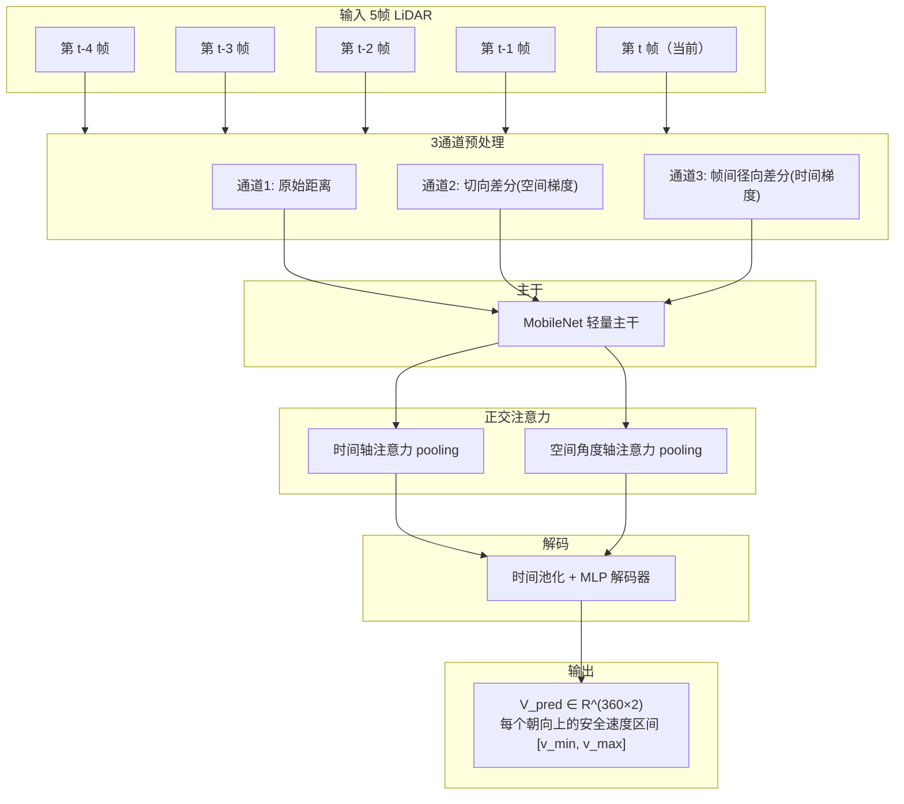
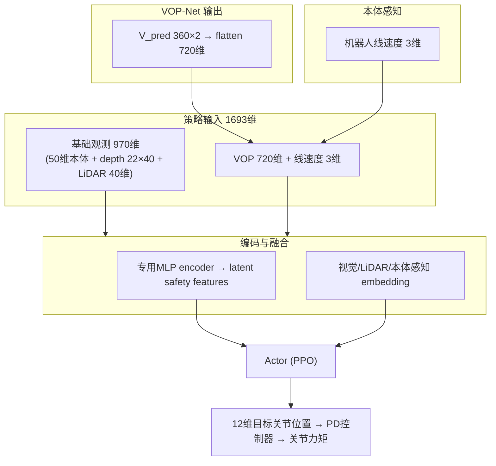

# VOP-Nav 详解：从"预测障碍轨迹"到"预测安全速度区域"

> **论文标题**：Learning Agile Navigation in Crowded Environments for Quadruped Robots
> **系统名称**：VOP-Nav（Velocity Obstacle Perception Navigation）
> **核心模块**：VOP-Net（Velocity Obstacle Perception Network）
> **作者**：Shuyu Wu, Zeyu Liu, Tianbao Zhang, Fanxing Li, Fangyu Sun, Mingkang Xiong, Wei Xi, Wenxian Yu, Danping Zou（共 9 人）
> **机构**：上海交通大学；美的集团高端重载机器人国家重点实验室（佛山）
> **年份**：2026 年 7 月提交，arXiv 预印本
> **arXiv**：https://arxiv.org/abs/2607.15036（全文 HTML：https://arxiv.org/html/2607.15036v1，PDF：https://arxiv.org/pdf/2607.15036）
> **DOI**：10.48550/arXiv.2607.15036

---

## 一句话概括

> 传统动态避障要"**检测人 → 跟踪人 → 估计速度 → 预测未来轨迹 → 再算 VO/MPC**"，链路太长、在拥挤人群中极易因遮挡失败。VOP-Nav 的做法是：**不去精确预测每个障碍未来在哪，只预测"哪些速度对机器人来说是危险的"**——用一个感知网络 VOP-Net 从多帧 LiDAR 直接回归一个**未来安全速度区域（safe velocity region）**，该区域既是策略的输入特征、又是训练的 reward 信号。

用一句话说：**与其预测世界，不如预测"动作空间里的安全集"。**

---

## 读之前先搞清楚

### 这篇论文要解决什么问题？

四足机器人在**动态、拥挤**环境（密集人群）中导航，存在两个核心难点：

1. **严重遮挡**：人群中激光雷达/相机被不断遮挡，传统的检测（YOLO）→跟踪（MHT）→速度估计→轨迹预测管线频繁失效，误差逐级放大。
2. **安全性与敏捷性的权衡**：
   - **模型方法**（如 VO / ORCA / MPC）：理论上有安全保证，但依赖精确的障碍物运动估计，在密集人群中往往估计不准 → 失败。
   - **端到端学习方法**：鲁棒、敏捷，但缺乏对障碍物运动的预测能力 → 要么碰撞、要么过度保守（"冻结机器人"问题）。

### 需要的前置知识

| 概念 | 简单解释 |
|:---|:---|
| **VO（Velocity Obstacle，速度障碍）** | 计算"哪些机器人速度会导致碰撞"的几何工具。ORCA 是它的经典实现 |
| **Minkowski 和** | 把两个几何体"膨胀/平移"得到新几何体的运算，VO 用它把障碍速度叠加进碰撞锥 |
| **POMDP** | 部分可观测马尔可夫决策过程，机器人看不到完整状态，只有局部观测 |
| **PPO** | 一种强化学习算法（近端策略优化），本论文的策略优化器 |
| **Beta 分布 / 动作分布** | 策略输出动作的概率分布形式（本论文动作是 12 维目标关节位置，用 PD 控制器跟踪） |
| **IoU（交并比）** | 衡量两个区域重叠程度的指标，常用于目标检测，这里用来衡量预测安全区与真实安全区 |

---

## 一、核心思路：把"预测世界"换成"预测动作空间安全集"

论文的关键转变（原文表述）：**不必精确预测每个障碍未来在哪，只需预测"哪些速度对机器人来说是危险的"。**

技术上用一个感知网络 **VOP-Net**，从**多帧 LiDAR 序列**隐式编码动态约束，直接回归一个**未来安全速度区域**（源自 VO 理论的几何量）。该预测被**双重使用**：

1. **推理时**：作为导航策略（VOP-Nav Policy）的**输入特征**；
2. **训练时**：作为 **reward 信号**（软约束），鼓励安全速度选择。

从而在不依赖特权障碍状态（ground-truth 位置/速度）、不做显式检测/跟踪的前提下，融合 VO 的几何安全性与端到端学习的敏捷性。

---

## 二、未来安全速度区域如何表示（核心问题 1）

### 2.1 问题形式化：POMDP

把导航建模为部分可观测马尔可夫决策过程 $\langle \mathcal{S}, \mathcal{A}, \mathcal{T}, \mathcal{R}, \Omega, \mathcal{O}\rangle$，目标最大化折扣回报：

$$
J(\pi_\theta)=\mathbb{E}_{\pi_\theta}\Big[\sum_{t=0}^{\infty}\gamma^t r_t\Big]
$$

用 **PPO** 优化策略 $\pi_\theta$。

### 2.2 第一步：速度障碍（VO）的定义

沿用 ORCA 的定义：

- **碰撞锥**：$C_{AB}=\{v_{AB}\mid \lambda_{AB}\cap \hat{B}\neq\emptyset\}$，其中 $v_{AB}=v_A-v_B$ 为相对速度，$\hat B$ 为以 $p_B$ 为圆心、半径 $r_A+r_B$ 的**扩展碰撞圆**。
- **截断碰撞锥 $CC_{AB}$**：去掉 $\tau$ 时间之后才碰撞的部分。
- **速度障碍域**：

$$
VO^{\tau}_{A|B}=\{v_A \mid v_A \in CC_{AB}\oplus v_B\}
$$

其中 $\oplus$ 为 **Minkowski 和**（把截断碰撞锥沿障碍速度 $v_B$ 平移）。**落在灰色区域内的机器人速度 $v_A$ 会在 $\tau$ 时间内碰撞。**

### 2.3 第二步：构造安全速度区域（监督信号）

先做坐标变换，把障碍状态从世界系 $F_W$ 转到机器人局部系 $F_R$（含旋转矩阵 $R(\theta_R)$ 和平移 $t$）。然后定义：

$$
V_{safe}=V_{max}\cap \bar{\Omega}_{VO}, \qquad \Omega_{VO}=\bigcup_{i=1}^{n} VO_{O_i}
$$

即"**可达速度圆盘**（最大速度 $v_{max}$）**与所有 VO 并集的补集**的交集"。

### 2.4 第三步：离散化表示（关键工程选择）

拥挤场景中 VO 并集几何复杂、难以直接回归，论文把 $V_{safe}$ 在 **360° 角度域上离散成 $d=360$ 个方向的安全速度区间**：

$$
\mathbf{V}_{safe}=\{\mathbf{v}_{safe}^{1},\dots,\mathbf{v}_{safe}^{d}\},\quad d=360
$$

每个方向 $\lambda_j$ 的安全区间由**临界速度幅值** $D_j=\min(L_j, v_{max})$ 决定（$L_j$ 为沿该方向到扩展障碍边界 $\hat B$ 的距离）：

- 若机器人当前**在 VO 之外**：$\mathbf{v}_{safe,O_i}^{j}=[0, D_j]$（低速区间，最保险）；
- 若机器人**已落入 VO 内**（即将碰撞）：$\mathbf{v}_{safe,O_i}^{j}=[D_j, v_{max}]$（必须加速冲出碰撞状态）。

对所有障碍取**逐方向交集**：

$$
\mathbf{V}_{safe}=\bigcap_{i=1}^{n}\mathbf{V}_{safe}^{O_i}
$$

**工程细节**：若单个方向出现多个不连续安全段，**保守地只保留靠近原点的低速段**（因为高速段虽满足理论边界，但学到的步态策略未必能可靠到达，且易诱发激进行为）。

> **关键点**：这个"区域"**不是离散栅格、也不是一组轨迹，而是"每一朝向上的一个可用速度区间 $[v^{min},v^{max}]$"，共 360×2 个标量。** 这是任务相关的"动作空间中的安全集"，而非"世界重建"。

### 2.5 表示总结

| 表示层次 | 内容 |
|:---|:---|
| 连续表示 | $V_{safe}=V_{max}\cap \overline{\bigcup_i VO_{O_i}}$（可达圆盘 ∩ 危险域补集） |
| 离散表示 | $\mathbf{V}_{safe}\in\mathbb{R}^{360\times 2}$，每个朝向一个 $[v^{min}, v^{max}]$ 安全速度区间 |
| 物理含义 | 方向 $\lambda_j$ 上，速度幅值落在这个区间内就是"未来安全"的 |
| 与"预测轨迹"的区别 | 不预测障碍物未来坐标，只预测"哪些速度安全"——直接落在动作决策空间 |

---

## 三、VOP-Net 如何"预测未来"（网络架构与训练）

### 3.1 输入：多帧 LiDAR 的 3 通道预处理

- **输入**：连续 **5 帧 LiDAR 扫描**（当前帧 + 前 4 帧）。
- 预处理为 **3 通道张量**：
  1. **原始距离**；
  2. **切向差分（空间梯度）**：突出障碍边界；
  3. **帧间径向差分（时间梯度）**：编码机器人-环境相对位移的运动线索。

时间梯度是"预测未来"的关键：相邻帧距离的变化隐含了障碍物（或机器人自身）的运动方向与速度。

### 3.2 主干与注意力

- **主干**：MobileNet 模块（轻量，适合部署）。
- **正交注意力**：分别在**时间轴**和**空间角度轴**上做 pooling，生成两套独立注意力权重，同时强调**关键历史时刻**与**危险方向扇区**。
- **解码**：时间池化 + MLP 解码器，回归 $d\times 2 = 360\times 2$ 的 $\mathbf{V}_{pred}$。

### 3.3 损失函数（IoU + MSE 混合）

$$
\mathcal{L}=\alpha\mathcal{L}_{IoU}+(1-\alpha)\mathcal{L}_{MSE},\quad \alpha=0.2
$$

$$
\mathcal{L}_{IoU}=\frac{1}{d}\sum_{j=1}^{d}\Big(1-\frac{|\mathbf{v}^{j}_{pred}\cap\mathbf{v}^{j}_{safe}|}{|\mathbf{v}^{j}_{pred}\cup\mathbf{v}^{j}_{safe}|+\epsilon}\Big)
$$

$$
\mathcal{L}_{MSE}=\frac{1}{2d}\sum_{j=1}^{d}\big((v^{j,min}_{pred}-v^{j,min}_{safe})^2+(v^{j,max}_{pred}-v^{j,max}_{safe})^2\big)
$$

- **IoU 损失**：捕捉区域的整体结构对齐（这个方向该不该安全、大概多宽）。
- **MSE 损失**：精修区间边界的数值（$v^{min}, v^{max}$ 具体是多少）。

> 论文验证集 IoU 0.808 / MSE 0.172；在线（部署 rollout）IoU 0.55–0.79，密集场景（Square）更易出现"过度乐观"（false-safe）错误。

---

## 四、安全速度区域如何进入 Policy 输入（核心问题 2a）

VOP-Net 输出的 360×2 向量 **flatten 成 720 维**，加上机器人**线速度 3 维**，追加进策略观测：

- VOP-Nav 策略输入共 **1693 维**（Basic 策略仅 970 维）。

结构上，用**专用 MLP encoder** 把 720 维安全约束编码为 **latent safety features**，再与视觉（depth）、LiDAR、本体感知 embedding 拼接融合。

> 物理直觉：策略的每一步决策都"看见"了**当前哪些速度在未来是安全的**，从而在动作选择时天然避开危险速度方向。这就是"区域作为输入特征"的意义。

---

## 五、安全速度区域如何进入 reward（核心问题 2b）

### 5.1 新增速度约束奖励 $r_{VO}$

对违反预测安全区间的速度施加**软惩罚**：

$$
r_{VO}=\begin{cases}v-v_s^{min}, & v<v_s^{min}\\ v_s^{max}-v, & v>v_s^{max}\\ 0, & \text{otherwise}\end{cases}
$$

其中 $v=\|v_{xy}\|$ 为当前平面速度大小。

### 5.2 按角度插值（关键工程细节）

由于 VOP-Net 输出按角度扇区离散，对连续速度方向 $\theta=\mathrm{atan2}(v_y,v_x)$ 用 **$k=5$ 个最近角度扇区的逆距离加权插值**得到有效边界：

$$
\delta_i=\min\big(|\theta-\lambda_i|,\;2\pi-|\theta-\lambda_i|\big)
$$

$$
w_i=\frac{(\delta_i+\epsilon)^{-1}}{\sum_{j=0}^{k-1}(\delta_j+\epsilon)^{-1}}
$$

$$
v_s^{min}(\theta)=\sum_i w_i\, v_{s,i}^{min},\quad v_s^{max}(\theta)=\sum_i w_i\, v_{s,i}^{max}
$$

即：速度方向越靠近某个扇区中心，该扇区的安全边界权重越大。

### 5.3 为什么是"软"约束而非"硬"约束？

论文**明确拒绝**把 VOP-Net 预测当作硬性几何约束（后处理过滤），原因：

- 网络预测含偏差/不确定性；
- 硬约束会导致过度保守或不可行动作。

因此改为**软引导**：策略自主学会安全速度选择。同时，为抵消 $r_{VO}$ 可能引发的保守，**提高敏捷奖励 $r_{agile}$ 的权重**：

$$
r_{agile}=\max\{\mathrm{ReLU}(v_x/v_{max})\cdot \mathbf{1}(dir_{good}),\; \mathbf{1}(d_{goal}<\sigma_{tight})\},\quad v_{max}=4.5\ \text{m/s}
$$

> **一句话总结输入+reward 的双重角色**：推理时，安全区域告诉策略"哪里能走"（输入）；训练时，安全区域告诉策略"走错要扣分"（reward）。同一个预测，两头都用。

---

## 六、为什么比"显式 tracking"更直接（核心问题 3）

论文给出了四条理由：

### 1. 多级管线误差累积 / 延迟

检测→跟踪→估速→轨迹预测→VO/MPC 的每一环都会**放大误差并引入延迟**；密集人群中遮挡导致 YOLO/MHT 状态估计不可靠，进而使 VO 规划退化。

### 2. 任务相关预测更"轻"

只需预测"哪些速度危险"，**无需精确重建每个人的未来轨迹**——预测直接落在**动作决策空间**上，更直接、开销更低。

### 3. 保留端到端敏捷性

直接 sensor→joint 映射，能利用瞬时空隙；VO 原则以**隐式感知 + 软奖励**形式融入，避免了分层架构中"高层命令安全但底层跟踪延迟导致来不及生效"的问题。

### 4. 消除对特权信息/语义类别的依赖

不局限于预定义类别（如行人），对未知动态障碍更泛化。

> 论文用实验佐证：直接 VO 方法（ORCA、NavRL）在拥挤场景中因**保守选速→犹豫/冻结/超时**，以及**可行速度集被非合作障碍几乎清零**而失败；VOP-Nav 通过端到端策略把"安全区域引导 + 学到的执行动力学"结合，规避了这两类问题。

### 对比表格

| 维度 | 显式 Tracking 路线 | VOP-Nav（隐式安全区域） |
|:---|:---|:---|
| 感知管线 | 检测→跟踪→估速→轨迹预测→VO/MPC | 多帧 LiDAR → VOP-Net → 安全速度区域 |
| 误差传播 | 每级放大、延迟累积 | 端到端一步到位 |
| 依赖 | 依赖检测/跟踪质量、特权信息 | 仅依赖局部 LiDAR |
| 泛化 | 限于预定义障碍类别 | 对未知动态障碍更泛化 |
| 决策空间 | 先重建世界再规划 | 直接在动作空间预测安全集 |
| 敏捷性 | 分层导致底层跟踪延迟 | 端到端、利用瞬时空隙 |

---

## 七、三阶段训练管线

| 阶段 | 内容 |
|:---|:---|
| **Stage 1** | 训练 **Basic policy**（仿 ABS 敏捷策略，加入 depth 与 360° LiDAR）。观测 = 50 维本体感知（足底接触力、角速度、投影重力、到目标相对距离、剩余时间、关节位/速、上一动作）+ depth 22×40 + LiDAR 40 维（9° 分辨率），共 970 维；动作 = **12 维目标关节位置**，由 PD 控制器跟踪 $\tau=K_p(t_a-q)-K_d\dot q$。PPO，Isaac Gym 1024 并行环境。 |
| **Stage 2** | 用 Basic policy 采集轨迹（**10,000 个数据文件**，每文件 = 1024 env × 48 步），用 Algorithm 1 计算 $\mathbf{V}_{safe}$ 作监督，训练 **VOP-Net**。 |
| **Stage 3** | 用 VOP-Net 输出（720 维）+ 线速度（3 维）扩充观测，重训练 **VOP-Nav Policy**（从零训练）；reward 加入 $r_{VO}$ 并上调 $r_{agile}$ 权重。 |

**训练环境**（Isaac Gym）：10×5 m² 矩形场地，中间 8×5 m² 障碍区。动态障碍为圆柱（h=1.7 m，r=0.5 m，最多 8 个），直线运动+镜面反射；静态障碍含圆柱与长方体。**课程学习** 10 级：障碍数、速度上限、随机扰动概率、地形粗糙度随难度递增。

---

## 八、实验与结果

### 8.1 未见测试环境（与训练分布不同）

动态障碍改用 **RVO** 生成真实人群行为，引入反应系数 $r_{react}$。四个环境：Forest、Office、Square、Slow。

### 8.2 成功率对比（%）

| 环境 | ABS | ORCA | NavRL | REASAN | **VOP-Nav** |
|:---|:---|:---|:---|:---|:---|
| Training | 53.16 | 59.89 | 71.84 | 43.49 | **78.35** |
| Forest | 76.07 | 87.65 | 90.49 | 68.06 | **94.48** |
| Office | 61.29 | 62.01 | 81.07 | 64.07 | **81.12** |
| Square | 53.11 | 78.79 | 76.37 | 47.34 | **83.67** |
| Slow | 83.92 | 76.04 | 88.89 | 86.23 | **92.24** |

→ **所有 5 个环境成功率最高**，峰值速度可与 ABS 相当（部分环境更高），平均速度会随动态约束自适应调节。

### 8.3 消融实验（Table V）

`Basic`（无 VOP）< `Only Input`（只加输入：敏捷但碰撞率高）≈ 但 `Only Reward`（只加奖励：过于保守、超时率高）< **`VOP-Nav`（两者兼用效果最佳）**。`GT-VOP-Nav`（用真实安全区域）成功率更高、碰撞更低，说明预测误差主要影响避碰而非任务完成。

> **关键结论**：输入和 reward **缺一不可**——只加输入策略会激进碰撞，只加奖励策略会保守超时，两者结合才平衡。

### 8.4 真实部署

- 平台：Unitree Go2 + Livox Mid-360 LiDAR + RealSense D435i
- 算力：Jetson Orin Nano 跑 VOP-Net，Intel N100 跑 policy；策略 50 Hz、PD 200 Hz
- **零样本迁移（无微调、无特权信息）**
- 室内 15 试**全部成功**；室外 15 试 12 成功、2 失败（定位漂移）、1 超时（窄道保守等待）
- 极限测试：峰值速度 **3.014 m/s**、1 m 突发障碍**紧急制动成功**

---

## 九、局限

- VOP-Net 基于 2D 平面表示，无法处理悬空结构/负障碍（沟渠）等 3D 可通行性问题；
- 室外安全依赖 LIO 定位稳定性（Fast-LIO2 漂移导致失败）。

---

## 十、对"小脑模型"的启示

1. **"预测动作空间安全集"比"预测世界"更适合作为小脑的前瞻模块**——计算量小、直接可决策。
2. 安全区域可以作为**策略输入 + reward** 双重使用，是一种"训练时塑造 + 推理时引导"的轻量安全先验。
3. 与 SEA-Nav（可微 CBF 盾牌，硬几何约束）形成互补：VOP-Nav 用"软预测区域"引导，SEA-Nav 用"可微安全层"投影。

---

## 原文获取

- arXiv 摘要页：https://arxiv.org/abs/2607.15036
- 全文 HTML（含全部公式）：https://arxiv.org/html/2607.15036v1
- 全文 PDF：https://arxiv.org/pdf/2607.15036
- 引用建议：`Shuyu Wu, Zeyu Liu, Tianbao Zhang, Fanxing Li, Fangyu Sun, Mingkang Xiong, Wei Xi, Wenxian Yu, and Danping Zou, "Learning Agile Navigation in Crowded Environments for Quadruped Robots," arXiv:2607.15036 [cs.RO], 2026.`
