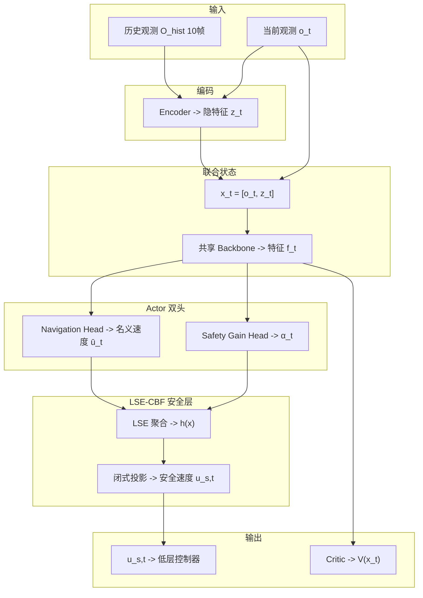

# SEA-Nav 详解：把安全过滤器塞进网络里，一边训练一边学会避障

> **论文标题**：SEA-Nav: Efficient Policy Learning for Safe and Agile Quadruped Navigation in Cluttered Environments
> **系统名称**：SEA-Nav（Safe, Efficient, and Agile Navigation）
> **作者**：Shiyi Chen, Mingye Yang, Haiyan Mao, Jiaqi Zhang, Haiyi Liu, Shuheng He, Debing Zhang, Zihao Qiu, Chun Zhang 等
> **机构**：清华大学 × 帝国理工学院
> **年份**：2026 年 3 月，arXiv 预印本
> **arXiv**：https://arxiv.org/abs/2603.09460
> **项目主页**：https://11chens.github.io/sea-nav/
> **DOI**：10.48550/arXiv.2603.09460

---

## 🎯 三句话看懂这篇论文

1. **问题**：普通 RL 导航在密集障碍里学得很慢，而且经常不安全，因为碰撞就终止，危险经验太少；就算部署时外接安全过滤器，训练时策略也根本不知道它的存在。
2. **办法**：SEA-Nav 直接把一个 **LSE-CBF 安全层**塞进 Actor 后面，让网络输出的名义速度先过一道“可微安全投影”；同时用 **ACSI** 反复回放碰撞前的危险状态，提高采样效率。
3. **结果**：训练时间缩到**分钟级**，还能零样本上真机；而且不是靠“后处理补锅”，而是策略训练时就把安全学进去了。

> 💡 **一句话记忆**：不是训练完再给机器人戴头盔，而是训练时就把“安全骨架”长进它身体里。

---

## 为什么这篇论文重要（大白话）

想象你在学开车：

- **传统 RL** 像一个新手司机，横冲直撞，撞一次才知道“这不行”；
- **后处理安全过滤器** 像副驾驶最后一秒抢方向盘，虽然偶尔能救命，但主驾驶根本没学会怎么开；
- **SEA-Nav** 的做法是：副驾驶坐在你手臂里，训练时每次都轻轻把方向盘掰回安全区，久而久之你自己就学会了。

论文要解决的正是两个老毛病：

1. **危险经验太少**：一撞就 reset，机器人大部分时间都在空旷区域瞎逛；
2. **训练和部署脱节**：训练时没有安全层，部署时突然被安全层改动作，策略会变得很别扭，甚至卡住。

---

## 核心思想（重点中的重点）

SEA-Nav 的核心不是“又加了一个 reward”，而是两件事：

1. **把安全约束做成可微层，塞进网络里**；
2. **把危险状态反复拿出来练**。

前者解决“怎么安全”，后者解决“怎么学得快”。

| 训练时 | 部署时 |
|:---|:---|
| Actor 输出名义速度 $\bar u$ | Actor 仍先输出名义速度 $\bar u$ |
| 经过 LSE-CBF 安全层修正成安全速度 $u_s$ | 同样经过 LSE-CBF 安全层修正 |
| 梯度可以穿过安全层回传，策略知道“自己哪里不安全” | 策略输出天然更接近安全动作，不容易和安全层打架 |

> 🎯 **重点**：这不是部署时外挂一个黑盒过滤器，而是**训练时就让策略感受到“安全边界”在哪里**。

---

## 重点一：LSE-CBF 安全层到底是怎么塞进网络里的

Actor 干两件事：

1. 输出一个它“想走”的速度，叫 **名义动作** $\bar u_t=[\bar v_x, \bar v_y, \bar \omega_z]^T$；
2. 再输出一个安全增益 **$\alpha_t$**，决定“安全层要多强势”。

然后这两个量一起进入 **LSE-CBF 安全层**，算出最终真正执行的安全速度 $u_{s,t}$。

### 关键点：它不是“在线解优化器”，而是“直接算公式”

普通人的第一反应会是：

> “CBF 不就是一个带约束优化吗？那不是每一步都得解 QP 吗？”

通常是这样，但 **SEA-Nav 这里是一个特殊情况**：它的 QP 只有**一条线性约束**，而“把一个点投影到半空间”有**闭式解**，不需要数值优化器。

所以安全层本质上就是一个**可微公式层**，而不是一个迭代求解器。

---

## 重点二：这个“安全约束”到底约束了什么

CBF 约束写成：

$$
\dot h(x,u) \ge -\alpha h(x)
$$

在这篇论文里，它被写成对速度命令 $u_s$ 的线性不等式：

$$
\langle \mathcal{L}_g h(x), u_s\rangle + \alpha h(x) \ge 0
$$

### 用人话解释

- $h(x)$：当前离障碍物还有多少“安全余量”；
- $\mathcal{L}_g h(x)=\nabla h(x)$：朝哪个方向走会更安全；
- $u_s$：你现在真正要发出去的速度；
- $\alpha h(x)$：允许你逼近障碍的“预算”。

> 🎯 **真正的约束含义**：**你可以朝障碍物走，但你靠近障碍物的速度不能快到把安全余量一下子吃光。**

如果你离障碍很远，预算大，可以走得大胆一点；
如果你已经贴近障碍，预算就小，安全层会强力把你拉回来。

### 多条 LiDAR 射线怎么办？

LiDAR 有 41 条射线，本来每条射线都有一个约束 $h_i(x)$。直接取最危险的那条：

$$
h(x)=\min_i h_i(x)
$$

会有两个问题：

1. **不可导**；
2. 约束切换时梯度会跳，窄通道里容易左右来回抖。

于是 SEA-Nav 用 LSE 做一个“软最小值”：

$$
h(x)=-\frac{1}{k}\ln\Big(\sum_{i=1}^{N}\exp(-k h_i(x))\Big)
$$

它的直觉是：

- 最危险那几条射线权重大；
- 但不是只听一条射线的，所有射线都参与；
- 所以梯度更平滑，不容易“左墙和右墙来回切换”。

---

## 重点三：安全投影为什么可导

给定名义动作 $\bar u(x)$，安全层做的是一个标准 CBF-QP：

$$
\min_{u_s}\ \frac{1}{2}\|u_s-\bar u(x)\|^2
\quad
	ext{s.t.}
\quad
\langle \mathcal{L}_g h(x), u_s\rangle+\alpha h(x)\ge 0
$$

意思很简单：

> **在所有安全动作里，找一个离原始动作最近的。**

由于这里只有**一条线性约束**，它的解可以直接写成：

$$
u_s(x)=\bar u(x)+\underbrace{\max\Big\{0,\ -\frac{\langle \mathcal{L}_g h(x), \bar u(x)\rangle+\alpha h(x)}{\|\mathcal{L}_g h(x)\|^2+\epsilon_d}\Big\}}_{\text{修正幅度 }\eta}\cdot \underbrace{\mathcal{L}_g h(x)}_{\text{修正方向}}
$$

### 这个式子怎么理解

- 如果 $\bar u$ 已经安全：$\eta=0$，原样通过；
- 如果 $\bar u$ 不安全：就沿着“更安全的方向”推一把，推到最近的安全边界。

### 为什么还要加 $\epsilon_d$

窄通道最怕一种情况：左右两边障碍差不多危险，梯度容易互相抵消，导致分母太小，修正量爆炸。论文加一个阻尼项 $\epsilon_d$，就是为了防止这种“数值发疯”。

### 为什么它能放进网络里反传

因为上面全是普通可微运算：

- LSE
- 内积
- 加减乘除
- ReLU / max

所以 **reward 的梯度可以穿过安全层，直接回到 Actor**。这就是论文说的“可微安全层”。

| 对比 | 外挂 CBF-QP 后处理 | SEA-Nav 的安全层 |
|:---|:---|:---|
| 部署时是否安全 | ✅ | ✅ |
| 训练时策略能否感知安全边界 | ❌ | ✅ |
| 梯度能否回传 | ❌ | ✅ |
| 会不会 train-test mismatch | 容易 | 明显减轻 |

---

## 重点四：Shield Loss 是干什么的

论文额外加了一个 **Shield Intervention Loss**：

$$
L_{shield}=\|u_{s,t}-\bar u_t\|^2 + [\alpha_{min}-\alpha_t]_+^2
$$

它想干的事很朴素：

1. **让策略自己学会输出更安全的动作**，这样安全层以后少插手；
2. **防止 $\alpha$ 学得太小**，不然安全层会一直粗暴接管，动作会很僵硬。

> 用比喻说：安全层像教练。教练不想每次都替你做动作，只想在训练时纠正你，让你自己越练越标准。

---

## 重点五：ACSI 为什么能大幅提高训练效率

这篇论文另一个真正有用的点是 **ACSI（Adaptive Collision-State Initialization）**。

### 它解决什么问题

普通 RL 一碰撞就 reset 到起点，导致：

- 机器人大部分时间在空旷处乱走；
- 真正危险的窄缝、拐角、死局，反而练得太少。

### 它怎么做

一旦发生碰撞，不是立刻回起点，而是：

1. 保存碰撞前一小段历史；
2. 以一定概率，直接把机器人重置到**碰撞前的危险位置**；
3. 继续练怎么从那里脱身。

> 🎯 **重点**：不是让机器人重新从头学，而是专门盯着“最容易挂的地方”反复刷题。

### 课程式重置概率

论文还用成功率控制重置概率：

$$
P_{reset}=P_{min}+(P_{max}-P_{min})\cdot \operatorname{clip}(L_{goal},0,1)
$$

意思是：

- 早期先让它学会“朝目标走”；
- 后期再强迫它重点攻克高风险区域。

这很像刷题：先过基础题，再反复啃难题。

---

## 重点六：为什么它比 post-processing 更适合 joint training

传统后处理安全过滤的问题不在于“它不安全”，而在于：

1. **训练时策略不知道自己会被改动作**；
2. 部署时动作总被外部安全层打断，策略和安全层像两个互相别扭的人；
3. 结果就是保守、卡住、来回抖，甚至出现“冻结机器人”。

SEA-Nav 的 joint training 好在：

- 安全层从训练第一天就在；
- Actor 知道“什么动作会被改”；
- 梯度还能告诉它“为什么被改”。

所以策略最后会学成：

> **在输出动作的时候，自己就往安全层喜欢的方向靠。**

这就是“安全被内化进策略”这句话真正的意思。

---

## 还有一个常被忽略的点：Kinematic 正则化

四足机器人不是轮子车，命令太猛会摔、会抖、会把电机搞得很难受。所以论文又加了一个 **Kinematic Regularization Loss**：

$$
L_{reg}=L_{range}+L_{smooth}
$$

### 它做两件事

1. **别超过硬件允许范围**：

$$
L_{range}=\sum_{j\in\{x,y,\omega\}}\big(u_{s,t}^{j}-\operatorname{clip}(u_{s,t}^{j}, u_{j}^{min}, u_{j}^{max})\big)^2
$$

2. **别抖得太厉害**：

$$
L_{smooth}=\lambda_\pi D(\pi_\theta(x_t),\pi_\theta(\bar x_t))+\lambda_V D(V_\phi(x_t),V_\phi(\bar x_t))
$$

通俗说就是：

> 不但要安全，还要像个正常机器人那样平稳地走。

---

## 效果怎么样（实验数字通俗解读）

### 仿真里的结论

| 方法 | Easy | Medium | Hard |
|:---|:---|:---|:---|
| **SEA-Nav（完整）** | 100 / 0 / 0 | 97.0 / 1.0 / 2.0 | **90.0 / 5.0 / 5.0** |
| 去掉 ACSI | 100 / 0 / 0 | 93.0 / 2.3 / 4.7 | 83.0 / 8.0 / 9.0 |
| 去掉 Shield | 97.7 / 1.3 / 1.0 | 90.0 / 2.7 / 7.3 | 74.3 / 11.7 / 14.0 |

这里每格是 **成功率 / 碰撞率 / 超时率**。

### 这张表最该记什么

1. **去掉 ACSI，成绩明显掉**：说明危险状态重放确实让训练学得更快；
2. **去掉 Shield，Hard 场景直接从 90% 掉到 74.3%**：说明安全层不是装饰品，是真正在帮助策略学避障；
3. SEA-Nav 在困难场景里最强的地方不是“跑得最快”，而是**既能过、又不容易撞、也不容易卡住**。

### 真机部署

论文用了两种部署方式：

1. **SEA-Nav-b**：机载稀疏 LiDAR + 内置 MPC，低成本、即插即用；
2. **SEA-Nav**：高精度 RPLIDAR + 训练好的敏捷控制器。

在杂乱房间、动态障碍、障碍赛道、S 形赛道里，SEA-Nav 都明显强于 ABS、OCR、REASAN，尤其在障碍赛道上优势很大。

> 论文最想传达的是：**这套方法不是只能在仿真里秀数字，它真的能在四足机器人上跑。**

---

## 局限

- 目前只支持平地导航，对斜坡、楼梯这类复杂地形还不行；
- 简单局部极小能处理，复杂迷宫和死胡同还是会卡；
- 后续很自然的方向是加全局规划或记忆模块。

---

## 对小脑模型的启示

1. **安全层要进网络，不要只挂在外面**：如果只是部署时后处理，训练和部署是脱节的。
2. **$\alpha$ 应该自适应**：安全修正强度不能是写死常数，应该随场景密度变化。
3. **ACSI 这类“危险状态重放”非常实用**：比单纯调 reward 更直接地解决采样效率问题。
4. **硬约束和软引导可以结合**：SEA-Nav 负责“硬安全投影”，VOP-Nav 负责“软安全区域预测”，两者完全可以在小脑模型里互补。

---

## 原文获取

- arXiv 摘要页：https://arxiv.org/abs/2603.09460
- 全文 HTML（含全部公式）：https://arxiv.org/html/2603.09460v1
- 全文 PDF：https://arxiv.org/pdf/2603.09460
- 项目主页：https://11chens.github.io/sea-nav/
- LSE-CBF 源头论文：https://arxiv.org/abs/2505.00671
