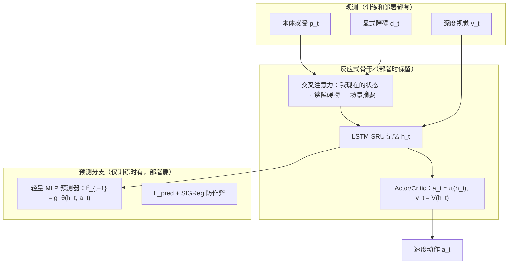

# Predictive Training with Latent Imagination 详解：训练时偷偷教它"预知未来"，部署时零开销

> **论文标题**：Predictive Training with Latent Imagination for Visual Quadruped Navigation
> **作者**：Yancheng Zhu（通讯作者）、Wanli Ma、Chen Han、Irvin Haozhe Zhan、Bingfeng Qin、Yixin Xu
> **机构**：Anker Spatial Perception Lab（安克创新空间感知实验室）
> **年份**：2026 年 7 月提交，arXiv 预印本（10 页，9 图）
> **arXiv**：https://arxiv.org/abs/2607.17574（全文 HTML：https://arxiv.org/html/2607.17574v1，PDF：https://arxiv.org/pdf/2607.17574）
> **DOI**：10.48550/arXiv.2607.17574
> **相关经典论文**：Dreamer 系列（"Learning Behaviors by Latent Imagination"，arXiv:1912.01603）——"latent imagination"一词的出处

---

## 🎯 三句话看懂这篇论文

1. **问题**：普通导航策略是"反应式"的——只看得见障碍物**现在**在哪，看不见它**下一秒**往哪走，在动态环境里总是"慢半拍"，容易撞。
2. **办法**：训练时在策略旁边偷偷加一个"预言家"（预测分支），逼着策略自己的记忆（隐状态）去**预测下一时刻的自己**；等它学会了预判，就把预言家**整个删掉**，部署时零开销。
3. **结果**：成功率 90.7% → 94.4%，动态障碍碰撞率比 NavRL **低 12 倍**，而且部署时**一个多余参数都不带**。

> 💡 **一句话记忆**：训练时请老师（预测分支）教它"预知未来"，毕业时把老师辞退——本事已经内化在学生的脑子里（隐状态）了。

---

## 为什么需要这篇论文（大白话）

想象开车：

- **反应式策略**：只盯着当前这一瞬——"前面有人，刹车！" 但人是在移动的，等你看到他的新位置再反应，**往往已经晚了**。
- **有预判的策略**：余光扫到行人跨步的**趋势**，提前松油门、微微变道，**从容通过**。

论文的核心判断（原文原话）：纯反应式策略失败的原因**不是"看不清障碍物"，而是"不会预判"**。

那让机器人"预判未来"贵不贵？传统做法（Dreamer 这类世界模型）**很贵**——它要养一个能"想象未来画面"的模型，部署时还得一直带着它。这篇论文反其道而行：

> **不在部署时想象未来，而是在训练时让策略把"预判"练成肌肉记忆（内化进隐状态），部署时把"想象的器官"直接切掉。**

---

## 核心思想（重点中的重点）

> **预测式训练改变的是"控制器学到了什么"，而不是"控制器每一步在做什么"。**

- ✅ **训练时**：多加一个**预测分支**，监督策略自己的隐状态 $h_t$ 去预测下一时刻 $h_{t+1}$；
- ❌ **部署时**：预测分支**整个删掉**，控制器只剩原来的反应式骨干——运行时不发生任何"想象 / 规划 / 世界模型查询"。

| | 训练 | 部署 |
|:---|:---|:---|
| 反应式骨干（编码 + 注意力 + 记忆 + 策略头） | ✅ 训练 | ✅ 用 |
| 预测分支（"预言家"） | ✅ 存在，监督隐状态 | ❌ **删掉** |
| SIGReg（"防作弊"） | ✅ 用 | ❌ 不需要 |

**这带来一个天大的好处**：前瞻能力是"免费的"——部署时**零额外参数、零额外计算**。这对四足机器人这种"高频、低算力、要上板卡（Jetson）"的场景非常关键。

---

## 重点一：预测分支——只在训练时存在，部署时删除

### 它干一件什么事？

训练时，每个时刻让一个**轻量小网络（预测器 $g_\theta$）**干这么一件事：

$$
\hat{h}_{t+1} = g_\theta(h_t, a_t)
$$

用"当前的记忆 $h_t$ + 当前动作 $a_t$"，**猜一猜下一时刻的记忆 $h_{t+1}$ 会变成什么样**。然后拿它和"真实的下一时刻记忆"对一下，猜得越准损失越小，这就是训练信号：

$$
L_{\text{pred}} = \frac{1}{d}\big\|g_\theta(h_t, a_t) - \operatorname{sg}(h_{t+1})\big\|_2^2
$$

> 🎯 **关键点**：预测发生在**记忆（隐状态）层面**，不是画面层面——它**不重建图像**，只预测"记忆下一步长啥样"。这就是论文说的 **JEPA 风格**：预测表示，而不是预测像素。轻量、省算力。

### 为什么需要"防作弊"（SIGReg）

如果只加 $L_{pred}$，会踩一个**坑**：预测器很懒，可能把所有目标都"坍缩"成一个常数——这样预测误差也能很小，但隐状态的信息全没了，actor 就废了。

于是加了一个**"防作弊"正则 SIGReg**：

$$
L_{\text{sigreg}} = \frac{1}{d}\sum_i (1-\sigma_i)^2 + \frac{1}{d}\sum_{i\neq j} C_{ij}^2
$$

通俗解释：要求隐状态的每一维**都有用（方差接近 1）**、且**互不重复（去相关）**。就像考试不许大家互相抄答案——每个人都要有自己的"见解"。

> 它相当于 DreamerV3 里 KL 散度防坍缩的"更轻版本"（不需要生成式网络、不需要采样）。

### 总损失（三个目标一起练）

$$
L_{\text{total}} = \underbrace{L_{\text{RL}}}_{\text{完成任务}} + 0.03\,\underbrace{L_{\text{pred}}}_{\text{学会预判}} + 0.003\,\underbrace{L_{\text{sigreg}}}_{\text{防止作弊}}
$$

> 🎯 **重点**：预测信号的权重只有 **0.03**，**很小**——它只负责"塑造隐状态"，不抢主任务的风头。主任务还是 RL，预判只是辅助。

---

## 重点二：怎么让隐状态具备"前瞻能力"

### 机制一句话

$L_{pred}$ 直接**惩罚"猜不中下一时刻"的隐状态**，于是梯度会逼着隐状态去**编码"运动信息"**——也就是障碍物接下来会怎么动。actor 读的正是这个被"预判梯度"塑造过的隐状态，所以它天然带预判。

### 为什么动态环境收益特别大？

- **静态环境**：障碍不动，你只要记住"它在这"，反应式策略就够了；
- **动态环境**：碰撞风险取决于"它**接下来**往哪走"，这必须靠隐状态编码**运动趋势**——正好是 $L_{pred}$ 逼它去做的。

论文原话：纯反应策略只能**隐式地**靠循环状态跨帧"积分速度"来猜运动；预测监督把这件事**显式化**了——所以预测信号在动态障碍任务上收益更大。

### 三路梯度同时灌进同一个记忆

1. **RL 梯度**：让策略能到达目标、避开障碍（主任务）；
2. **预测梯度**：逼隐状态编码"未来相关动态"（预判能力）；
3. **SIGReg 梯度**：防作弊，保证隐状态信息健康不坍缩。

其中有两个**"刹车点"（梯度停止）**很关键：
- 预测器输入侧 **detach**：不让预测梯度去破坏已经受 RL 充分监督的视觉特征；
- 预测目标 **stop-gradient**：防止预测器把答案"坍缩成常数"来偷懒。

> 用大白话说：**一边让它学"怎么走"（RL），一边偷偷教它"预判下一步"（预测），还要盯住它"不许偷懒"（SIGReg）。**

---

## 重点三：和 Dreamer 的区别——为什么这篇更轻

| 维度 | Dreamer（世界模型） | 这篇论文 |
|:---|:---|:---|
| 学什么 | 一个完整的**生成式世界模型**（重建画面 + 生成 + 规划） | 只学"预测隐状态下一步"，**不重建、不规划** |
| 预测对象 | 独立的世界模型状态 | 策略**自己的循环隐状态** |
| 部署时 | 带着整套世界模型 | **预测分支整个删掉**，零开销 |
| 防坍缩 | KL 散度 | SIGReg（更简单、非生成式） |

> 一句话：Dreamer 是"养一个会做梦的大脑，靠做梦来学习"；这篇是"训练时借做梦强化记忆，部署时把梦直接戒掉"。

---

## 这套系统是怎么搭的（通俗版架构）

### 输入：三类观测

- **本体感受** $p_t$（16 维）：机器人自己的状态 + 目标信息；
- **深度视觉** $v_t$：64×40 深度图提取的特征，"看见"环境；
- **显式障碍** $d_t$（132 维）：最多 12 个障碍物 × 11 个属性（位置、速度、大小、朝向、距离、威胁程度……）。

### 动作

$a_t=(v_x,v_y,\omega)$：高层速度指令，交给冻结的低层运动控制器执行（分层架构）。

### 处理流程（反应式骨干）

1. 每个障碍物用一个共享 MLP 编码成"特征向量"；
2. **机器人条件交叉注意力**：用"我自己现在的状态"当问句（query），去"读"每一个障碍物，得出一个"谁在威胁我"的场景摘要；
3. 融合所有信息 → 送入 **LSTM-SRU 记忆**（512 维，带里程计空间调制）；
4. **Actor / Critic 直接读这个记忆**，输出速度动作和状态价值。

### 预测分支（训练时挂在记忆后面）

记忆 $h_t$ → 轻量 MLP 预测器 → 预测 $\hat h_{t+1}$（**训练用，部署删**）。

---

## 效果怎么样（实验数字通俗解读）

### 导航任务（消融实验）

| 变体 | 成功率 | 碰撞率 | 超时率 | 解读 |
|:---|:---|:---|:---|:---|
| 无预测（基线） | 90.7% | 5.6% | 3.7% | 反应式，偶尔会卡住超时 |
| 有预测但无防作弊 | **86.0%** | **12.1%** | 1.9% | ⚠️ 还不如基线 |
| **完整方法** | **94.4%** | 5.6% | **0%** | ✅ 成功率最高，超时清零 |

> 🎯 **两个关键结论**：
> 1. 预测分支把成功率从 90.7% 提到 94.4%，并且**彻底消灭"卡住超时"**；
> 2. **SIGReg 防作弊是命门**：去掉它，成绩反而比"什么都不加"还差（86.0%）。说明"只加预测、不加防作弊"会导致表征坍缩，得不偿失。

> 补充：预测器用 Transformer 能到 95.3%，但参数 2.1M vs MLP 的 0.4M，性价比不如 MLP——所以最终选轻量 MLP。

### 动态障碍任务（和已发表方法比）

| 方法 | 成功率 | 碰撞率 | 超时率 |
|:---|:---|:---|:---|
| NavDP（扩散策略） | 19.2% | 59.6% | 21.2% |
| NavRL（LiDAR RL） | 52.3% | 44.9% | 2.8% |
| **本方法** | **96.2%** | **3.8%** | **0%** |

> 碰撞率比 NavRL **低 12 倍**、比 NavDP **低 16 倍**。而且同一个预测器从静态任务直接搬到动态任务依然有效——说明它学到的不是"任务小技巧"，而是**通用的"障碍物会怎么动"**。

### 真机验证

Unitree Go2 + RealSense D435i，板载 Jetson Orin，5Hz 策略，**零样本迁移**（不微调、不域自适应）：室内静态避障、室外动态避障（对迎面行人提前规避）都成功。

### 训练细节（一眼带过）

- 算法 **MDPO**（信任域 RL，PPO 的特例）；优化器矩阵参数用 Muon、其余用 AdamW；
- **teacher–student 不对称**：actor 只用"能部署的观测"，critic 额外用特权信息（真实障碍状态）；
- 仿真：Isaac Sim 4.5（PhysX），200Hz 物理 / 50Hz 低层 / 5Hz 导航策略，20,000 次迭代 × 4,096 并行环境 × 4 张 RTX 4090D，约 3 天。

---

## 附录：Dreamer 系列一览（供对照）

"latent imagination"这个说法最早来自 Dreamer 系列。如果你好奇"预测式世界模型"这条脉络的全貌，可以看这几篇：

| 论文 | 年份/发表 | arXiv | 一句话定位 |
|:---|:---|:---|:---|
| **Dreamer** | ICLR 2020 | 1912.01603 | 在紧凑隐空间用世界模型想象轨迹，"latent imagination"一词的出处 |
| **DreamerV2** | ICLR 2021 | 2010.02193 | 离散隐表示（RSSM + categorical latents），55 个 Atari 达人类水平 |
| **DreamerV3** | ICLR 2024 | 2301.04104 | 单一超参跑 150+ 任务，Minecraft 钻石收集 |
| **Imagination-Augmented Agents (I2A)** | NeurIPS 2017 | 1707.06203 | 把"想象轨迹"喂给模型无关策略，预测式想象训练先驱 |
| **PlaNet** | ICML 2019 | 1811.04551 | RSSM 起源，隐空间在线规划 |

> 区别核心一句话：Dreamer 的想象发生在**独立的生成式世界模型**里（部署时仍要带着），而本篇的预测监督直接作用在**策略自己的循环隐状态**上，部署时完全抛弃重建/规划——所以更轻。

---

## 局限

- 实验只用了**一步预测**，多步"隐空间想象" rollout 未验证（论文留作未来工作）；
- 预测信号对动态障碍收益最大，静态任务中收益相对有限；
- 分层架构依赖低层运动控制器质量。

---

## 对小脑模型的启示

1. **"训练时预测、部署时删除"是最轻的前瞻方案**：白赚预判能力，零推理开销，特别适合小脑这种"高频、低算力"模块。
2. **预测监督 + 防作弊（SIGReg）缺一不可**：只加预测不加防作弊，反而比不预测更差。
3. **JEPA 风格（预测记忆而非重建画面）** 是小脑在算力受限下做"前瞻"的正确姿势。
4. 与 VOP-Nav（预测安全速度区域）理念相通：都是"轻量预测 + 内化进策略"，只是预测对象不同（VOP 预测动作空间安全集，本篇预测隐状态）。
5. 可组合使用：VOP-Nav 提供"安全区域先验"，SEA-Nav 提供"可微安全盾牌"，本篇提供"隐状态前瞻记忆"——三者分别解决安全引导、安全约束、运动预判三个瓶颈。

---

## 原文获取

- arXiv 摘要页：https://arxiv.org/abs/2607.17574
- 全文 HTML（含全部公式）：https://arxiv.org/html/2607.17574v1
- 全文 PDF：https://arxiv.org/pdf/2607.17574
- Semantic Scholar：https://www.semanticscholar.org/paper/22598a2887869eced004b13586ae245b47316edb
- 引用建议：`Yancheng Zhu, Wanli Ma, Chen Han, Irvin Haozhe Zhan, Bingfeng Qin, and Yixin Xu, "Predictive Training with Latent Imagination for Visual Quadruped Navigation," arXiv:2607.17574 [cs.RO], 2026.`
