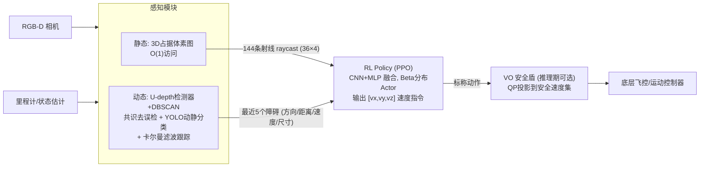
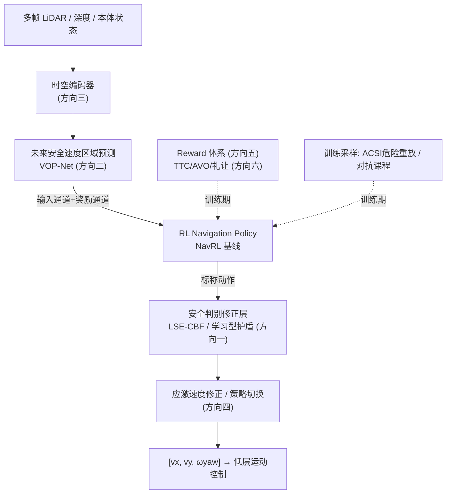
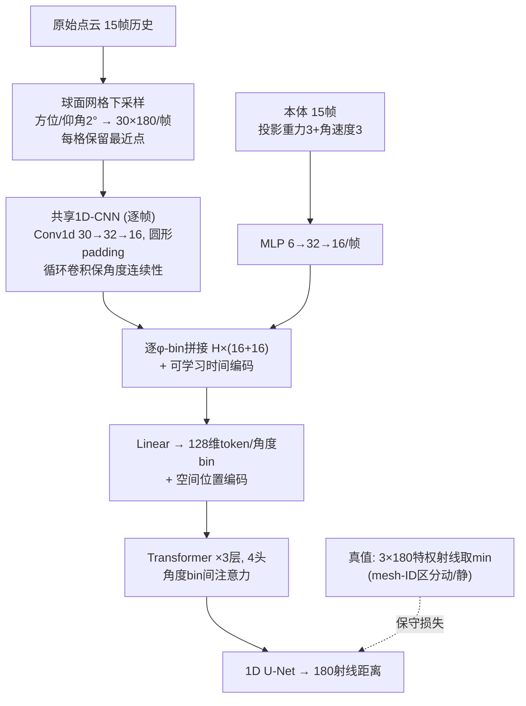
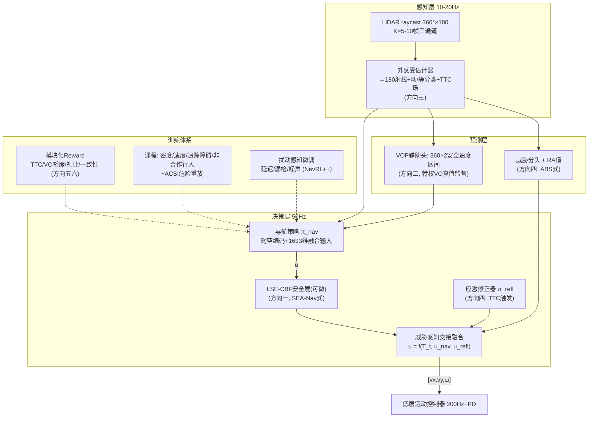

# 基于 DRL 的机器人动态避障导航：技术增强改进路线详细分析与开发建议

> **文档定位**：工程实施导向的技术分析与开发建议书。从 NavRL 基线框架出发，系统展开六个增强改进方向的技术方案、实现方法与分阶段实施路线。
> **目标平台**：四足机器人（Go2 类）。主线方案采用**速度指令级接口**（策略输出 `[vx, vy, ωyaw]`，50 Hz，下接预训练运动控制器）；每个方向同步标注**关节级方案**（12 维关节目标，50 Hz 策略 + 200 Hz PD）的对应做法与代价。
> **资料基础**：本仓库 NavRL/NavRL++/SEA-Nav/ABS/VOP-Nav/REASAN/REBot/SPLC/CBF-RL 等论文翻译与深度分析，`多帧LiDAR动态避障模型设计_汇总分析`（含 5 个仓库源码级分析）、`小脑模型与Reward设计`、`reward设计讨论` 三份前期研究文档，以及 REASAN、NavRL、SPLC 开源仓库的源码实读。
> **日期**：2026-09-01

---

## 目录

1. [基线框架：NavRL 技术体系详解](#1-基线框架navrl-技术体系详解)
2. [增强方向全景：在 Policy 的哪个位置加东西](#2-增强方向全景)
3. [方向一：Policy 后安全判别修正模型（SEA-Nav / ABS / REASAN / CBF-RL）](#3-方向一policy-后安全判别修正模型)
4. [方向二：Policy 前可行安全动作空间预测（VOP-Nav）](#4-方向二policy-前可行安全动作空间预测)
5. [方向三：时序 Ray Caster 隐式动态障碍物识别与预测](#5-方向三时序-ray-caster-隐式动态障碍物识别与预测)
6. [方向四：高速动态目标应激躲避与常规避障的切换/恢复](#6-方向四高速动态目标应激躲避与切换恢复)
7. [方向五：Reward 改进设计](#7-方向五reward-改进设计)
8. [方向六：与动态障碍物交互的礼让设计（SPLC / DRA-MPPI）](#8-方向六交互礼让设计)
9. [六方向集成：推荐总体架构与分阶段实施路线图](#9-集成总体架构与实施路线)
10. [附录：论文与代码仓库索引](#10-附录论文与代码仓库索引)

---

## 1. 基线框架：NavRL 技术体系详解

### 1.1 框架总览

NavRL（RA-L 2024, ZJU FAST Lab, arXiv:2409.15634）是当前工程结构最干净、最适合作为基线的 RL 局部导航框架。其核心链路：

该接口（感知 → RL Policy → 速度指令 → 低层控制）正是具身"小脑"的标准形态：训练快、模块化、可与安全层/规划层在同一动作空间融合。NavRL 在 Orin NX 上的实测耗时：静态感知 15 ms、动态感知 27 ms、策略推理 7 ms、安全盾 16 ms，合计满足 10 Hz 以上实时要求。

### 1.2 状态表示的实现要点（最值得复用的工程细节）

**（1）目标对齐坐标系。** 所有位置与速度统一转换到"起点→终点为 x 轴"的坐标系 $S_{int} = [\hat r,\ \lVert r\rVert,\ V_r^G]$，消除世界坐标绝对位置影响，网络学的是相对几何关系——这是泛化性和收敛速度的第一来源。

**（2）相对量拆分。** 相对位置拆成"单位方向向量 + 距离标量"两部分输入，而不是直接输入差值向量。有界单位向量 + 独立标量比原始差值更容易被 MLP 学习。

**（3）射线表示与反向编码。** 静态障碍以自我中心 3D raycast 表示（水平 36 束 × 垂直 4 束 = 144 维），超量程填充 `max_range + 1`（相当于告诉网络"这个方向没障碍"，比填 0 合理）。CNN 输入前做反向编码 `value = max_range − distance`，使近障碍区域呈高值（类似占据热力图）。

**（4）动态障碍结构化状态。** 最多保留最近 $N_d=5$ 个动态障碍，每个编码为 [单位方向, 距离, 速度向量, 尺寸]（公式3-4）。依赖上游检测-跟踪流水线——这既是 NavRL 的工程现实，也是其动态场景性能上限的根源（见 1.6）。

**（5）Beta 分布动作输出。** 策略输出 Beta 分布参数 $(\alpha,\beta)$（Softplus+偏移保证 >1），采样得 $\hat V\in[0,1]$ 再线性缩放 $V=v_{lim}(2\hat V-1)$。相比高斯分布，Beta 天然约束有界动作空间、避免边界截断偏差，实测收敛更快。部署时取分布均值。

### 1.3 奖励函数

$$R = R_{vel} + 1 + R_{static} + R_{dynamic} - 0.1 P_{smooth} - 8 P_{height}$$

| 分量 | 计算 | 作用与缺陷 |
|---|---|---|
| 速度奖励 $R_{vel}$ | $v_t^\top \hat r_t$（速度在目标方向上的投影） | 推动前进；但把"方向正确"与"距离缩短"混为一谈 |
| 生存偏置 | 常数 +1/步 | 防止连续负奖励导致策略偏好提前终止 |
| 静态安全 $R_{static}$ | $\frac{1}{N_L}\sum \log(\mathrm{clip}(d_i, \epsilon, R_L))$ | 对数距离：近障梯度陡、远障梯度缓，是"留间隙"的良好连续信号 |
| 动态安全 $R_{dynamic}$ | 最近 5 个动态障碍边界距离的对数均值 | **只看当前几何间隙，不含相对速度/TTC**——同距离下迎面逼近与同向并行风险完全不同 |
| 平滑 $P_{smooth}$ | $\lVert v_t - v_{t-1}\rVert_2$，系数 0.1 | 次级正则 |
| 高度带 $P_{height}$ | 超出起止高度带 0.2m 的平方惩罚，系数 8 | 无人机专用，四足平台需替换 |

终止语义：静态碰撞（$\min_i d_i < 0.3$ m）与高度越界 → `terminated`；超时（2200 步）→ `truncated`。值得注意：源码中显式碰撞扣分（-50）被注释掉，碰撞代价完全来自"终止后无法再积累正回报"——这与方向五中"稠密安全信号不可缺"的结论直接相关。

### 1.4 安全盾的源码级实现（NavRL 仓库 `safeAction.cpp` 实读）

NavRL 的安全盾是推理阶段的**速度障碍投影优化器**，本质是 ORCA 平面 + 线性规划求解：

1. **动态障碍球化**：垂直圆柱按 `numCubes = ceil(z_size / xy_size)` 分解为堆叠球体（每球半径 $\sqrt{x^2+y^2}/2$），对每球构造 ORCA 平面（`getORCAPlane`，含截止圆投影与锥面投影两个分支；已碰撞状态用 `1/time_step` 大系数强推离开）。
2. **静态障碍球化**：对射线命中点云做 DBSCAN（ε=0.2, minPts=2）聚类，每个簇取包围盒中心 + 外推（中心沿远离机器人方向平移 `maxDist`），半径 = 最大水平距离 × 1.5，速度置零后同样生成 ORCA 平面。
3. **按需求解**：只有当策略速度落入某 VO 区域（`inVO=true`）时才求解；求解用 RVO2 的 `linearProgram3/4`（逐平面约束的线性规划 + 平面失效时的迭代投影），将速度投影到所有半平面约束交集内，速度上下限截断。
4. **保守性处理**：多 VO 重叠导致无可行解时安全盾失效/输出保守速度；论文明确其设计假设是"策略仅偶尔出错，护盾只做兜底"——高频触发会显著拖慢并保守化（实测 16 ms/次）。

### 1.5 训练体系

- **大规模并行**：Isaac Sim 中 1024 架四旋翼并行，PPO（clip 0.1, lr 5e-4, γ=0.99），RTX 4090 训练 10 小时收敛。
- **课程学习**：初始 60 个动态障碍，成功率 >80% 后 +20，直至 120。课程的本质是**动态调整难度阈值防止早期探索崩溃**，而不是单纯加障碍。
- **零样本迁移成功的两个关键**：① 状态输入是几何测距（射线距离+速度向量）而非图像像素，仿真/现实的几何差异远小于渲染差异；② 输出高层速度指令，平台动态差异由底层控制器吸收。

### 1.6 NavRL++ 的增量：从框架到部署系统性（CMU, 2025）

NavRL++ 在同一框架上做了三项对工程极具价值的改进，量化结论如下：

**（1）基于 Transformer 的时序推理策略。** 12 个 token（1 [CLS] + 1 静态障碍 + 5 帧动态障碍历史 + 5 帧机器人内部状态历史，2 秒跨度/0.5 秒间隔），嵌入 64 维、4 头、4 层、FFN 128，总参数量仅 0.31M。**控制努力（CE）从 0.093 降至 0.043 m/s²（约 −54%）**，成功率保持——时序建模同时解决"动作振荡"和"延迟/漏检下的鲁棒决策"两个问题。

**（2）扰动感知微调（Perturbation-Aware Fine-Tuning）。** 预训练后在仿真中显式注入五类实测域差距再微调（学习率降至 5e-5）：输入高斯噪声、动态障碍漏检（Bernoulli 丢弃 p=0.3）、输入延迟 U(0, 0.1)s、动作延迟 U(0, 0.04)s、控制器增益随机化 ±40%。消融显示：扰动单独作用各降 1–5% 成功率（**感知漏检影响最大 >5%**），组合作用降 >10%（高密度环境 >15%）；微调后基本追回。

**（3）量化结论（高密度环境成功率）**：

| 方法 | 静态 SR | 动态 SR | 控制努力 |
|---|---|---|---|
| NavRL | 76.86% | 61.63% | 0.050 |
| NavRL-IT（改进训练） | ↑ | ↑ | 0.093（振荡变差） |
| NavRL-IT-T（Transformer） | ≈ | ≈ | 0.043 |
| **NavRL++（+扰动微调）** | **99.84%** | **83.96%** | 0.047 |

Gazebo 跨仿真器验证：静态环境与 EGO-Planner 相当（≈100%），动态环境大幅优于 ViGO（81% vs 57%）。部署 20 Hz、推理 4.1 ms，同一策略零样本迁移到无人机与四足。

**（4）NavRL++ 自述局限**（即增强方向的靶点）：动态密集场景碰撞率仍不可忽略；安全盾在拥挤时过保守乃至死锁；狭窄空间（两侧间隙 <0.1–0.2 m）射线表示过稀导致犹豫振荡；感知漏检仍是最大 sim2real 杀手。

### 1.7 基线短板清单 → 六个增强方向的映射

| # | 基线短板 | 对应增强方向 |
|---|---|---|
| 1 | 安全盾是推理期外挂：训练-部署不一致（策略不知道护盾存在，credit mismatch），VO 保守可死锁 | **方向一**：可微分/学习型安全修正层 |
| 2 | 策略只能"反应"，对"当前安全但即将不安全"的区域无先验 | **方向二**：Policy 前安全动作空间预测 |
| 3 | 动态障碍依赖上游检测-跟踪，漏检/遮挡级联致命；单帧观测动态盲 | **方向三**：时序 ray cast 隐式动态感知 |
| 4 | 高速迎面目标（反应时间 <1.5 s）超出反应式避障能力 | **方向四**：应激躲避 + 切换/恢复 |
| 5 | 动态风险评价只有对数距离，无相对速度/TTC/社交维度 | **方向五**：Reward 体系升级 |
| 6 | 无交互/礼让概念：不会协商，密集人群冻结或硬闯 | **方向六**：交互责任与礼让设计 |

---

## 2. 增强方向全景

在 Policy 的哪个位置加东西，是理解全部文献谱系的最有效框架：

六个方向不是六选一，而是**针对三个不同瓶颈的互补层**：
- VOP 类模块解决"**提前看见危险**"（感知-预测瓶颈）；
- 安全修正层解决"**最终动作不越安全边界**"（执行安全瓶颈）；
- 危险采样/课程解决"**训练时到底有没有见过危险**"（数据分布瓶颈）；
- Reward/TTC/礼让解决"**什么叫做得好**"（评价函数瓶颈）；
- 应激躲避解决"**常规反应式闭环来不及了怎么办**"（时间尺度瓶颈）。

---

## 3. 方向一：Policy 后安全判别修正模型

### 3.1 技术谱系：四个代际

| 代际 | 代表 | 机制 | 核心问题 |
|---|---|---|---|
| G1 后处理过滤 | NavRL VO 盾 | 推理期 QP/LP 投影 | 训练-部署不一致；策略与护盾不合作；梯度被截断 |
| G2 可微分护盾参与训练 | **SEA-Nav** LSE-CBF | 闭式解析投影层，梯度可回传，训练 jointly 优化 | 仍是几何规则；动态场景无显式预测 |
| G3 学习型护盾 | **REASAN** Safety-Shield RL | 第二个 RL 策略学"如何修正危险动作" | 安全不再是显式数学约束 |
| G4 风险值函数切换 | **ABS** RA 值 + 恢复策略 / CBF-RL 双重法 | 值函数判何时接管 + 值梯度引导备份策略 / 训练中过滤+塑形使策略内化安全 | 依赖策略条件化值函数质量 |

### 3.2 SEA-Nav：端到端可微分 LSE-CBF 安全层（详解）

SEA-Nav（arXiv:2603.09460）解决了 G1 的根本缺陷——**把安全层放进训练计算图，让策略与护盾协同优化而非对抗**。

**架构**：Actor-Critic 全 MLP。Actor 输出两个头：导航动作头 $\bar u_t=[\bar v_x,\bar v_y,\bar\omega_z]$ 与安全增益头 $\alpha_t=\mathrm{Softplus}(\cdot)$；两路进入 LSE-CBF 层解析计算最终安全命令 $u_{s,t}$。Critic 绕过安全层直接从共享特征估值。

**三步核心算法**（41 条射线，前方 240°，@3° 分辨率，量程 0.1–3.0 m，LiDAR 10 Hz / 本体 50 Hz）：

1. **LSE 平滑聚合**替代不可微 min：$h(x) = -\frac{1}{k}\ln\sum_i \exp(-k\, h_i(x))$，$h_i = \rho_i - r_{safe}$。多约束切换时梯度从 180° 突变变为 softmax 凸加权平均，消除"乒乓"振荡。
2. **带阻尼闭式投影**替代 CBF-QP：
$$u_s = \bar u - \frac{\max(0,\ \langle L_{gh}, \bar u\rangle + \alpha h)}{\lVert L_{gh}\rVert^2 + \epsilon_d}\, L_{gh}$$
阻尼项 $\epsilon_d=1.0$ 解决对称窄廊中 $\lVert L_{gh}\rVert^2\to 0$ 的数值发散（校正量封顶）。
3. **护盾干预损失**：$L_{shield}=\lVert u_s-\bar u\rVert^2 + [\alpha_{min}-\alpha_t]_+^2$（$\alpha_{min}=0.1$ 防止完全依赖护盾），与 PPO 损失联合更新：$L_{total}=L_{PPO}+\lambda_{shield}L_{shield}+\lambda_{reg}L_{reg}$。

**另两个配套组件**（对工程同样重要）：
- **ACSI 自适应碰撞状态初始化**：碰撞后以概率 $P_{reset}=P_{min}+(P_{max}-P_{min})\cdot\mathrm{clip}(L_{goal},0,1)$ 把机器人重置回碰撞前的高风险局部状态（保留真实位姿速度），课程随成功率提高而增大重置概率（$P_{min}=0.1, P_{max}=0.5$）——直接解决"碰撞即终止导致危险经验占比过低"的样本效率瓶颈。
- **运动学正则化**：速度范围软约束损失 + Lipschitz 平滑约束（对插值状态 $\bar x_t$ 的策略/值输出 MSE），降低 sim2real 跌倒与电机过热风险。

**结果**：单卡 4090 数十分钟训练，Go2 零样本部署（机载 L1 + 原生 MPC：0.45 m/s、85% 成功率；外接 RPLIDAR A2 + 自训敏捷策略：0.71 m/s、90%）。困难场景 SR 88.3%/CR 11.7%。消融：去掉 ACSI、护盾、正则化均使 SR 降、CR 升。

**速度级适配结论**：SEA-Nav 本身就是速度指令级方案，可直接作为主线。**关节级标注**：若输出关节目标，$L_{gh}$ 需在关节空间定义（如足端位置雅可比映射，参考 CBF-RL 楼梯任务的 $h(q)=p_x - p_x^{stair}$ 做法），计算量与建模复杂度显著上升。

### 3.3 REASAN：学习型安全屏蔽策略（源码级详解）

REASAN（arXiv:2512.09537, Groningen, 代码已开源）把"修正动作"本身变成一个 RL 策略：三个串联策略（locomotion → safety-shield → navigation）+ 一个外感受估计器，全部单 LiDAR 输入，IsaacLab + RSL-RL PPO 训练。

**分层结构**（每层冻结下层）：
- Locomotion：跟踪任意 $(v_x,v_y,\omega_z)$（上限 2.5/1.5 m/s、3 rad/s）；
- **Safety-Shield**：输入 180 射线 + 速度命令，输出修正后的安全命令——反应式避障全部由它承担；
- Navigation：输入目标 + 180 射线，输出期望命令，通过护盾执行。

**安全屏蔽策略的实现细节**（源码 `go2_filter_env.py` 实读）：

- **观测非对称**：actor 180 条射线（裁剪 3 m 归一化 + U(−0.05,0.05) 噪声），critic 额外拿 540 维特权射线（3×180 真值，/6.0）——asymmetric actor-critic 是四足 RL 标配。
- **逐射线 TTC 计算**（`compute_ttc`，可直接复用的关键代码资产）：
  - 静态射线：$ttc_i = \mathrm{clip}(d_i / \max(0, v_{proj,i}),\ 0,\ 3)$，$v_{proj}$ 为机器人速度在射线方向的投影；
  - 动态射线（通过 `ray_hit_mesh_ids` 区分命中网格是否为动态障碍）：相对速度 $v_{rel} = v_{ego,proj} - v_{obs,proj}$，$ttc_i = d_i / \max(0, v_{rel})$，截断 3 s。
- **TTC 门控奖励**（全部按 step_dt 缩放）：
  - $r_{track} = 4e^{-4\lVert v_{cmd}-v\rVert^2} + 3e^{-2(\omega_{cmd}-\omega)^2}$（命令跟踪）；
  - $r_{bad\_vel} = -1.0\cdot e^{-2\, vel\_ttc}$：当前速度方向 softmax 加权 TTC 越小惩罚越大——**这就是"方向五"中矢量 TTC 思想的现成开源实现**；
  - $r_{bad\_vel\_move} = -5\cdot\mathbb{1}[cmd\_ttc>2]\mathbb{1}[非零命令]\mathbb{1}[v与cmd反向>0.25]$：命令方向安全却反向跑 → 惩罚过度反应；
  - $r_{bad\_vel\_still} = -5\cdot\mathbb{1}[零命令]\mathbb{1}[min\_ttc>2.5]\mathbb{1}[速度>0.2]$：该停却在动 → 惩罚多余运动；
  - $r_{collision}=-100$、命令超限 $-10$、一阶/二阶动作差分各 $-0.01$。
- **课程**：地形难度等级制（超时晋级、半程内碰撞降级），障碍数 = 等级×0.4，障碍速度 U(0.5,1.5) m/s；动态障碍**追踪式重定向**（到达目标 0.5 m 内即以机器人当前位置×2 偏移为新目标）——保证持续的高动态交互压力。命令速度 U(0.5, 2.0) m/s，每 5–10 s 重采样。
- **分层一致性奖励**（Navigation 层独有，重要）：$r_{bad\_control} = -0.5\,(1-e^{-2\lVert a_{nav}-a_{filter}\rVert^2})$——**导航策略的动作若与冻结护盾的输出差异大则受罚**。这是让上下层不"打架"的低成本手段，方向四的切换协调可借鉴。

**结果**：消融证明单体端到端策略在动态障碍课程直接失败（成功率 46.9% vs 模块化 79.1%）；模块化使迷宫逃逸从 1.1% → 95.2%。真机 Go2 + Livox Mid-360 + AGX Orin，ONNX Runtime 全机载 50 Hz，2 m/s 限速下 Static/Dynamic/DeadEnd/Herding 四场景零碰撞，双机器人无通信交互 93 s 零碰撞。训练成本：loco 4 h / shield 15 h / nav 7 h（RTX 5090）。

**对本项目的意义**：REASAN 是"速度指令级 + 学习型护盾 + 时序外感受"的**完整开源参考实现**，其 TTC 奖励、护盾一致性奖励、动态追踪课程均可直接移植。

### 3.4 ABS：RA 值网络 + 恢复策略（值函数路线）

ABS（RSS 2024, CMU LeCAR, arXiv:2401.17583）提供的是"**策略条件化风险值**"这一独特资产：

- **RA 值网络**：输入仅 16 维（机体 twist 3 + 目标 xy 2 + 11 射线对数距离），输出 $(-1,1)$ 标量，低=安全且接近目标。**策略条件化**（不对动作空间做 min，只评估"敏捷策略在此状态下会不会失败"），时间折扣 RA Bellman 方程拟合式训练（$\gamma_{RA}=0.999999$，20 万回合敏捷策略 rollout）。
- **两个工程关键**：① 失败函数 hindsight 软化——碰撞前最后 10 步重标注为 $-0.8,-0.6,\dots,1.0$ 逼近 Lipschitz 连续，否则障碍侧面碰撞不可指示、值场出现局部极小（消融：不软化碰撞率 14.7% → 5.7%）；② 推理期一网两用——$V_{threshold}=-0.05$ 切换判据 + 恢复期作为**可微安全约束**做 twist 梯度优化（拉格朗日乘子 5 步内收敛，16 维小网络前向快是 50 Hz 可行的前提）。
- **结果**：仿真 ABS-n SR 79.1%/CR 5.7%，比无护盾敏捷策略（CR 21.7%）和 LAG（CR 9.1%）同时更安全更敏捷——**打破敏捷-安全权衡边界**；LAG+RA 显示该护盾可套用在其他策略上（CR 2.8%）。
- **局限（作者自述 + VOP-Nav 复现验证）**：RA 值用静态障碍训练，仅泛化到准静态；快速动态物体超过恢复策略速度极限即碰撞；单帧射线无时序。

**速度级适配**：RA 值可直接作为方向四的切换判据（见 §6.4）。**关节级**：ABS 原生关节级，姿态/结构可整体复用（仓库源码已在前期调研附录 B 级分析：obs 61 = 50 本体 + 11 射线）。

### 3.5 CBF-RL：训练中过滤 + 奖励塑形的双重内化（Ames 组, 2025）

CBF-RL（arXiv:2505.16276）提供另一个正交视角：**训练期用 CBF 过滤 rollout，让策略把安全内化，部署时不再需要过滤器**。

- 闭式单约束 QP 投影（无需求解器）：$a=\nabla h,\ b=-\alpha h$；$a^\top v \ge b$ 时 $v_{safe}=v$，否则 $v_{safe}=v+\frac{b-a^\top v}{\lVert a\rVert^2}a$。
- 配对奖励：$r_{cbf} = \min(a^\top v - b, 0) + \exp(-\lVert v - v_{safe}\rVert^2/\sigma^2) - 1$——策略获得"直接纠正监督"：看到自己想做什么、过滤器改了什么、奖励如何变化。
- 消融结论极有价值：**只用过滤器、部署不带过滤器 → 成功率从 98.8% 崩到 38.7%**（策略从未学过安全）；**双重法部署不带过滤器仍有 92.7%**；且对域随机化几乎免疫（99.0% 不变）。
- 已在 G1 人形上验证（避障 + 爬楼梯，零样本真机）。

**与 SEA-Nav 的关系**：SEA-Nav 让投影层永久留在闭环里且可微；CBF-RL 让投影只存在于训练期、部署期撤走。两者可组合：训练期双重法（快收敛+内化），部署期保留轻量 SEA-Nav 式解析投影兜底。

### 3.6 方向一工程方案与选型建议

**推荐组合（速度级主线）**：

1. **第一优先：SEA-Nav 式可微分 LSE-CBF 层**——实现简单（闭式解，无优化器，O(N)），训练-部署一致，分钟级训练可验证。射线配置升级为 180×360°（见方向三）。
2. **第二优先：REASAN 式学习型护盾**——在 LSE-CBF 层之上叠加（或替代），处理几何规则覆盖不了的复杂动态交互；其 TTC 奖励与一致性奖励直接移植。
3. **切换判据：ABS 式策略条件化 RA 值**——同时服务方向四。
4. **训练期增强：CBF-RL 双重法**——过滤 rollout + $r_{cbf}$ 塑形，加速内化。

**关键风险**：
- 训练期加护盾后，策略可能"躺平"依赖护盾（SEA-Nav 用 $[\alpha_{min}-\alpha]_+^2$ 抑制；CBF-RL 的 $r_{cbf}$ 惩罚干预本质同一目的）——**必须监控护盾干预率**（干预频率上升 = 策略在退化）。
- 护盾动作过保守会导致冻结死锁（NavRL++ 自述局限）——α 自适应 + 不可行时降级策略（方向六的联合碰撞概率可以给"等待 vs 绕行"提供依据）。

---

## 4. 方向二：Policy 前可行安全动作空间预测

### 4.1 核心思想转变：预测"对动作有用的量"而不是"世界本身"

传统动态避障链路：检测 → 跟踪 → 速度估计 → 轨迹预测 → VO/MPC。每一级的误差都向下级联，且密集人群的遮挡使上游崩溃。VOP-Nav（arXiv:2607.15036, SJTU, 2026）的关键转变：

> **不需要把每个障碍物未来的位置预测准，只需要预测"哪些速度对机器人是危险的"。**

VOP-Net 从多帧 LiDAR（当前 + 前 4 帧）直接回归**未来安全速度区域**——这是"隐式世界模型 + 显式任务输出"的范式。

### 4.2 VOP-Net 架构与监督信号

- **输入三通道**（每帧 n 条射线，K=5 帧）：① 原始距离；② 切向差分（同帧相邻射线差 = 空间梯度，突出障碍边界）；③ 帧间径向差分（时间梯度 = 观测级相对接近速度）。三通道差分是**性价比最高的手工时序特征**——比纯堆叠原始帧收敛快，且不需要长记忆。
- **主干**：MobileNet 块（深度可分离卷积）→ **正交注意力**（时间轴注意力与角度轴注意力独立加权——同时强调"关键历史时刻"与"危险空间方向"）→ 时间池化 → MLP 解码 → $d\times 2 = 360\times 2$ 安全速度区间。
- **监督信号零成本构造**（仿真特权状态 + VO 理论）：$V_{safe} = V_{max} \cap \bar\Omega_{VO}$，角度域离散化为 360 个方向；每方向若多段则**保留最保守的连续低速段**（高速段理论上可行但策略可能跟不上，且易诱发激进行为）。真值来自仿真中障碍物的真值位置/速度——部署时无此需求，网络已学会从观测推断。
- **损失**：$L = 0.2 L_{IoU} + 0.8 L_{MSE}$——IoU 学区域结构对齐，MSE 精修边界值。

### 4.3 双重集成：输入通道 + 奖励通道（复现关键）

单靠奖励通道，策略只在训练期"内化"安全习惯，推理时感知不到约束在线变化；单靠输入通道，缺少训练期梯度塑形。VOP-Nav 两个都用：

1. **输入通道**：360×2 输出展平 720 维 → 专用 MLP 编码器（隔一层编码，不直接 concat）→ 与深度 CNN 特征、LiDAR MLP 特征、本体 50 维拼接 → LayerNorm + 2×残差融合 → Actor。总输入 1693 维（970 基础 + 3 线速度 + 720 VOP）。
2. **奖励通道**：$r_{VO}$ 惩罚当前运动方向速度违反预测区间（k=5 近邻扇区反距离加权插值，处理角度周期性）——训练期软约束。**同时调高 $r_{agile}$ 权重**防止安全奖励压垮速度。

**训练衔接**（易错点，复用前期调研 §4.1.1 结论）：阶段 3 **冻结 VOP-Net 只训策略**——联合微调会使辅助头输出漂移，而 $r_{VO}$ 参考的正是这些输出，目标不稳。Critic 喂特权真值 VO 区间（非对称）。

**对论文未验证点的改良建议**（前期调研提出，复现即增量）：
- 嵌入路径降 d 至 72（与射线同网格），奖励插值保留 360——两条路分辨率解耦，编码器省 5 倍；
- 1D 深度可分离卷积替换 MLP 编码器（保留角度局部性）；
- 不可行 bin 用哨兵值 −1 显式标记（区分"这个方向慢点走"和"这个方向死了"）；
- **补"只有奖励 / 只有嵌入 / 双通道"三方消融**——论文没做，这是一节现成实验。

### 4.4 效果证据

- 五个环境（训练/森林/办公室/广场/慢速）全部最高成功率（训练环境 78.35%，8 种子 77.5±2.05）；广场（20 智能体 RVO 人群）显著优于 ORCA/NavRL/HEIGHT/REASAN/ABS。
- **揭示的共性规律**：ORCA/NavRL 碰撞率低但超时高——纯 VO 的保守速度选择导致犹豫/冻结；ABS/REASAN 碰撞率高——反应式端到端对密集交互处理不足。VOP 同时拿到低碰撞与低超时：预测使策略"提前绕行而不是临场减速"。
- 鲁棒性边界：障碍速度 2.0 m/s（超训练 1.5）成功率 78.35%→65.2%；50 障碍密度翻倍 →62.5%；**说明预测头对分布外动态仍会退化，需要方向四兜底**。
- 感知消融：真值替换 VOP-Net 输出仅小幅提升 → VOP-Net 已捕获足够信息；范围限制变体出现冻结与多次碰撞 → 遮挡区域的外推信息确实被利用。
- 真机 Go2 零样本（1.2 m/s 限速），速度剖面呈"间隙处加速、危险交互前减速"模式，行人距离合规性优于 NavRL。

**速度级/关节级**：VOP-Nav 原生关节级（12 关节目标）。速度级适配更简单——720 维安全区间直接作为速度策略的输入通道 + $r_{VO}$ 直接约束速度命令输出，甚至可作为方向一护盾的软参考（预测区间与 CBF 投影方向一致性校验）。

---

## 5. 方向三：时序 Ray Caster 隐式动态障碍物识别与预测

### 5.1 问题定义

单帧射线是"墙的照片"；动态信息只能从帧间变化读出（径向差分 ≈ 接近速度）。无检测-跟踪流水线的直接 ray cast 避障要应对动态障碍，必须在网络内隐式完成"识别运动 + 预测趋势"。这消灭了 NavRL 式感知级联误差（NavRL++ 实测感知漏检是最大 sim2real 杀手），是"一段式端到端"路线的核心。

### 5.2 四种时序范式对比（前期调研轴 2 结论）

| 范式 | 代表 | 优点 | 缺点 |
|---|---|---|---|
| 无时序（单帧） | ABS | 最快最简 | 动态盲，纯反应（VOP-Nav 实验证实其密集动态短板） |
| 差分通道（人工时序特征） | VOP-Net | 便宜、显式、50 Hz 无压力 | 只编码相邻帧，长时程靠策略 |
| 帧=token 窗口 + Transformer + 时间平均池化 | ColorDynamic (TWQ) | 兼容离线策略回放、全窗口建模 | d_model=射线数受限；DQN 范式迁移难 |
| 递归 GRU / 门控双通路 | Omni PD-RiskNet / REASAN-ConvGRU | 帧数灵活、因果自然 | 训练需门控/预训练工程 |

**RL 里用 Transformer 的两个坑**（KinematicRL 论证，必须遵守）：① post-LN 初始化信号衰减 $0.5^n$ → 用 pre-LN 或 GRU 门控残差块（`UnbiasedResidualGatingBlock` 可直接搬）；② 连续序列高相关 → TWQ 式独立时间窗口切分。**当前四足 RL 感知的实际主流是 GRU**（Omni、REASAN 消融：Transformer 版 1.3 ms vs ConvGRU 4.7 ms，成功率相当——Transformer 胜在推理效率）。

### 5.3 REASAN 外感受估计器（开源参考实现，源码级）

REASAN 的外感受估计器是"原始 LiDAR → 基于射线的动态感知表征"的**已验证开源实现**，架构（`ray_predictor/train_ray_estimator.py` 实读）：

**保守损失**（防高估 = 防漏报危险，安全导向的不对称监督）：
$$L = 2\,H(\hat d,d)\cdot\mathbb{1}[\hat d>d] + H(\hat d,d)\cdot\mathbb{1}[\hat d\le d] + 0.05\,\mathrm{ReLU}(\hat d - d + 0.1)\cdot\mathbb{1}[d<0.5]$$

即高估罚 2 倍、低估罚 1 倍，且真距离 <0.5 m 时对"预测偏大 0.1 m 以上"额外惩罚。消融：去掉保守损失成功率 65.8% → 27.9%。

**数据管线**：训练数据来自冻结安全屏蔽策略的 rollout（故意排除导航策略以防到达偏差），5×10⁵ 项 × 15 帧历史；训练 10 h / 12 GB VRAM。

### 5.4 训练基建：动态障碍 raycast 是性能瓶颈

- **REASAN `RayCasterDynamic`**（开源）：扩展 IsaacLab raycaster 支持**每环境多网格 + 动态障碍**，并返回 `_ray_hit_mesh_ids`——射线的命中网格 ID 是训练期特权信息，直接用于区分动/静射线（TTC 计算与奖励门控的基石）。这一"mesh-ID 通道"设计值得作为标准基础设施。
- **Omni-Perception 工具链**（开源，前期调研已分析）：Warp/Taichi GPU raycast，静态 BVH 建一次 + 全部并行环境的动态障碍合并为一个全局共享网格只同步顶点——数千并行环境 × 每步移动障碍的性能解法；支持 Livox Mid-360 非重复扫描模式仿真（sim2real 感知对齐优先做扫描模式对齐而非渲染保真度）。

### 5.5 推荐方案

结合 VOP（差分通道+注意力）、Omni（GRU+结构先验）、REASAN（保守监督+mesh-ID）：

1. **观测**：360° 全向、n=72–180 条（2–5° 分辨率）、K=5 帧起步（8–10 更稳），感知 10–20 Hz、策略 50 Hz 解耦；
2. **三通道差分必做**（原始/切向差分/帧间差分）；
3. **编码器二选一**：追求机载延迟 → 轻量 1D-CNN + 正交注意力（VOP 式）；追求实现简单 → GRU（Omni/REASAN 式）；Transformer 必须带门控残差；
4. **辅助头双保险**：回归扇区最小间隙或 VO 安全区间（特权状态 + 理论模型 + 角度离散化造真值），用途四合一——辅助损失加速表征 / 训练期奖励 / 推理期策略输入通道 / 部署可视化；
5. **明确不推荐**：裸 MLP 吃高维射线堆叠（Omni 消融 OOM + 成功率≈0）；无时序单帧应对动态；post-LN 原版 Transformer 进 PPO。

**关节级标注**：无差异——方向三属于感知前端，两种动作接口通用；仅注意关节级策略观测维度更大，编码器输出维度建议 ≥64。

---

## 6. 方向四：高速动态目标应激躲避与切换/恢复

### 6.1 反应时间分级（REBot 的核心洞察）

REBot（RA-L 2025, NUS, arXiv 及项目页 rebot-2025.github.io）按反应时间 $T_{react}$ 划分避障模式，这是需求定义的基准：

| $T_{react}$ | 模式 | 手段 | REBot 仿真 ASR |
|---|---|---|---|
| >2 s | 导航式规避 | 减速/停车/重规划 | —（常规避障覆盖） |
| 0.5–1.5 s | **反射式规避** | 瞬时机动（跳离/下蹲/侧闪） | REBot 0.65 vs ABS 0.11 / RRL 0.09 |
| 1.5–4 s | 混合 | 反射 + 导航 | 0.81 vs 0.51 / 0.41 |
| <0.5 s | 物理极限 | 所有方法失效（≈0.05） | — |

**关键结论**：反应式 RL 导航（含 NavRL 基线）在 0.5–1.5 s 区间近乎失效，因为高层速度命令 → 低层跟踪存在延迟与能力上限；反射级行为需要**动作空间的表达力**（下蹲、后跳、侧闪只有关节级可表达）或**极短延迟的专用通道**。

### 6.2 REBot 技术方案（源码级）

- **三态 FSM**：Normal（PD 站立+监测）→ 障碍逼近判据 $\langle v^O, p^R-p^O\rangle>0$ 时切入 Avoidance（RL 策略反射机动）→ 姿态/关节速度/身高任一越界时切入 Recovery（回到安全集合后返回 Normal）。
- **避障策略奖励**（PPO，obs 55 = 48 本体 + 球位置 3 + 球速 3 + 1）：
  - $r_{avoid} = -\exp(-(d(p^O,\mathcal{B}^R)-r^O))$：有界平滑间隙项（无稀疏跳变）；
  - $r_{threat} = -\lVert v^R - v^R_{safe}\rVert$，其中 $v^R_{safe} = v^R_{cmd} + \lambda e^{-\eta T_{reaction}}$——**紧迫度显式写进奖励：反应时间越短，期望躲避速度分量越大**；
  - $r_{dir} = -\langle v^R, p^O - p^R\rangle$：惩罚朝威胁移动；
  - $r_{div}$：动作多样性（消融：去掉后 GDI −40%，侧向/上方来袭失败集中）；
  - 能量 $-\sum|\tau\dot q|$、接触抖动、trot 相位正则。
- **两阶段课程**：先"延迟出现的静态障碍"（获得初始躲避技能），再"速度/方向随机化的移动障碍"（消融：跳过课程 1 掉 5%，且策略过度使用激进跳跃、快速威胁下触发延迟）。
- **结果边界**：真机（动捕跟踪 + 杆装球）ASR 56%/RSR 53%；Go2 机械偏置决定后方机动优于前方（形态不对称性要在评估时按方向分解）。

### 6.3 速度级主线的应激躲避方案设计

速度指令级无法下蹲/后跳，但可以做**应激速度修正器**——本质是把 REBot 的"反射"从关节空间搬到速度空间：

1. **触发器**：最小 TTC（复用方向一/三的逐射线 TTC）低于阈值 $T_{reflex}\approx 1.0$ s，或 ABS 式 RA 值越限；
2. **应激策略**（独立小策略或规则）：输入 = 当前命令 + 威胁方向/相对速度（或 180 射线），输出 = 短时程紧急速度修正（急停 / 大幅横移 / 后撤）；奖励沿用 REBot 三件套的速度级翻译：$r_{avoid}$（间隙）、$r_{threat}$（TTC 越小期望躲避速度越大）、$r_{dir}$（不朝威胁走）+ 速度平滑硬约束（防足式失稳）；
3. **训练课程**：REBot 两阶段制——先静态延迟障碍，再 0.5–4 m/s 追踪式移动障碍（REASAN 追踪重定向课程可直接用）；训练集必须包含"不避让甚至冲撞机器人"的障碍（ColorDynamic 消融：去掉后学出危险贴近行为）。

### 6.4 切换/恢复策略：三种协调机制对比

| 机制 | 代表 | 做法 | 优劣 |
|---|---|---|---|
| 硬切换 FSM | REBot | 威胁判据触发状态转移 | 简单可靠；切换瞬间动作不连续，易触发失稳 |
| 值函数切换 | ABS | RA 值 ≥ 阈值切恢复策略，恢复期 RA 值当优化约束 | 平滑、有理论含义（策略条件化可达集）；需训好 RA 值 |
| 连续交接融合 | UEREBot | 威胁分 $T_t$ 连续加权 $u_{fuse} = f_\psi(u_{nav}, u_{refl}, T_t)$，再过 CBF 盾 | 无切换抖动；威胁分头是学习出来的 |

**推荐（速度级）**：**UEREBot 式连续交接 + ABS 式值函数判据**的组合——
- 导航策略（方向一二三的产物）输出 $u_{nav}$ 常开；
- 应激策略输出 $u_{refl}$ 常开（或低频待命）；
- 学习一个威胁分头（输入：逐射线 TTC 场 + 相对速度 + RA 值），连续加权融合；威胁分同时作为方向五 reward 的课程信号；
- REASAN 的分层一致性奖励 $r_{bad\_control} = -0.5(1-e^{-2\lVert a_{nav}-a_{shield}\rVert^2})$ 推广为三策略间一致性正则，避免互相拉扯；
- **恢复判据**：REBot 三条件（姿态/关节速度/身高）+ RA 值回落到阈值以下，双确认后交还导航策略，并在恢复期内以 $r_{posture}$ 保持低重心便于无缝切回。

**关节级标注**：REBot/ABS 原生方案（下蹲/后跳/侧闪可用），代价是训练预算 ×3–5、需自带地形鲁棒底座；若主线是速度级，反射动表达力上限是"1.5 m/s 级横移/后撤 + 急停"，对 0.5–1.5 s 区间的迎面球类目标仍够用，对 <0.5 s 物理极限区间的差距无法用任何算法弥补。

---

## 7. 方向五：Reward 改进设计

### 7.1 现有开源项目的奖励设计盘点（源码级）

| 项目 | 进度信号 | 安全信号 | 行为正则 | 终端 |
|---|---|---|---|---|
| NavRL | 速度投影 $v^\top\hat r$ | 静/动对数距离（**无相对速度**） | 速度平滑 0.1 | 终止即代价（碰撞扣分被注释） |
| SEA-Nav | $\cos\theta\cdot v_x/(1+2d^2)$ + 间隙感知运动 | 碰撞接触力 −5、卡住检测 −5 | 角速度范围 −0.05 | terminated −100 / reach +10 |
| ABS | 软/紧位置跟踪 + heading + **敏捷项** $\max(\mathrm{ReLU}(v_x/v_{max}),\ \mathbb{1}[at\ goal])$ | 非期望碰撞 −100 | 12 项正则（力矩/关节限位/腾空/平滑…） | 碰撞 −100 |
| REASAN shield | 命令跟踪 exp | **TTC 门控三件套** + 碰撞 −100 | 动作一/二阶差分、命令限幅 | 接触力/翻覆终止 |
| REASAN nav | 分级到达 40/15/5 × 剩余时间平方比 + 进度 20 | $-0.5e^{-2\,minTTC}$、$-2e^{-2\,velTTC}$ + 护盾一致性 −0.5 | Dijkstra 引导 ±、时间 −5 | 失败终止 −100 |

**共同缺陷**（前期 reward 设计讨论已论证，此处按论文证据补强）：动态风险 = 纯几何距离，无相对运动趋势；无社交/礼让维度；"前进偏好"类正则（REASAN nav 的 $r_{backward\_vel}=-4$）在需要后撤的场景会压制正确行为，须做成条件性。

### 7.2 升级原则：静态间隙、动态预测风险、社会舒适三分开

在 NavRL 对数距离项（近障梯度好的优点保留）基础上：

**（1）动态风险用"矢量 TTC + 距离"双通道**。仅距离会漏"尚远但高速迎面"；仅 TTC 在相对速度近零时失效。源码级实现直接复用 REASAN 的 `compute_ttc`（逐射线、动静区分、3 s 截断）+ softmax 方向加权 → $r_{bad\_vel} = -w_d e^{-k\, vel\_ttc}$。**平滑要求**：TTC 天然突变（速度穿过零点），用 exp/clip/softmax 已平滑，切勿用 if-else 产生跳变奖励。

**（2）AVO/速度圆安全裕度**（智驾经验移植）：以动作换算出的速度矢量评价其在 VO 区间外的裕度，作为连续量奖励而非 0/1 判定——与方向二 VOP-Net 的 $r_{VO}$（区间违例惩罚）天然同构，可直接用 VOP 头替代解析 VO。

**（3）短时预测碰撞风险**：对动态目标 2 s 预测（CV 或学习预测）计算未来最小间隙/TTC 场。注意环境依赖（贴墙的人不会往墙里躲）——在仿真特权信息下可实现；部署时由方向三的时序隐式预测承担。

**（4）可执行性约束 cost**：横向加速度 $v\cdot\omega$ 上限惩罚（足式侧向能力弱于纵向）、加速度/角加速度二阶差分惩罚（REASAN 已有，系数 0.01 起步）、通信/控制延迟在训练中显式建模（NavRL++：输入延迟 U(0,0.1)s + 动作延迟 U(0,0.04)s 是实测后的推荐值）。

**（5）终端语义统一**：事件优先级明确为 碰撞/严重失稳 > 到达 > 越界 > 超时；真失败不 bootstrap、超时可 bootstrap；同帧多事件不得被超时掩盖（KinematicRL 的现行缺陷）。终端量级通过轨迹统计校验，不得完全压制稠密项（ColorDynamic ±200 的教训）。

### 7.3 模块化奖励骨架与课程化引入

$$r_t = w_p r_{progress} + w_h r_{heading} + w_s r_{static} + w_d r_{dyn\text{-}TTC} + w_v r_{VO\text{-}margin} + w_c r_{comfort} + w_y r_{yield} + w_m r_{smooth} + w_b r_{stability} + r_{time} + r_{terminal}$$

- 全部权重/阈值/开关进配置文件 + 统一缩放 wrapper（KinematicRL 模式）；每项 episode 累计值、成功率、碰撞率、最小间隙分布、TTC 分布、终止原因全部落日志——**调参不能只看总回报**。
- **课程化引入顺序**（避免一次全上导致学习崩坏）：
  1. Phase A：progress + heading + static log + 平滑（= NavRL 底座）；
  2. Phase B：+ 动态 TTC 项 + 碰撞终端（密集动态课程同时开启）；
  3. Phase C：+ VO 裕度/礼让项（依赖方向二/六模块就位）；
  4. Phase D：+ 可执行性 cost + 延迟扰动微调（NavRL++ 式）。
- 朝向项须由前方可通行性门控（CE-Nav 的 $\cos\theta\cdot\mathrm{clip}(d_{ahead},0,1)$ 做法）；后退/侧移惩罚必须条件化（高风险/恢复态下关闭）。

---

## 8. 方向六：交互礼让设计

### 8.1 问题定义

当前所有开源 RL 避障都没有交互模型：要么把行人当移动圆柱（NavRL/VOP 训练环境），要么依赖 ORCA 式对称假设。缺的两块：**避让责任区分**（谁该让）与**礼让成本**（让多少、怎么让最划算）。前期讨论已给出智驾式建模：朝向关系定责任（背对→ego 全责；正对→对半；静止→ego 全责）、交互成本按"双方对原动作的偏离量"分配（初始速度高者偏离代价大 → ego 多让）。

### 8.2 SPLC：社交偏好学习（arXiv:2607.01925）

SPLC 用**偏好学习替代手工礼让 reward**——把"什么算礼貌"交给可量化的评估准则自动标注：

- **三准则字典序**：碰撞发生（最高优先）> 目标进度 $\eta=\lVert p_1-p_g\rVert-\lVert p_L-p_g\rVert$ > 风险暴露 $\mu$（进入危险区频率）；风险暴露差转化为偏好风险 $\alpha = 0.1\tanh\frac{\mu_0-\mu_1}{\mu_{max}-\mu_{min}}$ 叠加到标签上。
- **自动偏好标签**：$(0.9,0.1)$/$(0.1,0.9)$/$(0.7\mp\alpha, 0.3\pm\alpha)$/$(0.5\mp\alpha)$，无需人工标注。
- **Preference Transformer**（Bradley-Terry + 非马尔可夫奖励加权）学出奖励模型 $\hat r_\psi$，喂给离线 RL（IQL/CQL/TD3BC）。
- **结果**：SPLC-CQL 95.4% SR / 4.6% CR vs 手工 reward 的 HR-CQL 36.4% / 63.6%（离线 RL 下手工 reward 偏差被算法保守性放大）；定性轨迹显示 SPLC 会提前绕行密集区、跟随人群流线。TurtleBot4 真机验证。代码暂未放出（README: coming soon）。

**对本项目的适配路径**：SPLC 是离线 RL + 轮式 $(v,\omega)$ 设定，不能直接搬。可移植的是**"准则自动标注偏好 + 奖励模型"**这一层：用本项目仿真海量 rollout 构造轨迹段对，三准则改为 [碰撞 / 进度 / TTC 风险暴露 / 礼让成本（双方动作偏离量）]，训出的偏好奖励 $\hat r_\psi$ 可直接作为方向五骨架中的 $r_{yield}$ 项（在线 RL 中作辅助奖励，或用于 teacher 蒸馏）。

### 8.3 DRA-MPPI：联合碰撞概率作为礼让的风险度量（arXiv:2506.21205）

DRA-MPPI 在规划侧给出可借鉴的**不确定性下的风险评估**：

- 行人运动用高斯混合（MoG）建模多模态预测；MPPI 采样 K=400 条轨迹，每条每个时间步的联合碰撞概率 $P^t = 1-\prod_o(1-P_o^t)$ 用蒙特卡洛高效并行近似（共享采样点，复杂度大幅下降）；
- 代价 $C_{risk} = w_{soft}\hat P + w_{hard}\cdot\mathbb{1}[\hat P>\epsilon]$：软项持续压低风险、硬项拒绝超阈值样本——**同时缓解冻结机器人问题**（对比纯鲁棒优化）；
- 结果：12 行人走廊 98% 成功率（vanilla MPPI 43%、Frenet 74%、S-MPC 96%），CP 0.040；真机 65 s 无碰撞、峰值 CP 0.054。

**对本项目的两个用法**：
1. **礼让 reward 的风险项**：在仿真中用 MoG 预测 + 联合 CP 作为稠密奖励项 $-w\hat P$，比二值碰撞/距离更细腻地区分"贴边穿过人群缝隙"与"等人群流过"的优劣；
2. **教师蒸馏**：DRA-MPPI（或 ORDCA 类规划器）作为有特权信息的最优教师，在密集人群场景生成示教轨迹，用于导航策略的 IL 预训练（CE-Nav 的 GuidedActor 两阶段模式）或 DAgger 纠偏——这把"礼让"从 reward 工程问题部分转化为"模仿一个好的交互规划器"。

### 8.4 工程建议

1. 第一阶段：**规则化礼让项**——朝向关系责任系数 + 双方交互成本（对原动作偏离量）作为连续 reward 项，先在 2–4 个行人场景验证；
2. 第二阶段：**SPLC 式偏好奖励模型**——大规模仿真 rollout 自动标注，$\hat r_\psi$ 替换/融合规则项；
3. 全程：**联合 CP 作为评估指标**（不只看碰撞率——CP 分布才能区分"运气好没撞"和"真的安全"），部署侧可选保留一个 DRA-MPPI 式低频校验器（10 Hz）对 RL 输出做最后一致性检查；
4. 训练环境必须含**非合作行人**（不避让、突然变向、迎面手机低头族），否则礼让策略学到的是"对礼貌人群的礼貌"，分布外一撞即溃（VOP-Nav 用线性障碍训练 + RVO 人群测试的域偏移设计值得照抄）。

---

## 9. 集成：总体架构与实施路线

### 9.1 推荐目标架构（速度级主线）

**关节级支线**：把 SHIELDL 之后直接接 12 关节策略（ABS/VOP 架构），应激层获得下蹲/后跳能力；预测层/感知层/reward 体系全部复用。决策点：速度级版本全链路打通并达标后，再评估是否投入关节级（训练预算 ×3–5）。

### 9.2 分阶段实施计划

| Phase | 目标 | 内容 | 验收标准 |
|---|---|---|---|
| **P0 基线复现**（2–3 周） | 跑通并改造成果 | IsaacLab + RSL-RL 复现 NavRL 式基线（改用 180×360° 射线 + REASAN RayCasterDynamic + 追踪动态课程）；基线 reward 按方向五骨架模块化 | 训练环境 SR≥90%（静态）/≥75%（动态密集），日志体系就位 |
| **P1 安全层**（3–4 周） | 方向一 | LSE-CBF 可微层 + $r_{cbf}$ 双重法 + ACSI 危险重放；护盾干预率监控 | 困难场景 CR 下降 ≥30%，无冻结死锁，训练时间不翻倍 |
| **P2 时序感知+预测**（4–6 周） | 方向三+二 | 三通道时序编码器 + VOP 辅助头（IoU+MSE 监督）+ 双通道集成 + 三方消融 | 动态密集 SR +5–10pp；VOP 头 MAE 达 VOP-Net 同量级；消融补全 |
| **P3 应激与切换**（4 周） | 方向四 | TTC 触发的应激修正器 + 威胁分交接融合 + RA 值判据 + 恢复判据 | 0.5–1.5 s 反应时间区间 ASR ≥0.5（对照基线 ≈0.1）；切换无抖动（动作连续性指标） |
| **P4 礼让+reward 升级**（4 周） | 方向五+六 | TTC/VO 裕度/礼让 reward 模块课程化引入；偏好奖励模型训练；非合作行人课程 | 人群场景 SR/CP 双优；最近距离分布右移；无冻结增加 |
| **P5 部署工程**（持续） | 真机 | 扰动感知微调（延迟/漏检/噪声按 NavRL++ 实测值）；ONNX→TensorRT；Orin 50 Hz | 真机 SR≥85%，推理全链 ≤20 ms |

### 9.3 评估指标体系（防"总回报上升但实际变差"）

- **任务**：成功率、超时率、平均/峰值速度、路径长度、控制努力 CE；
- **安全**：碰撞率、**最小间隙分布**、**TTC 分布**、**联合碰撞概率 CP 分布**（DRA-MPPI 式）、护盾干预率、应激触发率；
- **社交**：最近行人距离分布、冻结时间占比、礼让成功率（交互场景双方减速协调比例）；
- **切换质量**：状态切换频率、切换瞬间动作跳变幅度、恢复时长；
- **sim2real**：扰动逐项消融（NavRL++ 协议）、跨仿真器（Gazebo/Genesis）迁移。

### 9.4 主要风险与对策

| 风险 | 证据 | 对策 |
|---|---|---|
| 模块叠加导致训练不稳 | 奖励复杂度↑学习难度↑（前期讨论） | 严格课程化引入（§7.3）；每加一个模块跑三方消融 |
| 护盾依赖/干预率漂移 | SEA-Nav α_min 设计动机 | 监控干预率；$[\alpha_{min}-\alpha]_+^2$；CBF-RL 式干预惩罚 |
| VOP 头分布外退化 | 2.0 m/s 时 SR 65.2% | 训练速度上限覆盖 1.3×预期；方向四兜底 |
| 非对称观测（特权 critic）sim2real 断层 | 各论文标配但部署无特权 | 部署仅用 actor；critic 特权只影响训练 |
| 关节级预算失控 | REBot/ABS 训练成本 | 速度级先达标；关节级只做应激层专项 |
| 动态 raycast 训练吞吐 | IsaacLab 原生不支持动态多对象 | 直接复用 REASAN RayCasterDynamic / Omni 工具链 |

---

## 10. 附录：论文与代码仓库索引

### 10.1 核心论文

| 论文 | 定位 | 本地 | 代码 |
|---|---|---|---|
| NavRL (RA-L'24) | 基线框架 | `NAVRL/NavRL.md` | ✅ [ZJU-FAST-Lab/NavRL](https://github.com/ZJU-FAST-Lab/NavRL)（本地 `D:\ReferenceCode\NavRL`） |
| NavRL++ (CMU'25) | 部署系统性/时序推理/扰动微调 | `NAVRL/NavRL++.md` | 承诺开源 |
| SEA-Nav (2026) | 可微分 LSE-CBF + ACSI | `DRL/SEA-Nav/`（翻译+LSE_CBF算法详细分析） | 项目页 [11chens.github.io/sea-nav](https://11chens.github.io/sea-nav/) |
| ABS (RSS'24) | RA 值+双策略 | `DRL/ABS/` | ✅ [LeCAR-Lab/ABS](https://github.com/LeCAR-Lab/ABS)（本地） |
| REASAN (2025) | 学习型护盾+外感受估计器 | `DRL/REASAN/` | ✅ [ASIG-X/REASAN](https://github.com/ASIG-X/REASAN)（已克隆 `D:\ReferenceCode\REASAN`） |
| VOP-Nav (2026) | 安全速度区域预测 | `DRL/VOP_NAV/` | ❌ 404（私有/待发布，2026-08-29 验证） |
| REBot (RA-L'25) | 反射式躲避 | `DRL/Rebot/` | ✅ [ZihaoXU24/quadruped-reflexive-evasion-robot](https://github.com/ZihaoXU24/quadruped-reflexive-evasion-robot)（本地） |
| UEREBot (2026) | 连续交接融合+CBF盾 | `DRL/Rebot/UEREBot_深度解读.html` | ❌ 仅项目页 |
| CBF-RL (2025) | 训练中过滤+塑形 | `DRL/CBF-RL/` | ✅ demo [lzyang2000/cbf-rl-navigation-demo](https://github.com/lzyang2000/cbf-rl-navigation-demo) |
| SPLC (2026) | 社交偏好学习 | `DRL/SPLC/` | ⚠️ 仓库仅有 README（coming soon），已克隆 |
| DRA-MPPI (2025) | 联合碰撞概率规划 | `MPPI/MPPI_并行计算/DRA_MPPI/` | [autonomousrobots.nl](https://autonomousrobots.nl/paper_websites/dra-mppi/)（本地 `D:\ReferenceCode\DRA_MPPI`） |
| Omni-Perception (CoRL'25) | 时序点云+GPU raycast 工具链 | 前期调研 §1.6 | ✅ [aCodeDog/OmniPerception](https://github.com/aCodeDog/OmniPerception)（仅工具链） |
| ColorDynamic (2025) | TWQ+Transqer 时序 | `DRL/ColorDynamics/` | ✅（本地） |
| KinematicRL (TASE'26) | 门控时空 Transformer | `DRL/KInematicRL/` | ✅（本地） |
| Hi-QARL (2025) | 对抗障碍课程 | 路线图 HTML 引用 | arXiv:2503.11467 |
| One Filter (2024) | 通用安全过滤器 | 路线图 HTML 引用 | arXiv:2412.09989 |

### 10.2 前期研究文档（本文的直接上游）

1. `DRL/小脑模型设计讨论/小脑模型与Reward设计.md` —— 模型结构四项目对比、reward 四项目对比、架构建议；
2. `DRL/小脑模型设计讨论/reward设计讨论.md` —— 智驾式 reward 升级六条设计（TTC/AVO/预测/礼让/责任区分/可执行性）；
3. `DRL/Lidar_Dynamic_Avoidance_Survey/多帧LiDAR动态避障模型设计_汇总分析.md` —— 七系统源码级调研（含附录 B 张量维度规格与 MobileNet 扫盲）；
4. `DRL/RL_Navigation_Policy_Enhancement_Roadmap.html` —— 六条增强路线的可视化路线图。

### 10.3 本次新增源码实读结论速记

- **NavRL `safeAction.cpp`**：ORCA 平面构造（截止圆/锥面双分支）、静态障碍 DBSCAN→外推球化（半径×1.5）、动态圆柱堆叠球化、LP3/LP4 按需求解；`useSafetyInStatic_` 可关静态护盾。
- **REASAN `go2_filter_env.py` / `go2_nav_env.py`**：TTC 逐射线计算（mesh-ID 区分动静）、TTC 门控奖励三件套、护盾一致性奖励、非对称 180/540 射线观测、追踪式动态障碍课程、地形等级课程（超时晋级/半程碰撞降级）。
- **REASAN `train_ray_estimator.py`**：RayPredictor = 逐帧 1D-CNN（圆形 padding）+ IMU 编码 + 可学习时间编码 + 角度 token Transformer×3 + UNet1D；ConservativeLoss 非对称 Huber + 近距过估惩罚。
- **SPLC**：代码未放出，算法以论文为准（三准则字典序自动标注 + Preference Transformer + 离线 RL）。
