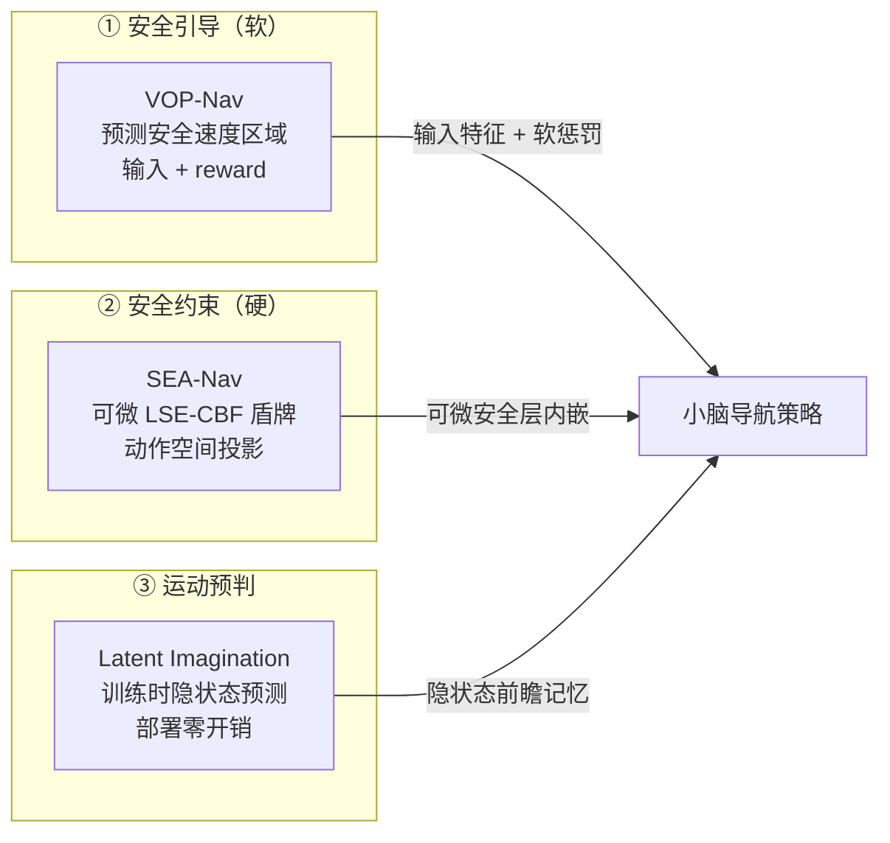

# 小脑：导航强化学习论文与源码详解

本目录收录面向"小脑模型"（机器人局部导航强化学习策略）的论文与源码详解，聚焦**安全引导、安全约束、运动预判和工程实现**。

---

## 目录

| 文件 | 论文 | 核心主题 |
|:---|:---|:---|
| [01_VOP-Nav_安全速度区域详解.md](./01_VOP-Nav_安全速度区域详解.md) · [📄 PDF](./VOP-Nav_安全速度区域详解.pdf) | VOP-Nav（Learning Agile Navigation in Crowded Environments for Quadruped Robots，arXiv:2607.15036） | 预测"未来安全速度区域"→ 输入 + reward 双重引导，比显式 tracking 更直接 |
| [02_SEA-Nav_LSE-CBF盾牌详解.md](./02_SEA-Nav_LSE-CBF盾牌详解.md) · [📄 PDF](./SEA-Nav_LSE-CBF盾牌详解.pdf) | SEA-Nav（arXiv:2603.09460） | 可微 LSE-CBF 盾牌 + Shield Loss + ACSI，比 post-processing 更适合联合训练 |
| [03_Predictive_Training_with_Latent_Imagination_详解.md](./03_Predictive_Training_with_Latent_Imagination_详解.md) · [📄 PDF](./Predictive_Training_with_Latent_Imagination_详解.pdf) | Predictive Training with Latent Imagination（arXiv:2607.17574） | 训练时隐空间预测、部署时删除，让隐状态具备前瞻能力 |
| [04_NavRL_源码级详细解析.md](./04_NavRL_源码级详细解析.md) | NavRL（RA-L 2025，arXiv:2409.15634） | 结合官方代码解释观测、CNN/MLP、Beta Actor、PPO、奖励、速度控制和 safety shield |

---

## 三篇论文概览

### 1. VOP-Nav — 安全速度区域（软引导 · 前瞻）

- **要解决的问题**：动态拥挤环境中，检测→跟踪→预测→VO/MPC 管线太长、遮挡易失效。
- **核心思想**：不预测障碍轨迹，只预测"哪些速度安全"——VOP-Net 从多帧 LiDAR 回归 360 方向的安全速度区间 $\mathbf{V}_{safe}\in\mathbb{R}^{360\times2}$。
- **如何用**：推理时作为策略输入（720 维特征），训练时作为 reward（$r_{VO}$ 软惩罚）。
- **为什么更直接**：跳过显式 tracking 的多级误差累积，预测直接落在动作决策空间，保留端到端敏捷性，不依赖特权信息。

### 2. SEA-Nav — 可微安全盾牌（硬约束 · 内嵌）

- **要解决的问题**：后处理安全过滤（CBF-QP）不可微、train-test mismatch；密集障碍样本效率低。
- **核心思想**：把安全层做成**可微闭式投影**（LSE 光滑聚合 + 阻尼解析解），让策略训练时内化安全；ACSI 碰撞关键状态重放提高样本效率。
- **关键技术**：LSE-CBF 可导、Shield Loss（名义≈盾牌 + $\alpha$ 下界）、ACSI 成功率课程、Kinematic 正则。
- **为什么更适合联合训练**：梯度贯穿、自适应 $\alpha$、训练即一致（无部署冲突），分钟级训练零样本部署。

### 3. Predictive Training with Latent Imagination — 隐空间前瞻（预测式训练）

- **要解决的问题**：反应式策略缺乏对动态障碍物短时演化的预判。
- **核心思想**：训练时用 JEPA 风格轻量预测器监督策略自己的循环隐状态 $h_t$ 预测 $h_{t+1}$（$L_{pred}$ + SIGReg 防坍缩），部署时**整个预测分支删除**，零额外推理开销。
- **如何前瞻**：预测梯度迫使隐状态显式编码短时域障碍物运动，actor 读到的 $h_t$ 已含预判信息。
- **结果**：Nav 任务 SR 90.7%→94.4% 且消除超时；DynObs 碰撞率比 NavRL 低 12 倍。

---

## 三篇论文如何互补（可组合使用）

| 瓶颈 | 论文 | 手段 | 训练时 | 部署时 |
|:---|:---|:---|:---|:---|
| 安全引导 | VOP-Nav | 预测安全速度区域（软） | reward 引导 | 输入特征 |
| 安全约束 | SEA-Nav | 可微 CBF 盾牌（硬） | 梯度内化安全 | 可微投影层 |
| 运动预判 | Latent Imagination | 隐状态预测监督 | 预测分支塑造隐状态 | 预测分支删除 |

---

## 原文获取说明

三篇论文的 **PDF 已下载到本目录**（可直接阅读），同时均可从 **arXiv 合法开放全文**获取（HTML/PDF），无需 sci-hub 镜像：

| 论文 | 本地 PDF | arXiv |
|:---|:---|:---|
| VOP-Nav | [VOP-Nav_安全速度区域详解.pdf](./VOP-Nav_安全速度区域详解.pdf)（17M） | https://arxiv.org/abs/2607.15036 |
| SEA-Nav | [SEA-Nav_LSE-CBF盾牌详解.pdf](./SEA-Nav_LSE-CBF盾牌详解.pdf)（3.6M） | https://arxiv.org/abs/2603.09460（项目主页：https://11chens.github.io/sea-nav/） |
| Latent Imagination | [Predictive_Training_with_Latent_Imagination_详解.pdf](./Predictive_Training_with_Latent_Imagination_详解.pdf)（25M） | https://arxiv.org/abs/2607.17574 |

> 备注：sci-hub（如 sci-hub.ee）主要收录有期刊 DOI 的论文；上述三篇均为最新 arXiv 预印本（2026 年），arXiv 官方 HTML 全文已包含全部公式，可直接阅读，无需镜像。
