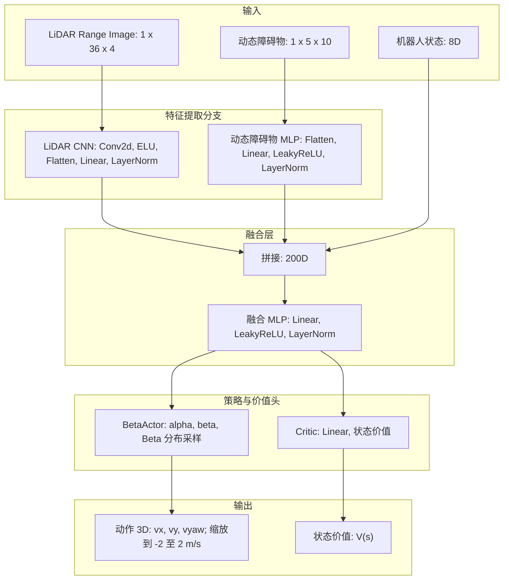
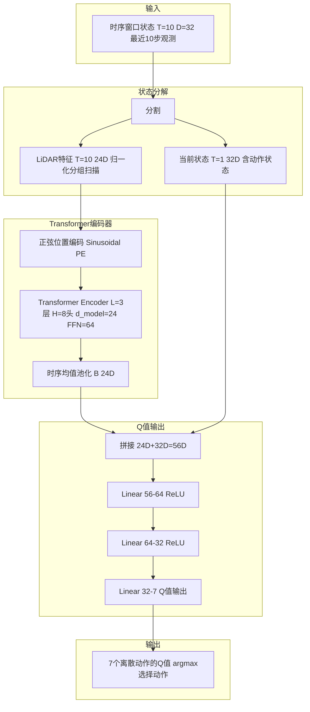
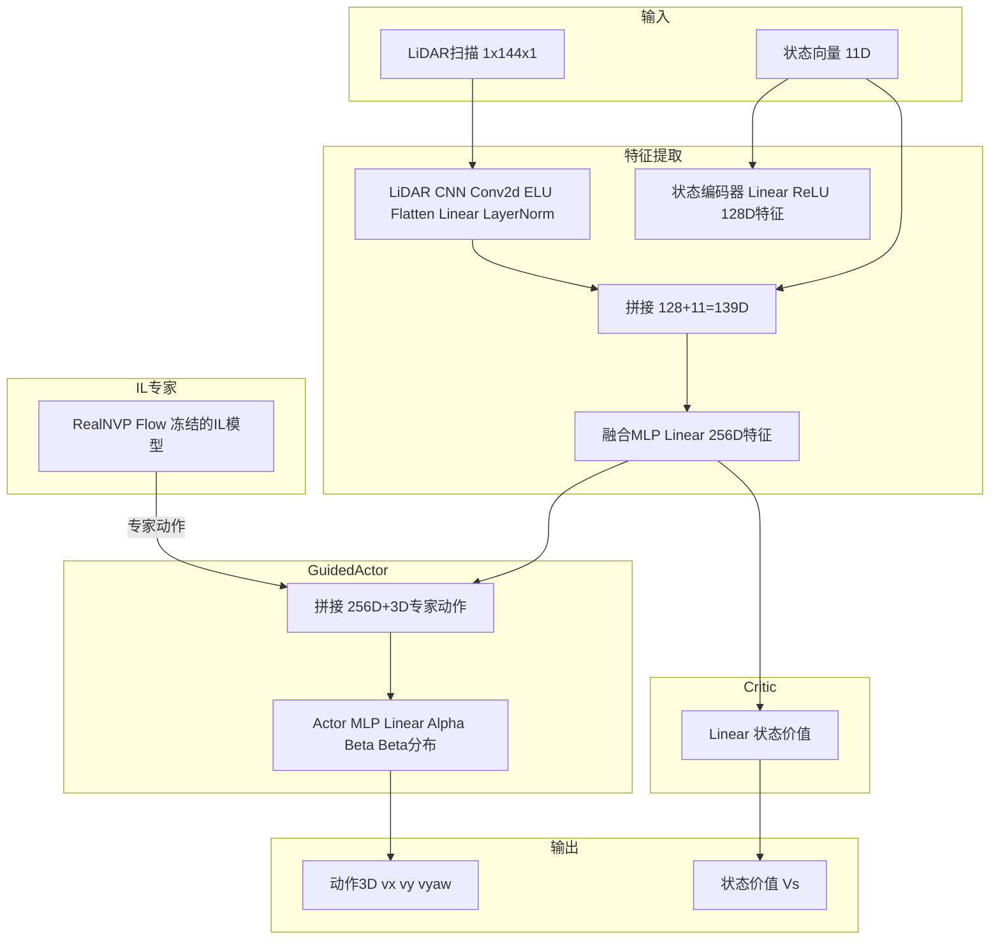
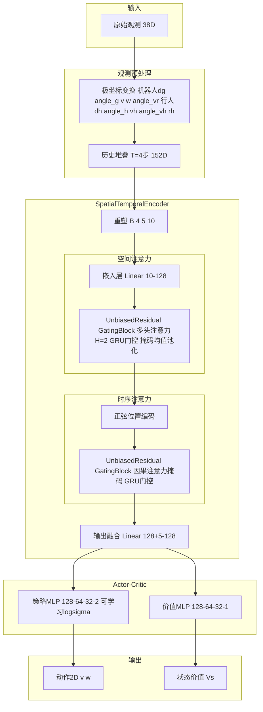
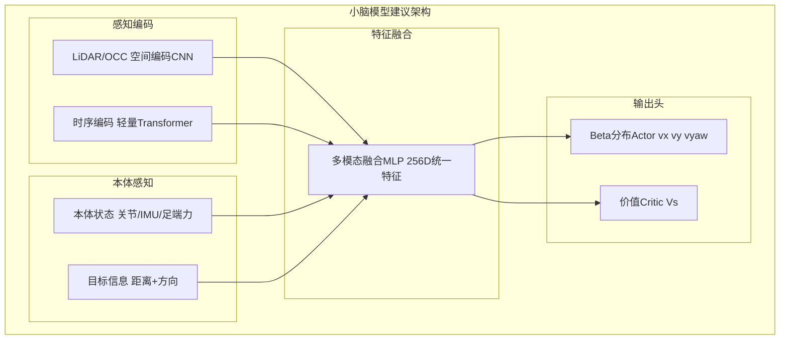

# 小脑模型与Reward设计分析与讨论

## 设计需要讨论确定的细节
### 1. 小脑模型的输入输出
#### 模型的输入
类似于智驾中的一段式和两段式端到端，机器人小脑模型也可以采样两种方式：
- 一段式：直接从传感器数据提取特征，并直接映射为动作输出
    - ray cast 方法：直接接入lidar 点云，并通过聚类将感知空间分割为36X4 [横向10°一个区域，高度 20°一个分隔] 个区域，并给出每个区域内的障碍物距离 
    （目前我们机器狗项目已经开始同时用狗自带Lidar和 后装Lidar 做融合后，再聚类，最后聚类出360X4 的ray cast 以应对桌子腿这种细的障碍物）
    - RGB 相机与深度相机图片输入， 直接由小脑模型从中提取特征
- 两段式：先用独立的感知模型从传感器数据中进行感知任务识别，给出中间结构化数据输出
    - 小脑模型不直接接传感器数据，而是通过独立感知任务输出中间识别结果： 
        - 静态障碍物以OCC占据栅格图，或者Nav mesh(类似freespace)给出；
        - 动态障碍物以OD 数据给出

目前主流的趋势是往一段式方向发展，因为其不再依赖上游OD，OCC的感知结果，而是直接从传感器数据中提取特征。这样提高模型的泛化性。 
    - 在机器狗上，机器人上要把OCC 和OD 做稳定，也需要额外的模型训练和数据量，成本太高；
    - OD/OCC 做的再好也难免会有错误，最终都会影响效果
    - 对于局部避障来说，不需要复杂和全局的感知结果，只需要Lidar 即可

#### 模型的输出
- 直接目标动作输出： 机器人人的动作输出，包括速度、方向、加速度等，其中又有两种
    - 直接的连续动作值输出
    - 将整个动作空间离散化，将模型输出任务处理为一个分类任务
- 输出目标运动轨迹： 机器人人的运动轨迹输出，包括位置、速度、加速度等

### 2. 模型的结构设计

本节对 NavRL、ColorDynamic、CE-Nav、KinematicRL 四个项目的强化学习模型结构进行详细分析对比，为小脑模型的网络架构设计提供参考。

CE-NAV 实际将模型分成了两部分，先用速度流模型训练了一个预训练模型，其起到一个决策作用，为后续的强化学习模型提供动作建议。实际强化学习模型这部分结构基本和NAVRL 一致，只是增加了来自预训练模型的动作建议的输入编码。

#### 2.1 四个项目的模型架构总览

| 比较维度 | NavRL | ColorDynamic | CE-Nav | KinematicRL |
|---|---|---|---|---|
| 机器人平台 | 三维无人机 | 轮式机器人 | Go2 四足机器人 | 运动学机器人（人群导航） |
| RL 算法 | PPO（自定义 torchrl） | Double Q-Learning（epsilon-greedy） | PPO（Guided Actor-Critic） | PPO（Stable Baselines3） |
| 架构范式 | Actor-Critic（共享特征提取） | Value-based（单一 Q 网络） | Actor-Critic（IL专家引导） | Actor-Critic（Transformer 编码器） |
| 特征提取 | CNN + MLP | Transformer + MLP | CNN + MLP + IL专家 | Spatial-Temporal Transformer |
| 动作空间 | 连续 3D（vx, vy, vyaw） | 离散 7 动作 | 连续 3D（vx, vy, vyaw） | 连续 2D（v, w） |
| 动作分布 | Beta 分布 | Q 值 argmax | Beta 分布 | 高斯分布 |
| 时序建模 | 无（单帧输入） | Transformer 时序窗口（T=10） | 无（单帧输入） | Transformer 因果注意力（T=4） |
| 特殊机制 | 目标坐标系对称变换 | 对称不变性数据增强 | IL→RL 两阶段训练 | GRU 门控注意力 |

#### 2.2 各项目模型结构详解

##### 2.2.1 NavRL：CNN-BetaActor-Critic 三分支融合架构

NavRL 面向三维无人机局部导航，采用 **PPO + Beta 分布策略**。其核心设计是将 LiDAR、动态障碍物和机器人状态三个独立输入分支通过 CNN/MLP 分别编码后拼接融合，再送入共享的 Actor-Critic 头。

**网络结构：**

**关键设计要点：**
- **输入预处理**：LiDAR 采用反向编码 `value = max_range - distance`，使近障碍区域呈现高值（类似占据热力图），便于 CNN 学习危险区域
- **目标坐标系**：所有观测（状态、动态障碍物特征）统一转换到以无人机起始点→目标方向为 x 轴的坐标系中，实现旋转不变性
- **Beta 分布策略**：通过 Softplus + 偏移确保 α, β > 1，输出自然约束在 [0, 1]，再线性缩放到物理动作范围，无需额外裁剪
- **无时序建模**：采用单帧观测，依赖 LiDAR 的空间编码和状态向量隐式包含运动信息

##### 2.2.2 ColorDynamic：Transqer（Transformer-Q 网络）时序架构

ColorDynamic 面向轮式机器人局部导航，采用 **Double Q-Learning + epsilon-greedy**，而非 Actor-Critic。其核心创新是 **Transqer**：用 Transformer 编码器处理 LiDAR 时序窗口，捕获动态环境中的时间依赖。

**网络结构：**

**关键设计要点：**
- **Transformer 时序编码**：3 层 Transformer Encoder 处理最近 10 步的 LiDAR 序列，通过自注意力捕获障碍物的运动趋势，适合动态避障
- **对称不变性（SI）增强**：训练时将状态翻转（翻转朝向特征、反转 LiDAR 顺序）并镜像动作映射，数据量翻倍
- **动作状态拼接**：将当前执行动作和实际执行动作（含延迟）的归一化速度编码拼接到状态中，为 Q 值估计提供运动学上下文
- **Baby Step 课程学习**：障碍物数量从 1 个线性增加到 15 个，在训练前 15% 阶段逐步提升难度

##### 2.2.3 CE-Nav：GuidedActor 两阶段（IL→RL）架构

CE-Nav 面向 Go2 四足机器人局部导航，采用 **模仿学习（RealNVP Flow）+ PPO 微调** 的两阶段训练。RL 阶段使用 **GuidedActor**，将 IL 专家的动作输出作为额外条件输入 RL 策略网络。

**网络结构：**

**关键设计要点：**
- **两阶段训练**：Stage 1 使用 RealNVP Normalizing Flow（12 层条件仿射耦合块）从 DWA 规划器轨迹中学习无实体约束的通用导航策略；Stage 2 冻结 IL 专家，用 PPO + GuidedActor 微调到具体机器人平台
- **GuidedActor 机制**：Actor 输入为 256D 共享特征 + 3D IL 专家动作，使 RL 策略能利用专家知识初始化，同时通过 Beta 分布学习动作分布的不确定性
- **Go2 四足特有约束**：奖励中包含 roll/pitch 姿态稳定惩罚、侧滑/后退约束，这是足式机器人相对轮式/无人机的独有需求
- **多层 LiDAR**：144 条射线（36 水平 × 4 垂直），比 NavRL 的 144 条（36×4）更密集

##### 2.2.4 KinematicRL：Spatial-Temporal Transformer 架构

KinematicRL 面向人群导航，采用 **PPO + Stable Baselines3**。其核心创新是 **SpatialTemporalEncoder**：先用空间注意力编码人-人交互，再用因果时序注意力编码历史轨迹，通过 GRU 门控避免填充偏置。

**网络结构：**

**关键设计要点：**
- **极坐标变换**：将笛卡尔坐标转换为以机器人为中心的极坐标（距离、角度、相对速度、朝向），减少位置编码维度并增强几何直觉
- **GRU 门控注意力**：用 `UnbiasedResidualGatingBlock` 替代标准残差连接，通过 GRU cell 控制信息流动，避免填充条目在注意力中累积偏置
- **因果时序掩码**：时序注意力使用上三角掩码，确保当前步只能关注过去的历史观测，实现在线决策
- **IL + RL 训练**：先用 iLQR 专家的 BC + DAgger 预训练，再用 PPO 微调，但不像 CE-Nav 那样在 RL 阶段保留 IL 专家

#### 2.3 模型结构横向对比

##### 2.3.1 特征提取策略对比

| 项目 | LiDAR/感知处理 | 状态处理 | 融合方式 | 时序建模 |
|---|---|---|---|---|
| NavRL | 3D CNN（Conv2d 三层）处理范围图像 | 原始 8D 状态直接拼接 | 拼接后 MLP 融合 | 无（单帧） |
| ColorDynamic | Transformer 编码器处理 LiDAR 时序 | 当前状态拼接在池化后 | 拼接后 MLP | Transformer（T=10） |
| CE-Nav | 3D CNN 处理 LiDAR 扫描 | MLP 编码 11D 状态 | 拼接后 MLP 融合 | 无（单帧） |
| KinematicRL | 无直接 LiDAR，使用极坐标化的人-机交互特征 | 极坐标变换后嵌入 | 空间注意力池化 → 时序注意力 | Transformer（T=4） |

**分析**：NavRL 和 CE-Nav 采用 CNN 直接处理 LiDAR 空间结构，适合高分辨率占据栅格；ColorDynamic 和 KinematicRL 使用 Transformer 处理时序，能捕获动态障碍物的运动趋势。对于四足机器人小脑模型，建议结合 CNN 的空间特征提取和 Transformer 的时序建模能力。

##### 2.3.2 动作空间与策略分布对比

| 项目 | 动作维度 | 动作类型 | 策略分布 | 动作归一化 |
|---|---|---|---|---|
| NavRL | 3D | 连续速度命令 | Beta 分布（α, β > 1） | [0,1] → [-2,2] m/s |
| ColorDynamic | 7 | 离散动作集 | Q 值 argmax + ε-greedy | 7 个预定义速度组合 |
| CE-Nav | 3D | 连续速度命令 | Beta 分布（α, β > 1） | [0,1] → 物理范围 |
| KinematicRL | 2D | 连续 (v, w) | 高斯分布（可学习 σ） | [-1,1] → 物理范围 |

**分析**：Beta 分布（NavRL、CE-Nav）天然约束动作在 [0,1]，避免裁剪导致的梯度截断；高斯分布（KinematicRL）更灵活但需要额外方差管理；离散动作（ColorDynamic）简化训练但限制了动作精度。对于四足机器人，3D 速度命令（vx, vy, vyaw）是最常见的选择。

##### 2.3.3 架构范式对比

| 项目 | 架构范式 | 优势 | 劣势 |
|---|---|---|---|
| NavRL | 共享特征 + 独立头 | 训练稳定，特征复用 | Actor/Critic 梯度耦合 |
| ColorDynamic | 纯 Value-based | 无策略梯度方差，训练稳定 | 离散动作，无法输出连续分布 |
| CE-Nav | GuidedActor（IL→RL） | 利用专家知识加速收敛 | 依赖 IL 专家质量，两阶段训练复杂 |
| KinematicRL | Transformer + MLP | 时序建模能力强 | 计算量大，填充偏置风险 |

#### 2.4 面向小脑模型的架构建议

综合四个项目的模型结构特点，建议小脑模型采用以下架构设计：

1. **感知编码层**：采用 CNN 处理 LiDAR/OCC 栅格的空间结构（参考 NavRL/CE-Nav），同时引入轻量级 Transformer 编码器处理时序信息（参考 ColorDynamic），实现空间-时序联合感知

2. **特征融合层**：多模态输入（感知特征、本体状态、目标信息）通过拼接 + MLP 融合为统一的 256D 特征向量（参考 NavRL/CE-Nav 的设计）

3. **策略头**：采用 Beta 分布的连续动作输出（参考 NavRL/CE-Nav），输出 3D 速度命令（vx, vy, vyaw），天然约束动作范围

4. **价值头**：从共享特征分支出单线性层输出标量状态价值（参考 NavRL/CE-Nav）

5. **训练策略**：可选两阶段训练（IL 预训练 + RL 微调，参考 CE-Nav），或直接端到端 PPO 训练

### 3. 是否采用预训练

### 4. 强化学习的reward 设计

#### 4.1 对比范围与结论概览

本节比较以下四个项目的**实际环境奖励**，而不将 PPO 的价值归一化、熵正则或模仿学习损失误认为 reward：

- **NavRL**：三维无人机局部导航；采用目标方向速度、安全距离、平滑性和高度带约束的连续回报。
- **ColorDynamic**：轮式机器人局部导航；采用距离进展、朝向-前进耦合及强终端奖惩。
- **CE-Nav**：Go2 四足机器人局部导航；采用距离进展、检查点、朝向、安全、运动平滑和姿态稳定等多项约束。
- **KinematicRL**：面向人群导航的运动学机器人；采用成功/碰撞终端回报、社会不适距离惩罚和时间惩罚。

四者共同目标是“到达目标且不发生碰撞”，但优化路径明显不同：NavRL 把安全建模为连续的静态/动态障碍距离回报；ColorDynamic 以大幅终端奖惩主导任务成败；CE-Nav 将四足机器人可执行性显式纳入奖励；KinematicRL 则将人与机器人之间的舒适距离作为独立的社会导航约束。对于本项目的小脑模型，最值得复用的是**距离差分进展 + 静态/动态风险分解 + 足式稳定性约束 + 明确的终止语义**，而不是直接照搬任一项目的系数。

本节依据以下设计文档整理：

- `D:\ReferenceCode\NavRL\NavRL-main\doc\reward.md`
- `D:\ReferenceCode\ColorDynamics\ColorDynamic\doc\reward_design_analysis.md`
- `D:\ReferenceCode\CE_NaV\CE-Nav-CE-Nav-main\doc\rl_reward_analysis.md`
- `D:\ReferenceCode\KinematicRL\KinematicRL\Doc\RL_Reward_Design_Summary.md`

#### 4.2 四个项目的奖励结构

##### 4.2.1 NavRL：每步速度、安全与飞行可行性约束

NavRL 的奖励在 `NavigationEnv` 内每个仿真步骤计算。设机器人位置、速度和目标分别为 $p_t\in\mathbb{R}^3$、$v_t\in\mathbb{R}^3$、$g\in\mathbb{R}^3$，相对目标向量为 $r_t=g-p_t$。在场景包含动态障碍物时，实际聚合式为

$$
R_{\mathrm{NavRL}}=
R_{\mathrm{vel}}+1+R_{\mathrm{static}}+R_{\mathrm{dynamic}}
-0.1P_{\mathrm{smooth}}-8P_{\mathrm{height}}.
$$

无动态障碍物时只移除 $R_{\mathrm{dynamic}}$。每项的计算与含义如下。

| 分量 | 计算方式 | 输入、尺度与触发 | 对行为的作用 |
|---|---|---|---|
| 目标方向速度 $R_{\mathrm{vel}}$ | $\hat r_t=\frac{r_t}{\max(\lVert r_t\rVert_2,10^{-6})}$，$R_{\mathrm{vel}}=v_t^\top\hat r_t$ | 使用三维速度和目标相对位置；每步计算，无显式限幅 | 速度朝向目标时为正，远离目标时为负；它奖励的是运动投影而非距离差分，因此可推动快速前进。 |
| 生存偏置 | 常数 $+1$ | 每个非终止仿真步加入 | 防止连续安全项为负时，策略因长期全负回报而过度偏向尽早终止；但其本身不表示任务进展。 |
| 静态障碍安全 $R_{\mathrm{static}}$ | $\frac{1}{N_L}\sum_{i=1}^{N_L}\log(\operatorname{clip}(d_i^{\mathrm{static}},10^{-6},R_L))$ | $d_i^{\mathrm{static}}$ 是第 $i$ 条 LiDAR 射线的真实命中距离，$R_L$ 是量程；默认 $N_L=36\times4=144$ | 对数在近障时陡峭下降，远离障碍后梯度变缓。因此它提供连续的“留间隙”信号，而不会在远距离处压过目标进度。 |
| 动态障碍安全 $R_{\mathrm{dynamic}}$ | 先计算 $d_j^{\mathrm{dynamic}}=\lVert o_j-p_t\rVert_2-\frac{w_j}{2}$，再取 $\frac{1}{N_D}\sum_{j=1}^{N_D}\log(\operatorname{clip}(d_j^{\mathrm{dynamic}},10^{-6},R_L))$ | $o_j,w_j$ 分别为第 $j$ 个动态障碍的中心与宽度；默认仅取最近 $N_D=5$ 个障碍 | 将动态障碍视为具有尺寸的边界对象而非质点；但它只编码当前几何间隙，未直接使用相对速度或 TTC。 |
| 速度平滑 $P_{\mathrm{smooth}}$ | $P_{\mathrm{smooth}}=\lVert v_t-v_{t-1}\rVert_2$，总回报加入 $-0.1P_{\mathrm{smooth}}$ | 使用相邻两步速度，系数为 $0.1$ | 抑制速度跳变和高层命令抖动。权重明显小于高度项，属于次级正则而非主要安全项。 |
| 高度带 $P_{\mathrm{height}}$ | 令 $[z_{\min},z_{\max}]=[\min(z_{\mathrm{start}},z_{\mathrm{goal}}),\max(z_{\mathrm{start}},z_{\mathrm{goal}})]$，则当 $z$ 超出带宽 $0.2$ 时施加到相应边界的平方惩罚，否则为 $0$；总回报加入 $-8P_{\mathrm{height}}$ | 使用当前高度和起终点高度；缓冲带为 $0.2$，系数为 $8$ | 强制无人机在合理高度带内绕障，避免通过无意义的大幅爬升/下沉取得安全距离。 |

碰撞与高度越界会产生 `terminated`：静态碰撞近似为 $\min_i d_i^{\mathrm{static}}<0.3$；高度条件为 $z<0.2$ 或 $z>4.0$。时间上限则为 `truncated`，默认最大步数为 $2200$。值得注意的是，源码中原本的显式碰撞扣分 `self.reward[collision] -= 50` 被注释；因此当前碰撞代价主要来自终止后无法再积累正向回报，而不是一次性大额负奖励。

##### 4.2.2 ColorDynamic：距离进展、动作门控与终端覆盖

ColorDynamic 先执行动作并更新车辆位姿，再以**无噪声真实位姿**计算奖励，随后才向下一观测注入噪声。因此 reward 是精确状态监督，而策略输入是带噪观测，形成部分可观测的 sim-to-real 训练设置。对于未触发终止的步骤，shaping 为

$$
r_{\mathrm{shape}}
=0.5R_{\mathrm{distance}}
+R_{\mathrm{orientation}}R_{\mathrm{forward}}
-0.5R_{\mathrm{retreat/slowdown}}
-0.5.
$$

| 分量 | 计算方式 | 输入、尺度与触发 | 对行为的作用 |
|---|---|---|---|
| 距离进展 $R_{\mathrm{distance}}$ | $\operatorname{clip}\left(\frac{d_{\mathrm{pre}}-d_{\mathrm{now}}}{v_{\mathrm{linear,max}}\,\Delta t},-1,1\right)$ | $d_{\mathrm{pre}}$、$d_{\mathrm{now}}$ 是动作前后的目标欧氏距离；默认 $v_{\mathrm{linear,max}}=50\,\mathrm{cm/s}$、$\Delta t\approx0.1\,\mathrm{s}$，分母约 $5\,\mathrm{cm}$ | 按单步可行进距离归一化，接近目标得正分，远离得负分；其权重为 $0.5$，贡献范围约为 $[-0.5,0.5]$。控制周期被随机化时，归一化仍与实际运动能力对齐。 |
| 朝向 $R_{\mathrm{orientation}}$ | 先由目标方位和车体航向得到归一化朝向误差 $\alpha\in[-1,1]$，再计算 $\frac{0.25-\operatorname{clip}(|\alpha|,0,0.25)}{0.25}$ | 当 $|\alpha|=0$ 时为 $1$；误差达到 $0.25\pi$ 后为 $0$ | 只在较小朝向误差内给予梯度，避免大误差下产生难解释的方向回报。 |
| 前进门控 $R_{\mathrm{forward}}$ | 离散动作中，直行（动作 2）为 $1$，其他为 $0$；连续动作中为 $\operatorname{clip}(a_0,0,1)$ | 与 $R_{\mathrm{orientation}}$ 相乘 | 只有“面向目标并向前走”才产生该项正回报；原地旋转不刷朝向分。 |
| 后退/减速惩罚 $R_{\mathrm{retreat/slowdown}}$ | 离散动作中，后退（5）或减速（6）为 $1$；连续动作中 $a_0\le0$ 为真 | 总回报减去 $0.5R_{\mathrm{retreat/slowdown}}$ | 鼓励持续前进并抑制保守徘徊；但在必须后撤的窄通道中可能过强。 |
| 反停滞常数 | 每步 $-0.5$ | 仅在非终止状态生效 | 使停留、无效小动作持续累积代价，迫使策略在有限时间内推进任务。 |

终止奖励会**覆盖**而非叠加上述 shaping：到达目标为 $+200$，越界为 $-200$，碰撞为 $-200$。写入顺序为成功、越界、碰撞，因此同一步同时满足多个事件时，碰撞具有最高奖励覆盖优先级。`win`、`exceed` 和 `collide` 组成真正终止 `dw`，TD 目标不 bootstrap；时间超过 $500$ 步仅标为 `truncated`，仍可 bootstrap。该设计的优点是任务成败明确，风险是 $\pm200$ 相比单步 shaping（通常约 $[-2,1]$）量级过大，训练监控必须检查终端项是否完全主导优势估计。

##### 4.2.3 CE-Nav：面向四足机器人的多目标奖励分解

CE-Nav 的 reward 在 Isaac Sim 导航环境中定义。其启用分量和终端修正为

$$
\begin{aligned}
r_{\mathrm{CE}}={}&r_{\mathrm{distance}}+r_{\mathrm{checkpoint}}+r_{\mathrm{heading}}
+r_{\mathrm{vel\text{-}smooth}}+r_{\mathrm{yaw\text{-}smooth}}\\
&+r_{\mathrm{safety}}+r_{\mathrm{lateral/backward}}+r_{\mathrm{stability}}\\
&-50\,\mathbb{1}_{\mathrm{collision}}+50d_0\,\mathbb{1}_{\mathrm{goal}}.
\end{aligned}
$$

| 分量 | 计算方式 | 输入、尺度与触发 | 对行为的作用 |
|---|---|---|---|
| 距离进展 | $r_{\mathrm{distance}}=\frac{d_{t-1}^{2\mathrm{D}}-d_t^{2\mathrm{D}}}{\texttt{dt}\,v_{\max}+10^{-8}}$ | 使用二维目标距离、仿真步长和动作线速度上限；每步 | 与 ColorDynamic 类似，但直接用于 Go2 的局部导航；归一化使不同速度上限下的尺度更可比较。 |
| 检查点进展 | $r_{\mathrm{checkpoint}}=10(d_{\mathrm{last}}-d_t)$ | 仅在 `checkpoint_interval=500` 步触发 | 补充长时间尺度的进展，减少只依赖短时差分时的局部徘徊。该项是间歇稠密信号，不应误解为每步奖励。 |
| 朝向与前方净空 | $r_{\mathrm{heading}}=(f_{xy}\cdot\hat g_{xy})\operatorname{clip}(d_{\mathrm{ahead}},0,1)$ | $f_{xy}$ 由机体姿态四元数的 x 轴导出，$\hat g_{xy}$ 为目标方向；前方净空为门控 | 名称虽含 `vel`，实际奖励的是**机体朝向**与目标方向的对齐；前方受阻时自动降低该项，避免强迫机器人向障碍前进。 |
| 线速度平滑 | $r_{\mathrm{vel\text{-}smooth}}=-0.5[(v_x-v_x')^2+(v_y-v_y')^2]$ | 世界系水平速度差，系数 $0.5$ | 降低速度跳变，减轻低层足式控制器的跟踪负担。 |
| 偏航平滑 | $r_{\mathrm{yaw\text{-}smooth}}=-0.01(\omega_z-\omega_z')^2$ | 相邻偏航角速度差，系数 $0.01$ | 抑制突然转向，但权重比线速度平滑小得多。 |
| 静态安全 | $r_{\mathrm{safety}}=\operatorname{mean}_{\mathrm{rays}}\log(\operatorname{clip}(d_{\mathrm{ray}},10^{-6},R))$ | 全向 LiDAR 命中距离；$R=4.0\,\mathrm{m}$ | 与 NavRL 的静态安全项同属对数间隙 reward。无遮挡时上限约为 $\log(4)\approx1.386$，靠近障碍时快速变负。 |
| 侧滑/后退约束 | $r_{\mathrm{lateral/backward}}=-\left(|0.3v_{\mathrm{lateral}}|+|\min(v_{\mathrm{forward}},0)|\right)$ | 横向速度缩放 $0.3$，后退速度不缩放 | 偏好沿机体朝向前进并减少侧滑；常规行走有效，但在反射性避障或恢复阶段可能抑制必要的侧步和后撤。 |
| 姿态稳定 | $r_{\mathrm{stability}}=-[\max(0,|\mathrm{roll}|-0.1)^2+\max(0,|\mathrm{pitch}|-0.1)^2]$ | roll/pitch 容差为 $0.1\,\mathrm{rad}$，约 $5.7^\circ$ | 在正常小幅姿态变化时不干预，超出容差后平方惩罚，使策略将避免跌倒纳入局部导航决策。 |

碰撞规则包括任一 LiDAR 射线距离小于 $0.3\,\mathrm{m}$，以及后方扇区距离小于 $0.5\,\mathrm{m}$ 的更保守判定；碰撞后终止并额外扣 $50$。当三维目标距离小于 $0.5\,\mathrm{m}$ 时终止并获得 $50d_0$，其中 $d_0$ 是初始二维目标距离；越界终止但无额外直接奖惩；达到最大步骤则 `truncated`。另有

$$
r_{\mathrm{exploration}}=0.01|\omega_z|\,\sigma(1-d_{\mathrm{ahead}})
$$

被计算并记录，但未加入总 reward，当前不影响策略优化。所有主要系数（如 $500$ 步检查点、$0.5/0.01$ 平滑系数、$0.3/0.5\,\mathrm{m}$ 碰撞阈值）直接硬编码，配置文件只通过 $\texttt{dt}$、LiDAR 量程和速度上限间接影响奖励尺度。

##### 4.2.4 KinematicRL：社会距离惩罚与事件优先级奖励

KinematicRL 并非将所有 reward 机械相加，而是按优先级选择唯一的本步回报。令 $d_{\min}$ 为机器人与所有行人的最小间隙，判断顺序为“超时 $>$ 碰撞 $>$ 到达目标 $>$ 不适区 $>$ 正常步”：

$$
r_t=
\begin{cases}
r_{\mathrm{time}}, & \text{时间达到上限},\\
r_{\mathrm{collision}}, & \text{发生碰撞},\\
r_{\mathrm{success}}, & \text{到达目标},\\
k_{\mathrm{discomfort}}(d_{\min}-d_{\mathrm{discomfort}})\Delta t,
& d_{\min}<d_{\mathrm{discomfort}},\\
r_{\mathrm{time}}, & \text{其他正常状态}.
\end{cases}
$$

| 分量/事件 | 计算方式 | 默认数值与终止语义 | 对行为的作用 |
|---|---|---|---|
| 成功奖励 | 机器人到目标距离小于自身半径时给 $r_{\mathrm{success}}$ | 仿真基准为 $+1.0$，真实世界配置为 $+3.5$；`terminated=True` | 提供完成任务的稀疏正反馈。真实场景提高该项，以补偿更长任务带来的时间惩罚累计。 |
| 碰撞惩罚 | 任一分组 LiDAR 距离小于 $14\,\mathrm{cm}$（机器人半径 $9\,\mathrm{cm}$ 加安全边界 $5\,\mathrm{cm}$） | $r_{\mathrm{collision}}=-0.25$；`terminated=True` | 是硬安全边界；但绝对量级小于 ColorDynamic 的终端惩罚，实际影响需结合回合长度和 reward scaling 判断。 |
| 不适距离惩罚 | $r_{\mathrm{discomfort}}=0.5(d_{\min}-0.2)\Delta t$ | 当 $d_{\min}<0.2\,\mathrm{m}$ 触发；默认 $\Delta t=0.25\,\mathrm{s}$。例如 $d_{\min}=0.1\,\mathrm{m}$ 时回报为 $-0.0125$ | 在尚未碰撞时提供连续社会安全梯度，鼓励留出人与机器人之间的舒适空间。它不包含目标进度，因此主要是软约束而不是导航驱动力。 |
| 时间惩罚 | $r_{\mathrm{time}}=-0.01$ | 正常步使用；达到 $25\,\mathrm{s}$ 时间上限时也使用该值，但标为 `truncated=True` | 鼓励更短的路径和更少的徘徊；强度需与成功奖励和控制频率共同评估。 |
| 越界 | 当到目标距离超过最大局部规划距离 $400\,\mathrm{cm}$ | $-0.25$，`terminated=True` | 将明显失去任务相关性的轨迹视为真正失败，TD 目标不 bootstrap。 |
| 全局缩放 | `ScaleRewardWrapper` 输出 $r'_t=s\,r_t$ | 缩放因子 $s$ 由训练封装设定 | 将 reward 量级从环境逻辑中分离，便于更换算法或真实场景时做稳定性标定。 |

时间截断和真实终止在训练接口中不同：成功、碰撞和越界组成 `dw`，不应对其 bootstrap；纯超时是 `truncated`，可保留 bootstrap。当前实现把超时置于最高优先级，故“最后一步同时碰撞或成功”会被记录为超时；这是需要在安全评估中显式注意的边界行为。

#### 4.3 横向对比

| 比较维度 | NavRL | ColorDynamic | CE-Nav | KinematicRL |
|---|---|---|---|---|
| 机器人与任务 | 无人机三维局部避障 | 轮式局部导航 | Go2 四足局部导航 | 人群中的运动学机器人导航 |
| 目标进度信号 | 目标方向速度投影 | 归一化距离差分 | 每步距离差分 + 500 步检查点 | 无连续目标进展项，主要依赖成功回报和时间压力 |
| 静态障碍安全 | 全 LiDAR 对数距离回报 | 无连续安全项 | 全 LiDAR 对数距离回报 | 仅碰撞终止，无静态距离 shaping |
| 动态/人类风险 | 最近 5 个动态障碍的边界距离对数项 | 无专门动态风险项 | 当前安全项以静态 LiDAR 为主 | 最近行人的不适距离连续惩罚 |
| 动作质量约束 | 速度变化惩罚 | 前进偏好、后退/减速惩罚 | 线速度/偏航平滑，侧滑/后退惩罚 | 时间惩罚，不直接约束控制平滑性 |
| 形态可执行性 | 高度带和高度边界 | 主要依赖运动学与碰撞 | 显式 roll/pitch 稳定性，低层 Go2 控制器间接参与 | 运动学模型，不涉及足式稳定性 |
| 终端奖惩 | 终止为主，显式碰撞扣分当前禁用 | 成功/碰撞/越界直接覆盖为 $\pm200$ | 碰撞 $-50$；成功 $+50d_0$ | 成功、碰撞、超时按优先级分支赋值 |
| 终止与截断语义 | 碰撞/高度越界终止；时间上限截断 | `dw` 终止不 bootstrap，超时仍 bootstrap | `terminated` 与 `truncated` 分开，时间截断可 bootstrap | 超时优先且为 `truncated`；碰撞/成功为 `terminated` |
| 参数治理 | 主要硬编码 | 常数硬编码为主 | 主要硬编码，配置仅间接影响尺度 | YAML 配置 + 全局缩放 Wrapper |

从奖励密度看，NavRL 和 CE-Nav 的每步连续安全项最强，适合障碍物密集且训练初期碰撞频繁的场景；ColorDynamic 的终端 $±200$ 明显大于其单步 shaping，任务成功/失败会主导价值估计；KinematicRL 的回报最简洁，但对目标进度的引导较弱，其效果依赖时间惩罚、成功终端奖励以及模仿学习初始化。

#### 4.4 关键设计取舍

**1. 目标进展：优先使用差分势函数，而非只奖励“朝向目标”。** NavRL 的 $v^\top\hat r$ 能直接推动运动，但会把“速度方向正确”与“实际距离减少”混在一起；CE-Nav 与 ColorDynamic 使用 $d_{t-1}-d_t$，更直接地衡量任务进展。对于小脑局部避障模型，建议采用归一化距离差分作为主进度项：

$$
r_{\mathrm{progress}}
=\frac{d_{t-1}^{\mathrm{goal}}-d_t^{\mathrm{goal}}}
{\Delta t\,v_{\max}+\varepsilon}.
$$

该项能够适应不同控制频率和速度上限；若使用课程学习或 Domain Randomization，也较容易保持量纲稳定。朝向项应只作为辅助项，并由前方可通行性或实际前进速度门控，避免奖励原地转身。

**2. 安全：静态间隙、动态预测风险与社会舒适性不应混为一项。** NavRL 证明了对数距离项能在近障时提供较强梯度；KinematicRL 则表明“未碰撞但过近”需要独立惩罚。对于小脑模型，可将最小静态间隙、动态障碍间隙和人类舒适间隙分别记录与加权。例如，可采用

$$
r_{\mathrm{clearance}}
=-\max\left(0,d_{\mathrm{safe}}-d_{\min}\right)^2
$$

作为近距离软约束，并对动态障碍增加基于相对速度或预计碰撞时间（TTC）的门控。仅使用几何距离会遗漏“当前尚远但正高速迎面接近”的风险；仅使用 TTC 又会在相对速度近零时失去足够的空间安全信息，因此二者应互补。

**3. 四足机器人不能无条件继承“前进优先”。** ColorDynamic 的后退/减速惩罚和 CE-Nav 的横向/后退惩罚可提高常规导航效率，但在窄通道、侧向来袭障碍物或跌倒恢复阶段，它们会压制必要的侧步、后撤和原地调整。小脑模型应将这类项设计为**条件性正则项**：当目标方向前方净空充分、风险低且身体稳定时才偏好前进；在高风险或恢复状态下，应降低甚至关闭该惩罚。这也是将轮式机器人 reward 迁移到足式机器人时最重要的差异之一。

**4. 动作平滑和身体稳定必须分层。** NavRL 的速度平滑项适合高层速度命令；CE-Nav 的线速度、偏航速度平滑加 roll/pitch 惩罚更接近四足机器人的实际需求。小脑模型若输出速度命令，应至少约束 $\Delta v$ 和 $\Delta\omega$；若直接输出关节目标或残差动作，还应额外考虑动作变化、关节功率、足端滑移、躯干高度和姿态恢复。无人机的高度带惩罚不宜直接复用，应替换为足式机器人的安全躯干高度区间和失稳判据。

**5. 终止奖励只能强化任务边界，不能替代稠密安全信号。** ColorDynamic 的 $\pm200$ 终端覆盖能快速建立“成功/失败”的明确界限，但若早期轨迹大多以碰撞结束，策略可能难以获得足够的局部纠偏信息。NavRL 和 CE-Nav 的连续安全项可缓解该问题。建议将碰撞设为明确终止并保留足够强的终端惩罚，同时使用连续间隙/风险项在碰撞前提供梯度；不要仅依赖“终止后失去未来回报”来表达碰撞代价。

**6. `terminated` 与 `truncated` 必须在训练接口中保持一致。** ColorDynamic、CE-Nav 和 KinematicRL 都区分真正的任务终止与时间上限截断，但优先级不完全一致：KinematicRL 当前先判超时，可能掩盖同一步的碰撞或到达；ColorDynamic 以碰撞覆盖为最高优先级。对安全关键的小脑模型，建议明确事件优先级为：碰撞/严重失稳 $>$ 成功 $>$ 越界 $>$ 时间截断，并在实现和日志中分别记录。真正失败状态不应 bootstrap；纯时间截断可根据算法的 time-limit bootstrap 约定处理，但不能与碰撞混用。

#### 4.5 面向小脑模型的推荐奖励骨架

建议把奖励写为可配置的模 模型的输出
- 直接目标动作输出： 机器人人的动作输出，包括速度、方向、加速度等，其中又有两种
    - 直接的连续动作值输出
    - 将整个动作空间离散化，将模型输出任务处理为一个分类任务
- 输出目标运动轨迹： 机器人人的运动轨迹输出，包括位置、速度、加速度等 模型的输出
- 直接目标动作输出： 机器人人的动作输出，包括速度、方向、加速度等，其中又有两种
    - 直接的连续动作值输出
    - 将整个动作空间离散化，将模型输出任务处理为一个分类任务
- 输出目标运动轨迹： 机器人人的运动轨迹输出，包括位置、速度、加速度等 模型的输出
- 直接目标动作输出： 机器人人的动作输出，包括速度、方向、加速度等，其中又有两种
    - 直接的连续动作值输出
    - 将整个动作空间离散化，将模型输出任务处理为一个分类任务
- 输出目标运动轨迹： 机器人人的运动轨迹输出，包括位置、速度、加速度等块化组合，而不是将所有系数硬编码在环境函数中：

$$
\begin{aligned}
r_t={}&w_p r_{\mathrm{progress}}
+w_h r_{\mathrm{heading}}
+w_s r_{\mathrm{static\text{-}safety}}
+w_d r_{\mathrm{dynamic\text{-}risk}}\\
&+w_c r_{\mathrm{comfort}}
+w_m r_{\mathrm{motion\text{-}smooth}}
+w_b r_{\mathrm{body\text{-}stability}}
+r_{\mathrm{time}}
+r_{\mathrm{terminal}}.
\end{aligned}
$$

其中各项的职责应保持单一：

- $r_{\mathrm{progress}}$：基于目标距离差分，负责“确实在接近目标”。
- $r_{\mathrm{heading}}$：仅在有足够净空且具有正向速度时提供较小辅助奖励。
- $r_{\mathrm{static\text{-}safety}}$ 与 $r_{\mathrm{dynamic\text{-}risk}}$：分别处理几何间隙和动态预测风险，避免将静态占据、动态目标和人类轨迹混用。
- $r_{\mathrm{comfort}}$：在人类或协作机器人场景下启用；其阈值应与机器人外形、定位误差和控制滞后共同确定，而非固定照搬 $0.2\,\mathrm{m}$。
- $r_{\mathrm{motion\text{-}smooth}}$：对高层速度命令或低层动作残差施加平滑约束。
- $r_{\mathrm{body\text{-}stability}}$：以 roll、pitch、躯干高度、足端接触质量或恢复状态为输入，是足式系统相对轮式/无人机系统不可缺少的专用项。
- $r_{\mathrm{terminal}}$：统一处理成功、碰撞、严重失稳和越界，且其量级应通过轨迹统计校验，避免完全压制稠密项。

权重、阈值、终端值和是否启用某个项应放入独立配置文件，并像 KinematicRL 一样支持统一缩放；同时像 CE-Nav 一样记录每一项的 episode 累计值、成功率、碰撞率、最小间隙、TTC 分布和终止原因。调参不能只看总回报：总回报上升但最小间隙下降、跌倒率上升或靠近人类的不适事件增加，都不应视为设计成功。

## 结论与建议

## 背景知识

模仿学习和强化学习都是用来训练迭代模型参数的训练方式，他们的处理对象都是深度学习模型。

### 模仿学习与强化学习

在让机器人学会局部导航时，可以把“学习”理解为教一个新手司机开车。不同之处在于：我们既可以让它先观察熟练司机怎么做，也可以让它自己在一次次尝试中总结什么做法更好。前者是**模仿学习**（Imitation Learning, IL），后者是**强化学习**（Reinforcement Learning, RL）。

#### 模仿学习：跟着专家学

模仿学习的做法很直接：先准备一批“专家示范”数据。每条数据都包含机器人当时看到了什么，以及专家在这种情况下采取了什么动作。例如，给定 LiDAR 扫描、目标相对位置和当前速度，DWA、MPPI 或人工遥控产生一个合适的速度指令；模型的任务就是尽量复现这个指令。

它的优点是上手快、训练过程较稳定。只要示范质量足够好，机器人一开始就不会完全随机地乱走，因此特别适合用来训练一个初始导航策略。
它的局限也很明显：
1. 模型通常只能学会“示范里出现过的做法”。可以理解为，让模型在背答案，而不是自己深刻理解为什么要做这个动作。所以一旦某个场景，在题库里不存在时，模型很可能不知道该怎么做了，就会出很离谱的结果。
2. 在机器人行业还有一个特殊的局限：真值数据很难获得（语言模型的真值，直接从网上搜语料就行，几乎没有成本；自动驾驶的真值，可以从人类开车司机的历史轨迹中获得，有成本，但是相对还可行），机器人或机器狗，如果要靠人去遥控出示范轨迹，遥控操作就很难，且这个效率就会非常低。例如如果要生成1000万条示范数据，可能需要数万小时的人工操作，这在实际项目中是不可接受的。（在机器人locomotion 模型训练中，也有通过人体动作捕捉设备来采集数据的，不过成本也相当高）
所以，一般在机器人行业，模仿学习的真值数据，往往只能用规则算法来生成。
但是这又带来一个问题，模型学的再好，也不能超过规则算法，那用模型训练就没有意义了。因此在机器人行业中，模型学习往往只能作为一种预处理手段，来给强化学习提供一个初始策略。

具体在训练上的流程，提前准备好一个训练集：批量的各种场景以及对应场景下的示范动作（轨迹）：
- 批量让模型针对输入的训练集场景输出动作（轨迹），并与示范动作计算差异，根据差异计算得到cost；
- 根据cost 对模型参数进行梯度下降迭代，更新模型参数；
- 重复上述步骤，直到模型输出的动作与示范动作的在另外一个测试集上cost 足够小。

#### 强化学习：在反馈中自己总结

不同于模仿学习，强化学习的最终目的是让模型去真正理解整个物理规律，而不是只是复现示范。所以，强化学习不需要数据，但是需要一个能够模拟物理世界的仿真环境：这个仿真环境一方面模型，执行每一步模型动作输出后的ego 和整个环境的变化，另一方面根据这些环境反馈给出对模型输出的评价，也就是 Reward。强化学习就根据当前输出和得到的环境反馈的reward 来更新模型参数。

强化学习不要求每一步都有专家告诉机器人“应该怎么做”。机器人在环境中执行动作，环境再根据结果给出一个数值反馈，也就是 Reward。比如：离目标更近可以得到正奖励，碰撞会受到较大惩罚，动作平稳和与障碍物保持安全距离也可以得到额外奖励。机器人通过反复试错，学习如何让一整段轨迹的累计奖励尽可能高。

它的优势是可以针对真正关心的目标进行优化，而不只是复现示范。例如，我们既希望机器人到达目标，也希望它不碰撞、不频繁急转，并在四足平台上保持姿态稳定，这些偏好都可以体现在 Reward 中。代价是训练更难：若 Reward 设计得不合理，机器人可能会钻空子，例如为了避免碰撞而长期原地不动，或者为了追求朝向奖励而不停转圈。因此，Reward 设计和训练场景设置会直接决定策略最终学到什么行为。

具体在训练上的流程，提前准备好一个训练集：批量的各种场景，但是不需要示范动作，但是需要仿真环境（用来模拟物理环境和评价标准）：
- 批量让模型针对输入的训练集场景输出动作（轨迹），根据动作在仿真环境中的反馈，计算得到reward；
- 根据reward 对模型参数进行梯度下降迭代，更新模型参数；

#### 两者结合：先学会走，再学会走好

实际项目中常用的方式是 **IL 预训练 + RL 微调**。第一阶段先让机器人模仿规划器或人工专家，获得一个“基本会走”的初始策略；第二阶段再使用强化学习，让它在仿真中针对安全性、效率、平滑性和平台约束继续优化。这样既减少了强化学习从随机探索开始的成本，也让策略有机会超越原始专家在特定任务中的表现。

对于本文讨论的小脑模型，可以将模仿学习视为提供动作先验或初始化，将强化学习视为依据 Reward 进行针对性纠偏。CE-Nav 的 IL 到 RL 两阶段训练正是这一思路的例子；后文的模型结构和 Reward 设计，都是在回答“机器人应根据什么信息行动”以及“什么样的行动才算好”这两个问题。

#### 强化学习的On Policy/Off Policy

#### PPO 训练算法
