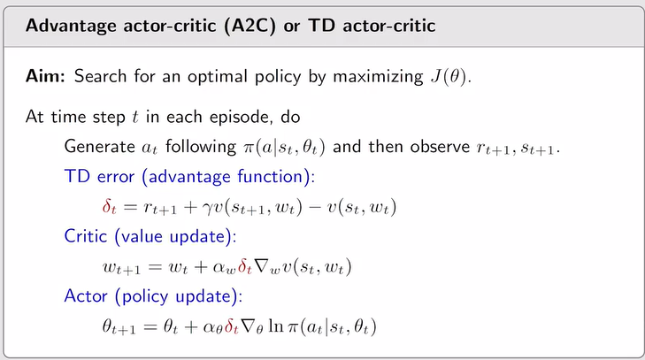
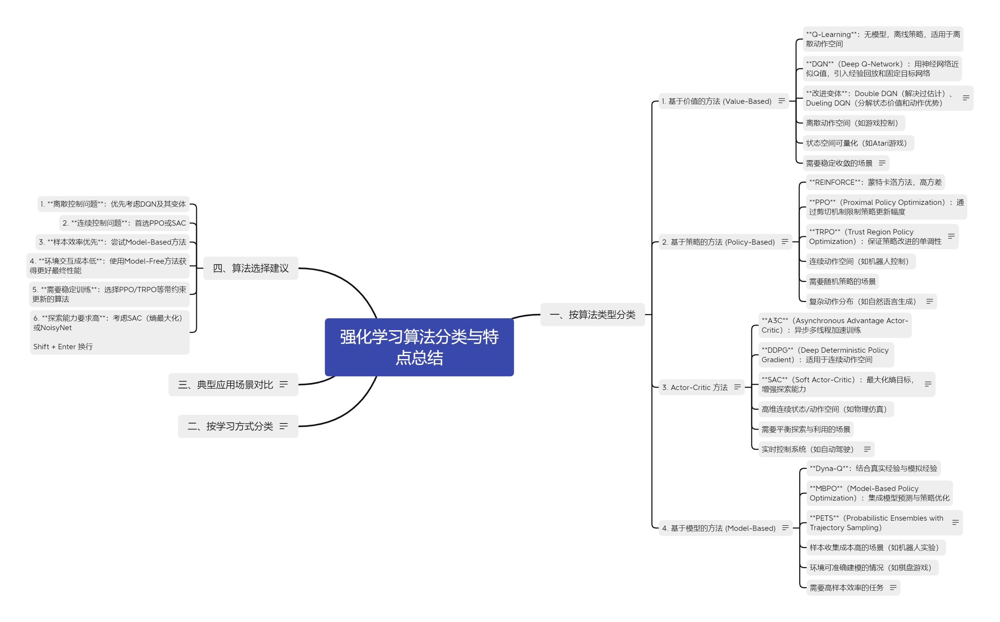

# 强化学习数学基础

## 概念定义

## State、action, reward，return

强化学习理论建立在马尔科夫链理论基础上，即这一步的action 选择只取决于当前状态，而与之前的状态无关。

### Policy:

基于当前状态选择当前action的规则就是Policy。 Policy  可以是确定的，也可以是一种概率分布。即选择不同action的概率。

### Reward:

在给定状态s 上，执行一个action ,就将得到环境反馈的reward\. 其代表了眼前这一个（S，A）即时步骤的收益。

Reward 可以正，可以负。 一般：

Reward 为正，代表鼓励这一步action; Reward 为负，我们叫Cost ,代表惩罚这一步action；

### Trajectory：

从起始state  经过一系列action，系统经过的state\-action\-reward 的chain 叫做轨迹。

### Return:

一条轨迹上的reward 经过discounted 得到的收益总和就叫Return\.

### State Value:

在一个状态下，根据给定的policy, 经历过很多条可能得轨迹之后，获得的return的期望叫做state value\.

- 如果policy 和系统环境都是确定性的，那其trajectory 就是固定的，所以其就是这条轨迹的return;

- 如果policy和系统环境 是概率分布，则其未来每一步的action  , 以及给定action 下一步的状态都是概率部分，其将来可能会有无数种轨迹，因此我们将各个轨迹的return 求数学期望就是state value\.

## Bellman  方程

一个状态的state value ，可以分为两部分：

- 从这个状态出发根据policy 采取各种action 后得到的即时reward 的期望

- 经过policy 采取各种action 后得到的新状态的state value 的期望

从上面的公式可以看出，state value 实际上由三个因素影响：

- Policy 给定状态选择各种action 的概率 $\pi(a|s)$

- 系统模型，其中又包括两部分：

    - 给定s,a 得到reward的概率分布

    - 在s 上执行a, 达到新状态 $s^{'}$的概率分布

## 【BOE】Bellman Optimality Equation

针对所有state 下都能达到最高state value 的policy  叫做最优policy\.

通常来说系统模型是确定的，而每个状态的state value 实际上由policy 决定，而强化学习的目的就是需要迭代的方式获得最佳的policy\.

既然，state  value 可以由action  value 计算出来，那么最直接简单的方式就是给定s 下，直接选action value 最高的那个action就行了。

另外这里可以看出，state value和action  value 是等价的，相互存在关系。他们都有policy 和系统模型决定，知道一个就可以计算得到另一个。

但是这里有个问题，一开始我们是不知道q\_star  的，所以这里我们就需要使用迭代的方式来求解。

- 根据state  value , 求得当前state  value 下的最优action ;

- 使用上一轮的最优action, 重新计算新的state  value ;

- 以此往复，直至收敛。

在具体的迭代方式上，我们有几种方法：

## Value iteration 

- Step1: PU: 根据当前的state value, 先计算Q value , 然后用greedy 算法去更新policy

- Step2: VU: 由新的Policy 去更新state value;

这里看到，一个系统可能有n个state ,每个state 下有m 个candidate action\. 

我们针对一个state S1, 计算这个state 下的最优action，然后更新policy 中，对应这个state S1 的最优action\. \(可以理解为Policy 是一个n的映射矢量，一次迭代实际上只是更新了状态矢量中的一个element ,然后立即用新的policy ，重新估计这个状态的value\)\.

## Policy Iternation

本质思想是用迭代解决先有鸡，还是先有蛋的问题。

- PE：既然state value 系统模型确定的前提下，只取决于Policy , 所以我们可以先猜一个初始的state value, 然后使用贝尔曼公式，迭代收敛给定policy 下的收敛的state  value\.

- PI: 然后有了给定policy 下精确的state  value , 我们就可以用state value 计算action  value , 然后使用greedy 算法更新policy\. 

- 然后重复的上面两步，在新policy下，进行PE，PI

## Truncated Policy Iteration

可以看到上面两种方式，实际上是类似的，使用的方法也一致，区别主要是更新policy前 ,state value的迭代程度。

Value iteration: state  value 在老的policy 下更新一次后，立即就去更新policy 了；

Policy iteration: state value 在老policy 下先迭代到收敛，然后用收敛的state value去更新policy\.

根据上面的总结，我们就知道value iteration 和policy  iteration 实际上是两个极端。自然的我就有了中间状态的idea , 在给定policy 下，我们对state value 迭代有限次数，再去PI。 这就是truncated policy iteration\.

## Monte Carlo Learning

上面的章节都是假定，我们已经知道系统模型了。但是大部分情况下，我们并不知道模型。这时我们就需要通过数据来获得对应的action  value\.

这里为什么我们直接用数据来训练获得action value? 

因为我们在优化policy  的时候，就是通过选择action value 最高的action 作为最优action\. 所以policy optimization 的输入就是action value（ $q_{(s,a)}$）\. 如果我们是去训练了state  value , 实际上是无法直接被policy optimization 直接使用的。

当我们有大量的数据时，就可以通过数据来统计每个action value\.

## MC Basic algorithm

最直接的方法，就是我们收集一个（s,a）下的很多次的value 值，然后对其求均值，那就得到了$q_{(s,a)}$ 的估计值。

## MC Exploring Starts

在统计得到一个action value 的过程中，我们会遇到两个问题：

1\.

通常我们获得的数据，是一条很长的轨迹（比如长达几十秒的视频），如果我们每次都只用整条轨迹的后续所有状态来估计第一个action 的value ,那效率就太低了。 

考虑到折扣系数的影响，实际上经过一定数量的action之后的action 基本不影响初始的action  value 了。 因此我们可以通过层叠式的方式，使用一条轨迹一次性训练多个action  value\.

2. 

第二个提高效率的方向是如何提供更新效率

MC basic 算法中，是需要先收集足够多的action value（ $q_{(s,a)}$）样本后，再计算得到对应action value 的期望； 然后由此期望去更新policy\(greedy 策略\)；这种策略显然效率较低（可以对应为上面的policy  iteration）；

MC exploring stars 中，则是每采集到一个或给定的几个action value 样本，就立即去更新policy，不是非要等到足够多样本后再去更新。其实这个思想就是对应上面的value iteration 和truncated policy iteration。

由此，我们得到了MC Exploring Starts 算法：

这里有几个细节需要注意：

- 整个action 的迭代是从整条轨迹的后方往前，计算更新action value\. 这样有个好处，如果一条轨迹中某个action value 出现了多次，实际上每一次action value 更新后，就会被用作下一次更新的基准（因为上游的action value是通过下游的action value 计算出来的）。这样效率更高;

## MC ε\-Greedy algorithm

- 由于在每次policy update的时候，我们需要确保，所有的action value都已经获得足够多的样本来估计action value的期望。但是这个如果是在确定性策略的情况下，很难保证。比如就是初始的已有策略就是不会选择到特定的action ,那么在已有的policy 不管我们怎么去experience , 对应的action 就是永远也不会被采样到。

- 为了解决这个问题，由此我们引入ε\-greedy policies 的概念

这里就是为了Balance between exploitation and exploration 。确保某个action即便一开始看起来不好，但是但是还是始终给一定的概率，这样能确保特定的action ,还是能够被选择到。

## 随机梯度下降

## Temporal\-Difference Learning

上面的MC 算法存在一个明显的缺陷，就是我们需要收集所有action  value足够多的样本后，才能去进行policy update\. 这样效率就会很低。

比如我们需要100个 $q_{(s,a)}$的采样来估计这个action  value , 非要收集满100 次的数据再去估计，那效率就太低了，也会浪费大量存储空间。 此时我们就可以使用RM 算法来处理，来一个采样，就跟新一次action value , RM  算法证明，这和最终一次性把100次的采样求平均的结果是一样的。 这样做的另一个好处是，我们没有必要真的等到拿到100个采样就去更新action value ,  每个action value 更新后，就可以立即用来更新估计其它action value。

由此我们就有了TD 算法：

根据随机近似理论，我们每得到一个随机变量的采样值，就可以立即用来对该随机变量数学希望的估计进行更新，只要采样足够多，最终其估计值会趋近于实际的期望值。根据我们估计的随机变量的值的不同，我们就有了不同的TD learning 算法：

## Basic TD learning 算法

当我们获得一连串轨迹的experience, 

我们从中每获得一段轨迹

就可以对 $s_t$的state value 进行一次估计，然后使用新的估计值对原有的state value 进行一次更新

其中 $\alpha_t(s_t)$是更新的比例，也叫学习率。

通过这个方式，我们就可以在轨迹的经历过程中，每经过一个状态就可以立即对该状态的state value 进行更新。

这里 $s_t$ 这一段轨迹上t 时刻的状态（比如状态A），  $s_{t+1}$ 则为轨迹上t\+1 时刻的状态（比如状态B）。

其中，在状态A变化到状态B的过程中，我们就可以根据这个过程中获得的即时reward 和状态B的state value来对状态A的 value进行新的估计； 已有的A的state  value 和 新估计出来A 的state value 的差，就是 TD error。

所以TD learning 的本质是，在轨迹发展过程中，用后一个状态的value 来估计前一个状态的value， 所以叫做时域差分。这里相对于MC learning，我们几乎是在轨迹经历的过程中，立即就在对所有的state value 进行连续的估计更新，而不需要真的去收集满足够的state 采样采取更新state value ,极大提高了效率。

这里可以想一下，为啥这个算法是有效且收敛的？ 某一次的更新，可能是与实际的state value 的期望值误差很大的，所以一次的更新不能保证state value 是在逼近期望的。但是只要我们经历了足够多的次数的更新，只要这个经历是符合概率分布的，最终我们都能逐渐收敛到期望值上的。

本质上，TD learning，是在给定policy的基础上，对各个s 的state vaue 的数学期望进行逐渐逼近估计。他并没有直接去优化policy ,但是我们可以在此基础上，首先使用TD 算法去逐渐 收敛迭代当前policy下所有state value 的期望值。基于这些state value 的期望估计值，我们就可以计算得到所有action value的数学期望。 然后使用greedy 算法去更新policy\.

### TD learning 算法收敛的条件：学习率需要满足一定条件

### TD learning和MC learning的对比

## SARSA 算法

上面的TD learning 只能是先估计给定policy 下的state , 但是state value ,无法直接用来进行policy optimization。 中间还需要有个state value 到action value的转换过程。既然如此，我们自然的会想到，跳过state value 估计，直接去估计action value。

这就是sarsa：

我们从经历的experience 轨迹中获得一段轨迹段：

类似于TD learning， 我们可以直接对action value来进行估计：

下面这个图帮助我们理解，假定我们处于这样一个系统中，状态A 上施加action a, 可能转移到（B,C，D三个状态），然后每个state上对应的又可以不同的action。 

然后我们在经历的一段轨迹中，获得这样一段采样，在时间t 时，在状态A上施加action a ，而在t\+1时刻，到达了状态B，并且我们又在状态B 上施加了action c。

从这个图，我就能理解为啥叫sarsa，应为action 是以s,a 定义的，所以两个action 就是sa ,sa, 中间还有一个即时收益r ,所以叫sarsa。

所以sarsa的思路和TD learning 是完全一样的，由后一个action 的value 和即时收益来估计当前action的value。

每一次对老的action value的新的估计，与老的估计的差值就是TD error， 我们根据这个差值对老的估计值进行一定比例（即学习率）的修正。

SARSA  算法收敛的条件，完全类似

如下是SARSA算法的伪代码：

- 这里有一点需要强调，就是policy  update 的步骤：

    - 我们使用老的policy, 生成一个SARSA过程，并以此，对 $q_{(s_t,a_t)}$进行更新。

    - 对一个 $q_{(s_t,a_t)}$进行更新后，我们立即就对老的policy 使用epsilon \-greedy 策略进行更新policy 获得新的Policy（t\+1）\.

    - 而当经过 $q_{(s_{t+1},a_{t+1})}$ 后到 $s_{t+2}$时，再往下选择 $a_{t+2}$时，我们就是使用新的Policy（t\+1）了。

    - 所以下一次policy 更新时，就是基于$s_{t+2}$，$a_{t+2}$ ，$r_{t+2}$ ,$s_{t+3}$，$a_{t+3}$ 了，所以policy 的更新频率只有s 转移频率的一半

## Expected Sarsa\& n\-step sarsa

在上面的sarsa 算法中，我们实际是只用$q_{(s_{t+1},a_{t+1})}$  的一次采样来估计$q_{(s_{t+1},a_{t+1})}$ 的期望。

如果能直接获得$q_{(s_{t+1},a_{t+1})}$  的数学期望，那就是expected sarsa，才是理论上sarsa的求解方式。所以sarsa只是expected sarsa的一种实际实现方式。因为我们不可能真的实现获得$q_{(s_{t+1},a_{t+1})}$  的真实期望值。

但是这里从expected  sarsa 我们可以发展出n\-step  sarsa。

- sarsa 中， 我们是使用老的policy 推了两步action， 的来估计 $q_{(s_t,a_t)}$，然后立即更新policy

- 而n\-step  sarsa 中，我们使用老的policy  再多推几步action，来估计 $q_{(s_t,a_t)}$，然后再更新policy

我们使用老的policy 直接采样n step  action 之后，再更新 $q_{(s_t,a_t)}$

所以sarsa 就是n\-step sarsa 算法n=2 时的一个特例。

## Q\-Learning

前面所有TD ，sarsa 的介绍，实际上现实中不会使用，都是为了引出Q\-learning。

和sarsa 唯一的不同是，在 $S_{t+1}$上我们不是按照已有policy 去随机采样action，而是直接采用老policy 下，对应s 下最优的action。

这样和SARSA不同的是Q\-Learning只需要SARS， 最后一个a 实际上是由behavior policy 决定的，不是采样出来的。

本质上，Q\-Learning是在使用 TD算法来求解BOE 方程，所以Q\-learning 不是在迭代估计所有的action  value, 而是直接估计的给定policy下的最优action value。

### On\-policy vs Off\_policy

On\-policy: 在生成轨迹的过程中，一边使用policy 生成轨迹，一边去更新policy\. 比如SARSA 算法。MC 算法。

Off\-policy: 在生成轨迹的时候，一直使用老的policy， 在使用老policy 获得足够多的轨迹采样后，再离线去更新老的policy 获得新的policy\.  这里Q\-Learning 就可以是off\-policy。

Off\-policy 有一个好处是，可以使用历史的数据，别人的数据来做训练。

Q\-Learning 中计算出来最优action的policy（tartget policy） 和用来生成轨迹的policy（behavior policy）可以不是一个policy\. 也即，Q\-Learning 计算更新出来的policy 有没有用来生成轨迹，如果是那target policy 同时也是behavior policy。

如下：

而我们使用一个老的policy （behavior policy）来生成轨迹， 然后基于所有生成的轨迹来进行迭代获得的policy 就是target policy ,此时target policy 没有用来生成轨迹，就是个off\- policy。

Off\-policy 有个好的优点是，我们可以使用一个更加exploratory 的policy去生成轨迹，是的尽快获得所有action 下的experience\. 但是在计算target policy 时，就可以直接使用greedy 策略。加快收敛。

## A unified point of view

所有一系列 TD Learning算法都可以理解为使用RM 算法来迭代毕竟state/action  value\.

唯一的区别就是TD target的计算方式不一样：

## Value Function Approximation

如果我们针对每个状态都用独立的离散变量来表征，就需要占用大量存储空间，尤其是存在大量状态空间的问题。因此我们使用一个函数来表征不同状态S下的value。这样我们只需要拟合出曲线的参数，并存储这些参数就行了。当结合深度学习时，我们就可以使用神经网络来，拟合这些state  value function 的函数表征，并记录神经网络的权重参数。

使用函数表征系统状态value，还有一个好处就是可以利用其泛化性：

因为基本是系统状态的变化是连续可导的，当我们更新了一个状态的state value时，可以自动的联动的调整附近的状态的value。

因此当我们使用神经网络来表征state /action value 时，就把估计所有状态和action 空间上离散量value的任务转换成了，识别神经网络参数来使得神经网络拟合出来的曲线尽量贴近实际的state、action 空间上value。

当我们在进行拟合的时候，可以使用不同的策略，比如有些状态我们比较重视，我们就可以对这些状态给较大的权重，这样在拟合时，我们可以提高这些状态上的拟合精度，而牺牲不太重要的状态上拟合精度。

典型的有两种distribution 方式：

- uniform distribution 每一个状态都同等重要，其权重是均匀分布的probability of each state as 1/\|S\|\.

- stationary distribution 我们可以针对不同的状态s 定义不同的重要性，这里又有两种定义方式：

    - 我们可以直接主观的定义一个基于s的权重分布函数，这个函数是自己定义的

    - 我们直接将状态重要程度等价为该状态被访问的概率，即该状态被仿真的概率越高，就越重要

无论哪种定义方式，参数拟合时，都用 $d_{\pi}(s)$这个权重函数来表征。只不过第二种方式是，这个权重函数直接就等于状态被访问的概率分布。

这里我们理解下，为啥叫stationary distribution ？ 

在第二种定义方式时，如果我们已知系统状态转移概率矩阵，我们就可以直接以这个矩阵的特征向量作为distribution 分布。

或者我们可以换个解释的方式，如果我们已知一个状态转移概率矩阵， 我们按这个概率部分采样很多次后，作用我们处于每个状态的概率将稳定在一个分布上，即 $d_{\pi}(s)$。这也是为什么这个分布叫做静态/稳态分布。

## 参数拟合的优化算法

根据上面的介绍，我们就将对state value 使用一个函数（网络）来表征的问题，等效成了一个求解函数（网络）的参数，使得函数在每个状态上value的加权误差最小的优化问题。

目标函数为

即，求最佳参数w, 使得 $J（w）$最小。

根据优化理论中，最简单的梯度下降法：

我们可以通过沿着当前参数下，J函数的梯度方向进行迭代来逐渐逼近最优参数w\.

而目标函数的梯度可以表征为 

其中 $v_{\pi}(S)$为对应状态空间上的value的真值（当然我们是不知道的，但是其由实际系统的policy 和系统状态有关，但是和拟合曲线的参数没有关系）

而 $\hat {v}(S,w)$则是用来表征所有状态空间上value 的曲线（网络），其由曲线的形式（网络的结构）以及对应参数共同决定。

将其代入梯度下降迭代公式，我们就得到了如下参数优化迭代公式：

但是这个公式里状态空间上的value 真值我们是不知道的？那我们怎么办呢？ 这是就由用到了之前的知识：

## MC/TD learning with function approximation

通过MC 或TD 算法，使用大量数据来逐渐逼近真值。

- 如果用MC法来求解$v_{\pi}(S)$则需要提前收集到足够多的$v_{\pi}(s)$，然后求均值后获得gt。 当然这种方法之前说过效率太低，基本不会使用

- 如果用TD法 通过足够多次的采样来逼近$v_{\pi}(S)$，就是如下公式

这里需要理解下：

- 每采样一次状态转移，就立即估计下对应的状态value；

- 然后用新的估计的状态value，去计算拟合曲线的迭代步长

- 根据迭代步长和曲线的梯度，来决定参数的修正量

- 所以这种方式实际上是把state value 估计过程和拟合曲线参数的优化工程放在一起同时进行了，只要数据量足够大，最后state value 就能逐渐逼近真值，而曲线拟合结果也能逐渐贴近真值。

- 需要注意的是这里类似SARSA和TD Learning，所做的工作还是这对给定policy 下的state value 进行迭代逼近， 并没有去做policy update\. 

## Sarsa with function approximation

上面我们使用TD Learning配合value function来表征的state value的分布，自然的我们会过度到SARSA算法，使用value functio 来直接拟合action value的分布。

只要把state value 用action value替代，就得到了sarsa 下值函数近似的算法

- 类似的Sarsa with function approximation 也只是用函数（网络）去逼近action value的分布拟合，如果要去update policy 还需要配合policy optimization 策略

- 同样的，这个公式里，实际上是把action value 估计过程和拟合曲线参数的优化工程放在一起同时进行了

## Q\-learning with function approximation

按照上一届TD Learning 算法的发展，自然的我们开始引入 使用函数（模型）来直接迭代最优action 的算法。

取决于每次对policy 更新后，是否马上用新的policy去生成轨迹， 我们有on\-policy 和off\-policy 两种版本的q\-Learning function approximation:

这里policy 每update 一次就会立即用来生成新的轨迹。

## Deep Q\-learning or deep Q\-network \(DQN\)

这里我们不再使用简单的off\-policy Deep Q\-learning， 而是直接使用DQN，这是基于原始的off\-policy Deep Q\-learning 基础上发展而来的一个非常经典实用的算法。到今天还在被广泛使用。

这里我们特地把使用神经网路来表征action value的分布拟合，且使用off\-policy 的方式来更新policy 的算法叫做DQN。

在DQN 中，目标函数为

前面这部分

实际上就是数学期望意义上的最优action value 。 而我们就是想要用一个神经网络来近似这个最优action value\.

当我们使用梯度下降法迭代w 时，就需要对w 求导，这里

因为还涉及到对action 查找最大值，此处对w 的求导就很难处理。这里DQN 里就使用一个tricky 的方法，即：

- 使用两套网络的参数，进行分步迭代

这里实际使用两套参数w 来表征两个网络：

其中红色这部分网络使用一套参数wt, 这个网络叫target network；

蓝色这部分网络用一套参数w, 这个网络叫behavior network;

我先使用初始的targer network 去计算 $\hat{y}$, 然后使用采集到的experience 数据，使用如下公式去更新behavior network 的参数w\. 当w 迭代充分后，再将behavior network 的参数w 去替换target network 的参数wt；

$w_{t+1}=w_{t}+\alpha_{t}\left[\hat{y}-\hat{q}\left(s_{t}, a_{t}, w_{t}\right)\right] \nabla_{w} \hat{q}\left(s_{t}, a_{t}, w_{t}\right)$

这样实际上将一个复杂的迭代过程算法处理成一个内外层反复迭代的过程（这也是优化问题的常规思路）

- DQN  的另一个突破是使用了Experience replay 方法

我们在采样得到的数据中，如果只使用一次，实际上是很大的浪费。只要采样的数据能够符合系统的概率分布特征，我们就可以反复使用，来让迭代使用较少的数据尽快收敛 \.

- 这里有几个主要点：收集的sample  并不按照原有采样时的顺序排序

- 我们在迭代时按照均匀概率采样去获取sample 

## Policy Gradient Methods

之前的TD和DQN 算法都是去迭代逼近value \(不管是state value，还是action value\), 所以最后我们还是要通过policy update 方法去最终实现policy的优化。

本节中，我们直接跳过value， 直接使用神经网络去表征最优policy

这个policy 有参数 $\theta$表征的神经网络，s 为输入，输出为最优action的分布。这样就跳过了中间商，直接去学习优化policy 了。

## Metrics to define optimal policies

也就是定义优化policy 的目标函数， 有几种定义：

### average state value

即将所有状态的value以加权平均的方式计算出来。 

这个权重分布的设计有两种：

第一种，d\(s\)和policy 无关 ，典型的将所有的state 设为同等重要 

第二种，d\(s\)依赖于policy , 典型的设计为stationary distribution under $\pi$, 这个在上一章已经介绍过，不再赘述。

此时，某个状态在给定policy 下，被选中的概率越高，权重就越大。

这里需要记住的是，stationary distribution 下的average state value 函数，有第二种表达方式：

### average one\-step reward

另一种目标函数的设计是，我们将所有状态下，执行各个action的value 计算概率加权平均（就是数学期望）

这里有两个加权平均：

第一个，针对每个状态，我们根据对应的policy  会产生选择各个action 的概率，以及各个action 产生的即时reward，由此计算出一个state 下获得即时reward的加权平均；

第二个，是每个s 都使用stationary distribution，所有state 的加权平均就是对应policy 下的加权即时reward\.

这里考虑到stationary distribution 的性质，实际上可以average one\-step reward 的第二种定义，按照policy 状态experience 无穷多步后，所有reward 的平均值。

需要注意的是，average state value 和average one\-step reward 之间是满足比例关系的

## Gradients of the metrics

有了目标函数，我们就可以根据对目标函数使用梯度上升法（因为是reward, 收益越高越好）来对神经网络的参数进行迭代优化。这里先死记一下，推导后面看书。

如果J为$\bar{r}_{\pi}$

如果J为 $\bar{v}_{\pi}$:

目标函数的梯度推导

因为

这样就可以把policy 概率置换出来，用来表达成期望值。 而随机近似理论，我们只能使用大量采样数据来逼近期望值。

## Gradient\-ascent algorithm

最终根据目标函数的梯度，我们可以得到神经网络参数的迭代公式：

由于数学期望无法直接得到，我们根据随机近似理论最终通过大量采样, 通过如下公式来逼近：

每获得一次采样就立即通过如下公式去更新模型参数：

### 对于梯度上升算法的迭代步长的理解：

- 如果某个acton  value 值越大，我们迭代的步长就越大（代表了信息利用）

- 如果某个action 在现有策略中，采用的概率越低，，迭代的步长就越大（代表了探索）

## Actor\-critic 方法

使用TD算法来计算梯度上升算法中的q value 就是ac 算法了。

这里可以先宏观的理解下：

Actor : 就是用来表征policy 的网络

Critic:  就是用用来表征现有策略下，state  value /action  value 的网络，也就是用来评价当前policy的网络

## QAC \(Q value actor\-critic\)

QAC 其实就是Gradient\-ascent algorithm 算法的一种实现方式。

当q\_t 用神经网络来表征，且用TD 算法（主要是SARSA）来更新时，就是QAC了。（SARSA\+ Q value function approximation）

- 因为每次更新 q value 跟新后，立即就就更新policy。 新的policy 就会用来生成新的trajectory sampling，所以属于on\-policy 算法。

- 由于policy \( $\pi(a |s, \theta)$\) 在深度学习网络中输出时使用了softmax 转换，所以天然就是\>0 ,\<1 的，所以不需要使用epislon greedy 策略来更新了。

## \(A2C\)Advantage Actor \-Critic

在QAC 基础上我们引入一个基准修正量以减少

如果我们不做这个基准修正，实际上所有的action 基准量就是0， 当我们使用0 来计算方差时，方差会比较大。实际上，我们在评价一个s 下的所有action 的好坏时，并不关心action  value 的具体值，而是关心其相对于平均值的分差值。

为此，我们使用对应state 的value估计来作为比较基准，

- Q value高于基准值的说明比平均值更好，应该增加其采样概率

- Q value低于基准值的说明比平均值更差，应该降低其采样概率

这我们将Q value相对于state value 的偏差函数，叫做advantage function（优势函数）。

我们在评价一个s 下的所有action 的好坏时，并不关心action  value 的具体值，而是关心其相对于平均值的分差值。比如一个action，即便其value 为1亿，但是其它action 的value都是2亿，那1亿action还是一个差的action；

而如果一个action 的value为0，但是其它action的value都是负值，则其还是个最佳的action。因此我们在更新policy 时，直接使用优势函数来更新策略更好。

优势函数又可以通过state value 来表征： 这样我就不需要使用两个模型来分别表征action、state value 了。直接使用一个模型来表征state value就行了。

### A2C伪代码

- 可以看到A2C 也是on\-policy。

- 注意这里因为我们不再使用action value而是使用state value 了，所以value update 的时候，我们更新的是state value \(参见basic TD learng with function approximation\)

## Off\-policy Actor\-critic

当我们想要使用历史数据（由其它网络采样到的experience trajectory）来训练新的模型时，我们就面临一个问题：

当时的数据是有，参数 $\theta$的模型产生的； 而我们一旦对模型的参数进行迭代后，原有的数据就不符合新的模型参数的分布了，我们就无法使用老的数据了。

为了充分利用历史数据，我们需要想办法让历史数据能够被新的模型使用，此时就映入了重要性采样的概念。

我们可以使用新的模型参数与老模型参数下的policy 概率的比例修正，是的老的数据可以继续被使用：

这样实际上我们每对target network 更新后，再次使用历史数据时，就需要对历史数据进行重要性权重修正，以休会历史数据产生时模型policy 概率与当前新target netwok 概率的偏差。

最后我们以上的修正公式代入到A2C算法中，就得到off\-policy 的Acto\- critic 算法：

公式1和2是等价的，实际我们算法使用的时候，用的是公式1。 公式2 帮助我们理解这公式的思想。

## DPG\(determinsic policy  gradient\)

当action 空间是连续的时，就无法通过概率来给出policy输出了。只能给出一个确定的action。

## PPO （Proximal Policy Optimization）

PPO 是使用了一系列特殊算法的的actor\-critic 类算法：可以认为在基础的off\-policy A2C算法基础上使用了如下技术：

- 使用GAE算法来计算优势函数

- PPO 1 使用KL 散度加入目标函数来避免前后两个policy 差的太多； 而PPO 2 则直接使用clip 方法对重要性采样进行限制，避免前后两个策略差异过大；

### 基础复习：

PPO基本是建立在off\-poliy A2C的基础上，所以我们先复习下A2C 的技术点：

- 使用Baseline  来降低Q function 的方差；

- 使用TD 方式来计算TD error ,且只使用state value function 而不再需要使用action value function

- 由state value function 计算Advantage function

- 使用importance sampling 来进行off\-policy 学习，从而使用老模型的采样数据，提供数据的使用效率

在此基础上PPO还使用了几个新的技术：

- 在计算TD error 时使用GAE 方式加权计算得到n\-step value funtion ,从而可以兼顾偏差和方差

- 在进行importance sampling 时，使用clip 方式对前后两个模型的importance ratio 进行限制，防止新模型一次性学习后就与老模型相差太大

### GAE\(general advantange estimation\)

以上优势函数的表达其实是一种最简单的特例，结合我们之前学习的n\-step SARSA 的概念，其实同样的我们可以用不同step 的TD target 来计算优势函数：

当只用一步时，就是上面的最基础的A2C算法。

- 这里计算TD target的步数越多，就对v\(s\)的依赖越小，但是其方差就会越大，bias 越小；

- 而步数越小，就对v\(s\)的依赖越大，一旦当前V\(s\)估计较大时，收敛就会特别慢，bias 越大

为了充分结合不同步数td target的优势，我们使用不同步的td target 的加权值来计算优势函数，就可以平衡bias 和方差。这就叫做general advantange estimation

### Importance Clip

该clipped term可以在更新策略的时候，使得下面更新公式 ∇θJ\(πθ\) （在1\.2中提到）梯度项的系数项 πθ\(st,at\)πθold\(st,at\)A\(st,at\) 将会在超出一定范围后受到clipped（即限制更新步长从而限制新旧策略的差异性）

## DPO

## 强化学习算法分类

[强化学习算法分类与特点总结\.xmind](https://xn66aq7lol.feishu.cn/file/CYl6bkHfaofHunxnMbpcgC8wn8b)

https://cs\.uwaterloo\.ca/\~ppoupart/teaching/cs885\-spring18/schedule\.html

